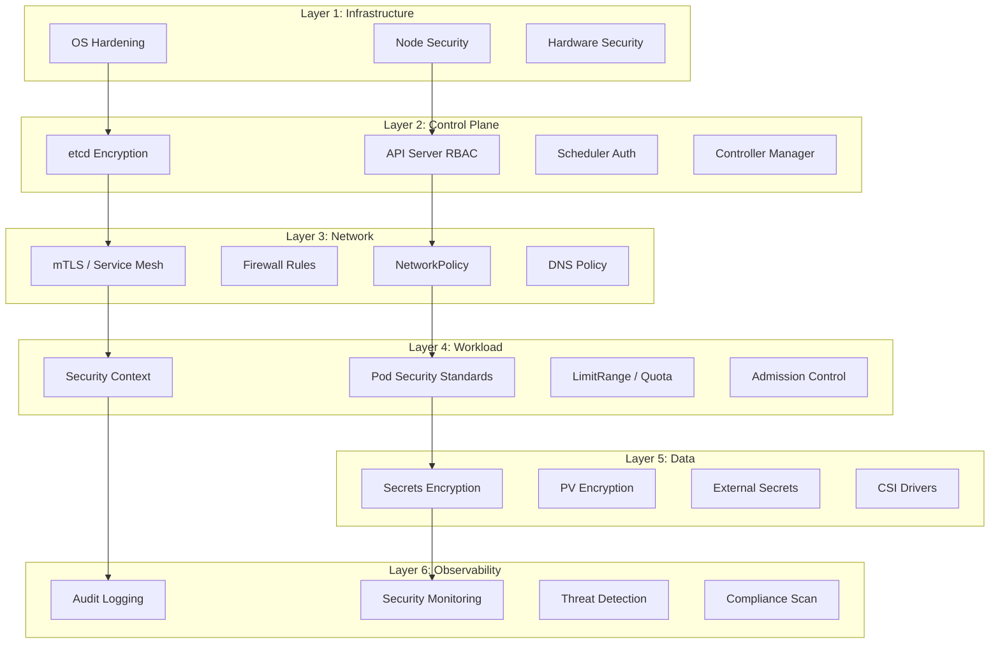

title: [[Kubernetes|Kubernetes]] 安全加固深度实践
description: '# Kubernetes 安全加固深度实践'
category: cloud-native-security
tags:
- k8s
- security
- cloud-native
- [[Falco|falco]]
- opa
- [[etcd|etcd]]
- apiserver
- kubelet
- scheduler
- prometheus
last_updated: 2026-05
difficulty: advanced
reading_level: advanced
audience:
- 安全工程师
- SRE
- 架构师
estimated_read_time: 5min
intent_queries:
- Kubernetes 安全加固深度实践 是什么
- 如何 Kubernetes 安全加固深度实践
- Kubernetes 25 cloud native security 最佳实践
trigger_keywords:
- Kubernetes
- 安全加固深度实践
- cloud
- native
- security
cross_refs:
- type: cheatsheet
  path: ../domain-17-system-foundation/topic-cheat-sheet/tls-pki.md
  label: '速查卡: tls-pki'
authors:
- name: KUDIG Team
  role: contributor
k8s_versions:
- '1.28'
- '1.29'
- '1.30'
- '1.31'
- '1.32'
---

# Kubernetes 安全加固深度实践

> **Author**: Cloud Native Security Architect | **Version**: v1.0 | **Update Time**: 2026-05-18
> **Scenario**: CIS Benchmark, Pod Security Standards, Network Policies, Secrets Encryption | **Complexity**: ⭐⭐⭐⭐⭐

<!-- chunk: 概述 -->## 概述

Kubernetes 安全加固是构建安全云原生基础设施的基础工作。从集群控制平面到工作负载运行时，从网络通信到密钥存储，每一个层级都需要针对性的安全配置和策略执行。根据 CIS（Center for Internet Security）Kubernetes Benchmark，一个标准的生产级 Kubernetes 集群需要超过 100 项安全配置检查，涵盖 API Server、etcd、kubelet、网络策略、RBAC 等多个维度。

本文系统性地介绍 Kubernetes 安全加固的完整方案，包括 CIS Benchmark 合规检查、Pod Security Standards 实施、网络隔离策略设计、Secrets 加密配置、安全上下文管理和运行时防护，帮助企业在多层防御体系下构建安全的 Kubernetes 集群。

#<!-- chunk: 威胁模型分析 -->## 威胁模型分析

Kubernetes 集群面临的安全威胁来自多个攻击向量，需要分层防御：

**控制平面攻击**：攻击者通过未授权的 API Server 访问、etcd 数据泄露或控制平面组件漏洞获取集群控制权。CIS Benchmark 对控制平面组件的安全配置提供了详细指南，包括认证、授权、加密传输和安全审计配置。

**工作负载逃逸**：恶意容器通过特权模式、主机命名空间共享、危险能力挂载等方式突破容器隔离，获取宿主机访问权限。Pod Security Standards 定义了三个安全级别（Privileged/Baseline/Restricted），限制工作负载的危险配置。

**网络横向移动**：默认情况下 Kubernetes 集群中所有 Pod 可以自由通信，攻击者入侵一个 Pod 后可横向扫描和攻击其他服务。NetworkPolicy 提供命名空间和 Pod 级别的网络隔离能力。

**密钥泄露**：Secrets 默认以 base64 编码存储在 etcd 中，如果 etcd 未加密或访问控制不当，攻击者可获取所有密钥。Kubernetes 支持静态加密和外部密钥管理系统集成。

**供应链攻击**：使用未验证的容器镜像可能引入恶意代码。镜像签名验证和准入控制可确保仅部署受信任的镜像。

<!-- chunk: 架构设计 -->## 架构设计

#<!-- chunk: Kubernetes 多层安全架构 -->## Kubernetes 多层安全架构



#<!-- chunk: 安全加固检查清单 -->## 安全加固检查清单

```yaml
kubernetes_hardening_checklist:
  control_plane:
    - "API Server: 禁用匿名访问"
    - "API Server: 启用 RBAC"
    - "API Server: 配置审计日志"

> ⚠️ **弃用警告**: `PodSecurityPolicy` 已在 Kubernetes v1.25 中正式移除。
> 请使用 [Pod Security Admission (PSA)](https://kubernetes.io/docs/concepts/security/pod-security-admission/) 替代。
> PSA 通过命名空间标签强制执行 Pod 安全标准 (Privileged / Baseline / Restricted)。

    - "API Server: 启用 PodSecurityPolicy 替代 (PSS)"
    - "etcd: 启用 TLS 加密通信"
    - "etcd: 启用静态数据加密"
    - "etcd: 限制访问权限"
    - "kubelet: 禁用匿名访问"
    - "kubelet: 配置认证和授权"

  networking:
    - "默认拒绝所有 ingress/egress"
    - "命名空间级别网络隔离"
    - "CNI 插件支持 NetworkPolicy"
    - "Service Mesh mTLS"

  workloads:
    - "Pod Security Standards: Restricted 模式"
    - "禁止特权容器"
    - "禁止主机命名空间共享"
    - "强制资源限制"
    - "只读根文件系统"
    - "禁止权限提升"

  data_protection:
    - "Secrets 静态加密"
    - "外部密钥管理 (Vault)"
    - "PV 加密"
    - "备份加密"

  observability:
    - "API 审计日志"
    - "安全事件监控"
    - "合规持续扫描"
    - "运行时威胁检测"
```

<!-- chunk: 核心配置 -->## 核心配置

#<!-- chunk: CIS Kubernetes Benchmark 合规 -->## CIS Kubernetes Benchmark 合规

CIS Kubernetes Benchmark 是业界公认的 Kubernetes 安全配置基线。以下配置对照 CIS Benchmark 的关键检查项进行加固：

```yaml
# kube-apiserver 安全配置
apiVersion: v1
kind: Pod
metadata:
  name: kube-apiserver
  namespace: kube-system
spec:
  containers:
    - command:
        - kube-apiserver
        # CIS 1.2.1 - 禁用匿名访问
        - --anonymous-auth=false
        # CIS 1.2.2 - 配置令牌认证文件
        - --token-auth-file=/etc/kubernetes/pki/tokens.csv
        # CIS 1.2.6 - 启用 RBAC
        - --authorization-mode=Node,RBAC
        # CIS 1.2.7 - 启用 Node 限制
        - --enable-admission-plugins=NodeRestriction,PodSecurity,LimitRanger,ServiceAccount,PersistentVolumeLabel,DefaultStorageClass,ResourceQuota,DefaultTolerationSeconds,ValidatingAdmissionPolicy
        # CIS 1.2.8 - 配置 TLS
        - --tls-cert-file=/etc/kubernetes/pki/apiserver.crt
        - --tls-private-key-file=/etc/kubernetes/pki/apiserver.key
        # CIS 1.2.9 - 配置 etcd CA
        - --etcd-cafile=/etc/kubernetes/pki/etcd/ca.crt
        - --etcd-certfile=/etc/kubernetes/pki/apiserver-etcd-client.crt
        - --etcd-keyfile=/etc/kubernetes/pki/apiserver-etcd-client.key
        # CIS 1.2.11 - 配审计日志
        - --audit-log-path=/var/log/kubernetes/audit.log
        - --audit-log-maxage=30
        - --audit-log-maxbackup=10
        - --audit-log-maxsize=200
        - --audit-policy-file=/etc/kubernetes/audit-policy.yaml
        # CIS 1.2.15 - 绑定安全端口
        - --secure-port=6443
        # CIS 1.2.16 - 禁用不安全端口
        - --port=0
        # CIS 1.2.19 - 启用聚合路由
        - --profiling=false
        # CIS 1.2.20 - 配置请求超时
        - --request-timeout=300s
        # CIS 1.2.22 - 启用 ServiceAccount 令牌卷投影
        - --service-account-key-file=/etc/kubernetes/pki/sa.pub
        - --service-account-lookup=true
        - --service-account-issuer=https://kubernetes.default.svc.cluster.local
        - --service-account-jwks-uri=https://kubernetes.default.svc.cluster.local/openid/v1/jwks
        # CIS 1.2.27 - 加密配置
        - --encryption-provider-config=/etc/kubernetes/encryption-config.yaml
        # 加密 etcd 通信
        - --etcd-servers=https://127.0.0.1:2379
```

#<!-- chunk: 审计策略配置 -->## 审计策略配置

```yaml
# /etc/kubernetes/audit-policy.yaml
apiVersion: audit.k8s.io/v1
kind: Policy
rules:
  # 记录 Secret 访问（含请求体）
  - level: RequestResponse
    resources:
      - group: ""
        resources: ["secrets"]
    namespaces: ["production", "payment"]
    omitStages:
      - RequestReceived

  # 记录工作负载变更
  - level: RequestResponse
    resources:
      - group: "apps"
        resources: ["deployments", "statefulsets", "daemonsets"]
      - group: "batch"
        resources: ["jobs", "cronjobs"]
    verbs: ["create", "update", "patch", "delete"]
    omitStages:
      - RequestReceived

  # 记录 RBAC 变更
  - level: RequestResponse
    resources:
      - group: "rbac.authorization.k8s.io"
        resources: ["roles", "rolebindings", "clusterroles", "clusterrolebindings"]
    omitStages:
      - RequestReceived

  # 记录 Namespace 变更
  - level: RequestResponse
    resources:
      - group: ""
        resources: ["namespaces"]
    verbs: ["create", "update", "delete"]

  # 记录准入控制配置变更
  - level: RequestResponse
    resources:
      - group: "admissionregistration.k8s.io"
    verbs: ["create", "update", "patch", "delete"]

  # 其他请求仅记录元数据
  - level: Metadata
    omitStages:
      - RequestReceived
```

#<!-- chunk: Secrets 静态加密配置 -->## Secrets 静态加密配置

```yaml
# /etc/kubernetes/encryption-config.yaml
apiVersion: apiserver.config.k8s.io/v1
kind: EncryptionConfiguration
resources:
  - resources:
      - secrets
    providers:
      - aescbc:
          keys:
            - name: key1
              secret: <BASE64_ENCODED_SECRET_32BYTES>
      - identity: {}
```

```bash
#!/bin/bash
# setup_encryption.sh

# 1. 生成加密密钥
ENCRYPTION_KEY=$(head -c 32 /dev/urandom | base64)

# 2. 创建加密配置
cat > /etc/kubernetes/encryption-config.yaml << EOF
apiVersion: apiserver.config.k8s.io/v1
kind: EncryptionConfiguration
resources:
  - resources:
      - secrets
    providers:
      - aescbc:
          keys:
            - name: key1
              secret: ${ENCRYPTION_KEY}
      - identity: {}
EOF

# 3. 重启 API Server 加载配置
systemctl restart kube-apiserver

# 4. 验证加密生效
kubectl get secrets --all-namespaces -o json | \
  jq -r '.items[] | select(.type=="Opaque") |
    "\(.metadata.namespace)/\(.metadata.name): \(.data | keys | length) keys"'

# 5. 加密现有 Secrets
kubectl get secrets --all-namespaces -o json | \
  jq '.items[] | .metadata.annotations["kubernetes.io/encrypt"] = "true"' | \
  kubectl apply -f -

# 6. 验证 etcd 中的数据已加密
ETCDCTL_API=3 etcdctl get / --prefix --keys-only \
  --endpoints=https://127.0.0.1:2379 \
  --cacert=/etc/kubernetes/pki/etcd/ca.crt \
  --cert=/etc/kubernetes/pki/etcd/server.crt \
  --key=/etc/kubernetes/pki/etcd/server.key | \
  grep -c "k8s:enc:aescbc:v1:key1"
```

#<!-- chunk: KMS 加密（生产级） -->## KMS 加密（生产级）

对于生产环境，建议使用 KMS（Key Management Service）提供者进行 Secrets 加密，支持 AWS KMS、Azure Key Vault、Google Cloud KMS 等云服务：

```yaml
# /etc/kubernetes/encryption-config-kms.yaml
apiVersion: apiserver.config.k8s.io/v1
kind: EncryptionConfiguration
resources:
  - resources:
      - secrets
    providers:
      - kms:
          name: aws-kms
          endpoint: unix:///var/run/kmsplugin/socket
          cachesize: 1000
          timeout: 3s
      - aescbc:
          keys:
            - name: key1
              secret: <FALLBACK_KEY_BASE64>
      - identity: {}
```

#<!-- chunk: kubelet 安全加固 -->## kubelet 安全加固

```yaml
# /var/lib/kubelet/config.yaml
apiVersion: kubelet.config.k8s.io/v1beta1
kind: KubeletConfiguration
# CIS 4.2.1 - 禁用匿名访问
authentication:
  anonymous:
    enabled: false
  webhook:
    enabled: true
  x509:
    clientCAFile: /etc/kubernetes/pki/ca.crt
# CIS 4.2.2 - 配置授权模式
authorization:
  mode: Webhook
# CIS 4.2.3 - 配置 TLS
serverTLSBootstrap: false
# CIS 4.2.4 - 配置证书轮换
rotateCertificates: true
# 安全配置
protectKernelDefaults: true
# CIS 4.2.6 - 禁用只读端口
readOnlyPort: 0
# CIS 4.2.8 - 配置事件记录
eventRecordQPS: 50
eventBurst: 100
# CIS 4.2.10 - 配置流控制
streamingConnectionIdleTimeout: "5m"
# CIS 4.2.11 - 配置进程优先级
makeIPTablesUtilChains: true
# 镜像拉取凭据保护
imageMinimumGCAge: "2m"
imageGCHighThresholdPercent: 85
imageGCLowThresholdPercent: 80
# 安全审计
enableDebuggingHandlers: false
```

<!-- chunk: 安全策略实战 -->## 安全策略实战

#<!-- chunk: Pod Security Standards 实施 -->## Pod Security Standards 实施

Pod Security Standards（PSS）是 Kubernetes 内置的 Pod 安全策略框架，定义了三个安全级别。Privileged 模式不做任何限制，适用于系统组件。Baseline 模式禁止已知的危险提升权限策略。Restricted 模式在 Baseline 基础上进一步加固，强制要求安全上下文配置：

```yaml
# 命名空间级别实施 Restricted PSS
apiVersion: v1
kind: Namespace
metadata:
  name: production
  labels:
    pod-security.kubernetes.io/enforce: restricted
    pod-security.kubernetes.io/enforce-version: v1.33
    pod-security.kubernetes.io/audit: restricted
    pod-security.kubernetes.io/audit-version: v1.33
    pod-security.kubernetes.io/warn: restricted
    pod-security.kubernetes.io/warn-version: v1.33
---
# 命名空间级别实施 Baseline PSS（用于需要宽松配置的组件）
apiVersion: v1
kind: Namespace
metadata:
  name: monitoring
  labels:
    pod-security.kubernetes.io/enforce: baseline
    pod-security.kubernetes.io/enforce-version: v1.33
    pod-security.kubernetes.io/audit: restricted
    pod-security.kubernetes.io/warn: restricted
---
# 系统命名空间允许特权模式
apiVersion: v1
kind: Namespace
metadata:
  name: kube-system
  labels:
    pod-security.kubernetes.io/enforce: privileged
    pod-security.kubernetes.io/audit: baseline
    pod-security.kubernetes.io/warn: baseline
```

#<!-- chunk: 完整 SecurityContext 模板 -->## 完整 SecurityContext 模板

```yaml
apiVersion: apps/v1
kind: Deployment
metadata:
  name: secure-app
  namespace: production
spec:
  replicas: 3
  selector:
    matchLabels:
      app: secure-app
  template:
    metadata:
      labels:
        app: secure-app
    spec:
      serviceAccountName: secure-app-sa
      automountServiceAccountToken: false
      securityContext:
        runAsNonRoot: true
        runAsUser: 1001
        runAsGroup: 1001
        fsGroup: 1001
        fsGroupChangePolicy: "OnRootMismatch"
        seccompProfile:
          type: RuntimeDefault
        supplementalGroups:
          - 1001
        sysctls: []
      containers:
        - name: app
          image: registry.company.com/app:v1.2.3@sha256:abc123
          securityContext:
            allowPrivilegeEscalation: false
            readOnlyRootFilesystem: true
            runAsNonRoot: true
            runAsUser: 1001
            capabilities:
              drop:
                - ALL
          ports:
            - containerPort: 8080
          resources:
            requests:
              cpu: 100m
              memory: 128Mi
            limits:
              cpu: 500m
              memory: 512Mi
          volumeMounts:
            - name: tmp
              mountPath: /tmp
            - name: cache
              mountPath: /app/cache
            - name: config
              mountPath: /app/config
              readOnly: true
      volumes:
        - name: tmp
          emptyDir:
            medium: Memory
            sizeLimit: "64Mi"
        - name: cache
          emptyDir:
            sizeLimit: "128Mi"
        - name: config
          configMap:
            name: app-config
            defaultMode: 0444
      topologySpreadConstraints:
        - maxSkew: 1
          topologyKey: kubernetes.io/hostname
          whenUnsatisfiable: DoNotSchedule
          labelSelector:
            matchLabels:
              app: secure-app
```

#<!-- chunk: NetworkPolicy 网络隔离 -->## NetworkPolicy 网络隔离

```yaml
# 默认拒绝所有流量（每个命名空间的基线策略）
apiVersion: networking.k8s.io/v1
kind: NetworkPolicy
metadata:
  name: default-deny-all
  namespace: production
spec:
  podSelector: {}
  policyTypes:
    - Ingress
    - Egress
---
# 允许 DNS 出站
apiVersion: networking.k8s.io/v1
kind: NetworkPolicy
metadata:
  name: allow-dns-egress
  namespace: production
spec:
  podSelector: {}
  policyTypes:
    - Egress
  egress:
    - to:
        - namespaceSelector: {}
          podSelector:
            matchLabels:
              k8s-app: kube-dns
      ports:
        - port: 53
          protocol: UDP
        - port: 53
          protocol: TCP
---
# 应用层网络策略：前端 → 后端 → 数据库
apiVersion: networking.k8s.io/v1
kind: NetworkPolicy
metadata:
  name: frontend-policy
  namespace: production
spec:
  podSelector:
    matchLabels:
      tier: frontend
  policyTypes:
    - Ingress
    - Egress
  ingress:
    - from:
        - namespaceSelector:
            matchLabels:
              name: ingress-nginx
      ports:
        - port: 8080
          protocol: TCP
  egress:
    - to:
        - podSelector:
            matchLabels:
              tier: backend
      ports:
        - port: 8080
          protocol: TCP
    - to:
        - namespaceSelector: {}
          podSelector:
            matchLabels:
              k8s-app: kube-dns
      ports:
        - port: 53
          protocol: UDP
---
apiVersion: networking.k8s.io/v1
kind: NetworkPolicy
metadata:
  name: backend-policy
  namespace: production
spec:
  podSelector:
    matchLabels:
      tier: backend
  policyTypes:
    - Ingress
    - Egress
  ingress:
    - from:
        - podSelector:
            matchLabels:
              tier: frontend
      ports:
        - port: 8080
          protocol: TCP
    - from:
        - namespaceSelector:
            matchLabels:
              name: monitoring
      ports:
        - port: 8081
          protocol: TCP
  egress:
    - to:
        - podSelector:
            matchLabels:
              app: postgres
      ports:
        - port: 5432
          protocol: TCP
    - to:
        - podSelector:
            matchLabels:
              app: redis
      ports:
        - port: 6379
          protocol: TCP
    - to:
        - namespaceSelector: {}
          podSelector:
            matchLabels:
              k8s-app: kube-dns
      ports:
        - port: 53
          protocol: UDP
---
apiVersion: networking.k8s.io/v1
kind: NetworkPolicy
metadata:
  name: database-policy
  namespace: production
spec:
  podSelector:
    matchLabels:
      tier: database
  policyTypes:
    - Ingress
    - Egress
  ingress:
    - from:
        - podSelector:
            matchLabels:
              tier: backend
      ports:
        - port: 5432
          protocol: TCP
  egress:
    - to:
        - namespaceSelector: {}
          podSelector:
            matchLabels:
              k8s-app: kube-dns
      ports:
        - port: 53
          protocol: UDP
```

#<!-- chunk: 命名空间隔离策略 -->## 命名空间隔离策略

```yaml
# 命名空间级别的资源配额
apiVersion: v1
kind: ResourceQuota
metadata:
  name: production-quota
  namespace: production
spec:
  hard:
    requests.cpu: "100"
    requests.memory: 200Gi
    limits.cpu: "200"
    limits.memory: 400Gi
    pods: "500"
    services: "50"
    secrets: "100"
    configmaps: "100"
    persistentvolumeclaims: "50"
---
apiVersion: v1
kind: LimitRange
metadata:
  name: production-limits
  namespace: production
spec:
  limits:
    - type: Container
      default:
        cpu: 500m
        memory: 256Mi
      defaultRequest:
        cpu: 100m
        memory: 128Mi
      max:
        cpu: "4"
        memory: 8Gi
      min:
        cpu: 50m
        memory: 64Mi
    - type: Pod
      max:
        cpu: "8"
        memory: 16Gi
```

<!-- chunk: 合规与审计 -->## 合规与审计

#<!-- chunk: CIS Benchmark 自动化检查 -->## CIS Benchmark 自动化检查

```bash
#!/bin/bash
# cis_benchmark_check.sh

# 安装 kube-bench
curl -L https://github.com/aquasecurity/kube-bench/releases/download/v0.9.1/kube-bench_0.9.1_linux_amd64.tar.gz -o kube-bench.tar.gz
tar -xzf kube-bench.tar.gz
sudo mv kube-bench /usr/local/bin/

# 运行完整 CIS Benchmark 检查
kube-bench run --targets master,node,etcd,policies \
  --benchmark cis-1.8 \
  --json > cis-report.json

# 生成摘要报告
kube-bench run --targets master,node,etcd,policies \
  --benchmark cis-1.8 | tee cis-report.txt

# 检查特定控制项
kube-bench run --targets master --check 1.2.1,1.2.6,1.2.11

# 生成 JSON 格式报告
jq '.Controls[] | {
    id: .id,
    text: .text,
    total_pass: (.tests[].results | map(select(.status == "PASS")) | length),
    total_fail: (.tests[].results | map(select(.status == "FAIL")) | length)
  }' cis-report.json
```

#<!-- chunk: 安全合规持续监控 -->## 安全合规持续监控

```yaml
apiVersion: monitoring.coreos.com/v1
kind: PrometheusRule
metadata:
  name: k8s-security-compliance
  namespace: monitoring
spec:
  groups:
    - name: k8s-security.rules
      rules:
        - alert: PrivilegedPodDetected
          expr: |
            kube_pod_container_security_context_allow_privilege_escalation == 1
          for: 1m
          labels:
            severity: critical
          annotations:
            summary: "发现特权容器"
            description: "Pod {{ $labels.namespace }}/{{ $labels.pod }} 允许权限提升"

        - alert: RunAsRootDetected
          expr: |
            kube_pod_container_status_running == 1
            and on(namespace, pod) kube_pod_container_security_context_run_as_user == 0
          for: 5m
          labels:
            severity: warning
          annotations:
            summary: "发现以 root 运行的容器"

        - alert: MissingResourceLimits
          expr: |
            kube_pod_container_resource_limits_cpu == 0
            or kube_pod_container_resource_limits_memory == 0
          for: 10m
          labels:
            severity: warning
          annotations:
            summary: "Pod {{ $labels.namespace }}/{{ $labels.pod }} 缺少资源限制"

        - alert: HostNamespaceSharing
          expr: |
            kube_pod_spec_host_network == 1
            or kube_pod_spec_host_pid == 1
            or kube_pod_spec_host_ipc == 1
          for: 1m
          labels:
            severity: critical
          annotations:
            summary: "发现使用主机命名空间的 Pod"

        - alert: LatestImageTagUsed
          expr: |
            count(kube_pod_container_info) by (namespace, pod, image)
            and on(namespace, pod) count(kube_pod_container_info{image=~".*:latest"}) by (namespace, pod, image) > 0
          for: 5m
          labels:
            severity: info
          annotations:
            summary: "发现使用 :latest 标签的镜像"
```

<!-- chunk: 监控与告警 -->## 监控与告警

#<!-- chunk: 安全监控仪表板 -->## 安全监控仪表板

```json
{
  "dashboard": {
    "title": "Kubernetes Security Posture Dashboard",
    "panels": [
      {
        "title": "Security Context Compliance",
        "type": "stat",
        "gridPos": {"h": 4, "w": 6, "x": 0, "y": 0},
        "targets": [
          {
            "expr": "count(kube_pod_container_security_context_run_as_non_root == 1)",
            "legendFormat": "Non-root"
          },
          {
            "expr": "count(kube_pod_container_security_context_run_as_non_root == 0)",
            "legendFormat": "Root"
          }
        ]
      },
      {
        "title": "NetworkPolicy Coverage",
        "type": "gauge",
        "gridPos": {"h": 4, "w": 6, "x": 6, "y": 0},
        "targets": [
          {
            "expr": "count(kube_networkpolicy_created) / count(kube_namespace_created) * 100",
            "legendFormat": "Coverage %"
          }
        ]
      },
      {
        "title": "Secrets Encryption Status",
        "type": "stat",
        "gridPos": {"h": 4, "w": 6, "x": 12, "y": 0},
        "targets": [
          {
            "expr": "apiserver_encryption_config_active",
            "legendFormat": "Encryption Active"
          }
        ]
      },
      {
        "title": "CIS Benchmark Score",
        "type": "gauge",
        "gridPos": {"h": 4, "w": 6, "x": 18, "y": 0},
        "targets": [
          {
            "expr": "kube_benchmark_score",
            "legendFormat": "Score"
          }
        ]
      },
      {
        "title": "Pod Security Violations",
        "type": "graph",
        "gridPos": {"h": 8, "w": 24, "x": 0, "y": 4},
        "targets": [
          {
            "expr": "rate(pod_security_evaluations_total{decision=\"deny\"}[5m])",
            "legendFormat": "{{policy}}/{{mode}}"
          }
        ]
      }
    ]
  }
}
```

#<!-- chunk: 安全事件审计管道 -->## 安全事件审计管道

```bash
#!/bin/bash
# security_audit_pipeline.sh

AUDIT_LOG="/var/log/kubernetes/audit.log"
REPORT_DIR="/tmp/security-audit"
DATE=$(date +%Y%m%d)
mkdir -p "$REPORT_DIR/$DATE"

echo "=== Kubernetes Security Audit Report ===" > "$REPORT_DIR/$DATE/report.md"
echo "**Date**: $(date)" >> "$REPORT_DIR/$DATE/report.md"
echo "" >> "$REPORT_DIR/$DATE/report.md"

echo "<!-- chunk: 1. Privileged Operations" >> "$REPORT_DIR/$DATE/report.md" -->## 1. Privileged Operations" >> "$REPORT_DIR/$DATE/report.md"
jq 'select(.verb in ("create", "update", "delete", "patch"))
    | select(.objectRef.resource in ("secrets", "clusterroles", "clusterrolebindings"))
    | "| \(.stageTimestamp) | \(.user.username) | \(.verb) | \(.objectRef.namespace // "cluster") | \(.objectRef.resource)/\(.objectRef.name) |"' \
  "$AUDIT_LOG" | sort | uniq >> "$REPORT_DIR/$DATE/report.md"

echo "" >> "$REPORT_DIR/$DATE/report.md"
echo "<!-- chunk: 2. Failed Authentication Attempts" >> "$REPORT_DIR/$DATE/report.md" -->## 2. Failed Authentication Attempts" >> "$REPORT_DIR/$DATE/report.md"
jq 'select(.responseStatus.code >= 400)
    | "| \(.stageTimestamp) | \(.user.username) | \(.responseStatus.code) | \(.verb) | \(.objectRef.resource) |"' \
  "$AUDIT_LOG" | tail -50 >> "$REPORT_DIR/$DATE/report.md"

echo "" >> "$REPORT_DIR/$DATE/report.md"
echo "<!-- chunk: 3. Secret Access Audit" >> "$REPORT_DIR/$DATE/report.md" -->## 3. Secret Access Audit" >> "$REPORT_DIR/$DATE/report.md"
jq 'select(.objectRef.resource == "secrets")
    | "| \(.stageTimestamp) | \(.user.username) | \(.verb) | \(.objectRef.namespace)/\(.objectRef.name) |"' \
  "$AUDIT_LOG" >> "$REPORT_DIR/$DATE/report.md"

echo "" >> "$REPORT_DIR/$DATE/report.md"
echo "<!-- chunk: 4. RBAC Changes" >> "$REPORT_DIR/$DATE/report.md" -->## 4. RBAC Changes" >> "$REPORT_DIR/$DATE/report.md"
jq 'select(.objectRef.resource | test("role|clusterrole|rolebinding|clusterrolebinding"))
    | "| \(.stageTimestamp) | \(.user.username) | \(.verb) | \(.objectRef.name) |"' \
  "$AUDIT_LOG" >> "$REPORT_DIR/$DATE/report.md"
```

<!-- chunk: 最佳实践 -->## 最佳实践

#<!-- chunk: 安全加固分层策略 -->## 安全加固分层策略

Kubernetes 安全加固应采用分层防御策略。在基础设施层，确保节点操作系统已加固，禁用不必要的系统服务，启用 SELinux 或 AppArmor。在控制平面层，遵循 CIS Benchmark 配置 API Server、etcd 和 kubelet。在网络层，实施默认拒绝的 NetworkPolicy 和 mTLS。在工作负载层，应用 Pod Security Standards 和安全上下文。在数据层，加密 Secrets 和 PV。

#<!-- chunk: 密钥管理最佳实践 -->## 密钥管理最佳实践

永远不要将敏感信息硬编码在代码或镜像中。使用 Kubernetes Secrets 配合静态加密，或集成外部密钥管理系统（如 HashiCorp Vault）。启用 Secret 自动轮换，使用短 TTL 的动态凭证。限制 Secret 的 RBAC 访问权限，仅授予必要的服务账户读取权限。启用审计日志记录所有 Secret 访问行为。

#<!-- chunk: 持续安全评估 -->## 持续安全评估

安全加固不是一次性工作，需要建立持续评估机制。定期运行 CIS Benchmark 检查（至少每月一次）。使用 kube-bench 或 Trivy Operator 的 CIS 扫描功能自动化合规检查。对新发现的 CVE 及时评估影响范围，使用 Trivy 扫描集群中的镜像。建立安全事件响应流程，对告警进行分级处理。

<!-- chunk: 故障排查 -->## 故障排查

#<!-- chunk: 常见问题 -->## 常见问题

**PSS 阻止合法 Pod**：检查命名空间的 PSS 标签级别是否过高。使用 `kubectl label namespace` 临时调整为 audit 模式观察。对于确实需要宽松配置的系统组件，使用 privileged 级别的命名空间。

**NetworkPolicy 导致服务不可达**：使用 `kubectl exec` 在 Pod 内测试网络连通性。检查是否有遗漏的 egress 规则（特别是 DNS）。使用 `tcpdump` 或 CNI 插件的诊断工具排查流量路径。

**Secrets 加密迁移失败**：确保 EncryptionConfiguration 格式正确，密钥长度符合要求。迁移过程中 `identity` 提供者必须始终在列表末尾。使用 `kubectl get secrets -o json` 检查 Secret 是否已加密。

**kube-bench 检查项大量失败**：区分自动修复项和手动修复项。对于托管 Kubernetes（EKS/GKE/AKS），部分控制平面检查由云服务商管理，可标记为不适用。优先修复 HIGH 和 CRITICAL 级别的失败项。

```bash
#!/bin/bash
# k8s_security_diagnostics.sh

echo "=== Pod Security Standards Status ==="
kubectl get namespaces -o custom-columns=NAME:.metadata.name,ENFORCE:.metadata.labels.pod-security\\.kubernetes\\.io/enforce,AUDIT:.metadata.labels.pod-security\\.kubernetes\\.io/audit
echo ""

echo "=== Privileged Containers ==="
kubectl get pods --all-namespaces -o json | \
  jq -r '.items[] | select(.spec.containers[].securityContext.privileged == true) |
    "\(.metadata.namespace)/\(.metadata.name)"'
echo ""

echo "=== Host Namespace Usage ==="
kubectl get pods --all-namespaces -o json | \
  jq -r '.items[] | select(.spec.hostNetwork == true or .spec.hostPID == true or .spec.hostIPC == true) |
    "\(.metadata.namespace)/\(.metadata.name) hostNetwork=\(.spec.hostNetwork // false) hostPID=\(.spec.hostPID // false) hostIPC=\(.spec.hostIPC // false)"'
echo ""

echo "=== Pods Without Resource Limits ==="
kubectl get pods --all-namespaces -o json | \
  jq -r '.items[] | select(.spec.containers[].resources.limits == null) |
    "\(.metadata.namespace)/\(.metadata.name)"' | head -20
echo ""

echo "=== NetworkPolicy Coverage ==="
kubectl get networkpolicies --all-namespaces --no-headers | wc -l
echo "NetworkPolicies across all namespaces"
echo ""

echo "=== Secrets Encryption Status ==="
kubectl get --raw /apis/apiserver.config.k8s.io/v1/encrytionconfigurations 2>/dev/null || \
  echo "EncryptionConfiguration not configured or not accessible"
echo ""

echo "=== Audit Policy Status ==="
kubectl get --raw /apis/audit.k8s.io/v1 2>/dev/null && \
  echo "Audit API available" || echo "Audit API not configured"
echo ""

echo "=== Recent Security Events ==="
kubectl get events --all-namespaces --sort-by='.lastTimestamp' \
  --field-selector reason=FailedAdmission 2>/dev/null | tail -10
```

---

*本文档基于 Kubernetes 安全加固实践经验编写，持续更新最新技术和最佳实践。*

---

<!-- chunk: Obsidian 相关文档 -->## Obsidian 相关文档

- domain-05-security-compliance MOC
- [[domain-05-security-compliance/README|Domain 25: 云原生安全 (Cloud Native Security)]]
- [[domain-05-security-compliance/00-open-source-projects-index|Domain-25 云原生安全 — 开源项目索引]]
- Falco 云原生安全监控深度实践
- Sysdig企业级容器安全深度实践
- Aqua Security 企业级容器安全平台深度实践
- Kyverno 企业级策略管理深度实践
- HashiCorp Vault 企业级密钥管理深度实践
- OPA Gatekeeper 策略即代码深度实践
- 容器镜像安全扫描深度实践
- gVisor 容器沙箱深度解析
- cert-manager 自动证书管理深度实践

## See Also

- 09-opa-gatekeeper-policy
- 10-image-security-scanning
- 17-gvisor-container-sandbox
- 99-cert-manager-tls-guide

- [[domain-05-security-compliance/README|返回目录]]