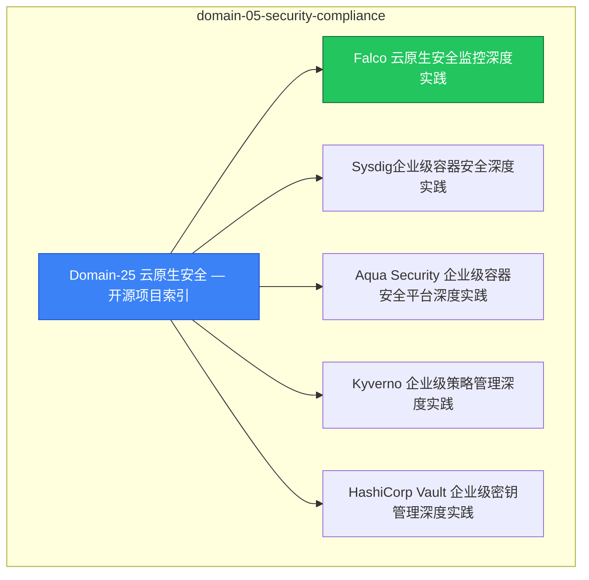

# domain-05-security-compliance MOC

> **MOC 版本**: 1.0
> **知识域**: domain-05-security-compliance
> **文档数量**: 16 篇
> **最后更新**: 2026-05-21
> **用途**: 本知识域的导航入口，汇总所有相关文档、关联领域、和场景入口

---

## 领域概述

云原生安全 — 供应链安全、运行时安全、合规

### 知识域定位

| 维度 | 说明 |
|---|---|
| **知识域** | domain-05-security-compliance |
| **文档数量** | 16 篇 |
| **难度分布** | 入门 0 / 进阶 0 / 高级 0 / 专家 0 |

---

## 文档清单

| # | 文档 | 难度 | 标签 | 估计阅读时间 |
|---|---|---|---|---|
| 1 | [[domain-05-security-compliance/00-open-source-projects-index.md|Domain-25 云原生安全 — 开源项目索引]] |  | security, cloud-native |  |
| 2 | [[domain-05-security-compliance/01-falco-cloud-native-security.md|Falco 云原生安全监控深度实践]] |  | security, cloud-native |  |
| 3 | [[domain-05-security-compliance/02-sysdig-enterprise-container-security.md|Sysdig企业级容器安全深度实践]] |  | security, cloud-native |  |
| 4 | [[domain-05-security-compliance/03-aqua-enterprise-container-security.md|Aqua Security 企业级容器安全平台深度实践]] |  | security, cloud-native |  |
| 5 | [[domain-05-security-compliance/04-kyverno-enterprise-policy-management.md|Kyverno 企业级策略管理深度实践]] |  | security, cloud-native |  |
| 6 | [[domain-05-security-compliance/05-vault-enterprise-secrets-management.md|HashiCorp Vault 企业级密钥管理深度实践]] |  | security, cloud-native |  |
| 7 | [[domain-05-security-compliance/09-opa-gatekeeper-policy.md|OPA Gatekeeper 策略即代码深度实践]] |  | security, cloud-native |  |
| 8 | [[domain-05-security-compliance/10-image-security-scanning.md|容器镜像安全扫描深度实践]] |  | security, cloud-native |  |
| 9 | [[domain-05-security-compliance/11-kubernetes-security-hardening.md|Kubernetes 安全加固深度实践]] |  | security, cloud-native |  |
| 10 | [[domain-05-security-compliance/17-gvisor-container-sandbox.md|gVisor 容器沙箱深度解析]] |  | security, cloud-native |  |
| 11 | [[domain-05-security-compliance/99-cert-manager-tls-guide.md|cert-manager 自动证书管理深度实践]] |  | security, cloud-native, guide |  |
| 12 | [[domain-05-security-compliance/99-falco-runtime-security-guide.md|Falco 运行时安全监控深度实践]] |  | security, cloud-native, guide |  |
| 13 | [[domain-05-security-compliance/99-java-security-kubernetes-guide.md|Java 应用 Kubernetes 安全加固深度实践]] |  | security, cloud-native, guide |  |
| 14 | [[domain-05-security-compliance/99-kyverno-policy-guide.md|Kyverno K8s 原生策略管理实践指南]] |  | security, cloud-native, guide |  |
| 15 | [[domain-05-security-compliance/99-opa-gatekeeper-policy-guide.md|OPA Gatekeeper 策略即代码深度实践]] |  | security, cloud-native, guide |  |
| 16 | [[domain-05-security-compliance/99-vault-k8s-secrets-guide.md|Vault K8s 密钥管理集成深度实践]] |  | security, cloud-native, guide |  |

---

## 知识图谱

---

## 关联入口

| 入口 | 说明 |
|---|---|
| [[../domain-10-troubleshooting-diagnostics/topic-fta/MOC.md|FTA 故障树]] | domain-05-security-compliance 相关故障树分析 |
| [[../domain-10-troubleshooting-diagnostics/topic-skills/MOC.md|Skills 技能]] | domain-05-security-compliance 相关操作技能 |
| [[../domain-19-landscape-references/topic-index/README.md|深度研究入口]] | 语料库索引与向量检索 |

---

## 统计信息

| 指标 | 数值 |
|---|---|
| 文档总数 | 16 |
| 覆盖 K8s 版本 | v1.25 - v1.32 |

---

*本文档由 scripts/generate-mocs.py 自动生成，最后更新 2026-05-21。*

## See Also

- [[domain-05-security-compliance/98-merged-indexes/00-open-source-projects-index-from-domain-39.md|00-open-source-projects-index-from-domain-05-security-compliance]]
- [[domain-05-security-compliance/98-merged-indexes/00-open-source-projects-index-from-domain-7.md|00-open-source-projects-index-from-domain-05-security-compliance]]
- [[domain-05-security-compliance/98-merged-indexes/MOC-from-domain-39.md|MOC-from-domain-05-security-compliance]]
- [[domain-05-security-compliance/98-merged-indexes/MOC-from-domain-7.md|MOC-from-domain-05-security-compliance]]

- [[domain-05-security-compliance/README.md|返回目录]]