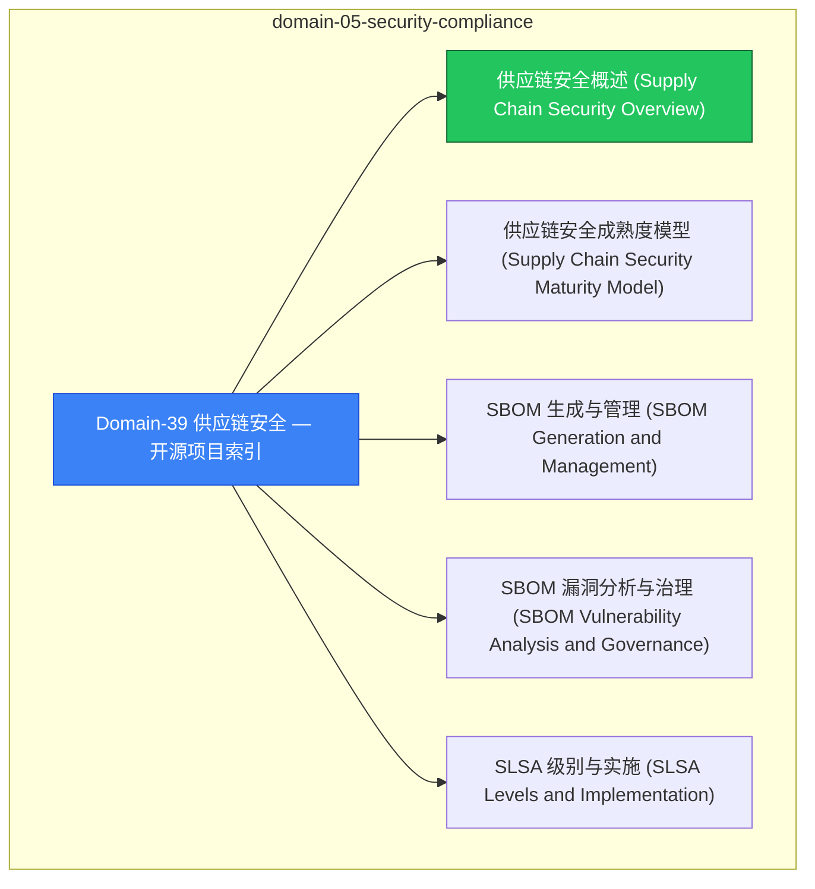

# domain-05-security-compliance MOC

> **MOC 版本**: 1.0
> **知识域**: domain-05-security-compliance
> **文档数量**: 12 篇
> **最后更新**: 2026-05-21
> **用途**: 本知识域的导航入口，汇总所有相关文档、关联领域、和场景入口

---

## 领域概述

供应链安全 — SBOM、签名、验证、镜像安全

### 知识域定位

| 维度 | 说明 |
|---|---|
| **知识域** | domain-05-security-compliance |
| **文档数量** | 12 篇 |
| **难度分布** | 入门 0 / 进阶 0 / 高级 0 / 专家 0 |

---

## 文档清单

| # | 文档 | 难度 | 标签 | 估计阅读时间 |
|---|---|---|---|---|
| 1 | [[domain-05-security-compliance/00-open-source-projects-index.md|Domain-39 供应链安全 — 开源项目索引]] |  | security, supply-chain |  |
| 2 | [[domain-05-security-compliance/01-supply-chain-security-overview.md|供应链安全概述 (Supply Chain Security Overview)]] |  | security, supply-chain, deep-dive |  |
| 3 | [[domain-05-security-compliance/02-supply-chain-maturity-model.md|供应链安全成熟度模型 (Supply Chain Security Maturity Model)]] |  | security, supply-chain |  |
| 4 | [[domain-05-security-compliance/03-sbom-generation-management.md|SBOM 生成与管理 (SBOM Generation and Management)]] |  | security, supply-chain |  |
| 5 | [[domain-05-security-compliance/04-sbom-vulnerability-analysis.md|SBOM 漏洞分析与治理 (SBOM Vulnerability Analysis and Governance)]] |  | security, supply-chain |  |
| 6 | [[domain-05-security-compliance/05-slsa-levels-implementation.md|SLSA 级别与实施 (SLSA Levels and Implementation)]] |  | security, supply-chain |  |
| 7 | [[domain-05-security-compliance/06-github-actions-slsa-build.md|GitHub Actions SLSA 构建 (GitHub Actions SLSA Build)]] |  | security, supply-chain |  |
| 8 | [[domain-05-security-compliance/07-sigstore-cosign-signing.md|Sigstore 与 Cosign 签名 (Sigstore and Cosign Signing)]] |  | security, supply-chain |  |
| 9 | [[domain-05-security-compliance/08-fulcio-rekor-transparency.md|Fulcio 与 Rekor 透明日志 (Fulcio and Rekor Transparency Logs)]] |  | security, supply-chain |  |
| 10 | [[domain-05-security-compliance/09-policy-controller-verification.md|Policy Controller 镜像验证 (Policy Controller Image Verification)]] |  | security, supply-chain |  |
| 11 | [[domain-05-security-compliance/10-compliance-automation-audit.md|合规自动化与审计 (Compliance Automation and Audit)]] |  | security, supply-chain, compliance |  |
| 12 | [[domain-05-security-compliance/99-slsa-supply-chain-security-guide.md|SLSA 软件供应链安全实践指南]] |  | security, supply-chain, guide |  |

---

## 知识图谱

---

## 关联入口

| 入口 | 说明 |
|---|---|
| [[../domain-10-troubleshooting-diagnostics/topic-fta/MOC.md|FTA 故障树]] | domain-05-security-compliance 相关故障树分析 |
| [[../domain-10-troubleshooting-diagnostics/topic-skills/MOC.md|Skills 技能]] | domain-05-security-compliance 相关操作技能 |
| [[../domain-19-landscape-references/topic-index/README.md|深度研究入口]] | 语料库索引与向量检索 |

---

## 统计信息

| 指标 | 数值 |
|---|---|
| 文档总数 | 12 |
| 覆盖 K8s 版本 | v1.25 - v1.32 |

---

*本文档由 scripts/generate-mocs.py 自动生成，最后更新 2026-05-21。*

## See Also

- [[domain-05-security-compliance/98-merged-indexes/00-open-source-projects-index-from-domain-7.md|00-open-source-projects-index-from-domain-05-security-compliance]]
- [[domain-05-security-compliance/98-merged-indexes/MOC-from-domain-25.md|MOC-from-domain-05-security-compliance]]
- [[domain-05-security-compliance/98-merged-indexes/MOC-from-domain-7.md|MOC-from-domain-05-security-compliance]]
- [[domain-05-security-compliance/98-merged-indexes/README-from-domain-25.md|README-from-domain-05-security-compliance]]

- [[domain-05-security-compliance/README.md|返回目录]]