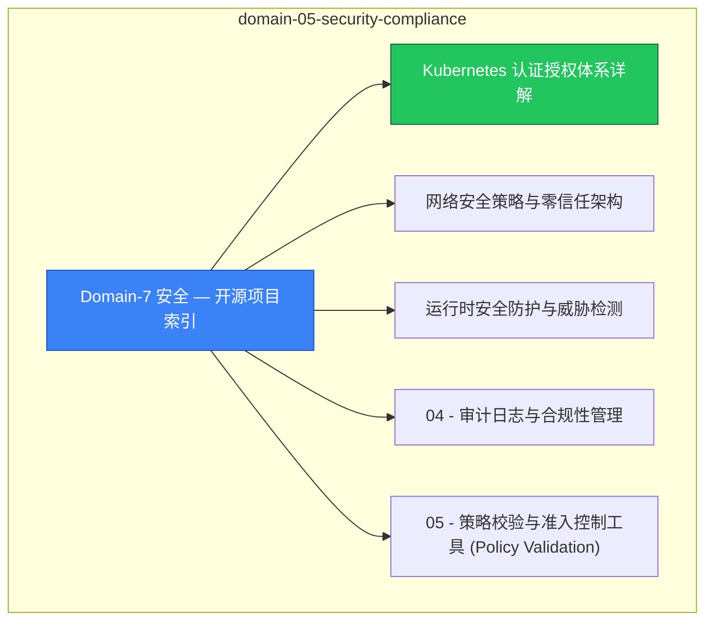

# domain-05-security-compliance MOC

> **MOC 版本**: 1.0
> **知识域**: domain-05-security-compliance
> **文档数量**: 22 篇
> **最后更新**: 2026-05-21
> **用途**: 本知识域的导航入口，汇总所有相关文档、关联领域、和场景入口

---

## 领域概述

安全 — RBAC、NetworkPolicy、PodSecurity、Secret、证书管理

### 知识域定位

| 维度 | 说明 |
|---|---|
| **知识域** | domain-05-security-compliance |
| **文档数量** | 22 篇 |
| **难度分布** | 入门 0 / 进阶 2 / 高级 1 / 专家 0 |

---

## 文档清单

| # | 文档 | 难度 | 标签 | 估计阅读时间 |
|---|---|---|---|---|
| 1 | [[domain-05-security-compliance/00-open-source-projects-index.md|Domain-7 安全 — 开源项目索引]] |  | k8s, security, rbac |  |
| 2 | Kubernetes 认证授权体系详解 | 进阶 | k8s, rbac, authentication | 5min |
| 3 | 网络安全策略与零信任架构 | 进阶 | k8s, network, networkpolicy | 5min |
| 4 | 运行时安全防护与威胁检测 | 高级 | k8s, runtime, security | 5min |
| 5 | 04 - 审计日志与合规性管理 |  | k8s, security, rbac |  |
| 6 | 05 - 策略校验与准入控制工具 (Policy Validation) |  | k8s, security, rbac |  |
| 7 | 06 - Pod安全标准详解 |  | k8s, security, rbac |  |
| 8 | 07 - RBAC权限矩阵表 |  | k8s, security, rbac |  |
| 9 | 08 - 安全最佳实践表 |  | k8s, security, rbac |  |
| 10 | Kubernetes 安全加固 |  | k8s, security, rbac |  |
| 11 | 证书管理与 TLS 配置 |  | k8s, security, rbac |  |
| 12 | 11 - 密钥与敏感信息管理工具 |  | k8s, security, rbac |  |
| 13 | 12 - 合规与认证表 |  | k8s, security, rbac |  |
| 14 | 13 - 镜像安全扫描与漏洞管理 |  | k8s, security, rbac |  |
| 15 | 14 - 策略引擎与合规 |  | k8s, security, rbac |  |
| 16 | 15 - 安全扫描与检测工具 |  | k8s, security, rbac |  |
| 17 | Kubernetes 合规与审计 |  | k8s, security, rbac |  |
| 18 | 17 - 安全扫描与漏洞检测工具 |  | k8s, security, rbac |  |
| 19 | 18 - 网络安全纵深防御体系 |  | k8s, security, rbac |  |
| 20 | 19 - 零信任安全架构实施指南 |  | k8s, security, rbac |  |
| 21 | 20 - 安全事件响应与应急处理流程 |  | k8s, security, rbac |  |
| 22 | 21 - 多集群安全管理与联邦认证 |  | k8s, security, rbac |  |

---

## 知识图谱

---

## 关联入口

| 入口 | 说明 |
|---|---|
| FTA 故障树 | domain-05-security-compliance 相关故障树分析 |
| Skills 技能 | domain-05-security-compliance 相关操作技能 |
| 深度研究入口 | 语料库索引与向量检索 |

---

## 统计信息

| 指标 | 数值 |
|---|---|
| 文档总数 | 22 |
| 覆盖 K8s 版本 | v1.25 - v1.32 |

---

*本文档由 scripts/generate-mocs.py 自动生成，最后更新 2026-05-21。*

## See Also

- [[domain-05-security-compliance/98-merged-indexes/MOC-from-domain-25.md|MOC-from-domain-05-security-compliance]]
- [[domain-05-security-compliance/98-merged-indexes/MOC-from-domain-39.md|MOC-from-domain-05-security-compliance]]
- [[domain-05-security-compliance/98-merged-indexes/README-from-domain-25.md|README-from-domain-05-security-compliance]]
- [[domain-05-security-compliance/98-merged-indexes/README-from-domain-39.md|README-from-domain-05-security-compliance]]

- [[domain-05-security-compliance/README.md|返回目录]]