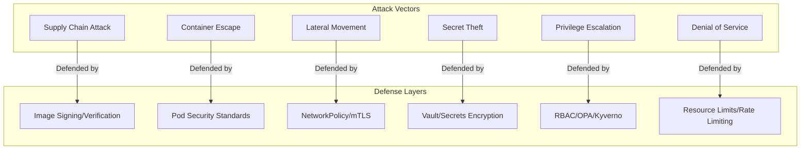
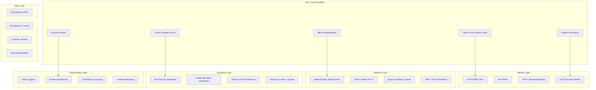
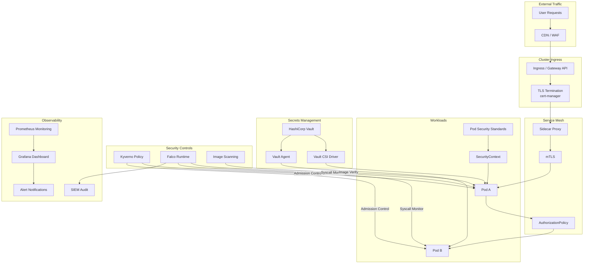

---
title: 'Domain 25: 云原生安全 (Cloud Native Security)'
description: '# Domain 25: 云原生安全 (Cloud Native Security)'
category: cloud-native-security
tags:
- k8s
- security
- cloud-native
- falco
- opa
- etcd
- kubelet
- scheduler
- prometheus
- grafana
last_updated: 2026-05
difficulty: advanced
reading_level: advanced
audience:
- 安全工程师
- SRE
- 架构师
estimated_read_time: 10min
intent_queries:
- 'Domain 25: 云原生安全 (Cloud Native Security) 是什么'
- '如何 Domain 25: 云原生安全 (Cloud Native Security)'
- Kubernetes 25 cloud native security 最佳实践
trigger_keywords:
- Domain
- '25:'
- 云原生安全
- Cloud
- Native
- Security
- cloud
- native
cross_refs:
- type: cheatsheet
  path: ../domain-17-system-foundation/topic-cheat-sheet/tls-pki.md
  label: '速查卡: tls-pki'

tier: peripheral---


# Domain 25: 云原生安全 (Cloud Native Security)

> **领域定位**: 企业级云原生安全防护架构与实践 | **文档数量**: 16篇 | **更新时间**: 2026-05-18

## 概述与威胁模型

云原生安全遵循"纵深防御"原则，在基础设施、控制平面、网络、工作负载、数据和可观测性等多个层面实施安全控制。云原生环境面临的威胁模型包括以下几个关键维度。

**基础设施层威胁**：Kubernetes 控制平面组件（API Server、etcd、Scheduler）如果配置不当，可能被攻击者利用获取集群管理权限。etcd 未启用 TLS 加密和认证的情况下，攻击者可直接读写集群状态数据。API Server 未配置 RBAC 或使用宽松的匿名访问策略，任何网络可达的客户端都可以执行任意 API 操作。 kubelet 未配置认证和授权，攻击者可通过 kubelet API 在节点上执行任意命令。这些基础设施层面的威胁是最基础也是最致命的——一旦控制平面被突破，整个集群的所有工作负载数据和密钥都将暴露。

**工作负载层威胁**：特权容器可通过挂载宿主机设备文件实现容器逃逸，获取宿主机 root 权限。以 root 用户运行的容器被入侵后，攻击者可以修改容器内的文件系统、安装恶意软件、窃取其他容器的数据。缺少资源限制的工作负载可能因内存泄漏或被攻击者利用进行资源耗尽攻击，导致同节点上的其他服务不可用。使用 latest 标签的镜像导致生产环境不可预测，攻击者可通过镜像仓库投毒替换 latest 标签的镜像。

**网络层威胁**：默认情况下 Kubernetes 集群内所有 Pod 之间可以自由通信，攻击者一旦进入一个 Pod，就可以横向移动到其他 Pod 和服务。未配置 NetworkPolicy 的集群中，被入侵的 Pod 可以扫描集群内所有服务端口、尝试连接数据库和消息队列等内部服务、发起 DNS 查询探测服务拓扑。Service Mesh 的 Sidecar 代理如果未配置严格的 mTLS 策略，中间人可以截获和篡改服务间通信。

**供应链层威胁**：从不受信任的镜像仓库拉取镜像可能引入恶意代码。CI/CD 管道中的构建工具如果被攻击者控制，可以在构建过程中植入后门。依赖混淆攻击通过在公共仓库发布与内部包同名的恶意包，诱导构建系统使用恶意版本。镜像标签被覆盖（tag mutability）导致同一个标签在不同时间指向不同的镜像内容，破坏了部署的可审计性。

**密钥管理威胁**：Kubernetes Secret 默认仅以 base64 编码存储在 etcd 中，任何有 etcd 访问权限的用户都可以获取密钥明文。开发人员将密钥硬编码在代码中、Dockerfile 中或 ConfigMap 中，导致密钥泄露到 Git 仓库和镜像层中。密钥轮换缺失——长期不更换的数据库密码和 API Key 增加了被破解后持续利用的风险。过度权限的 ServiceAccount Token 可能被攻击者利用进行权限提升。



### 零信任架构概览



### 安全栈层级

| 安全层级 | 防护目标 | 核心技术 | 推荐工具 | 本领域文档 |
|:---|:---|:---|:---|:---|
| **1. 边界安全** | 外部攻击入口防护 | WAF、DDoS、CDN、TLS | Cloud WAF、cert-manager | 99-cert-manager |
| **2. 身份认证** | 用户与服务身份验证 | OIDC/SAML、RBAC、IRSA | Keycloak、Okta | 11-K8s Security |
| **3. 网络安全** | 微隔离与通信加密 | NetworkPolicy、mTLS、Egress 控制 | Calico、Cilium、Istio | 11-K8s Security |
| **4. 工作负载安全** | Pod 安全与权限控制 | PSS、SecurityContext、镜像验证 | Kyverno、OPA | 04-Kyverno、09-OPA |
| **5. 运行时安全** | 实时威胁检测与响应 | eBPF、系统调用监控、异常检测 | Falco、Sysdig | 01-Falco、02-Sysdig |
| **6. 供应链安全** | 镜像与依赖完整性 | SBOM、漏洞扫描、签名验证 | Trivy、Cosign、Syft | 10-Image Security |
| **7. 密钥安全** | 凭证与证书生命周期管理 | 动态凭证、PKI、加密即服务 | Vault、cert-manager | 05-Vault、99-cert-manager |
| **8. 合规审计** | 安全基线与持续合规 | CIS Benchmark、策略即代码 | kube-bench、Kyverno | 11-K8s Security |

## 核心安全领域

### 运行时安全（Runtime Security）

通过内核级系统调用监控，实时检测容器内的异常行为。Falco 作为 CNCF 毕业项目，提供基于规则的威胁检测引擎，可检测容器逃逸、权限提升、加密货币挖矿、数据泄露等多种攻击模式。Sysdig 和 Aqua 提供了企业级的运行时安全平台，增加了漏洞管理、合规审计和威胁情报等高级功能。

运行时安全的核心技术包括：eBPF（Extended Berkeley Packet Filter）用于在内核空间高效捕获系统调用事件，相比传统的内核模块方式更安全且不会导致内核崩溃；内核模块（Kernel Module）方式通过在内核中插入 falco-probe 模块捕获系统调用，兼容性更好但安全性较低；用户空间检测通过读取 /proc 文件系统和 cgroup 信息推断容器行为。

Falco 检测的典型攻击场景包括：检测到在容器内打开了 /etc/shadow 文件（可能为密码哈希窃取）、检测到容器内执行了 shell 命令（可能为反弹 shell 或横向移动）、检测到容器挂载了宿主机文件系统（可能为容器逃逸）、检测到容器内执行了加密货币挖矿程序、检测到异常的网络连接（如连接到已知的 C2 服务器）、检测到敏感文件的读取或修改操作。

### 策略管理（Policy Management）

通过准入控制器在资源部署阶段强制执行安全策略。Kyverno 使用原生 YAML 语法定义策略，学习成本低，适合 Kubernetes 场景的快速策略落地。OPA Gatekeeper 使用 Rego 语言，灵活性更高，适合跨平台统一策略管理和复杂策略逻辑。两者都支持验证、变异和审计三种模式。

策略管理的核心价值在于将安全策略从人工审查转变为自动化执行。在多团队、多集群的企业环境中，安全团队无法逐个审查每个工作负载的配置。策略引擎通过 K8s Admission Webhook 机制，在资源创建和修改时自动执行策略检查，拒绝不符合安全基线的资源。背景扫描定期检查集群内现有资源的合规状态。变异策略自动修复不安全的配置。镜像验证策略确保只有经过签名验证的镜像才能部署。

### 密钥管理（Secrets Management）

HashiCorp Vault 提供企业级密钥管理能力，支持静态密钥存储、动态凭证生成、加密即服务和 PKI 证书管理。与 Kubernetes 的集成模式包括 Agent Sidecar（生产环境首选，密钥注入到内存卷不落盘）、External Secrets Operator（将 Vault 密钥同步为 K8s Secret，与 GitOps 工具兼容性好）和 CSI Driver（通过 CSI 接口将密钥挂载为文件卷，适合特殊合规要求）。

动态凭证是 Vault 的核心优势之一。传统模式下，数据库密码以静态形式存储在配置文件或环境变量中，一旦泄露就无法确定被谁获取、用于什么操作。Vault 的动态密钥引擎在应用请求时临时生成数据库凭证，凭证有严格的 TTL（Time To Live），过期后自动回收。这种模式下，即使凭证被窃取，攻击者也只能在很短的时间窗口内使用。

### 供应链安全（Supply Chain Security）

通过镜像扫描、SBOM 生成、镜像签名和准入控制构建端到端的软件供应链安全体系。Trivy 提供全面的漏洞、配置和密钥扫描能力，覆盖操作系统包和语言依赖。Grype 基于 SBOM 驱动漏洞扫描，适合集成到 CI/CD 管道。Syft 生成 CycloneDX 和 SPDX 格式的 SBOM。Cosign/Sigstore 负责镜像签名和验证，确保镜像来源可信。

供应链安全的威胁链条包括：开发阶段——开发人员的机器被植入恶意代码或依赖被混淆攻击；构建阶段——CI/CD 管道被入侵，构建工具被篡改，在构建过程中植入后门；分发阶段——镜像仓库被攻击，镜像被替换或标签被覆盖；部署阶段——未经验证的镜像被部署到生产环境。每个阶段都需要对应的安全控制措施。

### 安全加固（Security Hardening）

遵循 CIS Kubernetes Benchmark、Pod Security Standards 等安全基线，对集群控制平面、工作负载、网络和数据进行全面安全加固。kube-bench 工具可以自动化检查 CIS Benchmark 合规状态。Pod Security Standards 提供了三个预定义的安全级别（Privileged、Baseline、Restricted），集群管理员可以通过 Namespace 标签一键启用。

安全加固的核心原则是"最小权限"。每个工作负载只授予完成其功能所需的最小权限——不以 root 运行、不挂载宿主机文件系统、不使用特权模式、丢弃所有不必要的 Linux Capabilities、配置只读文件系统、设置资源限制。这些措施虽然不能完全阻止所有攻击，但显著增加了攻击者的利用难度，为其他安全层赢得了检测和响应时间。

## 合规框架映射

### 安全控制与合规要求映射表

| 合规框架 | 相关条款/控制点 | 安全控制要求 | 云原生技术实现 | 对应文档 |
|:---|:---|:---|:---|:---|
| **SOC 2 Type II** | CC6.1 逻辑访问 | 基于角色的访问控制、MFA | K8s RBAC + OIDC SSO + Kyverno | 04-Kyverno、11-Security |
| **SOC 2 Type II** | CC6.3 数据加密 | 静态和传输数据加密 | KMS etcd 加密 + mTLS + Vault | 05-Vault、11-Security |
| **SOC 2 Type II** | CC7.1 漏洞管理 | 漏洞扫描和修复流程 | Trivy CI/CD + Falco 运行时 | 01-Falco、10-Image |
| **SOC 2 Type II** | CC7.2 变更管理 | 受控的变更流程 | GitOps + Kyverno 准入控制 | 04-Kyverno |
| **SOC 2 Type II** | CC8.1 日志审计 | 完整的审计追踪 | K8s Audit Log + Falco + SIEM | 01-Falco、11-Security |
| **ISO 27001** | A.8.1 资产分类 | 信息分类和标签 | Kyverno 标签策略 + 数据分类 | 04-Kyverno |
| **ISO 27001** | A.9.2 访问控制 | 最小权限访问管理 | RBAC + PSS + NetworkPolicy | 11-Security |
| **ISO 27001** | A.10.1 密码学 | 加密标准实施 | Vault Transit + cert-manager | 05-Vault、99-cert-manager |
| **ISO 27001** | A.12.6 漏洞管理 | 技术漏洞管理 | Trivy + Grype + SBOM | 10-Image |
| **GDPR** | Art.32 安全措施 | 数据保护技术措施 | Encryption + Access Control + Audit | 全部文档 |
| **GDPR** | Art.25 隐私设计 | 默认隐私保护 | Data classification + Minimization | 04-Kyverno、11-Security |
| **PCI-DSS v4.0** | Req.6 安全开发 | 安全软件开发流程 | SBOM + Signing + CI/CD scanning | 10-Image |
| **PCI-DSS v4.0** | Req.8 身份认证 | 强身份认证 | OIDC + MFA + Workload Identity | 11-Security |
| **NIST CSF** | ID.RA 风险评估 | 安全风险评估 | Trivy + kube-bench + Falco | 01-Falco、10-Image |
| **NIST CSF** | PR.AC 访问控制 | 访问控制管理 | RBAC + Kyverno + PSS | 04-Kyverno、11-Security |
| **NIST CSF** | DE.CM 安全监控 | 持续安全监控 | Falco + Prometheus + Grafana | 01-Falco |

### 合规自动化检查 Kyverno 策略

```yaml
apiVersion: kyverno.io/v1
kind: ClusterPolicy
metadata:
  name: soc2-compliance-checks
  annotations:
    policies.kyverno.io/title: "SOC2 Compliance Security Checks"
    policies.kyverno.io/category: "Compliance"
    policies.kyverno.io/severity: "medium"
spec:
  validationFailureAction: Audit
  background: true
  rules:
  - name: require-non-root-user
    match:
      any:
      - resources:
          kinds:
          - Deployment
          - StatefulSet
          - DaemonSet
    validate:
      message: "SOC2 CC6.1: Containers must not run as root user"
      pattern:
        spec:
          template:
            spec:
              securityContext:
                runAsNonRoot: true
              (containers):
              - securityContext:
                  allowPrivilegeEscalation: false
                  readOnlyRootFilesystem: true
                  capabilities:
                    drop:
                    - ALL

  - name: require-resource-limits
    match:
      any:
      - resources:
          kinds:
          - Deployment
          - StatefulSet
    validate:
      message: "SOC2 CC7.1: Resource limits must be set to prevent DoS"
      pattern:
        spec:
          template:
            spec:
              containers:
              - resources:
                  limits:
                    memory: "?*"
                    cpu: "?*"
                  requests:
                    memory: "?*"
                    cpu: "?*"

  - name: disallow-privileged-containers
    match:
      any:
      - resources:
          kinds:
          - Deployment
          - StatefulSet
          - DaemonSet
          - Pod
    validate:
      message: "SOC2 CC6.1: Privileged containers are not allowed"
      pattern:
        spec:
          template:
            spec:
              containers:
              - securityContext:
                  privileged: false

  - name: require-images-from-trusted-registry
    match:
      any:
      - resources:
          kinds:
          - Deployment
    validate:
      message: "SOC2 CC7.2: Images must come from approved registries"
      pattern:
        spec:
          template:
            spec:
              containers:
              - image: "registry.example.com/* | ghcr.io/* | docker.io/library/*"

  - name: require-networkpolicy
    match:
      any:
      - resources:
          kinds:
          - Deployment
          namespaces:
          - production
    validate:
      message: "SOC2 CC6.3: Production deployments must have NetworkPolicy"
---
apiVersion: kyverno.io/v1
kind: ClusterPolicy
metadata:
  name: gdpr-data-protection
  annotations:
    policies.kyverno.io/title: "GDPR Data Protection Controls"
    policies.kyverno.io/category: "Compliance"
spec:
  validationFailureAction: Enforce
  background: true
  rules:
  - name: encrypt-external-traffic
    match:
      any:
      - resources:
          kinds:
          - Ingress
    validate:
      message: "GDPR Art.32: Ingress must enforce TLS"
      pattern:
        spec:
          tls:
          - (hosts): "?*"
```

## 文档目录

### 核心安全平台

| 文档 | 描述 | 难度 | 核心覆盖 |
|:---|:---|:---|:---|
| [00-开源项目索引](./00-open-source-projects-index.md) | 云原生安全开源项目全景图 | ⭐⭐ | 工具选型、技术栈对比 |
| [01-Falco 云原生安全](./01-falco-cloud-native-security.md) | Falco 运行时安全监控深度实践 | ⭐⭐⭐⭐ | eBPF、规则定制、威胁检测 |
| [02-Sysdig 企业容器安全](./02-sysdig-enterprise-container-security.md) | Sysdig 企业级安全平台架构与部署 | ⭐⭐⭐⭐⭐ | 运行时+漏洞+合规一体化 |
| [03-Aqua 企业容器安全](./03-aqua-enterprise-container-security.md) | Aqua Security 全生命周期防护 | ⭐⭐⭐⭐⭐ | 镜像扫描+运行时+合规 |

### 策略与准入控制

| 文档 | 描述 | 难度 | 核心覆盖 |
|:---|:---|:---|:---|
| [04-Kyverno 策略管理](./04-kyverno-enterprise-policy-management.md) | Kyverno 企业级策略引擎实践 | ⭐⭐⭐⭐ | 验证/变异/生成/清理/镜像验证 |
| [09-OPA Gatekeeper 策略](./09-opa-gatekeeper-policy.md) | OPA Gatekeeper 策略即代码深度实践 | ⭐⭐⭐⭐ | Rego 策略、ConstraintTemplate |

### 密钥与证书管理

| 文档 | 描述 | 难度 | 核心覆盖 |
|:---|:---|:---|:---|
| [05-Vault 企业密钥管理](./05-vault-enterprise-secrets-management.md) | HashiCorp Vault 企业级密钥管理 | ⭐⭐⭐⭐⭐ | 动态凭证、PKI、多集群 |

### 安全加固

| 文档 | 描述 | 难度 | 核心覆盖 |
|:---|:---|:---|:---|
| [10-镜像安全扫描](./10-image-security-scanning.md) | Trivy/Grype 漏洞扫描、SBOM、Cosign 签名 | ⭐⭐⭐⭐ | CI/CD 安全门禁 |
| [11-Kubernetes 安全加固](./11-kubernetes-security-hardening.md) | CIS Benchmark、PSS、NetworkPolicy、Secrets 加密 | ⭐⭐⭐⭐⭐ | 全栈安全基线 |

### 实践指南

| 文档 | 描述 | 难度 | 核心覆盖 |
|:---|:---|:---|:---|
| [99-cert-manager TLS 指南](./99-cert-manager-tls-guide.md) | cert-manager 自动证书管理实践 | ⭐⭐⭐ | ACME、私有 CA、mTLS |
| [99-Falco 运行时安全指南](./99-falco-runtime-security-guide.md) | Falco 部署与规则定制 | ⭐⭐⭐⭐ | 规则语法、自定义检测 |
| [99-Java 安全加固指南](./99-java-security-kubernetes-guide.md) | Java 应用 K8s 安全加固 | ⭐⭐⭐⭐⭐ | SecurityContext、Spring Security |
| [99-Kyverno 策略指南](./99-kyverno-policy-guide.md) | Kyverno 策略编写快速参考 | ⭐⭐⭐ | YAML 策略、最佳实践 |
| [99-OPA Gatekeeper 指南](./99-opa-gatekeeper-policy-guide.md) | OPA Gatekeeper 快速入门 | ⭐⭐⭐ | Rego 语法、策略模板 |
| [99-Vault K8s 集成指南](./99-vault-k8s-secrets-guide.md) | Vault 与 K8s 密钥管理集成 | ⭐⭐⭐⭐ | Agent Sidecar、ESO、CSI |

## 学习路径建议

### 入门阶段

1. 阅读 **00-开源项目索引**，了解云原生安全工具全景，建立整体认知框架
2. 学习 **99-Falco 运行时安全指南**，掌握运行时监控基础，理解容器内的安全事件
3. 阅读 **99-cert-manager TLS 指南**，理解证书自动化管理，掌握 TLS 基础
4. 实践 **99-Kyverno 策略指南** 或 **99-OPA Gatekeeper 指南**，理解准入控制机制

### 进阶阶段

1. 实践 **04-Kyverno 策略管理** 或 **09-OPA Gatekeeper 策略**，掌握生产级策略设计
2. 学习 **10-镜像安全扫描**，建立 CI/CD 安全门禁，实施 SBOM 生成和镜像签名
3. 阅读 **99-Vault K8s 集成指南**，掌握密钥注入模式，实施动态凭证
4. 实践 **99-Java 安全加固指南**，加固应用工作负载，理解语言级别的安全实践

### 专家阶段

1. 部署 **01-Falco** 或 **02-Sysdig** 企业级运行时安全平台，构建威胁检测体系
2. 实施 **11-Kubernetes 安全加固**，完成 CIS Benchmark 合规，建立安全基线
3. 构建基于 **05-Vault** 的企业级密钥管理体系，包括动态凭证、PKI、多集群同步
4. 设计纵深防御安全架构，整合运行时、策略、供应链安全，构建安全运营中心

## 技术栈概览

```yaml
core_technology_stack:
  runtime_security:
    primary: "Falco"
    primary_features:
      - "CNCF Graduated Project"
      - "Kernel-level system call monitoring"
      - "eBPF and kernel module dual engine"
      - "Rich community rule library"
    enterprise: "Sysdig Secure / Aqua Security"
    enterprise_features:
      - "Runtime security + vulnerability management + compliance audit"
      - "Threat intelligence integration"
      - "Automated compliance reporting"
      - "Multi-cluster unified management"

  policy_management:
    kyverno:
      language: "YAML (K8s native)"
      features:
        - "Validate/Mutate/Generate/Cleanup/ImageVerify"
        - "PolicyException controlled exemptions"
        - "Background scan compliance reports"
        - "CLI local testing"
      best_for: "Fast adoption, pure K8s environments"
    opa_gatekeeper:
      language: "Rego (general DSL)"
      features:
        - "ConstraintTemplate reusable templates"
        - "External data source integration"
        - "Audit mode continuous scanning"
        - "conftest CI/CD integration"
      best_for: "Complex policies, cross-platform unification"

  secrets_management:
    vault:
      features:
        - "Static secrets KV store"
        - "Dynamic database credentials"
        - "PKI certificate management"
        - "Encryption as a Service (Transit)"
        - "Audit trail"
    integration_modes:
      - "Agent Sidecar: Inject secrets into memory volume (recommended)"
      - "External Secrets Operator: Sync as K8s Secret"
      - "CSI Driver: File volume mount"
    cert_manager:
      features:
        - "ACME (Let's Encrypt) auto-issuance"
        - "Private CA management"
        - "Vault PKI integration"
        - "Gateway API support"

  supply_chain_security:
    vulnerability_scanning:
      - "Trivy: Comprehensive vulnerability/config/secret scanning"
      - "Grype: SBOM-driven vulnerability scanning"
      - "OWASP Dependency-Check: Java dependency scanning"
    sbom_generation:
      - "Syft: CycloneDX/SPDX format"
      - "cyclonedx-maven-plugin: Java SBOM"
    image_signing:
      - "Cosign: Image signing and verification"
      - "Sigstore Keyless: OIDC identity signing"
      - "Notary v2: OCI native signing"

  security_hardening:
    baselines:
      - "CIS Kubernetes Benchmark: Security configuration baseline"
      - "Pod Security Standards: Built-in Pod security policies"
    tools:
      - "kube-bench: CIS Benchmark automated checking"
      - "kubeaudit: Cluster security audit"
    network_segmentation:
      - "NetworkPolicy: Network micro-segmentation"
      - "Service Mesh mTLS: Inter-service encrypted authentication"
      - "AuthorizationPolicy: L7 access control"

  compliance_frameworks:
    pci_dss:
      - "Requirement 1: Network security controls"
      - "Requirement 2: Secure configuration"
      - "Requirement 3: Data encryption"
      - "Requirement 6: Secure development"
      - "Requirement 8: Identity authentication"
      - "Requirement 10: Log auditing"
    hipaa:
      - "Access Control: RBAC + Policy Engine"
      - "Audit Controls: Audit logs + SIEM"
      - "Integrity: Image signing + SBOM"
      - "Transmission Security: mTLS + NetworkPolicy"
    soc2:
      - "CC6: Logical and physical access controls"
      - "CC7: System operations"
      - "CC8: Change management"
    nist_csf:
      - "Identify: Asset inventory, risk assessment"
      - "Protect: Access control, data security"
      - "Detect: Threat detection, continuous monitoring"
      - "Respond: Incident response, remediation"
      - "Recover: Disaster recovery, improvement"
```

## 快速启动安全检查清单

### Day 1 安全加固命令

> ⚠️ **🟡 中危变更** — 变更集群资源状态，建议先 --dry-run 或 diff 确认
> - `helm upgrade/install`：部署/升级 release

```bash
#!/bin/bash
set -euo pipefail

echo "=== Cloud Native Security Quick Start Checklist ==="
echo "Execution Time: $(date '+%Y-%m-%d %H:%M:%S UTC')"
echo ""

CLUSTER_NAME=$(kubectl config current-context)
echo "Target Cluster: $CLUSTER_NAME"
echo ""

echo "[1] Check Kubernetes version (must be supported)"
kubectl version --short 2>/dev/null || kubectl version
echo ""

echo "[2] Verify etcd encryption is enabled"
kubectl get --raw /healthz/etcd 2>/dev/null && echo "PASS: etcd health check" || echo "WARN: Cannot verify etcd status"
ENCRYPTION_CONFIG=$(kubectl get --raw /api/v1/namespaces/default/secrets 2>/dev/null | head -1)
echo ""

echo "[3] Check Pod Security Standards enforcement"
echo "Checking namespace labels for PSS enforcement..."
kubectl get namespaces -o json | jq -r '.items[] | select(.metadata.labels["pod-security.kubernetes.io/enforce"] != null) | "\(.metadata.name): enforce=\(.metadata.labels["pod-security.kubernetes.io/enforce"])"'
echo ""

echo "[4] Verify RBAC is enabled and check for overly permissive bindings"
echo "Checking for cluster-admin bindings..."
kubectl get clusterrolebindings -o json | jq -r '.items[] | select(.roleRef.name=="cluster-admin") | "\(.metadata.name): subjects=\(.subjects | length)"'
echo ""

echo "[5] Check for pods running as root"
echo "Scanning all namespaces for root containers..."
kubectl get pods -A -o json | jq -r '.items[] | select(.spec.securityContext.runAsUser == 0 or .spec.securityContext.runAsNonRoot == false or .spec.securityContext.runAsNonRoot == null) | "\(.metadata.namespace)/\(.metadata.name): runAsUser=\(.spec.securityContext.runAsUser // "not set"), runAsNonRoot=\(.spec.securityContext.runAsNonRoot // "not set")"' | head -20
echo ""

echo "[6] Check for privileged containers"
kubectl get pods -A -o json | jq -r '.items[] | .spec.containers[] | select(.securityContext.privileged == true) | "PRIVILEGED: \(.name)"' | head -10
echo ""

echo "[7] Verify NetworkPolicies exist"
NP_COUNT=$(kubectl get networkpolicies -A --no-headers 2>/dev/null | wc -l)
echo "Total NetworkPolicies found: $NP_COUNT"
if [ "$NP_COUNT" -eq 0 ]; then
    echo "WARN: No NetworkPolicies found - all pods can communicate freely"
fi
echo ""

echo "[8] Check for containers without resource limits"
kubectl get pods -A -o json | jq -r '.items[] | .spec.containers[] | select(.resources.limits == null or .resources.limits == {}) | "NO LIMITS: \(.name)"' | head -10
echo ""

echo "[9] Verify audit logging is configured"
if [ -f /etc/kubernetes/audit/audit.yaml ]; then
    echo "PASS: Audit policy file exists at /etc/kubernetes/audit/audit.yaml"
else
    echo "WARN: No audit policy file found"
fi
echo ""

echo "[10] Run CIS Benchmark check with kube-bench"
echo "If kube-bench is installed, running checks..."
if command -v kube-bench &>/dev/null; then
    kube-bench run --targets master,node,etcd,policies --benchmark cis-1.8 2>/dev/null | tail -20
else
    echo "kube-bench not installed. Install with: helm install kube-bench kube-bench/kube-bench -n security"
fi
echo ""

echo "=== Security Quick Start Checklist Complete ==="
echo "Review the warnings above and address them based on priority"
```

### Falco 快速部署与规则验证

> ⚠️ **🟡 中危变更** — 变更集群资源状态，建议先 --dry-run 或 diff 确认
> - `helm upgrade/install`：部署/升级 release
> - `kubectl exec`：进入容器执行命令，可能改变容器状态

```bash
#!/bin/bash
set -euo pipefail

echo "=== Falco Quick Deployment ==="

echo "[1] Add Falco Helm repository"
helm repo add falcosecurity https://falcosecurity.github.io/charts
helm repo update

echo "[2] Install Falco with eBPF driver"
helm install falco falcosecurity/falco \
    --namespace falco \
    --create-namespace \
    --set driver.kind=ebpf \
    --set falcoctl.config.artifact.install.enabled=true \
    --set falcoctl.config.artifact.follow.enabled=true \
    --set collectors.containerd.enabled=true \
    --set tty=true \
    --set jsonOutput=true \
    --set jsonIncludeOutputProperty=true \
    --set programOutput.enabled=true \
    --set programOutput.program="jq -r '.output' >> /var/log/falco-events.log"

echo "[3] Verify Falco is running"
kubectl get pods -n falco -l app.kubernetes.io/name=falco

echo "[4] Check Falco logs for recent events"
kubectl logs -n falco -l app.kubernetes.io/name=falco --tail=20

echo "[5] List loaded rules"
kubectl exec -n falco -l app.kubernetes.io/name=falco -- falco --list

echo "=== Falco Deployment Complete ==="
```

### Trivy 安全扫描快速启动

```bash
#!/bin/bash
set -euo pipefail

echo "=== Trivy Security Scanning Quick Start ==="

echo "[1] Install Trivy"
brew install trivy

echo "[2] Scan a container image for vulnerabilities"
trivy image --severity HIGH,CRITICAL nginx:1.25

echo "[3] Scan Kubernetes cluster for misconfigurations"
trivy k8s --severity HIGH,CRITICAL --report summary cluster

echo "[4] Scan for secrets in code repositories"
trivy fs --scanners secret ./src/

echo "[5] Generate SBOM for an image"
trivy image --format spdx-json --output sbom.json nginx:1.25
echo "SBOM saved to sbom.json"

echo "[6] Scan with SBOM (offline vulnerability check)"
trivy sbom sbom.json

echo "=== Trivy Scanning Complete ==="
```

## 适用场景

| 场景 | 推荐文档 | 关键技术 |
|:---|:---|:---|
| 企业级安全体系建设 | 01-Falco + 04-Kyverno + 05-Vault | 纵深防御架构 |
| 容器运行时监控 | 01-Falco + 99-Falco 指南 | eBPF + 规则引擎 |
| 策略管理与准入控制 | 04-Kyverno + 09-OPA Gatekeeper | Webhook + 策略即代码 |
| 密钥管理自动化 | 05-Vault + 99-Vault 指南 | 动态凭证 + PKI |
| 镜像供应链安全 | 10-镜像扫描 + 99-Kyverno 指南 | Trivy + Cosign + SBOM |
| 安全合规审计 | 11-K8s 安全加固 + 02-Sysdig | CIS Benchmark + PSS |
| DevSecOps 流水线 | 10-镜像扫描 + 99-Java 指南 | CI/CD 安全门禁 |
| 多集群安全管理 | 02-Sysdig + 05-Vault | 集中管理 + 联邦策略 |
| Java 应用安全加固 | 99-Java 指南 + 11-K8s 安全加固 | SecurityContext + Spring Security |
| TLS 证书自动化 | 99-cert-manager 指南 | ACME + 私有 CA |

## 安全架构参考



### Prometheus 安全告警规则

```yaml
apiVersion: monitoring.coreos.com/v1
kind: PrometheusRule
metadata:
  name: security-alerts
  namespace: monitoring
spec:
  groups:
  - name: security.rules
    rules:
    - alert: PrivilegedContainerDetected
      expr: kube_pod_container_security_context_privileged == 1
      for: 1m
      labels:
        severity: critical
        team: security
      annotations:
        summary: "Privileged container detected in namespace {{ $labels.namespace }}"
        description: "Container {{ $labels.container }} in pod {{ $labels.pod }} is running in privileged mode"

    - alert: ContainerRunningAsRoot
      expr: kube_pod_security_context_run_as_user == 0
      for: 5m
      labels:
        severity: warning
        team: security
      annotations:
        summary: "Container running as root user"
        description: "Pod {{ $labels.pod }} in namespace {{ $labels.namespace }} is running as root (UID 0)"

    - alert: FalcoHighSeverityEvent
      expr: increase(falco_events{priority="Critical"}[5m]) > 0
      for: 0m
      labels:
        severity: critical
        team: security
      annotations:
        summary: "Falco critical severity event detected"
        description: "{{ $labels.rule }} triggered in namespace {{ $labels.namespace }}"

    - alert: ImageNotFromTrustedRegistry
      expr: kyverno_policy_results_total{policy="require-images-from-trusted-registry",result="fail"} > 0
      for: 5m
      labels:
        severity: warning
        team: security
      annotations:
        summary: "Image from untrusted registry detected"
        description: "A deployment attempted to use an image from an untrusted registry"

    - alert: NetworkPolicyMissing
      expr: kube_networkpolicy_created == 0
      for: 1h
      labels:
        severity: info
        team: security
      annotations:
        summary: "No NetworkPolicy found for namespace"
        description: "Namespace {{ $labels.namespace }} has no NetworkPolicy - all pods can communicate freely"

    - alert: VaultSealed
      expr: vault_core_unsealed == 0
      for: 5m
      labels:
        severity: critical
        team: security
      annotations:
        summary: "Vault instance is sealed"
        description: "Vault cluster {{ $labels.instance }} is sealed and cannot serve requests"

    - alert: CertificateExpiringSoon
      expr: certmanager_certificate_expiration_timestamp_seconds - time() < 86400 * 7
      for: 1h
      labels:
        severity: warning
        team: security
      annotations:
        summary: "TLS certificate expiring in less than 7 days"
        description: "Certificate {{ $labels.name }} in namespace {{ $labels.namespace }} expires soon"

    - alert: VulnerabilityScanHighCVE
      expr: trivy_image_vulnerabilities{severity="Critical"} > 0
      for: 24h
      labels:
        severity: warning
        team: security
      annotations:
        summary: "Critical vulnerability detected in container image"
        description: "Image {{ $labels.image }} has {{ $value }} critical vulnerabilities"
```

### 安全事件响应流程

```yaml
security_incident_response_flow:
  detection:
    - "Falco detects anomalous behavior via syscall monitoring"
    - "Trivy identifies critical vulnerability in deployed image"
    - "Kyverno audit mode flags policy violation"
    - "Prometheus alert triggers on security metric threshold"

  triage:
    - "Security team receives alert via PagerDuty/Opsgenie"
    - "Classify severity: Critical / High / Medium / Low"
    - "Determine blast radius: single pod / namespace / cluster / multi-cluster"
    - "Assign incident commander and communicate status"

  containment:
    - "Isolate affected workloads via NetworkPolicy"
    - "Scale down compromised deployments"
    - "Revoke compromised secrets via Vault"
    - "Block malicious image registries via Kyverno"

  remediation:
    - "Deploy patched image with vulnerability fix"
    - "Rotate all potentially compromised credentials"
    - "Review and update Falco detection rules"
    - "Update Kyverno policies to prevent recurrence"

  post_incident:
    - "Conduct blameless post-mortem within 48 hours"
    - "Document root cause and timeline"
    - "Implement preventive controls"
    - "Update runbooks and detection rules"
    - "Share lessons learned with broader team"
```

### 安全工具成本对比

| 工具 | License | 部署模式 | 社区版成本 | 企业版成本（参考） | 适合企业规模 |
|:---|:---|:---|:---|:---|:---|
| Falco | Apache-2.0 | 自托管 | 免费 | — | 所有规模 |
| Kyverno | Apache-2.0 | 自托管 | 免费 | — | 所有规模 |
| Trivy | Apache-2.0 | 自托管/CLI | 免费 | Aqua Platform: 按节点计费 | 所有规模 |
| Vault | BSL | 自托管 | 免费（社区版） | Vault Enterprise: 按节点计费 | 中大型 |
| Sysdig | 商业 | SaaS/自托管 | — | 按节点/容器计费 | 大型 |
| Aqua | 商业 | SaaS/自托管 | — | 按节点计费 | 大型 |
| kube-bench | Apache-2.0 | 自托管 | 免费 | — | 所有规模 |

---

*持续更新最新云原生安全技术和最佳实践*

## Related

- [[domain-17-system-foundation/topic-cheat-sheet/tls-pki.md|速查卡: tls-pki]]

- [[domain-05-security-compliance/README.md|返回目录]]