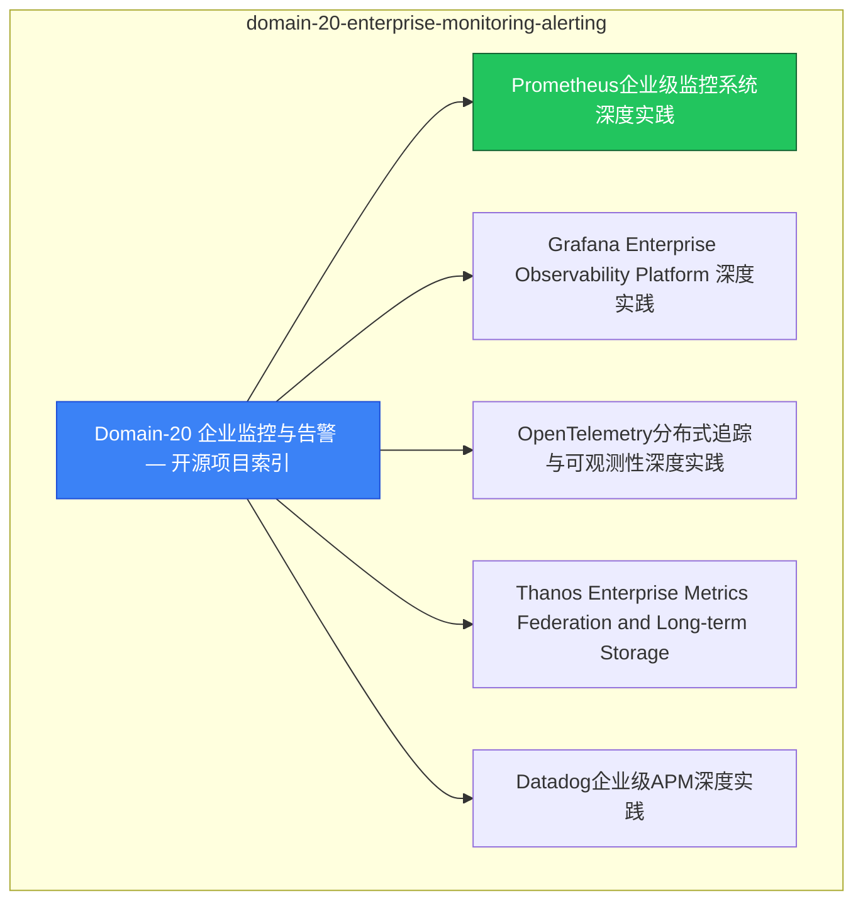

# domain-20-enterprise-monitoring-alerting MOC

> **MOC 版本**: 1.0
> **知识域**: domain-20-enterprise-monitoring-alerting
> **文档数量**: 13 篇
> **最后更新**: 2026-05-21
> **用途**: 本知识域的导航入口，汇总所有相关文档、关联领域、和场景入口

---

## 领域概述

企业监控告警 — 监控架构、告警策略、SLO/SLI

### 知识域定位

| 维度 | 说明 |
|---|---|
| **知识域** | domain-20-enterprise-monitoring-alerting |
| **文档数量** | 13 篇 |
| **难度分布** | 入门 0 / 进阶 0 / 高级 0 / 专家 0 |

---

## 文档清单

| # | 文档 | 难度 | 标签 | 估计阅读时间 |
|---|---|---|---|---|
| 1 | [[domain-06-observability/00-open-source-projects-index.md|Domain-20 企业监控与告警 — 开源项目索引]] |  | observability, monitoring, alerting |  |
| 2 | [[domain-06-observability/01-prometheus-enterprise-monitoring.md|Prometheus企业级监控系统深度实践]] |  | observability, monitoring, alerting |  |
| 3 | [[domain-06-observability/02-grafana-enterprise-observability.md|Grafana Enterprise Observability Platform 深度实践]] |  | observability, monitoring, alerting |  |
| 4 | [[domain-06-observability/03-opentelemetry-distributed-tracing.md|OpenTelemetry分布式追踪与可观测性深度实践]] |  | observability, monitoring, alerting |  |
| 5 | [[domain-06-observability/04-thanos-enterprise-metrics-federation.md|Thanos Enterprise Metrics Federation and Long-term Storage]] |  | observability, monitoring, alerting |  |
| 6 | [[domain-06-observability/05-datadog-enterprise-apm.md|Datadog企业级APM深度实践]] |  | observability, monitoring, alerting |  |
| 7 | [[domain-06-observability/05-datadog-enterprise-monitoring.md|Datadog 企业级监控平台深度实践]] |  | observability, monitoring, alerting |  |
| 8 | [[domain-06-observability/06-elastic-stack-enterprise-logging.md|Elastic Stack企业级日志分析深度实践]] |  | observability, monitoring, alerting |  |
| 9 | [[domain-06-observability/06-elastic-stack-enterprise-observability.md|Elastic Stack企业级可观测性平台深度实践]] |  | observability, monitoring, alerting |  |
| 10 | [[domain-06-observability/07-zabbix-enterprise-monitoring.md|Zabbix Enterprise Monitoring Platform 深度实践]] |  | observability, monitoring, alerting |  |
| 11 | [[domain-06-observability/08-new-relic-enterprise-apm.md|New Relic Enterprise APM Platform 深度实践]] |  | observability, monitoring, alerting |  |
| 12 | [[domain-06-observability/99-distributed-tracing-guide.md|K8s 分布式追踪实践指南 (Jaeger / Tempo / OpenTelemetry)]] |  | observability, monitoring, alerting |  |
| 13 | [[domain-06-observability/99-prometheus-enterprise-guide.md|Prometheus 企业级监控部署指南]] |  | observability, monitoring, alerting |  |

---

## 知识图谱

---

## 关联入口

| 入口 | 说明 |
|---|---|
| [[../domain-10-troubleshooting-diagnostics/topic-fta/MOC.md|FTA 故障树]] | domain-20-enterprise-monitoring-alerting 相关故障树分析 |
| [[../domain-10-troubleshooting-diagnostics/topic-skills/MOC.md|Skills 技能]] | domain-20-enterprise-monitoring-alerting 相关操作技能 |
| [[../domain-19-landscape-references/topic-index/README.md|深度研究入口]] | 语料库索引与向量检索 |

---

## 统计信息

| 指标 | 数值 |
|---|---|
| 文档总数 | 13 |
| 覆盖 K8s 版本 | v1.25 - v1.32 |

---

*本文档由 scripts/generate-mocs.py 自动生成，最后更新 2026-05-21。*

## See Also

- [[domain-06-observability/98-merged-indexes/00-open-source-projects-index-from-domain-8.md|00-open-source-projects-index-from-domain-06-observability]]
- [[domain-06-observability/98-merged-indexes/FINAL-QUALITY-ASSESSMENT.md|FINAL-QUALITY-ASSESSMENT]]
- [[domain-06-observability/98-merged-indexes/MOC-from-domain-21.md|MOC-from-domain-06-observability]]
- [[domain-06-observability/98-merged-indexes/MOC-from-domain-8.md|MOC-from-domain-06-observability]]

- [[domain-06-observability/README.md|返回目录]]