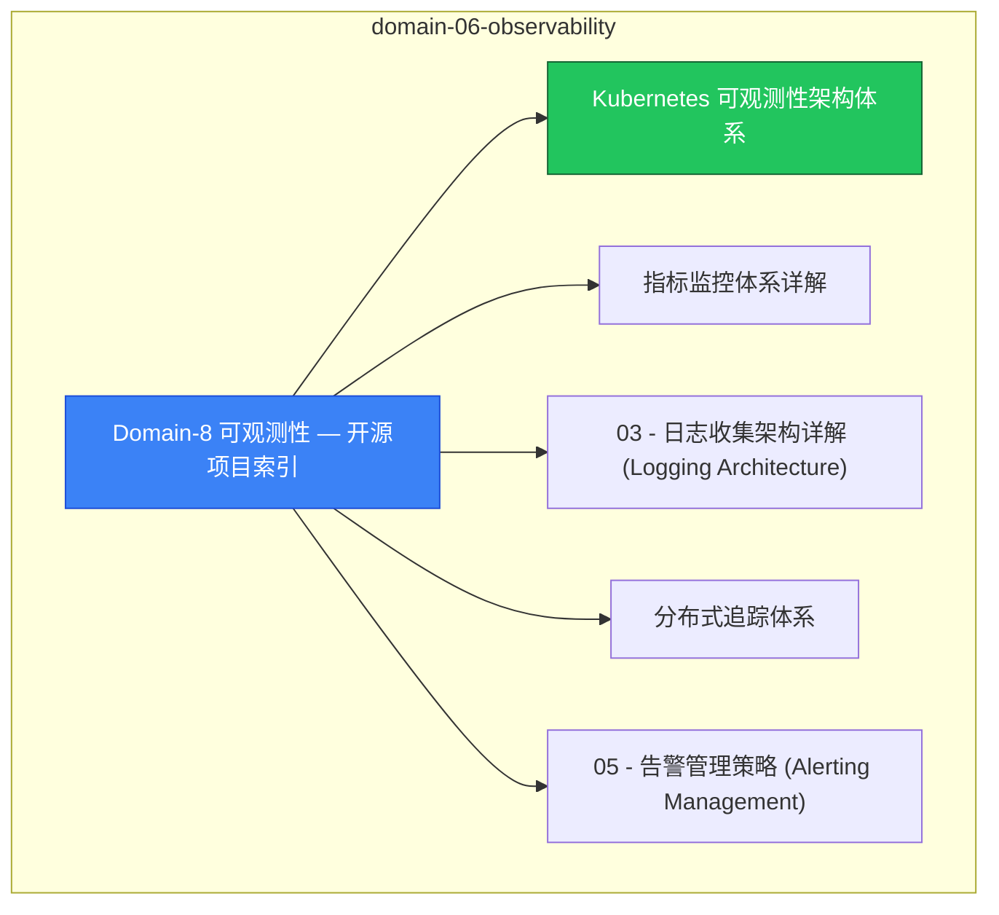

# domain-06-observability MOC

> **MOC 版本**: 1.0
> **知识域**: domain-06-observability
> **文档数量**: 33 篇
> **最后更新**: 2026-05-21
> **用途**: 本知识域的导航入口，汇总所有相关文档、关联领域、和场景入口

---

## 领域概述

可观测性 — Prometheus、Grafana、指标、日志、追踪

### 知识域定位

| 维度 | 说明 |
|---|---|
| **知识域** | domain-06-observability |
| **文档数量** | 33 篇 |
| **难度分布** | 入门 0 / 进阶 2 / 高级 1 / 专家 0 |

---

## 文档清单

| # | 文档 | 难度 | 标签 | 估计阅读时间 |
|---|---|---|---|---|
| 1 | [[domain-06-observability/00-open-source-projects-index.md|Domain-8 可观测性 — 开源项目索引]] |  | k8s, observability, prometheus |  |
| 2 | [[domain-06-observability/01-observability-architecture-overview.md|Kubernetes 可观测性架构体系]] | 进阶 | k8s, observability, metrics | 5min |
| 3 | [[domain-06-observability/02-monitoring-metrics-system.md|指标监控体系详解]] | 进阶 | k8s, prometheus, metrics | 5min |
| 4 | [[domain-06-observability/03-logging-architecture.md|03 - 日志收集架构详解 (Logging Architecture)]] |  | k8s, observability, prometheus |  |
| 5 | [[domain-06-observability/04-distributed-tracing.md|分布式追踪体系]] | 高级 | k8s, tracing, opentelemetry | 5min |
| 6 | [[domain-06-observability/05-alerting-management.md|05 - 告警管理策略 (Alerting Management)]] |  | k8s, observability, prometheus |  |
| 7 | [[domain-06-observability/06-monitoring-alerting-practice.md|06 - 监控告警实战与最佳实践 (Monitoring Alerting Practice)]] |  | k8s, observability, prometheus |  |
| 8 | [[domain-06-observability/07-monitoring-dashboards.md|04 - 监控仪表板设计与最佳实践 (Monitoring Dashboards)]] |  | k8s, observability, prometheus |  |
| 9 | [[domain-06-observability/08-logging-audit-compliance.md|08 - 日志审计与合规管理 (Logging Auditing & Compliance)]] |  | k8s, observability, prometheus |  |
| 10 | [[domain-06-observability/09-events-audit-logs.md|05 - 事件与审计日志管理 (Events & Audit Logs)]] |  | k8s, observability, prometheus |  |
| 11 | [[domain-06-observability/10-monitoring-metrics-prometheus.md|07 - 监控和指标表]] |  | k8s, observability, prometheus |  |
| 12 | [[domain-06-observability/11-custom-metrics-adapter.md|07 - 自定义指标适配器与HPA扩展 (Custom Metrics Adapter & HPA Extension)]] |  | k8s, observability, prometheus |  |
| 13 | [[domain-06-observability/12-logging-auditing.md|17 - 日志和审计表]] |  | k8s, observability, prometheus |  |
| 14 | [[domain-06-observability/13-cluster-health-check.md|13 - 集群健康检查指南 (Cluster Health Check Guide)]] |  | k8s, observability, prometheus |  |
| 15 | [[domain-06-observability/14-chaos-engineering.md|52 - 混沌工程实践]] |  | k8s, observability, prometheus |  |
| 16 | [[domain-06-observability/15-enterprise-scale-monitoring.md|16 - 大规模集群监控最佳实践 (Enterprise Scale Monitoring Best Practices)]] |  | k8s, observability, prometheus |  |
| 17 | [[domain-06-observability/16-multi-cluster-monitoring-governance.md|20 - 多集群统一监控治理 (Multi-Cluster Unified Monitoring Governance)]] |  | k8s, observability, prometheus |  |
| 18 | [[domain-06-observability/17-monitoring-cost-optimization.md|21 - 监控成本优化与治理 (Monitoring Cost Optimization & Governance)]] |  | k8s, observability, prometheus |  |
| 19 | [[domain-06-observability/18-slo-sli-system.md|19 - SLO/SLI体系建设与管理 (SLO/SLI System Construction & Management)]] |  | k8s, observability, prometheus |  |
| 20 | [[domain-06-observability/19-security-compliance-governance.md|23 - 监控安全与合规治理 (Monitoring Security & Compliance Governance)]] |  | k8s, observability, prometheus |  |
| 21 | [[domain-06-observability/20-high-availability-disaster-recovery.md|24 - 监控平台高可用与灾备 (Monitoring Platform High Availability & Disaster Recovery)]] |  | k8s, observability, prometheus |  |
| 22 | [[domain-06-observability/21-monitoring-playbooks.md|24 - 监控运维手册与应急响应 (Monitoring Playbooks & Incident Response)]] |  | k8s, observability, prometheus |  |
| 23 | [[domain-06-observability/22-best-practices-case-studies.md|25 - 可观测性平台最佳实践与案例 (Observability Platform Best Practices & Case Studies)]] |  | k8s, observability, prometheus |  |
| 24 | [[domain-06-observability/23-enterprise-implementation-roadmap.md|24 - 企业可观测性实施路线图 (Enterprise Observability Implementation Roadmap)]] |  | k8s, observability, prometheus |  |
| 25 | [[domain-06-observability/24-observability-tool-ecosystem.md|25 - 可观测性工具生态系统 (Observability Tool Ecosystem)]] |  | k8s, observability, prometheus |  |
| 26 | [[domain-06-observability/25-troubleshooting-overview.md|10 - Kubernetes 生产环境故障排查全攻略 (Production Troubleshooting Guide)]] |  | k8s, observability, prometheus |  |
| 27 | [[domain-06-observability/26-troubleshooting-tools.md|100 - 故障排查增强工具]] |  | k8s, observability, prometheus |  |
| 28 | [[domain-06-observability/27-performance-profiling-tools.md|12 - 性能分析与调优工具 (Performance Profiling & Optimization Tools)]] |  | k8s, observability, prometheus |  |
| 29 | [[domain-06-observability/99-java-observability-kubernetes-guide.md|Java 应用 Kubernetes 可观测性整合指南]] |  | k8s, observability, prometheus |  |
| 30 | [[domain-06-observability/99-kubernetes-v1.33-observability-guide.md|Kubernetes v1.29-v1.33 可观测性新特性指南]] |  | k8s, observability, prometheus |  |
| 31 | [[domain-06-observability/FINAL-QUALITY-ASSESSMENT.md|Domain-8 可观测性领域最终质量评估报告]] |  | k8s, observability, prometheus |  |
| 32 | [[domain-06-observability/QUALITY-REPORT.md|Domain-8 可观测性领域查漏补缺质量报告]] |  | k8s, observability, prometheus |  |
| 33 | [[domain-06-observability/UPDATED-QUALITY-REPORT.md|Domain-8 可观测性领域最终质量报告 (2026年2月更新版)]] |  | k8s, observability, prometheus |  |

---

## 知识图谱

---

## 关联入口

| 入口 | 说明 |
|---|---|
| [[../domain-10-troubleshooting-diagnostics/topic-fta/MOC.md|FTA 故障树]] | domain-06-observability 相关故障树分析 |
| [[../domain-10-troubleshooting-diagnostics/topic-skills/MOC.md|Skills 技能]] | domain-06-observability 相关操作技能 |
| [[../domain-19-landscape-references/topic-index/README.md|深度研究入口]] | 语料库索引与向量检索 |

---

## 统计信息

| 指标 | 数值 |
|---|---|
| 文档总数 | 33 |
| 覆盖 K8s 版本 | v1.25 - v1.32 |

---

*本文档由 scripts/generate-mocs.py 自动生成，最后更新 2026-05-21。*

## See Also

- [[domain-06-observability/98-merged-indexes/MOC-from-domain-20.md|MOC-from-domain-06-observability]]
- [[domain-06-observability/98-merged-indexes/MOC-from-domain-21.md|MOC-from-domain-06-observability]]
- [[domain-06-observability/98-merged-indexes/QUALITY-REPORT.md|QUALITY-REPORT]]
- [[domain-06-observability/98-merged-indexes/README-from-domain-20.md|README-from-domain-06-observability]]

- [[domain-06-observability/README.md|返回目录]]