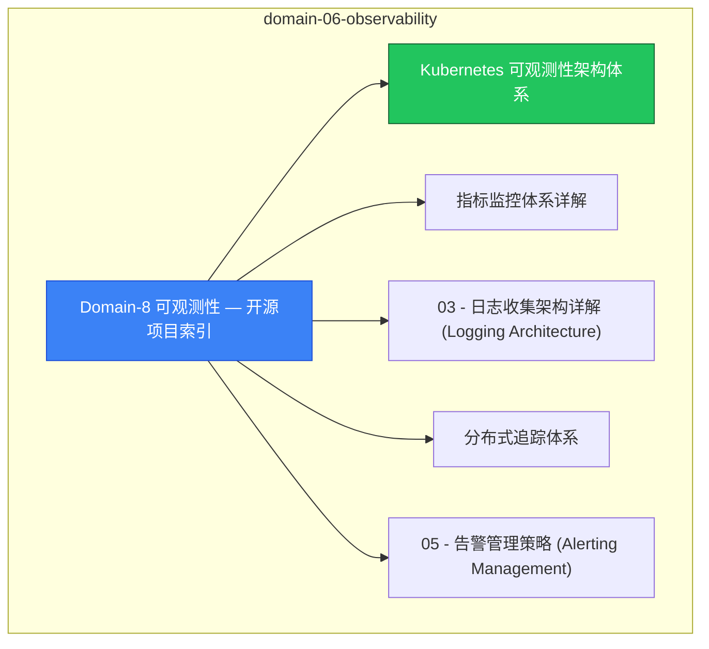

# domain-06-observability MOC

> **MOC 版本**: 1.0
> **知识域**: domain-06-observability
> **文档数量**: 33 篇
> **最后更新**: 2026-05-21
> **用途**: 本知识域的导航入口，汇总所有相关文档、关联领域、和场景入口

---

## 领域概述

可观测性 — Prometheus、Grafana、指标、日志、追踪

### 知识域定位

| 维度 | 说明 |
|---|---|
| **知识域** | domain-06-observability |
| **文档数量** | 33 篇 |
| **难度分布** | 入门 0 / 进阶 2 / 高级 1 / 专家 0 |

---

## 文档清单

| # | 文档 | 难度 | 标签 | 估计阅读时间 |
|---|---|---|---|---|
| 1 | [[domain-06-observability/00-open-source-projects-index|Domain-8 可观测性 — 开源项目索引]] |  | k8s, observability, prometheus |  |
| 2 | Kubernetes 可观测性架构体系 | 进阶 | k8s, observability, metrics | 5min |
| 3 | 指标监控体系详解 | 进阶 | k8s, prometheus, metrics | 5min |
| 4 | 03 - 日志收集架构详解 (Logging Architecture) |  | k8s, observability, prometheus |  |
| 5 | 分布式追踪体系 | 高级 | k8s, tracing, opentelemetry | 5min |
| 6 | 05 - 告警管理策略 (Alerting Management) |  | k8s, observability, prometheus |  |
| 7 | 06 - 监控告警实战与最佳实践 (Monitoring Alerting Practice) |  | k8s, observability, prometheus |  |
| 8 | 04 - 监控仪表板设计与最佳实践 (Monitoring Dashboards) |  | k8s, observability, prometheus |  |
| 9 | 08 - 日志审计与合规管理 (Logging Auditing & Compliance) |  | k8s, observability, prometheus |  |
| 10 | 05 - 事件与审计日志管理 (Events & Audit Logs) |  | k8s, observability, prometheus |  |
| 11 | 07 - 监控和指标表 |  | k8s, observability, prometheus |  |
| 12 | 07 - 自定义指标适配器与HPA扩展 (Custom Metrics Adapter & HPA Extension) |  | k8s, observability, prometheus |  |
| 13 | 17 - 日志和审计表 |  | k8s, observability, prometheus |  |
| 14 | 13 - 集群健康检查指南 (Cluster Health Check Guide) |  | k8s, observability, prometheus |  |
| 15 | 52 - 混沌工程实践 |  | k8s, observability, prometheus |  |
| 16 | 16 - 大规模集群监控最佳实践 (Enterprise Scale Monitoring Best Practices) |  | k8s, observability, prometheus |  |
| 17 | 20 - 多集群统一监控治理 (Multi-Cluster Unified Monitoring Governance) |  | k8s, observability, prometheus |  |
| 18 | 21 - 监控成本优化与治理 (Monitoring Cost Optimization & Governance) |  | k8s, observability, prometheus |  |
| 19 | 19 - SLO/SLI体系建设与管理 (SLO/SLI System Construction & Management) |  | k8s, observability, prometheus |  |
| 20 | 23 - 监控安全与合规治理 (Monitoring Security & Compliance Governance) |  | k8s, observability, prometheus |  |
| 21 | 24 - 监控平台高可用与灾备 (Monitoring Platform High Availability & Disaster Recovery) |  | k8s, observability, prometheus |  |
| 22 | 24 - 监控运维手册与应急响应 (Monitoring Playbooks & Incident Response) |  | k8s, observability, prometheus |  |
| 23 | 25 - 可观测性平台最佳实践与案例 (Observability Platform Best Practices & Case Studies) |  | k8s, observability, prometheus |  |
| 24 | 24 - 企业可观测性实施路线图 (Enterprise Observability Implementation Roadmap) |  | k8s, observability, prometheus |  |
| 25 | 25 - 可观测性工具生态系统 (Observability Tool Ecosystem) |  | k8s, observability, prometheus |  |
| 26 | 10 - Kubernetes 生产环境故障排查全攻略 (Production Troubleshooting Guide) |  | k8s, observability, prometheus |  |
| 27 | 100 - 故障排查增强工具 |  | k8s, observability, prometheus |  |
| 28 | 12 - 性能分析与调优工具 (Performance Profiling & Optimization Tools) |  | k8s, observability, prometheus |  |
| 29 | Java 应用 Kubernetes 可观测性整合指南 |  | k8s, observability, prometheus |  |
| 30 | Kubernetes v1.29-v1.33 可观测性新特性指南 |  | k8s, observability, prometheus |  |
| 31 | Domain-8 可观测性领域最终质量评估报告 |  | k8s, observability, prometheus |  |
| 32 | Domain-8 可观测性领域查漏补缺质量报告 |  | k8s, observability, prometheus |  |
| 33 | Domain-8 可观测性领域最终质量报告 (2026年2月更新版) |  | k8s, observability, prometheus |  |

---

## 知识图谱

---

## 关联入口

| 入口 | 说明 |
|---|---|
| FTA 故障树 | domain-06-observability 相关故障树分析 |
| Skills 技能 | domain-06-observability 相关操作技能 |
| 深度研究入口 | 语料库索引与向量检索 |

---

## 统计信息

| 指标 | 数值 |
|---|---|
| 文档总数 | 33 |
| 覆盖 K8s 版本 | v1.25 - v1.32 |

---

*本文档由 scripts/generate-mocs.py 自动生成，最后更新 2026-05-21。*

## See Also

- [[domain-06-observability/98-merged-indexes/MOC-from-domain-20|MOC-from-domain-06-observability]]
- [[domain-06-observability/98-merged-indexes/MOC-from-domain-21|MOC-from-domain-06-observability]]
- [[domain-06-observability/98-merged-indexes/QUALITY-REPORT|QUALITY-REPORT]]
- [[domain-06-observability/98-merged-indexes/README-from-domain-20|README-from-domain-06-observability]]

- [[domain-06-observability/README|返回目录]]