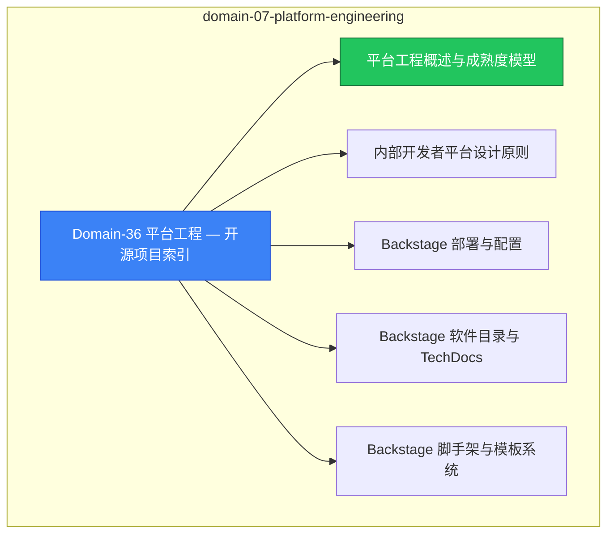

# domain-07-platform-engineering MOC

> **MOC 版本**: 1.0
> **知识域**: domain-07-platform-engineering
> **文档数量**: 13 篇
> **最后更新**: 2026-05-21
> **用途**: 本知识域的导航入口，汇总所有相关文档、关联领域、和场景入口

---

## 领域概述

平台工程 — 内部开发者平台、IDP、Backstage

### 知识域定位

| 维度 | 说明 |
|---|---|
| **知识域** | domain-07-platform-engineering |
| **文档数量** | 13 篇 |
| **难度分布** | 入门 0 / 进阶 0 / 高级 0 / 专家 0 |

---

## 文档清单

| # | 文档 | 难度 | 标签 | 估计阅读时间 |
|---|---|---|---|---|
| 1 | [[domain-07-platform-engineering/00-open-source-projects-index.md|Domain-36 平台工程 — 开源项目索引]] |  | platform, idp |  |
| 2 | [[domain-07-platform-engineering/01-platform-engineering-overview.md|平台工程概述与成熟度模型]] |  | platform, idp, deep-dive |  |
| 3 | [[domain-07-platform-engineering/02-idp-design-principles.md|内部开发者平台设计原则]] |  | platform, idp |  |
| 4 | [[domain-07-platform-engineering/03-backstage-deployment.md|Backstage 部署与配置]] |  | platform, idp, deployment |  |
| 5 | [[domain-07-platform-engineering/04-backstage-catalog-techdocs.md|Backstage 软件目录与 TechDocs]] |  | platform, idp |  |
| 6 | [[domain-07-platform-engineering/05-backstage-scaffolder-templates.md|Backstage 脚手架与模板系统]] |  | platform, idp |  |
| 7 | [[domain-07-platform-engineering/06-kratix-platform-as-code.md|Kratix 平台即代码 (Kratix Platform as Code)]] |  | platform, idp |  |
| 8 | [[domain-07-platform-engineering/07-crossplane-platform-composition.md|Crossplane 平台组合 (Crossplane Platform Composition)]] |  | platform, idp |  |
| 9 | [[domain-07-platform-engineering/08-golden-paths-design.md|Golden Paths 黄金路径设计 (Golden Paths Design Patterns)]] |  | platform, idp |  |
| 10 | [[domain-07-platform-engineering/09-developer-experience-metrics.md|开发者体验度量 (Developer Experience Metrics)]] |  | platform, idp |  |
| 11 | [[domain-07-platform-engineering/10-platform-team-topology.md|平台团队拓扑与运营 (Platform Team Topology and Operations)]] |  | platform, idp |  |
| 12 | [[domain-07-platform-engineering/11-vercel-frontend-deployment-platform.md|Vercel 前端部署平台深度指南]] |  | platform, idp, deployment |  |
| 13 | [[domain-07-platform-engineering/99-backstage-idp-guide.md|Backstage 内部开发者平台 (IDP) 构建指南]] |  | platform, idp, guide |  |

---

## 知识图谱

---

## 关联入口

| 入口 | 说明 |
|---|---|
| [[../domain-10-troubleshooting-diagnostics/topic-fta/MOC.md|FTA 故障树]] | domain-07-platform-engineering 相关故障树分析 |
| [[../domain-10-troubleshooting-diagnostics/topic-skills/MOC.md|Skills 技能]] | domain-07-platform-engineering 相关操作技能 |
| [[../domain-19-landscape-references/topic-index/README.md|深度研究入口]] | 语料库索引与向量检索 |

---

## 统计信息

| 指标 | 数值 |
|---|---|
| 文档总数 | 13 |
| 覆盖 K8s 版本 | v1.25 - v1.32 |

---

*本文档由 scripts/generate-mocs.py 自动生成，最后更新 2026-05-21。*
