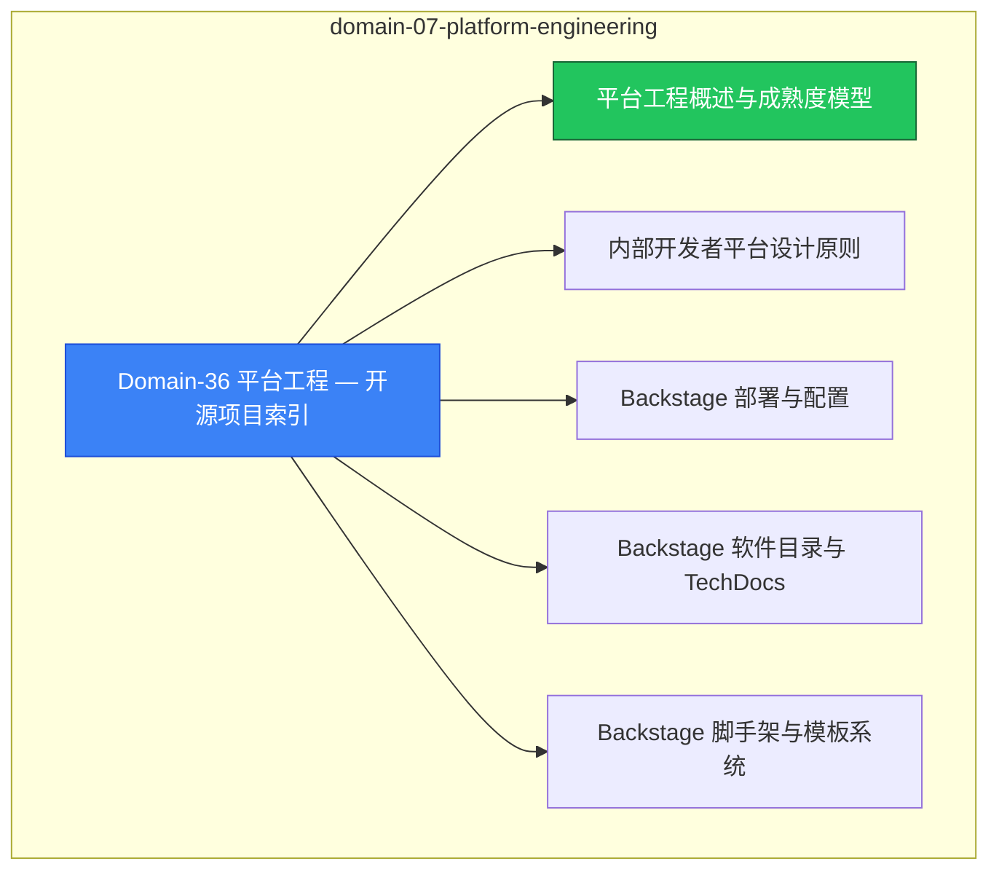

# domain-07-platform-engineering MOC

> **MOC 版本**: 1.0
> **知识域**: domain-07-platform-engineering
> **文档数量**: 13 篇
> **最后更新**: 2026-05-21
> **用途**: 本知识域的导航入口，汇总所有相关文档、关联领域、和场景入口

---

## 领域概述

平台工程 — 内部开发者平台、IDP、Backstage

### 知识域定位

| 维度 | 说明 |
|---|---|
| **知识域** | domain-07-platform-engineering |
| **文档数量** | 13 篇 |
| **难度分布** | 入门 0 / 进阶 0 / 高级 0 / 专家 0 |

---

## 文档清单

| # | 文档 | 难度 | 标签 | 估计阅读时间 |
|---|---|---|---|---|
| 1 | Domain-36 平台工程 — 开源项目索引 |  | platform, idp |  |
| 2 | 平台工程概述与成熟度模型 |  | platform, idp, deep-dive |  |
| 3 | 内部开发者平台设计原则 |  | platform, idp |  |
| 4 | Backstage 部署与配置 |  | platform, idp, deployment |  |
| 5 | Backstage 软件目录与 TechDocs |  | platform, idp |  |
| 6 | Backstage 脚手架与模板系统 |  | platform, idp |  |
| 7 | Kratix 平台即代码 (Kratix Platform as Code) |  | platform, idp |  |
| 8 | Crossplane 平台组合 (Crossplane Platform Composition) |  | platform, idp |  |
| 9 | Golden Paths 黄金路径设计 (Golden Paths Design Patterns) |  | platform, idp |  |
| 10 | 开发者体验度量 (Developer Experience Metrics) |  | platform, idp |  |
| 11 | 平台团队拓扑与运营 (Platform Team Topology and Operations) |  | platform, idp |  |
| 12 | Vercel 前端部署平台深度指南 |  | platform, idp, deployment |  |
| 13 | Backstage 内部开发者平台 (IDP) 构建指南 |  | platform, idp, guide |  |

---

## 知识图谱

---

## 关联入口

| 入口 | 说明 |
|---|---|
| FTA 故障树 | domain-07-platform-engineering 相关故障树分析 |
| Skills 技能 | domain-07-platform-engineering 相关操作技能 |
| 深度研究入口 | 语料库索引与向量检索 |

---

## 统计信息

| 指标 | 数值 |
|---|---|
| 文档总数 | 13 |
| 覆盖 K8s 版本 | v1.25 - v1.32 |

---

*本文档由 scripts/generate-mocs.py 自动生成，最后更新 2026-05-21。*
