title: 内部开发者平台设计原则
description: '# 内部开发者平台设计原则'
category: platform-engineering
tags:
- k8s
- platform-engineering
- developer-experience
- idp
- prometheus
- grafana
- jaeger
- istio
- cilium
- calico
last_updated: 2026-05
difficulty: advanced
reading_level: advanced
audience:
- 平台工程师
- SRE
- 架构师
estimated_read_time: 5min
intent_queries:
- 内部开发者平台设计原则 是什么
- 如何 内部开发者平台设计原则
- Kubernetes 36 platform engineering 最佳实践
trigger_keywords:
- 内部开发者平台设计原则
- platform
- engineering
authors:
- name: KUDIG Team
  role: contributor
k8s_versions:
- '1.28'
- '1.29'
- '1.30'
- '1.31'
- '1.32'
---

# 内部开发者平台设计原则
# Internal Developer Platform Design Principles

> **领域**: 平台工程 | Platform Engineering  
> **难度**: 中级到高级 | Intermediate to Advanced  
> **阅读时间**: 约 65 分钟 | ~65 min read  
> **最后更新**: 2026-03-04

---

<!-- chunk: 目录 | Table of Contents -->## 目录 | Table of Contents

1. [IDP 设计哲学与核心价值观](#1-idp-设计哲学与核心价值观)
2. [用户体验设计原则](#2-用户体验设计原则)
3. [API 设计原则](#3-api-设计原则)
4. [自助服务模式](#4-自助服务模式)
5. [抽象层设计](#5-抽象层设计)
6. [平台契约与 SLA](#6-平台契约与-sla)
7. [渐进式复杂度暴露](#7-渐进式复杂度暴露)
8. [安全设计原则](#8-安全设计原则)
9. [可观测性设计原则](#9-可观测性设计原则)
10. [多租户设计原则](#10-多租户设计原则)
11. [扩展性与插件化架构](#11-扩展性与插件化架构)
12. [版本管理与演进策略](#12-版本管理与演进策略)
13. [设计决策记录 (ADR)](#13-设计决策记录-adr)

---

<!-- chunk: 1. IDP 设计哲学与核心价值观 -->## 1. IDP 设计哲学与核心价值观

#<!-- chunk: 1.1 设计哲学宣言 -->## 1.1 设计哲学宣言

**内部开发者平台的设计必须以开发者为中心**，而非以技术为中心。这意味着：

```
IDP 设计哲学 (Platform Design Philosophy)

我们相信 (We Believe):
  开发者的时间 > 平台的完美性
  简单的正确 > 复杂的全面
  迭代改进 > 一次性完美

我们优先 (We Prioritize):
  用户体验 >> 实现优雅性
  实用价值 >> 技术先进性
  渐进采用 >> 强制统一

我们避免 (We Avoid):
  为了技术而技术
  忽视用户反馈的设计
  一次性大爆炸的发布方式
```

#<!-- chunk: 1.2 十大 IDP 设计原则 -->## 1.2 十大 IDP 设计原则

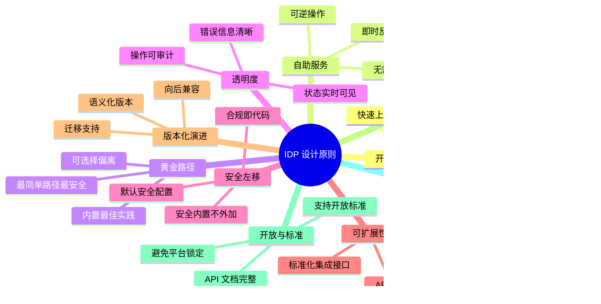

#<!-- chunk: 1.3 设计原则优先级排序 -->## 1.3 设计原则优先级排序

当设计原则发生冲突时，使用以下优先级：

```
优先级排序 (Priority Order)

1. 安全性 (Security)
   └── 任何功能不能妥协安全
   
2. 可靠性 (Reliability)  
   └── 平台故障比功能缺失危害更大
   
3. 开发者体验 (Developer Experience)
   └── 好用的平台才会被使用
   
4. 功能完整性 (Feature Completeness)
   └── 宁可做少但做好
   
5. 性能优化 (Performance)
   └── 足够快即可，无需过度优化
   
6. 技术先进性 (Technical Modernity)
   └── 选择成熟稳定而非最新技术

示例冲突场景:
  Q: 为了提升开发者体验，是否应该跳过安全审批？
  A: 不。安全优先级最高，但应该使安全审批自动化
     而非取消审批。
  
  Q: 为了功能完整，是否应该增加 API 版本？
  A: 需要评估开发者体验影响，向后兼容时不需要
     新版本，破坏性变更时必须版本化。
```

---

<!-- chunk: 2. 用户体验设计原则 -->## 2. 用户体验设计原则

#<!-- chunk: 2.1 UX 设计框架 -->## 2.1 UX 设计框架

IDP 的用户体验设计应遵循 **5-Minute Rule（5分钟规则）**：

```
5 分钟规则:
  新用户在 5 分钟内应该能够:
  ✅ 找到他们需要的服务/文档
  ✅ 理解如何部署一个应用
  ✅ 看到当前系统的健康状态
  
  如果超过 5 分钟，说明 UX 需要改进。
```

**UX 设计层次模型**：

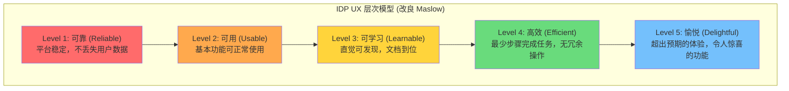

#<!-- chunk: 2.2 信息架构设计 -->## 2.2 信息架构设计

**平台门户信息架构**：

```
IDP Portal 信息架构

主导航
├── 首页 (Home)
│   ├── 快速操作 (Quick Actions)
│   │   ├── 创建新服务
│   │   ├── 部署应用
│   │   └── 查看告警
│   ├── 我的服务 (My Services)
│   └── 系统公告 (Announcements)
│
├── 目录 (Catalog)
│   ├── 服务 (Services)
│   ├── API (APIs)
│   ├── 资源 (Resources)
│   └── 团队 (Teams)
│
├── 创建 (Create)
│   ├── 新服务
│   ├── 新组件
│   └── 新基础设施
│
├── CI/CD (Pipelines)
│   ├── 流水线列表
│   ├── 部署历史
│   └── 回滚操作
│
├── 监控 (Observe)
│   ├── 服务健康
│   ├── 指标仪表板
│   ├── 日志查询
│   └── 告警管理
│
└── 设置 (Settings)
    ├── 团队设置
    ├── 集成配置
    └── 访问管理
```

#<!-- chunk: 2.3 错误处理与反馈设计 -->## 2.3 错误处理与反馈设计

良好的错误处理是 UX 的关键：

```yaml
# IDP 错误处理设计规范

error_design_principles:
  # 原则1: 错误信息要可操作
  bad_example:
    message: "Error: 500 Internal Server Error"
    problem: "用户不知道该怎么办"
  
  good_example:
    message: "部署失败：镜像 'myapp:v1.2' 不存在"
    hint: "请检查镜像名称是否正确，或先运行 CI 流水线构建镜像"
    action_link: "查看 CI 流水线状态"
    support_link: "联系平台支持 #platform-help"
  
  # 原则2: 验证要早，反馈要快
  validation_timing: "表单提交前实时验证"
  feedback_timing: "操作触发后 < 100ms 显示加载状态"
  
  # 原则3: 错误分级
  error_levels:
    warning: "可以继续但建议注意 (黄色)"
    error: "操作失败，需要用户介入 (红色)"
    critical: "系统级问题，影响所有用户 (红色横幅)"

# 成功反馈规范
success_design:
  # 操作确认要有意义
  bad_example:
    message: "成功！"
  
  good_example:
    message: "服务 'order-service' 已成功部署到 staging 环境"
    details:
      - "版本: v2.1.3"
      - "部署时间: 3m 24s"  
      - "实例数: 3"
    next_action: "查看部署状态"
    rollback_link: "如需回滚，点击此处"
```

#<!-- chunk: 2.4 渐进式引导设计 -->## 2.4 渐进式引导设计

**新用户 Onboarding 流程设计**：

```mermaid
sequenceDiagram
    participant User as 新用户
    participant Portal as IDP Portal
    participant Guide as 引导系统
    participant System as 后端系统

    User->>Portal: 首次登录
    Portal->>Guide: 检测新用户
    Guide-->>User: 显示欢迎向导 (可跳过)
    
    User->>Guide: 选择角色 (前端/后端/全栈/SRE)
    Guide-->>User: 展示个性化首页和推荐操作
    
    User->>Portal: 尝试创建第一个服务
    Portal-->>User: 展示交互式教程 (tooltip 引导)
    
    User->>System: 完成第一次操作
    System-->>User: 庆祝 + 下一步建议
    
    Note over User,System: 后续: 上下文相关帮助
    User->>Portal: 执行复杂操作
    Portal-->>User: 显示相关文档链接
```

---

<!-- chunk: 3. API 设计原则 -->## 3. API 设计原则

#<!-- chunk: 3.1 API 优先设计 -->## 3.1 API 优先设计

IDP 的所有功能必须先通过 API 实现，再通过 UI 暴露。这被称为 **API-First Design**：

```
API-First 设计流程:

1. 定义 API 合约 (OpenAPI Spec)
   └── 先写文档，再写代码

2. 内部 API 测试 (API First)
   └── 确保 API 可用性

3. CLI 客户端开发
   └── 命令行工具使用 API

4. UI 开发
   └── Web 界面调用 API

5. 对外暴露 (如需要)
   └── 第三方集成使用相同 API

优势:
  ✅ UI 和 API 功能对等
  ✅ 方便自动化脚本集成
  ✅ 便于测试
  ✅ 文档与实现同步
```

#<!-- chunk: 3.2 RESTful API 设计规范 -->## 3.2 RESTful API 设计规范

```yaml
# IDP API 设计规范

# 资源命名规范
resource_naming:
  format: "名词复数形式，小写，连字符分隔"
  examples:
    - "/api/v1/services"          # ✅ 正确
    - "/api/v1/service"           # ❌ 单数
    - "/api/v1/getServices"       # ❌ 动词
    - "/api/v1/ServiceList"       # ❌ 大写
  
  hierarchical:
    - "/api/v1/namespaces/{ns}/services"          # 命名空间下的服务
    - "/api/v1/namespaces/{ns}/services/{name}"   # 特定服务
    - "/api/v1/namespaces/{ns}/services/{name}/deployments"  # 服务的部署历史

# HTTP 动词使用
http_methods:
  GET: "读取资源，幂等，可缓存"
  POST: "创建资源，非幂等"
  PUT: "完整替换资源，幂等"
  PATCH: "部分更新资源，非幂等"
  DELETE: "删除资源，幂等"

# 响应格式规范
response_format:
  success:
    code: 200
    body: |
      {
        "data": { ... },
        "metadata": {
          "requestId": "req-abc123",
          "timestamp": "2026-03-04T10:00:00Z"
        }
      }
  
  created:
    code: 201
    body: |
      {
        "data": { "id": "svc-xyz789", ... },
        "metadata": { ... }
      }
  
  error:
    code: "4xx/5xx"
    body: |
      {
        "error": {
          "code": "RESOURCE_NOT_FOUND",
          "message": "Service 'order-service' not found in namespace 'production'",
          "details": {
            "namespace": "production",
            "service": "order-service"
          },
          "documentation": "https://platform.internal/docs/errors/RESOURCE_NOT_FOUND"
        },
        "metadata": { "requestId": "req-abc123", ... }
      }

# 分页规范
pagination:
  style: "cursor-based (推荐) 或 offset-based"
  cursor_example: |
    GET /api/v1/services?limit=20&cursor=eyJpZCI6IjEwMCJ9
    Response:
    {
      "data": [...],
      "pagination": {
        "nextCursor": "eyJpZCI6IjEyMCJ9",
        "hasMore": true,
        "total": 150
      }
    }
```

#<!-- chunk: 3.3 API 版本管理策略 -->## 3.3 API 版本管理策略

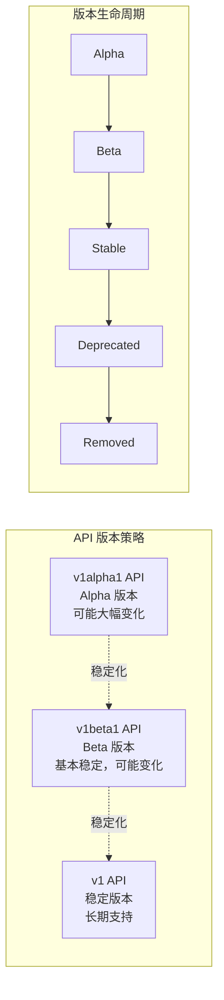

```yaml
# API 版本管理规范

versioning_strategy:
  url_versioning: "/api/v1/..."
  
  lifecycle_policy:
    alpha:
      stability: "实验性，可能随时变化"
      deprecation_notice: "不保证"
      target_users: "早期采用者，平台内部"
    
    beta:
      stability: "基本稳定，小幅变化可能发生"
      deprecation_notice: "至少 3 个月提前通知"
      target_users: "愿意跟踪变化的团队"
    
    stable:
      stability: "承诺向后兼容"
      deprecation_notice: "至少 6 个月，通常 12 个月"
      target_users: "所有团队"
  
  breaking_change_policy:
    definition: "以下变更视为破坏性变更"
    examples:
      - "删除必需字段"
      - "更改字段类型"
      - "删除 API 端点"
      - "更改错误代码含义"
    
    allowed_non_breaking:
      - "添加新的可选字段"
      - "添加新的 API 端点"
      - "添加新的枚举值"
      - "放宽验证规则"
  
  migration_support:
    - "提供迁移指南文档"
    - "新旧版本并行运行期 >= 6 个月"
    - "提供自动化迁移工具（如可能）"
    - "提供迁移验证测试套件"
```

#<!-- chunk: 3.4 平台 API 安全设计 -->## 3.4 平台 API 安全设计

```yaml
# IDP API 安全规范

authentication:
  methods:
    - type: "OAuth 2.0 / OIDC"
      use_case: "人类用户认证"
      token_type: "JWT (短期令牌, < 1小时)"
    
    - type: "Service Account Token"
      use_case: "CI/CD 系统、自动化脚本"
      token_type: "Kubernetes Service Account Token"
    
    - type: "API Key"
      use_case: "简单集成场景"
      rotation_policy: "90天强制轮换"
      storage: "Vault 托管"

authorization:
  model: "RBAC + ABAC 混合"
  
  rbac_roles:
    - role: "platform-admin"
      permissions: ["*"]
      description: "平台管理员，所有权限"
    
    - role: "platform-operator"
      permissions: ["read:*", "write:deployments", "write:services"]
      description: "平台操作员"
    
    - role: "developer"
      permissions: ["read:*", "write:own-namespace:*"]
      description: "开发者，只能操作自己命名空间"
    
    - role: "viewer"
      permissions: ["read:*"]
      description: "只读访问"

  abac_policies:
    - "开发者只能部署到自己团队的命名空间"
    - "生产环境变更需要额外审批"
    - "敏感数据访问需要 MFA 验证"

rate_limiting:
  default: "1000 req/min per API key"
  read_operations: "5000 req/min"
  write_operations: "500 req/min"
  
  headers:
    - "X-RateLimit-Limit: 1000"
    - "X-RateLimit-Remaining: 850"
    - "X-RateLimit-Reset: 1709547600"

audit_logging:
  fields: ["timestamp", "user", "action", "resource", "result", "ip", "requestId"]
  retention: "2 年"
  storage: "不可变存储 (S3 with Object Lock)"
```

#<!-- chunk: 3.5 API 文档规范 -->## 3.5 API 文档规范

```yaml
# OpenAPI 规范示例
openapi: "3.0.3"
info:
  title: "Internal Developer Platform API"
  version: "1.0.0"
  description: |
    内部开发者平台核心 API，提供服务管理、部署控制、
    监控查询等核心能力。
    
    **认证方式**: Bearer Token (OAuth 2.0)
    
    **速率限制**: 1000 requests/minute
    
    **支持**: #platform-help (Slack) | platform@company.com
  contact:
    name: "Platform Engineering Team"
    email: "platform@company.com"
    url: "https://platform.internal/support"

servers:
  - url: "https://api.platform.internal/v1"
    description: "生产环境"
  - url: "https://api.platform-staging.internal/v1"
    description: "测试环境"

paths:
  /services:
    get:
      summary: "列出服务"
      description: "返回当前用户有权访问的所有服务列表"
      tags: ["Services"]
      parameters:
        - name: "namespace"
          in: "query"
          description: "过滤指定命名空间的服务"
          schema:
            type: "string"
        - name: "team"
          in: "query"
          description: "过滤指定团队的服务"
          schema:
            type: "string"
        - name: "limit"
          in: "query"
          schema:
            type: "integer"
            default: 20
            maximum: 100
        - name: "cursor"
          in: "query"
          description: "分页游标"
          schema:
            type: "string"
      responses:
        "200":
          description: "成功返回服务列表"
          content:
            application/json:
              schema:
                $ref: "#/components/schemas/ServiceListResponse"
        "401":
          $ref: "#/components/responses/Unauthorized"
        "403":
          $ref: "#/components/responses/Forbidden"
      security:
        - BearerAuth: []
      
    post:
      summary: "创建服务"
      description: |
        创建新的服务注册。新服务将自动添加到软件目录，
        并触发初始化 Workflow（如配置了 onboarding 模板）。
      tags: ["Services"]
      requestBody:
        required: true
        content:
          application/json:
            schema:
              $ref: "#/components/schemas/CreateServiceRequest"
            example:
              name: "order-service"
              namespace: "ecommerce"
              team: "platform-team"
              type: "backend-service"
              language: "go"
              template: "go-microservice-v2"
      responses:
        "201":
          description: "服务创建成功"
        "400":
          $ref: "#/components/responses/BadRequest"
        "409":
          description: "服务名称已存在"
```

---

<!-- chunk: 4. 自助服务模式 -->## 4. 自助服务模式

#<!-- chunk: 4.1 自助服务设计原则 -->## 4.1 自助服务设计原则

自助服务是 IDP 的核心价值主张。设计良好的自助服务需要满足：

```
自助服务黄金法则 (Golden Rules of Self-Service)

1. 零等待时间原则
   目标: 开发者发起操作后，不需要等待任何人审批
   实现: 守护型自动化（Gatekeeper Automation）代替人工审批
   
2. 即时反馈原则
   目标: 操作结果 < 30 秒可见
   实现: 异步操作 + 状态推送通知
   
3. 可逆操作原则
   目标: 90% 的操作可以自助回滚
   实现: 所有变更使用 GitOps，一键回滚
   
4. 自我诊断原则
   目标: 操作失败时，系统提供清晰的诊断信息
   实现: 丰富的错误日志 + 结构化错误信息
   
5. 最小权限默认原则
   目标: 默认配置是安全的，开发者无需关心安全
   实现: 安全策略作为默认值，需要时可提升权限
```

#<!-- chunk: 4.2 自助服务能力矩阵 -->## 4.2 自助服务能力矩阵

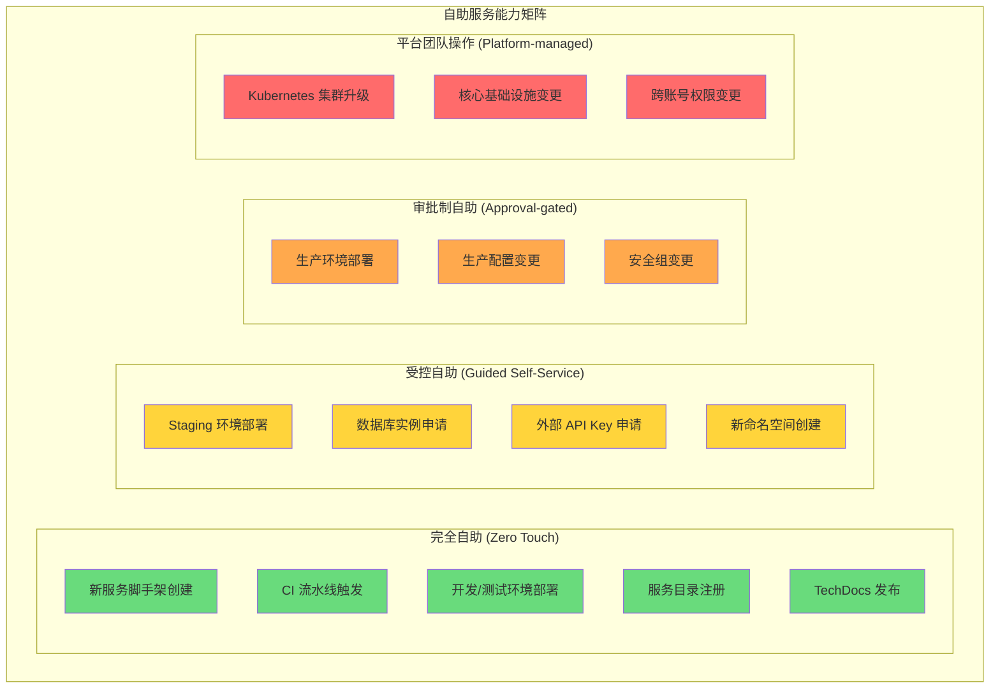

#<!-- chunk: 4.3 自动化审批工作流 -->## 4.3 自动化审批工作流

对于需要审批的操作，使用自动化规则替代人工判断：

```yaml
# 自动化审批规则示例
# automation-approval-policy.yaml

policies:
  production_deployment:
    name: "生产部署审批策略"
    trigger: "deploy to production namespace"
    
    auto_approve_conditions:
      # 满足以下所有条件时自动审批
      - condition: "ci_pipeline_passed"
        description: "CI 流水线全部通过"
      - condition: "staging_deployment_healthy_24h"
        description: "Staging 环境健康运行 24 小时以上"
      - condition: "no_critical_security_issues"
        description: "无高危安全漏洞"
      - condition: "not_friday_afternoon"
        description: "非周五下午（降低风险）"
    
    require_human_approval_if:
      - condition: "database_migration_included"
        approvers: ["senior-engineer", "dba-team"]
        sla: "4 小时内响应"
      - condition: "traffic_increase_expected > 50%"
        approvers: ["sre-oncall"]
        sla: "1 小时内响应"
      - condition: "first_deployment_to_production"
        approvers: ["team-lead"]
        sla: "2 小时内响应"
    
    notification:
      on_auto_approve: "Slack #deployments 频道"
      on_require_approval: "PagerDuty + Slack DM 给审批人"
      on_approval: "Slack 原部署者"
      on_rejection: "Slack 原部署者 + 说明原因"
```

#<!-- chunk: 4.4 自助服务流程示例 -->## 4.4 自助服务流程示例

**示例：自助申请数据库实例**

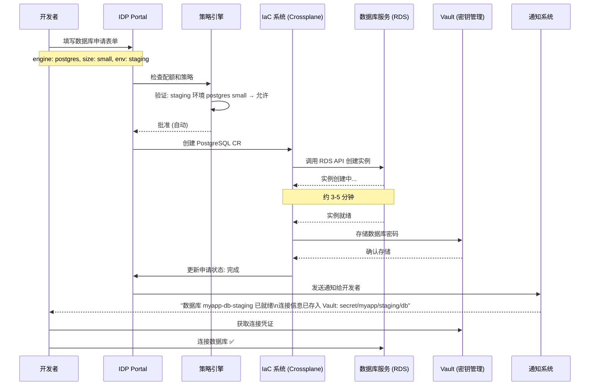

---

<!-- chunk: 5. 抽象层设计 -->## 5. 抽象层设计

#<!-- chunk: 5.1 抽象层的必要性与风险 -->## 5.1 抽象层的必要性与风险

```
抽象层的矛盾 (Abstraction Dilemma)

好的抽象:                    坏的抽象:
✅ 隐藏不必要的复杂性         ❌ 隐藏调试所需的信息
✅ 提供简洁的操作接口         ❌ 过度封装，失去灵活性
✅ 内置最佳实践              ❌ 一刀切，不适应特殊需求
✅ 允许逃逸到底层            ❌ 完全锁定，无法定制

抽象层最优设计原则:
"让简单的事情变简单，让复杂的事情变可能"
        — Alan Kay (改编)
```

#<!-- chunk: 5.2 IDP 抽象层架构 -->## 5.2 IDP 抽象层架构

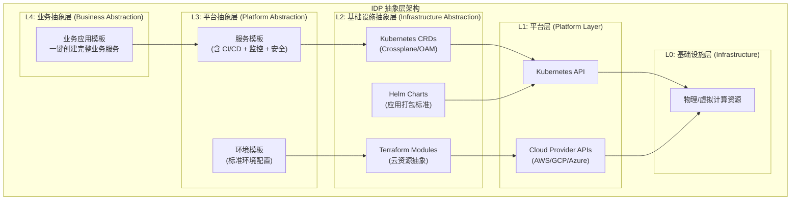

#<!-- chunk: 5.3 逃生门设计 (Escape Hatch) -->## 5.3 逃生门设计 (Escape Hatch)

优秀的抽象层必须提供逃生门：

```yaml
# 逃生门设计原则 - escape-hatch-policy.yaml

escape_hatch_philosophy: |
  黄金路径是推荐路径，不是唯一路径。
  当标准抽象无法满足需求时，开发者有权选择更底层的接口，
  但需要承担相应的责任。

escape_hatch_levels:
  level_1_template_override:
    description: "覆盖模板中的特定配置"
    example: "自定义 resource limits（超出默认范围）"
    process: "在 app.yaml 中设置 override 字段"
    approval: "不需要审批"
    responsibility: "团队自行负责被覆盖的配置"
  
  level_2_raw_kubernetes:
    description: "直接使用原生 Kubernetes 资源"
    example: "自定义 StatefulSet 配置"
    process: "在 GitOps 仓库中添加原生 K8s YAML"
    approval: "需要 Platform Review（1-2 天）"
    responsibility: "团队负责全部 K8s 配置"
  
  level_3_direct_cloud_access:
    description: "直接操作云资源"
    example: "特殊网络拓扑、特殊存储需求"
    process: "提交变更请求，Platform Team 评估"
    approval: "Platform Architect + Security Review"
    responsibility: "团队 + Platform Team 共同负责"
  
  escape_tracking:
    - "所有逃生门使用情况记录在案"
    - "季度审查，识别是否需要标准化为新的抽象"
    - "逃生门使用率过高说明抽象层需要改进"
```

#<!-- chunk: 5.4 Open Application Model (OAM) 集成 -->## 5.4 Open Application Model (OAM) 集成

OAM 是一种标准化的应用抽象模型：

```yaml
# OAM Application 示例
# 这是开发者看到的视角 - 只需关注应用层面

apiVersion: core.oam.dev/v1beta1
kind: Application
metadata:
  name: order-service
  namespace: ecommerce
  annotations:
    platform.company.com/team: "ecommerce-team"
    platform.company.com/tier: "tier-1"  # 影响 SLA 和监控策略
spec:
  components:
    - name: order-service
      type: webservice  # 平台预定义的组件类型
      properties:
        image: registry.company.com/ecommerce/order-service:v2.1.3
        port: 8080
        cpu: "500m"
        memory: "512Mi"
        replicas: 3
        
      # 特性 (Traits) - 平台提供的可选能力
      traits:
        # 自动扩缩容
        - type: hpa
          properties:
            minReplicas: 2
            maxReplicas: 10
            targetCPUUtilization: 70
        
        # 流量管理
        - type: gateway
          properties:
            host: "order.ecommerce.company.com"
            path: "/api/orders"
        
        # 可观测性 (自动注入，无需开发者配置)
        - type: metrics
          properties:
            enabled: true
            scrapeInterval: "30s"
        
        # 日志收集 (自动注入)
        - type: logging
          properties:
            enabled: true
            format: "json"

# 平台团队看到的视角 - OAM 自动转换为以下 K8s 资源:
# - Deployment (含资源限制、安全上下文等最佳实践)
# - Service
# - HorizontalPodAutoscaler
# - Ingress/VirtualService
# - ServiceMonitor (Prometheus)
# - ConfigMap (日志配置)
```

---

<!-- chunk: 6. 平台契约与 SLA -->## 6. 平台契约与 SLA

#<!-- chunk: 6.1 平台契约设计 -->## 6.1 平台契约设计

平台契约 (Platform Contract) 是平台团队与开发团队之间的正式协议，明确双方的权利和义务：

```yaml
# platform-contract-v2.yaml
# 平台服务契约

version: "2.0"
effective_date: "2026-01-01"
review_cycle: "半年"
owner: "Platform Engineering Team"
stakeholders: ["CTO", "Engineering Leads", "Platform Team"]

##############################################
# 第一部分：平台团队承诺
##############################################
platform_commitments:

  core_services_sla:
    kubernetes_cluster:
      availability: "99.95%"
      maintenance_window: "每月第二个周三 02:00-04:00 UTC"
      planned_downtime_notice: "5 个工作日提前通知"
    
    ci_cd_platform:
      availability: "99.5%"
      build_queue_time: "< 2 分钟 (90th percentile)"
      build_success_rate: "> 98% (非代码问题)"
    
    developer_portal:
      availability: "99.9%"
      page_load_time: "< 2 秒 (P95)"
    
    artifact_registry:
      availability: "99.9%"
      upload_speed: "> 100 Mbps"
      pull_speed: "> 500 Mbps (集群内)"

  developer_experience_sla:
    new_service_onboarding:
      target: "< 30 分钟 (使用黄金路径)"
      definition: "从运行模板到第一次成功部署到 staging"
    
    support_response:
      p1_critical: "< 30 分钟响应"
      p2_high: "< 2 小时响应"
      p3_medium: "< 1 个工作日响应"
      p4_low: "< 3 个工作日响应"
    
    feature_request_response:
      acknowledge: "< 1 个工作日"
      backlog_decision: "< 1 周"
      implementation: "依优先级排期，公开路线图可见"

  security_commitments:
    - "所有平台组件每 24 小时进行漏洞扫描"
    - "高危漏洞 24 小时内修复"
    - "中危漏洞 7 天内修复"
    - "低危漏洞在下一个版本修复"
    - "每季度进行渗透测试"

##############################################
# 第二部分：开发团队责任
##############################################
developer_team_commitments:
  
  standards_compliance:
    - "使用平台提供的基础镜像（安全基线）"
    - "在 catalog-info.yaml 中维护准确的服务元数据"
    - "遵循平台定义的资源配额申请流程"
    - "在 2 个版本内升级至平台推荐的依赖版本"
  
  security_responsibilities:
    - "维护应用层的安全（平台负责基础设施安全）"
    - "不在代码中硬编码密钥（使用 Vault）"
    - "及时响应平台推送的安全公告"
  
  feedback_participation:
    - "参与季度开发者体验调研"
    - "在平台 Office Hours 或 Slack 提供反馈"
    - "提交清晰的功能需求（使用标准模板）"

##############################################
# 第三部分：例外处理
##############################################
exception_handling:
  
  sla_breach_process:
    - "平台团队主动识别 SLA 违约"
    - "24 小时内发送根因分析报告"
    - "7 天内发布改进计划"
  
  waiver_process:
    - "开发团队可申请特定标准豁免"
    - "豁免申请需提供业务理由"
    - "Platform Architect 在 3 个工作日内审查"
    - "豁免有效期最长 6 个月，到期需重新申请"
```

#<!-- chunk: 6.2 SLO/SLI 定义 -->## 6.2 SLO/SLI 定义

```yaml
# platform-slo-definitions.yaml

service_level_indicators:
  # SLI 1: 可用性
  availability:
    definition: "在给定时间窗口内成功请求比例"
    measurement: "(成功请求数 / 总请求数) × 100%"
    success_criteria: "HTTP 状态码 < 500"
    exclude: "已知维护窗口期间的请求"
  
  # SLI 2: 延迟
  latency:
    definition: "API 请求从接收到响应的时间"
    measurement: "Prometheus histogram_quantile(0.99, ...)"
    success_criteria: "P99 < 500ms"
  
  # SLI 3: 错误率
  error_rate:
    definition: "返回错误的请求比例"
    measurement: "(5xx 请求数 / 总请求数) × 100%"
    success_criteria: "< 0.1%"

service_level_objectives:
  developer_portal:
    availability_slo: "99.9% (每月允许宕机 43.8 分钟)"
    latency_slo: "P99 < 2000ms"
    error_rate_slo: "< 0.5%"
    error_budget: "0.1% 时间 = 4.38 小时/月"
  
  ci_cd_api:
    availability_slo: "99.5%"
    latency_slo: "P99 < 1000ms"
    error_budget: "0.5% 时间 = 3.65 小时/月"

error_budget_policy:
  healthy: "> 50% 剩余"
  warning: "20-50% 剩余 → 暂停新功能，专注可靠性"
  at_risk: "< 20% 剩余 → 冻结发布，全力修复"
  exhausted: "错误预算耗尽 → 紧急响应程序"
```

---

<!-- chunk: 7. 渐进式复杂度暴露 -->## 7. 渐进式复杂度暴露

#<!-- chunk: 7.1 渐进式披露 (Progressive Disclosure) 模式 -->## 7.1 渐进式披露 (Progressive Disclosure) 模式

渐进式披露是一种 UX 设计模式，向用户展示恰好需要的信息量：

```
渐进式披露层次

层次 1: 零配置模式 (Zero Config)
───────────────────────────────
用户只需提供服务名称
平台使用智能默认值填充所有配置
适用: 新项目快速启动

层次 2: 向导模式 (Wizard Mode)
──────────────────────────────
引导用户完成关键决策
5-7 个问题：语言、数据库、规模、环境
适用: 需要定制但不熟悉底层的团队

层次 3: 模板模式 (Template Mode)
─────────────────────────────────
选择预定义模板，调整特定参数
YAML 配置文件，参数化模板
适用: 有一定经验的团队

层次 4: 专家模式 (Expert Mode)
──────────────────────────────
完全控制所有配置项
访问底层 Kubernetes 资源
适用: 平台工程师、需要特殊配置的团队
```

#<!-- chunk: 7.2 渐进式复杂度配置示例 -->## 7.2 渐进式复杂度配置示例

```yaml
# 层次 1: 零配置
# 用户只需运行: platform create service my-api
# 平台自动使用以下默认值:

defaults:
  language: "auto-detect"  # 根据代码库自动检测
  framework: "auto-detect"
  replicas: 2
  cpu: "250m"
  memory: "256Mi"
  storage: "none"
  database: "none"
  monitoring: true  # 自动启用
  logging: true     # 自动启用
  security_scan: true  # 自动启用

---
# 层次 2: 向导模式产出的配置
# 用户回答了 5 个问题

service:
  name: "order-service"
  type: "web-api"        # Q1: 你的服务类型？
  language: "golang"     # Q2: 使用什么语言？
  database: "postgres"   # Q3: 需要数据库？
  scale: "medium"        # Q4: 预期流量规模？
  environment: "staging" # Q5: 首先部署到哪里？

# 平台根据以上选择自动生成完整配置
---

# 层次 3: 完整模板配置
# 用户可以调整所有参数

apiVersion: platform.company.com/v1
kind: Service
metadata:
  name: order-service
  namespace: ecommerce
spec:
  # 基础配置
  image: 
    repository: "ecommerce/order-service"
    tag: "latest"  # CI 会自动替换
  
  # 计算资源 (相对于默认值的调整)
  resources:
    requests:
      cpu: "500m"
      memory: "512Mi"
    limits:
      cpu: "2000m"
      memory: "2Gi"
  
  # 扩缩容配置
  scaling:
    min: 2
    max: 20
    targetCPU: 70
    targetMemory: 80
  
  # 网络配置
  ingress:
    enabled: true
    host: "orders.ecommerce.company.com"
    tls: true
    annotations:
      nginx.ingress.kubernetes.io/rate-limit: "100"
  
  # 高级配置 (专家模式暴露)
  advanced:
    podDisruptionBudget:
      minAvailable: "50%"
    topologySpreadConstraints:
      enabled: true
    affinityRules: []
```

---

<!-- chunk: 8. 安全设计原则 -->## 8. 安全设计原则

#<!-- chunk: 8.1 安全设计核心原则 -->## 8.1 安全设计核心原则

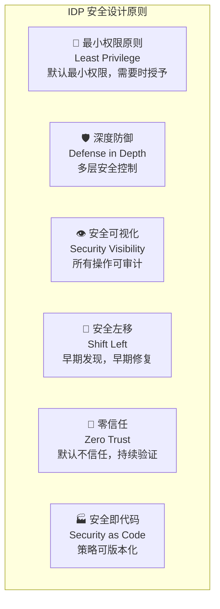

#<!-- chunk: 8.2 供应链安全设计 -->## 8.2 供应链安全设计

```yaml
# 软件供应链安全策略
# supply-chain-security.yaml

build_security:
  # 构建时安全措施
  base_image_policy:
    - "只使用平台批准的基础镜像"
    - "基础镜像每周自动扫描"
    - "高危漏洞 24 小时内发布修复版本"
    
  dependency_scanning:
    - "每次构建进行依赖漏洞扫描 (Trivy)"
    - "Critical/High 漏洞阻断流水线"
    - "Medium 漏洞告警但不阻断"
  
  sbom_generation:
    - "每次构建自动生成 SBOM (Software Bill of Materials)"
    - "SBOM 使用 SPDX 或 CycloneDX 格式"
    - "SBOM 与镜像一起存储"

image_security:
  signing:
    tool: "Cosign (Sigstore)"
    policy: "所有生产镜像必须签名"
    verification: "Kubernetes admission webhook 验证签名"
  
  scanning:
    trigger: ["push to registry", "daily scheduled"]
    tools: ["Trivy", "Grype"]
    policy:
      critical: "阻断部署"
      high: "阻断部署（可豁免）"
      medium: "告警，不阻断"
      low: "记录，不告警"

runtime_security:
  pod_security_standards:
    level: "restricted"  # 最严格级别
    exceptions:
      - namespace: "kube-system"
        level: "privileged"
      - namespace: "monitoring"
        level: "baseline"
  
  network_policies:
    default: "deny-all"  # 默认拒绝所有流量
    exceptions: "必须显式声明允许的流量"
  
  falco_rules:
    - "检测容器内 shell 执行"
    - "检测特权容器创建"
    - "检测敏感文件访问"
    - "检测异常网络连接"

secrets_management:
  tool: "HashiCorp Vault"
  rotation_policy:
    database_credentials: "每 24 小时"
    api_keys: "每 90 天"
    tls_certificates: "证书到期前 30 天"
  
  forbidden_practices:
    - "代码仓库中存储密钥"
    - "容器镜像中嵌入密钥"
    - "未加密传输密钥"
    - "通过环境变量传递密钥（推荐使用 Vault Agent 注入）"
```

#<!-- chunk: 8.3 平台访问控制设计 -->## 8.3 平台访问控制设计

```yaml
# RBAC 设计示例
# rbac-design.yaml

# Kubernetes RBAC 与平台 RBAC 的分层设计

# 层次 1: 平台级别 RBAC
platform_level_rbac:
  platform_admin:
    k8s_resources: ["*"]
    platform_resources: ["*"]
    
  platform_engineer:
    k8s_resources: ["namespaces", "nodes:read", "pods", "deployments"]
    platform_resources: ["templates:write", "policies:write"]
  
  team_lead:
    k8s_resources: ["own-namespace:*"]
    platform_resources: ["team-settings:write", "approvals:approve"]
  
  developer:
    k8s_resources: ["own-namespace:read", "pods:exec:own"]
    platform_resources: ["services:create", "deployments:write:staging"]
  
  viewer:
    k8s_resources: ["all:read"]
    platform_resources: ["all:read"]

---
# Kubernetes ClusterRole 实现示例
apiVersion: rbac.authorization.k8s.io/v1
kind: ClusterRole
metadata:
  name: platform-developer
  labels:
    platform.company.com/managed: "true"
rules:
  # 查看全局资源
  - apiGroups: [""]
    resources: ["namespaces", "nodes"]
    verbs: ["get", "list", "watch"]
  
  # 查看所有命名空间资源（受 RoleBinding 限制）
  - apiGroups: ["", "apps", "extensions"]
    resources: ["pods", "deployments", "services", "configmaps"]
    verbs: ["get", "list", "watch"]
  
  # 自己命名空间的写权限（通过 RoleBinding 绑定）
  - apiGroups: ["", "apps"]
    resources: ["deployments", "services", "configmaps"]
    verbs: ["create", "update", "patch", "delete"]
  
  # Pod 调试权限
  - apiGroups: [""]
    resources: ["pods/exec", "pods/log", "pods/portforward"]
    verbs: ["create", "get"]

---
# 命名空间级别的 RoleBinding
apiVersion: rbac.authorization.k8s.io/v1
kind: RoleBinding
metadata:
  name: ecommerce-team-developer
  namespace: ecommerce  # 限定在 ecommerce 命名空间
roleRef:
  apiGroup: rbac.authorization.k8s.io
  kind: ClusterRole
  name: platform-developer
subjects:
  # 通过 OIDC 群组绑定，自动同步 IdP 中的团队成员
  - kind: Group
    apiGroup: rbac.authorization.k8s.io
    name: "github:ecommerce-team"  # GitHub 团队
```

---

<!-- chunk: 9. 可观测性设计原则 -->## 9. 可观测性设计原则

#<!-- chunk: 9.1 平台可观测性分层 -->## 9.1 平台可观测性分层

平台的可观测性分为两个维度：**平台自身的可观测性**和**平台提供给用户的可观测性能力**。

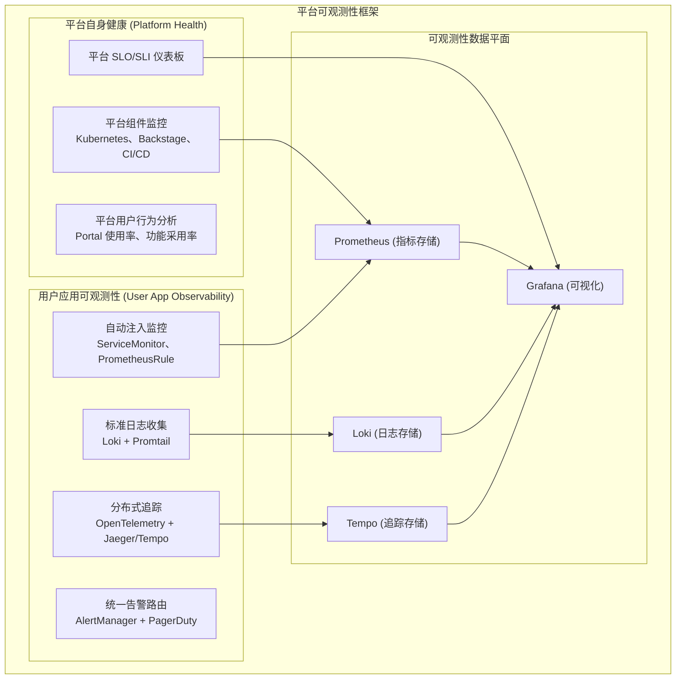

#<!-- chunk: 9.2 平台可观测性标准 -->## 9.2 平台可观测性标准

```yaml
# 平台可观测性标准配置
# observability-standards.yaml

metrics_standards:
  # 所有服务必须暴露的基础指标
  required_metrics:
    - name: "http_requests_total"
      type: "counter"
      labels: ["method", "path", "status_code"]
    - name: "http_request_duration_seconds"
      type: "histogram"
      labels: ["method", "path"]
      buckets: [0.005, 0.01, 0.025, 0.05, 0.1, 0.25, 0.5, 1, 2.5, 5, 10]
    - name: "process_cpu_seconds_total"
      type: "counter"
    - name: "process_resident_memory_bytes"
      type: "gauge"
  
  # 推荐的业务指标
  recommended_metrics:
    - "业务操作计数器 (e.g., orders_created_total)"
    - "业务操作延迟 (e.g., order_processing_duration_seconds)"
    - "队列深度 (e.g., message_queue_depth)"
    - "缓存命中率 (e.g., cache_hit_rate)"

logging_standards:
  format: "JSON (结构化日志)"
  required_fields:
    - timestamp: "ISO 8601 格式"
    - level: "DEBUG/INFO/WARN/ERROR"
    - service: "服务名称"
    - version: "服务版本"
    - trace_id: "分布式追踪 ID"
    - span_id: "Span ID"
    - message: "日志内容"
  
  example: |
    {
      "timestamp": "2026-03-04T10:30:00.123Z",
      "level": "INFO",
      "service": "order-service",
      "version": "v2.1.3",
      "trace_id": "4bf92f3577b34da6a3ce929d0e0e4736",
      "span_id": "00f067aa0ba902b7",
      "message": "Order created successfully",
      "order_id": "ORD-12345",
      "customer_id": "CUST-67890",
      "amount": 99.99
    }
  
  forbidden_patterns:
    - "不在日志中记录密码、Token、信用卡号"
    - "不使用多行日志格式（破坏 JSON 解析）"
    - "不使用 DEBUG 级别在生产环境输出大量日志"

tracing_standards:
  sdk: "OpenTelemetry (OTLP 协议)"
  auto_instrumentation: "Kubernetes 自动注入（无需代码修改）"
  
  span_naming_convention:
    http: "HTTP {method} {path}"
    database: "DB {operation} {table}"
    message_queue: "MQ {operation} {topic}"
  
  required_span_attributes:
    - "service.name"
    - "service.version"
    - "k8s.namespace.name"
    - "k8s.pod.name"
```

#<!-- chunk: 9.3 告警设计原则 -->## 9.3 告警设计原则

```yaml
# 告警设计规范
# alerting-standards.yaml

alert_design_principles:
  # 原则1: 告警必须可操作
  actionability: |
    每条告警必须有明确的 Runbook 链接，
    接收到告警的工程师知道该做什么。
  
  # 原则2: 告警不应有噪音
  noise_reduction:
    - "页面告警只用于影响用户的问题"
    - "使用分组减少告警风暴"
    - "设置合理的 pending 时间避免抖动"
    - "定期审查和清理无用告警"
  
  # 原则3: 告警路由要精准
  routing:
    - "告警发送给能处理的人"
    - "不要广播给所有人（告警疲劳）"
    - "升级路径要清晰"

# AlertManager 配置示例
alertmanager_config: |
  global:
    resolve_timeout: 5m
    slack_api_url: 'https://hooks.slack.com/...'
  
  route:
    group_by: ['alertname', 'namespace', 'team']
    group_wait: 30s
    group_interval: 5m
    repeat_interval: 12h
    receiver: 'platform-team-default'
    
    routes:
      # P1: 生产故障 → PagerDuty + Slack
      - match:
          severity: critical
          environment: production
        receiver: 'pagerduty-and-slack'
        continue: false
      
      # P2: 性能告警 → Slack 
      - match:
          severity: warning
        receiver: 'slack-warning'
      
      # 按团队路由
      - match_re:
          team: "ecommerce|payment"
        receiver: 'ecommerce-team-slack'
  
  receivers:
    - name: 'pagerduty-and-slack'
      pagerduty_configs:
        - routing_key: '{{ secrets.PAGERDUTY_KEY }}'
      slack_configs:
        - channel: '#incidents'
          title: '🔴 P1 告警: {{ .GroupLabels.alertname }}'
          text: |
            *影响*: {{ .GroupLabels.namespace }} / {{ .GroupLabels.service }}
            *描述*: {{ range .Alerts }}{{ .Annotations.description }}{{ end }}
            *Runbook*: {{ range .Alerts }}{{ .Annotations.runbook_url }}{{ end }}
```

---

<!-- chunk: 10. 多租户设计原则 -->## 10. 多租户设计原则

#<!-- chunk: 10.1 多租户隔离模型 -->## 10.1 多租户隔离模型

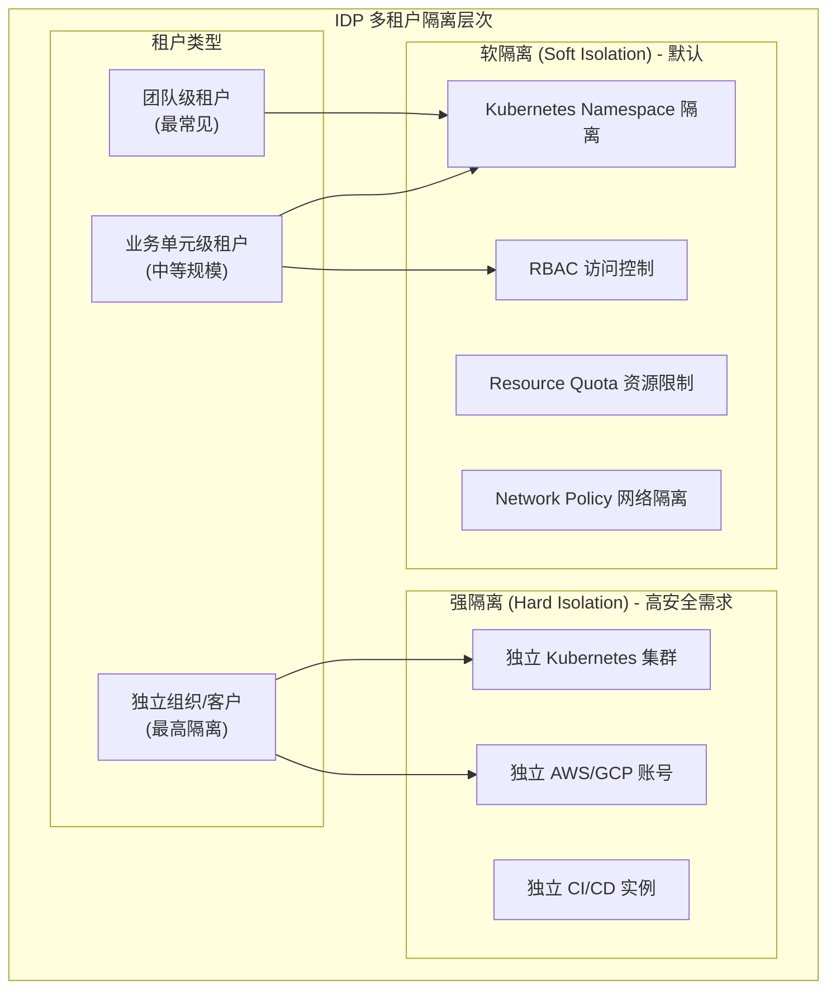

#<!-- chunk: 10.2 命名空间命名规范 -->## 10.2 命名空间命名规范

```yaml
# 命名空间命名规范
namespace_naming_convention:
  pattern: "{team}-{environment}"
  examples:
    - "ecommerce-dev"
    - "ecommerce-staging"
    - "ecommerce-production"
    - "payment-dev"
    - "payment-production"
  
  reserved_namespaces:
    - "kube-system"
    - "kube-public"
    - "platform-system"
    - "monitoring"
    - "logging"
    - "security"

# 标准命名空间标签
namespace_labels:
  required:
    - "team: ecommerce"               # 所属团队
    - "cost-center: CC-12345"         # 成本中心
    - "environment: production"        # 环境类型
    - "tier: tier-1"                  # 服务等级 (影响 SLA)
  
  optional:
    - "compliance: pci-dss"           # 合规要求
    - "data-classification: sensitive" # 数据分类

---
# 命名空间模板
apiVersion: v1
kind: Namespace
metadata:
  name: ecommerce-production
  labels:
    team: "ecommerce"
    environment: "production"
    tier: "tier-1"
    cost-center: "CC-12345"
    platform.company.com/managed: "true"
  annotations:
    platform.company.com/team-lead: "alice@company.com"
    platform.company.com/slack-channel: "#ecommerce-ops"
    platform.company.com/runbook: "https://wiki.company.com/ecommerce/runbook"
    platform.company.com/on-call: "pagerduty://P1234567"
```

#<!-- chunk: 10.3 资源配额管理 -->## 10.3 资源配额管理

```yaml
# 资源配额模板
# 根据团队规模和服务等级动态分配

# Tier 3 (普通服务)
apiVersion: v1
kind: ResourceQuota
metadata:
  name: tier3-quota
  namespace: myteam-production
spec:
  hard:
    # 计算资源
    requests.cpu: "10"
    requests.memory: "20Gi"
    limits.cpu: "20"
    limits.memory: "40Gi"
    
    # 存储
    requests.storage: "100Gi"
    persistentvolumeclaims: "10"
    
    # 对象数量
    pods: "50"
    services: "20"
    secrets: "50"
    configmaps: "50"
    deployments.apps: "20"

---
# Tier 1 (核心服务)
apiVersion: v1
kind: ResourceQuota
metadata:
  name: tier1-quota
  namespace: payment-production
spec:
  hard:
    requests.cpu: "100"
    requests.memory: "200Gi"
    limits.cpu: "200"
    limits.memory: "400Gi"
    requests.storage: "1Ti"
    pods: "500"

---
# LimitRange: 防止没有限制的 Pod
apiVersion: v1
kind: LimitRange
metadata:
  name: default-limits
  namespace: ecommerce-production
spec:
  limits:
    - type: Container
      default:
        cpu: "500m"
        memory: "512Mi"
      defaultRequest:
        cpu: "100m"
        memory: "128Mi"
      max:
        cpu: "8"
        memory: "16Gi"
      min:
        cpu: "50m"
        memory: "64Mi"
```

---

<!-- chunk: 11. 扩展性与插件化架构 -->## 11. 扩展性与插件化架构

#<!-- chunk: 11.1 插件化架构设计 -->## 11.1 插件化架构设计

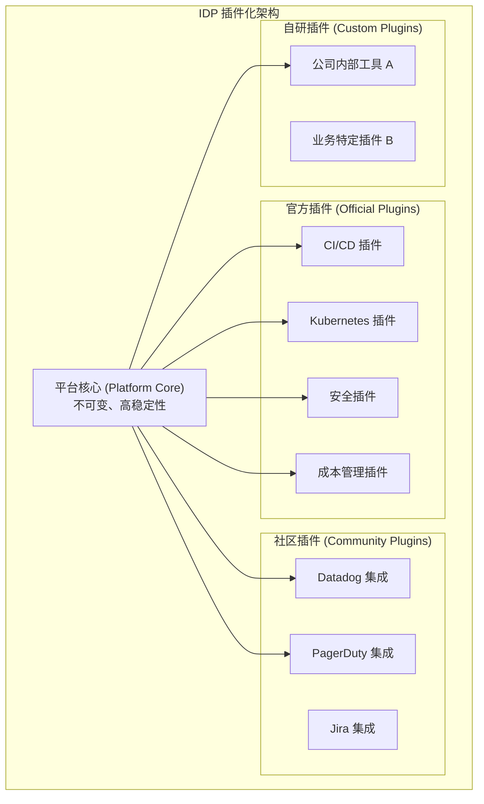

#<!-- chunk: 11.2 插件接口设计 -->## 11.2 插件接口设计

```typescript
// IDP 插件接口设计 (TypeScript/Backstage 风格)

// 插件注册接口
export interface PlatformPlugin {
  // 插件元数据
  id: string;
  name: string;
  version: string;
  description: string;
  
  // 插件类型
  type: 'frontend' | 'backend' | 'scaffolder-action' | 'catalog-processor';
  
  // 依赖声明
  dependencies?: string[];
  
  // 初始化函数
  initialize(config: PluginConfig): Promise<void>;
  
  // 健康检查
  healthCheck(): Promise<HealthStatus>;
}

// 脚手架动作插件示例
export interface ScaffolderActionPlugin extends PlatformPlugin {
  type: 'scaffolder-action';
  
  // 动作定义
  actions: ScaffolderAction[];
}

export interface ScaffolderAction {
  id: string;           // 例如: 'platform:create-repo'
  description: string;
  schema: {
    input: JsonSchema;
    output: JsonSchema;
  };
  handler: (ctx: ActionContext) => Promise<void>;
}

// 目录处理器插件示例
export interface CatalogProcessor {
  // 处理器名称
  getProcessorName(): string;
  
  // 验证实体
  validateEntityKind?(kind: string): Promise<boolean>;
  
  // 处理实体（可以丰富实体数据）
  preProcessEntity?(
    entity: Entity,
    location: LocationSpec,
  ): Promise<Entity>;
  
  // 后处理（可以添加关联关系）
  postProcessEntity?(
    entity: Entity,
    location: LocationSpec,
    emit: CatalogProcessorEmit,
  ): Promise<Entity>;
}
```

#<!-- chunk: 11.3 集成标准接口 -->## 11.3 集成标准接口

```yaml
# 第三方系统集成规范

integration_standards:
  webhook_format:
    trigger: "平台事件发生时推送到外部系统"
    format: "CloudEvents 1.0 标准"
    authentication: "HMAC-SHA256 签名验证"
    retry_policy: "指数退避，最多 3 次重试"
    
    example_payload: |
      {
        "specversion": "1.0",
        "type": "com.company.platform.deployment.completed",
        "source": "/platform/deployments",
        "id": "evt-abc123",
        "time": "2026-03-04T10:00:00Z",
        "datacontenttype": "application/json",
        "data": {
          "service": "order-service",
          "namespace": "ecommerce-production",
          "version": "v2.1.3",
          "status": "success",
          "duration_seconds": 180
        }
      }
  
  event_bus:
    technology: "Kafka 或 NATS (平台选择)"
    topic_naming: "platform.{entity-type}.{action}"
    example_topics:
      - "platform.deployment.started"
      - "platform.deployment.completed"
      - "platform.deployment.failed"
      - "platform.service.created"
      - "platform.service.deleted"
      - "platform.security.violation.detected"
```

---

<!-- chunk: 12. 版本管理与演进策略 -->## 12. 版本管理与演进策略

#<!-- chunk: 12.1 平台组件版本策略 -->## 12.1 平台组件版本策略

```yaml
# 平台版本管理策略

versioning_scheme:
  format: "语义化版本 (SemVer): MAJOR.MINOR.PATCH"
  examples:
    - "2.1.3"    # MAJOR.MINOR.PATCH
    - "2.1.3-rc.1"  # Release Candidate
    - "2.1.3-beta.2"  # Beta
  
  version_increment_rules:
    MAJOR:
      when: "破坏性 API 变更"
      examples:
        - "删除 API 端点"
        - "更改必需字段类型"
        - "不兼容的配置格式变更"
    
    MINOR:
      when: "向后兼容的新功能"
      examples:
        - "新增 API 端点"
        - "新增可选字段"
        - "新增插件"
    
    PATCH:
      when: "向后兼容的 Bug 修复"
      examples:
        - "修复已知 Bug"
        - "性能优化"
        - "文档更新"

release_process:
  alpha:
    branch: "feature/*"
    audience: "平台团队内部测试"
    stability: "不稳定"
    
  beta:
    branch: "release/v*-beta"
    audience: "早期采用者（志愿者团队）"
    duration: "2-4 周"
    stability: "基本稳定"
    
  rc:
    branch: "release/v*-rc"
    audience: "所有团队可用，建议测试"
    duration: "1-2 周"
    stability: "功能冻结，仅修复 Bug"
    
  stable:
    branch: "main"
    audience: "所有团队"
    announcement: "全员邮件 + Slack 公告"
    changelog: "必须发布详细变更日志"

support_policy:
  current: "完全支持（新功能 + Bug 修复）"
  previous_major: "安全修复，持续 6 个月"
  older: "不支持，建议升级"
  
  eol_notice:
    timeline: "EOL 前 3 个月公告"
    channels: ["邮件", "Slack", "Portal 横幅", "CLI 警告"]
```

#<!-- chunk: 12.2 平台迁移指南框架 -->## 12.2 平台迁移指南框架

```yaml
# 版本迁移指南模板
# migration-guide-v2-to-v3.yaml

migration:
  from_version: "2.x"
  to_version: "3.0.0"
  
  breaking_changes:
    - change: "catalog-info.yaml 格式变更"
      old_format: |
        apiVersion: backstage.io/v1alpha1
        kind: Component
        spec:
          type: service  # 旧字段名
      
      new_format: |
        apiVersion: backstage.io/v1beta1
        kind: Component  
        spec:
          componentType: service  # 新字段名
      
      migration_tool: "platform migrate catalog-info ."
      effort: "低（自动化工具处理 95% 情况）"
      
    - change: "CI/CD 模板语法变更"
      old_format: "pipeline.yaml v1 语法"
      new_format: "pipeline.yaml v2 语法"
      migration_tool: "platform migrate pipeline ."
      effort: "中（需要人工审查）"

  migration_steps:
    1:
      title: "备份当前配置"
      command: "platform backup --output ./backup-v2"
      duration: "5 分钟"
    
    2:
      title: "运行迁移检测"
      command: "platform migrate check --from 2 --to 3"
      expected_output: "列出所有需要迁移的文件"
      duration: "2 分钟"
    
    3:
      title: "运行自动迁移"
      command: "platform migrate run --from 2 --to 3 --dry-run"
      note: "先用 --dry-run 预览变更"
      duration: "5 分钟"
    
    4:
      title: "应用迁移"
      command: "platform migrate run --from 2 --to 3"
      duration: "10 分钟"
    
    5:
      title: "验证迁移结果"
      command: "platform validate"
      duration: "5 分钟"
    
    6:
      title: "测试核心功能"
      checklist:
        - "服务目录正常加载"
        - "CI/CD 流水线正常触发"
        - "部署功能正常"
      duration: "30 分钟"
  
  rollback_procedure:
    command: "platform rollback --from-backup ./backup-v2"
    duration: "10 分钟"
    note: "如遇严重问题，可在 24 小时内完全回滚"
```

---

<!-- chunk: 13. 设计决策记录 (ADR) -->## 13. 设计决策记录 (ADR)

#<!-- chunk: 13.1 ADR 的重要性 -->## 13.1 ADR 的重要性

架构决策记录 (Architecture Decision Records, ADR) 是捕获重要架构决策的关键实践：

```
为什么需要 ADR？

问题场景:
  6 个月后，新团队成员问："为什么我们用 Argo CD 而不是 Flux？"
  
没有 ADR 时的情况:
  ❌ 没人记得当初的讨论
  ❌ 原始决策者可能已离职
  ❌ 相同的讨论需要重来一遍
  ❌ 决策可能被随意推翻

有 ADR 时的情况:
  ✅ 清楚记录了选择 Argo CD 的原因
  ✅ 记录了评估的备选方案
  ✅ 知道哪些假设条件发生了变化
  ✅ 可以有依据地修改或维持决策
```

#<!-- chunk: 13.2 ADR 模板 -->## 13.2 ADR 模板

```markdown
# ADR-001: 选择 Backstage 作为 IDP Portal

<!-- chunk: 状态 (Status) -->## 状态 (Status)
已接受 (Accepted) - 2026-01-15

<!-- chunk: 背景 (Context) -->## 背景 (Context)
随着工程团队规模扩大到 80+ 人，服务数量增长到 150+，
我们需要一个统一的开发者门户来管理服务目录、文档和工具集成。

<!-- chunk: 决策 (Decision) -->## 决策 (Decision)
选择 Backstage 作为我们的内部开发者门户基础平台。

<!-- chunk: 备选方案 (Alternatives Considered) -->## 备选方案 (Alternatives Considered)

| 方案 | 优势 | 劣势 | 评分 |
|------|------|------|------|
| Backstage (开源) | 插件丰富、社区活跃、CNCF毕业 | 运维成本高、配置复杂 | ★★★★☆ |
| Port (SaaS) | 快速上手、无运维负担 | 成本高、定制受限 | ★★★☆☆ |
| 自研 | 完全定制 | 开发成本极高、维护困难 | ★★☆☆☆ |
| OpsLevel | 分析能力强 | 价格贵、集成较少 | ★★★☆☆ |

<!-- chunk: 理由 (Rationale) -->## 理由 (Rationale)
1. **社区生态**: Backstage 有 100+ 开源插件，覆盖我们 80% 的集成需求
2. **成本**: 开源版本零许可成本，运维成本通过标准化 Kubernetes 部署可控
3. **定制化**: 可以开发内部插件满足特定需求
4. **战略对齐**: CNCF 项目，与我们的云原生战略一致
5. **人才**: 市场上有 Backstage 经验的工程师，招聘有优势

<!-- chunk: 后果 (Consequences) -->## 后果 (Consequences)

积极影响:
- 统一服务目录，提升服务可发现性
- 开发者文档中心化，减少文档碎片化
- 插件生态可扩展，长期ROI良好

消极影响:
- 需要 1-2 名工程师专职运维 Backstage
- 前期配置复杂，需要 2-3 个月达到可用状态
- 依赖 Node.js 生态，团队需要学习成本

<!-- chunk: 复审条件 (Review Triggers) -->## 复审条件 (Review Triggers)
以下情况发生时重新评估此决策:
- Backstage 停止维护或失去社区支持
- 运维成本超过 2 名全职工程师等效
- 出现明显更优秀的开源替代方案
- 公司规模扩大到需要多实例部署

<!-- chunk: 相关文档 -->## 相关文档
- [Backstage 评估报告](https://wiki.internal/backstage-evaluation)
- [ADR-002: Backstage 部署架构](./ADR-002-backstage-architecture.md)
```

#<!-- chunk: 13.3 IDP 关键 ADR 清单 -->## 13.3 IDP 关键 ADR 清单

以下是 IDP 建设过程中应该记录的关键架构决策：

```yaml
# 推荐记录的 ADR 列表

critical_decisions_to_document:
  
  platform_foundation:
    - "ADR-001: IDP Portal 选型 (Backstage vs 自研 vs SaaS)"
    - "ADR-002: Kubernetes 集群架构 (单集群 vs 多集群)"
    - "ADR-003: GitOps 工具选型 (Argo CD vs Flux)"
    - "ADR-004: CI/CD 平台选型 (GitHub Actions vs GitLab CI vs Tekton)"
  
  infrastructure:
    - "ADR-005: 云平台选择 (AWS vs GCP vs Azure)"
    - "ADR-006: IaC 工具选型 (Terraform vs Crossplane vs Pulumi)"
    - "ADR-007: 服务网格决策 (Istio vs Linkerd vs 无服务网格)"
    - "ADR-008: 存储策略 (有状态服务处理方式)"
  
  security:
    - "ADR-009: 密钥管理方案 (Vault vs AWS Secrets Manager)"
    - "ADR-010: 镜像仓库选择 (Harbor vs ECR vs 两者结合)"
    - "ADR-011: 网络策略策略 (Calico vs Cilium)"
  
  observability:
    - "ADR-012: 指标存储 (Prometheus vs Thanos vs Mimir)"
    - "ADR-013: 日志存储 (EFK vs Loki vs 商业方案)"
    - "ADR-014: 追踪方案 (Jaeger vs Tempo vs Zipkin)"
    - "ADR-015: 告警路由 (AlertManager vs Grafana OnCall)"
  
  developer_experience:
    - "ADR-016: 模板引擎 (Backstage Scaffolder vs Cookiecutter)"
    - "ADR-017: 文档平台 (TechDocs vs Confluence vs Wiki)"
    - "ADR-018: 内部 CLI 工具设计决策"
```

---

<!-- chunk: 总结 | Summary -->## 总结 | Summary

IDP 设计原则是构建成功内部开发者平台的基石。核心要点：

#<!-- chunk: 设计要点回顾 -->## 设计要点回顾

1. **以开发者为中心**：所有设计决策从开发者体验出发，定期收集反馈
2. **API 优先**：所有功能先 API 后 UI，保证自动化能力
3. **渐进式自助化**：从 0 到 80%+ 自助化是一个渐进过程
4. **抽象但不锁定**：好的抽象隐藏复杂性，但保留逃生门
5. **安全左移**：安全内置到平台，而非额外步骤
6. **记录决策**：ADR 是团队知识沉淀的重要载体

#<!-- chunk: 成功的 IDP 特征 -->## 成功的 IDP 特征

```
✅ 新开发者 30 分钟内能部署第一个服务
✅ 80%+ 常规操作可自助完成（< 5 分钟）
✅ 开发者 NPS > 30
✅ 所有操作完全可审计
✅ 平台自身可用性 > 99.9%
✅ 文档与平台同步更新
✅ 清晰的版本策略和迁移路径
```

---

<!-- chunk: 参考资料 | References -->## 参考资料 | References

1. [Internal Developer Platform Principles - CNCF](https://tag-app-delivery.cncf.io/)
2. [API Design Guide - Google](https://cloud.google.com/apis/design)
3. [Architecture Decision Records - Michael Nygard](https://cognitect.com/blog/2011/11/15/documenting-architecture-decisions)
4. [Team Topologies - Skelton & Pais](https://teamtopologies.com/)
5. [Platform Engineering Maturity Model - CNCF](https://tag-app-delivery.cncf.io/wgs/platforms/maturity-model/)
6. [Open Application Model Specification](https://oam.dev/)
7. [DORA Research 2024](https://dora.dev/research/)
8. [The SPACE of Developer Productivity - Microsoft Research](https://queue.acm.org/detail.cfm?id=3454124)

---

*文档版本: v1.0 | 最后更新: 2026-03-04 | 作者: Platform Engineering Team*

## See Also

- [[domain-07-platform-engineering/99-backstage-idp-guide.md|99-backstage-idp-guide]]
- [[domain-07-platform-engineering/01-platform-engineering-overview.md|01-platform-engineering-overview]]
- [[domain-07-platform-engineering/03-backstage-deployment.md|03-backstage-deployment]]
- [[domain-07-platform-engineering/04-backstage-catalog-techdocs.md|04-backstage-catalog-techdocs]]
