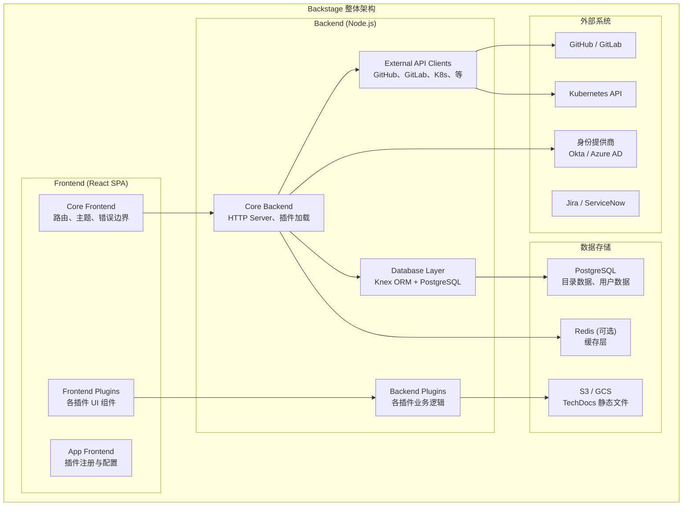
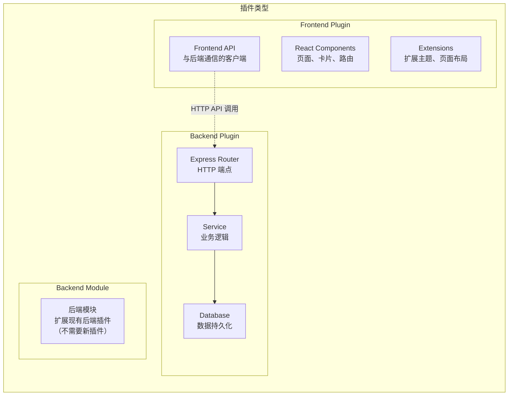

# [[Backstage|Backstage]] 部署与配置
# Backstage Deployment and Configuration

> **领域**: 平台工程 | [[concepts/platform-engineering-sre.md|Platform Engineering]]  
> **难度**: 中级到高级 | Intermediate to Advanced  
> **阅读时间**: 约 70 分钟 | ~70 min read  
> **最后更新**: 2026-03-04

---

<!-- chunk: 目录 | Table of Contents -->## 目录 | Table of Contents

1. [Backstage 架构深度解析](#1-backstage-架构深度解析)
2. [前端架构与插件系统](#2-前端架构与插件系统)
3. [后端架构与 API 设计](#3-后端架构与-api-设计)
4. [[entities/kubernetes.md|Kubernetes]] 生产部署](#4-kubernetes-生产部署)
5. [PostgreSQL 数据库配置](#5-postgresql-数据库配置)
6. [认证配置：OAuth 与 OIDC](#6-认证配置oauth-与-oidc)
7. [RBAC 权限控制](#7-rbac-权限控制)
8. [生产环境配置最佳实践](#8-生产环境配置最佳实践)
9. [性能调优](#9-性能调优)
10. [监控与可观测性配置](#10-监控与可观测性配置)
11. [高可用与灾备](#11-高可用与灾备)
12. [升级策略与版本管理](#12-升级策略与版本管理)
13. [故障排查指南](#13-故障排查指南)

---

<!-- chunk: 1. Backstage 架构深度解析 -->## 1. Backstage 架构深度解析

## 1.1 整体架构概览

Backstage 是一个基于 React（前端）和 Node.js（后端）的全栈开发者门户平台：



## 1.2 核心概念

```
Backstage 核心概念体系

1. App (应用)
   └── Backstage 实例的根对象，包含所有插件的注册
   
2. Plugin (插件)
   ├── Frontend Plugin: React 组件、路由、主题扩展
   └── Backend Plugin: API 端点、数据库访问、外部集成
   
3. Catalog (目录)
   └── 统一的软件实体注册表
   
4. Entity (实体)
   ├── Component (服务、网站、库)
   ├── API (OpenAPI、GraphQL、gRPC)
   ├── Resource (数据库、S3、队列)
   ├── System (服务集合)
   ├── Domain (业务域)
   ├── Group (团队)
   └── User (用户)
   
5. Location (位置)
   └── 告诉 Backstage 去哪里发现实体 (catalog-info.yaml)
   
6. Scaffolder (脚手架)
   └── 基于模板创建新组件/服务的工作流引擎
   
7. TechDocs (技术文档)
   └── 基于 MkDocs 的文档系统，与代码同存储
```

## 1.3 插件架构详解



---

<!-- chunk: 2. 前端架构与插件系统 -->## 2. 前端架构与插件系统

## 2.1 前端入口配置

```typescript
// packages/app/src/App.tsx
// Backstage 前端应用入口

import React from 'react';
import { Navigate, Route } from 'react-router-dom';

// Backstage 核心导入
import { createApp } from '@backstage/app-defaults';
import { AppRouter, FlatRoutes } from '@backstage/core-app-api';
import {
  AlertDisplay,
  OAuthRequestDialog,
  SignInPage,
} from '@backstage/core-components';

// 插件导入
import { catalogPlugin } from '@backstage/plugin-catalog';
import { scaffolderPlugin } from '@backstage/plugin-scaffolder';
import { techdocsPlugin } from '@backstage/plugin-techdocs';
import { orgPlugin } from '@backstage/plugin-org';
import { kubernetesPlugin } from '@backstage/plugin-kubernetes';

// 认证提供商
import {
  microsoftAuthApiRef,
  githubAuthApiRef,
} from '@backstage/core-plugin-api';

// 自定义主题
import { customTheme } from './theme';

// 内部自定义插件
import { internalDashboardPlugin } from '@company/plugin-internal-dashboard';

const app = createApp({
  apis: [
    // API 工厂配置
  ],
  
  components: {
    // 自定义 SignIn 页面
    SignInPage: props => (
      <SignInPage
        {...props}
        auto
        providers={[
          'guest', // 开发环境使用
          {
            id: 'microsoft-auth-provider',
            title: '使用 Microsoft 登录',
            message: '使用你的公司 Microsoft 账号',
            apiRef: microsoftAuthApiRef,
          },
          {
            id: 'github-auth-provider',
            title: '使用 GitHub 登录',
            message: '使用你的 GitHub 账号',
            apiRef: githubAuthApiRef,
          },
        ]}
      />
    ),
  },
  
  themes: [{
    id: 'company-theme',
    title: 'Company Theme',
    variant: 'light',
    theme: customTheme,
  }],
  
  plugins: [
    catalogPlugin,
    scaffolderPlugin,
    techdocsPlugin,
    orgPlugin,
    kubernetesPlugin,
    internalDashboardPlugin,
  ],
});

const routes = (
  <FlatRoutes>
    {/* 默认重定向到首页 */}
    <Route path="/" element={<Navigate to="catalog" />} />
    
    {/* 软件目录 */}
    <Route path="/catalog" element={<CatalogIndexPage />} />
    <Route path="/catalog/:namespace/:kind/:name" element={<CatalogEntityPage />} />
    
    {/* 脚手架 */}
    <Route path="/create" element={<ScaffolderPage />} />
    
    {/* TechDocs */}
    <Route path="/docs" element={<TechDocsIndexPage />} />
    <Route path="/docs/:namespace/:kind/:name/*" element={<TechDocsReaderPage />} />
    
    {/* API Explorer */}
    <Route path="/api-docs" element={<ApiExplorerPage />} />
    
    {/* 组织架构 */}
    <Route path="/org" element={<OrgPage />} />
    
    {/* 内部仪表板 */}
    <Route path="/dashboard" element={<InternalDashboardPage />} />
  </FlatRoutes>
);

export default app.createRoot(
  <>
    <AlertDisplay />
    <OAuthRequestDialog />
    <AppRouter>
      {routes}
    </AppRouter>
  </>
);
```

## 2.2 自定义主题配置

```typescript
// packages/app/src/theme/index.ts

import {
  createBaseThemeOptions,
  createUnifiedTheme,
  palettes,
} from '@backstage/theme';

export const customTheme = createUnifiedTheme({
  ...createBaseThemeOptions({
    palette: {
      ...palettes.light,
      primary: {
        main: '#1976D2',      // 公司主色
        light: '#42A5F5',
        dark: '#1565C0',
        contrastText: '#FFFFFF',
      },
      secondary: {
        main: '#26A69A',      // 次要色
        light: '#4DB6AC',
        dark: '#00796B',
      },
      navigation: {
        background: '#1A237E', // 导航栏背景
        indicator: '#FFFFFF',
        color: '#FFFFFF',
        selectedColor: '#FFFFFF',
        navItem: {
          hoverBackground: 'rgba(255,255,255,0.15)',
        },
      },
    },
  }),
  
  fontFamily: '"Inter", "Roboto", "Helvetica", "Arial", sans-serif',
  
  defaultPageTheme: 'home',
  
  pageTheme: {
    home: {
      backgroundImage: 'url("/static/background.svg")',
      fontColor: '#FFFFFF',
    },
    documentation: {
      backgroundImage: 'linear-gradient(135deg, #1A237E 0%, #283593 100%)',
      fontColor: '#FFFFFF',
    },
    tool: {
      backgroundImage: 'linear-gradient(135deg, #004D40 0%, #00695C 100%)',
      fontColor: '#FFFFFF',
    },
    service: {
      backgroundImage: 'linear-gradient(135deg, #1A237E 0%, #283593 100%)',
      fontColor: '#FFFFFF',
    },
  },
});
```

## 2.3 实体页面自定义

```typescript
// packages/app/src/components/catalog/EntityPage.tsx
// 自定义实体详情页布局

import React from 'react';
import {
  EntityAboutCard,
  EntityDependsOnComponentsCard,
  EntityDependsOnResourcesCard,
  EntityHasComponentsCard,
  EntityHasResourcesCard,
  EntityLinksCard,
  EntitySwitch,
  isComponentType,
  isKind,
} from '@backstage/plugin-catalog';

import {
  EntityKubernetesContent,
} from '@backstage/plugin-kubernetes';

import {
  EntityTechdocsContent,
} from '@backstage/plugin-techdocs';

import {
  EntityApiDefinitionCard,
  EntityConsumedApisCard,
  EntityProvidedApisCard,
} from '@backstage/plugin-api-docs';

import {
  EntityCatalogGraphCard,
} from '@backstage/plugin-catalog-graph';

import { Grid } from '@material-ui/core';

// 服务类型实体页面
const serviceEntityPage = (
  <EntityLayout>
    <EntityLayout.Route path="/" title="概览">
      <Grid container spacing={3}>
        {/* 服务基本信息 */}
        <Grid item xs={12} md={6}>
          <EntityAboutCard variant="gridItem" />
        </Grid>
        
        {/* 快速链接 */}
        <Grid item xs={12} md={6}>
          <EntityLinksCard />
        </Grid>
        
        {/* CI/CD 状态 (自定义插件) */}
        <Grid item xs={12}>
          <EntityCiCdStatusCard />
        </Grid>
        
        {/* 服务健康状态 */}
        <Grid item xs={12} md={6}>
          <EntityServiceHealthCard />
        </Grid>
        
        {/* 告警状态 */}
        <Grid item xs={12} md={6}>
          <EntityAlertsCard />
        </Grid>
      </Grid>
    </EntityLayout.Route>
    
    {/* Kubernetes 标签页 */}
    <EntityLayout.Route path="/kubernetes" title="Kubernetes">
      <EntityKubernetesContent refreshIntervalMs={30000} />
    </EntityLayout.Route>
    
    {/* API 文档标签页 */}
    <EntityLayout.Route path="/api" title="API">
      <Grid container spacing={3}>
        <Grid item xs={12}>
          <EntityProvidedApisCard />
        </Grid>
        <Grid item xs={12}>
          <EntityConsumedApisCard />
        </Grid>
      </Grid>
    </EntityLayout.Route>
    
    {/* 依赖关系图 */}
    <EntityLayout.Route path="/dependencies" title="依赖关系">
      <Grid container spacing={3}>
        <Grid item xs={12}>
          <EntityCatalogGraphCard variant="gridItem" height={400} />
        </Grid>
        <Grid item xs={12} md={6}>
          <EntityDependsOnComponentsCard variant="gridItem" />
        </Grid>
        <Grid item xs={12} md={6}>
          <EntityDependsOnResourcesCard variant="gridItem" />
        </Grid>
      </Grid>
    </EntityLayout.Route>
    
    {/* TechDocs */}
    <EntityLayout.Route path="/docs" title="文档">
      <EntityTechdocsContent />
    </EntityLayout.Route>
  </EntityLayout>
);
```

---

<!-- chunk: 3. 后端架构与 API 设计 -->## 3. 后端架构与 API 设计

## 3.1 后端插件开发示例

```typescript
// plugins/platform-metrics-backend/src/plugin.ts
// 自定义后端插件示例：平台指标 API

import {
  createBackendPlugin,
  coreServices,
} from '@backstage/backend-plugin-api';
import { catalogServiceRef } from '@backstage/plugin-catalog-node';
import Router from 'express-promise-router';
import Prometheus from 'prom-client';

// 定义插件
export const platformMetricsPlugin = createBackendPlugin({
  pluginId: 'platform-metrics',
  register(env) {
    env.registerInit({
      deps: {
        httpRouter: coreServices.httpRouter,
        logger: coreServices.logger,
        config: coreServices.rootConfig,
        database: coreServices.database,
        catalog: catalogServiceRef,
      },
      async init({ httpRouter, logger, config, database, catalog }) {
        const router = Router();
        
        // Prometheus 指标定义
        const deploymentCounter = new Prometheus.Counter({
          name: 'platform_deployments_total',
          help: '平台部署总次数',
          labelNames: ['service', 'namespace', 'result'],
        });
        
        const deploymentDuration = new Prometheus.Histogram({
          name: 'platform_deployment_duration_seconds',
          help: '部署耗时分布',
          labelNames: ['service', 'namespace'],
          buckets: [30, 60, 120, 300, 600, 1200],
        });
        
        // API 路由
        router.get('/health', (_, res) => {
          res.json({ status: 'ok', timestamp: new Date().toISOString() });
        });
        
        // 获取团队部署统计
        router.get('/deployments/stats', async (req, res) => {
          const { team, startDate, endDate } = req.query;
          
          logger.info(`Fetching deployment stats for team: ${team}`);
          
          const db = await database.getClient();
          const stats = await db('deployments')
            .where({ team: team as string })
            .whereBetween('created_at', [startDate, endDate])
            .select(
              db.raw('COUNT(*) as total'),
              db.raw('SUM(CASE WHEN result = \'success\' THEN 1 ELSE 0 END) as success'),
              db.raw('AVG(duration_seconds) as avg_duration'),
            )
            .first();
          
          res.json({
            data: stats,
            metadata: { requestId: req.headers['x-request-id'] },
          });
        });
        
        // 获取 DORA 指标
        router.get('/dora-metrics', async (req, res) => {
          const { namespace, days = 30 } = req.query;
          
          const db = await database.getClient();
          const cutoffDate = new Date();
          cutoffDate.setDate(cutoffDate.getDate() - Number(days));
          
          // 部署频率
          const deployFreq = await db('deployments')
            .where('namespace', namespace as string)
            .where('created_at', '>', cutoffDate)
            .count('* as count')
            .first();
          
          // 变更前置时间 (PR 合并到部署的时间)
          const leadTime = await db('deployments')
            .where('namespace', namespace as string)
            .where('created_at', '>', cutoffDate)
            .avg('lead_time_seconds as avg_lead_time')
            .first();
          
          // 变更失败率
          const failureRate = await db('deployments')
            .where('namespace', namespace as string)
            .where('created_at', '>', cutoffDate)
            .select(
              db.raw('COUNT(*) as total'),
              db.raw('SUM(CASE WHEN result = \'failed\' THEN 1 ELSE 0 END) as failed'),
            )
            .first();
          
          res.json({
            data: {
              deploymentFrequency: {
                count: deployFreq?.count,
                perDay: Number(deployFreq?.count) / Number(days),
              },
              leadTime: {
                avgSeconds: leadTime?.avg_lead_time,
              },
              changeFailureRate: {
                rate: failureRate
                  ? Number(failureRate.failed) / Number(failureRate.total)
                  : 0,
              },
            },
          });
        });
        
        httpRouter.use(router);
        httpRouter.addAuthPolicy({
          path: '/health',
          allow: 'unauthenticated',
        });
      },
    });
  },
});
```

## 3.2 数据库迁移管理

```typescript
// plugins/platform-metrics-backend/src/database/migrations/001_initial.ts
// Knex 数据库迁移

import { Knex } from 'knex';

export async function up(knex: Knex): Promise<void> {
  // 创建部署记录表
  await knex.schema.createTable('deployments', table => {
    table.uuid('id').primary().defaultTo(knex.raw('gen_random_uuid()'));
    table.string('service', 255).notNullable();
    table.string('namespace', 255).notNullable();
    table.string('team', 255).notNullable();
    table.string('version', 100).notNullable();
    table.string('result', 50).notNullable(); // success, failed, cancelled
    table.integer('duration_seconds');
    table.integer('lead_time_seconds'); // 从 PR 合并到部署完成
    table.string('triggered_by', 255);
    table.string('rollback_of').references('id').inTable('deployments');
    table.timestamps(true, true);
    
    // 索引
    table.index(['namespace', 'service']);
    table.index(['team']);
    table.index(['created_at']);
    table.index(['result']);
  });
  
  // 创建服务健康状态表
  await knex.schema.createTable('service_health_snapshots', table => {
    table.uuid('id').primary().defaultTo(knex.raw('gen_random_uuid()'));
    table.string('service', 255).notNullable();
    table.string('namespace', 255).notNullable();
    table.decimal('availability_pct', 5, 2);
    table.integer('p99_latency_ms');
    table.decimal('error_rate_pct', 5, 3);
    table.integer('replica_count');
    table.integer('desired_replica_count');
    table.timestamps(true, true);
    
    table.index(['service', 'namespace', 'created_at']);
  });
}

export async function down(knex: Knex): Promise<void> {
  await knex.schema.dropTableIfExists('service_health_snapshots');
  await knex.schema.dropTableIfExists('deployments');
}
```

---

<!-- chunk: 4. Kubernetes 生产部署 -->## 4. Kubernetes 生产部署

## 4.1 Backstage Docker 镜像构建

```dockerfile
# packages/backend/Dockerfile
# 多阶段构建 Backstage 后端镜像

# Stage 1: 安装依赖
FROM node:20-alpine AS deps
WORKDIR /app

# 只复制依赖文件，利用 Docker 层缓存
COPY package.json yarn.lock .yarnrc.yml ./
COPY .yarn ./.yarn
COPY packages/backend/package.json ./packages/backend/
COPY packages/app/package.json ./packages/app/
COPY plugins/*/package.json ./plugins/*/

RUN yarn install --frozen-lockfile --network-timeout 300000

# Stage 2: 构建
FROM node:20-alpine AS builder
WORKDIR /app
COPY --from=deps /app ./

COPY . .

# 构建前端
RUN yarn workspace @backstage/app build

# 构建后端（包含前端打包产物）
RUN yarn workspace backend build

# Stage 3: 生产镜像
FROM node:20-alpine AS production

# 安全最佳实践：使用非 root 用户
RUN addgroup -S backstage && adduser -S backstage -G backstage

WORKDIR /app

# 只复制生产所需文件
COPY --from=builder --chown=backstage:backstage /app/packages/backend/dist ./
COPY --from=builder --chown=backstage:backstage /app/packages/backend/node_modules ./node_modules
COPY --from=builder --chown=backstage:backstage /app/packages/backend/package.json ./

# 安全：移除不必要的工具
RUN apk del --purge apk-tools

USER backstage

EXPOSE 7007

# 健康检查
HEALTHCHECK --interval=30s --timeout=10s --start-period=60s --retries=3 \
  CMD node -e "require('http').get('http://localhost:7007/healthcheck', (r) => process.exit(r.statusCode === 200 ? 0 : 1))"

CMD ["node", "index.js"]
```

## 4.2 完整 Kubernetes 部署 YAML

```yaml
# k8s/backstage/namespace.yaml
apiVersion: v1
kind: Namespace
metadata:
  name: backstage
  labels:
    app.kubernetes.io/name: backstage
    platform.company.com/managed: "true"

---
# k8s/backstage/serviceaccount.yaml
apiVersion: v1
kind: ServiceAccount
metadata:
  name: backstage
  namespace: backstage
  labels:
    app.kubernetes.io/name: backstage
  annotations:
    # AWS: 使用 IRSA 关联 IAM Role
    eks.amazonaws.com/role-arn: "arn:aws:iam::123456789:role/BackstageRole"
    # GCP: 使用 Workload Identity
    # iam.gke.io/gcp-service-account: "backstage@my-project.iam.gserviceaccount.com"

---
# k8s/backstage/configmap.yaml
apiVersion: v1
kind: ConfigMap
metadata:
  name: backstage-config
  namespace: backstage
data:
  app-config.production.yaml: |
    app:
      title: "Company Developer Portal"
      baseUrl: https://backstage.company.com
    
    backend:
      baseUrl: https://backstage.company.com
      listen:
        port: 7007
        host: 0.0.0.0
      
      cors:
        origin: https://backstage.company.com
        methods: [GET, HEAD, PATCH, POST, PUT, DELETE]
        credentials: true
      
      csp:
        connect-src: ["'self'", 'https:']
        img-src: ["'self'", 'data:', 'https:']
        script-src: ["'self'"]
      
      # 数据库连接 (密码通过 Secret 注入)
      database:
        client: pg
        connection:
          host: ${POSTGRES_HOST}
          port: ${POSTGRES_PORT}
          user: ${POSTGRES_USER}
          password: ${POSTGRES_PASSWORD}
          database: backstage
          ssl:
            rejectUnauthorized: false
      
      # 缓存 (Redis)
      cache:
        store: redis
        connection: ${REDIS_URL}
      
      # 读取超时设置
      reading:
        allow:
          - host: '*.github.com'
          - host: '*.gitlab.com'
          - host: '*.company.com'
    
    # 软件目录配置
    catalog:
      import:
        entityFilename: catalog-info.yaml
        pullRequestBranchName: backstage-integration
      
      rules:
        - allow: [Component, API, Resource, Location, Group, User, System, Domain, Template]
      
      locations:
        # 公共模板库
        - type: url
          target: https://github.com/company/backstage-templates/blob/main/all-templates.yaml
          rules:
            - allow: [Template]
        
        # 所有团队的目录位置
        - type: github-discovery
          target: https://github.com/company
          filters:
            branch: main
            repository: '.*'  # 所有仓库
      
      providers:
        github:
          company:
            organization: 'company'  # GitHub 组织名
            catalogPath: '/catalog-info.yaml'
            filters:
              branch: 'main'
            schedule:
              frequency: { minutes: 30 }
              timeout: { minutes: 3 }
    
    # 认证配置
    auth:
      environment: production
      providers:
        microsoft:
          development:
            clientId: ${AUTH_MICROSOFT_CLIENT_ID}
            clientSecret: ${AUTH_MICROSOFT_CLIENT_SECRET}
            tenantId: ${AUTH_MICROSOFT_TENANT_ID}
    
    # GitHub 集成
    integrations:
      github:
        - host: github.com
          token: ${GITHUB_TOKEN}
    
    # TechDocs 配置
    techdocs:
      builder: 'external'  # 生产环境使用外部构建
      generator:
        runIn: 'docker'
      publisher:
        type: 'awsS3'
        awsS3:
          bucketName: company-backstage-techdocs
          region: us-east-1
    
    # Kubernetes 插件配置
    kubernetes:
      serviceLocatorMethod:
        type: 'multiTenant'
      clusterLocatorMethods:
        - type: 'config'
          clusters:
            - name: production-us-east-1
              url: https://k8s-prod-east.company.com
              authProvider: 'serviceAccount'
              skipTLSVerify: false
              skipMetricsLookup: false
              serviceAccountToken: ${K8S_PROD_EAST_TOKEN}
            
            - name: production-eu-west-1
              url: https://k8s-prod-eu.company.com
              authProvider: 'serviceAccount'
              serviceAccountToken: ${K8S_PROD_EU_TOKEN}
            
            - name: staging
              url: https://k8s-staging.company.com
              authProvider: 'serviceAccount'
              serviceAccountToken: ${K8S_STAGING_TOKEN}
    
    # 权限框架
    permission:
      enabled: true
    
    # 搜索配置
    search:
      pg:
        highlightOptions:
          useHighlight: true
          minWords: 20
          maxWords: 30
          shortWord: 3
          highlightAll: false

---
# k8s/backstage/secret.yaml (使用 External Secrets Operator 从 Vault 同步)
apiVersion: external-secrets.io/v1beta1
kind: ExternalSecret
metadata:
  name: backstage-secrets
  namespace: backstage
spec:
  refreshInterval: "5m"
  secretStoreRef:
    name: vault-backend
    kind: ClusterSecretStore
  target:
    name: backstage-secrets
    creationPolicy: Owner
  data:
    - secretKey: POSTGRES_HOST
      remoteRef:
        key: platform/backstage
        property: postgres_host
    - secretKey: POSTGRES_PORT
      remoteRef:
        key: platform/backstage
        property: postgres_port
    - secretKey: POSTGRES_USER
      remoteRef:
        key: platform/backstage
        property: postgres_user
    - secretKey: POSTGRES_PASSWORD
      remoteRef:
        key: platform/backstage
        property: postgres_password
    - secretKey: GITHUB_TOKEN
      remoteRef:
        key: platform/backstage
        property: github_token
    - secretKey: AUTH_MICROSOFT_CLIENT_ID
      remoteRef:
        key: platform/backstage
        property: microsoft_client_id
    - secretKey: AUTH_MICROSOFT_CLIENT_SECRET
      remoteRef:
        key: platform/backstage
        property: microsoft_client_secret
    - secretKey: AUTH_MICROSOFT_TENANT_ID
      remoteRef:
        key: platform/backstage
        property: microsoft_tenant_id

---
# k8s/backstage/deployment.yaml
apiVersion: apps/v1
kind: Deployment
metadata:
  name: backstage
  namespace: backstage
  labels:
    app.kubernetes.io/name: backstage
    app.kubernetes.io/version: "1.24.0"
  annotations:
    # Argo CD 同步注解
    argocd.argoproj.io/sync-wave: "2"
spec:
  replicas: 3  # 高可用：3 副本
  
  selector:
    matchLabels:
      app.kubernetes.io/name: backstage
  
  strategy:
    type: RollingUpdate
    rollingUpdate:
      maxSurge: 1
      maxUnavailable: 0  # 零停机更新
  
  template:
    metadata:
      labels:
        app.kubernetes.io/name: backstage
      annotations:
        prometheus.io/scrape: "true"
        prometheus.io/port: "7007"
        prometheus.io/path: "/metrics"
        # 配置文件 Hash，配置变更时自动重启
        checksum/config: "{{ include (print $.Template.BasePath \"/configmap.yaml\") . | sha256sum }}"
    
    spec:
      serviceAccountName: backstage
      
      # 反亲和性：Pod 分布到不同节点
      affinity:
        podAntiAffinity:
          preferredDuringSchedulingIgnoredDuringExecution:
            - weight: 100
              podAffinityTerm:
                labelSelector:
                  matchExpressions:
                    - key: app.kubernetes.io/name
                      operator: In
                      values: ["backstage"]
                topologyKey: kubernetes.io/hostname
            - weight: 50
              podAffinityTerm:
                labelSelector:
                  matchExpressions:
                    - key: app.kubernetes.io/name
                      operator: In
                      values: ["backstage"]
                topologyKey: topology.kubernetes.io/zone
      
      # 节点选择（可选：调度到特定节点组）
      nodeSelector:
        node-role: "platform"
      
      tolerations:
        - key: "platform"
          operator: "Equal"
          value: "true"
          effect: "NoSchedule"
      
      # 安全上下文
      securityContext:
        runAsNonRoot: true
        runAsUser: 1000
        runAsGroup: 1000
        fsGroup: 1000
        seccompProfile:
          type: RuntimeDefault
      
      # 优雅终止等待时间
      terminationGracePeriodSeconds: 60
      
      containers:
        - name: backstage
          image: registry.company.com/platform/backstage:1.24.0
          imagePullPolicy: IfNotPresent
          
          ports:
            - name: http
              containerPort: 7007
              protocol: TCP
          
          # 环境变量
          env:
            - name: NODE_ENV
              value: "production"
            - name: LOG_LEVEL
              value: "info"
            - name: APP_CONFIG_app_baseUrl
              value: "https://backstage.company.com"
            - name: NODE_OPTIONS
              value: "--max-old-space-size=2048"
          
          # 从 Secret 注入敏感环境变量
          envFrom:
            - secretRef:
                name: backstage-secrets
          
          # 挂载配置文件
          volumeMounts:
            - name: config
              mountPath: /app/app-config.production.yaml
              subPath: app-config.production.yaml
              readOnly: true
          
          # 资源限制
          resources:
            requests:
              cpu: "500m"
              memory: "1Gi"
            limits:
              cpu: "2000m"
              memory: "4Gi"
          
          # 启动探针（允许长时间启动）
          startupProbe:
            httpGet:
              path: /healthcheck
              port: 7007
            initialDelaySeconds: 30
            periodSeconds: 10
            failureThreshold: 30  # 最多等待 300 秒
          
          # 存活探针
          livenessProbe:
            httpGet:
              path: /healthcheck
              port: 7007
            initialDelaySeconds: 0
            periodSeconds: 30
            timeoutSeconds: 5
            failureThreshold: 3
          
          # 就绪探针
          readinessProbe:
            httpGet:
              path: /healthcheck
              port: 7007
            initialDelaySeconds: 0
            periodSeconds: 10
            timeoutSeconds: 3
            failureThreshold: 3
          
          # 安全上下文
          securityContext:
            allowPrivilegeEscalation: false
            readOnlyRootFilesystem: true
            capabilities:
              drop: ["ALL"]
      
      volumes:
        - name: config
          configMap:
            name: backstage-config

---
# k8s/backstage/service.yaml
apiVersion: v1
kind: Service
metadata:
  name: backstage
  namespace: backstage
  labels:
    app.kubernetes.io/name: backstage
spec:
  type: ClusterIP
  selector:
    app.kubernetes.io/name: backstage
  ports:
    - name: http
      port: 7007
      targetPort: http
      protocol: TCP

---
# k8s/backstage/ingress.yaml
apiVersion: networking.k8s.io/v1
kind: Ingress
metadata:
  name: backstage
  namespace: backstage
  labels:
    app.kubernetes.io/name: backstage
  annotations:
    kubernetes.io/ingress.class: "nginx"
    cert-manager.io/cluster-issuer: "letsencrypt-prod"
    nginx.ingress.kubernetes.io/ssl-redirect: "true"
    nginx.ingress.kubernetes.io/proxy-body-size: "50m"
    nginx.ingress.kubernetes.io/proxy-read-timeout: "300"
    nginx.ingress.kubernetes.io/proxy-send-timeout: "300"
    # 启用 HSTS
    nginx.ingress.kubernetes.io/configuration-snippet: |
      add_header Strict-Transport-Security "max-age=31536000; includeSubDomains" always;
      add_header X-Frame-Options "SAMEORIGIN" always;
      add_header X-Content-Type-Options "nosniff" always;
spec:
  tls:
    - hosts:
        - backstage.company.com
      secretName: backstage-tls
  rules:
    - host: backstage.company.com
      http:
        paths:
          - path: /
            pathType: Prefix
            backend:
              service:
                name: backstage
                port:
                  name: http

---
# k8s/backstage/hpa.yaml
apiVersion: autoscaling/v2
kind: HorizontalPodAutoscaler
metadata:
  name: backstage
  namespace: backstage
spec:
  scaleTargetRef:
    apiVersion: apps/v1
    kind: Deployment
    name: backstage
  minReplicas: 3
  maxReplicas: 10
  metrics:
    - type: Resource
      resource:
        name: cpu
        target:
          type: Utilization
          averageUtilization: 70
    - type: Resource
      resource:
        name: memory
        target:
          type: Utilization
          averageUtilization: 80

---
# k8s/backstage/pdb.yaml
# Pod 中断预算：保证滚动更新时至少 2 个 Pod 可用
apiVersion: policy/v1
kind: PodDisruptionBudget
metadata:
  name: backstage
  namespace: backstage
spec:
  minAvailable: 2
  selector:
    matchLabels:
      app.kubernetes.io/name: backstage
```

---

<!-- chunk: 5. PostgreSQL 数据库配置 -->## 5. PostgreSQL 数据库配置

## 5.1 PostgreSQL 高可用部署

```yaml
# k8s/postgres/postgres-ha.yaml
# 使用 CloudNativePG 运算符部署 PostgreSQL HA

apiVersion: postgresql.cnpg.io/v1
kind: Cluster
metadata:
  name: backstage-postgres
  namespace: backstage
spec:
  # PostgreSQL 版本
  imageName: ghcr.io/cloudnative-pg/postgresql:15.4
  
  # 实例数 (1 主 + 2 从)
  instances: 3
  
  # 数据库初始化
  bootstrap:
    initdb:
      database: backstage
      owner: backstage
      postInitSQL:
        - "CREATE EXTENSION IF NOT EXISTS pg_stat_statements;"
        - "CREATE EXTENSION IF NOT EXISTS pgcrypto;"
  
  # 存储配置
  storage:
    size: 50Gi
    storageClass: gp3
  
  # 资源配置
  resources:
    requests:
      memory: "2Gi"
      cpu: "1"
    limits:
      memory: "4Gi"
      cpu: "4"
  
  # PostgreSQL 参数调优
  postgresql:
    parameters:
      max_connections: "200"
      shared_buffers: "512MB"
      effective_cache_size: "2GB"
      maintenance_work_mem: "128MB"
      checkpoint_completion_target: "0.9"
      wal_buffers: "16MB"
      default_statistics_target: "100"
      random_page_cost: "1.1"
      effective_io_concurrency: "200"
      work_mem: "8MB"
      min_wal_size: "256MB"
      max_wal_size: "2GB"
      # 审计日志
      log_connections: "on"
      log_disconnections: "on"
      log_duration: "on"
      log_min_duration_statement: "1000"  # 记录超过 1 秒的查询
  
  # 备份配置
  backup:
    barmanObjectStore:
      destinationPath: s3://company-backstage-postgres-backup
      s3Credentials:
        accessKeyId:
          name: aws-creds
          key: ACCESS_KEY_ID
        secretAccessKey:
          name: aws-creds
          key: ACCESS_SECRET_KEY
      wal:
        compression: gzip
        maxParallel: 8
    retentionPolicy: "30d"
  
  # 定时备份
  scheduledBackup:
    - name: daily-backup
      schedule: "0 2 * * *"  # 每天凌晨 2 点
      backupOwnerReference: self
  
  # 监控
  monitoring:
    enablePodMonitor: true

---
# 数据库连接池 (PgBouncer)
apiVersion: postgresql.cnpg.io/v1
kind: Pooler
metadata:
  name: backstage-postgres-pooler
  namespace: backstage
spec:
  cluster:
    name: backstage-postgres
  instances: 3
  type: rw  # 读写连接池
  pgbouncer:
    poolMode: transaction  # 事务级连接池
    parameters:
      max_client_conn: "500"
      default_pool_size: "20"
      min_pool_size: "5"
      reserve_pool_size: "5"
      server_idle_timeout: "600"
      client_idle_timeout: "600"
```

## 5.2 数据库备份与恢复

```bash
#!/bin/bash
# scripts/postgres-backup.sh
# PostgreSQL 备份脚本

set -euo pipefail

BACKUP_DATE=$(date +%Y%m%d-%H%M%S)
S3_BUCKET="s3://company-backstage-postgres-backup"
DB_HOST="${POSTGRES_HOST}"
DB_PORT="${POSTGRES_PORT:-5432}"
DB_NAME="backstage"
DB_USER="${POSTGRES_USER}"

echo "🗄️  开始备份 Backstage PostgreSQL..."

# 全量备份
pg_dump \
  --host="${DB_HOST}" \
  --port="${DB_PORT}" \
  --username="${DB_USER}" \
  --format=custom \
  --compress=9 \
  --file="/tmp/backstage-${BACKUP_DATE}.pgdump" \
  "${DB_NAME}"

# 上传到 S3
aws s3 cp \
  "/tmp/backstage-${BACKUP_DATE}.pgdump" \
  "${S3_BUCKET}/full/${BACKUP_DATE}.pgdump" \
  --storage-class STANDARD_IA

# 清理本地文件
rm "/tmp/backstage-${BACKUP_DATE}.pgdump"

# 验证备份
BACKUP_SIZE=$(aws s3 ls "${S3_BUCKET}/full/${BACKUP_DATE}.pgdump" | awk '{print $3}')
echo "✅ 备份完成: ${BACKUP_DATE}.pgdump (${BACKUP_SIZE} bytes)"

# 清理 30 天前的备份
echo "🧹 清理旧备份..."
aws s3 ls "${S3_BUCKET}/full/" | while read -r line; do
  BACKUP_DATE_STR=$(echo "${line}" | awk '{print $4}' | cut -d'.' -f1)
  BACKUP_TIMESTAMP=$(date -d "${BACKUP_DATE_STR//-/ }" +%s 2>/dev/null || echo "0")
  CUTOFF_TIMESTAMP=$(date -d "30 days ago" +%s)
  
  if [ "${BACKUP_TIMESTAMP}" -lt "${CUTOFF_TIMESTAMP}" ]; then
    aws s3 rm "${S3_BUCKET}/full/$(echo "${line}" | awk '{print $4}')"
    echo "  删除旧备份: $(echo "${line}" | awk '{print $4}')"
  fi
done

echo "✅ 备份流程完成"
```

---

<!-- chunk: 6. 认证配置：OAuth 与 OIDC -->## 6. 认证配置：OAuth 与 OIDC

## 6.1 Microsoft Azure AD (Entra ID) 配置

```yaml
# Azure AD OIDC 认证配置

# Step 1: Azure 应用注册配置
azure_app_registration:
  name: "Backstage Developer Portal"
  
  redirect_uris:
    - "https://backstage.company.com/api/auth/microsoft/handler/frame"
  
  api_permissions:
    microsoft_graph:
      - "User.Read"              # 读取用户基本信息
      - "User.ReadBasic.All"     # 读取组织内所有用户基本信息
      - "Group.Read.All"         # 读取组信息（用于权限同步）
      - "Directory.Read.All"     # 读取目录信息
  
  expose_an_api:
    application_id_uri: "api://backstage.company.com"

# app-config.yaml 认证配置
auth:
  environment: production
  
  # Session 密钥（从 Vault 读取）
  session:
    secret: ${SESSION_SECRET}
  
  providers:
    microsoft:
      production:
        clientId: ${AZURE_CLIENT_ID}
        clientSecret: ${AZURE_CLIENT_SECRET}
        tenantId: ${AZURE_TENANT_ID}
        
        # 自定义登录处理：同步用户和组信息
        signIn:
          resolvers:
            # 优先使用 email 匹配
            - resolver: emailMatchingUserEntityProfileEmail
            # 回退：使用 UPN 匹配
            - resolver: emailLocalPartMatchingUserEntityName
```

## 6.2 GitHub OAuth 配置

```yaml
# GitHub OAuth 配置

# Step 1: 在 GitHub 创建 OAuth App
# Settings → Developer Settings → OAuth Apps → New OAuth App
github_oauth_app:
  application_name: "Company Backstage"
  homepage_url: "https://backstage.company.com"
  authorization_callback_url: "https://backstage.company.com/api/auth/github/handler/frame"

# app-config.yaml
auth:
  providers:
    github:
      production:
        clientId: ${GITHUB_CLIENT_ID}
        clientSecret: ${GITHUB_CLIENT_SECRET}
        
        # 企业版 GitHub
        # enterpriseInstanceUrl: https://github.company.com
        
        signIn:
          resolvers:
            - resolver: usernameMatchingUserEntityName
            - resolver: emailMatchingUserEntityProfileEmail
```

## 6.3 自定义认证解析器

```typescript
// packages/backend/src/plugins/auth.ts
// 自定义认证解析器：将 OIDC 用户映射到 Backstage 用户

import {
  createBackendModule,
  coreServices,
} from '@backstage/backend-plugin-api';
import {
  authProvidersExtensionPoint,
  createOAuthProviderFactory,
} from '@backstage/plugin-auth-node';
import { microsoftAuthenticator } from '@backstage/plugin-auth-backend-module-microsoft-provider';

export const authModuleMicrosoftCustomResolver = createBackendModule({
  pluginId: 'auth',
  moduleId: 'microsoft-custom-resolver',
  register(reg) {
    reg.registerInit({
      deps: {
        providers: authProvidersExtensionPoint,
        logger: coreServices.logger,
      },
      async init({ providers, logger }) {
        providers.registerProvider({
          providerId: 'microsoft',
          factory: createOAuthProviderFactory({
            authenticator: microsoftAuthenticator,
            
            async signInResolver(info, ctx) {
              const {
                result: { fullProfile },
              } = info;
              
              const email = fullProfile._json?.mail || fullProfile._json?.userPrincipalName;
              const displayName = fullProfile.displayName;
              const groups = fullProfile._json?.memberOf || [];
              
              logger.info(`User signing in: ${email}`);
              
              // 检查用户是否在允许的组中
              const allowedGroups = [
                'backstage-users',
                'platform-team',
                'engineers',
              ];
              
              const userGroups = groups.map((g: any) => g.displayName || g);
              const isAllowed = allowedGroups.some(ag => userGroups.includes(ag));
              
              if (!isAllowed) {
                throw new Error(
                  `用户 ${email} 不在允许的组中。请联系 IT 申请访问权限。`
                );
              }
              
              // 查找或创建 Backstage 用户实体
              return ctx.signInWithCatalogUser({
                filter: {
                  kind: 'User',
                  'spec.profile.email': email,
                },
              });
            },
          }),
        });
      },
    });
  },
});
```

## 6.4 Dex (OIDC Provider) 部署配置

```yaml
# 使用 Dex 作为统一的 OIDC Provider，聚合多个 IdP

apiVersion: apps/v1
kind: Deployment
metadata:
  name: dex
  namespace: backstage
spec:
  replicas: 2
  selector:
    matchLabels:
      app: dex
  template:
    metadata:
      labels:
        app: dex
    spec:
      containers:
        - name: dex
          image: ghcr.io/dexidp/dex:v2.37.0
          command: ["/usr/local/bin/dex", "serve", "/etc/dex/config.yaml"]
          
          ports:
            - containerPort: 5556
              name: http
            - containerPort: 5558
              name: grpc
          
          resources:
            requests:
              cpu: "100m"
              memory: "128Mi"
            limits:
              cpu: "500m"
              memory: "512Mi"
          
          volumeMounts:
            - name: config
              mountPath: /etc/dex
              readOnly: true
      
      volumes:
        - name: config
          secret:
            secretName: dex-config

---
# Dex 配置 (存储在 Secret 中)
# dex-config.yaml
issuer: https://dex.backstage.company.com

storage:
  type: postgres
  config:
    host: backstage-postgres-pooler
    port: 5432
    database: dex
    user: dex
    password: $DEX_DB_PASSWORD

web:
  http: 0.0.0.0:5556

telemetry:
  http: 0.0.0.0:5558

grpc:
  addr: 0.0.0.0:5557

oauth2:
  skipApprovalScreen: true
  responseTypes: [code]

# 上游 IdP 连接器
connectors:
  # Microsoft Azure AD
  - type: microsoft
    id: microsoft
    name: Microsoft
    config:
      clientID: $MICROSOFT_CLIENT_ID
      clientSecret: $MICROSOFT_CLIENT_SECRET
      tenant: $MICROSOFT_TENANT_ID
      groups: []
  
  # GitHub
  - type: github
    id: github
    name: GitHub
    config:
      clientID: $GITHUB_CLIENT_ID
      clientSecret: $GITHUB_CLIENT_SECRET
      orgs:
        - name: company
          teams:
            - engineers
            - platform-team

# OAuth 客户端 (Backstage)
staticClients:
  - id: backstage
    name: Backstage Developer Portal
    secret: $BACKSTAGE_DEX_SECRET
    redirectURIs:
      - https://backstage.company.com/api/auth/oidc/handler/frame
    
    # 允许使用的 scopes
    scopes:
      - openid
      - profile
      - email
      - groups
      - offline_access
```

---

<!-- chunk: 7. RBAC 权限控制 -->## 7. RBAC 权限控制

## 7.1 Backstage 权限框架

```typescript
// packages/backend/src/plugins/permission.ts
// Backstage 权限策略配置

import {
  createBackendModule,
} from '@backstage/backend-plugin-api';
import {
  policyExtensionPoint,
} from '@backstage/plugin-permission-node';
import {
  AuthorizeResult,
  isPermission,
  PolicyDecision,
} from '@backstage/plugin-permission-common';
import {
  catalogConditions,
  createCatalogConditionalDecision,
  RESOURCE_TYPE_CATALOG_ENTITY,
} from '@backstage/plugin-catalog-backend/alpha';
import {
  catalogEntityDeletePermission,
  catalogEntityReadPermission,
} from '@backstage/plugin-catalog-common/alpha';
import {
  scaffolderTemplatePermission,
  scaffolderActionExecutePermission,
} from '@backstage/plugin-scaffolder-common/alpha';

// 权限策略实现
class CompanyPermissionPolicy {
  async handle(
    request: PolicyQuery,
    user?: BackstageIdentityResponse,
  ): Promise<PolicyDecision> {
    // 未认证用户：拒绝所有敏感操作
    if (!user) {
      if (isPermission(request.permission, catalogEntityReadPermission)) {
        // 允许读取公开目录
        return { result: AuthorizeResult.ALLOW };
      }
      return { result: AuthorizeResult.DENY };
    }
    
    const userGroups = user.identity.ownershipEntityRefs.map(ref =>
      ref.toLowerCase(),
    );
    
    // Platform Admin：全部权限
    if (userGroups.includes('group:default/platform-admins')) {
      return { result: AuthorizeResult.ALLOW };
    }
    
    // 目录实体读取：所有认证用户可以读取
    if (isPermission(request.permission, catalogEntityReadPermission)) {
      return { result: AuthorizeResult.ALLOW };
    }
    
    // 目录实体删除：只有实体 Owner 可以删除
    if (isPermission(request.permission, catalogEntityDeletePermission)) {
      return createCatalogConditionalDecision(
        request.permission,
        catalogConditions.isEntityOwner({
          claims: user.identity.ownershipEntityRefs,
        }),
      );
    }
    
    // 脚手架模板：所有认证用户可以查看模板
    if (isPermission(request.permission, scaffolderTemplatePermission)) {
      return { result: AuthorizeResult.ALLOW };
    }
    
    // 脚手架动作执行：只有非只读用户
    if (isPermission(request.permission, scaffolderActionExecutePermission)) {
      if (userGroups.includes('group:default/read-only-users')) {
        return { result: AuthorizeResult.DENY };
      }
      return { result: AuthorizeResult.ALLOW };
    }
    
    // TechDocs 读取：所有认证用户
    if (request.permission.name.startsWith('techdocs.')) {
      return { result: AuthorizeResult.ALLOW };
    }
    
    // 默认：拒绝
    return { result: AuthorizeResult.DENY };
  }
}

export const permissionModuleCompanyPolicy = createBackendModule({
  pluginId: 'permission',
  moduleId: 'company-policy',
  register(reg) {
    reg.registerInit({
      deps: { policy: policyExtensionPoint },
      async init({ policy }) {
        policy.setPolicy(new CompanyPermissionPolicy());
      },
    });
  },
});
```

## 7.2 RBAC 配置文件方式

```yaml
# rbac-policy.yaml
# 基于配置文件的 RBAC 策略（适合简单场景）

# 使用 @janus-idp/backstage-plugin-rbac-backend 插件

policies:
  # 管理员角色
  - role: role:default/platform-admin
    permissions:
      - resource: catalog-entity
        action: read
      - resource: catalog-entity
        action: update
      - resource: catalog-entity
        action: delete
      - resource: scaffolder-template
        action: read
      - resource: scaffolder-action
        action: use
      - resource: techdocs
        action: read
      - resource: permission
        action: update
  
  # 开发者角色
  - role: role:default/developer
    permissions:
      - resource: catalog-entity
        action: read
      - resource: scaffolder-template
        action: read
      - resource: scaffolder-action
        action: use
      - resource: techdocs
        action: read
  
  # 只读角色
  - role: role:default/viewer
    permissions:
      - resource: catalog-entity
        action: read
      - resource: scaffolder-template
        action: read
      - resource: techdocs
        action: read

role_bindings:
  # 将 GitHub 团队映射到角色
  - user_or_group: group:default/platform-team
    role: role:default/platform-admin
  
  - user_or_group: group:default/engineering
    role: role:default/developer
  
  # 特定用户
  - user_or_group: user:default/alice
    role: role:default/platform-admin
```

---

<!-- chunk: 8. 生产环境配置最佳实践 -->## 8. 生产环境配置最佳实践

## 8.1 完整生产配置文件

```yaml
# app-config.production.yaml
# 生产环境完整配置

app:
  title: "${COMPANY_NAME} Developer Portal"
  baseUrl: ${APP_BASE_URL}
  support:
    url: https://platform.company.com/support
    items:
      - title: "遇到问题？"
        icon: help
        links:
          - url: https://slack.company.com/channels/platform-help
            title: "#platform-help Slack 频道"
          - url: https://wiki.company.com/platform
            title: "平台 Wiki"
          - url: https://github.com/company/backstage-issues
            title: "提交 Bug 报告"

backend:
  baseUrl: ${BACKEND_BASE_URL}
  
  listen:
    host: 0.0.0.0
    port: 7007
  
  # CORS 配置（严格限制）
  cors:
    origin: ${APP_BASE_URL}
    methods: [GET, HEAD, PATCH, POST, PUT, DELETE]
    credentials: true
    allowedHeaders: [Authorization, Content-Type]
  
  # CSP 头配置
  csp:
    connect-src: ["'self'", 'https:']
    img-src:
      - "'self'"
      - 'data:'
      - 'https://avatars.githubusercontent.com'
      - 'https://gravatar.com'
    script-src: ["'self'", "'unsafe-eval'"]  # React DevTools 需要
    style-src: ["'self'", "'unsafe-inline'"]
  
  # 请求限制
  limits:
    maxParameterLimit: 100
    maxFileSize: 10485760  # 10MB
  
  # 数据库
  database:
    client: pg
    connection:
      host: ${POSTGRES_HOST}
      port: ${POSTGRES_PORT}
      user: ${POSTGRES_USER}
      password: ${POSTGRES_PASSWORD}
      database: backstage_production
      ssl:
        rejectUnauthorized: true
        ca: ${POSTGRES_SSL_CA}
    
    # 连接池配置
    pool:
      min: 5
      max: 20
      idleTimeoutMillis: 30000
      acquireTimeoutMillis: 60000
  
  # 缓存配置
  cache:
    store: redis
    connection: ${REDIS_URL}
    defaultTtl: 3600000  # 1 小时
  
  # 读取配置（用于目录发现）
  reading:
    allow:
      - host: github.com
      - host: api.github.com
      - host: '*.github.com'
      - host: '*.company.com'
      - host: '*.gitlab.com'

# 目录配置
catalog:
  orphanStrategy: delete  # 自动清理孤立实体
  
  import:
    entityFilename: catalog-info.yaml
    pullRequestBranchName: backstage-integration
  
  rules:
    - allow:
        [Component, API, Resource, Location, Group, User, System, Domain, Template]
  
  processingIntervalSeconds: 120  # 每 2 分钟处理一次
  
  locations:
    # 核心基础设施目录
    - type: url
      target: https://github.com/company/platform-catalog/blob/main/catalog.yaml
    
    # 模板库
    - type: url
      target: https://github.com/company/backstage-templates/blob/main/templates.yaml
      rules:
        - allow: [Template]
  
  providers:
    github:
      company-org:
        organization: 'company'
        catalogPath: '/catalog-info.yaml'
        filters:
          branch: 'main'
          repository: '.*'
          topic:
            include: []     # 空 = 包含所有
            exclude:
              - 'backstage-exclude'
        schedule:
          frequency: { minutes: 30 }
          timeout: { minutes: 5 }
          initialDelay: { seconds: 15 }

# 脚手架配置
scaffolder:
  github:
    api:
      baseUrl: https://api.github.com
  
  concurrentTasksLimit: 10
  taskTimeout: { hours: 1 }

# 集成配置
integrations:
  github:
    - host: github.com
      token: ${GITHUB_TOKEN}
  
  gitlab:
    - host: gitlab.company.com
      token: ${GITLAB_TOKEN}
      apiBaseUrl: https://gitlab.company.com/api/v4
  
  # 内部 Docker Registry
  docker:
    - host: registry.company.com
      # 使用 K8s 内置认证

# TechDocs 配置
techdocs:
  builder: 'external'
  generator:
    runIn: 'local'
  publisher:
    type: 'awsS3'
    awsS3:
      bucketName: ${TECHDOCS_S3_BUCKET}
      region: ${AWS_REGION}
      # 使用 IRSA 认证，不需要显式 credentials
      sse: 'aws:kms'

# 搜索配置
search:
  pg:
    highlightOptions:
      useHighlight: true
      minWords: 20
      maxWords: 30
      shortWord: 3
      highlightAll: false
      maxFragments: 0
      fragmentDelimiter: ' ... '

# 认证配置
auth:
  environment: production
  session:
    secret: ${SESSION_SECRET}
  
  providers:
    microsoft:
      production:
        clientId: ${AZURE_CLIENT_ID}
        clientSecret: ${AZURE_CLIENT_SECRET}
        tenantId: ${AZURE_TENANT_ID}
        signIn:
          resolvers:
            - resolver: emailMatchingUserEntityProfileEmail
            - resolver: emailLocalPartMatchingUserEntityName

# 权限配置
permission:
  enabled: true
  rbac:
    # RBAC 插件配置
    admin:
      users:
        - name: user:default/platform-admin
      superUsers:
        - name: user:default/backstage-system
    
    pluginsWithPermission:
      - catalog
      - scaffolder
      - techdocs
      - kubernetes

# 组织数据提供商
catalog:
  providers:
    microsoftGraphOrg:
      default:
        tenantId: ${AZURE_TENANT_ID}
        clientId: ${AZURE_CLIENT_ID}
        clientSecret: ${AZURE_CLIENT_SECRET}
        
        user:
          filter: accountEnabled eq true and userType eq 'Member'
          select: ['id', 'displayName', 'mail', 'userPrincipalName', 'department', 'jobTitle']
        
        group:
          filter: >
            displayName eq 'platform-team' or
            displayName eq 'engineering' or
            startsWith(displayName, 'team-')
          select: ['id', 'displayName', 'description', 'mail', 'members']
        
        schedule:
          frequency: { hours: 1 }
          timeout: { minutes: 30 }
```

---

<!-- chunk: 9. 性能调优 -->## 9. 性能调优

## 9.1 Node.js 性能配置

```yaml
# 环境变量调优
node_performance:
  NODE_OPTIONS: >
    --max-old-space-size=4096
    --max-semi-space-size=64
    --optimize-for-size
  
  # Cluster 模式（多进程）
  BACKSTAGE_WORKER_PROCESSES: "4"  # CPU 核数

# 目录处理性能
catalog_performance:
  processingBatchSize: 100  # 每批处理实体数量
  processingIntervalSeconds: 120
  
  # GitHub API 速率限制优化
  githubCredentials:
    - personalAccessToken: ${GITHUB_TOKEN_1}
    - personalAccessToken: ${GITHUB_TOKEN_2}
    - personalAccessToken: ${GITHUB_TOKEN_3}
  # 多 Token 轮询，提高 API 速率上限
```

## 9.2 数据库查询优化

```sql
-- 为 Backstage 目录常用查询添加索引

-- 按类型查询实体
CREATE INDEX CONCURRENTLY idx_final_entities_kind 
  ON final_entities ((entity_ref SPLIT_PART(':', 1, 1)));

-- 按命名空间查询
CREATE INDEX CONCURRENTLY idx_final_entities_namespace 
  ON final_entities ((entity_ref SPLIT_PART(':', 2, 1)));

-- 关系查询优化
CREATE INDEX CONCURRENTLY idx_relations_originating_entity_id 
  ON relations (originating_entity_id);

CREATE INDEX CONCURRENTLY idx_relations_target_entity_ref 
  ON relations (target_entity_ref);

-- 软删除查询
CREATE INDEX CONCURRENTLY idx_final_entities_refresh 
  ON final_entities (refresh_key) 
  WHERE refresh_key IS NOT NULL;

-- 定期 VACUUM 和 ANALYZE
-- (通过 PostgreSQL 调度器或 pg_cron 执行)
SELECT cron.schedule(
  'backstage-vacuum',
  '0 3 * * *',  -- 每天凌晨 3 点
  $$VACUUM ANALYZE final_entities; VACUUM ANALYZE relations;$$
);
```

## 9.3 Redis 缓存优化

```yaml
# Redis 缓存配置优化
redis_config:
  # 内存策略：当内存不足时删除最近最少使用的 key
  maxmemory-policy: allkeys-lru
  maxmemory: 2gb
  
  # 持久化（生产环境推荐 RDB + AOF）
  save: "900 1 300 10 60 10000"
  appendonly: yes
  appendfsync: everysec
  
  # 连接池
  connection_pool:
    min: 5
    max: 50
    acquire_timeout: 5000

# Backstage 缓存策略
cache_policies:
  catalog_entities:
    ttl: 3600  # 1 小时
    key_prefix: "catalog:"
  
  github_api:
    ttl: 300   # 5 分钟
    key_prefix: "github:"
  
  user_sessions:
    ttl: 86400  # 24 小时
    key_prefix: "session:"
```

---

<!-- chunk: 10. 监控与可观测性配置 -->## 10. 监控与可观测性配置

## 10.1 Prometheus 监控配置

```yaml
# k8s/backstage/servicemonitor.yaml
apiVersion: monitoring.coreos.com/v1
kind: ServiceMonitor
metadata:
  name: backstage
  namespace: backstage
  labels:
    app.kubernetes.io/name: backstage
spec:
  selector:
    matchLabels:
      app.kubernetes.io/name: backstage
  
  endpoints:
    - port: http
      path: /metrics
      interval: 30s
      scrapeTimeout: 10s

---
# Backstage 关键告警规则
apiVersion: monitoring.coreos.com/v1
kind: PrometheusRule
metadata:
  name: backstage-alerts
  namespace: backstage
spec:
  groups:
    - name: backstage.availability
      rules:
        # Backstage 可用性告警
        - alert: BackstageDown
          expr: up{job="backstage"} == 0
          for: 2m
          labels:
            severity: critical
            team: platform
          annotations:
            summary: "Backstage 实例宕机"
            description: "Backstage 实例 {{ $labels.instance }} 已宕机超过 2 分钟"
            runbook_url: "https://wiki.company.com/platform/runbooks/backstage-down"
        
        # 高错误率告警
        - alert: BackstageHighErrorRate
          expr: |
            rate(http_requests_total{job="backstage",status=~"5.."}[5m])
            / rate(http_requests_total{job="backstage"}[5m]) > 0.05
          for: 5m
          labels:
            severity: warning
            team: platform
          annotations:
            summary: "Backstage 错误率过高"
            description: "Backstage HTTP 5xx 错误率超过 5%: {{ $value | humanizePercentage }}"
    
    - name: backstage.performance
      rules:
        # 高延迟告警
        - alert: BackstageHighLatency
          expr: |
            histogram_quantile(0.99, rate(http_request_duration_seconds_bucket{job="backstage"}[5m])) > 5
          for: 10m
          labels:
            severity: warning
            team: platform
          annotations:
            summary: "Backstage P99 延迟过高"
            description: "Backstage P99 响应时间超过 5 秒: {{ $value }}s"
        
        # 内存使用告警
        - alert: BackstageHighMemory
          expr: |
            process_resident_memory_bytes{job="backstage"}
            / container_spec_memory_limit_bytes{container="backstage"} > 0.85
          for: 5m
          labels:
            severity: warning
            team: platform
          annotations:
            summary: "Backstage 内存使用率高"
            description: "Backstage 内存使用超过限制的 85%"
    
    - name: backstage.catalog
      rules:
        # 目录刷新失败率
        - alert: BackstageCatalogRefreshFailures
          expr: |
            rate(catalog_processing_errors_total[10m]) > 0.1
          for: 10m
          labels:
            severity: warning
            team: platform
          annotations:
            summary: "Backstage 目录刷新失败率高"
            description: "目录处理错误率: {{ $value }}/s"
```

## 10.2 Grafana 仪表板配置

```json
{
  "title": "Backstage Platform Health",
  "uid": "backstage-health",
  "panels": [
    {
      "title": "请求速率",
      "type": "graph",
      "targets": [
        {
          "expr": "rate(http_requests_total{job=\"backstage\"}[5m])",
          "legendFormat": "{{status}} - {{method}} {{path}}"
        }
      ]
    },
    {
      "title": "P99 响应时间",
      "type": "stat",
      "targets": [
        {
          "expr": "histogram_quantile(0.99, rate(http_request_duration_seconds_bucket{job=\"backstage\"}[5m]))",
          "legendFormat": "P99 Latency"
        }
      ],
      "fieldConfig": {
        "defaults": {
          "unit": "s",
          "thresholds": {
            "steps": [
              {"color": "green", "value": 0},
              {"color": "yellow", "value": 1},
              {"color": "red", "value": 5}
            ]
          }
        }
      }
    },
    {
      "title": "目录实体数量",
      "type": "stat",
      "targets": [
        {
          "expr": "catalog_entities_count",
          "legendFormat": "Total Entities"
        }
      ]
    },
    {
      "title": "活跃用户（最近 1 小时）",
      "type": "stat",
      "targets": [
        {
          "expr": "count(rate(http_requests_total{job=\"backstage\"}[1h]) > 0)",
          "legendFormat": "Active Sessions"
        }
      ]
    }
  ]
}
```

---

<!-- chunk: 11. 高可用与灾备 -->## 11. 高可用与灾备

## 11.1 多可用区部署

```yaml
# 拓扑分布约束
topologySpreadConstraints:
  - maxSkew: 1
    topologyKey: topology.kubernetes.io/zone
    whenUnsatisfiable: DoNotSchedule
    labelSelector:
      matchLabels:
        app.kubernetes.io/name: backstage
  
  - maxSkew: 1
    topologyKey: kubernetes.io/hostname
    whenUnsatisfiable: DoNotSchedule
    labelSelector:
      matchLabels:
        app.kubernetes.io/name: backstage

# 跨可用区 PostgreSQL 配置
postgres_ha:
  primary_az: us-east-1a
  replica_azs:
    - us-east-1b
    - us-east-1c
  
  failover_policy:
    automatic: true
    min_replication_lag: 0  # 同步复制，确保零数据丢失
    failover_timeout: 30    # 30 秒内完成故障转移
```

## 11.2 灾难恢复计划

```yaml
# 灾难恢复 (DR) 计划

rpo_rto_targets:
  rpo: "15 分钟"  # 恢复点目标：最多丢失 15 分钟数据
  rto: "1 小时"   # 恢复时间目标：1 小时内恢复服务

backup_strategy:
  postgresql:
    full_backup: "每天一次 (凌晨 2 点)"
    wal_archive: "连续归档 (实时)"
    retention: "30 天"
    offsite: "S3 跨区域复制到 us-west-2"
  
  configmaps_secrets:
    backup: "GitOps 仓库 (git history)"
    retention: "永久"
  
  techdocs:
    backup: "S3 对象版本控制"
    retention: "30 天"

recovery_procedures:
  scenario_1_pod_failure:
    description: "Pod 崩溃"
    detection: "Kubernetes Liveness Probe → 自动重启"
    rto_actual: "< 1 分钟"
    steps: ["Kubernetes 自动处理"]
  
  scenario_2_node_failure:
    description: "节点问题"
    detection: "Kubernetes Node Controller"
    rto_actual: "2-5 分钟"
    steps:
      - "Kubernetes 将 Pod 重新调度到健康节点"
      - "PDB 确保服务不中断"
  
  scenario_3_database_failure:
    description: "主数据库问题"
    detection: "CloudNativePG 检测 → 自动 Failover"
    rto_actual: "1-2 分钟"
    steps:
      - "CloudNativePG 自动晋升从节点为主节点"
      - "服务连接自动重定向到新主节点"
  
  scenario_4_full_cluster_failure:
    description: "整个 Kubernetes 集群问题"
    rto_actual: "30-60 分钟"
    steps:
      - "在备用区域（us-west-2）的集群执行恢复"
      - "从 S3 恢复 PostgreSQL 备份"
      - "从 GitOps 仓库重新应用所有配置"
      - "更新 DNS 指向备用区域"
      - "验证功能正常后通知用户"
```

---

<!-- chunk: 12. 升级策略与版本管理 -->## 12. 升级策略与版本管理

## 12.1 Backstage 版本升级流程

```bash
#!/bin/bash
# scripts/upgrade-backstage.sh
# Backstage 版本升级脚本

set -euo pipefail

TARGET_VERSION="${1:-latest}"
DRY_RUN="${DRY_RUN:-false}"

echo "🚀 开始升级 Backstage 到版本: ${TARGET_VERSION}"

# Step 1: 检查当前版本
CURRENT_VERSION=$(node -e "console.log(require('./package.json').version)")
echo "  当前版本: ${CURRENT_VERSION}"
echo "  目标版本: ${TARGET_VERSION}"

# Step 2: 创建升级分支
if [ "${DRY_RUN}" = "false" ]; then
  git checkout -b "chore/upgrade-backstage-${TARGET_VERSION}"
fi

# Step 3: 运行官方升级脚本
echo "📦 运行 Backstage 升级工具..."
yarn dlx @backstage/cli@latest versions:bump \
  --pattern "@backstage/*" \
  ${TARGET_VERSION:+"--release ${TARGET_VERSION}"}

# Step 4: 更新其他依赖
echo "🔄 更新 TypeScript 和其他依赖..."
yarn up typescript @types/node

# Step 5: 运行测试
echo "🧪 运行测试..."
yarn test --passWithNoTests

# Step 6: 检查类型
echo "🔍 检查 TypeScript 类型..."
yarn tsc --noEmit

# Step 7: 构建
echo "🏗️ 测试构建..."
yarn build:all

echo "✅ 升级完成！"
echo ""
echo "下一步:"
echo "  1. 检查 BREAKING CHANGE 日志: https://github.com/backstage/backstage/blob/master/docs/releases/CHANGELOG.md"
echo "  2. 在开发环境测试核心功能"
echo "  3. 提交 PR 进行代码审查"
echo "  4. 在 Staging 环境部署测试"
echo "  5. 生产环境蓝绿部署"
```

## 12.2 蓝绿部署策略

```yaml
# 蓝绿部署配置

# 当前生产 (蓝色)
apiVersion: apps/v1
kind: Deployment
metadata:
  name: backstage-blue
  namespace: backstage
  labels:
    app.kubernetes.io/name: backstage
    deployment-color: blue
spec:
  replicas: 3
  selector:
    matchLabels:
      app.kubernetes.io/name: backstage
      deployment-color: blue
  template:
    metadata:
      labels:
        app.kubernetes.io/name: backstage
        deployment-color: blue
    spec:
      containers:
        - name: backstage
          image: registry.company.com/platform/backstage:1.23.0

---
# 新版本 (绿色)
apiVersion: apps/v1
kind: Deployment
metadata:
  name: backstage-green
  namespace: backstage
spec:
  replicas: 0  # 初始为 0，升级时扩展
  selector:
    matchLabels:
      app.kubernetes.io/name: backstage
      deployment-color: green
  template:
    metadata:
      labels:
        app.kubernetes.io/name: backstage
        deployment-color: green
    spec:
      containers:
        - name: backstage
          image: registry.company.com/platform/backstage:1.24.0

---
# Service 通过标签选择当前活跃版本
apiVersion: v1
kind: Service
metadata:
  name: backstage
  namespace: backstage
spec:
  selector:
    app.kubernetes.io/name: backstage
    deployment-color: blue  # 切换时改为 green
  ports:
    - port: 7007
      targetPort: 7007
```

> ⚠️ **🟠 高危操作** — 影响业务流量或节点状态，需变更工单+影响评估+计划回滚
> - `kubectl scale --replicas=0`：缩容到 0，立即停服
> - `kubectl edit/patch`：修改运行中的资源

```bash
#!/bin/bash
# 蓝绿切换脚本

switch_to_green() {
  # 1. 扩展绿色部署
  kubectl scale deployment backstage-green -n backstage --replicas=3
  
  # 2. 等待绿色部署就绪
  kubectl rollout status deployment/backstage-green -n backstage --timeout=300s
  
  # 3. 运行冒烟测试
  echo "运行冒烟测试..."
  curl -f https://backstage-green.internal.company.com/healthcheck
  
  # 4. 切换 Service 到绿色
  kubectl patch service backstage -n backstage \
    -p '{"spec":{"selector":{"deployment-color":"green"}}}'
  
  echo "✅ 流量已切换到绿色部署"
  
  # 5. 等待一段时间，监控错误率
  sleep 300
  
  # 6. 缩减蓝色部署（保留以备回滚）
  kubectl scale deployment backstage-blue -n backstage --replicas=1
  
  echo "✅ 升级完成，蓝色部署保留 1 个副本用于快速回滚"
}

rollback_to_blue() {
  # 立即切换回蓝色
  kubectl patch service backstage -n backstage \
    -p '{"spec":{"selector":{"deployment-color":"blue"}}}'
  
  kubectl scale deployment backstage-blue -n backstage --replicas=3
  kubectl scale deployment backstage-green -n backstage --replicas=0
  
  echo "✅ 已回滚到蓝色部署"
}
```

---

<!-- chunk: 13. 故障排查指南 -->## 13. 故障排查指南

## 13.1 常见问题与解决方案

> ⚠️ **🟡 中危变更** — 变更集群资源状态，建议先 --dry-run 或 diff 确认
> - `kubectl exec`：进入容器执行命令，可能改变容器状态

```bash
# 常见故障排查命令

<!-- chunk: 1. 检查 Backstage Pod 状态 -->## 1. 检查 Backstage Pod 状态
kubectl get pods -n backstage
kubectl describe pod backstage-xxx -n backstage
kubectl logs backstage-xxx -n backstage --tail=100

<!-- chunk: 2. 目录实体未加载 -->## 2. 目录实体未加载
# 检查目录处理日志
kubectl logs backstage-xxx -n backstage | grep -i "catalog\|error\|warn"

# 检查 GitHub Token 是否有效
kubectl exec -it backstage-xxx -n backstage -- \
  curl -H "Authorization: token $GITHUB_TOKEN" https://api.github.com/user

<!-- chunk: 3. 数据库连接问题 -->## 3. 数据库连接问题
# 检查 PostgreSQL 连接
kubectl exec -it backstage-xxx -n backstage -- \
  pg_isready -h $POSTGRES_HOST -p $POSTGRES_PORT -U $POSTGRES_USER

# 查看数据库连接数
kubectl exec -it backstage-postgres-1 -n backstage -- \
  psql -c "SELECT count(*) FROM pg_stat_activity WHERE datname = 'backstage';"

<!-- chunk: 4. 认证问题 -->## 4. 认证问题
# 检查 OIDC/OAuth 配置
kubectl logs backstage-xxx -n backstage | grep -i "auth\|token\|oauth"

<!-- chunk: 5. 性能问题 -->## 5. 性能问题
# 检查 Pod 资源使用
kubectl top pods -n backstage

# 查看 Prometheus 指标
kubectl exec -it backstage-xxx -n backstage -- \
  curl -s localhost:7007/metrics | grep http_request
```

## 13.2 健康检查脚本

> ⚠️ **🟡 中危变更** — 变更集群资源状态，建议先 --dry-run 或 diff 确认
> - `kubectl exec`：进入容器执行命令，可能改变容器状态

```bash
#!/bin/bash
# scripts/backstage-health-check.sh
# Backstage 全面健康检查脚本

BACKSTAGE_URL="${BACKSTAGE_URL:-https://backstage.company.com}"
PASS=0
FAIL=0

check() {
  local name="$1"
  local cmd="$2"
  
  if eval "$cmd" > /dev/null 2>&1; then
    echo "  ✅ ${name}"
    PASS=$((PASS + 1))
  else
    echo "  ❌ ${name}"
    FAIL=$((FAIL + 1))
  fi
}

echo "🔍 Backstage 健康检查报告"
echo "================================"

echo ""
echo "1. 基础可用性"
check "HTTP 健康端点" "curl -f -s ${BACKSTAGE_URL}/healthcheck"
check "API 端点响应" "curl -f -s ${BACKSTAGE_URL}/api/catalog/entities?limit=1"

echo ""
echo "2. 数据库连接"
check "PostgreSQL 连接池" "kubectl exec -n backstage deploy/backstage -- \
  node -e \"require('./node_modules/knex')({client:'pg',connection:process.env}).raw('SELECT 1')\""

echo ""
echo "3. 目录数据"
ENTITY_COUNT=$(curl -s "${BACKSTAGE_URL}/api/catalog/entities?limit=1" \
  | python3 -c "import json,sys; print(len(json.load(sys.stdin)))" 2>/dev/null || echo "0")
check "目录实体可访问 (当前: ${ENTITY_COUNT}个)" "[ ${ENTITY_COUNT} -gt 0 ]"

echo ""
echo "4. Kubernetes 资源"
check "Pod 就绪" "kubectl get deploy backstage -n backstage -o jsonpath='{.status.readyReplicas}' | grep -v '^0$'"
check "无 OOMKilled Pod" "! kubectl get pods -n backstage | grep OOMKilled"

echo ""
echo "================================"
echo "结果: ✅ ${PASS} 通过 | ❌ ${FAIL} 失败"

if [ "${FAIL}" -gt 0 ]; then
  exit 1
fi
```

---

<!-- chunk: 总结 | Summary -->## 总结 | Summary

Backstage 的成功部署需要关注以下关键领域：

1. **架构理解**：Backstage 是前后端分离的全栈应用，理解插件化架构是定制的基础
2. **生产部署**：使用 Kubernetes 部署，配置 HPA、PDB、拓扑分布确保高可用
3. **数据库**：PostgreSQL + CloudNativePG 提供生产级 HA，定期备份是必须的
4. **认证安全**：OIDC/OAuth 集成企业 IdP，权限框架确保数据访问控制
5. **可观测性**：完整的 Prometheus 指标 + 告警规则，确保平台自身可观测
6. **升级策略**：蓝绿部署保证零停机升级，保留回滚能力

---

<!-- chunk: 参考资料 | References -->## 参考资料 | References

1. [Backstage Official Documentation](https://backstage.io/docs)
2. [Backstage Architecture Overview](https://backstage.io/docs/overview/architecture-overview)
3. [CloudNativePG Documentation](https://cloudnative-pg.io/documentation/)
4. [Backstage Authentication Providers](https://backstage.io/docs/auth/)
5. [Backstage Permission Framework](https://backstage.io/docs/permissions/overview)
6. [Backstage Kubernetes Plugin](https://backstage.io/docs/features/kubernetes/)
7. [Backstage GitHub Issues & Discussions](https://github.com/backstage/backstage/discussions)

---

*文档版本: v1.0 | 最后更新: 2026-03-04 | 作者: Platform Engineering Team*

---

<!-- chunk: Obsidian 相关文档 -->## Obsidian 相关文档

- domain-07-platform-engineering MOC
- [[domain-07-platform-engineering/README.md|Domain 07: 平台工程 (Platform Engineering)]]
- Domain-36 平台工程 — 开源项目索引
- 平台工程概述与成熟度模型
- 内部开发者平台设计原则
- Backstage 软件目录与 TechDocs
- Backstage 脚手架与模板系统
- Kratix 平台即代码 (Kratix Platform as Code)
- Crossplane 平台组合 (Crossplane Platform Composition)
- Golden Paths 黄金路径设计 (Golden Paths Design Patterns)
- 开发者体验度量 (Developer Experience Metrics)
- 平台团队拓扑与运营 (Platform Team Topology and Operations)

## See Also

- 01-platform-engineering-overview
- 02-idp-design-principles
- 04-backstage-catalog-techdocs
- 05-backstage-scaffolder-templates
