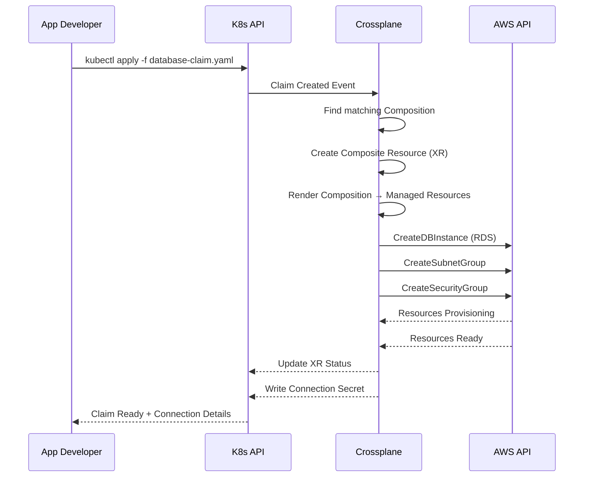
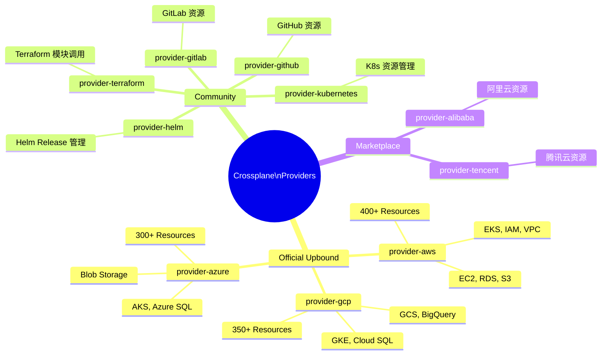
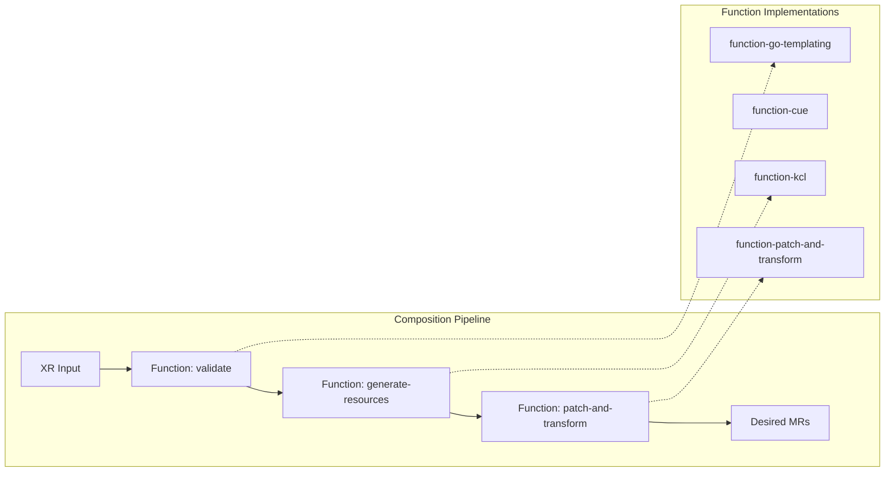
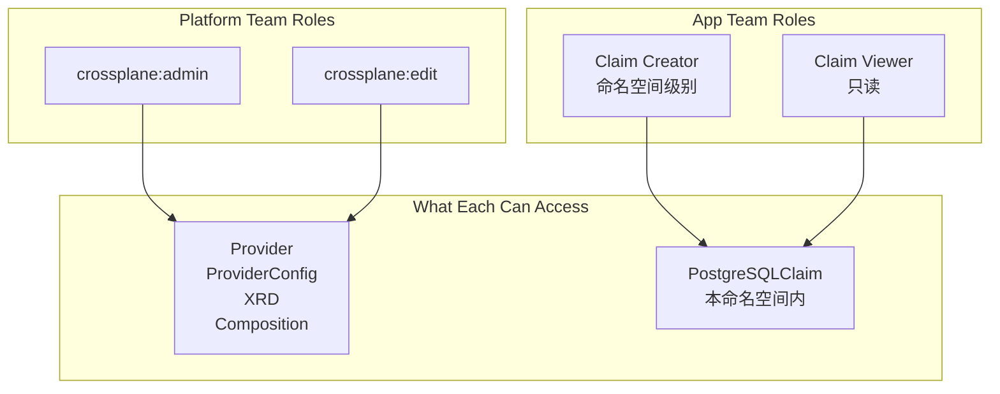
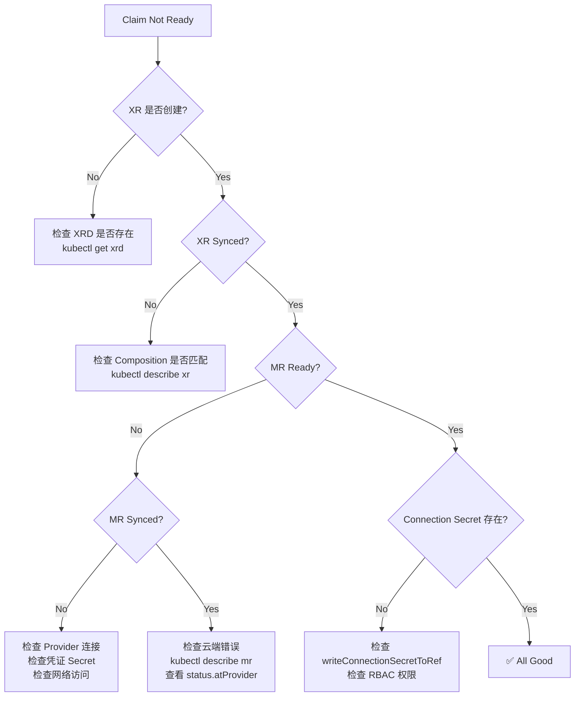
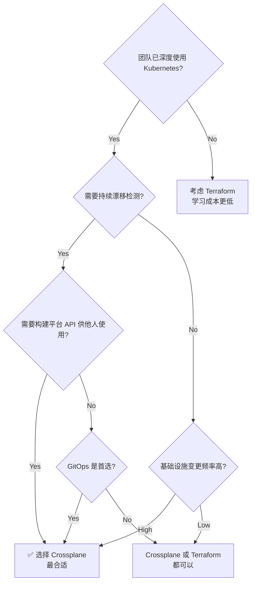
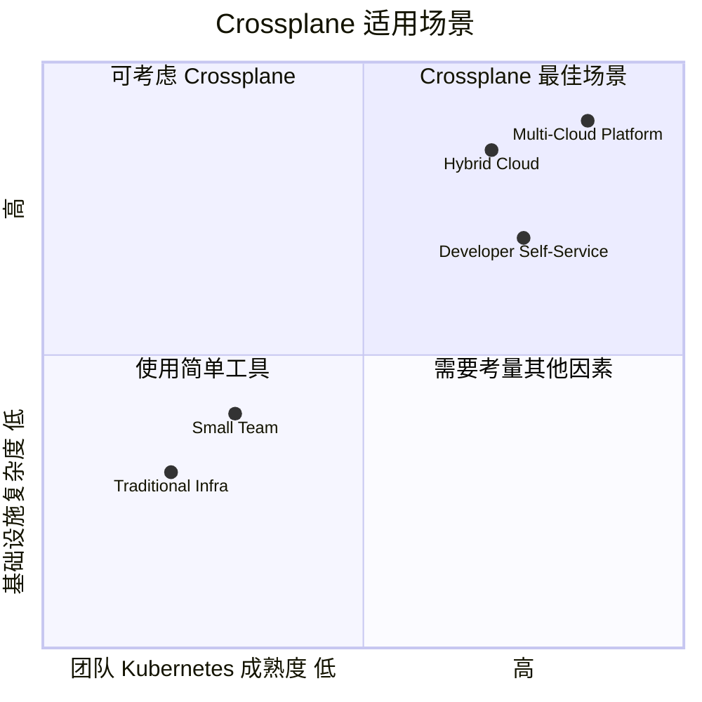

title: [[Crossplane|Crossplane]] 平台组合 (Crossplane Platform Composition)
description: '<!-- chunk: 概述 (Overview)' -->## 概述 (Overview)'
category: platform-engineering
tags:
- k8s
- platform-engineering
- developer-experience
- idp
- [[etcd|etcd]]
- [[Prometheus|prometheus]]
- [[Helm|helm]]
- argocd
- flux
- postgresql
last_updated: 2026-05
difficulty: advanced
reading_level: advanced
audience:
- 平台工程师
- SRE
- 架构师
estimated_read_time: 5min
intent_queries:
- Crossplane 平台组合 (Crossplane Platform Composition) 是什么
- 如何 Crossplane 平台组合 (Crossplane Platform Composition)
- Kubernetes 36 platform engineering 最佳实践
trigger_keywords:
- Crossplane
- 平台组合
- Crossplane
- Platform
- Composition
- platform
- engineering
authors:
- name: KUDIG Team
  role: contributor
k8s_versions:
- '1.28'
- '1.29'
- '1.30'
- '1.31'
- '1.32'
---

# Crossplane 平台组合 (Crossplane Platform Composition)

<!-- chunk: 概述 (Overview) -->## 概述 (Overview)

Crossplane 是一个开源的 Kubernetes 扩展框架，由 Upbound 维护，现已加入 CNCF。它通过将云基础设施（AWS、GCP、Azure、Alibaba Cloud 等）的管理能力引入 Kubernetes 控制平面，实现了**基础设施即代码**的声明式管理，并允许平台团队构建自定义的**平台 API（Platform APIs）**，向应用团队隐藏底层复杂性。

**Core Philosophy**: *Use Kubernetes as the universal control plane for all infrastructure.*

---

<!-- chunk: 目录 (Table of Contents) -->## 目录 (Table of Contents)

1. [Crossplane 核心架构](#crossplane-核心架构)
2. [Provider 生态系统](#provider-生态系统)
3. [Managed Resources 详解](#managed-resources-详解)
4. [Composite Resources（XR）](#composite-resources-xr)
5. [XRD — 复合资源定义](#xrd--复合资源定义)
6. [Composition 组合机制](#composition-组合机制)
7. [Composition Functions](#composition-functions)
8. [多云基础设施抽象](#多云基础设施抽象)
9. [Platform API 设计模式](#platform-api-设计模式)
10. [RBAC 与访问控制](#rbac-与访问控制)
11. [可观测性与调试](#可观测性与调试)
12. [生产最佳实践](#生产最佳实践)
13. [Crossplane vs Terraform](#crossplane-vs-terraform)

---

<!-- chunk: Crossplane 核心架构 -->## Crossplane 核心架构

## 整体架构图

```mermaid
graph TB
    subgraph "Kubernetes Control Plane"
        direction TB
        API[K8s API Server]
        
        subgraph "Crossplane Core"
            XC[Crossplane\nController Manager]
            PKGM[Package Manager]
        end
        
        subgraph "Provider Controllers"
            PAA[provider-aws\nController]
            PGC[provider-gcp\nController]
            PAZ[provider-azure\nController]
        end
        
        subgraph "Composite Controllers"
            CC[Composition\nController]
            CLMC[Claim\nController]
        end
        
        API --> XC
        XC --> PKGM
        PKGM --> PAA
        PKGM --> PGC
        PKGM --> PAZ
        API --> CC
        API --> CLMC
    end
    
    subgraph "AWS Cloud"
        RDS[RDS Instance]
        S3[S3 Bucket]
        EC2[EC2 Instance]
        EKS[EKS Cluster]
    end
    
    subgraph "GCP Cloud"
        SQL[Cloud SQL]
        GCS[GCS Bucket]
        GKE[GKE Cluster]
    end
    
    subgraph "Azure Cloud"
        ASQL[Azure SQL]
        ABLOB[Blob Storage]
        AKS[AKS Cluster]
    end
    
    PAA -->|Reconcile| RDS
    PAA -->|Reconcile| S3
    PAA -->|Reconcile| EKS
    PGC -->|Reconcile| SQL
    PGC -->|Reconcile| GCS
    PAZ -->|Reconcile| ASQL
    PAZ -->|Reconcile| ABLOB
    
    style "Kubernetes Control Plane" fill:#e8f4fd,stroke:#1565c0
    style "AWS Cloud" fill:#fff3e0,stroke:#e65100
    style "GCP Cloud" fill:#e8f5e9,stroke:#2e7d32
    style "Azure Cloud" fill:#f3e5f5,stroke:#7b1fa2
```

## 核心概念层次

```mermaid
graph TD
    subgraph "Platform Team（平台团队）"
        XRD[XRD\nComposite Resource Definition]
        COMP[Composition\n组合逻辑]
        PROV[Provider\n云提供商]
        XRD --> COMP
        COMP --> PROV
    end
    
    subgraph "Application Team（应用团队）"
        CLAIM[Claim\n资源声明]
    end
    
    subgraph "Crossplane Engine（引擎层）"
        XR[Composite Resource\n复合资源 - XR]
    end
    
    subgraph "Cloud（云层）"
        MR[Managed Resources\n托管资源]
    end
    
    CLAIM -->|创建| XR
    XRD -->|定义 Schema| XR
    COMP -->|驱动创建| MR
    PROV -->|reconcile| MR
    
    style "Platform Team（平台团队）" fill:#e3f2fd
    style "Application Team（应用团队）" fill:#e8f5e9
    style "Crossplane Engine（引擎层）" fill:#fff8e1
    style "Cloud（云层）" fill:#fce4ec
```

## 数据流



---

<!-- chunk: Provider 生态系统 -->## Provider 生态系统

## 主流 Provider 列表



## 安装 Provider

```yaml
# 安装 AWS Provider
apiVersion: pkg.crossplane.io/v1
kind: Provider
metadata:
  name: provider-aws-rds
spec:
  package: xpkg.upbound.io/upbound/provider-aws-rds:v0.46.0
  runtimeConfigRef:
    name: provider-aws-rds
  packagePullPolicy: IfNotPresent
  revisionActivationPolicy: Automatic

---
# Provider 运行时配置
apiVersion: pkg.crossplane.io/v1beta1
kind: DeploymentRuntimeConfig
metadata:
  name: provider-aws-rds
spec:
  deploymentTemplate:
    spec:
      selector: {}
      template:
        spec:
          containers:
            - name: package-runtime
              resources:
                requests:
                  cpu: 100m
                  memory: 256Mi
                limits:
                  cpu: 500m
                  memory: 512Mi
```

## ProviderConfig（凭证配置）

```yaml
# AWS 凭证配置
apiVersion: aws.upbound.io/v1beta1
kind: ProviderConfig
metadata:
  name: aws-prod
spec:
  credentials:
    source: Secret
    secretRef:
      namespace: crossplane-system
      name: aws-credentials
      key: credentials
  # 也可以使用 IRSA（IAM Roles for Service Accounts）
  # credentials:
  #   source: IRSA

---
# IRSA 方式（推荐生产使用）
apiVersion: aws.upbound.io/v1beta1
kind: ProviderConfig
metadata:
  name: aws-irsa
spec:
  credentials:
    source: IRSA
  assumeRoleChain:
    - roleARN: "arn:aws:iam::123456789012:role/CrossplaneRole"
```

```yaml
# GCP 凭证配置
apiVersion: gcp.upbound.io/v1beta1
kind: ProviderConfig
metadata:
  name: gcp-prod
spec:
  projectID: my-gcp-project-id
  credentials:
    source: Secret
    secretRef:
      namespace: crossplane-system
      name: gcp-credentials
      key: credentials.json

---
# Workload Identity（推荐生产使用）
apiVersion: gcp.upbound.io/v1beta1
kind: ProviderConfig
metadata:
  name: gcp-workload-identity
spec:
  projectID: my-gcp-project-id
  credentials:
    source: InjectedIdentity
```

---

<!-- chunk: Managed Resources 详解 -->## Managed Resources 详解

## 直接使用 Managed Resource

```yaml
# 直接创建 RDS PostgreSQL 实例（低级 API）
apiVersion: rds.aws.upbound.io/v1beta1
kind: Instance
metadata:
  name: prod-postgresql
  annotations:
    crossplane.io/external-name: "prod-postgresql-001"
spec:
  forProvider:
    region: us-east-1
    dbInstanceClass: db.t3.medium
    engine: postgres
    engineVersion: "15.3"
    username: admin
    allocatedStorage: 100
    storageType: gp3
    storageEncrypted: true
    multiAZ: true
    publiclyAccessible: false
    skipFinalSnapshot: false
    finalSnapshotIdentifier: "prod-postgresql-001-final"
    dbSubnetGroupName: "prod-subnet-group"
    vpcSecurityGroupIds:
      - "sg-xxxxxxxxxx"
    tags:
      Environment: production
      Team: platform
      ManagedBy: crossplane
  writeConnectionSecretToRef:
    namespace: crossplane-system
    name: prod-postgresql-conn
  providerConfigRef:
    name: aws-irsa
```

## Managed Resource 生命周期注解

```yaml
metadata:
  annotations:
    # 控制删除行为
    crossplane.io/paused: "false"           # 暂停 reconcile
    
spec:
  managementPolicies:
    - Observe   # 只观察，不修改
    - Create    # 允许创建
    - Update    # 允许更新
    - Delete    # 允许删除
  
  # 导入已有资源（不重新创建）
  forProvider: {}
  externalName: "existing-rds-instance-name"
  
  # 删除策略
  deletionPolicy: Delete  # 或 Orphan（孤立，不删除云资源）
```

## Managed Resource 状态检查

```bash
# 检查资源状态
kubectl get instances.rds.aws.upbound.io -A
kubectl describe instance prod-postgresql

# 关注 Status.Conditions
# - Synced: True  -> Crossplane 与云端同步正常
# - Ready: True   -> 资源在云端已就绪
```

```yaml
# 典型 Status 结构
status:
  atProvider:
    # 云端返回的属性（只读）
    arn: "arn:aws:rds:us-east-1:123456789012:db:prod-postgresql-001"
    endpoint: "prod-postgresql-001.cxxx.us-east-1.rds.amazonaws.com"
    port: 5432
    availabilityZone: "us-east-1a"
    status: "available"
    engineVersionActual: "15.3"
  conditions:
    - type: Synced
      status: "True"
      reason: ReconcileSuccess
      lastTransitionTime: "2024-01-15T10:30:00Z"
    - type: Ready
      status: "True"
      reason: Available
      lastTransitionTime: "2024-01-15T10:35:00Z"
```

---

<!-- chunk: Composite Resources (XR) -->## Composite Resources (XR)

## XR vs Claim 的关系

```mermaid
graph LR
    subgraph "Namespace: team-payments"
        CLAIM[PostgreSQLClaim\nname: payments-db\n类型: 命名空间级别]
    end
    
    subgraph "Cluster-wide"
        XR[XPostgreSQL\nname: payments-db-xxxxx\n类型: 集群级别]
    end
    
    subgraph "AWS"
        RDS[RDS Instance]
        SG[Security Group]
        SNG[Subnet Group]
    end
    
    CLAIM -->|triggers creation| XR
    XR -->|creates| RDS
    XR -->|creates| SG
    XR -->|creates| SNG
    
    CLAIM -.->|references| XR
    
    style "Namespace: team-payments" fill:#e8f5e9
    style "Cluster-wide" fill:#e3f2fd
    style "AWS" fill:#fff3e0
```

## Claim 提交示例（应用团队视角）

```yaml
# 应用团队提交的 PostgreSQL Claim（高级抽象 API）
apiVersion: database.internal.company.io/v1alpha1
kind: PostgreSQLClaim
metadata:
  name: payments-db
  namespace: team-payments
  labels:
    app: payment-service
    cost-center: "cc-12345"
    env: production
spec:
  compositeDeletePolicy: Foreground
  compositionSelector:
    matchLabels:
      provider: aws
      region: us-east-1
  parameters:
    version: "15"
    tier: premium
    storage: 200
    multiAZ: true
    backup:
      enabled: true
      retentionDays: 30
    maintenance:
      window: "sun:03:00-sun:04:00"
  writeConnectionSecretToRef:
    name: payments-db-connection
```

---

<!-- chunk: XRD — 复合资源定义 -->## XRD — 复合资源定义

## XRD 完整示例

```yaml
# Platform Team 定义的 XRD
apiVersion: apiextensions.crossplane.io/v1
kind: CompositeResourceDefinition
metadata:
  name: xpostgresqls.database.internal.company.io
  labels:
    platform.company.io/category: database
    platform.company.io/tier: approved
  annotations:
    platform.company.io/description: "Managed PostgreSQL database with automated backup and HA"
    platform.company.io/owner: "platform-team@company.com"
    platform.company.io/docs: "https://platform.internal/docs/postgresql"
spec:
  # Claim 的 GVK（命名空间级别 API）
  claimNames:
    kind: PostgreSQLClaim
    plural: postgresqlclaims
  
  # Composite Resource 的 GVK（集群级别）
  group: database.internal.company.io
  names:
    kind: XPostgreSQL
    plural: xpostgresqls
  
  # 连接信息 Keys（写入 Secret 的键名）
  connectionSecretKeys:
    - host
    - port
    - username
    - password
    - database
    - endpoint
    - port
  
  # 默认 Composition 选择
  defaultCompositionRef:
    name: postgresql-aws-standard
  
  versions:
    - name: v1alpha1
      served: true
      referenceable: true
      schema:
        openAPIV3Schema:
          type: object
          properties:
            spec:
              type: object
              properties:
                parameters:
                  type: object
                  description: "PostgreSQL instance parameters"
                  required:
                    - version
                    - tier
                  properties:
                    version:
                      type: string
                      description: "PostgreSQL major version"
                      enum: ["13", "14", "15", "16"]
                      default: "15"
                    
                    tier:
                      type: string
                      description: "Performance tier"
                      enum: [standard, premium, enterprise]
                      default: standard
                    
                    storage:
                      type: integer
                      description: "Storage size in GiB"
                      minimum: 20
                      maximum: 10000
                      default: 100
                    
                    multiAZ:
                      type: boolean
                      description: "Enable Multi-AZ deployment"
                      default: false
                    
                    backup:
                      type: object
                      properties:
                        enabled:
                          type: boolean
                          default: true
                        retentionDays:
                          type: integer
                          minimum: 1
                          maximum: 35
                          default: 7
                    
                    maintenance:
                      type: object
                      properties:
                        window:
                          type: string
                          description: "Maintenance window (ddd:hh24:mi-ddd:hh24:mi)"
                          default: "sun:03:00-sun:04:00"
                    
                    network:
                      type: object
                      properties:
                        privateSubnetIds:
                          type: array
                          items:
                            type: string
                        vpcId:
                          type: string
                    
                    # 平台团队内部字段（用户不填）
                    providerConfigName:
                      type: string
                      default: aws-irsa
              
              # required 必填字段
              required:
                - parameters
            
            # Status 扩展字段
            status:
              type: object
              properties:
                dbInstanceStatus:
                  type: string
                endpoint:
                  type: string
                port:
                  type: integer
                certificateArn:
                  type: string
```

---

<!-- chunk: Composition 组合机制 -->## Composition 组合机制

## Composition 完整示例

```yaml
# Platform Team 编写的 AWS PostgreSQL Composition
apiVersion: apiextensions.crossplane.io/v1
kind: Composition
metadata:
  name: postgresql-aws-premium
  labels:
    provider: aws
    region: us-east-1
    tier: premium
    platform.company.io/version: "v2.1.0"
  annotations:
    platform.company.io/changelog: "Added encryption at rest, upgraded to gp3 storage"
spec:
  # 关联 XRD
  compositeTypeRef:
    apiVersion: database.internal.company.io/v1alpha1
    kind: XPostgreSQL
  
  # Publish Connection Details
  publishConnectionDetailsWithStoreConfigRef:
    name: vault  # 可选：推送到 Vault

  # 组合的资源列表
  resources:
    # Resource 1: DB Subnet Group
    - name: db-subnet-group
      base:
        apiVersion: rds.aws.upbound.io/v1beta1
        kind: SubnetGroup
        spec:
          forProvider:
            region: us-east-1
            description: "Managed by Crossplane"
            subnetIds:
              - "subnet-xxxxxxx1"
              - "subnet-xxxxxxx2"
              - "subnet-xxxxxxx3"
          providerConfigRef:
            name: aws-irsa
      patches:
        - type: FromCompositeFieldPath
          fromFieldPath: "spec.parameters.network.privateSubnetIds"
          toFieldPath: "spec.forProvider.subnetIds"
          transforms:
            - type: map
              map:
                default: ["subnet-default1", "subnet-default2"]

    # Resource 2: Security Group
    - name: security-group
      base:
        apiVersion: ec2.aws.upbound.io/v1beta1
        kind: SecurityGroup
        spec:
          forProvider:
            region: us-east-1
            description: "PostgreSQL Security Group - Managed by Crossplane"
            name: "crossplane-pg-sg"
          providerConfigRef:
            name: aws-irsa
      patches:
        - type: FromCompositeFieldPath
          fromFieldPath: "spec.parameters.network.vpcId"
          toFieldPath: "spec.forProvider.vpcId"
        - type: FromCompositeFieldPath
          fromFieldPath: "metadata.name"
          toFieldPath: "spec.forProvider.name"
          transforms:
            - type: string
              string:
                fmt: "crossplane-pg-%s"

    # Resource 3: RDS Instance
    - name: rds-instance
      base:
        apiVersion: rds.aws.upbound.io/v1beta1
        kind: Instance
        spec:
          forProvider:
            region: us-east-1
            engine: postgres
            username: pgadmin
            storageEncrypted: true
            storageType: gp3
            publiclyAccessible: false
            skipFinalSnapshot: false
            iops: 3000
            tags:
              ManagedBy: crossplane
              Platform: "true"
          writeConnectionSecretToRef:
            namespace: crossplane-system
          providerConfigRef:
            name: aws-irsa
      
      # Patches: 从 XR 字段映射到 Managed Resource 字段
      patches:
        # 版本映射
        - type: FromCompositeFieldPath
          fromFieldPath: "spec.parameters.version"
          toFieldPath: "spec.forProvider.engineVersion"
        
        # 存储大小
        - type: FromCompositeFieldPath
          fromFieldPath: "spec.parameters.storage"
          toFieldPath: "spec.forProvider.allocatedStorage"
        
        # 多可用区
        - type: FromCompositeFieldPath
          fromFieldPath: "spec.parameters.multiAZ"
          toFieldPath: "spec.forProvider.multiAZ"
        
        # Tier → DB Instance Class 映射
        - type: FromCompositeFieldPath
          fromFieldPath: "spec.parameters.tier"
          toFieldPath: "spec.forProvider.dbInstanceClass"
          transforms:
            - type: map
              map:
                standard: db.t3.medium
                premium: db.r6g.xlarge
                enterprise: db.r6g.4xlarge
        
        # 备份保留天数
        - type: FromCompositeFieldPath
          fromFieldPath: "spec.parameters.backup.retentionDays"
          toFieldPath: "spec.forProvider.backupRetentionPeriod"
        
        # 维护窗口
        - type: FromCompositeFieldPath
          fromFieldPath: "spec.parameters.maintenance.window"
          toFieldPath: "spec.forProvider.maintenanceWindow"
        
        # 连接 Secret 名称动态生成
        - type: FromCompositeFieldPath
          fromFieldPath: "metadata.uid"
          toFieldPath: "spec.writeConnectionSecretToRef.name"
          transforms:
            - type: string
              string:
                fmt: "xpostgresql-%s-conn"
        
        # 条件补丁：备份窗口（仅当启用备份时）
        - type: FromCompositeFieldPath
          fromFieldPath: "spec.parameters.backup.enabled"
          toFieldPath: "spec.forProvider.backupRetentionPeriod"
          transforms:
            - type: convert
              convert:
                toType: int
                format: none
              # 如果 backup.enabled = false → 0 (禁用备份)
        
        # Status 回写：从 MR 写回 XR
        - type: ToCompositeFieldPath
          fromFieldPath: "status.atProvider.endpoint"
          toFieldPath: "status.endpoint"
        - type: ToCompositeFieldPath
          fromFieldPath: "status.atProvider.port"
          toFieldPath: "status.port"
        - type: ToCompositeFieldPath
          fromFieldPath: "status.atProvider.dbInstanceStatus"
          toFieldPath: "status.dbInstanceStatus"
      
      # 连接信息详情
      connectionDetails:
        - type: FromConnectionSecretKey
          name: host
          fromConnectionSecretKey: attribute.endpoint
        - type: FromValue
          name: port
          value: "5432"
        - type: FromConnectionSecretKey
          name: username
          fromConnectionSecretKey: attribute.username
        - type: FromConnectionSecretKey
          name: password
          fromConnectionSecretKey: attribute.password

    # Resource 4: Parameter Group
    - name: parameter-group
      base:
        apiVersion: rds.aws.upbound.io/v1beta1
        kind: ParameterGroup
        spec:
          forProvider:
            region: us-east-1
            family: postgres15
            description: "Custom PostgreSQL 15 parameters - Managed by Crossplane"
            parameter:
              - name: log_connections
                value: "1"
                applyMethod: immediate
              - name: log_disconnections
                value: "1"
                applyMethod: immediate
              - name: log_duration
                value: "1"
                applyMethod: immediate
              - name: shared_preload_libraries
                value: "pg_stat_statements,auto_explain"
                applyMethod: pending-reboot
              - name: auto_explain.log_min_duration
                value: "1000"
                applyMethod: immediate
          providerConfigRef:
            name: aws-irsa
      patches:
        - type: FromCompositeFieldPath
          fromFieldPath: "spec.parameters.version"
          toFieldPath: "spec.forProvider.family"
          transforms:
            - type: string
              string:
                fmt: "postgres%s"
```

## Patch 类型速查表

| Patch 类型 | 方向 | 用途 |
|-----------|------|------|
| `FromCompositeFieldPath` | XR → MR | 从复合资源字段映射到托管资源 |
| `ToCompositeFieldPath` | MR → XR | 从托管资源回写到复合资源状态 |
| `FromEnvironmentFieldPath` | Env → MR | 从环境配置映射（EnvironmentConfig） |
| `ToEnvironmentFieldPath` | MR → Env | 写回到环境配置 |
| `CombineFromComposite` | 多个XR字段 → MR | 合并多个字段为单个值 |
| `PatchSet` | 引用 PatchSet | 复用 Patch 集合 |

## Transform 类型速查表

```yaml
transforms:
  # 字符串格式化
  - type: string
    string:
      fmt: "my-prefix-%s-suffix"

  # 值映射
  - type: map
    map:
      small: db.t3.micro
      medium: db.t3.medium
      large: db.r6g.xlarge

  # 类型转换
  - type: convert
    convert:
      toType: int64  # string, int64, bool, float64

  # 数学运算
  - type: math
    math:
      type: Multiply
      multiply: 1024  # 乘法

  # 匹配（正则）
  - type: match
    match:
      patterns:
        - type: regexp
          regexp: "^prod.*"
          result: "production"
        - type: literal
          literal: "dev"
          result: "development"
      fallbackValue: "unknown"
```

---

<!-- chunk: Composition Functions -->## Composition Functions

## Composition Functions 介绍

Composition Functions 是 Crossplane v1.14+ 引入的功能，允许用 **任意编程语言**（Go、Python、CUE 等）编写复杂的组合逻辑，克服了纯 YAML Patches 的局限性。



## 使用 Function 的 Composition

```yaml
apiVersion: apiextensions.crossplane.io/v1
kind: Composition
metadata:
  name: postgresql-aws-with-functions
spec:
  compositeTypeRef:
    apiVersion: database.internal.company.io/v1alpha1
    kind: XPostgreSQL
  
  mode: Pipeline  # 启用 Function Pipeline 模式
  
  pipeline:
    # Step 1: 验证输入
    - step: validate
      functionRef:
        name: function-go-templating
      input:
        apiVersion: gotemplating.fn.crossplane.io/v1beta1
        kind: GoTemplate
        source: Inline
        inline:
          template: |
            {{ $xr := .observed.composite.resource }}
            {{ $tier := $xr.spec.parameters.tier }}
            {{ if and (eq $tier "enterprise") (not $xr.spec.parameters.multiAZ) }}
            {{ fail "Enterprise tier requires multiAZ=true" }}
            {{ end }}

    # Step 2: 使用 KCL 生成资源
    - step: generate
      functionRef:
        name: function-kcl
      input:
        apiVersion: krm.kcl.dev/v1alpha1
        kind: KCLInput
        spec:
          source: |
            import regex

            # 读取 XR 参数
            xr = option("params").oxr
            params = xr.spec.parameters
            
            # 根据 tier 选择实例类型
            instanceClassMap = {
              standard = "db.t3.medium"
              premium = "db.r6g.xlarge"
              enterprise = "db.r6g.4xlarge"
            }
            
            # 生成 RDS 实例
            rdsInstance = {
              apiVersion = "rds.aws.upbound.io/v1beta1"
              kind = "Instance"
              metadata.name = xr.metadata.name + "-instance"
              spec.forProvider = {
                region = "us-east-1"
                engine = "postgres"
                engineVersion = params.version
                dbInstanceClass = instanceClassMap[params.tier]
                allocatedStorage = params.storage
                multiAZ = params.multiAZ
                storageEncrypted = True
                storageType = "gp3"
              }
            }
            
            items = [rdsInstance]

    # Step 3: 标准 Patch and Transform
    - step: patch-and-transform
      functionRef:
        name: function-patch-and-transform
      input:
        apiVersion: pt.fn.crossplane.io/v1beta1
        kind: Resources
        resources:
          - name: parameter-group
            base:
              apiVersion: rds.aws.upbound.io/v1beta1
              kind: ParameterGroup
              spec:
                forProvider:
                  region: us-east-1
                  family: postgres15
```

## 自定义 Function（Go 实现）

```go
// function.go - 自定义 Crossplane Function
package main

import (
    "context"
    
    fnv1beta1 "github.com/crossplane/function-sdk-go/proto/v1beta1"
    "github.com/crossplane/function-sdk-go/resource"
    "github.com/crossplane/function-sdk-go/response"
)

type Function struct {
    fnv1beta1.UnimplementedFunctionRunnerServiceServer
}

func (f *Function) RunFunction(ctx context.Context, req *fnv1beta1.RunFunctionRequest) (*fnv1beta1.RunFunctionResponse, error) {
    rsp := response.To(req, response.DefaultTTL)
    
    // 读取 XR
    xr, err := request.GetObservedCompositeResource(req)
    if err != nil {
        response.Fatal(rsp, err)
        return rsp, nil
    }
    
    // 提取参数
    tier, err := xr.Resource.GetString("spec.parameters.tier")
    if err != nil {
        response.Fatal(rsp, err)
        return rsp, nil
    }
    
    // 根据业务逻辑生成资源
    instanceClass := map[string]string{
        "standard":   "db.t3.medium",
        "premium":    "db.r6g.xlarge",
        "enterprise": "db.r6g.4xlarge",
    }[tier]
    
    // 构建 Desired 资源
    desired := map[string]*resource.DesiredComposed{}
    
    rdsInstance := resource.NewDesiredComposed()
    rdsInstance.Resource.SetAPIVersion("rds.aws.upbound.io/v1beta1")
    rdsInstance.Resource.SetKind("Instance")
    _ = rdsInstance.Resource.SetString("spec.forProvider.dbInstanceClass", instanceClass)
    
    desired["rds-instance"] = rdsInstance
    
    if err := response.SetDesiredComposedResources(rsp, desired); err != nil {
        response.Fatal(rsp, err)
        return rsp, nil
    }
    
    return rsp, nil
}
```

---

<!-- chunk: 多云基础设施抽象 -->## 多云基础设施抽象

## 多云数据库抽象层

```mermaid
graph TD
    subgraph "Developer API（统一抽象）"
        CLAIM[PostgreSQLClaim\n统一 Schema]
    end
    
    subgraph "Compositions（多云实现）"
        C_AWS[Composition: AWS RDS\nlabel: provider=aws]
        C_GCP[Composition: GCP CloudSQL\nlabel: provider=gcp]
        C_AZ[Composition: Azure Database\nlabel: provider=azure]
        C_ON[Composition: On-Prem\nlabel: provider=on-prem]
    end
    
    subgraph "Cloud Resources"
        AWS_RDS[AWS RDS\nPostgreSQL]
        GCP_SQL[GCP Cloud SQL\nPostgreSQL]
        AZ_DB[Azure Database\nfor PostgreSQL]
        ON_DB[On-Prem\nCnPG Operator]
    end
    
    CLAIM -->|compositionSelector:\nprovider: aws| C_AWS
    CLAIM -->|compositionSelector:\nprovider: gcp| C_GCP
    CLAIM -->|compositionSelector:\nprovider: azure| C_AZ
    CLAIM -->|compositionSelector:\nprovider: on-prem| C_ON
    
    C_AWS --> AWS_RDS
    C_GCP --> GCP_SQL
    C_AZ --> AZ_DB
    C_ON --> ON_DB
    
    style "Developer API（统一抽象）" fill:#e8f5e9
    style "Compositions（多云实现）" fill:#e3f2fd
    style "Cloud Resources" fill:#fff3e0
```

## GCP Cloud SQL Composition

```yaml
apiVersion: apiextensions.crossplane.io/v1
kind: Composition
metadata:
  name: postgresql-gcp-standard
  labels:
    provider: gcp
    region: us-central1
    tier: standard
spec:
  compositeTypeRef:
    apiVersion: database.internal.company.io/v1alpha1
    kind: XPostgreSQL
  
  resources:
    - name: cloudsql-instance
      base:
        apiVersion: sql.gcp.upbound.io/v1beta1
        kind: DatabaseInstance
        spec:
          forProvider:
            region: us-central1
            databaseVersion: POSTGRES_15
            settings:
              - tier: db-custom-2-7680
                diskType: PD_SSD
                backupConfiguration:
                  - enabled: true
                    pointInTimeRecoveryEnabled: true
                maintenanceWindow:
                  - day: 7
                    hour: 3
                ipConfiguration:
                  - ipv4Enabled: false
                    privateNetworkRef:
                      name: default-vpc
          providerConfigRef:
            name: gcp-workload-identity
      
      patches:
        - type: FromCompositeFieldPath
          fromFieldPath: "spec.parameters.version"
          toFieldPath: "spec.forProvider.databaseVersion"
          transforms:
            - type: string
              string:
                fmt: "POSTGRES_%s"
        
        - type: FromCompositeFieldPath
          fromFieldPath: "spec.parameters.tier"
          toFieldPath: "spec.forProvider.settings[0].tier"
          transforms:
            - type: map
              map:
                standard: db-custom-2-7680
                premium: db-custom-4-15360
                enterprise: db-custom-8-30720
        
        - type: FromCompositeFieldPath
          fromFieldPath: "spec.parameters.storage"
          toFieldPath: "spec.forProvider.settings[0].diskSize"
```

## 多云成本优化策略

```yaml
# Environment-based Composition 选择
# Claim 中指定 compositionSelector

---
# 生产环境：AWS us-east-1
apiVersion: database.internal.company.io/v1alpha1
kind: PostgreSQLClaim
metadata:
  name: prod-db
  namespace: team-payments
spec:
  compositionSelector:
    matchLabels:
      provider: aws
      region: us-east-1
      tier: premium
  parameters:
    tier: premium
    multiAZ: true

---
# 开发环境：GCP（更便宜）
apiVersion: database.internal.company.io/v1alpha1
kind: PostgreSQLClaim
metadata:
  name: dev-db
  namespace: team-payments-dev
spec:
  compositionSelector:
    matchLabels:
      provider: gcp
      tier: standard
  parameters:
    tier: standard
    multiAZ: false
```

---

<!-- chunk: Platform API 设计模式 -->## Platform API 设计模式

## 平台 API 分层模型

```mermaid
graph TB
    subgraph "Level 3: Business Domain API（业务域 API）"
        BDA[EcommerceDatabase\nPaymentService\nInventoryService]
    end
    
    subgraph "Level 2: Platform API（平台 API）"
        PA[XPostgreSQL\nXKafka\nXMicroservice]
    end
    
    subgraph "Level 1: Provider API（Provider API）"
        PRA[AWS RDS\nGCP CloudSQL\nAzure Database]
    end
    
    BDA -->|References / Composes| PA
    PA -->|Composes| PRA
    
    style "Level 3: Business Domain API（业务域 API）" fill:#c8e6c9
    style "Level 2: Platform API（平台 API）" fill:#bbdefb
    style "Level 1: Provider API（Provider API）" fill:#ffe0b2
```

## 环境感知 API 设计

```yaml
# 环境抽象 XRD
apiVersion: apiextensions.crossplane.io/v1
kind: CompositeResourceDefinition
metadata:
  name: xenvironments.platform.internal.io
spec:
  group: platform.internal.io
  names:
    kind: XEnvironment
    plural: xenvironments
  claimNames:
    kind: Environment
    plural: environments
  
  versions:
    - name: v1alpha1
      served: true
      referenceable: true
      schema:
        openAPIV3Schema:
          type: object
          properties:
            spec:
              type: object
              properties:
                parameters:
                  type: object
                  properties:
                    type:
                      type: string
                      enum: [frontend, backend, data, ml]
                    team:
                      type: string
                    costCenter:
                      type: string
                    budget:
                      type: object
                      properties:
                        monthly:
                          type: number
                        currency:
                          type: string
                          default: USD
```

## XRD Schema 最佳实践

```yaml
# 好的 Schema 设计原则示例
spec:
  versions:
    - name: v1alpha1
      schema:
        openAPIV3Schema:
          properties:
            spec:
              properties:
                parameters:
                  properties:
                    # ✅ 使用枚举而非自由文本
                    tier:
                      type: string
                      enum: [standard, premium]  # 好：限制选项
                    
                    # ✅ 设置合理默认值
                    replicas:
                      type: integer
                      default: 2
                      minimum: 1
                      maximum: 10
                    
                    # ✅ 清晰的描述
                    version:
                      type: string
                      description: "PostgreSQL major version. Recommend 15 for new deployments."
                      enum: ["14", "15", "16"]
                      default: "15"
                    
                    # ❌ 避免：暴露底层实现细节
                    # dbInstanceClass:
                    #   type: string   # 这是 AWS 特定的，不应暴露给用户
                    
                    # ❌ 避免：无限制的自由字段
                    # extraConfig:
                    #   type: object
                    #   additionalProperties: true
```

---

<!-- chunk: RBAC 与访问控制 -->## RBAC 与访问控制

## Crossplane RBAC 模型



## RBAC 配置示例

```yaml
# 为应用团队配置 Claim 访问权限
apiVersion: rbac.authorization.k8s.io/v1
kind: Role
metadata:
  name: database-claim-creator
  namespace: team-payments
rules:
  # 允许创建/管理 PostgreSQL Claims
  - apiGroups:
      - database.internal.company.io
    resources:
      - postgresqlclaims
    verbs:
      - get
      - list
      - watch
      - create
      - update
      - patch
      - delete
  # 允许读取 Claim 状态和 Connection Secrets
  - apiGroups: [""]
    resources:
      - secrets
    verbs:
      - get
      - list
      - watch
    # 注意：只能读取特定格式名称的 Secret

---
apiVersion: rbac.authorization.k8s.io/v1
kind: RoleBinding
metadata:
  name: payments-team-db-access
  namespace: team-payments
subjects:
  - kind: Group
    name: "payments-team"
    apiGroup: rbac.authorization.k8s.io
roleRef:
  kind: Role
  name: database-claim-creator
  apiGroup: rbac.authorization.k8s.io
```

## Usage Policy（使用策略）

```yaml
# Crossplane Usage Resource - 防止级联删除
apiVersion: apiextensions.crossplane.io/v1alpha1
kind: Usage
metadata:
  name: database-used-by-app
  namespace: team-payments
spec:
  # 当 payment-app 还存在时，不允许删除 payments-db
  by:
    apiVersion: apps/v1
    kind: Deployment
    resourceRef:
      name: payment-app
  of:
    apiVersion: database.internal.company.io/v1alpha1
    kind: PostgreSQLClaim
    resourceRef:
      name: payments-db
```

---

<!-- chunk: 可观测性与调试 -->## 可观测性与调试

## 资源状态检查命令

```bash
# 查看所有 Claim 状态
kubectl get postgresqlclaims -A

# 查看 Composite Resource
kubectl get xpostgresqls

# 查看底层 Managed Resources
kubectl get instances.rds.aws.upbound.io

# 详细诊断
kubectl describe xpostgresql payments-db-xxxxx

# 事件查看
kubectl get events --field-selector involvedObject.kind=XPostgreSQL

# 跟踪资源树
crossplane beta trace postgresqlclaim payments-db -n team-payments
```

## 常见问题排查



## Prometheus 监控

```yaml
# Crossplane Metrics ServiceMonitor
apiVersion: monitoring.coreos.com/v1
kind: ServiceMonitor
metadata:
  name: crossplane-metrics
  namespace: crossplane-system
spec:
  selector:
    matchLabels:
      app: crossplane
  endpoints:
    - port: metrics
      interval: 30s

---
# 关键指标告警规则
apiVersion: monitoring.coreos.com/v1
kind: PrometheusRule
metadata:
  name: crossplane-alerts
  namespace: crossplane-system
spec:
  groups:
    - name: crossplane.rules
      rules:
        - alert: CrossplaneManagedResourceNotSynced
          expr: |
            crossplane_managed_resource_ready{ready="False"} > 0
          for: 10m
          labels:
            severity: warning
          annotations:
            summary: "Crossplane managed resource not synced"
            description: "Resource {{ $labels.name }} of kind {{ $labels.kind }} is not synced"
        
        - alert: CrossplaneCompositeResourceNotReady
          expr: |
            crossplane_composite_resource_ready{ready="False"} > 0
          for: 5m
          labels:
            severity: critical
          annotations:
            summary: "Crossplane composite resource not ready"
```

---

<!-- chunk: 生产最佳实践 -->## 生产最佳实践

## 凭证管理策略

```mermaid
graph LR
    subgraph "推荐方式 (Recommended)"
        R1[IRSA - AWS]
        R2[Workload Identity - GCP]
        R3[Pod Identity - Azure]
    end
    
    subgraph "可接受方式 (Acceptable)"
        A1[External Secrets Operator\n自动轮转]
    end
    
    subgraph "不推荐 (Avoid)"
        N1[Static Long-lived\nCredentials in Secrets]
        N2[Hard-coded\nCredentials]
    end
    
    style "推荐方式 (Recommended)" fill:#e8f5e9
    style "可接受方式 (Acceptable)" fill:#fff8e1
    style "不推荐 (Avoid)" fill:#ffebee
```

## Composition 版本升级策略

```yaml
# Composition 灰度升级
# 1. 创建新版本 Composition
apiVersion: apiextensions.crossplane.io/v1
kind: Composition
metadata:
  name: postgresql-aws-v2
  labels:
    provider: aws
    version: v2  # 新版本标签

---
# 2. 在 XRD 中配置默认 Composition
spec:
  defaultCompositionRef:
    name: postgresql-aws-v1  # 仍然指向 v1

---
# 3. 单个 Claim 手动迁移测试
apiVersion: database.internal.company.io/v1alpha1
kind: PostgreSQLClaim
metadata:
  name: test-db
spec:
  compositionRef:
    name: postgresql-aws-v2  # 明确指定新版本
  parameters:
    tier: standard
```

## 成本标签强制策略

```yaml
# Composition 中强制注入成本标签
resources:
  - name: rds-instance
    base:
      apiVersion: rds.aws.upbound.io/v1beta1
      kind: Instance
    patches:
      # 从 Claim 传递 cost-center 标签
      - type: FromCompositeFieldPath
        fromFieldPath: "metadata.labels['cost-center']"
        toFieldPath: "spec.forProvider.tags['CostCenter']"
        policy:
          fromFieldPath: Required  # 必须存在，否则报错
      
      - type: FromCompositeFieldPath
        fromFieldPath: "metadata.labels['team']"
        toFieldPath: "spec.forProvider.tags['Team']"
        policy:
          fromFieldPath: Required
      
      # 自动注入环境标签
      - type: CombineFromComposite
        combine:
          variables:
            - fromFieldPath: "metadata.labels['env']"
          strategy: string
          string:
            fmt: "%s"
        toFieldPath: "spec.forProvider.tags['Environment']"
```

## 资源配额与成本控制

```yaml
# 使用 ResourceQuota 限制 Claim 数量
apiVersion: v1
kind: ResourceQuota
metadata:
  name: database-quota
  namespace: team-payments
spec:
  hard:
    # 限制 PostgreSQL Claim 最多 5 个
    count/postgresqlclaims.database.internal.company.io: "5"
    # 限制 Kafka Claim 最多 2 个
    count/kafkaclaims.messaging.internal.company.io: "2"
```

---

<!-- chunk: Crossplane vs Terraform -->## Crossplane vs Terraform

## 详细对比

| 维度 | Crossplane | Terraform |
|------|-----------|-----------|
| **运行模式** | 持续 Reconcile Loop | 命令式执行 (plan/apply) |
| **状态管理** | Kubernetes etcd | terraform.tfstate 文件 |
| **漂移检测** | 自动（持续检测） | 手动（terraform plan） |
| **API 抽象** | XRD/Composition（原生K8s） | Module + Variable |
| **多云统一** | 通过 Provider 和 XRD | 通过 Module |
| **团队协作** | GitOps 原生 | 需要额外工具（Atlantis等） |
| **生态系统** | Kubernetes 工具链 | 庞大 Terraform 生态 |
| **学习成本** | Kubernetes 背景优先 | 通用 DevOps 背景 |
| **执行可见性** | kubectl/K8s Events | Terraform 输出日志 |
| **回滚能力** | Kubernetes Rollback | 手动 terraform apply 历史版本 |
| **计算资源** | 需要运行 Controller | 无常驻服务 |

## 何时选择 Crossplane



## 迁移路径：Terraform → Crossplane

```bash
# 1. 导入已有云资源到 Crossplane（不重建）
# 创建 Managed Resource 并设置 externalName 为已有资源 ID
apiVersion: rds.aws.upbound.io/v1beta1
kind: Instance
metadata:
  name: existing-prod-db
  annotations:
    crossplane.io/external-name: "existing-rds-instance-id"
spec:
  managementPolicies:
    - Observe  # 先只观察，不修改
  forProvider:
    region: us-east-1
    # ... 其他配置

# 2. 验证 Crossplane 能正确观察到资源
kubectl get instance existing-prod-db -o yaml | grep -A5 "atProvider"

# 3. 切换到完整管理
spec:
  managementPolicies:
    - Observe
    - Update
    - Delete
    # 注意：不加 Create，避免重复创建
```

---

<!-- chunk: 总结 (Summary) -->## 总结 (Summary)

## Crossplane 价值矩阵



## 核心要点回顾

1. **Provider 抽象**: 将云 API 转化为 Kubernetes CRD，统一管理界面
2. **XRD + Composition**: 平台团队定义高层 API，隐藏底层复杂性
3. **Claim 机制**: 应用团队通过命名空间级别 API 自助消费
4. **Composition Functions**: 突破 YAML 限制，支持任意编程逻辑
5. **持续 Reconcile**: 自动漂移检测，确保实际状态与期望状态一致
6. **GitOps 原生**: 与 Flux/ArgoCD 无缝集成

---

<!-- chunk: 参考资料 (References) -->## 参考资料 (References)

- [Crossplane Official Documentation](https://docs.crossplane.io)
- [Upbound Marketplace](https://marketplace.upbound.io)
- [CNCF Crossplane Project](https://www.cncf.io/projects/crossplane/)
- [Crossplane GitHub](https://github.com/crossplane/crossplane)
- [Composition Functions Guide](https://docs.crossplane.io/latest/concepts/composition-functions/)
- [provider-aws Documentation](https://marketplace.upbound.io/providers/upbound/provider-aws)
- [Platform Engineering with Crossplane](https://blog.crossplane.io/platform-engineering/)

---

<!-- chunk: Obsidian 相关文档 -->## Obsidian 相关文档

- domain-07-platform-engineering MOC
- [[domain-07-platform-engineering/README.md|Domain 07: 平台工程 (Platform Engineering)]]
- Domain-36 平台工程 — 开源项目索引
- 平台工程概述与成熟度模型
- 内部开发者平台设计原则
- Backstage 部署与配置
- Backstage 软件目录与 TechDocs
- Backstage 脚手架与模板系统
- Kratix 平台即代码 (Kratix Platform as Code)
- Golden Paths 黄金路径设计 (Golden Paths Design Patterns)
- 开发者体验度量 (Developer Experience Metrics)
- 平台团队拓扑与运营 (Platform Team Topology and Operations)

## See Also

- 05-backstage-scaffolder-templates
- 06-kratix-platform-as-code
- 08-golden-paths-design
- 09-developer-experience-metrics
