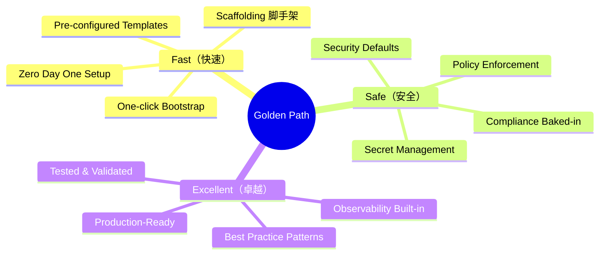
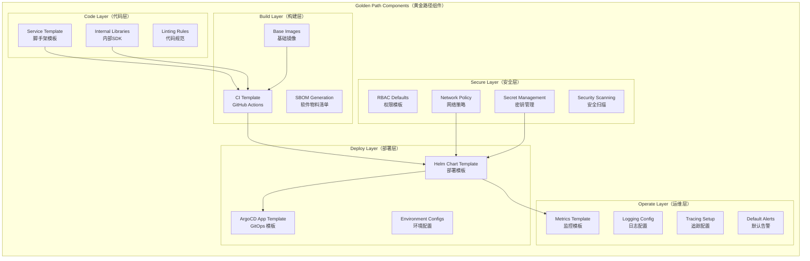
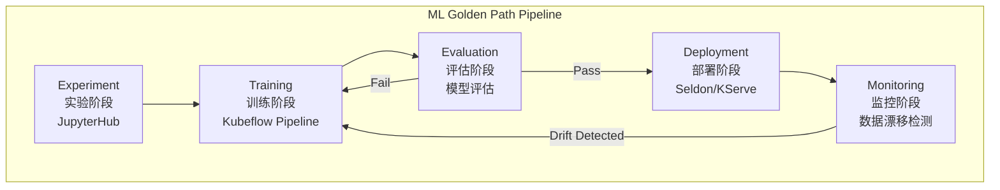
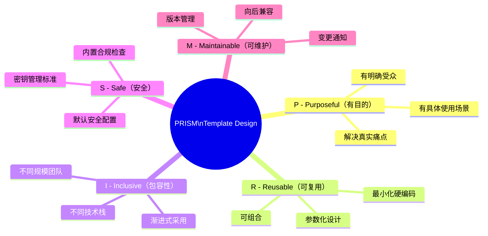
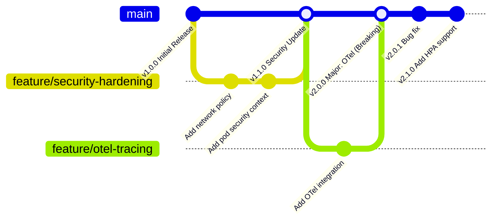
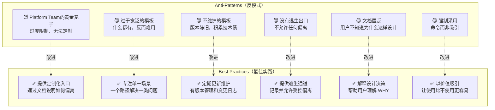
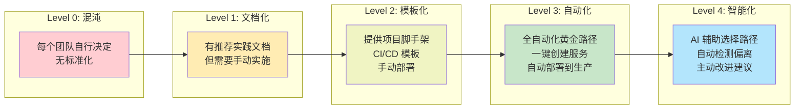
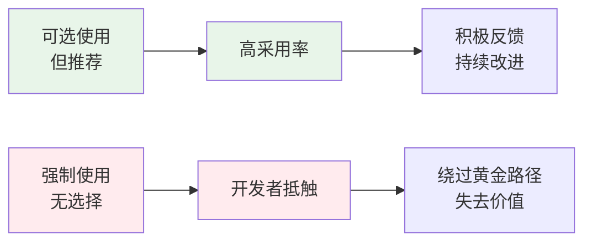

title: Golden Paths 黄金路径设计 (Golden Paths Design Patterns)
description: '# Golden Paths 黄金路径设计 (Golden Paths Design Patterns)'
category: platform-engineering
tags:
- k8s
- platform-engineering
- developer-experience
- idp
- [[Prometheus|prometheus]]
- grafana
- [[Jaeger|jaeger]]
- [[Helm|helm]]
- [[ArgoCD|argocd]]
- docker
last_updated: 2026-05
difficulty: advanced
reading_level: advanced
audience:
- 平台工程师
- SRE
- 架构师
estimated_read_time: 5min
intent_queries:
- Golden Paths 黄金路径设计 (Golden Paths Design Patterns) 是什么
- 如何 Golden Paths 黄金路径设计 (Golden Paths Design Patterns)
- Kubernetes 36 platform engineering 最佳实践
trigger_keywords:
- Golden
- Paths
- 黄金路径设计
- Golden
- Paths
- Design
- Patterns
- platform
authors:
- name: KUDIG Team
  role: contributor
k8s_versions:
- '1.28'
- '1.29'
- '1.30'
- '1.31'
- '1.32'
---

# Golden Paths 黄金路径设计 (Golden Paths Design Patterns)

<!-- chunk: 概述 (Overview) -->## 概述 (Overview)

Golden Paths（黄金路径）是平台工程领域的核心实践之一，由 Spotify 工程团队首先系统化提出。它指的是平台团队为常见软件交付任务预先铺设的**推荐最佳路径**——集成了安全、合规、可观测性和运维最佳实践的标准化工作流，使应用团队能以最小阻力完成高质量的软件交付。

> "A Golden Path is the opinionated and supported path to build and ship your application."
> — Spotify Engineering Blog

---

<!-- chunk: 目录 (Table of Contents) -->## 目录 (Table of Contents)

1. [Golden Paths 核心理念](#golden-paths-核心理念)
2. [铺路 vs 护栏](#铺路-vs-护栏)
3. [黄金路径的构成要素](#黄金路径的构成要素)
4. [Frontend 黄金路径](#frontend-黄金路径)
5. [Backend 黄金路径](#backend-黄金路径)
6. [Data Pipeline 黄金路径](#data-pipeline-黄金路径)
7. [ML/AI 黄金路径](#mlai-黄金路径)
8. [模板设计原则](#模板设计原则)
9. [开发者门户集成](#开发者门户集成)
10. [Golden Path 生命周期管理](#golden-path-生命周期管理)
11. [反模式与陷阱](#反模式与陷阱)
12. [成熟度模型](#成熟度模型)

---

<!-- chunk: Golden Paths 核心理念 -->## Golden Paths 核心理念

#<!-- chunk: 什么是黄金路径？ -->## 什么是黄金路径？

```mermaid
graph LR
    subgraph "没有黄金路径（混沌）"
        D1[Team A\n自己写 Dockerfile]
        D2[Team B\n自己配 CI/CD]
        D3[Team C\n自己做监控]
        D4[Team D\n自己管密钥]
    end
    
    subgraph "有黄金路径（有序）"
        GP[Golden Path Template]
        T1[Team A]
        T2[Team B]
        T3[Team C]
        T4[Team D]
        GP --> T1
        GP --> T2
        GP --> T3
        GP --> T4
    end
    
    style "没有黄金路径（混沌）" fill:#ffebee
    style "有黄金路径（有序）" fill:#e8f5e9
```

#<!-- chunk: 黄金路径的三个维度 -->## 黄金路径的三个维度



#<!-- chunk: 黄金路径的价值量化 -->## 黄金路径的价值量化

| 指标 | 无黄金路径 | 有黄金路径 | 改善 |
|------|-----------|-----------|------|
| **新服务启动时间** | 2-4 周 | 1-2 天 | ~95% ↓ |
| **安全配置错误率** | 30-40% | < 5% | ~88% ↓ |
| **首次部署成功率** | 60% | 95% | 35% ↑ |
| **新工程师上手时间** | 2-4 周 | 3-5 天 | ~80% ↓ |
| **平台支持工单量** | 高 | 低 | 60-70% ↓ |

---

<!-- chunk: 铺路 vs 护栏 -->## 铺路 vs 护栏

#<!-- chunk: 两种策略对比 -->## 两种策略对比

```mermaid
graph TB
    subgraph "Paved Roads（铺路）"
        PR[提供便捷的推荐路径\n让正确的事情变简单]
        PR --> P1[最小阻力]
        PR --> P2[预配置工具链]
        PR --> P3[开箱即用集成]
        PR --> P4[开发者选择采用]
    end
    
    subgraph "Guardrails（护栏）"
        GR[防止危险行为\n让错误的事情变困难]
        GR --> G1[Policy Enforcement]
        GR --> G2[OPA/Kyverno 规则]
        GR --> G3[准入控制]
        GR --> G4[强制执行]
    end
    
    subgraph "Best Practice"
        BP[先铺路，再加护栏\nPave first, then guard]
    end
    
    PR --> BP
    GR --> BP
    
    style "Paved Roads（铺路）" fill:#e8f5e9
    style "Guardrails（护栏）" fill:#fff3e0
    style "Best Practice" fill:#e3f2fd
```

#<!-- chunk: 护栏实现示例 -->## 护栏实现示例

```yaml
# Kyverno 策略：强制镜像来自受信任仓库
apiVersion: kyverno.io/v1
kind: ClusterPolicy
metadata:
  name: require-trusted-registry
  annotations:
    policies.kyverno.io/title: Require Trusted Registry
    policies.kyverno.io/description: >-
      Containers must use images from approved registries.
      Use the Golden Path templates to get compliant images automatically.
spec:
  validationFailureAction: Enforce
  background: true
  rules:
    - name: check-image-registry
      match:
        any:
          - resources:
              kinds:
                - Pod
              namespaceSelector:
                matchLabels:
                  # 只在有标签的命名空间强制执行
                  platform.io/policy-enforcement: "strict"
      validate:
        message: >-
          Images must come from approved registries (registry.company.io, gcr.io/company).
          Use the Golden Path template: https://platform.internal/docs/golden-paths
        pattern:
          spec:
            containers:
              - image: "registry.company.io/* | gcr.io/company/*"

---
# Kyverno 策略：强制资源限制
apiVersion: kyverno.io/v1
kind: ClusterPolicy
metadata:
  name: require-resource-limits
spec:
  validationFailureAction: Enforce
  rules:
    - name: check-resource-limits
      match:
        any:
          - resources:
              kinds: [Pod]
      validate:
        message: >-
          All containers must have resource limits set.
          Golden Path templates set these automatically.
        pattern:
          spec:
            containers:
              - name: "*"
                resources:
                  limits:
                    cpu: "?*"
                    memory: "?*"
                  requests:
                    cpu: "?*"
                    memory: "?*"
```

```yaml
# OPA Gatekeeper 约束：强制标签
apiVersion: constraints.gatekeeper.sh/v1beta1
kind: K8sRequiredLabels
metadata:
  name: require-platform-labels
spec:
  match:
    kinds:
      - apiGroups: ["apps"]
        kinds: ["Deployment"]
  parameters:
    labels:
      - key: "app"
        allowedRegex: "^[a-z0-9-]+$"
      - key: "team"
      - key: "version"
      - key: "cost-center"
  # 错误信息指向黄金路径文档
  enforcementAction: deny
```

---

<!-- chunk: 黄金路径的构成要素 -->## 黄金路径的构成要素

#<!-- chunk: 完整黄金路径组件 -->## 完整黄金路径组件



---

<!-- chunk: Frontend 黄金路径 -->## Frontend 黄金路径

#<!-- chunk: React/Next.js 前端黄金路径 -->## React/Next.js 前端黄金路径

```yaml
# Backstage Software Template: Frontend App
apiVersion: scaffolder.backstage.io/v1beta3
kind: Template
metadata:
  name: react-frontend-golden-path
  title: React Frontend Service
  description: Production-ready React/Next.js frontend with CDN, monitoring, and CI/CD
  tags:
    - frontend
    - react
    - nextjs
    - golden-path
  annotations:
    backstage.io/techdocs-ref: dir:.
spec:
  owner: platform-team
  type: website

  parameters:
    - title: Project Information
      required: [name, team, description]
      properties:
        name:
          title: Service Name
          type: string
          pattern: '^[a-z0-9-]+$'
          description: "Lowercase alphanumeric with hyphens (e.g., user-portal)"
        team:
          title: Owning Team
          type: string
          ui:field: OwnerPicker
          ui:options:
            allowedKinds: [Group]
        description:
          title: Service Description
          type: string
        costCenter:
          title: Cost Center
          type: string
          pattern: '^cc-[0-9]{5}$'

    - title: Technical Configuration
      properties:
        framework:
          title: Framework
          type: string
          enum: [nextjs, react-vite, gatsby]
          default: nextjs
        hosting:
          title: Hosting Type
          type: string
          enum: [cdn-cloudfront, cdn-gcs, kubernetes]
          default: cdn-cloudfront
        monitoring:
          title: Frontend Monitoring
          type: string
          enum: [datadog-rum, sentry, grafana-faro]
          default: sentry

  steps:
    - id: fetch-template
      name: Fetch Base Template
      action: fetch:template
      input:
        url: ./skeleton
        values:
          name: ${{ parameters.name }}
          team: ${{ parameters.team }}
          framework: ${{ parameters.framework }}
          hosting: ${{ parameters.hosting }}
          monitoring: ${{ parameters.monitoring }}
          costCenter: ${{ parameters.costCenter }}

    - id: publish
      name: Publish to GitHub
      action: publish:github
      input:
        allowedHosts: ['github.com']
        description: ${{ parameters.description }}
        repoUrl: github.com?repo=${{ parameters.name }}&owner=myorg
        defaultBranch: main
        repoVisibility: private
        topics:
          - frontend
          - ${{ parameters.framework }}
          - golden-path
        
    - id: register-catalog
      name: Register in Software Catalog
      action: catalog:register
      input:
        repoContentsUrl: ${{ steps.publish.output.repoContentsUrl }}
        catalogInfoPath: /catalog-info.yaml

    - id: create-argocd-app
      name: Create ArgoCD Application
      action: argocd:create-resources
      input:
        appName: ${{ parameters.name }}
        argoInstance: production
        namespace: team-${{ parameters.team }}
        repoUrl: ${{ steps.publish.output.remoteUrl }}
        targetRevision: main
        path: k8s/overlays/production
```

#<!-- chunk: 前端黄金路径 CI 模板 -->## 前端黄金路径 CI 模板

```yaml
# .github/workflows/frontend-golden-path.yml
name: Frontend Golden Path CI/CD

on:
  push:
    branches: [main, develop]
  pull_request:
    branches: [main]

env:
  NODE_VERSION: '20'
  REGISTRY: registry.company.io
  IMAGE_NAME: ${{ github.repository }}

jobs:
  # Stage 1: Quality Gates
  quality:
    name: Code Quality
    runs-on: ubuntu-latest
    steps:
      - uses: actions/checkout@v4
      
      - name: Setup Node.js
        uses: actions/setup-node@v4
        with:
          node-version: ${{ env.NODE_VERSION }}
          cache: 'npm'
      
      - name: Install Dependencies
        run: npm ci
      
      - name: Type Check
        run: npm run type-check
      
      - name: Lint
        run: npm run lint
      
      - name: Unit Tests
        run: npm run test:ci
        env:
          CI: true
      
      - name: Test Coverage Gate
        run: |
          COVERAGE=$(npm run test:coverage -- --coverageReporters=text-summary 2>&1 | grep "Lines" | awk '{print $3}' | tr -d '%')
          if [ "$COVERAGE" -lt "80" ]; then
            echo "❌ Coverage $COVERAGE% is below threshold 80%"
            exit 1
          fi
          echo "✅ Coverage $COVERAGE% meets threshold"
      
      - name: Upload Coverage
        uses: codecov/codecov-action@v3

  # Stage 2: Security Scanning
  security:
    name: Security Scan
    runs-on: ubuntu-latest
    steps:
      - uses: actions/checkout@v4
      
      - name: Dependency Vulnerability Scan
        run: npm audit --audit-level=high
      
      - name: SAST Scan (Semgrep)
        uses: returntocorp/semgrep-action@v1
        with:
          config: p/javascript p/react p/owasp-top-ten
      
      - name: Secret Detection
        uses: trufflesecurity/trufflehog@main
        with:
          path: ./
          base: ${{ github.event.repository.default_branch }}
          head: HEAD
          extra_args: --debug --only-verified

  # Stage 3: Build
  build:
    name: Build
    needs: [quality, security]
    runs-on: ubuntu-latest
    outputs:
      image_tag: ${{ steps.meta.outputs.tags }}
      image_digest: ${{ steps.build.outputs.digest }}
    steps:
      - uses: actions/checkout@v4
      
      - name: Set up Docker Buildx
        uses: docker/setup-buildx-action@v3
      
      - name: Login to Registry
        uses: docker/login-action@v3
        with:
          registry: ${{ env.REGISTRY }}
          username: ${{ secrets.REGISTRY_USER }}
          password: ${{ secrets.REGISTRY_PASSWORD }}
      
      - name: Docker Metadata
        id: meta
        uses: docker/metadata-action@v5
        with:
          images: ${{ env.REGISTRY }}/${{ env.IMAGE_NAME }}
          tags: |
            type=ref,event=branch
            type=sha,prefix=sha-
            type=semver,pattern={{version}}
      
      - name: Build and Push
        id: build
        uses: docker/build-push-action@v5
        with:
          context: .
          push: true
          tags: ${{ steps.meta.outputs.tags }}
          labels: ${{ steps.meta.outputs.labels }}
          cache-from: type=gha
          cache-to: type=gha,mode=max
          # Golden Path: 使用标准 Build Args
          build-args: |
            BUILD_DATE=${{ github.event.head_commit.timestamp }}
            GIT_COMMIT=${{ github.sha }}
            GIT_BRANCH=${{ github.ref_name }}
      
      # SBOM 生成（黄金路径强制要求）
      - name: Generate SBOM
        uses: anchore/sbom-action@v0
        with:
          image: ${{ env.REGISTRY }}/${{ env.IMAGE_NAME }}@${{ steps.build.outputs.digest }}
          artifact-name: sbom.spdx.json

  # Stage 4: Deploy to Staging
  deploy-staging:
    name: Deploy Staging
    needs: build
    if: github.ref == 'refs/heads/main'
    runs-on: ubuntu-latest
    environment: staging
    steps:
      - name: Update Image Tag (GitOps)
        uses: actions/checkout@v4
        with:
          repository: myorg/k8s-manifests
          token: ${{ secrets.GITOPS_TOKEN }}
      
      - name: Update Staging Image
        run: |
          cd apps/${{ github.event.repository.name }}/staging
          yq e '.image.tag = "${{ github.sha }}"' -i values.yaml
          git config --global user.email "platform-bot@company.com"
          git config --global user.name "Platform Bot"
          git add .
          git commit -m "chore: update ${{ github.event.repository.name }} to ${{ github.sha }}"
          git push

  # Stage 5: E2E Tests
  e2e:
    name: E2E Tests
    needs: deploy-staging
    runs-on: ubuntu-latest
    steps:
      - uses: actions/checkout@v4
      - name: Run Playwright Tests
        run: |
          npm ci
          npx playwright install --with-deps
          npm run test:e2e
        env:
          BASE_URL: "https://staging.company.io/${{ github.event.repository.name }}"
```

#<!-- chunk: 前端黄金路径基础镜像 -->## 前端黄金路径基础镜像

```dockerfile
# Base image for Golden Path Frontend builds
# registry.company.io/golden-path/frontend-builder:latest
FROM node:20-alpine AS builder

# 安全加固
RUN addgroup -g 1001 -S nodejs && \
    adduser -S nextjs -u 1001

# 安装必要工具
RUN apk add --no-cache \
    git \
    curl \
    && rm -rf /var/cache/apk/*

WORKDIR /app

# 复制依赖文件
COPY package*.json ./
RUN npm ci --only=production

# 构建阶段
COPY . .
RUN npm run build

# 生产镜像
FROM node:20-alpine AS runner

# 安全配置
RUN addgroup --system --gid 1001 nodejs && \
    adduser --system --uid 1001 nextjs

# 只复制构建产物
COPY --from=builder /app/public ./public
COPY --from=builder --chown=nextjs:nodejs /app/.next/standalone ./
COPY --from=builder --chown=nextjs:nodejs /app/.next/static ./.next/static

# Golden Path 标准标签
LABEL org.opencontainers.image.vendor="MyOrg" \
      platform.io/golden-path="frontend" \
      platform.io/base-version="v2.0"

USER nextjs
EXPOSE 3000
ENV PORT 3000
ENV NODE_ENV production

# 健康检查（黄金路径标准）
HEALTHCHECK --interval=30s --timeout=3s --start-period=5s --retries=3 \
    CMD curl -f http://localhost:3000/api/health || exit 1

CMD ["node", "server.js"]
```

---

<!-- chunk: Backend 黄金路径 -->## Backend 黄金路径

#<!-- chunk: 后端服务黄金路径架构 -->## 后端服务黄金路径架构



#<!-- chunk: Go 后端服务模板 -->## Go 后端服务模板

```mermaid
graph TB
    subgraph "Backend Golden Path Components"
        direction TB
        
        SCAFFOLD[Service Scaffold\n项目结构模板]
        
        subgraph "Observability（可观测性）"
            METRICS[Prometheus Metrics\n/metrics 端点]
            HEALTH[Health Endpoints\n/health /ready /live]
            TRACE[OpenTelemetry Tracing\n分布式追踪]
            STRUCT_LOG[Structured Logging\nJSON 格式]
        end
        
        subgraph "Security（安全）"
            AUTHN[AuthN Middleware\nJWT/OIDC]
            AUTHZ[AuthZ Middleware\nOPA/Casbin]
            RATE_LIMIT[Rate Limiting\n限流]
            CORS[CORS Policy\n跨域策略]
        end
        
        subgraph "Resilience（弹性）"
            CB[Circuit Breaker\n熔断器]
            RETRY[Retry Policy\n重试策略]
            TIMEOUT[Timeout Management\n超时控制]
            BULKHEAD[Bulkhead Pattern\n舱壁模式]
        end
        
        subgraph "Deployment（部署）"
            HELM_CHART[Standard Helm Chart]
            HPA[HorizontalPodAutoscaler]
            PDB[PodDisruptionBudget]
            NETPOL[NetworkPolicy]
        end
    end
    
    SCAFFOLD --> METRICS
    SCAFFOLD --> AUTHN
    SCAFFOLD --> CB
    SCAFFOLD --> HELM_CHART
```

```go
// main.go - Go Backend Golden Path Template
package main

import (
    "context"
    "fmt"
    "net/http"
    "os"
    "os/signal"
    "syscall"
    "time"
    
    "github.com/myorg/platform-sdk/health"
    "github.com/myorg/platform-sdk/logging"
    "github.com/myorg/platform-sdk/metrics"
    "github.com/myorg/platform-sdk/tracing"
    "go.uber.org/zap"
)

func main() {
    // 1. 初始化日志（黄金路径标准：结构化JSON日志）
    log := logging.NewLogger(logging.Config{
        Level:       os.Getenv("LOG_LEVEL"), // 默认 info
        ServiceName: os.Getenv("SERVICE_NAME"),
        Version:     os.Getenv("APP_VERSION"),
    })
    defer log.Sync()
    
    // 2. 初始化追踪（黄金路径标准：OpenTelemetry）
    tp, err := tracing.NewTracerProvider(tracing.Config{
        ServiceName:    os.Getenv("SERVICE_NAME"),
        OTLPEndpoint:  os.Getenv("OTEL_EXPORTER_OTLP_ENDPOINT"),
        SamplingRate:  0.1, // 10% 采样率（生产默认）
    })
    if err != nil {
        log.Fatal("failed to initialize tracer", zap.Error(err))
    }
    defer tp.Shutdown(context.Background())
    
    // 3. 初始化指标（黄金路径标准：Prometheus）
    metricsServer := metrics.NewServer(metrics.Config{
        Port:          9090,
        Namespace:     "myorg",
        Subsystem:     os.Getenv("SERVICE_NAME"),
    })
    
    // 4. 注册健康检查（黄金路径标准：/health /ready /live）
    healthChecker := health.NewChecker()
    healthChecker.AddLivenessCheck("goroutine_threshold",
        health.GoroutineCountCheck(100))
    healthChecker.AddReadinessCheck("database",
        health.DatabasePingCheck(db, 1*time.Second))
    
    // 5. 创建 HTTP 服务器（带标准中间件）
    mux := http.NewServeMux()
    
    // 健康检查端点
    mux.Handle("/healthz", healthChecker.LivenessHandler())
    mux.Handle("/readyz", healthChecker.ReadinessHandler())
    
    // 业务路由
    mux.Handle("/api/v1/", setupRouter(log, tp))
    
    server := &http.Server{
        Addr:         fmt.Sprintf(":%s", getEnvOrDefault("PORT", "8080")),
        Handler:      applyMiddlewareStack(mux, log),
        ReadTimeout:  15 * time.Second,
        WriteTimeout: 15 * time.Second,
        IdleTimeout:  60 * time.Second,
    }
    
    // 6. 优雅关闭（黄金路径标准）
    go func() {
        log.Info("starting server", zap.String("addr", server.Addr))
        if err := server.ListenAndServe(); err != http.ErrServerClosed {
            log.Fatal("server error", zap.Error(err))
        }
    }()
    
    go metricsServer.Start()
    
    // 等待关闭信号
    quit := make(chan os.Signal, 1)
    signal.Notify(quit, syscall.SIGINT, syscall.SIGTERM)
    <-quit
    
    log.Info("shutting down server")
    ctx, cancel := context.WithTimeout(context.Background(), 30*time.Second)
    defer cancel()
    
    if err := server.Shutdown(ctx); err != nil {
        log.Error("server forced shutdown", zap.Error(err))
    }
    
    log.Info("server exited")
}

// 中间件栈（黄金路径标准中间件）
func applyMiddlewareStack(h http.Handler, log *zap.Logger) http.Handler {
    return middleware.Chain(h,
        middleware.RequestID(),           // 请求 ID 注入
        middleware.Logger(log),           // 请求日志
        middleware.Tracing(),             // 分布式追踪
        middleware.Metrics(),             // 请求指标
        middleware.RateLimit(1000, 100),  // 限流: 1000 req/s, burst 100
        middleware.CORS(corsConfig),      // CORS
        middleware.Recover(log),          // panic 恢复
        middleware.Timeout(30*time.Second), // 请求超时
    )
}
```

#<!-- chunk: 后端黄金路径 Helm Chart -->## 后端黄金路径 Helm Chart

```yaml
# helm/values.yaml - Standard Backend Service Values
# 这是黄金路径提供的标准 values，团队按需覆盖

replicaCount: 2  # 最少2副本保证HA

image:
  repository: registry.company.io
  tag: ""  # 由 CI/CD 覆盖
  pullPolicy: IfNotPresent

# 黄金路径强制：资源限制
resources:
  requests:
    cpu: 100m
    memory: 128Mi
  limits:
    cpu: 500m
    memory: 512Mi

# 黄金路径强制：健康检查
livenessProbe:
  httpGet:
    path: /healthz
    port: 8080
  initialDelaySeconds: 15
  periodSeconds: 20
  timeoutSeconds: 5
  failureThreshold: 3

readinessProbe:
  httpGet:
    path: /readyz
    port: 8080
  initialDelaySeconds: 5
  periodSeconds: 10
  timeoutSeconds: 3
  failureThreshold: 3

# 黄金路径强制：PodDisruptionBudget
podDisruptionBudget:
  enabled: true
  minAvailable: 1

# 黄金路径强制：HPA
autoscaling:
  enabled: true
  minReplicas: 2
  maxReplicas: 10
  targetCPUUtilizationPercentage: 70
  targetMemoryUtilizationPercentage: 80

# 黄金路径强制：网络策略
networkPolicy:
  enabled: true
  # 只允许来自 ingress-controller 和同命名空间的流量
  allowedIngressSources:
    - namespaceSelector:
        matchLabels:
          kubernetes.io/metadata.name: ingress-nginx

# 黄金路径强制：ServiceMonitor（Prometheus）
serviceMonitor:
  enabled: true
  interval: 30s
  path: /metrics
  port: metrics

# 黄金路径强制：安全上下文
podSecurityContext:
  runAsNonRoot: true
  runAsUser: 1000
  fsGroup: 2000
  seccompProfile:
    type: RuntimeDefault

containerSecurityContext:
  allowPrivilegeEscalation: false
  readOnlyRootFilesystem: true
  capabilities:
    drop:
      - ALL

# 黄金路径强制：节点亲和性（跨可用区）
affinity:
  podAntiAffinity:
    preferredDuringSchedulingIgnoredDuringExecution:
      - weight: 100
        podAffinityTerm:
          labelSelector:
            matchExpressions:
              - key: app.kubernetes.io/name
                operator: In
                values:
                  - "{{ .Chart.Name }}"
          topologyKey: topology.kubernetes.io/zone

# 黄金路径标准标签
commonLabels:
  platform.io/golden-path: "backend"
  platform.io/managed-by: "platform-team"
```

---

<!-- chunk: Data Pipeline 黄金路径 -->## Data Pipeline 黄金路径

#<!-- chunk: 数据管道黄金路径架构 -->## 数据管道黄金路径架构

```mermaid
flowchart LR
    subgraph "Data Source（数据源）"
        DB[(Database\nCDC)]
        S3[S3 Bucket\nRaw Data]
        STREAM[Kafka\nEvent Stream]
    end
    
    subgraph "Ingestion（摄取）"
        GP_INGEST[Golden Path:\nIngestion Template\nKafka Connect / Debezium]
    end
    
    subgraph "Processing（处理）"
        GP_PROC[Golden Path:\nSpark / Flink Template\n标准化、验证、转换]
    end
    
    subgraph "Storage（存储）"
        GP_STORE[Golden Path:\nDelta Lake / Iceberg\n数据湖标准格式]
    end
    
    subgraph "Serving（服务）"
        GP_SERVE[Golden Path:\nData API Template\ntrino / BigQuery]
    end
    
    DB --> GP_INGEST
    S3 --> GP_INGEST
    STREAM --> GP_INGEST
    
    GP_INGEST --> GP_PROC
    GP_PROC --> GP_STORE
    GP_STORE --> GP_SERVE
    
    style "Data Source（数据源）" fill:#fff3e0
    style "Ingestion（摄取）" fill:#e8f5e9
    style "Processing（处理）" fill:#e3f2fd
    style "Storage（存储）" fill:#f3e5f5
    style "Serving（服务）" fill:#fce4ec
```

#<!-- chunk: Spark 数据处理黄金路径模板 -->## Spark 数据处理黄金路径模板

```python
# spark_job_template.py - Data Pipeline Golden Path
"""
Golden Path: Spark Data Processing Job Template
Features:
- Standard logging with job metadata
- Data quality checks
- Metrics reporting
- Error handling with retry
- Data lineage tracking
"""
from dataclasses import dataclass
from typing import Optional
import logging
import time

from pyspark.sql import SparkSession, DataFrame
from pyspark.sql import functions as F
from pyspark.sql.types import StructType

from company.platform.metrics import SparkMetricsReporter
from company.platform.lineage import DataLineageTracker
from company.platform.quality import DataQualityChecker


@dataclass
class JobConfig:
    """Golden Path 标准 Job 配置"""
    job_name: str
    team: str
    cost_center: str
    input_path: str
    output_path: str
    partition_columns: list[str]
    checkpoint_location: Optional[str] = None
    # 数据质量阈值
    min_row_count: int = 1
    max_null_ratio: float = 0.05
    max_duplicate_ratio: float = 0.01


class GoldenPathSparkJob:
    """黄金路径 Spark 作业基类"""
    
    def __init__(self, config: JobConfig):
        self.config = config
        self.logger = self._setup_logging()
        self.spark = self._create_spark_session()
        self.metrics = SparkMetricsReporter(config.job_name, config.team)
        self.lineage = DataLineageTracker()
        self.quality_checker = DataQualityChecker()
        self.start_time = time.time()
    
    def _setup_logging(self) -> logging.Logger:
        """标准化结构化日志"""
        logger = logging.getLogger(self.config.job_name)
        handler = logging.StreamHandler()
        # JSON 格式（与平台日志标准一致）
        handler.setFormatter(logging.Formatter(
            '{"time": "%(asctime)s", "level": "%(levelname)s", '
            '"job": "%(name)s", "message": "%(message)s"}'
        ))
        logger.addHandler(handler)
        logger.setLevel(logging.INFO)
        return logger
    
    def _create_spark_session(self) -> SparkSession:
        """创建带标准配置的 Spark Session"""
        return (SparkSession.builder
            .appName(self.config.job_name)
            # 标准内存配置
            .config("spark.executor.memory", "4g")
            .config("spark.executor.cores", "2")
            # Delta Lake 支持
            .config("spark.sql.extensions", "io.delta.sql.DeltaSparkSessionExtension")
            .config("spark.sql.catalog.spark_catalog", 
                    "org.apache.spark.sql.delta.catalog.DeltaCatalog")
            # 标准优化
            .config("spark.sql.adaptive.enabled", "true")
            .config("spark.sql.adaptive.coalescePartitions.enabled", "true")
            # 追踪标签
            .config("spark.app.tags", 
                    f"team:{self.config.team},cost-center:{self.config.cost_center}")
            .getOrCreate()
        )
    
    def read_data(self) -> DataFrame:
        """子类实现：读取数据"""
        raise NotImplementedError
    
    def transform(self, df: DataFrame) -> DataFrame:
        """子类实现：转换逻辑"""
        raise NotImplementedError
    
    def run(self):
        """主执行方法（黄金路径标准流程）"""
        self.logger.info(f"Starting job: {self.config.job_name}")
        
        try:
            # 1. 读取数据
            self.logger.info(f"Reading from: {self.config.input_path}")
            df_raw = self.read_data()
            
            # 2. 数据质量检查（Golden Path 强制）
            self.logger.info("Running data quality checks")
            quality_result = self.quality_checker.check(df_raw, {
                "min_row_count": self.config.min_row_count,
                "max_null_ratio": self.config.max_null_ratio,
                "max_duplicate_ratio": self.config.max_duplicate_ratio,
            })
            
            if not quality_result.passed:
                raise ValueError(f"Data quality check failed: {quality_result.failures}")
            
            # 3. 转换
            self.logger.info("Running transformation")
            df_transformed = self.transform(df_raw)
            
            # 4. 添加 Golden Path 标准元数据列
            df_final = df_transformed.withColumn(
                "_etl_job", F.lit(self.config.job_name)
            ).withColumn(
                "_etl_timestamp", F.current_timestamp()
            ).withColumn(
                "_etl_team", F.lit(self.config.team)
            )
            
            # 5. 写入 Delta Lake
            self.logger.info(f"Writing to: {self.config.output_path}")
            (df_final.write
                .format("delta")
                .mode("overwrite")
                .partitionBy(*self.config.partition_columns)
                .option("overwriteSchema", "false")
                .save(self.config.output_path)
            )
            
            # 6. 记录数据血缘（Golden Path 标准）
            self.lineage.record(
                source=self.config.input_path,
                target=self.config.output_path,
                job=self.config.job_name,
                row_count=df_final.count(),
            )
            
            # 7. 上报指标
            duration = time.time() - self.start_time
            self.metrics.record_success(
                duration_seconds=duration,
                input_rows=df_raw.count(),
                output_rows=df_final.count(),
            )
            
            self.logger.info(f"Job completed in {duration:.2f}s")
            
        except Exception as e:
            duration = time.time() - self.start_time
            self.metrics.record_failure(
                duration_seconds=duration,
                error_message=str(e),
            )
            self.logger.error(f"Job failed: {str(e)}")
            raise
        finally:
            self.spark.stop()
```

---

<!-- chunk: ML/AI 黄金路径 -->## ML/AI 黄金路径

#<!-- chunk: ML 工作流黄金路径 -->## ML 工作流黄金路径



```yaml
# Kubeflow Pipeline - ML Golden Path
# ml-training-pipeline.yaml
apiVersion: argoproj.io/v1alpha1
kind: Workflow
metadata:
  name: ml-training-golden-path
  labels:
    platform.io/golden-path: "ml-training"
spec:
  entrypoint: ml-pipeline
  
  templates:
    - name: ml-pipeline
      steps:
        - - name: data-validation
            template: validate-data
        - - name: feature-engineering
            template: feature-engineering
        - - name: model-training
            template: train-model
        - - name: model-evaluation
            template: evaluate-model
        - - name: register-model
            template: register-to-mlflow
            when: "{{steps.model-evaluation.outputs.parameters.accuracy}} > 0.85"
        - - name: deploy-model
            template: deploy-to-serving
            when: "{{steps.model-evaluation.outputs.parameters.accuracy}} > 0.85"
    
    - name: validate-data
      container:
        image: registry.company.io/ml-platform/data-validator:v1.0
        command: [python, /scripts/validate.py]
        resources:
          requests:
            memory: 2Gi
            cpu: 1
          limits:
            memory: 4Gi
            cpu: 2
    
    - name: train-model
      container:
        image: registry.company.io/ml-platform/trainer:v1.0
        command: [python, /scripts/train.py]
        resources:
          requests:
            memory: 8Gi
            cpu: 4
            nvidia.com/gpu: 1
          limits:
            memory: 16Gi
            cpu: 8
            nvidia.com/gpu: 1
        env:
          - name: MLFLOW_TRACKING_URI
            value: "http://mlflow.ml-platform.svc:5000"
          - name: EXPERIMENT_NAME
            value: "{{workflow.parameters.experiment_name}}"
```

---

<!-- chunk: 模板设计原则 -->## 模板设计原则

#<!-- chunk: PRISM 框架 -->## PRISM 框架



#<!-- chunk: 模板参数设计原则 -->## 模板参数设计原则

```yaml
# ✅ 好的模板参数设计
parameters:
  - name: serviceName
    type: string
    pattern: '^[a-z0-9-]+$'
    maxLength: 63
    description: "Service name (lowercase, alphanumeric, hyphens)"
    # 提供例子
    ui:placeholder: "payment-service"
    
  - name: tier
    type: string
    enum: [nano, small, medium, large]
    default: small
    description: |
      Resource tier:
      - nano: 50m CPU, 64Mi RAM (dev/test only)
      - small: 100m CPU, 128Mi RAM (default)
      - medium: 500m CPU, 512Mi RAM (high traffic)
      - large: 2 CPU, 2Gi RAM (intensive workloads)

# ❌ 避免的参数设计
parameters:
  - name: cpuRequest    # 直接暴露 K8s 细节
    type: string
  - name: memoryLimit   # 用户无法判断合理值
    type: string
  - name: nodeSelector  # 太底层
    type: object
```

#<!-- chunk: 模板文档标准 -->## 模板文档标准

```markdown
<!-- 每个 Golden Path 模板必须包含以下文档 -->

<!-- chunk: TL;DR（60秒理解） -->## TL;DR（60秒理解）
用一段话描述这个模板解决什么问题，适合谁使用。

<!-- chunk: 使用场景 -->## 使用场景
- ✅ 适合：[列出适用场景]
- ❌ 不适合：[列出不适用场景，引导到其他黄金路径]

<!-- chunk: 快速开始（5分钟上手） -->## 快速开始（5分钟上手）
```bash
# 3步或更少的步骤
```

<!-- chunk: 参数说明 -->## 参数说明
| 参数 | 默认值 | 说明 |
|------|--------|------|

<!-- chunk: 内置特性（开箱即用） -->## 内置特性（开箱即用）
- 🔒 安全：...
- 📊 监控：...
- 🚀 CI/CD：...

<!-- chunk: 定制化指南 -->## 定制化指南
如何安全地偏离黄金路径（必须说明）

<!-- chunk: 版本历史 -->## 版本历史
| 版本 | 变更 | 迁移指南 |
|------|------|----------|
```

---

<!-- chunk: 开发者门户集成 -->## 开发者门户集成

#<!-- chunk: Backstage 软件目录配置 -->## Backstage 软件目录配置

```yaml
# catalog-info.yaml - 黄金路径模板的标准 Catalog 条目
apiVersion: backstage.io/v1alpha1
kind: Template
metadata:
  name: golang-backend-golden-path
  title: "Go Backend Service 🏆 Golden Path"
  description: |
    Production-ready Go microservice with:
    - OpenTelemetry observability
    - Prometheus metrics
    - Standard security hardening
    - GitOps deployment via ArgoCD
    - Auto-configured PDB, HPA, NetworkPolicy
  tags:
    - golang
    - backend
    - golden-path
    - recommended
  annotations:
    # 技术文档
    backstage.io/techdocs-ref: dir:.
    # 指向 Golden Path 指南
    platform.io/golden-path: "true"
    platform.io/golden-path-docs: "https://platform.internal/golden-paths/go-backend"
    # 所有者信息
    backstage.io/owner: platform-team
    # 使用统计（可选）
    platform.io/usage-count: "142"
    platform.io/last-updated: "2024-01-15"
  links:
    - url: https://platform.internal/golden-paths/go-backend
      title: Documentation
      icon: docs
    - url: https://github.com/myorg/go-golden-path
      title: Template Source
      icon: github
    - url: https://platform.internal/slack/platform-support
      title: Get Help
      icon: chat
```

#<!-- chunk: 开发者门户 Golden Path 展示页面 -->## 开发者门户 Golden Path 展示页面

```typescript
// Backstage Custom Page: Golden Path Catalog
// plugins/golden-paths/src/GoldenPathsPage.tsx

import React from 'react';
import {
  InfoCard,
  Header,
  Page,
  Content,
} from '@backstage/core-components';

const goldenPaths = [
  {
    id: 'frontend-react',
    title: 'React Frontend',
    emoji: '⚛️',
    status: 'recommended',
    description: 'Next.js/React with CDN deployment, RUM monitoring, feature flags',
    usageCount: 89,
    lastUpdated: '2024-01-10',
    tags: ['frontend', 'react', 'cdn'],
    setupTime: '< 30 minutes',
    templateRef: 'react-frontend-golden-path',
    docs: '/docs/golden-paths/frontend',
  },
  {
    id: 'backend-go',
    title: 'Go Backend API',
    emoji: '🐹',
    status: 'recommended',
    description: 'Go microservice with OTel, Prometheus, standard middleware stack',
    usageCount: 142,
    lastUpdated: '2024-01-15',
    tags: ['backend', 'golang', 'api'],
    setupTime: '< 20 minutes',
    templateRef: 'golang-backend-golden-path',
    docs: '/docs/golden-paths/go-backend',
  },
  // ... more golden paths
];

export const GoldenPathsPage = () => (
  <Page themeId="tool">
    <Header
      title="🏆 Golden Paths"
      subtitle="Opinionated, production-ready service templates"
    />
    <Content>
      <GoldenPathGrid paths={goldenPaths} />
    </Content>
  </Page>
);
```

---

<!-- chunk: Golden Path 生命周期管理 -->## Golden Path 生命周期管理

#<!-- chunk: 版本管理策略 -->## 版本管理策略



#<!-- chunk: 版本升级通知机制 -->## 版本升级通知机制

```yaml
# Golden Path Version Notification ConfigMap
apiVersion: v1
kind: ConfigMap
metadata:
  name: golang-backend-golden-path-v2-migration
  namespace: platform-system
  labels:
    platform.io/notification-type: golden-path-upgrade
    platform.io/golden-path: golang-backend
    platform.io/target-version: v2.0.0
data:
  announcement.md: |
    # 🚨 Go Backend Golden Path v2.0.0 Migration Required
    
    **Deadline**: March 31, 2024
    **Breaking Changes**: OpenTelemetry replaces Jaeger client
    
    <!-- chunk: What Changed -->## What Changed
    - Replaced `opentracing/jaeger-client-go` with `go.opentelemetry.io/otel`
    - New env vars: `OTEL_EXPORTER_OTLP_ENDPOINT` (replaces `JAEGER_AGENT_HOST`)
    - Updated base image: `registry.company.io/go-base:1.21` → `registry.company.io/go-base:1.22`
    
    <!-- chunk: Migration Steps -->## Migration Steps
    1. Update `go.mod`: run `./scripts/migrate-to-v2.sh`
    2. Update environment variables in Helm values
    3. Update base image tag
    
    <!-- chunk: Need Help? -->## Need Help?
    - Migration guide: https://platform.internal/golden-paths/go-backend/migrate-v2
    - Slack: #platform-support
    
  affected-services.txt: |
    # Auto-generated list of services still on v1.x
    payment-service (team-payments)
    user-auth-service (team-identity)
    inventory-api (team-inventory)
    # ... 等等
```

#<!-- chunk: 采用率追踪 -->## 采用率追踪

```python
# 追踪黄金路径采用率的脚本
import kubernetes
from prometheus_client import Gauge, push_to_gateway

# 检查所有服务是否使用黄金路径
def measure_adoption(k8s_client):
    v1 = kubernetes.client.AppsV1Api(k8s_client)
    
    total_services = 0
    golden_path_services = 0
    
    # 遍历所有 Deployment
    for deploy in v1.list_deployment_for_all_namespaces().items:
        labels = deploy.metadata.labels or {}
        total_services += 1
        
        if labels.get('platform.io/golden-path'):
            golden_path_services += 1
    
    adoption_rate = golden_path_services / total_services if total_services > 0 else 0
    
    # 上报指标
    gauge = Gauge('platform_golden_path_adoption_ratio',
                  'Ratio of services using golden paths',
                  ['golden_path_type'])
    gauge.labels(golden_path_type='all').set(adoption_rate)
    
    push_to_gateway('pushgateway:9091', 
                    job='golden-path-adoption-tracker',
                    registry=None)
    
    return {
        "total": total_services,
        "golden_path": golden_path_services,
        "adoption_rate": f"{adoption_rate:.1%}"
    }
```

---

<!-- chunk: 反模式与陷阱 -->## 反模式与陷阱

#<!-- chunk: 常见反模式 -->## 常见反模式



#<!-- chunk: 黄金路径偏离登记流程 -->## 黄金路径偏离登记流程

```yaml
# 受控偏离（Controlled Deviation）登记
# deviation-request.yaml

apiVersion: platform.internal.io/v1
kind: GoldenPathDeviation
metadata:
  name: payments-service-custom-network-policy
  namespace: team-payments
  labels:
    team: payments-team
    golden-path: backend-go
spec:
  # 偏离的路径
  goldenPath: backend-go
  version: v2.1.0
  service: payment-service
  
  # 偏离内容
  component: networkPolicy
  deviationDescription: |
    Payment service needs to communicate with PCI-DSS compliant 
    external payment processor on specific ports 4443 and 8443.
    Standard network policy blocks all external traffic.
  
  # 风险评估
  riskLevel: medium
  securityReview:
    reviewed: true
    reviewer: security-team@company.com
    reviewDate: "2024-01-10"
    approvedUntil: "2024-06-30"
  
  # 自定义配置
  customConfig:
    additionalEgressRules:
      - to:
          - ipBlock:
              cidr: "203.0.113.0/24"
        ports:
          - protocol: TCP
            port: 4443
  
  # 改进计划
  remediationPlan: |
    Planning to use a dedicated payment gateway proxy by Q2 2024,
    which will eliminate the need for direct external access.
  remediationDate: "2024-06-30"
```

---

<!-- chunk: 成熟度模型 -->## 成熟度模型

#<!-- chunk: Golden Path 成熟度分级 -->## Golden Path 成熟度分级



#<!-- chunk: 成熟度自评表 -->## 成熟度自评表

| 维度 | Level 1 | Level 2 | Level 3 | Level 4 |
|------|---------|---------|---------|---------|
| **代码模板** | 文档说明 | 可下载模板 | 交互式脚手架 | AI 生成 |
| **CI/CD** | 示例配置 | 可复用工作流 | 自动配置 | 自适应优化 |
| **部署** | 手动指引 | Helm Chart | 自动 GitOps | 灰度自动化 |
| **监控** | 最佳实践文档 | 预置 Dashboard | 自动注入 | 异常主动预测 |
| **安全** | 安全检查清单 | 扫描工具 | 自动合规 | 实时威胁响应 |
| **文档** | Wiki 页面 | TechDocs | 交互式指南 | 上下文感知帮助 |

---

<!-- chunk: 总结 (Summary) -->## 总结 (Summary)

Golden Paths 成功的关键在于以下三点：

#<!-- chunk: 1. 以开发者为中心 -->## 1. 以开发者为中心

> "The platform exists to serve developers, not the other way around."

黄金路径必须降低开发者的认知负担，而不是增加新的学习成本。

#<!-- chunk: 2. 价值驱动，而非强制 -->## 2. 价值驱动，而非强制



#<!-- chunk: 3. 持续演进 -->## 3. 持续演进

黄金路径不是一次性交付物，而是持续维护的平台产品。需要：
- 定期收集开发者反馈
- 追踪采用率和满意度
- 响应安全和技术栈更新
- 提供清晰的升级路径

---

<!-- chunk: 参考资料 (References) -->## 参考资料 (References)

- [Spotify Engineering: How We Use Golden Paths to Solve Fragmentation](https://engineering.atspotify.com/2020/08/how-we-use-golden-paths-to-solve-fragmentation-in-our-software-ecosystem/)
- [Platform Engineering on Kubernetes](https://www.manning.com/books/platform-engineering-on-kubernetes)
- [Thoughtworks Technology Radar: Paved Road](https://www.thoughtworks.com/radar/techniques/paved-road)
- [CNCF Platform White Paper](https://tag-app-delivery.cncf.io/whitepapers/platform-eng/)
- [Backstage Software Templates](https://backstage.io/docs/features/software-templates/)
- [Internal Developer Platform: Golden Paths](https://internaldeveloperplatform.org/core-components/golden-paths-and-templates/)

---

<!-- chunk: Obsidian 相关文档 -->## Obsidian 相关文档

- domain-07-platform-engineering MOC
- [[domain-07-platform-engineering/README|Domain 36: 平台工程 (Platform Engineering)]]
- Domain-36 平台工程 — 开源项目索引
- 平台工程概述与成熟度模型
- 内部开发者平台设计原则
- Backstage 部署与配置
- Backstage 软件目录与 TechDocs
- Backstage 脚手架与模板系统
- Kratix 平台即代码 (Kratix Platform as Code)
- Crossplane 平台组合 (Crossplane Platform Composition)
- 开发者体验度量 (Developer Experience Metrics)
- 平台团队拓扑与运营 (Platform Team Topology and Operations)

## See Also

- 06-kratix-platform-as-code
- 07-crossplane-platform-composition
- 09-developer-experience-metrics
- 10-platform-team-topology
