---
tags:
- platform
- idp
intent_queries:
- developer-experience-metrics是什么？
- developer-experience-metrics的使用方法
- developer-experience-metrics的最佳实践

tier: peripheral---
title: 开发者体验度量 (Developer Experience Metrics)
description: '<!-- chunk: 概述 (Overview)' -->## 概述 (Overview)'
category: platform-engineering
tags:
- k8s
- platform-engineering
- developer-experience
- idp
- [[Prometheus|prometheus]]
- grafana
- docker
- postgresql
- job
- gateway
last_updated: 2026-05
difficulty: advanced
reading_level: advanced
audience:
- 平台工程师
- SRE
- 架构师
estimated_read_time: 5min
intent_queries:
- 开发者体验度量 (Developer Experience Metrics) 是什么
- 如何 开发者体验度量 (Developer Experience Metrics)
- [[Kubernetes|Kubernetes]] 36 [[synthesis/platform-engineering-sre.md|platform engineering]] 最佳实践
trigger_keywords:
- 开发者体验度量
- Developer
- Experience
- Metrics
- platform
- engineering
authors:
- name: KUDIG Team
  role: contributor
k8s_versions:
- '1.28'
- '1.29'
- '1.30'
- '1.31'
- '1.32'
---

# 开发者体验度量 (Developer Experience Metrics)

<!-- chunk: 概述 (Overview) -->## 概述 (Overview)

开发者体验（Developer Experience，DX）度量是平台工程成功的量化基础。平台团队需要通过科学的指标体系来证明投资回报、发现改进机会，并持续优化开发者的工作体验。本文涵盖 DORA 指标、SPACE 框架、平台 KPI、开发者满意度调研，以及完整的指标采集实施方案。

> "You can't improve what you can't measure."
> — W. Edwards Deming

---

<!-- chunk: 目录 (Table of Contents) -->## 目录 (Table of Contents)

1. [为何度量开发者体验](#为何度量开发者体验)
2. [DORA 指标详解](#dora-指标详解)
3. [SPACE 框架](#space-框架)
4. [平台工程 KPI](#平台工程-kpi)
5. [开发者满意度调研](#开发者满意度调研)
6. [指标采集架构](#指标采集架构)
7. [平台指标仪表板](#平台指标仪表板)
8. [DX 改进循环](#dx-改进循环)
9. [指标陷阱与反模式](#指标陷阱与反模式)
10. [实施路径](#实施路径)

---

<!-- chunk: 为何度量开发者体验 -->## 为何度量开发者体验

#<!-- chunk: 度量的多重价值 -->## 度量的多重价值

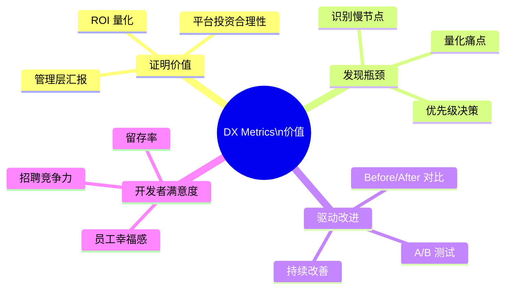

#<!-- chunk: 度量框架全景 -->## 度量框架全景

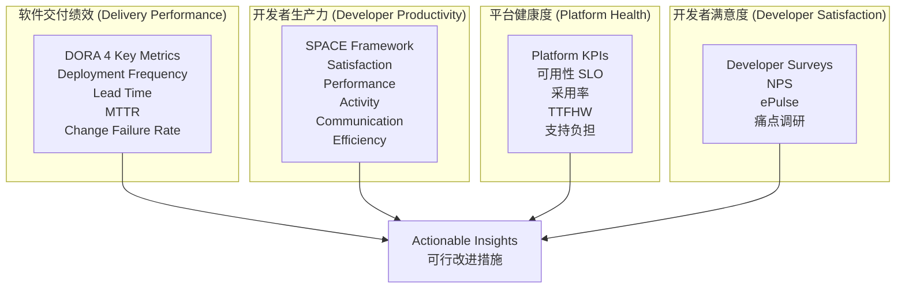

---

<!-- chunk: DORA 指标详解 -->## DORA 指标详解

#<!-- chunk: 四大核心指标 -->## 四大核心指标

DORA（DevOps Research and Assessment）通过多年大规模研究，识别出四个与组织绩效高度相关的软件交付指标：

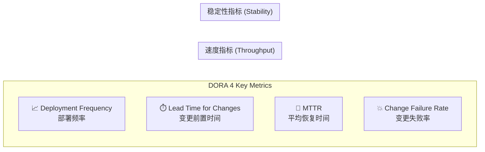

#<!-- chunk: 绩效等级对照表 -->## 绩效等级对照表

| 指标 | Elite（精英） | High（高） | Medium（中） | Low（低） |
|------|-------------|-----------|-------------|---------|
| **部署频率** | 按需（多次/天） | 每天1次 - 每周1次 | 每月1次 - 每周1次 | 少于每6个月一次 |
| **变更前置时间** | < 1 小时 | 1天 - 1周 | 1周 - 1月 | 1月 - 6月 |
| **MTTR** | < 1 小时 | < 1 天 | 1天 - 1周 | > 6 个月 |
| **变更失败率** | 0-15% | 0-15% | 16-30% | 16-30% |

> 数据来源：2023 State of DevOps Report

#<!-- chunk: 指标1：Deployment Frequency（部署频率） -->## 指标1：Deployment Frequency（部署频率）

```yaml
# 通过 GitHub Actions 记录部署事件
# .github/workflows/deploy.yml
name: Production Deploy

on:
  push:
    branches: [main]

jobs:
  deploy:
    runs-on: ubuntu-latest
    steps:
      - name: Deploy to Production
        run: |
          # 执行部署逻辑
          ./scripts/deploy.sh production
      
      # 黄金路径：自动记录部署指标
      - name: Record Deployment Event
        if: success()
        uses: company/platform-actions/record-deployment@v1
        with:
          service: ${{ github.repository }}
          environment: production
          sha: ${{ github.sha }}
          deployer: ${{ github.actor }}
          # 推送到指标系统
          metrics-endpoint: ${{ secrets.METRICS_ENDPOINT }}
```

```python
# 部署频率计算脚本
from datetime import datetime, timedelta
from collections import defaultdict
import requests

class DORAMetricsCalculator:
    
    def __init__(self, github_client, time_window_days=30):
        self.github = github_client
        self.window = timedelta(days=time_window_days)
    
    def calculate_deployment_frequency(self, repo: str, env: str = "production") -> dict:
        """计算部署频率"""
        cutoff = datetime.now() - self.window
        
        # 获取生产环境部署记录
        deployments = self.github.get_deployments(
            repo=repo,
            environment=env,
            since=cutoff,
            state="success"
        )
        
        count = len(deployments)
        daily_rate = count / self.window.days
        
        # 判断绩效等级
        if daily_rate >= 1.0:
            level = "Elite" if daily_rate >= 3.0 else "High"
        elif daily_rate >= (1/7):  # 至少每周一次
            level = "Medium"
        else:
            level = "Low"
        
        return {
            "total_deployments": count,
            "period_days": self.window.days,
            "daily_rate": round(daily_rate, 3),
            "weekly_rate": round(daily_rate * 7, 2),
            "performance_level": level,
            "trend": self._calculate_trend(repo, env)
        }
    
    def calculate_lead_time(self, repo: str) -> dict:
        """计算变更前置时间（从 commit 到生产部署）"""
        lead_times = []
        
        deployments = self.github.get_recent_deployments(repo, limit=50)
        
        for deployment in deployments:
            # 找到此次部署包含的 commits
            commits = self.github.get_commits_for_deployment(deployment)
            
            if commits:
                # 使用最早 commit 的时间
                first_commit_time = min(c.created_at for c in commits)
                deploy_time = deployment.created_at
                
                lead_time_hours = (deploy_time - first_commit_time).total_seconds() / 3600
                lead_times.append(lead_time_hours)
        
        if not lead_times:
            return {"error": "No data"}
        
        median_hours = sorted(lead_times)[len(lead_times) // 2]
        
        if median_hours <= 1:
            level = "Elite"
        elif median_hours <= 24:
            level = "High"
        elif median_hours <= 24 * 7:
            level = "Medium"
        else:
            level = "Low"
        
        return {
            "median_hours": round(median_hours, 2),
            "median_days": round(median_hours / 24, 2),
            "p75_hours": round(sorted(lead_times)[int(len(lead_times) * 0.75)], 2),
            "p95_hours": round(sorted(lead_times)[int(len(lead_times) * 0.95)], 2),
            "performance_level": level,
            "sample_size": len(lead_times)
        }
    
    def calculate_mttr(self, repo: str) -> dict:
        """计算平均恢复时间"""
        incidents = self.get_production_incidents(repo)
        recovery_times = []
        
        for incident in incidents:
            if incident.resolved_at:
                duration_hours = (
                    incident.resolved_at - incident.started_at
                ).total_seconds() / 3600
                recovery_times.append(duration_hours)
        
        if not recovery_times:
            return {"error": "No incidents in period"}
        
        mean_hours = sum(recovery_times) / len(recovery_times)
        
        level = (
            "Elite" if mean_hours < 1 else
            "High" if mean_hours < 24 else
            "Medium" if mean_hours < 168 else
            "Low"
        )
        
        return {
            "mean_hours": round(mean_hours, 2),
            "median_hours": round(sorted(recovery_times)[len(recovery_times)//2], 2),
            "incident_count": len(recovery_times),
            "performance_level": level
        }
    
    def calculate_change_failure_rate(self, repo: str) -> dict:
        """计算变更失败率"""
        deployments = self.github.get_deployments(repo, env="production")
        failed = [d for d in deployments if d.caused_incident]
        
        cfr = len(failed) / len(deployments) if deployments else 0
        
        level = (
            "Elite" if cfr <= 0.15 else
            "High" if cfr <= 0.15 else
            "Medium" if cfr <= 0.30 else
            "Low"
        )
        
        return {
            "rate": round(cfr, 3),
            "percentage": f"{cfr*100:.1f}%",
            "failed_deployments": len(failed),
            "total_deployments": len(deployments),
            "performance_level": level
        }
```

#<!-- chunk: 指标可视化 Prometheus 规则 -->## 指标可视化 Prometheus 规则

```yaml
# DORA Metrics Prometheus Rules
apiVersion: monitoring.coreos.com/v1
kind: PrometheusRule
metadata:
  name: dora-metrics
  namespace: monitoring
spec:
  groups:
    - name: dora.deployment_frequency
      interval: 1h
      rules:
        # 每日部署次数（按服务、环境分组）
        - record: dora:deployment_frequency:daily
          expr: |
            sum by (service, environment) (
              increase(platform_deployments_total{environment="production"}[24h])
            )
        
        # 7天滚动部署频率
        - record: dora:deployment_frequency:weekly_avg
          expr: |
            sum by (service) (
              increase(platform_deployments_total{environment="production"}[7d])
            ) / 7
    
    - name: dora.lead_time
      rules:
        # P50 前置时间（分钟）
        - record: dora:lead_time_minutes:p50
          expr: |
            histogram_quantile(0.50,
              rate(platform_lead_time_minutes_bucket{environment="production"}[7d])
            )
        
        # P95 前置时间
        - record: dora:lead_time_minutes:p95
          expr: |
            histogram_quantile(0.95,
              rate(platform_lead_time_minutes_bucket{environment="production"}[7d])
            )
    
    - name: dora.mttr
      rules:
        # 平均恢复时间（小时）
        - record: dora:mttr_hours:avg
          expr: |
            avg by (service) (
              platform_incident_duration_hours
            )
    
    - name: dora.change_failure_rate
      rules:
        # 变更失败率
        - record: dora:change_failure_rate
          expr: |
            sum by (service) (
              increase(platform_deployments_total{environment="production", status="failed"}[30d])
            ) /
            sum by (service) (
              increase(platform_deployments_total{environment="production"}[30d])
            )
    
    - name: dora.alerts
      rules:
        - alert: DORALeadTimeRegression
          expr: dora:lead_time_minutes:p50 > 1440  # 超过 24 小时
          for: 3d
          labels:
            severity: warning
          annotations:
            summary: "Lead time degraded for {{ $labels.service }}"
            description: "P50 lead time is {{ $value }} minutes (threshold: 1440)"
        
        - alert: DORAHighChangeFailureRate
          expr: dora:change_failure_rate > 0.30
          for: 7d
          labels:
            severity: critical
          annotations:
            summary: "High change failure rate for {{ $labels.service }}"
```

---

<!-- chunk: SPACE 框架 -->## SPACE 框架

#<!-- chunk: SPACE 框架概述 -->## SPACE 框架概述

SPACE 框架由 GitHub、微软研究院和 Victoria University 联合提出（2021），是比 DORA 更全面的开发者生产力框架：

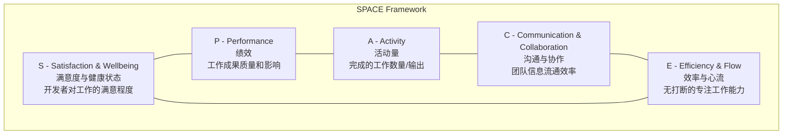

#<!-- chunk: SPACE 各维度指标 -->## SPACE 各维度指标

##<!-- chunk: S - Satisfaction（满意度） -->## S - Satisfaction（满意度）

```yaml
# 季度开发者满意度调研问题
satisfaction_survey:
  questions:
    - id: overall_satisfaction
      type: likert_5
      question: "总体而言，您对当前开发工具和平台的满意度是？"
      scale:
        1: "非常不满意"
        3: "中等"
        5: "非常满意"
    
    - id: tool_effectiveness
      type: likert_5
      question: "您使用的工具是否有效支持您完成工作？"
    
    - id: burnout_risk
      type: likert_5
      question: "您在工作中感到精疲力竭的频率是？"
      inverted: true  # 低分更好
    
    - id: recommend_workplace
      type: nps_10
      question: "您向朋友推荐在本公司担任工程师职位的可能性？"
      
    - id: biggest_pain
      type: open_text
      question: "您当前工作中最大的痛点是什么？"
```

##<!-- chunk: A - Activity（活动量指标） -->## A - Activity（活动量指标）

```python
# 从 GitHub 采集活动指标
class ActivityMetricsCollector:
    
    def collect_weekly_activity(self, team: str) -> dict:
        members = self.get_team_members(team)
        metrics = {}
        
        for member in members:
            user_metrics = {
                # 代码贡献
                "commits": self.count_commits(member, days=7),
                "pr_opened": self.count_prs_opened(member, days=7),
                "pr_reviewed": self.count_prs_reviewed(member, days=7),
                "pr_merged": self.count_prs_merged(member, days=7),
                
                # 代码质量
                "code_review_comments": self.count_review_comments(member, days=7),
                "issues_closed": self.count_issues_closed(member, days=7),
                
                # 知识共享
                "docs_updated": self.count_doc_changes(member, days=7),
            }
            
            # 计算综合活动得分（注意：避免单一指标评判）
            metrics[member] = user_metrics
        
        return {
            "team": team,
            "period": "7d",
            "aggregate": self._aggregate_team_metrics(metrics),
            "members": metrics
        }
```

##<!-- chunk: E - Efficiency（效率指标） -->## E - Efficiency（效率指标）

```sql
-- 分析 PR 生命周期效率（BigQuery / Redshift）
WITH pr_lifecycle AS (
  SELECT
    pr.id,
    pr.repo,
    pr.author,
    pr.team,
    
    -- 从创建到首次 Review 的等待时间
    TIMESTAMP_DIFF(
      first_review.created_at, 
      pr.created_at, 
      HOUR
    ) AS hours_to_first_review,
    
    -- 从 Ready 到合并的时间
    TIMESTAMP_DIFF(
      pr.merged_at,
      pr.ready_for_review_at,
      HOUR
    ) AS hours_from_ready_to_merge,
    
    -- Review 循环次数
    pr.review_cycle_count,
    
    -- CI 等待时间
    pr.total_ci_wait_hours,
    
    -- 代码行数
    pr.additions + pr.deletions AS total_changes
    
  FROM pull_requests pr
  LEFT JOIN LATERAL (
    SELECT MIN(created_at) AS created_at
    FROM pr_reviews
    WHERE pr_id = pr.id
  ) first_review ON true
  WHERE pr.merged_at >= CURRENT_DATE - 30
)

SELECT
  team,
  repo,
  
  -- 关键效率指标
  ROUND(AVG(hours_to_first_review), 2) AS avg_hours_to_first_review,
  ROUND(PERCENTILE_CONT(hours_to_first_review, 0.5) OVER (PARTITION BY team), 2) AS p50_hours_to_first_review,
  
  ROUND(AVG(hours_from_ready_to_merge), 2) AS avg_merge_time_hours,
  ROUND(AVG(review_cycle_count), 2) AS avg_review_cycles,
  ROUND(AVG(total_ci_wait_hours), 2) AS avg_ci_wait_hours,
  
  -- PR 规模分布
  COUNTIF(total_changes <= 50) AS small_prs,
  COUNTIF(total_changes BETWEEN 51 AND 200) AS medium_prs,
  COUNTIF(total_changes > 200) AS large_prs,
  
  COUNT(*) AS total_prs

FROM pr_lifecycle
GROUP BY team, repo
ORDER BY team, avg_merge_time_hours DESC;
```

---

<!-- chunk: 平台工程 KPI -->## 平台工程 KPI

#<!-- chunk: 平台 KPI 体系 -->## 平台 KPI 体系

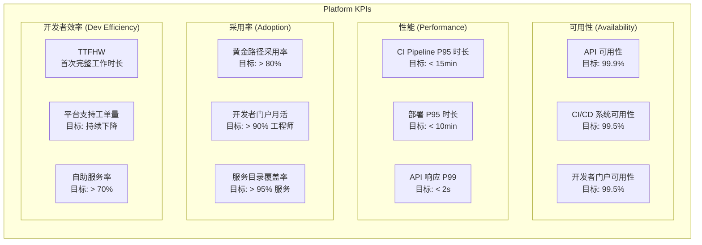

#<!-- chunk: TTFHW 指标详解 -->## TTFHW 指标详解

TTFHW（Time to First Hello World）是衡量新工程师或新项目启动效率的关键指标：

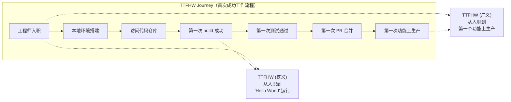

```yaml
# 追踪 TTFHW 的 Onboarding Checklist
apiVersion: platform.internal.io/v1
kind: OnboardingProgress
metadata:
  name: engineer-alice-onboarding
  namespace: team-backend
spec:
  engineerName: Alice Chen
  startDate: "2024-01-15"
  team: backend-platform
  
milestones:
  - id: workstation_ready
    description: "本地开发环境搭建完成"
    completedAt: "2024-01-15T16:30:00Z"
    durationHours: 2.5
    
  - id: repo_access
    description: "获取所有必要的仓库访问权限"
    completedAt: "2024-01-15T14:00:00Z"
    durationHours: 1.0
    
  - id: first_build_success
    description: "第一次本地 build 成功"
    completedAt: "2024-01-15T17:30:00Z"
    durationHours: 3.5
    
  - id: first_test_pass
    description: "第一次测试全部通过"
    completedAt: "2024-01-16T10:00:00Z"
    durationHours: 18.0
    
  - id: first_pr_merged
    description: "第一个 PR 成功合并"
    completedAt: "2024-01-17T14:00:00Z"
    durationHours: 48.0
    
  - id: first_production_deploy
    description: "第一个功能成功部署到生产"
    completedAt: "2024-01-19T11:00:00Z"
    durationHours: 96.0

status:
  ttfhw_narrow_hours: 3.5    # 到第一次 build 成功
  ttfhw_broad_hours: 96.0    # 到第一次生产部署
  blockers_encountered:
    - "VPN 配置文档过时，需要手动排查"
    - "本地 Docker 版本不兼容，缺少升级说明"
```

#<!-- chunk: 平台 SLO 定义 -->## 平台 SLO 定义

```yaml
# Platform SLO Configuration
apiVersion: sloth.slok.dev/v1
kind: PrometheSloth
metadata:
  name: platform-api-slo
  namespace: monitoring
spec:
  service: "platform-api"
  labels:
    team: platform
  
  slos:
    # SLO 1: API 可用性
    - name: api-availability
      objective: 99.9
      description: "Platform API should be available 99.9% of the time"
      
      sli:
        events:
          error_query: |
            sum(rate(http_requests_total{
              service="platform-api",
              code=~"5.."
            }[5m]))
          total_query: |
            sum(rate(http_requests_total{
              service="platform-api"
            }[5m]))
      
      alerting:
        name: PlatformAPIAvailability
        labels:
          severity: critical
          team: platform
        annotations:
          summary: "Platform API availability SLO burn rate too high"
        page_alert:
          labels:
            severity: critical
        ticket_alert:
          labels:
            severity: warning
    
    # SLO 2: CI Pipeline 成功率
    - name: ci-pipeline-success-rate
      objective: 99.0
      description: "CI pipelines should succeed 99% of the time (excluding test failures)"
      
      sli:
        events:
          error_query: |
            sum(rate(ci_pipeline_runs_total{
              status="infrastructure_failure"
            }[5m]))
          total_query: |
            sum(rate(ci_pipeline_runs_total[5m]))
    
    # SLO 3: 部署系统延迟
    - name: deployment-latency
      objective: 95.0
      description: "95% of deployments should complete within 10 minutes"
      
      sli:
        events:
          error_query: |
            sum(rate(deployment_duration_seconds_bucket{
              le="600",
              environment="production"
            }[5m]))
          total_query: |
            sum(rate(deployment_duration_seconds_count{
              environment="production"
            }[5m]))
```

#<!-- chunk: 自助服务率计算 -->## 自助服务率计算

```python
# 自助服务率 = 通过平台自动完成的请求 / 总请求
class SelfServiceRateCalculator:
    
    def calculate(self, period_days: int = 30) -> dict:
        """
        计算不同类型请求的自助服务率
        """
        results = {}
        
        # 数据库请求
        db_auto = self.query_metric(
            "platform_service_requests_total",
            filters={"type": "database", "channel": "self-service"},
            period=period_days
        )
        db_total = self.query_metric(
            "platform_service_requests_total",
            filters={"type": "database"},
            period=period_days
        )
        results["database"] = {
            "self_service": db_auto,
            "total": db_total,
            "rate": db_auto / db_total if db_total > 0 else 0
        }
        
        # 证书请求
        cert_auto = self.query_metric(
            "platform_service_requests_total",
            filters={"type": "certificate", "channel": "self-service"},
            period=period_days
        )
        cert_total = self.query_metric(
            "platform_service_requests_total",
            filters={"type": "certificate"},
            period=period_days
        )
        results["certificate"] = {
            "self_service": cert_auto,
            "total": cert_total,
            "rate": cert_auto / cert_total if cert_total > 0 else 0
        }
        
        # 总体自助服务率
        total_auto = sum(r["self_service"] for r in results.values())
        total_all = sum(r["total"] for r in results.values())
        
        results["overall"] = {
            "self_service": total_auto,
            "total": total_all,
            "rate": total_auto / total_all if total_all > 0 else 0,
            "target": 0.70,  # 目标：70% 自助服务
            "achieving_target": (total_auto / total_all) >= 0.70 if total_all > 0 else False
        }
        
        return results
```

---

<!-- chunk: 开发者满意度调研 -->## 开发者满意度调研

#<!-- chunk: 调研设计原则 -->## 调研设计原则

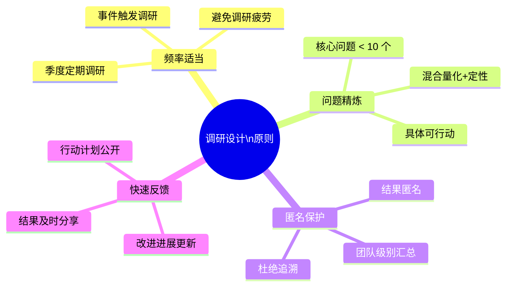

#<!-- chunk: 全面开发者满意度调研模板 -->## 全面开发者满意度调研模板

```json
{
  "survey": {
    "name": "Developer Experience Quarterly Survey",
    "version": "2024-Q1",
    "estimated_time": "8 minutes",
    "frequency": "quarterly",
    
    "sections": [
      {
        "id": "overall_dx",
        "title": "整体开发者体验",
        "questions": [
          {
            "id": "overall_nps",
            "type": "nps",
            "question": "您向其他工程师推荐在本公司工作的可能性（0-10）？",
            "scale_labels": {
              "0": "绝对不会",
              "10": "非常可能"
            }
          },
          {
            "id": "platform_satisfaction",
            "type": "likert_5",
            "question": "对平台和工具整体满意度？",
            "required": true
          },
          {
            "id": "dx_trend",
            "type": "single_choice",
            "question": "与6个月前相比，您的开发体验：",
            "options": ["明显改善", "略有改善", "基本不变", "略有下降", "明显下降"]
          }
        ]
      },
      {
        "id": "developer_tools",
        "title": "开发工具",
        "questions": [
          {
            "id": "local_dev_satisfaction",
            "type": "likert_5",
            "question": "本地开发环境搭建和使用的满意度？"
          },
          {
            "id": "ide_tools",
            "type": "likert_5",
            "question": "IDE 插件和开发工具的满意度？"
          },
          {
            "id": "documentation_quality",
            "type": "likert_5",
            "question": "技术文档的质量和可发现性？"
          },
          {
            "id": "tool_pain_points",
            "type": "multi_select",
            "question": "以下哪些工具/领域让您感到沮丧？（多选）",
            "options": [
              "本地开发环境",
              "CI/CD 流程",
              "部署流程",
              "监控和调试",
              "代码审查工具",
              "文档",
              "秘钥和权限管理",
              "其他"
            ]
          }
        ]
      },
      {
        "id": "ci_cd_experience",
        "title": "CI/CD 体验",
        "questions": [
          {
            "id": "ci_speed",
            "type": "likert_5",
            "question": "CI/CD Pipeline 速度满意度？"
          },
          {
            "id": "ci_reliability",
            "type": "likert_5",
            "question": "CI/CD Pipeline 可靠性（flaky test 频率等）？"
          },
          {
            "id": "deploy_confidence",
            "type": "likert_5",
            "question": "部署到生产环境的信心程度？"
          },
          {
            "id": "ci_wait_time",
            "type": "single_choice",
            "question": "您通常需要等待 CI 多长时间？",
            "options": ["< 5分钟", "5-10分钟", "10-20分钟", "20-30分钟", "> 30分钟"]
          }
        ]
      },
      {
        "id": "platform_services",
        "title": "平台服务",
        "questions": [
          {
            "id": "self_service_effectiveness",
            "type": "likert_5",
            "question": "通过开发者门户自助获取所需资源的便捷性？"
          },
          {
            "id": "platform_support_quality",
            "type": "likert_5",
            "question": "向平台团队寻求帮助时的响应质量？"
          },
          {
            "id": "golden_path_usefulness",
            "type": "likert_5",
            "question": "黄金路径模板的实用性？",
            "skip_if": {
              "question": "have_used_golden_paths",
              "value": false
            }
          }
        ]
      },
      {
        "id": "productivity_blockers",
        "title": "生产力障碍",
        "questions": [
          {
            "id": "interruption_frequency",
            "type": "single_choice",
            "question": "每天被会议/消息打断深度工作的频率？",
            "options": ["很少（< 2次）", "偶尔（2-5次）", "经常（5-10次）", "非常频繁（> 10次）"]
          },
          {
            "id": "top_productivity_blocker",
            "type": "open_text",
            "question": "当前影响您生产力的最大障碍是什么？",
            "placeholder": "请具体描述，例如：等待 PR 审查时间过长、测试环境经常宕机等"
          },
          {
            "id": "one_improvement",
            "type": "open_text",
            "question": "如果平台团队只能做一件事来改善您的工作体验，那应该是什么？"
          }
        ]
      }
    ],
    
    "metadata": {
      "anonymous": true,
      "aggregate_by": ["team", "role", "tenure_band"],
      "min_group_size_for_reporting": 5
    }
  }
}
```

#<!-- chunk: NPS 分析方法 -->## NPS 分析方法

```python
# Developer NPS 分析
class DeveloperNPSAnalyzer:
    
    def analyze(self, responses: list[dict]) -> dict:
        """
        NPS = %Promoters (9-10) - %Detractors (0-6)
        Passives: 7-8 (不计入 NPS)
        """
        scores = [r["overall_nps"] for r in responses]
        
        promoters = [s for s in scores if s >= 9]
        detractors = [s for s in scores if s <= 6]
        passives = [s for s in scores if 7 <= s <= 8]
        
        total = len(scores)
        promoter_pct = len(promoters) / total * 100
        detractor_pct = len(detractors) / total * 100
        
        nps = promoter_pct - detractor_pct
        
        # NPS 分级
        if nps >= 50:
            rating = "Excellent"
        elif nps >= 30:
            rating = "Good"
        elif nps >= 0:
            rating = "Needs Improvement"
        else:
            rating = "Critical"
        
        # 提取关键反馈主题
        pain_points = self.extract_themes(
            [r["one_improvement"] for r in responses if r.get("one_improvement")]
        )
        
        return {
            "nps": round(nps, 1),
            "rating": rating,
            "promoters": {"count": len(promoters), "percentage": round(promoter_pct, 1)},
            "passives": {"count": len(passives), "percentage": round(len(passives)/total*100, 1)},
            "detractors": {"count": len(detractors), "percentage": round(detractor_pct, 1)},
            "total_responses": total,
            "response_rate": self.calculate_response_rate(total),
            "top_themes": pain_points[:5],  # 前5大主题
            "trend": self.calculate_trend()  # vs. 上季度
        }
    
    def extract_themes(self, text_responses: list[str]) -> list[dict]:
        """使用简单词频或 NLP 提取主题"""
        from collections import Counter
        import re
        
        # 预定义平台相关主题关键词
        themes = {
            "ci_speed": ["ci", "build", "pipeline", "slow", "fast", "速度", "慢"],
            "documentation": ["doc", "docs", "documentation", "wiki", "文档"],
            "local_dev": ["local", "localhost", "dev env", "本地", "环境"],
            "deployment": ["deploy", "deployment", "release", "部署", "发布"],
            "monitoring": ["monitor", "metrics", "alert", "debug", "监控", "告警"],
            "oncall": ["oncall", "on-call", "incident", "pagerduty", "值班"],
        }
        
        theme_counts = Counter()
        for response in text_responses:
            response_lower = response.lower()
            for theme, keywords in themes.items():
                if any(kw in response_lower for kw in keywords):
                    theme_counts[theme] += 1
        
        return [
            {"theme": theme, "mention_count": count, "percentage": count/len(text_responses)*100}
            for theme, count in theme_counts.most_common()
        ]
```

---

<!-- chunk: 指标采集架构 -->## 指标采集架构

#<!-- chunk: 指标数据流架构 -->## 指标数据流架构

```mermaid
graph TB
    subgraph "Data Sources（数据源）"
        GH[GitHub\nCommits/PRs/Deploys]
        PROM[Prometheus\n基础设施指标]
        JIRA[Jira / Linear\n工单/故障]
        SURVEY[Survey Tool\n满意度调研]
        PORTAL[Developer Portal\n使用数据]
    end
    
    subgraph "Collection Layer（采集层）"
        GH_EXPORTER[GitHub\nMetrics Exporter]
        PROM_REMOTE[Prometheus\nRemote Write]
        JIRA_EXPORTER[Incident\nExporter]
        SURVEY_API[Survey\nAPI Connector]
    end
    
    subgraph "Storage Layer（存储层）"
        THANOS[Thanos\n长期指标存储]
        BQ[BigQuery\n工程效率数仓]
        PG[PostgreSQL\n调研数据]
    end
    
    subgraph "Analytics Layer（分析层）"
        DBT[dbt\n数据转换]
        JUPYTER[Jupyter\n探索分析]
    end
    
    subgraph "Visualization Layer（可视化层）"
        GRAFANA[Grafana\nOperational Dashboards]
        LOOKER[Looker / Metabase\nEngineering Analytics]
        BACKSTAGE[Backstage\nDeveloper Portal]
    end
    
    GH --> GH_EXPORTER
    PROM --> PROM_REMOTE
    JIRA --> JIRA_EXPORTER
    SURVEY --> SURVEY_API
    
    GH_EXPORTER --> BQ
    PROM_REMOTE --> THANOS
    JIRA_EXPORTER --> BQ
    SURVEY_API --> PG
    PORTAL --> BQ
    
    BQ --> DBT
    DBT --> LOOKER
    THANOS --> GRAFANA
    PG --> LOOKER
    
    LOOKER --> BACKSTAGE
    GRAFANA --> BACKSTAGE
    
    style "Data Sources（数据源）" fill:#fff3e0
    style "Collection Layer（采集层）" fill:#e8f5e9
    style "Storage Layer（存储层）" fill:#e3f2fd
    style "Analytics Layer（分析层）" fill:#f3e5f5
    style "Visualization Layer（可视化层）" fill:#fce4ec
```

#<!-- chunk: GitHub 指标采集器实现 -->## GitHub 指标采集器实现

```python
# github_metrics_exporter.py
# 将 GitHub 工程效率指标推送到 Prometheus Pushgateway

import time
import schedule
from github import Github
from prometheus_client import (
    Gauge, Histogram, Counter,
    push_to_gateway, CollectorRegistry
)

class GitHubMetricsExporter:
    
    def __init__(self, token: str, org: str, pushgateway_url: str):
        self.github = Github(token)
        self.org = self.github.get_organization(org)
        self.pushgateway_url = pushgateway_url
        self.registry = CollectorRegistry()
        self._init_metrics()
    
    def _init_metrics(self):
        """定义所有指标"""
        self.pr_lead_time = Histogram(
            'engineering_pr_lead_time_hours',
            'Time from PR open to merge in hours',
            ['repo', 'team'],
            buckets=[1, 4, 8, 24, 48, 72, 168, 336],
            registry=self.registry
        )
        
        self.pr_time_to_first_review = Histogram(
            'engineering_pr_time_to_first_review_hours',
            'Time from PR ready to first review in hours',
            ['repo', 'team'],
            buckets=[0.5, 1, 2, 4, 8, 24, 48],
            registry=self.registry
        )
        
        self.deployment_frequency = Gauge(
            'engineering_deployment_frequency_weekly',
            'Number of deployments to production per week',
            ['repo', 'team'],
            registry=self.registry
        )
        
        self.build_success_rate = Gauge(
            'engineering_build_success_rate',
            'CI build success rate (0-1)',
            ['repo', 'team'],
            registry=self.registry
        )
        
        self.pr_size_distribution = Counter(
            'engineering_pr_size_total',
            'PR size distribution',
            ['repo', 'size_category'],  # tiny, small, medium, large, xlarge
            registry=self.registry
        )
    
    def collect_and_push(self):
        """采集指标并推送"""
        print(f"[{time.strftime('%Y-%m-%d %H:%M:%S')}] Collecting GitHub metrics...")
        
        for repo in self.org.get_repos():
            team = self._get_team_for_repo(repo)
            
            # 采集最近 30 天的 PR 指标
            self._collect_pr_metrics(repo, team)
            
            # 采集部署频率
            self._collect_deployment_frequency(repo, team)
            
            # 采集 CI 成功率
            self._collect_ci_metrics(repo, team)
        
        # 推送到 Pushgateway
        push_to_gateway(
            self.pushgateway_url,
            job='github-metrics-exporter',
            registry=self.registry
        )
        print("Metrics pushed successfully")
    
    def _collect_pr_metrics(self, repo, team: str):
        """采集 PR 生命周期指标"""
        cutoff = time.time() - 30 * 24 * 3600  # 30 天前
        
        for pr in repo.get_pulls(state='closed', sort='updated', direction='desc'):
            if pr.merged_at is None:
                continue
            if pr.created_at.timestamp() < cutoff:
                break
            
            # PR 前置时间
            lead_time_hours = (
                pr.merged_at - pr.created_at
            ).total_seconds() / 3600
            self.pr_lead_time.labels(
                repo=repo.name, team=team
            ).observe(lead_time_hours)
            
            # PR 规模分类
            total_changes = pr.additions + pr.deletions
            size_category = (
                "tiny" if total_changes <= 10 else
                "small" if total_changes <= 50 else
                "medium" if total_changes <= 200 else
                "large" if total_changes <= 500 else
                "xlarge"
            )
            self.pr_size_distribution.labels(
                repo=repo.name, size_category=size_category
            ).inc()
    
    def start(self, interval_minutes: int = 60):
        """定期采集"""
        self.collect_and_push()  # 立即执行一次
        schedule.every(interval_minutes).minutes.do(self.collect_and_push)
        
        while True:
            schedule.run_pending()
            time.sleep(60)
```

---

<!-- chunk: 平台指标仪表板 -->## 平台指标仪表板

#<!-- chunk: Grafana Dashboard JSON 配置 -->## Grafana Dashboard JSON 配置

```json
{
  "dashboard": {
    "title": "Platform Engineering - Developer Experience",
    "uid": "platform-dx-overview",
    "tags": ["platform", "dx", "dora"],
    "time": {"from": "now-30d", "to": "now"},
    
    "panels": [
      {
        "id": 1,
        "title": "DORA Overview",
        "type": "stat",
        "gridPos": {"h": 4, "w": 24, "x": 0, "y": 0},
        "targets": [
          {
            "expr": "dora:deployment_frequency:weekly_avg",
            "legendFormat": "Deploy Freq (per week)"
          }
        ],
        "fieldConfig": {
          "defaults": {
            "thresholds": {
              "mode": "absolute",
              "steps": [
                {"color": "red", "value": null},
                {"color": "yellow", "value": 1},
                {"color": "green", "value": 7}
              ]
            }
          }
        }
      },
      
      {
        "id": 2,
        "title": "Lead Time for Changes (P50) - Days",
        "type": "gauge",
        "gridPos": {"h": 8, "w": 6, "x": 0, "y": 4},
        "targets": [
          {
            "expr": "dora:lead_time_minutes:p50 / 60 / 24",
            "legendFormat": "P50 Lead Time (days)"
          }
        ],
        "fieldConfig": {
          "defaults": {
            "min": 0,
            "max": 30,
            "thresholds": {
              "steps": [
                {"color": "green", "value": null},
                {"color": "yellow", "value": 1},
                {"color": "orange", "value": 7},
                {"color": "red", "value": 30}
              ]
            }
          }
        }
      },
      
      {
        "id": 3,
        "title": "Change Failure Rate (%)",
        "type": "gauge",
        "gridPos": {"h": 8, "w": 6, "x": 6, "y": 4},
        "targets": [
          {
            "expr": "dora:change_failure_rate * 100",
            "legendFormat": "Change Failure Rate"
          }
        ],
        "fieldConfig": {
          "defaults": {
            "unit": "percent",
            "min": 0,
            "max": 50,
            "thresholds": {
              "steps": [
                {"color": "green", "value": null},
                {"color": "yellow", "value": 15},
                {"color": "red", "value": 30}
              ]
            }
          }
        }
      },
      
      {
        "id": 4,
        "title": "CI Pipeline Duration P95 (minutes)",
        "type": "timeseries",
        "gridPos": {"h": 8, "w": 12, "x": 12, "y": 4},
        "targets": [
          {
            "expr": "histogram_quantile(0.95, rate(ci_pipeline_duration_seconds_bucket[1h])) / 60",
            "legendFormat": "P95 CI Duration"
          },
          {
            "expr": "histogram_quantile(0.50, rate(ci_pipeline_duration_seconds_bucket[1h])) / 60",
            "legendFormat": "P50 CI Duration"
          }
        ]
      },
      
      {
        "id": 5,
        "title": "Platform Self-Service Rate",
        "type": "bargauge",
        "gridPos": {"h": 8, "w": 12, "x": 0, "y": 12},
        "targets": [
          {
            "expr": "platform_self_service_rate by (service_type)",
            "legendFormat": "{{service_type}}"
          }
        ],
        "fieldConfig": {
          "defaults": {
            "unit": "percentunit",
            "thresholds": {
              "steps": [
                {"color": "red", "value": null},
                {"color": "yellow", "value": 0.5},
                {"color": "green", "value": 0.7}
              ]
            }
          }
        }
      }
    ]
  }
}
```

---

<!-- chunk: DX 改进循环 -->## DX 改进循环

#<!-- chunk: 持续改进循环 -->## 持续改进循环

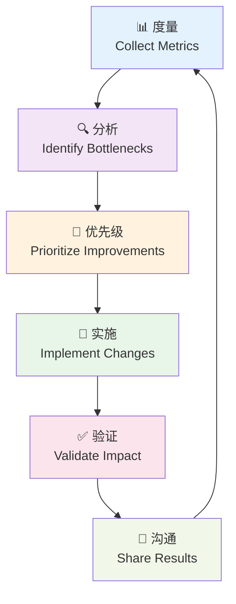

#<!-- chunk: OKR 示例：DX 改进 -->## OKR 示例：DX 改进

```yaml
# Platform Team Q1 2024 OKRs - Developer Experience Focus
objective:
  title: "显著提升开发者体验和平台效率"
  quarter: Q1-2024
  
key_results:
  - kr: "将 P95 CI Pipeline 时长从 25 分钟缩短到 12 分钟"
    metric: ci_pipeline_duration_p95_minutes
    baseline: 25
    target: 12
    initiatives:
      - "迁移到 GitHub Actions Large Runners"
      - "实施智能测试选择（只跑受影响的测试）"
      - "优化 Docker 层缓存策略"
  
  - kr: "将开发者门户月活用户率从 45% 提升到 80%"
    metric: developer_portal_mau_rate
    baseline: 0.45
    target: 0.80
    initiatives:
      - "添加缺失的 50 个服务到软件目录"
      - "发布 5 个新的黄金路径模板"
      - "举办 3 次开发者门户培训"
  
  - kr: "将开发者 NPS 从 +12 提升到 +35"
    metric: developer_nps
    baseline: 12
    target: 35
    initiatives:
      - "解决 Top 3 调研反馈痛点"
      - "建立平台变更提前通知机制"
      - "建立 5 分钟内响应的专属支持渠道"
  
  - kr: "将 TTFHW（首次生产部署时长）从 10 天降到 3 天"
    metric: ttfhw_broad_days
    baseline: 10
    target: 3
    initiatives:
      - "重写入职文档（基于真实用户测试）"
      - "实施自动化环境配置脚本"
      - "建立入职 Buddy 计划"
```

---

<!-- chunk: 指标陷阱与反模式 -->## 指标陷阱与反模式

#<!-- chunk: 常见陷阱 -->## 常见陷阱

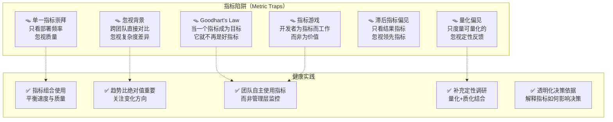

#<!-- chunk: 避免指标游戏的设计原则 -->## 避免指标游戏的设计原则

```yaml
# 健康的指标使用原则

principles:
  team_owned:
    description: "指标由团队自己使用来改进，而非管理层用来评估"
    implementation:
      - "指标数据主要给开发团队，不直接用于绩效考核"
      - "鼓励团队诚实报告挑战，而非隐藏"
  
  balanced_metrics:
    description: "永远成对使用速度和质量指标"
    implementation:
      - "部署频率 + 变更失败率（快速但不稳定是危险的）"
      - "Code Review 速度 + Code Review 评论数（快速但浅显没价值）"
      - "功能交付速度 + 客户满意度（快速但无价值是浪费）"
  
  context_aware:
    description: "理解指标背后的上下文"
    implementation:
      - "新团队 vs 成熟团队有不同基准"
      - "复杂系统改造 vs 新功能开发不可直接比较"
      - "允许团队解释异常指标"
  
  leading_indicators:
    description: "关注领先指标，而非只看滞后结果"
    examples:
      lagging: ["部署频率", "MTTR", "客户满意度"]
      leading: ["测试覆盖率趋势", "PR 大小分布", "技术债务积累速度"]
```

---

<!-- chunk: 实施路径 -->## 实施路径

#<!-- chunk: DX 度量实施计划 -->## DX 度量实施计划

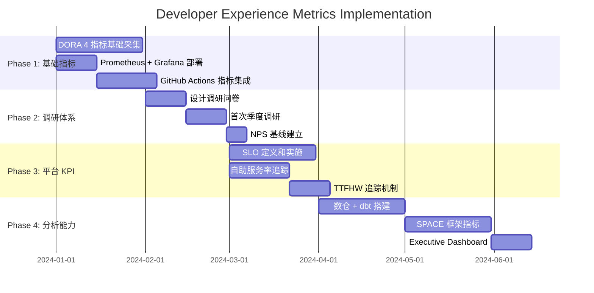

#<!-- chunk: 快速启动检查清单 -->## 快速启动检查清单

```markdown
<!-- chunk: 30天快速启动 DX 度量 -->## 30天快速启动 DX 度量

#<!-- chunk: Week 1-2: 基础设施 -->## Week 1-2: 基础设施
- [ ] 安装 Prometheus + Grafana
- [ ] 配置 GitHub Metrics Exporter
- [ ] 部署 DORA 指标看板

#<!-- chunk: Week 3: 第一次度量 -->## Week 3: 第一次度量
- [ ] 计算当前 4 项 DORA 指标基线
- [ ] 识别最大的部署瓶颈
- [ ] 记录第一个改进目标

#<!-- chunk: Week 4: 调研基线 -->## Week 4: 调研基线
- [ ] 发送首次开发者满意度调研（10题以内）
- [ ] 计算开发者 NPS 基线
- [ ] 提炼 Top 3 痛点

#<!-- chunk: Month 2-3: 完善体系 -->## Month 2-3: 完善体系
- [ ] 添加 SPACE 框架指标
- [ ] 实施平台 SLO 监控
- [ ] 建立月度 DX Review 会议
- [ ] 制定基于数据的改进 OKR
```

---

<!-- chunk: 总结 (Summary) -->## 总结 (Summary)

#<!-- chunk: DX 度量的核心原则 -->## DX 度量的核心原则

| 原则 | 描述 |
|------|------|
| **测量目的** | 改进，而非评判 |
| **指标平衡** | 速度与质量并重 |
| **团队自主** | 数据由团队拥有和使用 |
| **上下文感知** | 趋势比绝对值更重要 |
| **定量+定性** | 数字与人的声音结合 |
| **闭环改进** | 度量 → 分析 → 行动 → 验证 |

#<!-- chunk: 度量成熟度路径 -->## 度量成熟度路径

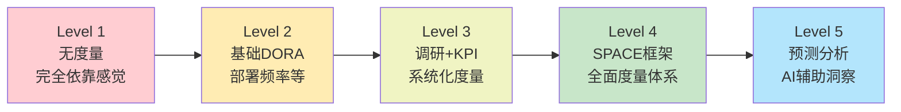

---

<!-- chunk: 参考资料 (References) -->## 参考资料 (References)

- [DORA State of DevOps Report 2023](https://cloud.google.com/devops/state-of-devops/)
- [SPACE Framework Paper](https://queue.acm.org/detail.cfm?id=3454124)
- [Accelerate: Building and Scaling High-Performing Technology Organizations](https://itrevolution.com/product/accelerate/)
- [Developer Experience at Spotify](https://engineering.atspotify.com/2020/08/how-we-use-golden-paths-to-solve-fragmentation-in-our-software-ecosystem/)
- [GitHub Engineering Metrics](https://github.blog/2021-09-22-github-actions-incremental-migration-using-an-internal-developer-platform/)
- [Google DORA Research](https://dora.dev/)
- [McKinsey Developer Velocity](https://www.mckinsey.com/industries/technology-media-and-telecommunications/our-insights/developer-velocity-how-software-excellence-fuels-business-performance)
- [Nicole Forsgren, Jez Humble, Gene Kim: Accelerate](https://itrevolution.com/product/accelerate/)

---

<!-- chunk: Obsidian 相关文档 -->## Obsidian 相关文档

- domain-07-platform-engineering MOC
- [[domain-07-platform-engineering/README.md|Domain 36: 平台工程 (Platform Engineering)]]
- Domain-36 平台工程 — 开源项目索引
- 平台工程概述与成熟度模型
- 内部开发者平台设计原则
- Backstage 部署与配置
- Backstage 软件目录与 TechDocs
- Backstage 脚手架与模板系统
- Kratix 平台即代码 (Kratix Platform as Code)
- Crossplane 平台组合 (Crossplane Platform Composition)
- Golden Paths 黄金路径设计 (Golden Paths Design Patterns)
- 平台团队拓扑与运营 (Platform Team Topology and Operations)

## See Also

- 07-crossplane-platform-composition
- 08-golden-paths-design
- 10-platform-team-topology
- 11-vercel-frontend-deployment-platform
