title: 平台团队拓扑与运营 (Platform Team Topology and Operations)
description: '<!-- chunk: 概述 (Overview)' -->## 概述 (Overview)'
category: platform-engineering
tags:
- k8s
- platform-engineering
- developer-experience
- idp
- prometheus
- grafana
- jaeger
- istio
- cilium
- helm
last_updated: 2026-05
difficulty: advanced
reading_level: advanced
audience:
- 平台工程师
- SRE
- 架构师
estimated_read_time: 5min
intent_queries:
- 平台团队拓扑与运营 (Platform Team Topology and Operations) 是什么
- 如何 平台团队拓扑与运营 (Platform Team Topology and Operations)
- Kubernetes 36 platform engineering 最佳实践
trigger_keywords:
- 平台团队拓扑与运营
- Platform
- Team
- Topology
- and
- Operations
- platform
- engineering
authors:
- name: KUDIG Team
  role: contributor
k8s_versions:
- '1.28'
- '1.29'
- '1.30'
- '1.31'
- '1.32'
---

# 平台团队拓扑与运营 (Platform Team Topology and Operations)

<!-- chunk: 概述 (Overview) -->## 概述 (Overview)

平台团队的组织结构和运营模式直接决定了内部开发者平台（IDP）的成败。本文基于 **Team Topologies** 框架，深入探讨如何将平台工程团队定位为内部产品组织，通过科学的团队交互模式、持续运营机制和 Toil（重复性工作）削减策略，构建高效的平台运营体系。

> "The platform team should think of developers as customers and the platform as a product."
> — Manuel Pais & Matthew Skelton, Team Topologies

---

<!-- chunk: 目录 (Table of Contents) -->## 目录 (Table of Contents)

1. [Team Topologies 基础框架](#team-topologies-基础框架)
2. [四种基本团队类型](#四种基本团队类型)
3. [三种交互模式](#三种交互模式)
4. [平台团队定位](#平台团队定位)
5. [平台即产品（Platform as a Product）](#平台即产品platform-as-a-product)
6. [平台团队组织结构](#平台团队组织结构)
7. [支持模式设计](#支持模式设计)
8. [Toil 识别与削减](#toil-识别与削减)
9. [平台运营节奏](#平台运营节奏)
10. [变更管理与沟通](#变更管理与沟通)
11. [平台路线图规划](#平台路线图规划)
12. [平台团队成熟度模型](#平台团队成熟度模型)

---

<!-- chunk: Team Topologies 基础框架 -->## Team Topologies 基础框架

#<!-- chunk: 核心理念 -->## 核心理念

Team Topologies 由 Matthew Skelton 和 Manuel Pais 提出，核心理念是：**软件架构会反映组织结构（Conway's Law）**，因此应该反过来 **有意识地设计团队结构来驱动期望的软件架构**（Inverse Conway Maneuver）。

```mermaid
graph TB
    subgraph "Conway's Law"
        ORG[组织结构]
        ARCH[软件架构]
        ORG -->|决定| ARCH
    end
    
    subgraph "Inverse Conway Maneuver"
        DESIRED[期望的软件架构]
        DESIGNED_ORG[设计匹配的组织结构]
        DESIRED --> DESIGNED_ORG
    end
    
    subgraph "Result"
        RESULT[软件架构自然匹配\n组织通信结构]
    end
    
    DESIGNED_ORG --> RESULT
    
    style "Conway's Law" fill:#ffebee
    style "Inverse Conway Maneuver" fill:#e8f5e9
    style "Result" fill:#e3f2fd
```

#<!-- chunk: 认知负载（Cognitive Load） -->## 认知负载（Cognitive Load）

Team Topologies 的另一核心概念是**认知负载管理**：

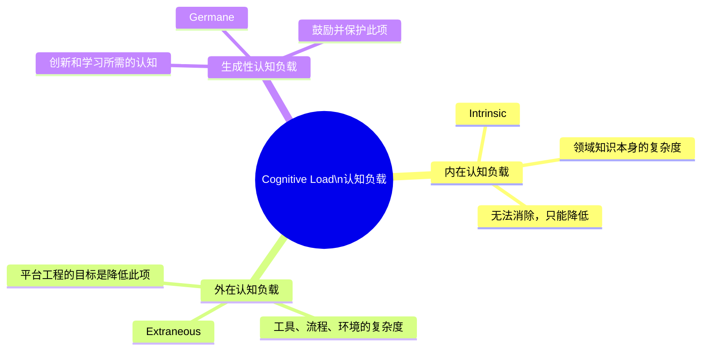

**平台工程的核心价值**：通过吸收**外在认知负载**（Extraneous Cognitive Load），让应用团队将认知资源集中在**领域创新**（Germane Cognitive Load）上。

---

<!-- chunk: 四种基本团队类型 -->## 四种基本团队类型

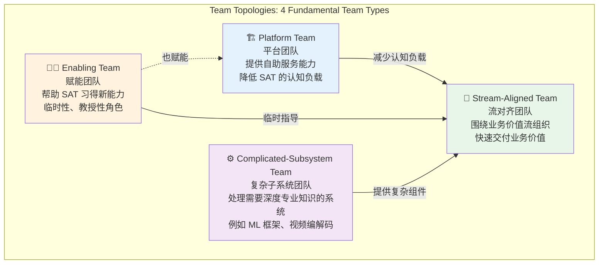

#<!-- chunk: 各团队类型详解 -->## 各团队类型详解

##<!-- chunk: 1. Stream-Aligned Team（流对齐团队） -->## 1. Stream-Aligned Team（流对齐团队）

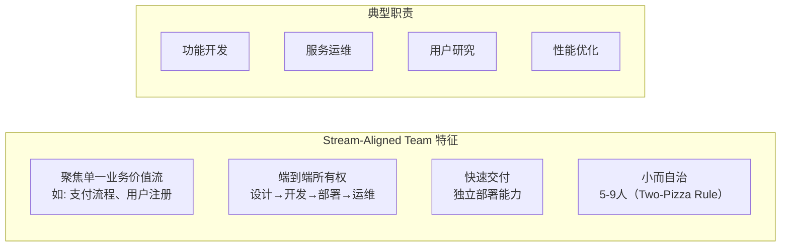

**示例**：支付团队（Payment Team）负责从支付 UI 到支付服务到对账系统的完整链路。

##<!-- chunk: 2. Platform Team（平台团队） -->## 2. Platform Team（平台团队）

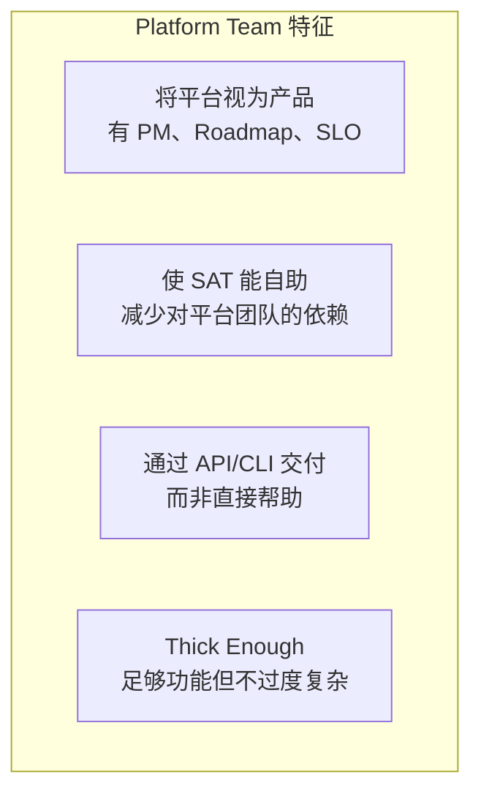

**关键原则**：平台团队的成功衡量标准是**开发者能否在不联系平台团队的情况下完成大多数任务**。

##<!-- chunk: 3. Enabling Team（赋能团队） -->## 3. Enabling Team（赋能团队）

```yaml
# 赋能团队的典型任务周期
enabling_team_engagement:
  name: "DevSecOps Enabling Team"
  mission: "帮助所有 Stream-Aligned 团队建立安全编码实践"
  
  typical_engagements:
    - name: "Team A: Container Security Hardening"
      duration: 6_weeks
      approach:
        - week1-2: 现状评估，发现安全差距
        - week3-4: 配对编程，建立安全扫描 CI 步骤
        - week5-6: 文档化最佳实践，逐步撤出
      deliverable: "团队独立运作安全扫描，不再依赖赋能团队"
    
    - name: "Platform Team: eBPF Knowledge Transfer"
      duration: 4_weeks
      approach:
        - "eBPF 技术培训和工作坊"
        - "协助构建第一个 eBPF 工具"
        - "Code Review 和最佳实践建立"
  
  anti_patterns:
    - "永久嵌入，形成依赖"
    - "替团队做工作，而不是教会团队"
    - "同时支持太多团队（推荐最多3个）"
```

##<!-- chunk: 4. Complicated-Subsystem Team（复杂子系统团队） -->## 4. Complicated-Subsystem Team（复杂子系统团队）

| 适用场景 | 示例 |
|---------|------|
| 需要深度专业知识 | 实时视频编解码引擎 |
| 算法复杂度高 | 推荐算法系统 |
| 合规要求严格 | 金融交易核心引擎 |
| 知识高度专业化 | 量化交易模型 |

---

<!-- chunk: 三种交互模式 -->## 三种交互模式

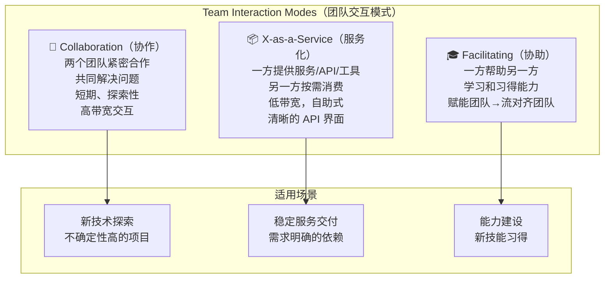

#<!-- chunk: 交互模式的演变 -->## 交互模式的演变

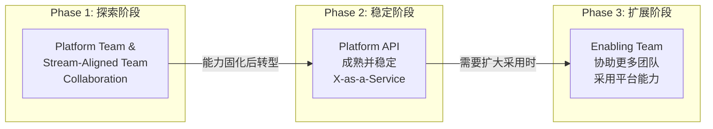

#<!-- chunk: 平台团队与 SAT 的交互设计 -->## 平台团队与 SAT 的交互设计

```yaml
# 平台团队与流对齐团队的交互协议
interaction_protocol:
  
  # 正常服务（X-as-a-Service 模式）
  normal_service:
    channel: developer_portal
    response_time: self_service_immediately
    escalation: slack_async_4h
    examples:
      - "申请新数据库"
      - "获取 SSL 证书"
      - "创建新服务骨架"
  
  # 技术咨询（X-as-a-Service + 轻量协作）
  technical_consultation:
    channel: "#platform-questions Slack"
    response_time: "< 4 hours business hours"
    format: "Question → Answer thread"
    escalation: "book 30-min pairing session"
    examples:
      - "如何配置 Kafka Consumer 重试？"
      - "网络策略为什么不生效？"
  
  # 新能力共建（Collaboration 模式）
  new_capability_building:
    channel: "RFC process + Working Group"
    duration: "2-6 weeks"
    format:
      - "RFC 提案（平台团队或 SAT 均可发起）"
      - "Working Group（平台 + 感兴趣的 SAT）"
      - "MVP 构建（协作开发）"
      - "GA 后转入 X-as-a-Service 模式"
  
  # 应急支持（紧急协作）
  incident_support:
    channel: "PagerDuty escalation"
    response_time: "< 15 minutes"
    format: "Incident War Room"
    sla: P1_15min, P2_1h, P3_4h
```

---

<!-- chunk: 平台团队定位 -->## 平台团队定位

#<!-- chunk: 平台作为内部产品 -->## 平台作为内部产品

```mermaid
graph TB
    subgraph "传统 IT 支持模式"
        T_REQ[开发者提工单]
        T_TEAM[平台/运维团队]
        T_WAIT[等待响应\n几天/几周]
        T_DONE[问题解决]
        T_REQ --> T_TEAM --> T_WAIT --> T_DONE
    end
    
    subgraph "平台产品模式"
        P_DEV[开发者]
        P_PORTAL[开发者门户\n自助服务]
        P_PLATFORM[平台 API/CLI]
        P_DONE[即时获得能力\n分钟级]
        P_DEV --> P_PORTAL --> P_PLATFORM --> P_DONE
    end
    
    subgraph "平台团队角色转变"
        OLD[❌ 票据处理者\nTicket Handler]
        NEW[✅ 产品构建者\nProduct Builder]
    end
    
    T_TEAM -.->|转型| OLD
    OLD -->|演进| NEW
    
    style "传统 IT 支持模式" fill:#ffebee
    style "平台产品模式" fill:#e8f5e9
```

#<!-- chunk: Platform as a Product 核心实践 -->## Platform as a Product 核心实践

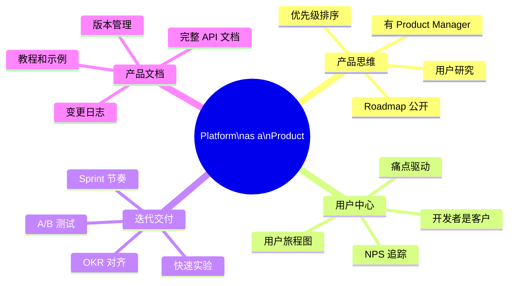

---

<!-- chunk: 平台团队组织结构 -->## 平台团队组织结构

#<!-- chunk: 规模化平台团队结构 -->## 规模化平台团队结构

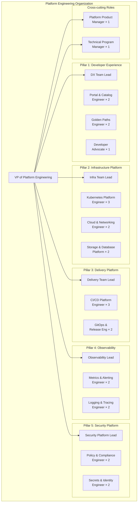

#<!-- chunk: 小团队（Startup/Scale-up）结构 -->## 小团队（Startup/Scale-up）结构

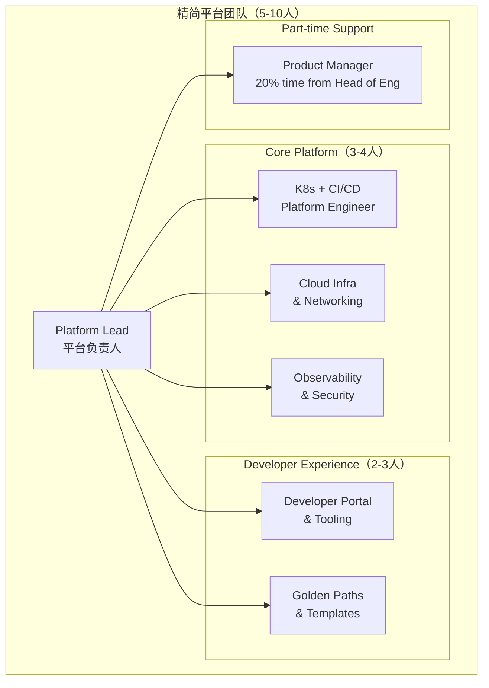

#<!-- chunk: 平台工程师 vs 传统 DevOps -->## 平台工程师 vs 传统 DevOps

| 维度 | 传统 DevOps/SRE | 平台工程师 |
|------|----------------|-----------|
| **主要工作** | 运维系统、响应事故 | 构建平台产品 |
| **客户** | 内部服务 | 开发者团队 |
| **成功指标** | SLA/SLO | 开发者 NPS, 采用率 |
| **工作模式** | 响应式 | 主动产品建设 |
| **技能栈** | Linux, 网络, 监控 | K8s, 自动化, 产品思维 |
| **与开发者关系** | 守门人 | 服务提供者 |

#<!-- chunk: 招聘技能矩阵 -->## 招聘技能矩阵

```yaml
# 平台工程师技能矩阵
platform_engineer_skills:
  
  must_have:
    kubernetes:
      depth: advanced
      topics:
        - "集群架构和组件"
        - "自定义 Controller 开发"
        - "Helm / Kustomize"
        - "网络、存储、RBAC"
    
    cloud:
      depth: proficient
      topics:
        - "至少一个主流云（AWS/GCP/Azure）"
        - "基础设施即代码（Terraform/Pulumi）"
        - "云网络和安全"
    
    programming:
      depth: proficient
      languages: [Go, Python, Bash]
      topics:
        - "API 设计"
        - "Kubernetes Operator 模式"
    
    cicd:
      depth: advanced
      topics:
        - "GitHub Actions / Tekton / Jenkins"
        - "GitOps (Flux/ArgoCD)"
        - "容器构建和镜像安全"
  
  good_to_have:
    - "可观测性工具（Prometheus, Grafana, Jaeger）"
    - "服务网格（Istio/Cilium）"
    - "开发者体验设计思维"
    - "产品管理基础"
  
  soft_skills:
    - "技术沟通和文档写作"
    - "以客户为中心的思维"
    - "跨团队协作"
    - "问题拆解和优先级判断"
```

---

<!-- chunk: 支持模式设计 -->## 支持模式设计

#<!-- chunk: 支持层级设计 -->## 支持层级设计

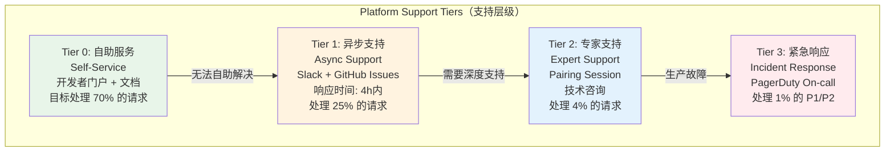

#<!-- chunk: Slack 支持渠道规范 -->## Slack 支持渠道规范

```markdown
# 平台支持渠道使用指南

<!-- chunk: #platform-announcements（公告频道） -->## #platform-announcements（公告频道）
- **用途**: 平台变更公告、维护通知、新功能发布
- **发布者**: 仅平台团队
- **格式**: 见下方模板

<!-- chunk: #platform-support（支持频道） -->## #platform-support（支持频道）  
- **用途**: 一般技术问题、使用疑问
- **响应 SLA**: 工作时间 4 小时内
- **提问前**: 请先查阅 https://platform.internal/docs
- **提问模板**:
  ```
  **问题**: [简短描述]
  **我尝试了**: [已尝试的解决方法]
  **错误信息**: [具体错误输出]
  **期望结果**: [希望实现什么]
  **紧急程度**: P1/P2/P3/P4
  ```

<!-- chunk: #platform-incidents（事故频道） -->## #platform-incidents（事故频道）
- **用途**: 生产故障讨论
- **当使用**: 生产问题影响多个团队
- **非生产问题**: 请使用 #platform-support

<!-- chunk: #platform-rfcs（RFC 讨论） -->## #platform-rfcs（RFC 讨论）
- **用途**: 平台重大变更的讨论
- **格式**: 每个 RFC 一个 Thread

<!-- chunk: #platform-feedback（反馈频道） -->## #platform-feedback（反馈频道）
- **用途**: 平台功能建议、体验反馈
- **鼓励**: 大胆批评，不设门槛
```

#<!-- chunk: On-Call 轮值设计 -->## On-Call 轮值设计

```yaml
# 平台团队 On-Call 配置
oncall:
  schedule:
    type: weekly_rotation
    team_members:
      - alice  # 基础设施专家
      - bob    # CI/CD 专家
      - carol  # 可观测性专家
      - dave   # 安全专家
    
    # 每人每 4 周值班一次
    shift_hours: 168  # 1 week
    handoff_time: "Monday 10:00 AM"
  
  expectations:
    primary:
      - "维护平台 SLO"
      - "响应 PagerDuty P1/P2 告警（15分钟内）"
      - "进行初步故障排查和升级"
      - "更新状态页面"
    
    # 避免的反模式
    anti_patterns:
      - "On-call 人员处理所有平台工单（应 Tier 0/1 先处理）"
      - "无 Runbook 的告警"
      - "没有 postmortem 的 P1 事故"
  
  support_resources:
    runbooks: "https://platform.internal/runbooks"
    escalation_path:
      - L1: "当前 On-call"
      - L2: "On-call 的直属 Lead"
      - L3: "VP of Platform Engineering"
    
  # On-call 健康保障
  wellbeing:
    - "每次 On-call 后下一天不安排会议"
    - "P1 事故后 24 小时恢复期"
    - "年均 On-call 周 < 13 次（~25%）"
    - "On-call 期间无 Sprint 承诺"
```

#<!-- chunk: 支持工单优先级矩阵 -->## 支持工单优先级矩阵

```mermaid
quadrantChart
    title 支持工单优先级矩阵
    x-axis 影响范围（单团队 → 全公司）
    y-axis 紧急程度（低 → 高）
    
    quadrant-1 P1: 立即响应（15分钟）
    quadrant-2 P2: 高优先级（1小时）
    quadrant-3 P4: 计划处理（下个Sprint）
    quadrant-4 P3: 一般优先级（4小时）
    
    CI/CD 完全不可用: [0.85, 0.90]
    生产部署失败: [0.65, 0.80]
    单团队 CI 故障: [0.30, 0.70]
    文档错误: [0.20, 0.20]
    新功能请求: [0.40, 0.20]
    开发环境问题: [0.25, 0.45]
    性能劣化: [0.60, 0.60]
```

---

<!-- chunk: Toil 识别与削减 -->## Toil 识别与削减

#<!-- chunk: 什么是 Toil（重复性苦工） -->## 什么是 Toil（重复性苦工）

Google SRE 对 Toil 的定义：
- **手动的**（Manual）
- **重复性的**（Repetitive）
- **可自动化的**（Automatable）
- **无持久价值**（No enduring value）
- **线性增长**（Scales linearly with service growth）

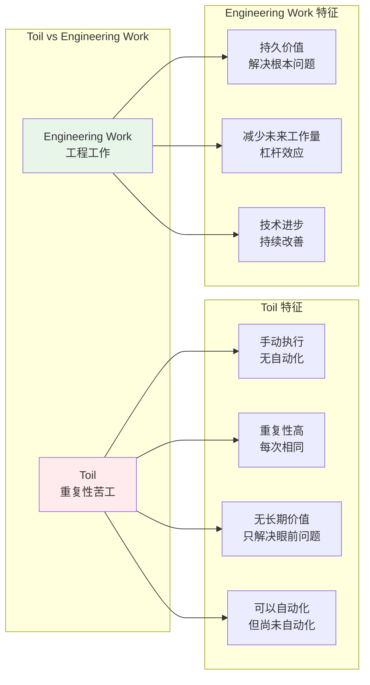

#<!-- chunk: Toil 识别清单 -->## Toil 识别清单

```yaml
# 平台团队 Toil 审计模板
toil_audit:
  
  process: "每季度进行一次 Toil 审计"
  
  categories:
    
    user_requests:
      questions:
        - "哪些支持工单每周重复出现超过 3 次？"
        - "哪些请求可以通过自助服务解决？"
        - "哪些操作需要平台团队手动批准？"
      examples:
        - name: "手动创建命名空间"
          frequency: "20次/周"
          time_per_occurrence: "15分钟"
          automation_candidate: true
          solution: "开发者门户自助创建"
        
        - name: "手动更新 DNS 记录"
          frequency: "10次/周"
          time_per_occurrence: "30分钟"
          automation_candidate: true
          solution: "External-DNS 自动化"
    
    operational_tasks:
      questions:
        - "哪些运维操作需要人工介入？"
        - "有没有每天/每周定期执行的脚本？"
        - "有多少告警需要人工判断是否真实？"
      examples:
        - name: "每周手动清理过期容器镜像"
          frequency: "每周一次"
          time_per_occurrence: "1小时"
          automation_candidate: true
          solution: "Harbor retention policy"
        
        - name: "每月手动轮转服务账号密钥"
          frequency: "每月"
          time_per_occurrence: "4小时"
          automation_candidate: true
          solution: "External Secrets + 自动轮转"
    
    deployment_tasks:
      questions:
        - "哪些部署步骤需要人工执行？"
        - "有没有手动的环境同步操作？"
        - "有多少生产部署需要人工审批且审批是橡皮图章？"
```

#<!-- chunk: Toil 削减实施案例 -->## Toil 削减实施案例

##<!-- chunk: 案例1：自动化证书管理 -->## 案例1：自动化证书管理

```yaml
# Before: 手动申请和更新 TLS 证书
# 频率: 15次/月，每次30分钟 = 7.5小时/月

# After: cert-manager 自动化
# 安装 cert-manager
apiVersion: cert-manager.io/v1
kind: ClusterIssuer
metadata:
  name: letsencrypt-production
spec:
  acme:
    server: https://acme-v02.api.letsencrypt.org/directory
    email: platform@company.com
    privateKeySecretRef:
      name: letsencrypt-production
    solvers:
      - http01:
          ingress:
            class: nginx
      - dns01:
          route53:
            region: us-east-1
            hostedZoneID: ZXXXXXXXXX

---
# 应用团队只需在 Ingress 上添加注解
apiVersion: networking.k8s.io/v1
kind: Ingress
metadata:
  name: my-service
  annotations:
    cert-manager.io/cluster-issuer: "letsencrypt-production"
spec:
  tls:
    - hosts:
        - my-service.company.io
      secretName: my-service-tls
  # ...

# ROI: 节省 7.5 小时/月，一次性实施投入 16 小时
# 回收期: 2.1 个月
```

##<!-- chunk: 案例2：自动化命名空间配置 -->## 案例2：自动化命名空间配置

```python
# Before: 平台工程师手动创建命名空间
# 每次需要: 创建NS、配置RBAC、设置ResourceQuota、配置NetworkPolicy
# 频率: 20次/月，每次30分钟 = 10小时/月

# After: Namespace Controller
# controller.py
import kopf
import kubernetes

@kopf.on.create('namespaces')
def on_namespace_create(name, labels, **kwargs):
    """当创建带有特定标签的命名空间时，自动配置"""
    
    team = labels.get('team')
    if not team:
        return  # 不处理没有 team 标签的命名空间
    
    k8s = kubernetes.client
    
    # 1. 创建团队 RBAC
    create_team_rbac(k8s, namespace=name, team=team)
    
    # 2. 应用默认 ResourceQuota
    tier = labels.get('tier', 'standard')
    apply_resource_quota(k8s, namespace=name, tier=tier)
    
    # 3. 应用默认 NetworkPolicy
    apply_network_policy(k8s, namespace=name)
    
    # 4. 创建默认 ConfigMap（团队信息）
    create_team_configmap(k8s, namespace=name, team=team)
    
    # 5. 在服务目录注册
    register_in_catalog(namespace=name, team=team)
    
    print(f"Namespace {name} configured successfully for team {team}")


def apply_resource_quota(k8s, namespace: str, tier: str):
    """根据 tier 应用资源配额"""
    quotas = {
        "starter": {
            "requests.cpu": "2",
            "requests.memory": "4Gi",
            "limits.cpu": "4",
            "limits.memory": "8Gi",
            "count/pods": "20",
        },
        "standard": {
            "requests.cpu": "10",
            "requests.memory": "20Gi",
            "limits.cpu": "20",
            "limits.memory": "40Gi",
            "count/pods": "100",
        },
        "premium": {
            "requests.cpu": "50",
            "requests.memory": "100Gi",
            "limits.cpu": "100",
            "limits.memory": "200Gi",
            "count/pods": "500",
        }
    }
    
    quota = quotas.get(tier, quotas["standard"])
    
    k8s.CoreV1Api().create_namespaced_resource_quota(
        namespace=namespace,
        body=kubernetes.client.V1ResourceQuota(
            metadata=kubernetes.client.V1ObjectMeta(
                name=f"{namespace}-quota"
            ),
            spec=kubernetes.client.V1ResourceQuotaSpec(
                hard=quota
            )
        )
    )
```

##<!-- chunk: Toil 削减追踪 -->## Toil 削减追踪

```python
# toil_tracker.py
# 追踪 Toil 削减的 ROI

class ToilReductionTracker:
    
    def calculate_roi(self, toil_item: dict) -> dict:
        """
        计算 Toil 削减的 ROI
        
        toil_item = {
            "name": "手动证书管理",
            "frequency_per_month": 15,
            "minutes_per_occurrence": 30,
            "implementation_hours": 16,
            "engineer_hourly_cost": 100  # USD
        }
        """
        monthly_minutes = toil_item["frequency_per_month"] * toil_item["minutes_per_occurrence"]
        monthly_hours = monthly_minutes / 60
        monthly_cost_saved = monthly_hours * toil_item["engineer_hourly_cost"]
        
        implementation_cost = toil_item["implementation_hours"] * toil_item["engineer_hourly_cost"]
        payback_months = implementation_cost / monthly_cost_saved
        
        annual_savings = monthly_cost_saved * 12
        
        return {
            "toil_hours_per_month": round(monthly_hours, 1),
            "monthly_cost_saved": f"${monthly_cost_saved:.0f}",
            "implementation_cost": f"${implementation_cost:.0f}",
            "payback_period_months": round(payback_months, 1),
            "annual_savings": f"${annual_savings:.0f}",
            "roi_1year": f"{((annual_savings - implementation_cost) / implementation_cost * 100):.0f}%"
        }
```

#<!-- chunk: Toil 目标与基准 -->## Toil 目标与基准

Google SRE 建议 Toil 占工作时间不超过 **50%**，理想情况下 **< 30%**。

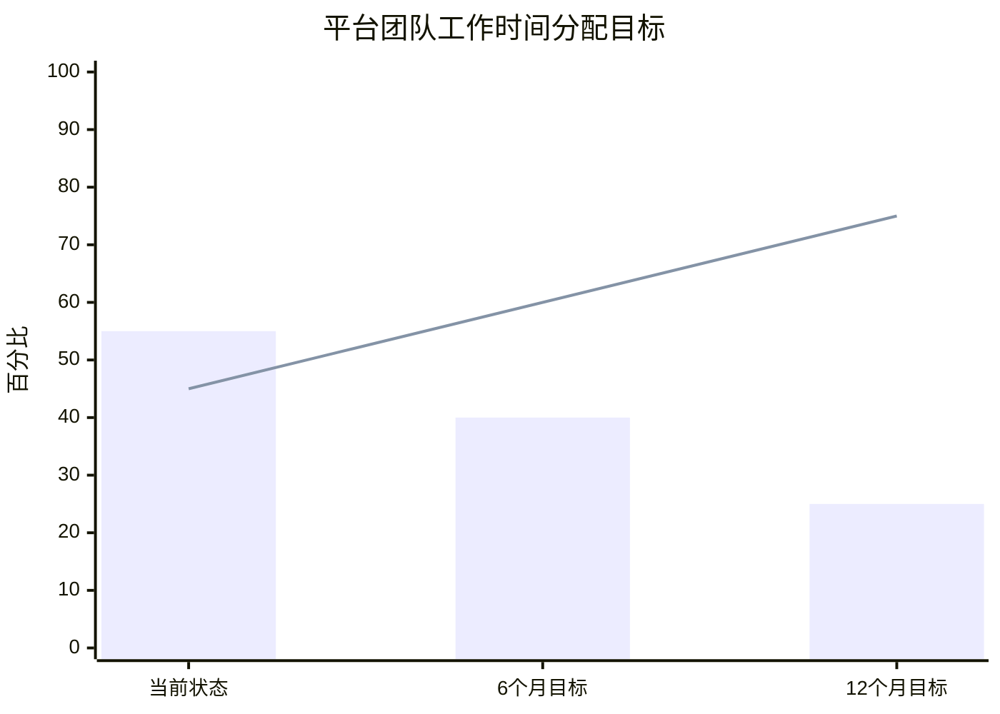

| 时间分配 | 当前状态 | 6个月目标 | 12个月目标 |
|---------|---------|----------|----------|
| **Toil（重复性工作）** | 55% | 40% | 25% |
| **Engineering Work（工程工作）** | 45% | 60% | 75% |

---

<!-- chunk: 平台运营节奏 -->## 平台运营节奏

#<!-- chunk: 运营节奏框架 -->## 运营节奏框架

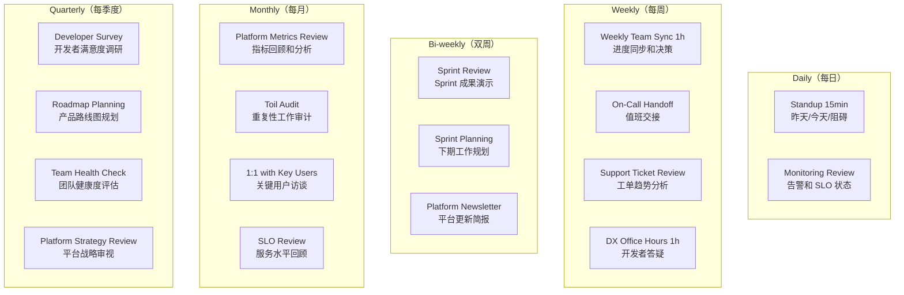

#<!-- chunk: Sprint 运作规范 -->## Sprint 运作规范

```yaml
# 平台团队 Sprint 规范
sprint_cadence:
  length: 2_weeks
  
  ceremonies:
    
    sprint_planning:
      duration: "2 hours"
      participants: "Full platform team"
      agenda:
        - "回顾上期 KPIs 和 OKRs 进展 (20min)"
        - "支持工单趋势分析 (15min)"
        - "Story 拆分和估算 (45min)"
        - "Sprint Goal 确认 (10min)"
        - "容量规划（含 On-call 和支持工时）(10min)"
      
      # 容量分配原则
      capacity_allocation:
        planned_features: "40-50%"  # 计划功能开发
        technical_debt: "20%"       # 技术债还清
        support_and_oncall: "20%"   # 支持和值班
        toil_reduction: "10-20%"    # Toil 自动化
    
    daily_standup:
      duration: "15 minutes"
      format:
        - "完成了什么（昨天）"
        - "计划做什么（今天）"
        - "有什么阻碍"
        - "是否有需要帮助的（Optional）"
    
    sprint_review:
      duration: "1 hour"
      participants: "Platform team + Key Stakeholders"
      agenda:
        - "Demo 本 Sprint 交付的功能 (30min)"
        - "指标回顾（DORA, Platform KPIs）(15min)"
        - "Stakeholder 反馈收集 (15min)"
    
    retrospective:
      duration: "1 hour"
      format: "Start/Stop/Continue 或 4L (Liked/Learned/Lacked/Longed-for)"
      # 核心：确保 Action Items 有跟进
      action_tracking: "Jira Ticket 追踪，下期 Sprint Review 前完成"
```

#<!-- chunk: 平台更新通讯模板 -->## 平台更新通讯模板

```markdown
# 🚀 Platform Update — Sprint 24 (Jan 15 - Jan 29, 2024)

<!-- chunk: 🎉 新功能发布 -->## 🎉 新功能发布
#<!-- chunk: PostgreSQL Promise v1.3.0 -->## PostgreSQL Promise v1.3.0
- **新增**: 支持 PostgreSQL 16
- **改进**: 备份恢复时间缩短 40%
- **修复**: 修复多可用区配置问题
- 文档: https://platform.internal/docs/postgresql

#<!-- chunk: 开发者门户：新增成本看板 -->## 开发者门户：新增成本看板
- 现在可以在开发者门户查看团队的云资源成本
- 支持按服务、环境、时间段筛选
- 文档: https://platform.internal/docs/cost-dashboard

<!-- chunk: 📊 本月数据 -->## 📊 本月数据
| 指标 | 本月 | 上月 | 变化 |
|------|------|------|------|
| 开发者满意度 NPS | +34 | +28 | ↑ +6 |
| 自助服务率 | 74% | 68% | ↑ +6% |
| CI P95 时长 | 12min | 18min | ↓ -33% |
| 平台 API 可用性 | 99.96% | 99.91% | ↑ |

<!-- chunk: ⚠️ 即将变更（需要关注） -->## ⚠️ 即将变更（需要关注）
#<!-- chunk: CI Runner 升级 (Feb 5) -->## CI Runner 升级 (Feb 5)
- GitHub Actions Runner 将升级到 Ubuntu 22.04
- **需要**: 检查是否依赖 Ubuntu 20.04 特有的包
- 受影响团队：@platform-announce 中已列出
- 迁移指南: https://platform.internal/docs/runner-upgrade

<!-- chunk: 🗺️ 下期预告 -->## 🗺️ 下期预告
- Kafka Promise 2.0.0：支持 Schema Registry
- 开发者门户：服务依赖图可视化
- Kubernetes 升级至 1.29

<!-- chunk: 💬 反馈 -->## 💬 反馈
有问题或建议？#platform-support 或 platform@company.com
```

---

<!-- chunk: 变更管理与沟通 -->## 变更管理与沟通

#<!-- chunk: 变更分级制度 -->## 变更分级制度

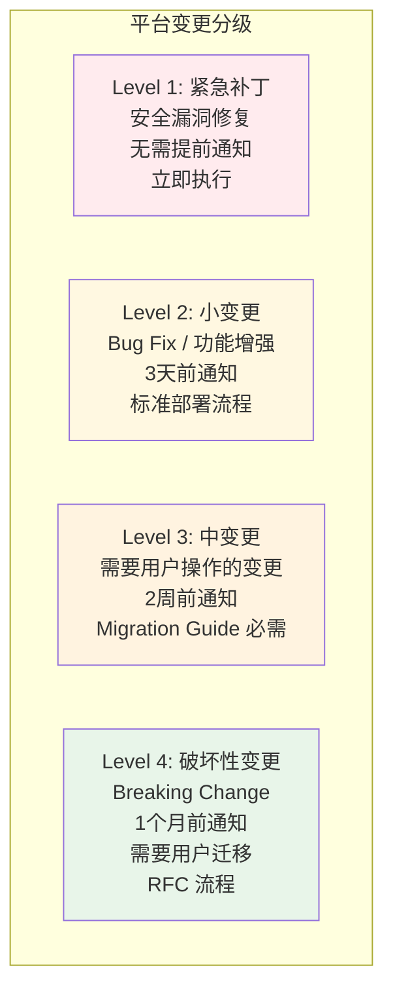

#<!-- chunk: RFC（Request for Comments）流程 -->## RFC（Request for Comments）流程

```markdown
# RFC 模板

<!-- chunk: RFC: [RFC-XXX] 平台变更标题 -->## RFC: [RFC-XXX] 平台变更标题

**状态**: Draft | Review | Accepted | Rejected | Implemented
**作者**: [姓名]
**日期**: [日期]
**目标受众**: 所有开发者 | 平台团队 | 特定团队

---

<!-- chunk: 背景（Why） -->## 背景（Why）
当前状态是什么，为什么需要改变？

<!-- chunk: 目标（Goals） -->## 目标（Goals）
- 这个 RFC 要实现什么？
- 明确列出成功标准

<!-- chunk: 非目标（Non-Goals） -->## 非目标（Non-Goals）
明确说明不在本次变更范围内的内容

<!-- chunk: 设计方案（Design） -->## 设计方案（Design）
详细描述技术方案

<!-- chunk: 对用户的影响（User Impact） -->## 对用户的影响（User Impact）
- 需要用户做什么？
- 不采取行动会发生什么？
- 时间表是什么？

<!-- chunk: 迁移路径（Migration Path） -->## 迁移路径（Migration Path）
1. Step 1: ...
2. Step 2: ...
3. Step 3: ...

<!-- chunk: 替代方案（Alternatives Considered） -->## 替代方案（Alternatives Considered）
其他考虑过的方案及其优劣对比

<!-- chunk: 开放问题（Open Questions） -->## 开放问题（Open Questions）
还未解决的问题

<!-- chunk: 反馈截止日期 -->## 反馈截止日期
YYYY-MM-DD

---
<!-- chunk: 反馈记录 -->## 反馈记录
| 评论者 | 评论 | 状态 |
|--------|------|------|
```

#<!-- chunk: 维护窗口沟通 -->## 维护窗口沟通

```yaml
# 维护通知模板
maintenance_notification:
  
  template: |
    <!-- chunk: 🔧 计划维护通知 -->## 🔧 计划维护通知
    
    **系统**: Kubernetes 控制平面
    **时间**: 2024-01-20 02:00-04:00 UTC (周六凌晨)
    **影响**: 
    - 约 5-10 分钟 API 短暂不可用
    - 运行中的 Pod 不受影响
    - 新部署将暂停约 10 分钟
    
    **原因**: Kubernetes 升级至 1.29.0
    **变更风险**: 低（已在 Staging 验证）
    
    **需要您做的**: 无特殊操作，但建议在维护窗口前后避免部署
    
    **状态页面**: https://status.platform.internal
    **问题联系**: #platform-support 或 platform-oncall PagerDuty
  
  channels:
    - "#platform-announcements"
    - "Engineering All-Hands Slack"
    - "Status Page"
  
  timing:
    advance_notice_days: 7
    reminder_hours_before: [24, 1]
```

---

<!-- chunk: 平台路线图规划 -->## 平台路线图规划

#<!-- chunk: 路线图优先级框架 -->## 路线图优先级框架

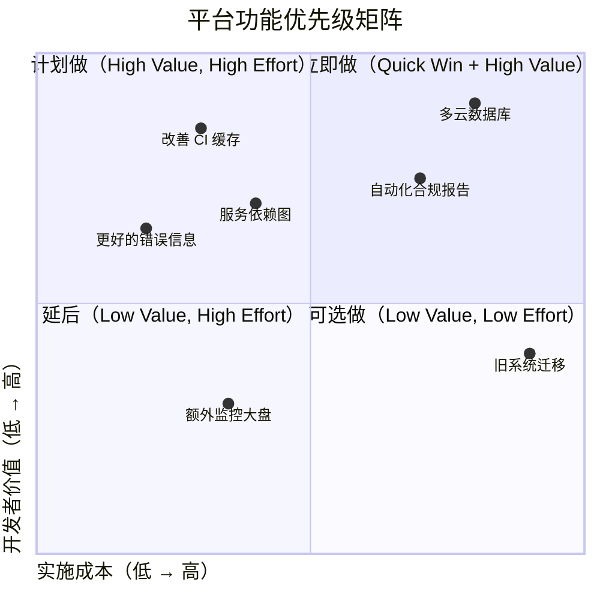

#<!-- chunk: 年度路线图模板 -->## 年度路线图模板

```yaml
# 平台工程年度路线图
roadmap_2024:
  
  theme: "降低认知负载，提升开发者自主权"
  
  quarters:
    Q1:
      goal: "建立基础度量体系和改善 CI/CD 性能"
      initiatives:
        - name: "DORA 指标仪表板"
          value: "量化平台价值，驱动改进"
          effort: medium
          status: in_progress
          owner: alice
        
        - name: "CI Pipeline 速度提升 50%"
          value: "每位工程师每天节省 30 分钟"
          effort: high
          kpi: "P95 CI 时长从 25 分钟→12 分钟"
          status: planned
          owner: bob
        
        - name: "开发者入职自动化"
          value: "TTFHW 从 10 天→3 天"
          effort: medium
          status: planned
          owner: carol
    
    Q2:
      goal: "扩展平台服务目录，提升自助服务能力"
      initiatives:
        - name: "Kafka Promise 2.0 + Schema Registry"
          value: "消息队列完全自助，无需平台介入"
          effort: high
          owner: dave
        
        - name: "开发者门户 v2.0"
          value: "月活用户率从 45%→80%"
          effort: very_high
          owner: dx_team
    
    Q3:
      goal: "安全合规自动化"
      initiatives:
        - name: "Policy as Code（OPA）全面推广"
          value: "安全合规检查延迟从 2 周→即时"
          effort: high
        
        - name: "自动化 SBOM 生成和漏洞扫描"
          value: "满足合规要求，减少安全审计工作"
          effort: medium
    
    Q4:
      goal: "平台可观测性和多集群扩展"
      initiatives:
        - name: "多集群统一可观测性"
          value: "跨集群统一视图，加速故障定位"
          effort: high
        
        - name: "平台自助扩容（Cluster Autoscaler 优化）"
          value: "高峰期无需人工干预扩容"
          effort: medium
```

---

<!-- chunk: 平台团队成熟度模型 -->## 平台团队成熟度模型

#<!-- chunk: 五级成熟度模型 -->## 五级成熟度模型

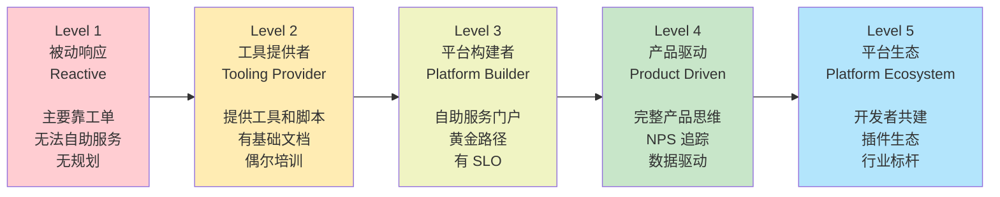

#<!-- chunk: 成熟度自评表 -->## 成熟度自评表

```yaml
# 平台团队成熟度自评
maturity_assessment:
  
  dimensions:
    
    service_delivery:
      level_1: "通过工单和 Slack 手动处理所有请求"
      level_2: "有文档和脚本，但仍需平台团队执行"
      level_3: "50-70% 的请求可以自助完成"
      level_4: "80%+ 请求可以自助，有开发者门户"
      level_5: "开发者自助+平台能力开放给外部合作伙伴"
    
    developer_experience:
      level_1: "无 DX 专注，开发者体验差"
      level_2: "有基础文档和入门指南"
      level_3: "黄金路径覆盖主要场景，TTFHW < 1 周"
      level_4: "定期 DX 调研，NPS > +30，持续改进"
      level_5: "业界标杆 DX，开发者自发贡献平台"
    
    operations:
      level_1: "无 SLO，无监控，靠人肉发现问题"
      level_2: "基础监控和告警，被动响应"
      level_3: "定义 SLO，有 On-call 流程，Runbook 完善"
      level_4: "SLO 驱动决策，Toil < 30%，自动化恢复"
      level_5: "预测性运维，自我修复，零 Toil 愿景"
    
    team_culture:
      level_1: "团队被动，视自己为运维者"
      level_2: "意识到产品化方向，但仍在转型"
      level_3: "产品思维确立，有 PM，有 Roadmap"
      level_4: "全团队认同 Platform as a Product"
      level_5: "引领行业最佳实践，对外分享"
    
    metrics_and_feedback:
      level_1: "无指标，完全凭感觉决策"
      level_2: "有基础 DORA 指标"
      level_3: "DORA + 平台 KPI + 季度调研"
      level_4: "全面 SPACE 框架，实时指标驾驶舱"
      level_5: "预测分析，先进的 DX 度量体系"
```

#<!-- chunk: 成熟度提升路径 -->## 成熟度提升路径

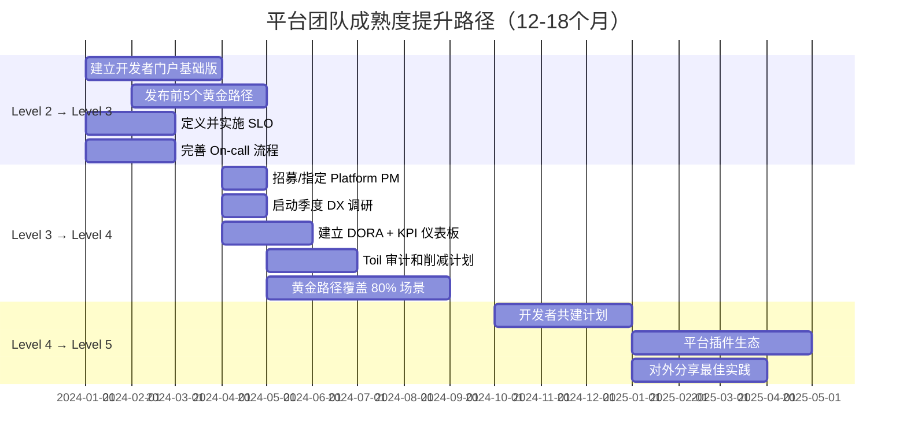

---

<!-- chunk: 总结 (Summary) -->## 总结 (Summary)

#<!-- chunk: 核心要点 -->## 核心要点

```mermaid
mindmap
  root((平台团队\n成功要素))
    团队定位
      Platform as a Product
      Developer as Customer
      有 PM 和 Roadmap
    交互模式
      以 X-as-a-Service 为主
      减少对 Collaboration 的依赖
      有清晰的 API 边界
    运营纪律
      有节奏的 Sprints
      SLO 驱动决策
      On-call 可持续
    持续改进
      Toil 系统性削减
      DX 指标追踪
      数据驱动优化
    文化建设
      开发者同理心
      透明和开放
      鼓励贡献
```

#<!-- chunk: 关键成功因素 -->## 关键成功因素

| 因素 | 描述 | 常见失败原因 |
|------|------|------------|
| **执行支持** | 管理层认可平台团队的长期投资价值 | 期望短期 ROI，过早放弃 |
| **产品思维** | 将平台视为产品，有 PM 和 Roadmap | 纯技术视角，忽视 DX |
| **开发者反馈** | 建立持续的开发者反馈循环 | 闭门造车，不了解真实痛点 |
| **团队稳定性** | 平台团队需要时间积累领域知识 | 频繁人员流动，平台知识流失 |
| **渐进式采用** | 提供价值让开发者自愿采用，而非强制 | 强制推广引发抵触 |

---

<!-- chunk: 参考资料 (References) -->## 参考资料 (References)

- [Team Topologies: Organizing Business and Technology Teams for Fast Flow](https://teamtopologies.com/book) by Matthew Skelton & Manuel Pais
- [CNCF Platform Engineering Maturity Model](https://tag-app-delivery.cncf.io/whitepapers/platform-eng-maturity-model/)
- [Platform Engineering Community](https://platformengineering.org/)
- [Google SRE Book: Eliminating Toil](https://sre.google/sre-book/eliminating-toil/)
- [Gartner: Platform Engineering - The Next Big Thing in Tech](https://www.gartner.com/en/articles/what-is-platform-engineering)
- [Internal Developer Platform (IDP) Building Blocks](https://internaldeveloperplatform.org/platform-tooling/)
- [ThoughtWorks Platform Engineering](https://www.thoughtworks.com/insights/blog/platform-engineering/platform-engineering-for-building-digital-capabilities)
- [Spotify's Platform Engineering Journey](https://engineering.atspotify.com)
- [Netflix Tech Blog: Platform Engineering](https://netflixtechblog.com)

---

<!-- chunk: Obsidian 相关文档 -->## Obsidian 相关文档

- [[domain-07-platform-engineering/MOC.md|domain-07-platform-engineering MOC]]
- [[domain-07-platform-engineering/README.md|Domain 36: 平台工程 (Platform Engineering)]]
- [[domain-07-platform-engineering/00-open-source-projects-index.md|Domain-36 平台工程 — 开源项目索引]]
- [[domain-07-platform-engineering/01-platform-engineering-overview.md|平台工程概述与成熟度模型]]
- [[domain-07-platform-engineering/02-idp-design-principles.md|内部开发者平台设计原则]]
- [[domain-07-platform-engineering/03-backstage-deployment.md|Backstage 部署与配置]]
- [[domain-07-platform-engineering/04-backstage-catalog-techdocs.md|Backstage 软件目录与 TechDocs]]
- [[domain-07-platform-engineering/05-backstage-scaffolder-templates.md|Backstage 脚手架与模板系统]]
- [[domain-07-platform-engineering/06-kratix-platform-as-code.md|Kratix 平台即代码 (Kratix Platform as Code)]]
- [[domain-07-platform-engineering/07-crossplane-platform-composition.md|Crossplane 平台组合 (Crossplane Platform Composition)]]
- [[domain-07-platform-engineering/08-golden-paths-design.md|Golden Paths 黄金路径设计 (Golden Paths Design Patterns)]]
- [[domain-07-platform-engineering/09-developer-experience-metrics.md|开发者体验度量 (Developer Experience Metrics)]]

## See Also

- [[domain-07-platform-engineering/08-golden-paths-design.md|08-golden-paths-design]]
- [[domain-07-platform-engineering/09-developer-experience-metrics.md|09-developer-experience-metrics]]
- [[domain-07-platform-engineering/11-vercel-frontend-deployment-platform.md|11-vercel-frontend-deployment-platform]]
- [[domain-07-platform-engineering/99-backstage-idp-guide.md|99-backstage-idp-guide]]
