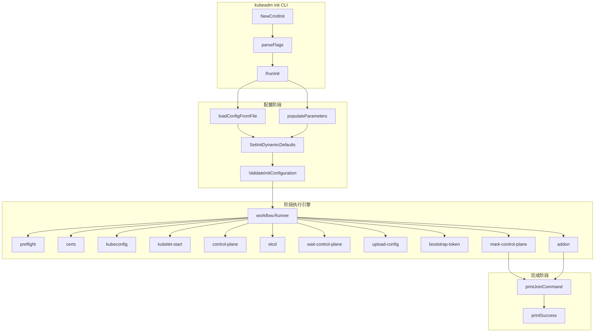

title: kubeadm init 集群初始化概览
description: '| `cmd/kubeadm/app/cmd/init.go` | L351-L500 | 配置验证和默认值填充 |'
category: functions
tags:
- k8s
- operations
- cluster-management
- etcd
- apiserver
- kubelet
- scheduler
- controller-manager
- calico
- coredns
last_updated: '2026-05-18'
difficulty: beginner
reading_level: beginner
audience:
- DevOps工程师
- Kubernetes初学者
- 云原生工程师
estimated_read_time: 5min
intent_queries:
- kubeadm init kubernetes cluster initialization workflow
- kubeadm init phases preflight certs kubeconfig etcd
- kubeadm init --pod-network-cidr --kubernetes-version
- kubeadm init dry-run phase control-plane
- kubeadm init configuration kubeadm-config.yaml
trigger_keywords:
- kubeadm init
- cluster initialization
- phases
- preflight
- certs
- kubeconfig
- control-plane
- etcd
- addon
- CoreDNS
- kube-proxy
- bootstrap-token
related_domains:
- domain-01-cluster-fundamentals
- domain-10-troubleshooting-diagnostics
related_topics:
- kubeadm
- cluster setup
- certificate
- node join
authors:
- name: KUDIG Team
  role: contributor
k8s_versions:
- '1.28'
- '1.29'
- '1.30'
- '1.31'
- '1.32'
---

# kubeadm init 集群初始化概览

## 函数/流程签名

```go
func NewCmdInit(out io.Writer, initFlags *initFlags) *cobra.Command
func RunInit(cmd *cobra.Command, args []string, initOptions *InitOptions) error
func NewInitOptions() *InitOptions
func (o *InitOptions) Validate(cmd *cobra.Command) error
func (o *InitOptions) Run() error
func getVariantVersion(kubernetesVersion string, imageRepository string) (string, error)
```

## 源码位置

| 文件路径 | 行号范围 | 说明 |
|---------|---------|------|
| `cmd/kubeadm/app/cmd/init.go` | L45-L130 | `NewCmdInit` 命令注册 |
| `cmd/kubeadm/app/cmd/init.go` | L131-L350 | `RunInit` 主入口函数 |
| `cmd/kubeadm/app/cmd/init.go` | L351-L500 | 配置验证和默认值填充 |
| `cmd/kubeadm/app/cmd/phases/init/data/data.go` | L30-L200 | InitData 数据结构 |
| `cmd/kubeadm/app/cmd/phases/init/waitcontrolplane.go` | L25-L120 | 等待控制面就绪 |
| `cmd/kubeadm/app/cmd/phases/workflow/runner.go` | L40-L200 | 阶段执行引擎 |

## 参数说明

### InitOptions 参数

| 参数名 | 类型 | 说明 | 验证规则 |
|--------|------|------|---------|
| `cfgPath` | `string` | 配置文件路径 | 可选，与 CLI 参数互斥 |
| `kubernetesVersion` | `string` | Kubernetes 版本 | 必须是有效 semver (如 v1.28.0) |
| `controlPlaneEndpoint` | `string` | API Server 负载均衡地址 | 格式: host:port |
| `apiserverAdvertiseAddress` | `string` | API Server 广播地址 | 有效 IPv4/IPv6 地址 |
| `apiserverBindPort` | `int32` | API Server 监听端口 | 范围 1-65535，默认 6443 |
| `certificatesDir` | `string` | 证书存储目录 | 默认 /etc/kubernetes/pki |
| `criSocket` | `string` | CRI 运行时 socket 路径 | 默认自动检测 |
| `dryRun` | `bool` | 只打印不执行 | 默认 false |
| `featureGates` | `map[string]bool` | 特性门控 | 键必须是已知的 feature gate |
| `ignorePreflightErrors` | `[]string` | 忽略的预检错误 | 已知的错误代码列表 |
| `imageRepository` | `string` | 镜像仓库地址 | 默认 registry.k8s.io |
| `nodeName` | `string` | 节点名称 | 默认使用 hostname |
| `podNetworkCidr` | `string` | Pod 网络 CIDR | 有效 CIDR (如 10.244.0.0/16) |
| `serviceCidr` | `string` | Service 网络 CIDR | 有效 CIDR (默认 10.96.0.0/12) |
| `serviceDnsDomain` | `string` | 集群 DNS 域名 | 默认 cluster.local |
| `skipPhases` | `[]string` | 跳过的阶段列表 | 已知的 phase 名称 |
| `skipCertificateKeyPrint` | `bool` | 不打印证书密钥 | 默认 false |

## 返回值

| 返回值 | 类型 | 说明 |
|--------|------|------|
| `error` | `error` | 初始化过程中的错误 |
| `InitData` | `*struct` | 初始化上下文数据，传递给所有 phase |

## 调用链



## 源码分析

### NewCmdInit 命令注册 (init.go)

```go
// cmd/kubeadm/app/cmd/init.go
// NewCmdInit 创建 kubeadm init 命令
func NewCmdInit(out io.Writer, initFlags *initFlags) *cobra.Command {
    // 1. 创建 cobra 命令
    initOptions := NewInitOptions()
    cmd := &cobra.Command{
        Use:   "init",
        Short: "Run this command in order to set up the Kubernetes control plane",
        RunE: func(cmd *cobra.Command, args []string) error {
            // 2. 加载配置
            //    支持从文件或命令行参数
            if initOptions.cfgPath != "" {
                // 从 YAML 文件加载 InitConfiguration
                cfg, err := config.LoadFromFile(initOptions.cfgPath)
                if err != nil {
                    return fmt.Errorf("failed to load config: %w", err)
                }
                initOptions.cfg = cfg
            }

            // 3. 填充默认值
            //    为未指定的参数设置合理默认值
            if err := initOptions.SetDefaults(); err != nil {
                return err
            }

            // 4. 验证配置
            if err := initOptions.Validate(); err != nil {
                return err
            }

            // 5. 执行 init
            return initOptions.Run()
        },
    }

    // 6. 注册命令行参数
    addInitFlags(cmd.Flags(), initOptions)
    return cmd
}
```

### RunInit 主入口 (init.go)

```go
// cmd/kubeadm/app/cmd/init.go
// RunInit 执行 kubeadm init 的核心逻辑
func (o *InitOptions) Run() error {
    // 1. 创建初始化数据上下文
    //    包含所有 phase 共享的数据
    data, err := NewInitData(o.cfg, o.dryRun, o.skipPhases)
    if err != nil {
        return fmt.Errorf("failed to create init data: %w", err)
    }

    // 2. 注册所有 init phase
    //    每个 phase 是一个独立的执行单元
    runner := workflow.NewRunner()
    runner.AppendPhase(preflightPhase())        // 预检
    runner.AppendPhase(certsPhase())            // 证书生成
    runner.AppendPhase(kubeconfigPhase())       // kubeconfig 生成
    runner.AppendPhase(kubeletStartPhase())     // kubelet 启动
    runner.AppendPhase(controlPlanePhase())     // 控制面 static Pod
    runner.AppendPhase(etcdPhase())             // etcd 静态 Pod
    runner.AppendPhase(waitControlPlanePhase()) // 等待控制面就绪
    runner.AppendPhase(uploadConfigPhase())     // 上传配置到 ConfigMap
    runner.AppendPhase(bootstrapTokenPhase())   // 创建 Bootstrap Token
    runner.AppendPhase(markControlPlanePhase()) // 标记 control-plane
    runner.AppendPhase(addonPhase())            // 安装 CoreDNS/kube-proxy

    // 3. 设置环境变量和阶段过滤
    runner.SetData(data)
    runner.SkipPhase(o.skipPhases)

    // 4. 按顺序执行所有 phase
    //    如果某个 phase 失败，整个 init 终止
    if err := runner.Run(); err != nil {
        return fmt.Errorf("init phase failed: %w", err)
    }

    // 5. 打印成功信息和 join 命令
    printSuccess(data.OutDir(), data.Cfg())
    printJoinCommand(data)

    return nil
}
```

### InitData 数据结构 (data.go)

```go
// cmd/kubeadm/app/cmd/phases/init/data/data.go
// InitData 封装了 init 过程中所有 phase 共享的数据
type InitData struct {
    cfg                  *kubeadmapi.InitConfiguration
    clusterCfg           *kubeadmapi.ClusterConfiguration
    dryRun               bool
    certificatesDir      string
    skipPhases           []string

    // 运行时数据
    client               kubernetes.Interface  // API Server 客户端
    inputReader          io.Reader             // 用户输入
    outputWriter         io.Writer             // 标准输出
    ignorePreflightErrors []string

    // 组件镜像列表
    images               []string
}

// NewInitData 创建 InitData 实例
func NewInitData(
    cfg *kubeadmapi.InitConfiguration,
    dryRun bool,
    skipPhases []string,
) (*InitData, error) {
    // 1. 深拷贝配置 (防止修改原始配置)
    cfgCopy := cfg.DeepCopy()

    // 2. 设置动态默认值
    //    - KubernetesVersion: 从 release 获取最新版本
    //    - AdvertiseAddress: 自动检测默认网卡 IP
    //    - CertificatesDir: 默认 /etc/kubernetes/pki
    //    - CRISocket: 自动检测 containerd/crio socket
    if err := SetInitDynamicDefaults(cfgCopy); err != nil {
        return nil, err
    }

    // 3. 计算需要的组件镜像列表
    images := []string{
        fmt.Sprintf("%s/kube-apiserver:%s",
            cfgCopy.ClusterConfiguration.ImageRepository,
            cfgCopy.ClusterConfiguration.KubernetesVersion),
        fmt.Sprintf("%s/kube-controller-manager:%s",
            cfgCopy.ClusterConfiguration.ImageRepository,
            cfgCopy.ClusterConfiguration.KubernetesVersion),
        fmt.Sprintf("%s/kube-scheduler:%s",
            cfgCopy.ClusterConfiguration.ImageRepository,
            cfgCopy.ClusterConfiguration.KubernetesVersion),
        fmt.Sprintf("%s/kube-proxy:%s",
            cfgCopy.ClusterConfiguration.ImageRepository,
            cfgCopy.ClusterConfiguration.KubernetesVersion),
        fmt.Sprintf("%s/pause:%s",
            cfgCopy.ClusterConfiguration.ImageRepository,
            "3.9"),
        fmt.Sprintf("%s/etcd:%s",
            cfgCopy.ClusterConfiguration.Etcd.Local.ImageRepository,
            cfgCopy.ClusterConfiguration.Etcd.Local.ImageTag),
    }

    return &InitData{
        cfg:        cfgCopy,
        dryRun:     dryRun,
        skipPhases: skipPhases,
        images:     images,
    }, nil
}
```

### 阶段执行引擎 (runner.go)

```go
// cmd/kubeadm/app/cmd/phases/workflow/runner.go
// Runner 管理和执行 init 的各个阶段
type Runner struct {
    phases      []*Phase    // 有序的阶段列表
    data        RunData     // 共享数据
    skipped     map[string]bool  // 跳过的阶段
}

// Phase 表示 init 的一个执行阶段
type Phase struct {
    Name        string      // 阶段名称 (如 "certs")
    Description string      // 阶段描述
    Aliases     []string    // 阶段别名
    Run         func(RunData) error  // 执行函数
    RunIf       func(RunData) bool   // 条件执行
    SubPhases   []*Phase             // 子阶段
}

// Run 按顺序执行所有阶段
func (r *Runner) Run() error {
    // 1. 遍历所有注册的 phase
    for _, phase := range r.phases {
        // 2. 检查是否跳过
        if r.skipped[phase.Name] {
            fmt.Fprintf(os.Stdout, "[skip] Skipping phase: %s\n", phase.Name)
            continue
        }

        // 3. 检查条件执行
        if phase.RunIf != nil && !phase.RunIf(r.data) {
            continue
        }

        // 4. 打印阶段标题
        fmt.Fprintf(os.Stdout, "\n[%s] %s\n", phase.Name, phase.Description)

        // 5. 如果有子阶段，递归执行
        if len(phase.SubPhases) > 0 {
            for _, sub := range phase.SubPhases {
                if err := sub.Run(r.data); err != nil {
                    return fmt.Errorf("phase %s/%s failed: %w",
                        phase.Name, sub.Name, err)
                }
            }
        } else {
            // 6. 执行阶段函数
            if err := phase.Run(r.data); err != nil {
                return fmt.Errorf("phase %s failed: %w",
                    phase.Name, err)
            }
        }
    }

    return nil
}
```

## 执行流程

### kubeadm init 完整阶段

> ⚠️ **🟡 中危变更** — 变更集群资源状态，建议先 --dry-run 或 diff 确认
> - `kubectl label/annotate`：改元数据可能影响选择器/控制器

```
步骤 1:  [preflight]      预检
    → 检查系统要求 (swap, ports, kernel, CRI)
    → 检查端口占用 (6443, 2379, 2380, 10250, 10259, 10257)
    → 检查 CRI 运行时可用
    ↓
步骤 2:  [certs]          证书生成
    → ca.crt/ca.key (根证书, 10年有效)
    → apiserver.crt/apiserver.key (含 SAN)
    → apiserver-kubelet-client.crt/key
    → front-proxy-ca.crt/key
    → front-proxy-client.crt/key
    → sa.pub/sa.key (ServiceAccount 签名)
    → etcd/ca.crt, etcd/server.crt/key
    → etcd/peer.crt/key, etcd/healthcheck-client.crt/key
    ↓
步骤 3:  [kubeconfig]     kubeconfig 生成
    → admin.conf (cluster-admin 权限)
    → kubelet.conf (节点权限)
    → controller-manager.conf
    → scheduler.conf
    ↓
步骤 4:  [kubelet-start]  kubelet 启动
    → 写入 /var/lib/kubelet/config.yaml
    → 写入 /etc/kubernetes/bootstrap-kubelet.conf
    → 写入 systemd drop-in
    → systemctl enable --now kubelet
    ↓
步骤 5:  [control-plane]  控制面 static Pod
    → /etc/kubernetes/manifests/kube-apiserver.yaml
    → /etc/kubernetes/manifests/kube-controller-manager.yaml
    → /etc/kubernetes/manifests/kube-scheduler.yaml
    → kubelet 检测 manifest 变化，启动容器
    ↓
步骤 6:  [etcd]           etcd 静态 Pod
    → /etc/kubernetes/manifests/etcd.yaml
    → kubelet 启动 etcd 容器
    → 等待 etcd 集群健康
    ↓
步骤 7:  [wait-control-plane] 等待就绪
    → 轮询 /healthz (最多 5 分钟)
    → 验证 API Server 可用
    ↓
步骤 8:  [upload-config]  上传配置
    → 创建 ConfigMap: kube-system/kubeadm-config
    → 存储 ClusterConfiguration
    ↓
步骤 9:  [bootstrap-token] 创建 Bootstrap Token
    → 生成 token (格式: xxxxxx.yyyyyyyyyyyyyyyy)
    → 创建 BootstrapToken 对象
    → 设置 RBAC 规则 (允许节点 join)
    ↓
步骤 10: [mark-control-plane] 标记节点
    → kubectl label node node-role.kubernetes.io/control-plane=
    → kubectl taint node node-role.kubernetes.io/control-plane:NoSchedule
    ↓
步骤 11: [addon]          插件安装
    → 部署 CoreDNS Deployment + Service
    → 部署 kube-proxy DaemonSet
    ↓
步骤 12: 完成
    → 打印 join 命令
    → 打印后续步骤 (安装 CNI 等)
```

## 使用场景

### 场景 1: 标准单节点集群初始化

> ⚠️ **🟡 中危变更** — 变更集群资源状态，建议先 --dry-run 或 diff 确认
> - `kubectl apply/create/replace`：创建/变更集群资源

```bash
# 初始化集群
kubeadm init \
  --apiserver-advertise-address=192.168.1.10 \
  --pod-network-cidr=10.244.0.0/16 \
  --service-cidr=10.96.0.0/12 \
  --kubernetes-version=v1.28.0

# 配置 kubectl
mkdir -p $HOME/.kube
cp -i /etc/kubernetes/admin.conf $HOME/.kube/config
chown $(id -u):$(id -g) $HOME/.kube/config

# 安装 CNI (Calico)
kubectl apply -f https://raw.githubusercontent.com/projectcalico/calico/v3.26.0/manifests/calico.yaml

# 验证
kubectl get nodes
kubectl get pods -A
```

### 场景 2: 使用配置文件初始化

```yaml
# kubeadm-config.yaml
apiVersion: kubeadm.k8s.io/v1beta3
kind: InitConfiguration
nodeRegistration:
  criSocket: unix:///var/run/containerd/containerd.sock
  name: master-1
  taints:
  - effect: NoSchedule
    key: node-role.kubernetes.io/control-plane
  kubeletExtraArgs:
    cgroup-driver: "systemd"
localAPIEndpoint:
  advertiseAddress: "192.168.1.10"
  bindPort: 6443
---
apiVersion: kubeadm.k8s.io/v1beta3
kind: ClusterConfiguration
kubernetesVersion: "v1.28.0"
imageRepository: "registry.k8s.io"
controlPlaneEndpoint: "lb.example.com:6443"
networking:
  podSubnet: "10.244.0.0/16"
  serviceSubnet: "10.96.0.0/12"
  dnsDomain: "cluster.local"
apiServer:
  extraArgs:
    authorization-mode: "Node,RBAC"
    service-node-port-range: "30000-32767"

    enable-admission-plugins: "NodeRestriction,PodSecurityPolicy"
  certSANs:
  - "master-1"
  - "192.168.1.10"
  - "lb.example.com"
  - "10.96.0.1"
controllerManager:
  extraArgs:
    node-cidr-mask-size: "24"
    cluster-signing-duration: "8760h"
scheduler:
  extraArgs:
    bind-address: "0.0.0.0"
etcd:
  local:
    dataDir: "/var/lib/etcd"
    imageRepository: "registry.k8s.io"
    imageTag: "3.5.9-0"
    extraArgs:
      heartbeat-interval: "500"
      election-timeout: "5000"
---
apiVersion: kubelet.config.k8s.io/v1beta1
kind: KubeletConfiguration
cgroupDriver: systemd
clusterDNS:
- 10.96.0.10
clusterDomain: cluster.local
failSwapOn: true
```

```bash
kubeadm init --config=kubeadm-config.yaml
```

### 场景 3: 离线环境初始化

```bash
# 1. 导出镜像列表
kubeadm config images list --kubernetes-version=v1.28.0 > images.txt
# registry.k8s.io/kube-apiserver:v1.28.0
# registry.k8s.io/kube-controller-manager:v1.28.0
# registry.k8s.io/kube-scheduler:v1.28.0
# registry.k8s.io/kube-proxy:v1.28.0
# registry.k8s.io/pause:3.9
# registry.k8s.io/etcd:3.5.9-0
# registry.k8s.io/coredns/coredns:v1.10.1

# 2. 拉取并保存镜像 (在有网络的机器上)
while read img; do
  ctr -n=k8s.io images pull "$img"
done < images.txt
ctr -n=k8s.io images export k8s-images.tar $(cat images.txt)

# 3. 传输到离线环境
scp k8s-images.tar root@offline-node:/tmp/

# 4. 在离线环境导入
ctr -n=k8s.io images import /tmp/k8s-images.tar

# 5. 初始化 (跳过镜像拉取)
kubeadm init \
  --kubernetes-version=v1.28.0 \
  --image-repository=registry.k8s.io \
  --skip-phases=preflight
```

### 场景 4: 高可用集群初始化

```bash
# 第一个控制面节点
kubeadm init \
  --control-plane-endpoint="lb.example.com:6443" \
  --upload-certs \
  --certificate-key=$(openssl rand -hex 32) \
  --pod-network-cidr=10.244.0.0/16 \
  --kubernetes-version=v1.28.0

# 输出:
# You can now join any number of control-plane nodes by running:
# kubeadm join lb.example.com:6443 \
#   --token abc123.def456 \
#   --discovery-token-ca-cert-hash sha256:xxx \
#   --control-plane \
#   --certificate-key xxx

# 其他控制面节点加入
kubeadm join lb.example.com:6443 \
  --token abc123.def456 \
  --discovery-token-ca-cert-hash sha256:xxx \
  --control-plane \
  --certificate-key xxx
```

## 配置示例

### 自定义 API Server 参数

```yaml
# custom-apiserver.yaml
apiVersion: kubeadm.k8s.io/v1beta3
kind: ClusterConfiguration
kubernetesVersion: "v1.28.0"
apiServer:
  extraArgs:
    authorization-mode: "Node,RBAC"
    audit-log-path: "/var/log/kubernetes/audit.log"
    audit-log-maxage: "30"
    audit-log-maxbackup: "10"
    audit-log-maxsize: "100"
    audit-policy-file: "/etc/kubernetes/audit-policy.yaml"
    enable-admission-plugins: "NodeRestriction,PodSecurity"
    service-node-port-range: "30000-32767"
    max-connection-bytes-per-sec: "0"
    request-timeout: "60s"
    profiling: "false"
  extraVolumes:
  - name: audit-log
    hostPath: /var/log/kubernetes
    mountPath: /var/log/kubernetes
    pathType: DirectoryOrCreate
  - name: audit-policy
    hostPath: /etc/kubernetes/audit-policy.yaml
    mountPath: /etc/kubernetes/audit-policy.yaml
    readOnly: true
    pathType: File
  certSANs:
  - "k8s-api.example.com"
  - "192.168.1.100"
  - "10.96.0.1"
```

### 自定义 Controller Manager 参数

```yaml
apiVersion: kubeadm.k8s.io/v1beta3
kind: ClusterConfiguration
controllerManager:
  extraArgs:
    node-cidr-mask-size: "24"
    cluster-signing-duration: "8760h"
    horizontal-pod-autoscaler-sync-period: "15s"
    horizontal-pod-autoscaler-downscale-stabilization: "5m0s"
    deployment-controller-sync-period: "30s"
    namespace-sync-period: "5m0s"
    pvclaimbinder-sync-period: "15s"
    terminated-pod-gc-threshold: "12500"
    profiling: "false"
```

## 实战示例

### 标准 init 输出

> ⚠️ **🟡 中危变更** — 变更集群资源状态，建议先 --dry-run 或 diff 确认
> - `kubectl apply/create/replace`：创建/变更集群资源

```bash
kubeadm init --pod-network-cidr=10.244.0.0/16
# [init] Using Kubernetes version: v1.28.0
# [preflight] Running pre-flight checks
# [preflight] Pulling images required for setting up a Kubernetes cluster
# [preflight] This might take a minute or two, depending on the speed of your internet connection
# [preflight] You can also perform this action beforehand using 'kubeadm config images pull'
# [certs] Using certificateDir folder "/etc/kubernetes/pki"
# [certs] Generating "ca" certificate and key
# [certs] Generating "apiserver" certificate and key
# [certs] apiserver serving cert is signed for DNS names [master kubernetes kubernetes.default kubernetes.default.svc kubernetes.default.svc.cluster.local] and IPs [10.96.0.1 192.168.1.10]
# [certs] Generating "apiserver-kubelet-client" certificate and key
# [certs] Generating "front-proxy-ca" certificate and key
# [certs] Generating "front-proxy-client" certificate and key
# [certs] Generating "etcd/ca" certificate and key
# [certs] Generating "etcd/server" certificate and key
# [certs] etcd/server serving cert is signed for DNS names [localhost master] and IPs [127.0.0.1 ::1 192.168.1.10]
# [certs] Generating "etcd/peer" certificate and key
# [certs] etcd/peer serving cert is signed for DNS names [localhost master] and IPs [127.0.0.1 ::1 192.168.1.10]
# [certs] Generating "etcd/healthcheck-client" certificate and key
# [certs] Generating "apiserver-etcd-client" certificate and key
# [certs] Generating "sa" key and public key
# [kubeconfig] Using kubeconfig folder "/etc/kubernetes"
# [kubeconfig] Writing "admin.conf" kubeconfig file
# [kubeconfig] Writing "kubelet.conf" kubeconfig file
# [kubeconfig] Writing "controller-manager.conf" kubeconfig file
# [kubeconfig] Writing "scheduler.conf" kubeconfig file
# [etcd] Creating static Pod manifest for local etcd in "/etc/kubernetes/manifests"
# [control-plane] Using manifest folder "/etc/kubernetes/manifests"
# [control-plane] Creating static Pod manifest for "kube-apiserver"
# [control-plane] Creating static Pod manifest for "kube-controller-manager"
# [control-plane] Creating static Pod manifest for "kube-scheduler"
# [kubelet-start] Writing kubelet environment file with flags to file "/var/lib/kubelet/kubeadm-flags.env"
# [kubelet-start] Writing kubelet configuration to file "/var/lib/kubelet/config.yaml"
# [kubelet-start] Starting the kubelet
# [wait-control-plane] Waiting for the control plane to become ready
# [upload-config] Storing the configuration used in ConfigMap "kubeadm-config" in the "kube-system" Namespace
# [kubelet] Creating a ConfigMap "kubelet-config" in namespace kube-system with the configuration for the kubelets in the cluster
# [upload-certs] Storing the certificates in Secret "kubeadm-certs" in the "kube-system" Namespace
# [mark-control-plane] Marking the node master as control-plane by adding the labels: [node-role.kubernetes.io/control-plane node-role.kubernetes.io/master]
# [mark-control-plane] Marking the node master as control-plane by adding the taints [node-role.kubernetes.io/control-plane:NoSchedule]
#
# Your Kubernetes control-plane has initialized successfully!
#
# To start using your cluster, you need to run the following as a regular user:
#
#   mkdir -p $HOME/.kube
#   sudo cp -i /etc/kubernetes/admin.conf $HOME/.kube/config
#   sudo chown $(id -u):$(id -g) $HOME/.kube/config
#
# You should now deploy a pod network to the cluster.
# Run "kubectl apply -f [podnetwork].yaml" with one of the options listed at:
#   https://kubernetes.io/docs/concepts/cluster-administration/addons/
#
# Then you can join any number of worker nodes by running the following on each as root:
#
# kubeadm join 192.168.1.10:6443 --token abc123.def456 \
#     --discovery-token-ca-cert-hash sha256:1234567890abcdef...
```

### 分阶段执行

```bash
# 分阶段调试 init
kubeadm init phase preflight --config=kubeadm-config.yaml
kubeadm init phase certs all --config=kubeadm-config.yaml
kubeadm init phase kubeconfig all --config=kubeadm-config.yaml
kubeadm init phase kubelet-start --config=kubeadm-config.yaml
kubeadm init phase etcd local --config=kubeadm-config.yaml
kubeadm init phase control-plane all --config=kubeadm-config.yaml
kubeadm init phase upload-config all --config=kubeadm-config.yaml
kubeadm init phase bootstrap-token --config=kubeadm-config.yaml
kubeadm init phase mark-control-plane --config=kubeadm-config.yaml
kubeadm init phase addon all --config=kubeadm-config.yaml

```

## 常见错误

| 错误 | 原因 | 解决方案 |
|------|------|---------|
| `[ERROR Swap]: running with swap on is not supported` | 开启了 swap | `swapoff -a` 并注释 `/etc/fstab` 中的 swap 行 |
| `[ERROR Port-6443]: Port 6443 is in use` | API Server 端口被占用 | 释放端口: `lsof -i :6443` 或更换端口 |
| `[ERROR CRI]: container runtime is not ready` | CRI 运行时未安装或未启动 | 安装并启动 containerd |
| `[ERROR FileContent--proc-sys-net-ipv4-ip_forward]` | 未开启 IP 转发 | `sysctl -w net.ipv4.ip_forward=1` |
| `[ERROR DirAvailable--var-lib-etcd]: /var/lib/etcd is not empty` | etcd 数据目录不为空 | 清理: `rm -rf /var/lib/etcd/*` |
| `[ERROR Service-Docker]: docker service is not enabled` | Docker 服务问题 | 改用 containerd 作为 CRI |
| `failed to pull image` | 镜像拉取失败 | 预拉取: `kubeadm config images pull` |
| `timed out waiting for the condition` | 控制面启动超时 | 检查 kubelet 和容器日志 |
| `certificate SAN error` | 证书 SAN 不包含地址 | 添加 `--apiserver-cert-extra-sans` |
| `cluster config already exists` | 之前 init 未清理 | `kubeadm reset` 后重试 |

## 相关函数

- [预检流程](02-preflight.md) — init 的第一个阶段
- [证书管理](03-certs.md) — certs phase 详细分析
- [控制面组件](05-control-plane.md) — static Pod 创建
- [etcd 管理](07-etcd.md) — etcd 静态 Pod
- [节点加入](06-join.md) — worker 节点 join 流程
- [初始化阶段](17-init-phases.md) — phase 详细说明
- [CRI 运行时](18-cri-runtime.md) — CRI 预检和容器运行时
- [高级配置](11-advanced.md) — InitConfiguration 详解

## Related

- [[reference|#reference Hub]] — tag hub

- [[deep-dive|#deep-dive Hub]] — tag hub

- [[domain-17-system-foundation/topic-cheat-sheet/go.md|go]]
- [[domain-17-system-foundation/topic-cheat-sheet/k8s.md|k8s]]
- [[domain-17-system-foundation/topic-cheat-sheet/docker.md|docker]]
- [[entities/kubernetes.md|kubernetes]]
- [[entities/coredns.md|coredns]]

```