title: 资源管理与配额控制 (Resource Management)
description: '# 资源管理与配额控制 (Resource Management)'
category: functions
tags:
- k8s
- operations
- cluster-management
- etcd
- kubelet
- job
- rbac
- operator
- rag
last_updated: '2026-05-18'
difficulty: advanced
reading_level: advanced
audience:
- DevOps工程师
- Kubernetes管理员
- 应用开发者
estimated_read_time: 5min
intent_queries:
- Kubernetes ResourceQuota LimitRange resource management
- Kubernetes namespace resource quota CPU memory pods
- Kubernetes LimitRange container default request limit
- Kubernetes resource quota admission controller
- Kubernetes node resource allocatable system reserved
trigger_keywords:
- ResourceQuota
- LimitRange
- resource management
- namespace
- quota
- CPU
- memory
- pods
- admission
- default
- limit
- request
- allocatable
- system reserved
related_domains:
- domain-4-workload-management
- domain-10-troubleshooting-diagnostics
related_topics:
- namespace
- resource
- quota
- limit
- scheduler
- HPA
authors:
- name: KUDIG Team
  role: contributor
k8s_versions:
- '1.28'
- '1.29'
- '1.30'
- '1.31'
- '1.32'
---

# 资源管理与配额控制 (Resource Management)

## 函数/流程签名

```go
func NewResourceQuotaController(kubeClient clientset.Interface) *ResourceQuotaController
func (r *ResourceQuotaController) syncResourceQuota(key string) error
func CalculateUsage(namespaces []string, quota *v1.ResourceQuota) (v1.ResourceList, error)
func ValidateResourceQuota(quota *v1.ResourceQuota) field.ErrorList
func NewLimitRanger(admission admission.Interface) admission.Interface
func (l *LimitRanger) Admit(attrs admission.Attributes) error
```

## 源码位置

| 文件路径 | 行号范围 | 说明 |
|---------|---------|------|
| `pkg/controller/resourcequota/resource_quota_controller.go` | L50-L400 | ResourceQuota 控制器主循环 |
| `pkg/controller/resourcequota/resource_quota_controller.go` | L401-L600 | 配额计算和状态同步 |
| `pkg/quota/v1/evaluator/` | - | 各资源类型的配额评估器 |
| `plugin/pkg/admission/resourcequota/admission.go` | L40-L200 | ResourceQuota 准入插件 |
| `plugin/pkg/admission/limitranger/admission.go` | L35-L250 | LimitRange 准入插件 |
| `pkg/apis/core/validation/validation.go` | L3000-L3300 | ResourceQuota 验证逻辑 |

## 参数说明

### ResourceQuotaSpec 参数

| 参数名 | 类型 | 说明 | 验证规则 |
|--------|------|------|---------|
| `hard` | `ResourceList` | 硬性配额限制 | 资源名称必须有效 |
| `scopes` | `[]ResourceQuotaScope` | 配额作用域 | Terminating/NotTerminating/BestEffort/NotBestEffort/PriorityClass |
| `scopeSelector` | `*ScopeSelector` | 作用域选择器 | matchExpressions 格式 |

### 可配额资源类型

| 资源名 | 说明 | 单位 |
|--------|------|------|
| `cpu` | CPU 请求总量 | cores |
| `memory` | 内存请求总量 | bytes |
| `limits.cpu` | CPU 限制总量 | cores |
| `limits.memory` | 内存限制总量 | bytes |
| `pods` | Pod 总数 | 个 |
| `services` | Service 总数 | 个 |
| `secrets` | Secret 总数 | 个 |
| `configmaps` | ConfigMap 总数 | 个 |
| `persistentvolumeclaims` | PVC 总数 | 个 |
| `requests.storage` | 存储请求总量 | bytes |
| `services.nodeports` | NodePort 总数 | 个 |
| `count/deployments.apps` | Deployment 总数 | 个 |

### LimitRangeSpec 参数

| 参数名 | 类型 | 说明 | 默认值 |
|--------|------|------|--------|
| `limits[].type` | `string` | 资源类型 | Container/Pod/PVC |
| `limits[].default` | `ResourceList` | 默认 limit | 未设置则无 limit |
| `limits[].defaultRequest` | `ResourceList` | 默认 request | 等于 default |
| `limits[].max` | `ResourceList` | 最大值 | 无限制 |
| `limits[].min` | `ResourceList` | 最小值 | 无限制 |
| `limits[].maxLimitRequestRatio` | `ResourceList` | Limit/Request 最大比率 | 无限制 |

## 返回值

| 返回值 | 类型 | 说明 |
|--------|------|------|
| `ResourceList` | `map[ResourceName]Quantity` | 资源使用量映射 |
| `field.ErrorList` | `[]field.Error` | 验证错误列表 |

## 调用链

```mermaid
flowchart TB
    subgraph Admission["准入控制"]
        A[resourcequota/admission.go: Admit] --> B[计算当前使用量]
        B --> C[计算新资源增量]
        C --> D{usage + delta <= hard?}
        D -->|Yes| E[允许请求]
        D -->|No| F["拒绝: exceeded quota"]
    end

    subgraph Controller["ResourceQuota 控制器"]
        G[syncResourceQuota] --> H[获取 Quota 对象]
        H --> I[遍历评估器]
        I --> J[Pod evaluator]
        I --> K[Service evaluator]
        I --> L[PVC evaluator]
        J --> M[累加使用量]
        M --> N[更新 status.used]
    end

    subgraph LimitRange["LimitRange 准入"]
        O[limitranger/admission.go] --> P[获取 LimitRange]
        P --> Q{资源在 min/max?}
        Q -->|Yes| R[应用 default 值]
        Q -->|No| S["拒绝: limit exceeded"]
    end

    subgraph PodFlow["Pod 准入流程"]
        T[API Server 接收] --> U[LimitRange 准入]
        U --> V[ResourceQuota 准入]
        V --> W[写入 etcd]
    end
```



## 源码分析

### ResourceQuota 控制器同步逻辑

```go
// pkg/controller/resourcequota/resource_quota_controller.go
func (r *ResourceQuotaController) syncResourceQuota(key string) error {
    // 1. 解析 namespace/quotaName
    namespace, name, err := cache.SplitMetaNamespaceKey(key)
    if err != nil {
        return err
    }

    // 2. 获取 ResourceQuota 对象
    quota, err := r.kubeClient.CoreV1().ResourceQuotas(namespace).
        Get(context.TODO(), name, metav1.GetOptions{})
    if err != nil {
        return fmt.Errorf("failed to get quota: %w", err)
    }

    // 3. 计算当前资源使用量
    usage := v1.ResourceList{}
    for resourceName, evaluator := range r.evaluators {
        // 遍历所有评估器，累加使用量
        // Pod evaluator: 统计 Pod 的 cpu/memory/ephemeral-storage
        // Service evaluator: 统计 Service 数量
        // PVC evaluator: 统计存储请求量
        list, err := evaluator.List(namespace, quota.Spec.Scopes)
        if err != nil {
            continue
        }
        for _, item := range list {
            delta := evaluator.Usage(item)
            quota.Add(usage, delta)
        }
    }

    // 4. 更新 status
    newStatus := v1.ResourceQuotaStatus{
        Hard: quota.Spec.Hard,
        Used: usage,
    }
    if !reflect.DeepEqual(quota.Status, newStatus) {
        quota.Status = newStatus
        _, err = r.kubeClient.CoreV1().ResourceQuotas(namespace).
            UpdateStatus(context.TODO(), quota, metav1.UpdateOptions{})
    }
    return err
}
```

### ResourceQuota 准入插件

```go
// plugin/pkg/admission/resourcequota/admission.go
func (q *QuotaAdmission) Admit(attrs admission.Attributes) error {
    // 1. 获取命名空间的所有 ResourceQuota
    quotas, err := q.listResourceQuotas(attrs.GetNamespace())

    // 2. 计算新资源的增量
    delta := q.calculateDelta(attrs)

    // 3. 检查每个配额
    for _, quota := range quotas {
        for resourceName, hardLimit := range quota.Spec.Hard {
            currentUsage := quota.Status.Used[resourceName]
            newUsage := currentUsage.DeepCopy()
            newUsage.Add(delta[resourceName])

            // 4. 比较使用量和限制
            if newUsage.Cmp(hardLimit) > 0 {
                return fmt.Errorf(
                    "exceeded quota: %s, requested: %s, used: %s, limited: %s",
                    quota.Name, delta[resourceName],
                    currentUsage, hardLimit)
            }
        }
    }
    return nil
}
```

### LimitRange 准入插件

```go
// plugin/pkg/admission/limitranger/admission.go
func (l *LimitRanger) Admit(attrs admission.Attributes) error {
    // 1. 获取命名空间的 LimitRange
    limitRanges, err := l.listLimitRanges(attrs.GetNamespace())

    // 2. 对 Pod 的每个容器应用限制
    if attrs.GetKind().GroupKind() == v1.SchemeGroupVersion.WithKind("Pod").GroupKind() {
        pod := attrs.GetObject().(*v1.Pod)
        for i := range pod.Spec.Containers {
            container := &pod.Spec.Containers[i]
            for _, lr := range limitRanges {
                for _, limit := range lr.Spec.Limits {
                    if limit.Type == v1.LimitTypeContainer {
                        // 3. 应用默认值
                        applyDefaults(container, limit)
                        // 4. 验证 min/max
                        validateMinMax(container, limit)
                    }
                }
            }
        }
    }
    return nil
}

// applyDefaults 为容器应用默认资源值
func applyDefaults(container *v1.Container, limit v1.LimitRangeItem) {
    if container.Resources.Requests == nil {
        container.Resources.Requests = v1.ResourceList{}
    }
    if container.Resources.Limits == nil {
        container.Resources.Limits = v1.ResourceList{}
    }

    // 如果未设置 request，使用 defaultRequest
    for name, quantity := range limit.DefaultRequest {
        if _, exists := container.Resources.Requests[name]; !exists {
            container.Resources.Requests[name] = quantity
        }
    }

    // 如果未设置 limit，使用 default
    for name, quantity := range limit.Default {
        if _, exists := container.Resources.Limits[name]; !exists {
            container.Resources.Limits[name] = quantity
        }
    }
}
```

## 执行流程

### ResourceQuota 检查流程

```
步骤 1: 用户创建 Pod (kubectl apply)
    ↓
步骤 2: API Server 接收请求
    ↓
步骤 3: ResourceQuota 准入插件拦截
    ↓
步骤 4: 获取命名空间所有 ResourceQuota
    ↓
步骤 5: 计算当前使用量 (从缓存)
    ↓
步骤 6: 计算新 Pod 的资源需求增量
    ↓
步骤 7: 对每个 Quota 检查: usage + delta <= hard
    ↓
步骤 8: 通过 → 写入 etcd
    失败 → 返回 403 Forbidden
```

### LimitRange 检查流程

```
步骤 1: 用户创建 Pod (未设置 resources)
    ↓
步骤 2: LimitRange 准入插件拦截
    ↓
步骤 3: 获取命名空间的 LimitRange
    ↓
步骤 4: 对每个容器:
    → 未设置 request? 应用 defaultRequest
    → 未设置 limit? 应用 default
    → 验证 request >= min
    → 验证 limit <= max
    → 验证 limit/request <= maxLimitRequestRatio
    ↓
步骤 5: 修改后的 Pod 写入 etcd
```

## 使用场景

### 场景 1: 限制命名空间总资源

```yaml
# 限制 dev 命名空间的资源使用
apiVersion: v1
kind: ResourceQuota
metadata:
  name: dev-quota
  namespace: dev
spec:
  hard:
    requests.cpu: "10"           # 最多请求 10 核 CPU
    requests.memory: 20Gi        # 最多请求 20Gi 内存
    limits.cpu: "20"             # 最多限制 20 核 CPU
    limits.memory: 40Gi          # 最多限制 40Gi 内存
    pods: "50"                   # 最多 50 个 Pod
    services: "10"               # 最多 10 个 Service
    persistentvolumeclaims: "20" # 最多 20 个 PVC
    secrets: "50"                # 最多 50 个 Secret
    configmaps: "50"             # 最多 50 个 ConfigMap
```

### 场景 2: 设置容器默认资源限制

```yaml
# 所有容器自动应用默认值
apiVersion: v1
kind: LimitRange
metadata:
  name: default-limits
  namespace: dev
spec:
  limits:
  - type: Container
    default:              # 默认 limit
      cpu: "500m"
      memory: "256Mi"
    defaultRequest:       # 默认 request
      cpu: "100m"
      memory: "128Mi"
    max:                  # 最大值
      cpu: "2"
      memory: "4Gi"
    min:                  # 最小值
      cpu: "50m"
      memory: "64Mi"
    maxLimitRequestRatio: # Limit/Request 最大比率
      cpu: "4"
      memory: "3"
```

### 场景 3: 优先级类配额

```yaml
# 只允许高优先级工作负载使用特定资源
apiVersion: v1
kind: ResourceQuota
metadata:
  name: high-priority-quota
  namespace: production
spec:
  hard:
    cpu: "100"
    memory: 200Gi
    pods: "500"
  scopeSelector:
    matchExpressions:
    - operator: In
      scopeName: PriorityClass
      values: ["high-priority", "system-cluster-critical"]
```

### 场景 4: 存储配额

```yaml
apiVersion: v1
kind: ResourceQuota
metadata:
  name: storage-quota
  namespace: data
spec:
  hard:
    requests.storage: "500Gi"      # 总存储请求
    persistentvolumeclaims: "50"   # PVC 数量
    requests.ephemeral-storage: "100Gi"  # 临时存储
```

### 场景 5: PVC 大小限制

```yaml
apiVersion: v1
kind: LimitRange
metadata:
  name: storage-limits
  namespace: data
spec:
  limits:
  - type: PersistentVolumeClaim
    max:
      storage: 50Gi    # 单个 PVC 最大 50Gi
    min:
      storage: 1Gi     # 单个 PVC 最小 1Gi
    default:
      storage: 10Gi    # 默认 PVC 大小
```

## 配置示例

### 多团队配额管理

```yaml
# team-a namespace
apiVersion: v1
kind: Namespace
metadata:
  name: team-a
---
apiVersion: v1
kind: ResourceQuota
metadata:
  name: team-a-quota
  namespace: team-a
spec:
  hard:
    requests.cpu: "8"
    requests.memory: 16Gi
    limits.cpu: "16"
    limits.memory: 32Gi
    pods: "30"
    services: "5"
    persistentvolumeclaims: "10"
    count/deployments.apps: "10"
---
apiVersion: v1
kind: LimitRange
metadata:
  name: team-a-limits
  namespace: team-a
spec:
  limits:
  - type: Container
    default:
      cpu: "500m"
      memory: "256Mi"
    defaultRequest:
      cpu: "100m"
      memory: "128Mi"
    max:
      cpu: "4"
      memory: "8Gi"
    min:
      cpu: "50m"
      memory: "64Mi"
---
# team-b namespace
apiVersion: v1
kind: Namespace
metadata:
  name: team-b
---
apiVersion: v1
kind: ResourceQuota
metadata:
  name: team-b-quota
  namespace: team-b
spec:
  hard:
    requests.cpu: "4"
    requests.memory: 8Gi
    limits.cpu: "8"
    limits.memory: 16Gi
    pods: "20"
```

### BestEffort Pod 限制

```yaml
# 禁止 BestEffort Pod (不设置 resources 的 Pod)
apiVersion: v1
kind: ResourceQuota
metadata:
  name: no-besteffort
  namespace: production
spec:
  hard:
    pods: "0"
  scopes:
  - BestEffort   # 限制 BestEffort 类型的 Pod 数量为 0
```

## 实战示例

### 查看配额使用

```bash
# 列出命名空间的 ResourceQuota
kubectl get resourcequota -n dev
# NAME         AGE   REQUEST                                    LIMIT
# dev-quota    10d   pods: 25/50, cpu: 5/10, memory: 10Gi/20Gi   cpu: 8/20, memory: 20Gi/40Gi

# 查看详细使用量
kubectl describe resourcequota dev-quota -n dev
# Name:            dev-quota
# Namespace:       dev
# Resource         Used   Hard
# --------         ----   ----
# configmaps       12     50
# limits.cpu       8      20
# limits.memory    20Gi   40Gi
# persistentvolumeclaims  5   20
# pods             25     50
# requests.cpu     5      10
# requests.memory  10Gi   20Gi
# secrets          8      50
# services         3      10

# 查看 LimitRange
kubectl describe limitrange default-limits -n dev
# Type        Resource  Min   Max  Default Request  Default Limit  Max Limit/Request Ratio
# ----        --------  ---   ---  ---------------  -------------  -----------------------
# Container   cpu       50m   2    100m             500m           4
# Container   memory    64Mi  4Gi  128Mi            256Mi          3
```

### 创建超出配额的资源

```bash
# 创建超出配额的 Pod
kubectl run test --image=nginx --requests=cpu=6,memory=12Gi -n dev
# Error from server (Forbidden): error when creating "STDIN": pods "test" is forbidden:
# exceeded quota: dev-quota, requested: cpu=6,memory=12Gi, used: cpu=5,memory=10Gi, limited: cpu=10,memory=20Gi

# 查看哪些 Pod 占用了配额
kubectl get pods -n dev -o jsonpath='{range .items[*]}{.metadata.name}{"\t"}{.spec.containers[0].resources.requests}{"\n"}{end}'
```

### 验证 LimitRange 默认值

```bash
# 创建不设置资源的 Pod
kubectl run test-no-resources --image=nginx -n dev

# 查看实际应用的资源
kubectl get pod test-no-resources -n dev -o jsonpath='{.spec.containers[0].resources}'
# {"limits":{"cpu":"500m","memory":"256Mi"},"requests":{"cpu":"100m","memory":"128Mi"}}
# 注意: 自动应用了 LimitRange 的默认值
```

## 常见错误

| 错误 | 原因 | 解决方案 |
|------|------|---------|
| `exceeded quota: dev-quota` | 资源请求超过配额 | 减少 Pod 资源请求或增大 Quota |
| `Limit exceeded for CPU/Memory` | 容器资源超出 LimitRange max | 减少容器资源限制 |
| `must be at least minimum` | 容器资源低于 LimitRange min | 增大容器资源请求 |
| `ratio of limit/request` | Limit/Request 比率超出限制 | 调整 limit 和 request 的比率 |
| `pods "xxx" is forbidden` | Pod 数量已达上限 | 删除不需要的 Pod 或增大 pods 配额 |
| `default value applied` | LimitRange 自动应用了默认值 | 这是正常行为，检查 `kubectl describe pod` |

### 节点资源管理

```bash
# 查看节点可分配资源
kubectl describe node master | grep -A5 "Allocated resources"
# Allocated resources:
#   (Total limits may be over 100 percent, i.e., overcommitted.)
#   Resource           Requests     Limits
#   cpu                800m (10%)   1500m (18%)
#   memory             256Mi (3%)   512Mi (6%)
#   ephemeral-storage  0 (0%)       0 (0%)

# 查看节点容量
kubectl get node master -o jsonpath='{.status.capacity}'
# {"cpu":"8","ephemeral-storage":"100Gi","hugepages-1Gi":"0","hugepages-2Mi":"0","memory":"32768000Ki","pods":"110"}

# 查看节点可分配量 (扣除系统保留)
kubectl get node master -o jsonpath='{.status.allocatable}'
# {"cpu":"7500m","ephemeral-storage":"90Gi","memory":"30Gi","pods":"110"}
```

### kubelet 资源预留配置

```yaml
# /var/lib/kubelet/config.yaml
# 系统资源预留
systemReserved:
  cpu: "500m"
  memory: "1Gi"
  ephemeral-storage: "10Gi"

# kubelet 自身预留
kubeReserved:
  cpu: "200m"
  memory: "512Mi"
  ephemeral-storage: "5Gi"

# 驱逐阈值
evictionHard:
  memory.available: "500Mi"
  nodefs.available: "10%"
  nodefs.inodesFree: "5%"
  imagefs.available: "15%"
evictionSoft:
  memory.available: "1Gi"
  nodefs.available: "15%"
evictionSoftGracePeriod:
  memory.available: "1m30s"
  nodefs.available: "2m"
evictionMaxPodGracePeriod: 60
```

### ResourceQuota 作用域详解

```yaml
# 作用域: 只计算 Terminating Pod (设置了 activeDeadlineSeconds)
apiVersion: v1
kind: ResourceQuota
metadata:
  name: terminating-pods
  namespace: dev
spec:
  hard:
    pods: "10"
  scopes:
  - Terminating    # 只计算有 termination 的 Pod

---
# 作用域: 只计算非 Terminating Pod
apiVersion: v1
kind: ResourceQuota
metadata:
  name: non-terminating-pods
  namespace: dev
spec:
  hard:
    pods: "20"
  scopes:
  - NotTerminating

---
# 作用域: 只计算 BestEffort Pod (没有设置 resources)
apiVersion: v1
kind: ResourceQuota
metadata:
  name: besteffort-pods
  namespace: dev
spec:
  hard:
    pods: "0"      # 禁止 BestEffort Pod
  scopes:
  - BestEffort

---
# 作用域: 只计算 PriorityClass
apiVersion: v1
kind: ResourceQuota
metadata:
  name: critical-quota
  namespace: production
spec:
  hard:
    cpu: "50"
    memory: 100Gi
    pods: "200"
  scopeSelector:
    matchExpressions:
    - operator: In
      scopeName: PriorityClass
      values: ["system-cluster-critical", "critical"]
```

### PriorityClass 配置

```yaml
# 高优先级
apiVersion: scheduling.k8s.io/v1
kind: PriorityClass
metadata:
  name: high-priority
value: 1000000
globalDefault: false
description: "High priority workloads"
---
# 低优先级 (可被抢占)
apiVersion: scheduling.k8s.io/v1
kind: PriorityClass
metadata:
  name: low-priority
value: 100
globalDefault: false
description: "Low priority batch jobs"
preemptionPolicy: PreemptLowerPriority
```

```bash
# 查看 PriorityClass
kubectl get priorityclasses
# NAME                      VALUE        GLOBAL-DEFAULT   AGE
# system-cluster-critical   2000000000   false            30d
# system-node-critical      2000001000   false            30d
# high-priority             1000000      false            30d
# low-priority              100          false            30d
```

## 相关函数

- [集群概览](01-overview.md) — kubeadm init 不创建 ResourceQuota
- [安全机制](16-security.md) — RBAC 和准入控制
- [存储与卷](22-storage-volumes.md) — PVC 存储配额
- [kube-proxy](21-kube-proxy.md) — Service 数量配额
- [初始化阶段](17-init-phases.md) — API Server 启用准入插件

## Related

- [[domain-17-system-foundation/topic-cheat-sheet/go.md|go]]
- [[domain-17-system-foundation/topic-cheat-sheet/k8s.md|k8s]]
- [[entities/kubernetes.md|kubernetes]]
- [[domain-17-system-foundation/topic-dictionary/storage/volumes.md|volumes]]
- [[domain-17-system-foundation/topic-dictionary/workloads/pods.md|pods]]
