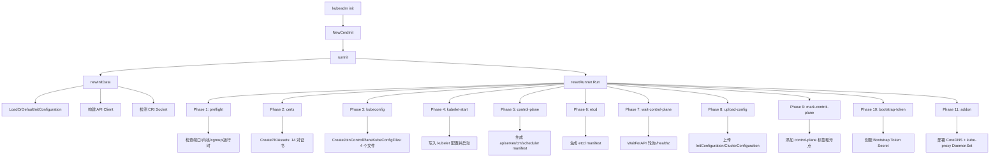
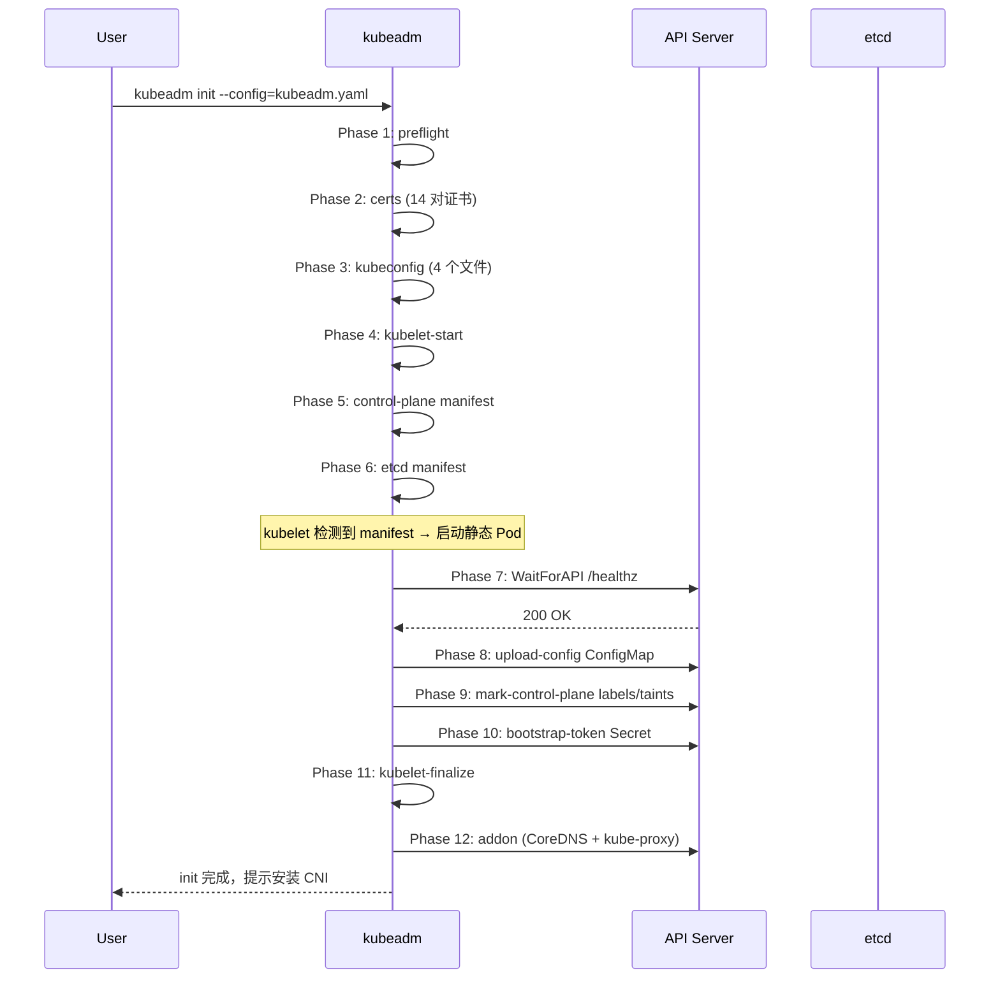

# Cluster Create — Kubernetes 集群新建源码分析

## 函数签名

```go
func NewCmdInit(out io.Writer, initOptions *InitOptions) *cobra.Command

func NewInitPhases(workflow *Runner, cfg *kubeadmapi.InitConfiguration) error

func runInit(cmd *cobra.Command, args []string, initOptions *InitOptions, out io.Writer) error

func CreatePKIAssets(cfg *kubeadmapi.InitConfiguration) error
func CreateJoinControlPlaneKubeConfigFiles(outDir string, cfg *kubeadmapi.InitConfiguration, files []string) error
func CreateStaticPodManifestFiles(manifestDir string, cfg *kubeadmapi.InitConfiguration) error
func CreateLocalEtcdStaticPodManifestFile(manifestDir string, cfg *kubeadmapi.InitConfiguration) error
func WaitForAPI(waiter apiclient.Waiter, timeout time.Duration) error
func UploadConfiguration(cfg *kubeadmapi.InitConfiguration, client clientset.Interface) error
func CreateBootstrapToken(client clientset.Interface, tokens []*kubeadmapi.BootstrapToken) error
```

## 源码位置

| 组件 | 源码路径 | 说明 |
|------|---------|------|
| kubeadm 入口 | `cmd/kubeadm/app/cmd/init.go` | init 命令注册 |
| Phase 定义 | `cmd/kubeadm/app/cmd/phases/init/init.go` | 所有 init 阶段注册 |
| 预检实现 | `cmd/kubeadm/app/preflight/` | 系统检查 |
| 证书阶段 | `cmd/kubeadm/app/phases/certs/` | PKI 生成 |
| kubeconfig 阶段 | `cmd/kubeadm/app/phases/kubeconfig/` | kubeconfig 生成 |
| 控制面阶段 | `cmd/kubeadm/app/phases/controlplane/` | 静态 Pod manifest |
| etcd 阶段 | `cmd/kubeadm/app/phases/etcd/` | etcd 初始化 |
| 附加组件 | `cmd/kubeadm/app/phases/addons/` | CoreDNS/kube-proxy |
| workflow Runner | `cmd/kubeadm/app/cmd/phases/workflow/runner.go` | Phase 执行框架 |
| API 类型 | `cmd/kubeadm/app/apis/kubeadm/` | 配置类型定义 |

## 参数说明

### kubeadm init 参数

| 标志 | 默认值 | 说明 |
|------|--------|------|
| `--config` | 无 | 配置文件路径 |
| `--cri-socket` | 自动检测 | CRI socket 路径 |
| `--dry-run` | `false` | 干跑模式 |
| `--kubernetes-version` | `stable-1` | Kubernetes 版本 |
| `--pod-network-cidr` | 无 | Pod CIDR |
| `--apiserver-advertise-address` | 自动检测 | API Server 公告地址 |
| `--apiserver-bind-port` | 6443 | API Server 端口 |
| `--control-plane-endpoint` | 无 | HA 负载均衡地址 |
| `--upload-certs` | `false` | 上传证书到 kubeadm-certs Secret |
| `--skip-phases` | 无 | 跳过阶段 |
| `--feature-gates` | 无 | Feature Gate 开关 |
| `--ignore-preflight-errors` | 无 | 忽略预检错误 |
| `--certificates-dir` | `/etc/kubernetes/pki` | 证书目录 |

### kubeadm init 完整 Phase 列表

| # | Phase | 说明 |
|---|-------|------|
| 1 | `preflight` | 系统预检（端口/内核/cgroup/运行时） |
| 2 | `certs` | PKI 证书生成（14 对证书/密钥） |
| 3 | `kubeconfig` | kubeconfig 文件生成（4 个） |
| 4 | `kubelet-start` | 启动 kubelet 服务 |
| 5 | `control-plane` | 生成控制面静态 Pod manifest |
| 6 | `etcd` | 生成 etcd 静态 Pod manifest |
| 7 | `wait-control-plane` | 等待控制面 Pod 就绪 |
| 8 | `upload-config` | 上传配置到 ConfigMap |
| 9 | `mark-control-plane` | 标记节点为控制面 |
| 10 | `bootstrap-token` | 创建 Bootstrap Token |
| 11 | `kubelet-finalize` | 终止 kubelet 证书引导 |
| 12 | `addon` | 部署 CoreDNS + kube-proxy |

### 文档索引

| 文档 | 内容 | 阅读顺序 |
|------|------|---------|
| [01-overview](01-overview.md) | 流程总览、入口分析 | 1 |
| [02-preflight](02-preflight.md) | 预检阶段 | 2 |
| [03-certs](03-certs.md) | 证书阶段 | 3 |
| [04-kubeconfig](04-kubeconfig.md) | kubeconfig 阶段 | 4 |
| [05-control-plane](05-control-plane.md) | 控制面阶段 | 5 |
| [06-join](06-join.md) | 节点加入 | 6 |
| [07-etcd](07-etcd.md) | etcd 初始化 | 7 |
| [08-ha](08-ha.md) | 高可用控制面 | 8 |
| [09-upgrade](09-upgrade.md) | 集群升级 | 9 |
| [19-cni-networking](19-cni-networking.md) | CNI 网络 | 19 |
| [20-node-registration](20-node-registration.md) | Node 注册 | 20 |
| [23-scheduler](23-scheduler.md) | kube-scheduler | 23 |

## 返回值

| 函数 | 返回值 | 说明 |
|------|--------|------|
| `NewCmdInit` | `*cobra.Command` | init 子命令 |
| `runInit` | `error` | init 成功或失败 |
| `CreatePKIAssets` | `error` | 证书生成结果 |
| `WaitForAPI` | `error` | API Server 就绪检查结果 |
| `UploadConfiguration` | `error` | 配置上传结果 |

## 调用链



## 源码分析

### 概述

本模块基于 Kubernetes 官方源码，系统梳理集群新建的完整逻辑。`kubeadm init` 将集群创建分解为 12 个有序阶段，每个阶段完成特定任务。kubeadm 采用"最小化集群引导"设计——只安装核心控制面组件，不安装 CNI 等附加组件。

### 关键函数速查

| 函数 | 位置 | 说明 |
|------|------|------|
| `NewCmdInit` | `init.go` | init 命令入口 |
| `NewInitPhases` | `cmd/phases/init/init.go` | 注册所有阶段 |
| `runInit` | `init.go` | init 主逻辑 |
| `CreatePKIAssets` | `phases/certs/` | 证书生成 |
| `BuildKubeconfig` | `phases/kubeconfig/` | kubeconfig 生成 |
| `CreateStaticPodManifest` | `phases/controlplane/` | 静态 Pod 生成 |
| `WaitForAPI` | `phases/waitcontrolplane.go` | 等待就绪 |

### 源码参考路径

| 组件 | 源码路径 | 说明 |
|------|---------|------|
| kubeadm 入口 | `cmd/kubeadm/app/cmd/init.go` | init 命令定义 |
| Phase 定义 | `cmd/kubeadm/app/cmd/phases/` | 各阶段注册 |
| 预检实现 | `cmd/kubeadm/app/preflight/` | 预检逻辑 |
| 证书阶段 | `cmd/kubeadm/app/phases/certs/` | 证书生成 |
| kubeconfig 阶段 | `cmd/kubeadm/app/phases/kubeconfig/` | kubeconfig 生成 |
| 控制面阶段 | `cmd/kubeadm/app/phases/controlplane/` | 静态 Pod 管理 |
| etcd 阶段 | `cmd/kubeadm/app/phases/etcd/` | etcd 初始化 |
| workflow Runner | `cmd/kubeadm/app/cmd/phases/workflow/runner.go` | Phase 执行框架 |

## 执行流程



## 使用场景

1. **单节点开发集群**：最小配置快速创建
2. **生产 HA 集群**：配置 controlPlaneEndpoint + certSANs
3. **自定义安装**：`--skip-phases` 跳过特定阶段
4. **离线安装**：预拉取镜像 + `--image-repository`
5. **CI/CD 集成**：`--dry-run` 验证配置

## 配置示例

```yaml
apiVersion: kubeadm.k8s.io/v1beta3
kind: InitConfiguration
localAPIEndpoint:
  advertiseAddress: 192.168.1.10
  bindPort: 6443
certificatesDir: /etc/kubernetes/pki
nodeRegistration:
  name: master-1
  criSocket: unix:///var/run/containerd/containerd.sock
  taints:
  - key: node-role.kubernetes.io/control-plane
    effect: NoSchedule
---
apiVersion: kubeadm.k8s.io/v1beta3
kind: ClusterConfiguration
clusterName: production-cluster
kubernetesVersion: v1.32.0
controlPlaneEndpoint: "lb.example.com:6443"
networking:
  serviceSubnet: "10.96.0.0/12"
  podSubnet: "10.244.0.0/16"
  dnsDomain: "cluster.local"
apiServer:
  certSANs:
    - "192.168.1.10"
    - "192.168.1.11"
    - "192.168.1.12"
    - "lb.example.com"
  extraArgs:
    audit-log-path: "/var/log/kubernetes/audit.log"
    tls-min-version: "VersionTLS13"
etcd:
  local:
    dataDir: "/var/lib/etcd"
---
apiVersion: kubelet.config.k8s.io/v1beta1
kind: KubeletConfiguration
rotateCertificates: true
serverTLSBootstrap: true
cgroupDriver: systemd
```

## 实战示例

### 标准 init 流程

```bash
# 初始化集群
sudo kubeadm init --config=kubeadm-config.yaml --upload-certs
# [init] Using Kubernetes version: v1.32.0
# [preflight] Running pre-flight checks
# [certs] Generating "ca" certificate and key
# [certs] Generating "apiserver" certificate and key
# [certs] apiserver serving cert is signed for DNS names [master-1 kubernetes kubernetes.default ...]
# [kubeconfig] Writing "admin.conf" kubeconfig file
# [kubeconfig] Writing "controller-manager.conf" kubeconfig file
# [kubeconfig] Writing "scheduler.conf" kubeconfig file
# [kubelet-start] Writing kubelet environment file with flags to file "/var/lib/kubelet/kubeadm-flags.env"
# [kubelet-start] Starting the kubelet
# [control-plane] Using manifest folder "/etc/kubernetes/manifests"
# [control-plane] Creating static Pod manifest for "kube-apiserver"
# [control-plane] Creating static Pod manifest for "kube-controller-manager"
# [control-plane] Creating static Pod manifest for "kube-scheduler"
# [etcd] Creating static Pod manifest for local etcd in "/etc/kubernetes/manifests"
# [wait-control-plane] Waiting for the kubelet to boot up the control plane
# [upload-config] Storing the configuration used in ConfigMap "kubeadm-config"
# [mark-control-plane] Marking the node "master-1" as control-plane
# [bootstrap-token] Using token: abcdef.0123456789abcdef
# [addon] Applied essential addon: CoreDNS
# [addon] Applied essential addon: kube-proxy

# 配置 kubectl
mkdir -p $HOME/.kube
sudo cp /etc/kubernetes/admin.conf $HOME/.kube/config
sudo chown $(id -u):$(id -g) $HOME/.kube/config

# 安装 CNI
kubectl apply -f https://raw.githubusercontent.com/projectcalico/calico/v3.26.0/manifests/calico.yaml

# 验证
kubectl get nodes
# NAME       STATUS   ROLES           AGE   VERSION
# master-1   Ready    control-plane   5m    v1.32.0

kubectl get pods -n kube-system
# NAME                               READY   STATUS    RESTARTS   AGE
# coredns-5d78c9869d-abcde           1/1     Running   0          5m
# etcd-master-1                      1/1     Running   0          5m
# kube-apiserver-master-1            1/1     Running   0          5m
# kube-controller-manager-master-1   1/1     Running   0          5m
# kube-proxy-xxxxx                   1/1     Running   0          5m
# kube-scheduler-master-1            1/1     Running   0          5m
```

## 常见错误

| 错误 | 现象 | 原因 | 解决方案 |
|------|------|------|----------|
| 端口被占用 | `[preflight] Port 6443 is in use` | 已有服务占用 | 停止占用进程或 `--apiserver-bind-port` |
| 证书已存在 | `[certs] Using existing ca certificate` | 重复 init | 删除 `/etc/kubernetes/pki` 后重试 |
| kubelet 启动失败 | control-plane Pod 不启动 | cgroup driver 不匹配 | 统一使用 `systemd` |
| 镜像拉取失败 | `ImagePullBackOff` | 网络问题或镜像不存在 | `kubeadm config images pull` 预拉取 |
| CNI 未安装 | CoreDNS Pending | 缺少 CNI 插件 | 安装 Cilium |
| etcd 启动失败 | API Server 无法连接 etcd | etcd 数据目录权限 | 检查 `/var/lib/etcd` 权限 |

## 相关函数

- [`CreatePKIAssets`](../cluster-cert/02-ca-generation.md) — PKI 证书生成
- [`kubeadm join`](06-join.md) — 节点加入集群
- [`kubeadm upgrade`](09-upgrade.md) — 集群升级
- [`CNI 网络`](19-cni-networking.md) — CNI 插件安装
- [`kube-scheduler`](23-scheduler.md) — 调度器配置

## Related

- [[entities/kubernetes|kubernetes]]
- [[entities/cni|cni]]
- [[entities/coredns|coredns]]
- [[domain-17-system-foundation/topic-cheat-sheet/networking|networking]]
- Domain-34: CNCF Landscape 开源项目 — Cross-reference
- [[references/release-notes-networking|发布说明索引 — 网络]] — Cross-reference
- domain-03-networking-traffic MOC — Cross-reference
- Topic 应用层架构设计最佳实践 — Cross-reference
- topic-application-architecture MOC — Cross-reference
- [[concepts/bp-common-best-practices|Kubernetes 通用最佳实践参考]] — Cross-reference
- [[concepts/KUDIG Knowledge Base Architecture|KUDIG Knowledge Base Architecture]] — Cross-reference
- [[domain-14-ai-ml-infra/01-ai-infra/03-gpu-scheduling-management|GPU 调度与管理]] — Cross-reference
- [[domain-14-ai-ml-infra/01-ai-infra/05-distributed-training-frameworks|分布式训练框架]] — Cross-reference
- domain-08-release-change-management MOC — Cross-reference
- [[skills/learn-decision-tree-mermaid|故障排查决策树 - Mermaid 可视化版]] — Cross-reference
- [[skills/skill-22-daemonset-failure|DaemonSet 故障诊断与修复 / DaemonSet Failure Diagnosis & Remediation]] — Cross-reference
- [[domain-07-platform-engineering/operate/06-monitoring-alerting-system|监控告警体系]] — Cross-reference
- Domain 30: 企业级灾备与业务连续性 (Enterprise Disaster Recovery & Business Continuity) — Cross-reference
- [[entities/ecosystem-changelog|生态组件变更日志索引]] — Cross-reference
- [[domain-19-landscape-references/topic-index/cluster-index|Cluster 集群知识图谱索引]]
- [[domain-19-landscape-references/topic-index/pvc-index|PVC 知识图谱索引]]
- [[domain-19-landscape-references/topic-index/terway-index|Terway 知识图谱索引]]
- [[domain-19-landscape-references/topic-index/nginx-ingress-index|nginx-ingress-controller 知识图谱索引]]
- [[domain-19-landscape-references/topic-index/higress-index|Higress 知识图谱索引]]
