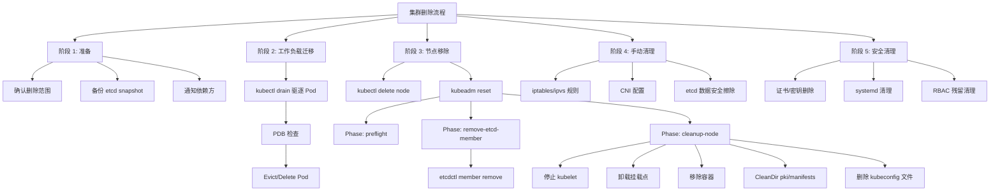
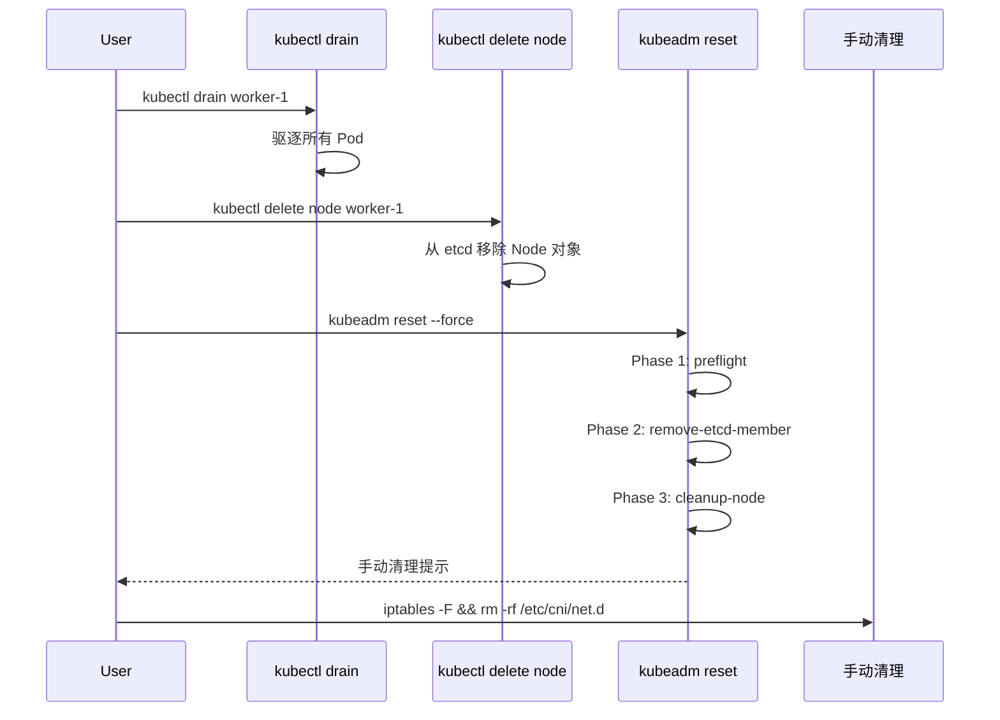

# Cluster Delete — Kubernetes 集群删除源码分析

## 函数签名

```go
func NewCmdReset(out io.Writer) *cobra.Command
func newResetData(cmd *cobra.Command, opts *resetOptions, in io.Reader, out io.Writer, allowExperimental bool) (*resetData, error)
func runPreflight(c workflow.RunData) error
func runRemoveETCDMember(c workflow.RunData) error
func runCleanupNode(c workflow.RunData) error
func RemoveStackedEtcdMember(client clientset.Interface, cfg *kubeadmapi.InitConfiguration, timeout time.Duration) error
func CleanDir(targetPath string) error

// kubectl drain 相关
func NewCmdDrain(f cmdutil.Factory, out io.Writer, errOut io.Writer) *cobra.Command
func RunDrain(drainer *Drainer, f cmdutil.Factory, out io.Writer, errOut io.Writer, args []string) error
```

## 源码位置

| 组件 | 源码路径 | 说明 |
|------|---------|------|
| reset 入口 | `cmd/kubeadm/app/cmd/reset.go` | reset 命令注册 |
| reset phases | `cmd/kubeadm/app/cmd/phases/reset/` | preflight/remove-etcd/cleanup-node |
| etcd 操作 | `cmd/kubeadm/app/phases/etcd/local.go` | RemoveStackedEtcdMember |
| workflow 引擎 | `cmd/kubeadm/app/cmd/phases/workflow/runner.go` | Phase 执行框架 |
| kubectl drain | `pkg/kubectl/cmd/drain/drain.go` | drain 命令实现 |
| 节点删除 | `pkg/kubectl/cmd/delete/delete.go` | kubectl delete node |
| 垃圾回收 | `pkg/controller/garbagecollector/` | 级联删除逻辑 |

## 参数说明

### kubeadm reset 参数

| 标志 | 默认值 | 说明 |
|------|--------|------|
| `--certificates-dir` | `/etc/kubernetes/pki` | 证书目录 |
| `--cleanup-tmp-dir` | `false` | 清理临时目录 |
| `--cri-socket` | 自动检测 | CRI socket 路径 |
| `--dry-run` | `false` | 干跑模式 |
| `-f, --force` | `false` | 跳过确认 |
| `--ignore-preflight-errors` | | 忽略预检错误 |
| `--skip-phases` | | 跳过阶段 |
| `--kubeconfig` | `/etc/kubernetes/admin.conf` | kubeconfig 路径 |

### kubectl drain 参数

| 标志 | 说明 |
|------|------|
| `--ignore-daemonsets` | 忽略 DaemonSet Pod |
| `--delete-emptydir-data` | 删除使用 emptyDir 的 Pod |
| `--force` | 强制删除非 ReplicaSet 管理的 Pod |
| `--grace-period` | 优雅终止宽限期（秒） |
| `--timeout` | drain 超时时间 |
| `--disable-eviction` | 使用 delete 替代 evict |
| `--pod-selector` | 仅驱逐匹配标签的 Pod |

### reset Phase 列表

| Phase | 说明 | InheritFlags |
|-------|------|-------------|
| `preflight` | root 权限检查、用户确认 | Force, DryRun, IgnorePreflightErrors |
| `remove-etcd-member` | 从 etcd 集群移除本地成员 | KubeconfigPath, DryRun |
| `cleanup-node` | 停止服务、清理目录、删除容器 | CertificatesDir, CRISocket, CleanupTmpDir, DryRun |

## 返回值

| 函数 | 返回值 | 说明 |
|------|--------|------|
| `NewCmdReset` | `*cobra.Command` | reset 子命令 |
| `newResetData` | `(*resetData, error)` | reset 数据实例 |
| `CleanDir` | `error` | 清理成功或失败 |
| `RemoveStackedEtcdMember` | `error` | etcd 移除成功或失败 |
| `RunDrain` | `error` | drain 成功或失败 |

## 调用链



## 源码分析

### 概述

集群删除是 Kubernetes 集群生命周期管理中不可忽视的环节。`kubeadm reset` 负责清理当前节点上的 Kubernetes 相关配置，但不会自动清理 CNI/iptables 等网络配置。理解删除流程对于处理异常场景至关重要。

### reset 入口函数

```go
// cmd/kubeadm/app/cmd/reset.go
func NewCmdReset(out io.Writer) *cobra.Command {
    opts := &resetOptions{
        externalcfg: &kubeadmapiv1.ResetConfiguration{},
    }

    resetRunner := workflow.NewRunner()

    cmd := &cobra.Command{
        Use:   "reset",
        Short: "Performs a best effort revert of changes made to this host",
        RunE: func(cmd *cobra.Command, args []string) error {
            data, err := resetRunner.InitData(args)
            if err != nil {
                return err
            }
            if err := resetRunner.Run(args); err != nil {
                return err
            }
            fmt.Fprint(out, manualCleanupInstructions)
            return nil
        },
    }

    AddResetFlags(cmd.Flags(), opts)

    resetRunner.AppendPhase(phases.NewPreflightPhase())
    resetRunner.AppendPhase(phases.NewRemoveETCDMemberPhase())
    resetRunner.AppendPhase(phases.NewCleanupNodePhase())

    resetRunner.SetDataInitializer(func(cmd *cobra.Command, args []string) (workflow.RunData, error) {
        return newResetData(cmd, opts, os.Stdin, out, true)
    })

    resetRunner.BindToCommand(cmd)
    return cmd
}
```

### 关键函数速查

| 函数 | 位置 | 说明 |
|------|------|------|
| `NewCmdReset` | `reset.go` | reset 命令入口 |
| `runPreflight` | `preflight.go` | 预检逻辑 |
| `runUnmount` | `unmount.go` | 卸载挂载点 |
| `runCleanupNode` | `cleanupnode.go` | 节点清理 |
| `runRemoveEtcd` | `removeetcdmember.go` | etcd 成员移除 |
| `RemoveStackedEtcdMember` | `etcd/local.go` | 移除 stacked etcd |
| `CleanDir` | `util.go` | 清理目录内容 |

### 核心源码路径

| 组件 | 源码路径 | 说明 |
|------|---------|------|
| kubeadm reset 入口 | `cmd/kubeadm/app/cmd/reset.go` | reset 命令定义 |
| reset phase 定义 | `cmd/kubeadm/app/cmd/phases/reset/` | 各阶段实现 |
| etcd 操作 | `cmd/kubeadm/app/phases/etcd/local.go` | etcd 本地操作 |
| workflow Runner | `cmd/kubeadm/app/cmd/phases/workflow/runner.go` | Phase 执行框架 |

## 执行流程



## 使用场景

1. **工作节点移除**：drain → delete → reset → 手动清理
2. **控制面节点移除**：remove-etcd → drain → delete → reset
3. **集群完全销毁**：所有节点按序 reset
4. **故障恢复**：节点 reset 后重新 join
5. **开发环境重置**：快速清理测试集群

## 配置示例

```yaml
apiVersion: kubeadm.k8s.io/v1beta4
kind: ResetConfiguration
certificatesDir: /etc/kubernetes/pki
cleanupTmpDir: true
criSocket: unix:///run/containerd/containerd.sock
dryRun: false
force: true
ignorePreflightErrors:
  - IsPrivilegedUser
skipPhases: []
unmountFlags:
  - MNT_DETACH
timeouts:
  etcdTakeover: 2m0s
```

## 实战示例

### 完整节点移除流程

```bash
# 步骤 1: 驱逐 Pod
kubectl drain worker-1 --ignore-daemonsets --delete-emptydir-data
# node/worker-1 cordoned
# evicting pod default/web-app-5d8c7b6f9c-abcde
# pod/web-app-5d8c7b6f9c-abcde evicted

# 步骤 2: 删除 Node 对象
kubectl delete node worker-1
# node "worker-1" deleted

# 步骤 3: 在目标节点 reset
kubeadm reset --force
# [preflight] Running pre-flight checks
# [reset] Stopping the kubelet service
# [reset] Unmounting mounted directories in "/var/lib/kubelet"
# [reset] Removing Kubernetes-managed containers
# [reset] Deleting contents of /etc/kubernetes/pki
# [reset] Deleting contents of /etc/kubernetes/manifests
# ...

# 步骤 4: 手动清理
iptables -F && iptables -t nat -F && iptables -t mangle -F && iptables -X
ipvsadm -C
rm -rf /etc/cni/net.d
rm -rf $HOME/.kube/config
rm -f /etc/systemd/system/kubelet.service
rm -rf /etc/systemd/system/kubelet.service.d/
systemctl daemon-reload
```

### 查看节点列表

```bash
kubectl get nodes
# NAME       STATUS   ROLES           AGE   VERSION
# master-1   Ready    control-plane   2h    v1.28.0
# worker-2   Ready    worker          1h    v1.28.0
```

## 常见错误

| 错误 | 现象 | 原因 | 解决方案 |
|------|------|------|----------|
| drain 卡住 | drain 不完成 | PDB 阻止驱逐 | 检查 PodDisruptionBudget |
| etcd 移除失败 | reset 报错 | etcd 仲裁不足 | 手动 etcdctl member remove |
| reset 后网络残留 | 重部署时网络异常 | CNI 未清理 | `rm -rf /etc/cni/net.d` |
| iptables 残留 | Service 访问异常 | reset 不清理 iptables | `iptables -F && iptables -t nat -F` |
| kubeconfig 残留 | kubectl 连接已删除集群 | `~/.kube/config` 未删除 | `rm -rf ~/.kube` |

## 相关函数

- [`runCleanupNode`](04-cleanup.md) — 节点清理详细实现
- [`runRemoveEtcd`](05-etcd-cleanup.md) — etcd 成员移除
- [`CleanDir`](04-cleanup.md) — 目录清理工具
- [`安全清理`](10-security-delete.md) — 证书/密钥安全删除
- [`网络清理`](11-network-cleanup.md) — CNI/iptables 清理
- [`删除前备份检查`](13-pre-delete-backup-checklist.md) — 集群删除前的数据备份与迁移检查清单

## 版本说明

- 基于 Kubernetes v1.28 - v1.32 源码分析
- `ResetConfiguration` 自 v1beta3 起成为独立 API 类型
- `--cleanup-tmp-dir` 标志自 v1.28 起可用
- kubeadm reset **不会**自动清理网络配置（CNI/iptables/ipvs）

## Related

- [[entities/kubernetes|kubernetes]]
- [[entities/cni|cni]]
- [[templates/cheat-sheet-template]]
- [[domain-17-system-foundation/topic-dictionary/operations/certificates|certificates]]
- Domain-34: CNCF Landscape 开源项目 — Cross-reference
- [[references/release-notes-networking|发布说明索引 — 网络]] — Cross-reference
- domain-03-networking-traffic MOC — Cross-reference
- Topic 应用层架构设计最佳实践 — Cross-reference
- topic-application-architecture MOC — Cross-reference
- [[concepts/bp-common-best-practices|Kubernetes 通用最佳实践参考]] — Cross-reference
- [[concepts/KUDIG Knowledge Base Architecture|KUDIG Knowledge Base Architecture]] — Cross-reference
- [[domain-14-ai-ml-infra/01-ai-infra/03-gpu-scheduling-management|GPU 调度与管理]] — Cross-reference
- [[domain-14-ai-ml-infra/01-ai-infra/05-distributed-training-frameworks|分布式训练框架]] — Cross-reference
- domain-08-release-change-management MOC — Cross-reference
- [[skills/learn-decision-tree-mermaid|故障排查决策树 - Mermaid 可视化版]] — Cross-reference
- [[skills/skill-22-daemonset-failure|DaemonSet 故障诊断与修复 / DaemonSet Failure Diagnosis & Remediation]] — Cross-reference
- [[domain-07-platform-engineering/operate/06-monitoring-alerting-system|监控告警体系]] — Cross-reference
- Domain 30: 企业级灾备与业务连续性 (Enterprise Disaster Recovery & Business Continuity) — Cross-reference
- [[entities/ecosystem-changelog|生态组件变更日志索引]] — Cross-reference
- [[domain-19-landscape-references/topic-index/cluster-index|Cluster 集群知识图谱索引]]
- [[domain-19-landscape-references/topic-index/pvc-index|PVC 知识图谱索引]]
- [[domain-19-landscape-references/topic-index/terway-index|Terway 知识图谱索引]]
- [[domain-19-landscape-references/topic-index/nginx-ingress-index|nginx-ingress-controller 知识图谱索引]]
- [[domain-19-landscape-references/topic-index/higress-index|Higress 知识图谱索引]]
