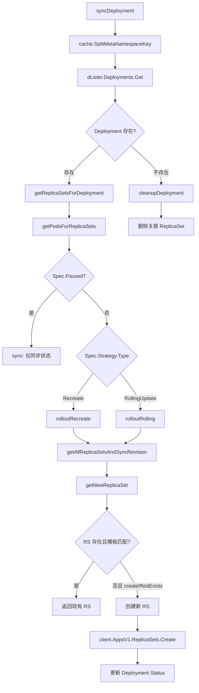
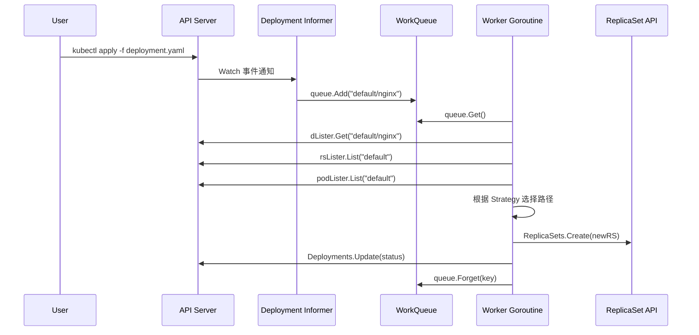

title: Deployment 控制器入口源码分析
category: deployment
tags:
- deployment
- syncDeployment
- getReplicaSetsForDeployment
- getNewReplicaSet
- cleanupDeployment
- PodTemplateHash
last_updated: 2026-05-18
description: 深入分析 Kubernetes Deployment 控制器 syncDeployment 函数的完整实现，涵盖 getReplicaSetsForDeployment
  获取关联 RS、getNewReplicaSet 创建新 RS、PodTemplateHash 计算、Deployment 暂停机制以及级联清理逻辑。
difficulty: advanced
intent_queries:
- kubernetes syncDeployment source code
- getReplicaSetsForDeployment kubernetes
- GetPodTemplateSpecHash kubernetes
- deployment pause resume mechanism
- cleanupDeployment kubernetes garbage collector
trigger_keywords:
- syncDeployment
- getReplicaSetsForDeployment
- getNewReplicaSet
- GetPodTemplateSpecHash
- cleanupDeployment
- PauseDeployment
- CascadingDeletion
- blockOwnerDeletion
- findNewReplicaSet
- CreateReplicaSet
reading_level: advanced
audience:
- platform-engineer
- kubernetes-developer
- sre
estimated_read_time: 5min
related_domains:
- domain-02-workloads-applications
- domain-01-cluster-fundamentals
related_topics:
- deployment-create
- replicaset-controller
- rolling-update
- deployment-status
domain_link: '[Workloads](../domain-02-workloads-applications/README.md)'
topic_link: '[Deployment Create](./README.md)'
authors:
- name: KUDIG Team
  role: contributor
k8s_versions:
- '1.28'
- '1.29'
- '1.30'
- '1.31'
- '1.32'
---

# Deployment 控制器入口源码分析

## 函数签名

```go
func (dc *DeploymentController) syncDeployment(ctx context.Context, key string) error

func (dc *DeploymentController) getReplicaSetsForDeployment(ctx context.Context, d *apps.Deployment) ([]*apps.ReplicaSet, error)

func (dc *DeploymentController) getNewReplicaSet(ctx context.Context, d *apps.Deployment, rsList []*apps.ReplicaSet, createIfNotExists bool) (*apps.ReplicaSet, error)

func (dc *DeploymentController) getAllReplicaSetsAndSyncRevision(ctx context.Context, d *apps.Deployment, rsList []*apps.ReplicaSet, createIfNotExists bool) (*apps.ReplicaSet, []*apps.ReplicaSet, error)

func (dc *DeploymentController) cleanupDeployment(ctx context.Context, key string) error

func GetPodTemplateSpecHash(deployment *apps.Deployment) (string, error)

func FindNewReplicaSet(deployment *apps.Deployment, rsList []*apps.ReplicaSet) *apps.ReplicaSet
```

## 源码位置

| 组件 | 源码路径 | 说明 |
|------|---------|------|
| 控制器主控 | `pkg/controller/deployment/deployment_controller.go` | NewDeploymentController、Run、事件处理 |
| 同步逻辑 | `pkg/controller/deployment/sync.go` | syncDeployment、getNewReplicaSet、cleanupOldReplicaSets |
| 工具函数 | `pkg/controller/deployment/util/deployment_util.go` | FindNewReplicaSet、GetPodTemplateSpecHash |
| 回滚逻辑 | `pkg/controller/deployment/rollback.go` | rollback、rollbackToRevision |
| 滚动更新 | `pkg/controller/deployment/rolling.go` | rolloutRolling |

## 参数说明

### syncDeployment 参数

| 参数名 | 类型 | 说明 |
|--------|------|------|
| `ctx` | `context.Context` | 上下文，用于取消和超时控制 |
| `key` | `string` | 对象 key，格式为 `namespace/name` |

### getNewReplicaSet 参数

| 参数名 | 类型 | 说明 |
|--------|------|------|
| `ctx` | `context.Context` | 上下文 |
| `d` | `*apps.Deployment` | 目标 Deployment 对象 |
| `rsList` | `[]*apps.ReplicaSet` | 当前 Deployment 关联的所有 ReplicaSet |
| `createIfNotExists` | `bool` | 如果不存在匹配的 RS 是否创建新的 |

### getReplicaSetsForDeployment 参数

| 参数名 | 类型 | 说明 |
|--------|------|------|
| `ctx` | `context.Context` | 上下文 |
| `d` | `*apps.Deployment` | 目标 Deployment 对象 |

## 返回值

| 函数 | 返回值 | 说明 |
|------|--------|------|
| `syncDeployment` | `error` | 同步成功返回 nil，Deployment 被删除时走 cleanup 路径 |
| `getReplicaSetsForDeployment` | `([]*apps.ReplicaSet, error)` | 返回 Deployment 管理的所有 RS 列表 |
| `getNewReplicaSet` | `(*apps.ReplicaSet, error)` | 返回当前版本的 RS（可能为 nil） |
| `getAllReplicaSetsAndSyncRevision` | `(*apps.ReplicaSet, []*apps.ReplicaSet, error)` | 返回新 RS 和所有旧 RS |
| `cleanupDeployment` | `error` | 清理成功返回 nil |

## 调用链



## 源码分析

### 概述

Deployment 控制器的核心逻辑集中在 `syncDeployment` 函数中。当用户创建或更新 Deployment 时，该函数被触发，负责将用户的声明式配置转换为底层 ReplicaSet 的创建、更新和删除操作。整个控制器的运行遵循 Kubernetes 经典的 Informer + WorkQueue + Reconcile Loop 模式。

### syncDeployment — 核心同步函数

```go
// pkg/controller/deployment/sync.go
func (dc *DeploymentController) syncDeployment(ctx context.Context, key string) error {
    namespace, name, err := cache.SplitMetaNamespaceKey(key)
    if err != nil {
        return err
    }

    deployment, err := dc.dLister.Deployments(namespace).Get(name)
    if err != nil {
        if errors.IsNotFound(err) {
            klog.V(2).Infof("Deployment %s/%s has been deleted", namespace, name)
            return dc.cleanupDeployment(ctx, key)
        }
        return err
    }

    if deployment.Spec.Paused && deployment.DeletionTimestamp != nil {
        return nil
    }

    d := deployment.DeepCopy()

    rsList, err := dc.getReplicaSetsForDeployment(ctx, d)
    if err != nil {
        return err
    }

    podMap, err := dc.getPodMapForDeployment(d, rsList)
    if err != nil {
        return err
    }

    if d.Spec.Paused {
        return dc.sync(ctx, d, rsList, podMap)
    }

    switch d.Spec.Strategy.Type {
    case apps.RecreateDeploymentStrategyType:
        return dc.rolloutRecreate(ctx, d, rsList, podMap)
    case apps.RollingUpdateDeploymentStrategyType:
        return dc.rolloutRolling(ctx, d, rsList, podMap)
    default:
        return fmt.Errorf("unexpected deployment strategy type: %s", d.Spec.Strategy.Type)
    }
}
```

**核心流程**：
1. 解析 namespace/name 获取 Deployment 对象
2. 若 Deployment 已删除，执行 cleanupDeployment 清理关联 RS
3. 获取该 Deployment 关联的所有 ReplicaSet
4. 获取这些 ReplicaSet 管理的所有 Pod
5. 根据 `Spec.Strategy.Type` 选择执行路径
6. 更新 Deployment Status

### 获取关联 ReplicaSet

```go
// pkg/controller/deployment/deployment_controller.go
func (dc *DeploymentController) getReplicaSetsForDeployment(ctx context.Context, d *apps.Deployment) ([]*apps.ReplicaSet, error) {
    selector, err := metav1.LabelSelectorAsSelector(d.Spec.Selector)
    if err != nil {
        return nil, fmt.Errorf("invalid label selector: %v", err)
    }

    rsList, err := dc.rsLister.ReplicaSets(d.Namespace).List(labels.Everything())
    if err != nil {
        return nil, err
    }

    var ownedRS []*apps.ReplicaSet
    for _, rs := range rsList {
        if !metav1.IsControlledBy(rs, d) {
            continue
        }
        if selector.Matches(labels.Set(rs.Labels)) {
            ownedRS = append(ownedRS, rs)
        }
    }

    return ownedRS, nil
}
```

**OwnerReferences 机制**：

```yaml
apiVersion: apps/v1
kind: ReplicaSet
metadata:
  name: nginx-7c4c8d5d4f
  namespace: default
  ownerReferences:
  - apiVersion: apps/v1
    kind: Deployment
    name: nginx
    uid: a1b2c3d4-e5f6-7890-abcd-ef1234567890
    controller: true
    blockOwnerDeletion: true
  labels:
    app: nginx
    pod-template-hash: "7c4c8d5d4f"
```

### PodTemplateHash 的计算与应用

```go
// pkg/controller/deployment/util/deployment_util.go
func GetPodTemplateSpecHash(deployment *apps.Deployment) (string, error) {
    podTemplateSpecHasher := fnv.New32a()
    hash.DeepHashObject(podTemplateSpecHasher, deployment.Spec.Template)
    return fmt.Sprintf("%d", podTemplateSpecHasher.Sum32()), nil
}

func FindNewReplicaSet(deployment *apps.Deployment, rsList []*apps.ReplicaSet) *apps.ReplicaSet {
    newRSTemplate := GetModifiedReplicaSetTemplate(deployment)
    for _, rs := range rsList {
        if EqualIgnoreHash(&rs.Spec.Template, &newRSTemplate) {
            return rs
        }
    }
    return nil
}
```

**hash 标签注入**：
```yaml
# Deployment 的 PodTemplate
spec:
  template:
    metadata:
      labels:
        app: nginx
        pod-template-hash: "7c4c8d5d4f"  # ← 自动注入
```

**作用**：
1. 区分不同版本的 ReplicaSet
2. 作为 Selector 的一部分，确保每个 RS 只管理自己的 Pod
3. 回滚时通过比对 hash 确定目标 RS

### 创建新 ReplicaSet

```go
// pkg/controller/deployment/sync.go
func (dc *DeploymentController) getNewReplicaSet(ctx context.Context, d *apps.Deployment, rsList []*apps.ReplicaSet, createIfNotExists bool) (*apps.ReplicaSet, error) {
    existingNewRS := FindNewReplicaSet(d, rsList)
    if existingNewRS != nil {
        return existingNewRS, nil
    }

    if !createIfNotExists {
        return nil, nil
    }

    podTemplateHash, err := GetPodTemplateSpecHash(d)
    if err != nil {
        return nil, err
    }

    newRSTemplate := *d.Spec.Template.DeepCopy()
    templateLabels := CloneAndAddLabel(d.Spec.Template.Labels, apps.DefaultDeploymentUniqueLabelKey, podTemplateHash)
    newRSTemplate.Labels = templateLabels

    newRS := &apps.ReplicaSet{
        ObjectMeta: metav1.ObjectMeta{
            Name:            d.Name + "-" + podTemplateHash,
            Namespace:       d.Namespace,
            Labels:          templateLabels,
            OwnerReferences: []metav1.OwnerReference{*metav1.NewControllerRef(d, controllerKind)},
            Annotations:     map[string]string{},
        },
        Spec: apps.ReplicaSetSpec{
            Replicas: new(int32),
            Selector: &metav1.LabelSelector{
                MatchLabels: templateLabels,
            },
            Template: newRSTemplate,
        },
    }

    *newRS.Spec.Replicas = 0

    SetNewReplicaSetAnnotations(d, newRS, *newRS.Spec.Replicas, true)
    deploymentutil.SetReplicasAnnotations(newRS, *(d.Spec.Replicas))

    newRS, err = dc.client.AppsV1().ReplicaSets(d.Namespace).Create(ctx, newRS, metav1.CreateOptions{})
    if err != nil {
        return nil, fmt.Errorf("error creating new replica set: %v", err)
    }

    dc.eventRecorder.Eventf(d, v1.EventTypeNormal, "NewReplicaSetCreated", "Created new replica set %q", newRS.Name)
    return newRS, nil
}
```

### Deployment 暂停机制

```go
func (dc *DeploymentController) sync(ctx context.Context, deployment *apps.Deployment, rsList []*apps.ReplicaSet, podMap map[types.UID]*v1.PodList) error {
    newRS, allOldRSs, err := dc.getAllReplicaSetsAndSyncRevision(ctx, deployment, rsList, false)
    if err != nil {
        return err
    }

    if err := dc.scale(ctx, deployment, newRS, allOldRSs); err != nil {
        return err
    }

    _, err = dc.cleanupDeployment(ctx, allOldRSs, deployment)
    if err != nil {
        return err
    }

    return dc.syncRolloutStatus(ctx, allOldRSs, newRS, deployment)
}
```

**使用场景**：
```bash
# 暂停 Deployment
kubectl rollout pause deployment/nginx

# 批量修改（不会触发滚动更新）
kubectl set image deployment/nginx nginx=nginx:1.26
kubectl set resources deployment/nginx -c=nginx --limits=cpu=500m,memory=512Mi
kubectl set env deployment/nginx LOG_LEVEL=debug

# 恢复，所有修改一次性生效
kubectl rollout resume deployment/nginx
```

### 删除 Deployment 时的级联清理

```go
func (dc *DeploymentController) cleanupDeployment(ctx context.Context, key string) error {
    namespace, name, err := cache.SplitMetaNamespaceKey(key)
    if err != nil {
        return err
    }

    klog.V(2).Infof("Cleaning up deployment %s/%s", namespace, name)

    selector, err := metav1.LabelSelectorAsSelector(nil)
    rsList, err := dc.rsLister.ReplicaSets(namespace).List(labels.Everything())
    if err != nil {
        return err
    }

    for _, rs := range rsList {
        if rs.DeletionTimestamp != nil {
            continue
        }
        if metav1.IsControlledBy(rs, &apps.Deployment{
            ObjectMeta: metav1.ObjectMeta{Name: name, Namespace: namespace},
        }) {
            if err := dc.client.AppsV1().ReplicaSets(namespace).Delete(ctx, rs.Name, metav1.DeleteOptions{}); err != nil {
                return err
            }
        }
    }

    return nil
}
```

**垃圾回收机制**：
- Kubernetes 使用级联删除（Cascading Deletion）
- Deployment 作为 ReplicaSet 的 `ownerReferences[0]`，且 `blockOwnerDeletion: true`
- 删除 Deployment 时，垃圾回收器自动删除其所有 ReplicaSet
- ReplicaSet 被删除时，又自动删除其所有 Pod
- 最终形成完整的级联清理链

## 执行流程



## 使用场景

1. **首次创建**：Deployment 不存在，创建新 RS 并逐步扩容到期望副本数
2. **镜像更新**：PodTemplate 变更，创建新 RS 并滚动替换
3. **扩缩容**：仅修改 replicas，不创建新 RS，直接调整当前 RS 副本数
4. **暂停恢复**：暂停后批量修改，恢复后一次性应用所有变更
5. **删除清理**：Deployment 被删除时，级联清理所有 RS 和 Pod

## 配置示例

```yaml
apiVersion: apps/v1
kind: Deployment
metadata:
  name: web-app
  namespace: production
spec:
  replicas: 3
  revisionHistoryLimit: 10
  progressDeadlineSeconds: 600
  minReadySeconds: 5
  strategy:
    type: RollingUpdate
    rollingUpdate:
      maxSurge: 1
      maxUnavailable: 0
  selector:
    matchLabels:
      app: web-app
  template:
    metadata:
      labels:
        app: web-app
    spec:
      containers:
      - name: web-app
        image: web-app:v1.0.0
        ports:
        - containerPort: 8080
        readinessProbe:
          httpGet:
            path: /healthz
            port: 8080
          initialDelaySeconds: 5
          periodSeconds: 3
        resources:
          requests:
            cpu: 200m
            memory: 256Mi
          limits:
            cpu: "1"
            memory: 512Mi
```

## 实战示例

### 观察控制器处理新 Deployment

> ⚠️ **🟡 中危变更** — 变更集群资源状态，建议先 --dry-run 或 diff 确认
> - `kubectl apply/create/replace`：创建/变更集群资源

```bash
# 创建
kubectl apply -f deployment.yaml
deployment.apps/web-app created

# 观察 RS 创建
kubectl get rs -w
# NAME                  DESIRED   CURRENT   READY   AGE
# web-app-5d8c7b6f9c    3         3         0       0s
# web-app-5d8c7b6f9c    3         3         1       2s
# web-app-5d8c7b6f9c    3         3         2       4s
# web-app-5d8c7b6f9c    3         3         3       6s

# 查看事件
kubectl describe deployment web-app
# Events:
#   Type    Reason             Age   From                   Message
#   ----    ------             ----  ----                   -------
#   Normal  NewReplicaSetCreated  10s  deployment-controller  Created new replica set web-app-5d8c7b6f9c
#   Normal  ScalingReplicaSet   10s   deployment-controller  Scaled up replica set web-app-5d8c7b6f9c to 3
```

### 更新触发新 RS 创建

```bash
kubectl set image deployment/web-app web-app=web-app:v2.0.0
deployment.apps/web-app image updated

kubectl get rs -l app=web-app
# NAME                  DESIRED   CURRENT   READY   AGE
# web-app-5d8c7b6f9c    2         2         2       5m    # 旧 RS 缩容
# web-app-7a9b8c6d4e    1         1         0       3s    # 新 RS 创建
```

## 常见错误

| 错误 | 现象 | 原因 | 解决方案 |
|------|------|------|----------|
| RS 创建失败 | `error creating new replica set` | RBAC 权限不足或资源配额超限 | 检查 controller-manager 权限和 ResourceQuota |
| PodTemplateHash 冲突 | 两个 Deployment 产生相同 hash | 不同 Deployment 的 template 碰巧相同 | 添加不同的 label 区分 |
| cleanup 卡住 | 删除 Deployment 后 RS 未清理 | OwnerReference 缺失或 GC controller 问题 | 手动删除 RS 或检查 GC 日志 |
| scale 失败 | RS 副本数不更新 | API Server 不可达或乐观锁冲突 | 检查 API Server 健康状态 |
| 暂停后更新不生效 | resume 后无变化 | 暂停期间修改的不是 PodTemplate | 确认修改了 spec.template 字段 |

## 相关函数

- [`NewDeploymentController`](README.md) — 控制器初始化与 Informer 注册
- [`rolloutRolling`](04-rolling-update.md) — RollingUpdate 策略的详细实现
- [`rolloutRecreate`](README.md) — Recreate 策略的详细实现
- [`calculateStatus`](05-deployment-status.md) — Deployment Status 计算
- [`rollbackToRevision`](06-revision-history.md) — 版本回滚实现
- [`cleanupOldReplicaSets`](README.md) — 清理超出 historyLimit 的旧 RS

## Related

- [[reference|#reference Hub]] — tag hub

- [[README|README]]
- [[domain-17-system-foundation/topic-cheat-sheet/go.md|go]]
- [[domain-17-system-foundation/topic-cheat-sheet/k8s.md|k8s]]
- [[entities/kubernetes.md|kubernetes]]
