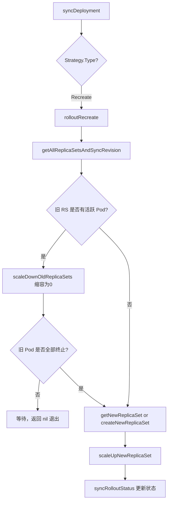
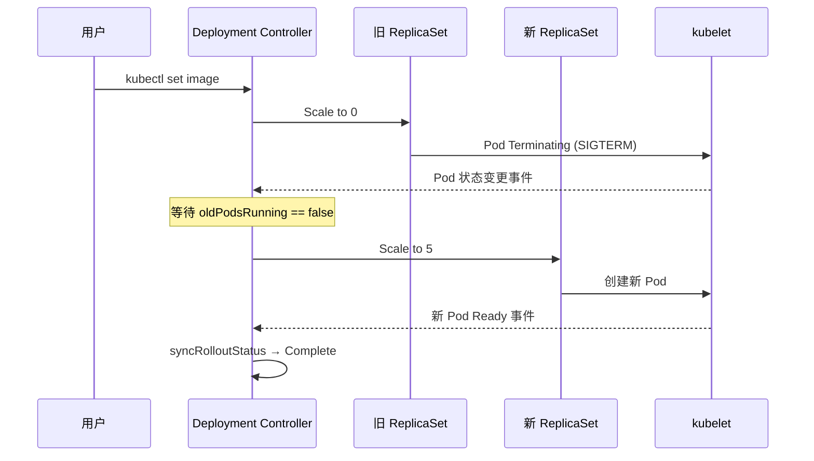

> **生产环境安全提示**
>
> 本文档包含可直接执行的运维命令。执行前请确认：当前目标集群与 Namespace 是否正确；是否具备足够的 RBAC 权限；是否已在非生产环境验证。命令风险等级标注：🔴 高风险（可能造成数据丢失或服务中断）、🟡 中风险（会修改集群状态，但通常可回滚）、🟢 低风险/只读（信息收集，无副作用）。


# Recreate 策略源码分析

## 函数签名

```go
func (dc *DeploymentController) rolloutRecreate(
    ctx context.Context,
    d *apps.Deployment,
    rsList []*apps.ReplicaSet,
    podMap map[types.UID][]*v1.Pod,
) error
```

## 源码位置

| 组件 | 源码路径 | 说明 |
|------|---------|------|
| Recreate 入口 | `pkg/controller/deployment/recreate.go` | rolloutRecreate 主函数 |
| 缩容工具 | `pkg/controller/deployment/util/deployment_util.go` | ScaleDownOldReplicaSets |
| 同步逻辑 | `pkg/controller/deployment/sync.go` | getAllReplicaSetsAndSyncRevision |
| 进度追踪 | `pkg/controller/deployment/progress.go` | syncRolloutStatus |

## 参数说明

| 参数 | 类型 | 说明 |
|------|------|------|
| `ctx` | `context.Context` | 控制超时与取消 |
| `d` | `*apps.Deployment` | Deployment 对象 |
| `rsList` | `[]*apps.ReplicaSet` | 关联的所有 ReplicaSet 列表 |
| `podMap` | `map[types.UID][]*v1.Pod` | 各 RS 对应的 Pod 列表 |

## 返回值

| 返回值 | 说明 |
|--------|------|
| `error` | 操作成功返回 nil，失败返回具体错误 |

## 调用链



## 源码分析

### 概述

Recreate 策略是 Kubernetes Deployment 提供的另一种更新方式，与 RollingUpdate 的渐进式替换不同，Recreate 采用**先全量停止旧版本，再全量启动新版本**的硬切换方式。这意味着更新过程中必然存在一段服务不可用时间（downtime）。

选择 Recreate 策略的核心场景：
- 应用不支持多版本并行运行（如需要排他的数据库 schema 迁移）
- 新旧版本存在严重的配置/端口冲突
- 资源极度紧张，无法承受 RollingUpdate 的额外 Pod 开销

### rolloutRecreate 核心实现

```go
// pkg/controller/deployment/recreate.go
func (dc *DeploymentController) rolloutRecreate(
    ctx context.Context,
    d *apps.Deployment,
    rsList []*apps.ReplicaSet,
    podMap map[types.UID][]*v1.Pod,
) error {
    // Step 1: 获取新旧 ReplicaSet
    newRS, oldRSs, err := dc.getAllReplicaSetsAndSyncRevision(ctx, d, rsList, false)
    if err != nil {
        return err
    }
    allRSs := append(oldRSs, newRS)
    activeOldRSs := controller.FilterActiveReplicaSets(oldRSs)

    // Step 2: 缩容所有旧 ReplicaSet 到 0
    scaledDown, err := dc.scaleDownOldReplicaSetsForRecreate(ctx, activeOldRSs, d)
    if err != nil {
        return err
    }

    if scaledDown {
        // 触发了缩容，需要等待本次协调结束，下次协调再检查
        return dc.syncRolloutStatus(ctx, allRSs, newRS, d)
    }

    // Step 3: 检查旧 Pod 是否已全部终止
    if oldPodsRunning(newRS, oldRSs, podMap) {
        // 还有旧 Pod 在运行，继续等待
        return dc.syncRolloutStatus(ctx, allRSs, newRS, d)
    }

    // Step 4: 旧 Pod 已全清，创建新 ReplicaSet 并扩容到目标副本数
    if newRS == nil {
        newRS, oldRSs, err = dc.getAllReplicaSetsAndSyncRevision(ctx, d, rsList, true)
        if err != nil {
            return err
        }
        allRSs = append(oldRSs, newRS)
    }

    // Step 5: 扩容新 RS 到 Deployment.Spec.Replicas
    if _, err := dc.scaleUpNewReplicaSetForRecreate(ctx, newRS, d); err != nil {
        return err
    }

    // 清理超出 revisionHistoryLimit 的旧 RS
    if util.DeploymentComplete(d, &d.Status) {
        if err := dc.cleanupDeployment(ctx, oldRSs, d); err != nil {
            return err
        }
    }

    return dc.syncRolloutStatus(ctx, allRSs, newRS, d)
}
```

### 旧 ReplicaSet 缩容逻辑

```go
// scaleDownOldReplicaSetsForRecreate 将所有旧 RS 副本数设为 0
func (dc *DeploymentController) scaleDownOldReplicaSetsForRecreate(
    ctx context.Context,
    activeOldRSs []*apps.ReplicaSet,
    deployment *apps.Deployment,
) (bool, error) {
    scaled := false
    for i := range activeOldRSs {
        rs := activeOldRSs[i]
        // 如果 RS 已经是 0 副本，跳过
        if *(rs.Spec.Replicas) == 0 {
            continue
        }
        // 将 RS 的 Spec.Replicas 更新为 0
        scaledRS, updatedRS, err := dc.scaleReplicaSetAndRecordEvent(ctx, rs, 0, deployment)
        if err != nil {
            return false, err
        }
        if scaledRS {
            activeOldRSs[i] = updatedRS
            scaled = true
        }
    }
    return scaled, nil
}
```

### 旧 Pod 存活检测

```go
// oldPodsRunning 检查是否还有旧 RS 的 Pod 在运行
func oldPodsRunning(newRS *apps.ReplicaSet, oldRSs []*apps.ReplicaSet, podMap map[types.UID][]*v1.Pod) bool {
    if oldPods := util.GetActualReplicaCountForReplicaSets(oldRSs); oldPods > 0 {
        return true
    }
    for _, pod := range podMap[newRS.UID] {
        switch pod.Status.Phase {
        case v1.PodFailed, v1.PodSucceeded:
            // 已终止的 Pod 不算活跃
        default:
            if pod.DeletionTimestamp != nil {
                // 处于 Terminating 状态，仍在运行
                return true
            }
        }
    }
    return false
}
```

### 新 ReplicaSet 扩容逻辑

```go
// scaleUpNewReplicaSetForRecreate 将新 RS 副本数设置为期望值
func (dc *DeploymentController) scaleUpNewReplicaSetForRecreate(
    ctx context.Context,
    newRS *apps.ReplicaSet,
    deployment *apps.Deployment,
) (bool, error) {
    // 仅在新 RS 的当前副本数不等于期望副本数时才操作
    scaled, _, err := dc.scaleReplicaSetAndRecordEvent(
        ctx,
        newRS,
        *(deployment.Spec.Replicas),
        deployment,
    )
    return scaled, err
}
```

## 执行流程

```
Recreate 策略更新时序：

时间轴  ▼
T+0s  : 用户更新 Deployment 镜像版本
        syncDeployment 检测到 Strategy.Type == Recreate
T+1s  : scaleDownOldReplicaSetsForRecreate
        旧 RS: replicas: 5 → 0
        旧 Pod 开始进入 Terminating 状态
T+5s  : kubelet 收到终止信号，等待 terminationGracePeriodSeconds
T+35s : 旧 Pod 全部终止（默认 grace period 30s）
        oldPodsRunning() 返回 false
T+36s : scaleUpNewReplicaSetForRecreate
        新 RS: replicas: 0 → 5
T+40s : 新 Pod 开始创建、拉取镜像、启动容器
T+60s : 新 Pod 就绪，服务恢复
```



## 使用场景

### 适用场景

| 场景 | 原因 |
|------|------|
| 数据库 schema 独占迁移 | 新旧版本不能同时访问同一 schema 版本 |
| 端口/socket 独占资源 | 新旧进程不能同时绑定同一端口 |
| 有状态配置强依赖 | 配置文件格式不向下兼容 |
| 测试/开发环境 | 不关注可用性，只需快速完成更新 |
| 资源极度紧张 | 无法容忍 maxSurge 带来的额外 Pod |

### 不适用场景

| 场景 | 建议策略 |
|------|---------|
| 生产环境无状态服务 | RollingUpdate |
| SLA 要求无停机更新 | RollingUpdate + maxUnavailable=0 |
| 需要渐进式验证 | RollingUpdate + pause/resume |

## 配置示例

```yaml
apiVersion: apps/v1
kind: Deployment
metadata:
  name: db-migrator
  namespace: production
spec:
  replicas: 3
  strategy:
    # 明确指定 Recreate，触发全量重建
    type: Recreate
  selector:
    matchLabels:
      app: db-migrator
  template:
    metadata:
      labels:
        app: db-migrator
    spec:
      # 控制旧 Pod 终止等待时间，影响 downtime 时长
      terminationGracePeriodSeconds: 60
      containers:
      - name: app
        image: myapp:v2.0.0
        ports:
        - containerPort: 8080
        lifecycle:
          preStop:
            exec:
              # 优雅关闭：等待连接排空
              command: ["/bin/sh", "-c", "sleep 10"]
```

## 实战示例

### 观察 Recreate 更新过程

> ⚠️ **🟡 中危变更** — 变更集群资源状态，建议先 --dry-run 或 diff 确认
> - `kubectl edit/patch`：修改运行中的资源

``` bash
# 🟡 中风险：会修改集群/资源状态，执行前请确认目标、影响范围与授权
# 设置 Recreate 策略并触发更新
kubectl patch deployment db-migrator \
  -p '{"spec":{"strategy":{"type":"Recreate"}}}'

kubectl set image deployment/db-migrator app=myapp:v2.0.0

# 观察 Pod 变化（先全部消失，再全部出现）
kubectl get pods -l app=db-migrator -w
```
### kubectl get pods 输出（体现 Recreate 特征）

```
NAME                          READY   STATUS        RESTARTS   AGE
db-migrator-6b7d9c8f5-xk9wl   1/1     Running       0          10m
db-migrator-6b7d9c8f5-pq2rt   1/1     Running       0          10m
db-migrator-6b7d9c8f5-mn4vz   1/1     Running       0          10m
db-migrator-6b7d9c8f5-xk9wl   1/1     Terminating   0          10m   ← 开始终止
db-migrator-6b7d9c8f5-pq2rt   1/1     Terminating   0          10m
db-migrator-6b7d9c8f5-mn4vz   1/1     Terminating   0          10m
db-migrator-6b7d9c8f5-xk9wl   0/1     Terminating   0          10m
db-migrator-6b7d9c8f5-pq2rt   0/1     Terminating   0          10m
db-migrator-6b7d9c8f5-mn4vz   0/1     Terminating   0          10m
                                                                       ← 中间 downtime 窗口
db-migrator-7c8e0d9g6-ab1cd   0/1     Pending       0          0s    ← 新 Pod 开始创建
db-migrator-7c8e0d9g6-ef2gh   0/1     Pending       0          0s
db-migrator-7c8e0d9g6-ij3kl   0/1     Pending       0          0s
db-migrator-7c8e0d9g6-ab1cd   1/1     Running       0          8s
db-migrator-7c8e0d9g6-ef2gh   1/1     Running       0          9s
db-migrator-7c8e0d9g6-ij3kl   1/1     Running       0          10s
```

## 与 RollingUpdate 对比

| 维度 | Recreate | RollingUpdate |
|------|---------|---------------|
| 更新方式 | 先全停，再全启 | 渐进式替换 |
| 停机时间 | 必然存在 | 可配置为零停机 |
| 资源消耗 | 更新期间无额外 Pod | maxSurge 可能增加 Pod 数 |
| 版本并行 | 不存在 | 短暂并行运行 |
| 回滚速度 | 需完整重建 | 可快速缩放 RS |
| 适用类型 | 数据库、独占资源 | 无状态微服务 |
| 配置复杂度 | 无额外参数 | maxSurge/maxUnavailable |

## 常见错误

| 错误 | 现象 | 原因 | 解决方案 |
|------|------|------|----------|
| Recreate 更新卡住 | 旧 Pod 长期 Terminating | PodDisruptionBudget 阻止 | 临时移除或调整 PDB |
| 新 Pod 无法调度 | Pending 状态 | 节点资源不足（旧 Pod 释放后仍不够） | 检查资源配额和节点容量 |
| downtime 超出预期 | 服务中断时间过长 | terminationGracePeriodSeconds 设置过大 | 减小 grace period 或优化关闭逻辑 |
| Recreate 后状态不更新 | Deployment 长期 Progressing | progressDeadlineSeconds 过短 | 增大 progressDeadlineSeconds |

## 相关函数

- [`syncDeployment`](02-deployment-controller.md) — 根据 Strategy.Type 调度 rolloutRecreate 或 rolloutRolling
- [`rolloutRolling`](04-rolling-update.md) — RollingUpdate 策略对比参考
- [`calculateStatus`](05-deployment-status.md) — Deployment Status 状态计算

## 版本说明

- Recreate 策略自 Kubernetes v1.0 起支持，接口稳定
- `scaleDownOldReplicaSetsForRecreate` 和 `scaleUpNewReplicaSetForRecreate` 均在 `recreate.go` 中实现
- 基于 Kubernetes v1.28 – v1.32 源码分析

## Related

- [[entities/kubernetes.md|kubernetes]]
- [[domain-17-system-foundation/topic-dictionary/workloads/pods.md|pods]]
- [[domain-17-system-foundation/topic-dictionary/workloads/replicaset.md|replicaset]]
- [[domain-07-platform-engineering/topic-code-analysis/deployment-create/04-rolling-update.md|04-rolling-update]]
- [[domain-07-platform-engineering/topic-code-analysis/deployment-create/05-deployment-status.md|05-deployment-status]]


<!-- risk-assessed -->
