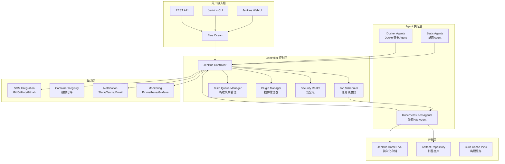
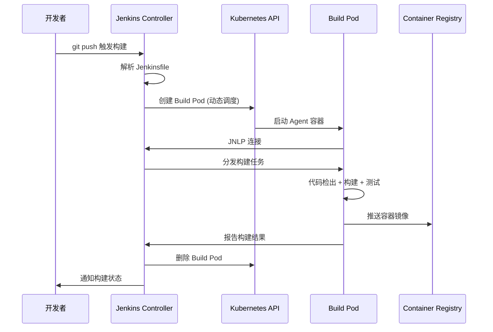

> **生产环境安全提示**
>
> 本文档包含可直接执行的运维命令。执行前请确认：当前目标集群与 Namespace 是否正确；是否具备足够的 RBAC 权限；是否已在非生产环境验证。命令风险等级标注：🔴 高风险（可能造成数据丢失或服务中断）、🟡 中风险（会修改集群状态，但通常可回滚）、🟢 低风险/只读（信息收集，无副作用）。


# Jenkins企业级CI/CD流水线深度实践

> **作者**: CI/CD架构专家 | **版本**: v2.0 | **更新时间**: 2026-04-24
> **适用场景**: 企业级CI/CD流水线架构 | **复杂度**: ⭐⭐⭐⭐⭐
> **适用版本**: Jenkins LTS 2.492.x / JCasC / [[Kubernetes|Kubernetes]] Plugin

---

<!-- chunk: 📋 目录 -->## 📋 目录

- [一、概述](#一概述)
- [二、架构设计](#二架构设计)
- [三、核心配置](#三核心配置)
- [四、安全与合规](#四安全与合规)
- [五、多环境管理策略](#五多环境管理策略)
- [六、监控与回滚](#六监控与回滚)
- [七、最佳实践](#七最佳实践)
- [八、故障排查](#八故障排查)

---

<!-- chunk: 一、概述 -->## 一、概述

Jenkins 是持续集成/持续交付领域历史最悠久、生态最丰富的开源自动化服务器。自 2011 年从 Hudson 分支以来，Jenkins 已经发展成为拥有 1800+ 插件、覆盖几乎所有技术栈的 CI/CD 平台。在 Kubernetes 时代，Jenkins 通过 Kubernetes Plugin 实现了动态 Agent 调度——每次构建任务自动创建 Pod 作为 Agent，构建完成后自动销毁，实现了弹性构建能力。

本文档面向需要在 Kubernetes 上部署和管理 Jenkins 的企业架构师和 DevOps 工程师。我们采用 Configuration as Code (JCasC) 方式实现 Jenkins 的声明式配置管理，使用 Shared Library 实现流水线代码复用，结合 Kubernetes Plugin 实现动态 Agent 调度。这些实践帮助企业构建标准化、可复现、易维护的 CI/CD 平台。

Jenkins 在企业中的定位正在从"全能 CI/CD 平台"向"复杂工作流编排器"转变。对于简单的构建任务，GitHub Actions、GitLab CI 等轻量级方案更为适合。但对于需要复杂审批流程、多系统编排、海量插件集成的企业级场景，Jenkins 仍然是最成熟的选择。

---

<!-- chunk: 二、架构设计 -->## 二、架构设计

## 2.1 核心组件架构



## 2.2 高可用架构设计

Jenkins Controller 本身不支持 Active-Active 多实例部署，但可以通过以下策略实现高可用：

```yaml
jenkins_ha_architecture:
  strategy: active_passive
  
  active_controller:
    role: primary
    features:
      - 作业调度与执行
      - Web UI 服务
      - API 请求处理
    resources:
      memory: 4-8Gi
      cpu: 2-4 cores

  shared_resources:
    jenkins_home:
      storage: nfs_shared_storage / ReadWriteMany PVC
      backup: automated_daily
      retention: 30_days

    build_queue:
      persistence: redis_cluster
      replication: multi_az

  failover:
    mechanism: kubernetes_deployment_restart
    rto: 5_minutes
    automated: true
```

## 2.3 Kubernetes Agent 调度模型



---

<!-- chunk: 三、核心配置 -->## 三、核心配置

## 3.1 Kubernetes 部署配置

```yaml
# jenkins-controller-deployment.yaml
apiVersion: apps/v1
kind: Deployment
metadata:
  name: jenkins-controller
  namespace: ci-cd
spec:
  replicas: 1
  strategy:
    type: Recreate
  selector:
    matchLabels:
      app: jenkins-controller
  template:
    metadata:
      labels:
        app: jenkins-controller
    spec:
      serviceAccountName: jenkins
      securityContext:
        fsGroup: 1000
      containers:
      - name: jenkins
        image: jenkins/jenkins:lts-jdk11
        ports:
        - containerPort: 8080
          name: http-port
        - containerPort: 50000
          name: jnlp-port
        env:
        - name: JAVA_OPTS
          value: >-
            -Djenkins.install.runSetupWizard=false
            -Dhudson.model.DirectoryBrowserSupport.CSP=
            -Djenkins.CLI.disabled=true
            -Dhudson.footerURL=https://jenkins.example.com
            -Xms2g -Xmx4g
            -XX:+UseG1GC
            -XX:MaxGCPauseMillis=200
        - name: CASC_JENKINS_CONFIG
          value: /var/jenkins_home/casc_configs/jenkins.yaml
        volumeMounts:
        - name: jenkins-home
          mountPath: /var/jenkins_home
        - name: casc-config
          mountPath: /var/jenkins_home/casc_configs
        - name: plugins-txt
          mountPath: /usr/share/jenkins/ref/plugins.txt
          subPath: plugins.txt
        resources:
          requests:
            memory: "2Gi"
            cpu: "1000m"
          limits:
            memory: "4Gi"
            cpu: "2000m"
        livenessProbe:
          httpGet:
            path: "/login"
            port: 8080
          initialDelaySeconds: 300
          periodSeconds: 10
          timeoutSeconds: 5
          failureThreshold: 5
        readinessProbe:
          httpGet:
            path: "/login"
            port: 8080
          initialDelaySeconds: 300
          periodSeconds: 10
          timeoutSeconds: 5
          failureThreshold: 3
      volumes:
      - name: jenkins-home
        persistentVolumeClaim:
          claimName: jenkins-home-pvc
      - name: casc-config
        configMap:
          name: jenkins-casc-config
      - name: plugins-txt
        configMap:
          name: jenkins-plugins
```

## 3.2 Configuration as Code (JCasC)

```yaml
# jenkins-casc.yaml
jenkins:
  systemMessage: "Jenkins configured by JCasC"
  numExecutors: 0
  mode: EXCLUSIVE
  quietPeriod: 5
  scmCheckoutRetryCount: 2

  securityRealm:
    local:
      allowsSignup: false
      users:
        - id: "admin"
          password: "${JENKINS_ADMIN_PASSWORD}"

  authorizationStrategy:
    globalMatrix:
      permissions:
        - "Overall/Administer:admin"
        - "Overall/Read:authenticated"
        - "Job/Build:developer"
        - "Job/Read:developer"
        - "View/Read:developer"

  crumbIssuer:
    standard:
      excludeClientIPFromCrumb: false

  remotingSecurity:
    enabled: true

security:
  apiToken:
    creationOfLegacyTokenEnabled: false
    tokenGenerationOnCreationEnabled: false
    usageStatisticsEnabled: true

  queueItemAuthenticator:
    authenticators:
      - global:
          strategy: triggeringUsersAuthorizationStrategy

tool:
  git:
    installations:
      - name: "Default"
        home: "git"
  maven:
    installations:
      - name: "Maven 3.9"
        properties:
          - installSource:
              installers:
                - maven:
                    id: "3.9.6"
  jdk:
    installations:
      - name: "JDK 21"
        home: "/usr/lib/jvm/java-21-openjdk"

unclassified:
  location:
    adminAddress: "jenkins@example.com"
    url: "https://jenkins.example.com/"

  mailer:
    charset: "UTF-8"
    useSsl: true
    smtpHost: "smtp.example.com"
    smtpPort: 465
    authUsername: "jenkins@example.com"
    credentialsId: "smtp-credentials"

  globalDefaultFlowDurabilityLevel:
    durabilityHint: PERFORMANCE_OPTIMIZED

  timestamper:
    allPipelines: true

jenkinsClouds:
  - kubernetes:
      name: "kubernetes"
      serverUrl: "https://kubernetes.default"
      namespace: "ci-cd"
      jenkinsUrl: "http://jenkins-controller:8080"
      jenkinsTunnel: "jenkins-controller:50000"
      containerCapStr: "20"
      connectTimeout: "60"
      readTimeout: "60"
      podRetention: "never"
      templates:
        - name: "maven"
          label: "maven"
          containers:
            - name: "jnlp"
              image: "jenkins/inbound-agent:jdk11"
              args: "${computer.jnlpmac} ${computer.name}"
              resourceLimitCpu: "500m"
              resourceRequestCpu: "100m"
              resourceLimitMemory: "1Gi"
              resourceRequestMemory: "256Mi"
            - name: "maven"
              image: "maven:3.9-eclipse-temurin-21"
              ttyEnabled: true
              command: "cat"
              resourceLimitCpu: "2000m"
              resourceRequestCpu: "500m"
              resourceLimitMemory: "2Gi"
              resourceRequestMemory: "512Mi"
          volumes:
            - hostPathVolume:
                hostPath: "/var/run/docker.sock"
                mountPath: "/var/run/docker.sock"

        - name: "nodejs"
          label: "nodejs"
          containers:
            - name: "jnlp"
              image: "jenkins/inbound-agent:jdk11"
            - name: "node"
              image: "node:20-alpine"
              ttyEnabled: true
              command: "cat"
              resourceLimitCpu: "2000m"
              resourceRequestCpu: "500m"
              resourceLimitMemory: "2Gi"
              resourceRequestMemory: "512Mi"

        - name: "docker"
          label: "docker"
          containers:
            - name: "jnlp"
              image: "jenkins/inbound-agent:jdk11"
            - name: "docker"
              image: "docker:24-dind"
              ttyEnabled: true
              command: "cat"
              privileged: true
              resourceLimitCpu: "2000m"
              resourceRequestCpu: "500m"
              resourceLimitMemory: "2Gi"
              resourceRequestMemory: "512Mi"
```

## 3.3 声明式流水线模板

```groovy
// Jenkinsfile - 企业级 Java CI/CD 流水线
pipeline {
    agent {
        kubernetes {
            label 'maven-app'
            yaml """
apiVersion: v1
kind: Pod
spec:
  containers:
  - name: maven
    image: maven:3.9-eclipse-temurin-21
    command:
    - cat
    tty: true
    volumeMounts:
    - name: maven-settings
      mountPath: /root/.m2/settings.xml
      subPath: settings.xml
    - name: maven-repo
      mountPath: /root/.m2/repository
  - name: docker
    image: docker:24-dind
    command:
    - cat
    tty: true
    privileged: true
    volumeMounts:
    - name: docker-sock
      mountPath: /var/run/docker.sock
  volumes:
  - name: maven-settings
    configMap:
      name: maven-settings
  - name: maven-repo
    persistentVolumeClaim:
      claimName: maven-repo-pvc
  - name: docker-sock
    hostPath:
      path: /var/run/docker.sock
"""
        }
    }

    environment {
        APP_NAME = 'my-application'
        VERSION = sh(script: 'mvn help:evaluate -Dexpression=project.version -q -DforceStdout', returnStdout: true).trim()
        BUILD_TAG = "${VERSION}-${env.BUILD_NUMBER}"
        GIT_COMMIT_SHORT = sh(script: 'git rev-parse --short HEAD', returnStdout: true).trim()
        DOCKER_REGISTRY = 'registry.example.com'
    }

    options {
        buildDiscarder(logRotator(numToKeepStr: '20', artifactNumToKeepStr: '5'))
        disableConcurrentBuilds()
        timeout(time: 60, unit: 'MINUTES')
        timestamps()
        ansiColor('xterm')
    }

    stages {
        stage('Checkout') {
            steps {
                git branch: 'main',
                    url: 'https://github.com/company/my-application.git',
                    credentialsId: 'github-credentials'
            }
        }

        stage('Build') {
            steps {
                container('maven') {
                    sh 'mvn clean compile -B'
                }
            }
        }

        stage('Test') {
            parallel {
                stage('Unit Tests') {
                    steps {
                        container('maven') {
                            sh 'mvn test -B'
                        }
                    }
                    post {
                        always {
                            junit '**/target/surefire-reports/*.xml'
                            publishCoverage adapters: [jacocoAdapter('target/site/jacoco/jacoco.xml')]
                        }
                    }
                }

                stage('Integration Tests') {
                    steps {
                        container('maven') {
                            sh 'mvn verify -DskipUnitTests -B'
                        }
                    }
                    post {
                        always {
                            junit '**/target/failsafe-reports/*.xml'
                        }
                    }
                }
            }
        }

        stage('Code Quality') {
            steps {
                container('maven') {
                    withSonarQubeEnv('SonarQube') {
                        sh 'mvn sonar:sonar -B'
                    }
                }
            }
        }

        stage('Security Scan') {
            parallel {
                stage('Dependency Check') {
                    steps {
                        container('maven') {
                            sh 'mvn dependency-check:check -B'
                        }
                    }
                    post {
                        always {
                            publishHTML([
                                allowMissing: false,
                                alwaysLinkToLastBuild: true,
                                keepAll: true,
                                reportDir: 'target',
                                reportFiles: 'dependency-check-report.html',
                                reportName: 'Dependency Check Report'
                            ])
                        }
                    }
                }

                stage('Container Scan') {
                    steps {
                        container('docker') {
                            sh '''
                                trivy image --severity HIGH,CRITICAL \
                                    --exit-code 1 \
                                    ${DOCKER_REGISTRY}/${APP_NAME}:${BUILD_TAG}
                            '''
                        }
                    }
                }
            }
        }

        stage('Quality Gate') {
            steps {
                timeout(time: 5, unit: 'MINUTES') {
                    script {
                        def qg = waitForQualityGate()
                        if (qg.status != 'OK') {
                            error "Quality Gate failed: ${qg.status}"
                        }
                    }
                }
            }
        }

        stage('Build Image') {
            steps {
                container('docker') {
                    script {
                        docker.withRegistry("https://${DOCKER_REGISTRY}", 'registry-credentials') {
                            def appImage = docker.build(
                                "${DOCKER_REGISTRY}/${APP_NAME}:${BUILD_TAG}",
                                "--build-arg VERSION=${VERSION} ."
                            )
                            appImage.push()
                            appImage.push('latest')
                        }
                    }
                }
            }
        }

        stage('Deploy to Staging') {
            when {
                branch 'main'
            }
            steps {
                container('maven') {
                    sh """
                        helm upgrade --install ${APP_NAME} ./helm \
                            --set image.tag=${BUILD_TAG} \
                            --set environment=staging \
                            --namespace staging \
                            --timeout 5m \
                            --atomic
                    """
                }
            }
        }

        stage('Deploy to Production') {
            when {
                branch 'main'
            }
            steps {
                timeout(time: 30, unit: 'MINUTES') {
                    input message: 'Deploy to production?', ok: 'Deploy', submitter: 'release-managers'
                }
                container('maven') {
                    sh """
                        helm upgrade --install ${APP_NAME} ./helm \
                            --set image.tag=${BUILD_TAG} \
                            --set environment=production \
                            --namespace production \
                            --timeout 10m \
                            --atomic
                    """
                }
            }
        }
    }

    post {
        always {
            cleanWs()
        }
        success {
            slackSend channel: '#jenkins',
                     color: 'good',
                     message: "✅ ${env.JOB_NAME} #${env.BUILD_NUMBER} succeeded"
        }
        failure {
            slackSend channel: '#jenkins',
                     color: 'danger',
                     message: "❌ ${env.JOB_NAME} #${env.BUILD_NUMBER} failed"
        }
    }
}
```

## 3.4 Shared Library 实现复用

```groovy
// vars/buildMavenApp.groovy
def call(Map config = [:]) {
    def defaultConfig = [
        javaVersion: '21',
        mavenGoals: 'clean verify',
        skipTests: false,
        enableCoverage: true,
        enableSecurityScan: true,
        enableSonar: true
    ]
    config = defaultConfig + config

    pipeline {
        agent {
            kubernetes {
                label "maven-${env.BUILD_NUMBER}"
                yaml """
apiVersion: v1
kind: Pod
spec:
  containers:
  - name: maven
    image: maven:3.9-eclipse-temurin-${config.javaVersion}
    command: [cat]
    tty: true
"""
            }
        }

        stages {
            stage('Build') {
                steps {
                    container('maven') {
                        sh "mvn ${config.mavenGoals} ${config.skipTests ? '-DskipTests' : ''} -B"
                    }
                }
            }

            stage('Test') {
                when {
                    expression { !config.skipTests }
                }
                steps {
                    container('maven') {
                        sh 'mvn test -B'
                    }
                }
                post {
                    always {
                        junit '**/target/surefire-reports/*.xml'
                    }
                }
            }

            stage('Quality & Security') {
                parallel {
                    stage('SonarQube') {
                        when {
                            expression { config.enableSonar }
                        }
                        steps {
                            container('maven') {
                                withSonarQubeEnv('SonarQube') {
                                    sh 'mvn sonar:sonar -B'
                                }
                            }
                        }
                    }

                    stage('Security Scan') {
                        when {
                            expression { config.enableSecurityScan }
                        }
                        steps {
                            container('maven') {
                                sh 'mvn dependency-check:check -B'
                            }
                        }
                    }
                }
            }
        }
    }
}
```

---

<!-- chunk: 四、安全与合规 -->## 四、安全与合规

## 4.1 安全加固配置

```yaml
security:
  cli:
    enabled: false

  crumbIssuer:
    standard:
      excludeClientIPFromCrumb: false

  remotingSecurity:
    enabled: true

  scriptApproval:
    approvedSignatures:
      - "method groovy.json.JsonSlurperClassic parseText java.lang.String"
      - "new groovy.json.JsonSlurperClassic"

  credentials:
    providers:
      - kubernetes:
          enabled: true

  authentication:
    saml:
      enabled: true
      idpMetadataUrl: "https://sso.company.com/idp/shibboleth"
      usernameAttributeName: "uid"
      emailAttributeName: "mail"
      groupAttributeName: "memberOf"

  authorization:
    matrix:
      permissions:
        - "Overall/Administer:admin-group"
        - "Overall/Read:developer-group"
        - "Job/Build:developer-group"
        - "Job/Read:developer-group"
        - "Job/Cancel:developer-group"
        - "View/Read:developer-group"
        - "SCM/Tag:developer-group"
```

## 4.2 合规自动化

```groovy
pipeline {
    agent any
    stages {
        stage('Compliance Checks') {
            parallel {
                stage('SonarQube Analysis') {
                    steps {
                        withSonarQubeEnv('SonarQube') {
                            sh 'mvn sonar:sonar -B'
                        }
                    }
                }

                stage('License Compliance') {
                    steps {
                        sh '''
                            mvn license:check -B
                            mvn cyclonedx:makeAggregateBom -B
                        '''
                    }
                }
            }
        }

        stage('Compliance Gate') {
            steps {
                script {
                    def qg = waitForQualityGate()
                    if (qg.status != 'OK') {
                        error "Compliance gate failed: ${qg.status}"
                    }

                    def highVulns = sh(
                        script: "grep -c '\"severity\":\"HIGH\"' target/dependency-check-report.json || echo 0",
                        returnStdout: true
                    ).trim() as Integer

                    if (highVulns > 0) {
                        error "Found ${highVulns} high severity vulnerabilities"
                    }
                }
            }
        }
    }
}
```

---

<!-- chunk: 五、多环境管理策略 -->## 五、多环境管理策略

## 5.1 环境流水线设计

```yaml
environment_strategy:
  development:
    trigger: "PR created / push to feature branch"
    deployment: "automated"
    approval: "none"
    resources: "minimal (1 replica, minimal CPU/RAM)"
    database: "H2 in-memory or SQLite"
    monitoring: "basic"

  staging:
    trigger: "merge to main"
    deployment: "automated after CI passes"
    approval: "none"
    resources: "production-like"
    database: "production mirror (anonymized)"
    monitoring: "full stack"
    smoke_tests: "automated"
    performance_tests: "automated baseline"

  production:
    trigger: "manual approval after staging verification"
    deployment: "manual approval + automated execution"
    approval: "release-managers group"
    resources: "full production sizing"
    monitoring: "full stack + alerting"
    rollback: "automated on health check failure"
```

## 5.2 多环境 Jenkinsfile

```groovy
def deployToEnvironment(String env, String imageTag) {
    def replicas = env == 'production' ? '3' : '1'
    def resources = env == 'production' ? 'production' : 'development'

    sh """
        helm upgrade --install ${APP_NAME} ./helm \
            --set image.tag=${imageTag} \
            --set environment=${env} \
            --set replicaCount=${replicas} \
            --set resources.profile=${resources} \
            --namespace ${env} \
            --timeout 10m \
            --atomic
    """

    sh "kubectl rollout status deployment/${APP_NAME} -n ${env} --timeout=5m"
}
```

---

<!-- chunk: 六、监控与回滚 -->## 六、监控与回滚

## 6.1 Prometheus 监控

```yaml
apiVersion: monitoring.coreos.com/v1
kind: ServiceMonitor
metadata:
  name: jenkins-monitor
  namespace: ci-cd
spec:
  selector:
    matchLabels:
      app: jenkins-controller
  endpoints:
  - port: http-port
    path: /prometheus/
    interval: 30s
---
apiVersion: monitoring.coreos.com/v1
kind: PrometheusRule
metadata:
  name: jenkins-alerts
  namespace: ci-cd
spec:
  groups:
  - name: jenkins.rules
    rules:
    - alert: JenkinsDown
      expr: up{job="jenkins"} == 0
      for: 2m
      labels:
        severity: critical
      annotations:
        summary: "Jenkins is down"
        description: "Jenkins on {{ $labels.instance }} is not responding"

    - alert: JenkinsHighQueueSize
      expr: jenkins_queue_size > 50
      for: 5m
      labels:
        severity: warning
      annotations:
        summary: "Jenkins queue size high"
        description: "Build queue has {{ $value }} pending jobs"

    - alert: JenkinsBuildFailureRate
      expr: |
        rate(jenkins_builds_success_total[10m]) /
        rate(jenkins_builds_total[10m]) < 0.8
      for: 10m
      labels:
        severity: warning
      annotations:
        summary: "High build failure rate"
        description: "Build success rate below 80%"
```

## 6.2 备份与恢复

> ⚠️ **🔴 灾难性操作** — 含不可逆命令，执行前必须满足变更窗口+双人复核+事前备份+回滚方案
> - `rm -rf (系统/数据路径)`：删除系统或数据文件，可能摧毁节点或丢失全部数据
> - `kubectl exec`：进入容器执行命令，可能改变容器状态

> **🔴 高风险操作警告**
>
> 下方命令属于不可逆或高影响操作，执行前请确认：
> - 已备份关键数据与配置
> - 处于批准的变更窗口期
> - 已获得相关责任人授权
> - 已准备回滚或恢复方案
> - 目标集群、Namespace、节点/资源名称正确无误

``` bash
# 🔴 高风险：可能造成数据丢失或服务中断，执行前需备份、变更审批与回滚方案
#!/bin/bash
# jenkins-backup.sh
BACKUP_DIR="/backup/jenkins"
DATE=$(date +%Y%m%d_%H%M%S)
BACKUP_NAME="jenkins_backup_${DATE}"

mkdir -p ${BACKUP_DIR}/${BACKUP_NAME}

# 备份 Jenkins Home (排除 workspace 和 logs)
rsync -avz --exclude 'workspace' --exclude 'logs' \
    /var/jenkins_home/ ${BACKUP_DIR}/${BACKUP_NAME}/jenkins_home/

# 备份 K8s 配置
kubectl get configmap,secret -n ci-cd -o yaml > ${BACKUP_DIR}/${BACKUP_NAME}/k8s-config.yaml

# 备份 JCasC 配置
kubectl get configmap jenkins-casc-config -n ci-cd -o yaml > ${BACKUP_DIR}/${BACKUP_NAME}/casc-config.yaml

# 备份插件列表
kubectl exec -n ci-cd deploy/jenkins-controller -- \
    ls /var/jenkins_home/plugins/ | grep -v '^$' > ${BACKUP_DIR}/${BACKUP_NAME}/plugins.txt

# 压缩并上传
tar -czf ${BACKUP_DIR}/${BACKUP_NAME}.tar.gz -C ${BACKUP_DIR} ${BACKUP_NAME}
rm -rf ${BACKUP_DIR}/${BACKUP_NAME}  # ⚠️ 删除系统/数据文件

if [ -n "$S3_BUCKET" ]; then
    aws s3 cp ${BACKUP_DIR}/${BACKUP_NAME}.tar.gz s3://$S3_BUCKET/backups/
fi
```
---

<!-- chunk: 七、最佳实践 -->## 七、最佳实践

## 7.1 流水线设计原则

```yaml
1. 声明式优先:
   - 使用 declarative pipeline 保持一致性
   - 避免在 script 块中写复杂逻辑
   - 使用 Shared Library 实现跨项目复用

2. 安全实践:
   - 永远不要在 Jenkinsfile 中硬编码凭证
   - 使用 credentials binding 注入敏感数据
   - 启用 Agent-to-Controller 安全
   - 定期审计 script approvals

3. 性能优化:
   - 使用 Kubernetes 动态 Agent
   - 并行化独立测试阶段
   - 配置 Maven/npm 依赖缓存 PVC
   - 合理设置资源限制

4. 可靠性:
   - 所有 stage 设置 timeout
   - 实现 retry 机制处理瞬态错误
   - 完善的 post 块处理所有结果
   - 清理 workspace 避免磁盘溢出

5. 维护性:
   - 使用 JCasC 管理所有配置
   - 插件版本固定在 plugins.txt
   - 定期更新 Jenkins LTS 版本
   - 建立插件评审流程
```

## 7.2 运维检查清单

```yaml
daily:
  - 检查构建队列是否正常
  - 查看是否有 Agent 离线
  - 检查磁盘使用率

weekly:
  - 运行完整备份
  - 检查插件更新 (先在 staging 测试)
  - 审查安全告警

monthly:
  - Jenkins LTS 版本升级评估
  - 插件审计 (移除未使用插件)
  - 配置审查 (与 JCasC 源对比)
  - 容量规划评估
```

---

<!-- chunk: 八、故障排查 -->## 八、故障排查

## 8.1 常见问题

```yaml
Agent 无法连接:
  排查:
    - kubectl logs <agent-pod> -c jnlp
    - 检查 JNLP 端口 50000 是否可达
    - 验证 ServiceAccount 权限
  解决:
    - 检查 jenkinsTunnel 配置
    - 确保 Agent Pod 可以访问 Controller Service
    - 检查网络策略

构建卡住:
  排查:
    - 检查构建队列 (Jenkins UI / Queue)
    - 查看是否有足够资源调度 Agent Pod
    - kubectl get events -n ci-cd
  解决:
    - 增加 Pod 模板资源限制
    - 检查 K8s 集群资源
    - 调整 containerCapStr 上限

JCasC 不生效:
  排查:
    - kubectl logs <controller-pod> | grep casc
    - 检查 CASC_JENKINS_CONFIG 环境变量
    - 验证 YAML 语法
  解决:
    - 使用 Jenkins Configuration as Code 插件的视图功能
    - 检查 YAML 缩进和引用
    - 查看插件兼容性

磁盘空间不足:
  排查:
    - kubectl exec -it <controller-pod> -- df -h
    - 检查 workspace 和 builds 目录大小
  解决:
    - 配置 buildDiscarder 策略
    - 定期清理 workspace
    - 扩展 PVC 容量
```

<!-- chunk: 九、性能调优深度实践 -->## 九、性能调优深度实践

## 9.1 JVM 参数优化

Jenkins Controller 运行在 JVM 上，合理的 JVM 参数配置对性能至关重要。在大规模场景中（500+ Job/天），JVM 调优可以显著减少 GC 停顿，提升构建调度效率。推荐的 JVM 参数配置基于 G1GC 垃圾收集器，它在吞吐量和延迟之间提供了良好的平衡。

```yaml
# JVM 参数配置
jenkins_controller_jvm_opts:
  heap:
    initial: "-Xms2g"
    maximum: "-Xmx4g"
  garbage_collector:
    type: "-XX:+UseG1GC"
    pause_target: "-XX:MaxGCPauseMillis=200"
    region_size: "-XX:G1HeapRegionSize=32m"
  optimization:
    string_dedup: "-XX:+UseStringDeduplication"
    parallel_ref: "-XX:+ParallelRefProcEnabled"
  diagnostics:
    gc_log: "-Xlog:gc*=info:file=/var/log/jenkins/gc.log:time,uptime,level,tags:filecount=5,filesize=20m"
    heap_dump: "-XX:+HeapDumpOnOutOfMemoryError"
    heap_dump_path: "-XX:HeapDumpPath=/var/log/jenkins/heapdump.hprof"
```

## 9.2 Jenkins Controller 性能调优

Jenkins Controller 的性能瓶颈通常出现在以下三个区域：磁盘 I/O（构建日志写入）、内存使用（大量 Job 加载）和线程调度（并发构建管理）。通过系统属性的精细调整，可以显著改善这些瓶颈。

```yaml
# Jenkins 系统属性调优
system_properties:
  # 节点供应器配置 - 控制动态 Agent 的创建速率
  hudson.slaves.NodeProvisioner.MARGIN: 50
  hudson.slaves.NodeProvisioner.MARGIN0: 0.85
  
  # 加载统计配置 - 控制负载统计的采样频率
  hudson.model.LoadStatistics.clock: 5000
  hudson.model.LoadStatistics.decay: 0.9
  
  # 工作区配置 - 优化磁盘使用
  jenkins.model.Jenkins.workspaceDir: "${JENKINS_HOME}/workspace/${ITEM_FULL_NAME}"
  jenkins.model.Jenkins.buildsDir: "${ITEM_ROOTDIR}/builds"
  
  # 更新中心 - 禁用自动检查
  hudson.model.UpdateCenter.never: true
  hudson.model.DownloadService.never: true
  hudson.model.UsageStatistics.disabled: true
```

## 9.3 构建缓存策略

构建缓存是加速 CI/CD 流水线的关键手段。对于 Java 项目，Maven 本地仓库缓存可以将依赖下载时间从分钟级降低到秒级；对于 Node.js 项目，npm 缓存同样可以显著加速安装过程。在 Kubernetes 环境中，推荐使用 ReadWriteMany PVC 作为共享缓存卷，多个构建 Pod 可以并发读取。

```yaml
# 缓存 PVC 定义
apiVersion: v1
kind: PersistentVolumeClaim
metadata:
  name: maven-repo-cache
  namespace: ci-cd
spec:
  accessModes:
    - ReadWriteMany
  resources:
    requests:
      storage: 20Gi
  storageClassName: nfs
---
apiVersion: v1
kind: PersistentVolumeClaim
metadata:
  name: npm-cache
  namespace: ci-cd
spec:
  accessModes:
    - ReadWriteMany
  resources:
    requests:
      storage: 10Gi
  storageClassName: nfs
```

```groovy
// Pipeline 中使用缓存
pipeline {
    agent {
        kubernetes {
            yaml """
apiVersion: v1
kind: Pod
spec:
  containers:
  - name: maven
    image: maven:3.9-eclipse-temurin-21
    command: [cat]
    tty: true
    volumeMounts:
    - name: maven-repo
      mountPath: /root/.m2/repository
  volumes:
  - name: maven-repo
    persistentVolumeClaim:
      claimName: maven-repo-cache
"""
        }
    }
    stages {
        stage('Build with Cache') {
            steps {
                container('maven') {
                    sh 'mvn clean install -Dmaven.repo.local=/root/.m2/repository -B'
                }
            }
        }
    }
}
```

## 9.4 并行构建优化

对于大型项目，合理地并行化构建阶段可以显著缩短流水线执行时间。Jenkins 声明式流水线的 `parallel` 指令允许在同一阶段内并行执行多个分支，适用于相互独立的测试套件、多平台构建矩阵等场景。

```groovy
// 并行构建优化示例
pipeline {
    agent any
    stages {
        stage('Parallel Build Matrix') {
            matrix {
                axes {
                    axis {
                        name 'JAVA_VERSION'
                        values '11', '17', '21'
                    }
                    axis {
                        name 'OS'
                        values 'linux', 'windows'
                    }
                }
                agent {
                    kubernetes {
                        yaml """
apiVersion: v1
kind: Pod
spec:
  containers:
  - name: jdk
    image: eclipse-temurin:${JAVA_VERSION}-jdk
    command: [cat]
    tty: true
"""
                    }
                }
                stages {
                    stage('Build') {
                        steps {
                            container('jdk') {
                                sh './mvnw clean verify -B'
                            }
                        }
                    }
                }
            }
        }
    }
}
```

<!-- chunk: 十、企业级 Shared Library 设计 -->## 十、企业级 Shared Library 设计

## 10.1 Shared Library 架构

Jenkins Shared Library 是实现 CI/CD 代码复用的核心机制。一个设计良好的 Shared Library 可以将企业级的构建、测试、部署流程标准化，使得各项目团队只需要提供项目特定的参数，即可获得一致的、经过安全审查的 CI/CD 能力。

推荐的组织方式是将 Shared Library 按功能域划分为独立的 Groovy 脚本（放在 `vars/` 目录下），每个脚本对应一个可复用的功能单元。例如 `buildMavenApp.groovy` 封装了 Maven 构建的标准流程，`deployToKubernetes.groovy` 封装了 K8s 部署的标准流程。

```groovy
// vars/standardPipeline.groovy
def call(Map config = [:]) {
    def defaultConfig = [
        appName: 'unknown',
        javaVersion: '21',
        environments: ['staging', 'production'],
        enableSecurityScan: true,
        enablePerformanceTest: false,
        productionApproval: 'release-managers',
        slackChannel: '#jenkins'
    ]
    config = defaultConfig + config

    pipeline {
        agent {
            kubernetes {
                yaml """
apiVersion: v1
kind: Pod
spec:
  containers:
  - name: maven
    image: maven:3.9-eclipse-temurin-${config.javaVersion}
    command: [cat]
    tty: true
  - name: docker
    image: docker:24-dind
    command: [cat]
    tty: true
    privileged: true
"""
            }
        }

        stages {
            stage('Build') {
                steps {
                    container('maven') {
                        sh './mvnw clean package -B -DskipTests'
                    }
                }
            }
            stage('Test') {
                parallel {
                    stage('Unit Tests') {
                        steps {
                            container('maven') {
                                sh './mvnw test -B'
                            }
                        }
                        post {
                            always {
                                junit '**/target/surefire-reports/*.xml'
                            }
                        }
                    }
                    stage('Integration Tests') {
                        steps {
                            container('maven') {
                                sh './mvnw verify -DskipUnitTests -B'
                            }
                        }
                    }
                }
            }
        }
    }
}
```

---

*本文档基于企业级 CI/CD 流水线实践经验编写，持续更新最新技术和最佳实践。*

---

<!-- chunk: Obsidian 相关文档 -->## Obsidian 相关文档

- domain-08-release-change-management KUDIG Database — Global MOC
- [[domain-08-release-change-management/README.md|[[Domain 23: GitOps与CI/CD (GitOps & CI/CD)|Domain 23: GitOps与CI/CD (GitOps & CI/CD)]]tOps]] & CI/CD)]]
- index.md|Domain-23 GitOps & CI/CD — 开源项目索引]]
- Argo CD企业级GitOps实践指南
- GitLab CI/CD 企业级流水线自动化平台
- GitHub Actions Enterprise CI/CD Platform 深度实践
- Tekton 云原生 CI/CD 深度实践
- Flux v2 GitOps 持续交付深度实践
- GitOps 安全与合规深度实践
- CI/CD 流水线模式与渐进式交付深度实践
- Argo CD 企业级 GitOps 实践指南
- Flux GitOps 实践指南

## See Also

- 99-tekton-java-cicd-guide
- 01-argo-cd-enterprise-gitops
- 03-gitlab-enterprise-cicd
- 04-github-actions-enterprise

## Related

- [[domain-19-landscape-references/topic-index/gitops-cicd-index.md|GitOps / CI-CD 全局索引]]


<!-- risk-assessed -->
