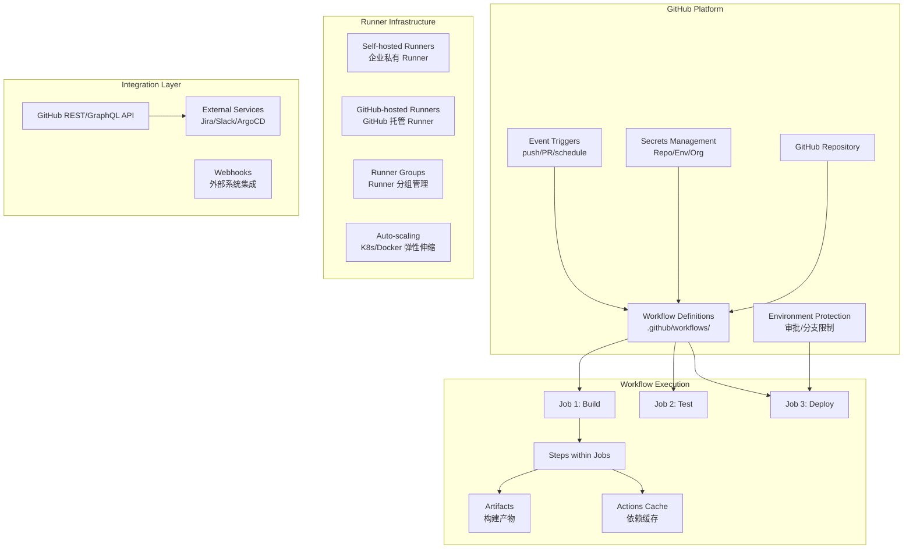

# GitHub Actions Enterprise CI/CD Platform 深度实践

> **作者**: DevOps架构专家 | **版本**: v2.0 | **更新时间**: 2026-04-24
> **适用场景**: 企业级 GitHub Actions 工作流自动化 | **复杂度**: ⭐⭐⭐⭐
> **适用版本**: GitHub Enterprise Server 3.14+ / GitHub.com

---

<!-- chunk: 📋 目录 -->## 📋 目录

- [一、概述](#一概述)
- [二、架构设计](#二架构设计)
- [三、核心配置](#三核心配置)
- [四、安全与合规](#四安全与合规)
- [五、多环境管理策略](#五多环境管理策略)
- [六、监控与回滚](#六监控与回滚)
- [七、最佳实践](#七最佳实践)
- [八、故障排查](#八故障排查)

---

<!-- chunk: 一、概述 -->## 一、概述

GitHub Actions 是 GitHub 原生的 CI/CD 自动化平台，于 2019 年正式发布，迅速成为开发者最广泛使用的 CI/CD 工具之一。它通过 YAML 工作流文件（`.github/workflows/*.yml`）定义自动化流程，与 GitHub 的代码管理、Pull Request、Issue 等功能深度集成，提供了一站式的开发者体验。

GitHub Actions 的核心设计理念是"事件驱动"——每个工作流由 GitHub 事件（push、pull_request、schedule、workflow_dispatch 等）触发，通过 Job 和 Step 组成执行图。Runner 是工作流的执行环境，GitHub 提供了托管的 Runner（GitHub-hosted），也支持自托管 Runner（Self-hosted）用于需要特殊硬件或网络要求的场景。

在企业级场景中，GitHub Actions 提供了丰富的安全和治理能力：Environment Protection Rules（环境保护规则）支持必需的审查人、等待计时器和部署分支策略；[[Secrets|Secrets]]ts Management|Secrets Management]]（密钥管理）支持仓库、环境和组织级别的密钥；OpenID Connect (OIDC) 支持与云提供商的无密钥认证；GitHub Advanced Security (GHAS) 提供代码扫描、密钥扫描和依赖审查。

本文档系统性地覆盖了 GitHub Actions 的企业级架构设计、工作流开发模式、安全加固、性能优化和运维管理，帮助企业构建安全、高效的 CI/CD 自动化平台。

---

<!-- chunk: 二、架构设计 -->## 二、架构设计

#<!-- chunk: 2.1 核心组件架构 -->## 2.1 核心组件架构



#<!-- chunk: 2.2 企业 Runner 架构 -->## 2.2 企业 Runner 架构

```yaml
github_actions_enterprise:
  runner_groups:
    linux_build:
      name: "linux-build"
      visibility: "selected"
      selected_repositories: ["org/backend-api", "org/worker-service"]
      runners:
        - labels: ["ubuntu-22.04", "build", "docker", "large"]
          os: "linux"
          capacity: 8
          resources:
            cpu: 4
            memory: 16Gi

    linux_deploy:
      name: "linux-deploy"
      visibility: "all"
      runners:
        - labels: ["ubuntu-22.04", "deploy", "kubectl", "helm"]
          os: "linux"
          capacity: 4

    windows_dotnet:
      name: "windows-dotnet"
      visibility: "selected"
      runners:
        - labels: ["windows-2022", "dotnet", "build"]
          os: "windows"
          capacity: 4

  security_policies:
    secret_scanning:
      enabled: true
      push_protection: true
    dependency_review:
      enabled: true
      fail_on_severity: "high"
    ip_allowlist:
      enabled: true
      allowed_ips:
        - "10.0.0.0/8"
        - "172.16.0.0/12"
```

#<!-- chunk: 2.3 自托管 Runner [[Kubernetes|Kubernetes]] 部署 -->## 2.3 自托管 Runner Kubernetes 部署

```yaml
# actions-runner-controller (ARC) 部署
apiVersion: actions-runner-controller/apps/v1alpha1
kind: RunnerDeployment
metadata:
  name: github-runner
  namespace: actions-runner
spec:
  replicas: 3
  template:
    spec:
      organization: your-organization
      labels:
        - ubuntu-22.04
        - build
        - docker
      containers:
        - name: runner
          image: summerwind/actions-runner:ubuntu-22.04
          env:
            - name: RUNNER_FEATURE_FLAG_EPHEMERAL
              value: "true"
          resources:
            requests:
              cpu: "1"
              memory: "2Gi"
            limits:
              cpu: "2"
              memory: "4Gi"
          volumeMounts:
            - name: docker-sock
              mountPath: /var/run/docker.sock
      volumes:
        - name: docker-sock
          hostPath:
            path: /var/run/docker.sock
---
apiVersion: actions-runner-controller/apps/v1alpha1
kind: HorizontalRunnerAutoscaler
metadata:
  name: github-runner-autoscaler
  namespace: actions-runner
spec:
  scaleTargetRef:
    name: github-runner
  minReplicas: 2
  maxReplicas: 10
  metrics:
    - type: TotalNumberOfQueuedAndInProgressWorkflowRuns
      repositoryNames:
        - your-organization/your-repo
```

---

<!-- chunk: 三、核心配置 -->## 三、核心配置

#<!-- chunk: 3.1 企业级 CI/CD 工作流 -->## 3.1 企业级 CI/CD 工作流

```yaml
# .github/workflows/enterprise-ci-cd.yml
name: Enterprise CI/CD Pipeline

on:
  push:
    branches: [main, release/*]
  pull_request:
    branches: [main]
  workflow_dispatch:
    inputs:
      deploy_environment:
        description: 'Deployment environment'
        required: false
        default: 'staging'
        type: choice
        options:
          - staging
          - production

env:
  REGISTRY: ghcr.io
  IMAGE_NAME: ${{ github.repository }}
  NODE_VERSION: '20.x'

jobs:
  security-scan:
    name: Security Scanning
    runs-on: ubuntu-latest
    permissions:
      security-events: write
      actions: read
      contents: read
    steps:
      - uses: actions/checkout@v4

      - name: Run CodeQL Analysis
        uses: github/codeql-action/analyze@v3
        with:
          languages: javascript, python

      - name: Dependency Review
        uses: actions/dependency-review-action@v4
        with:
          fail-on-severity: high
          deny-licenses: GPL-3.0, AGPL-3.0

      - name: Secret Scanning
        uses: trufflesecurity/trufflehog@main
        with:
          extra_args: --only-verified

  build-and-test:
    name: Build & Test
    needs: security-scan
    runs-on: [self-hosted, linux, build]
    strategy:
      matrix:
        node-version: [18.x, 20.x, 22.x]
    steps:
      - uses: actions/checkout@v4

      - name: Setup Node.js ${{ matrix.node-version }}
        uses: actions/setup-node@v4
        with:
          node-version: ${{ matrix.node-version }}
          cache: 'npm'

      - name: Install dependencies
        run: npm ci --audit=false

      - name: Lint
        run: npm run lint

      - name: Unit Tests
        run: npm run test:unit -- --coverage

      - name: Integration Tests
        run: npm run test:integration

      - name: Upload Coverage
        if: matrix.node-version == '20.x'
        uses: codecov/codecov-action@v4
        with:
          file: ./coverage/lcov.info
          token: ${{ secrets.CODECOV_TOKEN }}

  build-container:
    name: Build Container Image
    needs: build-and-test
    runs-on: [self-hosted, linux, docker]
    permissions:
      packages: write
      contents: read
    outputs:
      image-tag: ${{ steps.meta.outputs.version }}
      image-digest: ${{ steps.build.outputs.digest }}
    steps:
      - uses: actions/checkout@v4

      - name: Set up Docker Buildx
        uses: docker/setup-buildx-action@v3

      - name: Login to GHCR
        uses: docker/login-action@v3
        with:
          registry: ${{ env.REGISTRY }}
          username: ${{ github.actor }}
          password: ${{ secrets.GITHUB_TOKEN }}

      - name: Extract metadata
        id: meta
        uses: docker/metadata-action@v5
        with:
          images: ${{ env.REGISTRY }}/${{ env.IMAGE_NAME }}
          tags: |
            type=ref,event=branch
            type=ref,event=pr
            type=sha,prefix={{branch}}-
            type=raw,value=latest,enable={{is_default_branch}}
            type=semver,pattern={{version}}

      - name: Build and push
        id: build
        uses: docker/build-push-action@v5
        with:
          context: .
          push: true
          tags: ${{ steps.meta.outputs.tags }}
          labels: ${{ steps.meta.outputs.labels }}
          cache-from: type=gha
          cache-to: type=gha,mode=max
          sbom: true
          provenance: true

      - name: Scan container image
        uses: aquasecurity/trivy-action@master
        with:
          image-ref: ${{ env.REGISTRY }}/${{ env.IMAGE_NAME }}@${{ steps.build.outputs.digest }}
          severity: 'HIGH,CRITICAL'
          exit-code: '1'

  deploy-staging:
    name: Deploy to Staging
    needs: build-container
    runs-on: ubuntu-latest
    environment: staging
    if: github.ref == 'refs/heads/main'
    steps:
      - uses: actions/checkout@v4

      - name: Setup kubectl
        uses: azure/setup-kubectl@v3
        with:
          version: 'v1.29.0'

      - name: Configure kubectl
        run: |
          mkdir -p $HOME/.kube
          echo "${{ secrets.KUBE_CONFIG_STAGING }}" | base64 -d > $HOME/.kube/config

      - name: Deploy
        run: |
          helm upgrade --install ${{ github.event.repository.name }} ./helm \
            --set image.tag=${{ needs.build-container.outputs.image-tag }} \
            --set image.digest=${{ needs.build-container.outputs.image-digest }} \
            --set environment=staging \
            --namespace staging \
            --atomic \
            --timeout 10m

      - name: Smoke Test
        run: |
          sleep 30
          STATUS=$(curl -s -o /dev/null -w "%{http_code}" https://staging.example.com/health)
          if [ "$STATUS" != "200" ]; then
            echo "Smoke test failed with status $STATUS"
            exit 1
          fi

  deploy-production:
    name: Deploy to Production
    needs: deploy-staging
    runs-on: ubuntu-latest
    environment: production
    if: github.ref == 'refs/heads/main'
    steps:
      - uses: actions/checkout@v4

      - name: Configure kubectl
        run: |
          mkdir -p $HOME/.kube
          echo "${{ secrets.KUBE_CONFIG_PRODUCTION }}" | base64 -d > $HOME/.kube/config

      - name: Deploy
        run: |
          helm upgrade --install ${{ github.event.repository.name }} ./helm \
            --set image.tag=${{ needs.build-container.outputs.image-tag }} \
            --set image.digest=${{ needs.build-container.outputs.image-digest }} \
            --set environment=production \
            --namespace production \
            --atomic \
            --timeout 15m

      - name: Verify Deployment
        run: |
          kubectl rollout status deployment/${{ github.event.repository.name }} \
            -n production --timeout=5m
```

#<!-- chunk: 3.2 可复用工作流 -->## 3.2 可复用工作流

```yaml
# .github/workflows/reusable-security-scan.yml
name: Reusable Security Scan
on:
  workflow_call:
    inputs:
      language:
        required: false
        type: string
        default: 'javascript'
      severity:
        required: false
        type: string
        default: 'high'
    outputs:
      scan-result:
        description: "Security scan result"
        value: ${{ jobs.scan.outputs.result }}
    secrets:
      token:
        required: false

jobs:
  scan:
    runs-on: ubuntu-latest
    outputs:
      result: ${{ steps.result.outputs.status }}
    permissions:
      security-events: write
    steps:
      - uses: actions/checkout@v4

      - name: CodeQL Analysis
        uses: github/codeql-action/analyze@v3
        with:
          languages: ${{ inputs.language }}

      - name: Dependency Review
        uses: actions/dependency-review-action@v4
        with:
          fail-on-severity: ${{ inputs.severity }}

      - id: result
        run: echo "status=passed" >> $GITHUB_OUTPUT
```

```yaml
# 使用可复用工作流
# .github/workflows/call-security.yml
name: Call Security Scan
on: [push, pull_request]

jobs:
  security:
    uses: ./.github/workflows/reusable-security-scan.yml
    with:
      language: 'javascript'
      severity: 'high'
```

#<!-- chunk: 3.3 Composite Action -->## 3.3 Composite Action

```yaml
# .github/actions/setup-build/action.yml
name: 'Setup Build Environment'
description: 'Setup Node.js, install dependencies, and configure cache'
inputs:
  node-version:
    description: 'Node.js version'
    required: false
    default: '20.x'
runs:
  using: 'composite'
  steps:
    - name: Setup Node.js
      uses: actions/setup-node@v4
      with:
        node-version: ${{ inputs.node-version }}
        cache: 'npm'

    - name: Install dependencies
      shell: bash
      run: npm ci --audit=false

    - name: Cache build artifacts
      uses: actions/cache@v4
      with:
        path: |
          ~/.npm
          ./node_modules
          ./dist
        key: ${{ runner.os }}-node-${{ inputs.node-version }}-${{ hashFiles('package-lock.json') }}
        restore-keys: |
          ${{ runner.os }}-node-${{ inputs.node-version }}-
```

---

<!-- chunk: 四、安全与合规 -->## 四、安全与合规

#<!-- chunk: 4.1 安全加固 -->## 4.1 安全加固

```yaml
# .github/dependabot.yml
version: 2
updates:
  - package-ecosystem: "npm"
    directory: "/"
    schedule:
      interval: "daily"
    open-pull-requests-limit: 10
    reviewers:
      - "security-team"
    labels:
      - "dependencies"
      - "security"
    commit-message:
      prefix: "deps"

  - package-ecosystem: "docker"
    directory: "/"
    schedule:
      interval: "weekly"

  - package-ecosystem: "github-actions"
    directory: "/"
    schedule:
      interval: "weekly"
```

#<!-- chunk: 4.2 OIDC 云提供商认证 -->## 4.2 OIDC 云提供商认证

```yaml
# AWS OIDC 认证 (无长期密钥)
jobs:
  deploy-aws:
    runs-on: ubuntu-latest
    permissions:
      id-token: write
      contents: read
    steps:
      - name: Configure AWS Credentials
        uses: aws-actions/configure-aws-credentials@v4
        with:
          role-to-assume: arn:aws:iam::123456789012:role/GitHubActionsDeploy
          aws-region: us-east-1

      - name: Deploy to EKS
        run: |
          aws eks update-kubeconfig --name production
          kubectl apply -f k8s/

# GCP OIDC 认证
jobs:
  deploy-gcp:
    runs-on: ubuntu-latest
    permissions:
      id-token: write
      contents: read
    steps:
      - name: Authenticate to GCP
        uses: google-github-actions/auth@v2
        with:
          workload_identity_provider: projects/123/locations/global/workloadIdentityPools/github/providers/github
          service_account: github-actions@project.iam.gserviceaccount.com

      - name: Deploy to GKE
        uses: google-github-actions/get-gke-credentials@v2
        with:
          cluster_name: production
          location: us-central1
```

#<!-- chunk: 4.3 Environment Protection Rules -->## 4.3 Environment Protection Rules

```yaml
# 环境保护规则配置 (GitHub UI / API)
environments:
  production:
    wait_timer: 1440
    reviewers:
      teams: ["production-approvers"]
    deployment_branch_policy:
      protected_branches: true
      custom_branch_policies:
        - "release/*"
        - "hotfix/*"
    secrets:
      KUBE_CONFIG: ${{ secrets.KUBE_CONFIG_PRODUCTION }}
      DB_PASSWORD: ${{ secrets.PROD_DB_PASSWORD }}
    variables:
      DEPLOY_TIMEOUT: "300"
      HEALTH_CHECK_ENDPOINT: "/health"
      REPLICAS: "3"

  staging:
    wait_timer: 60
    reviewers:
      teams: ["staging-approvers"]
    deployment_branch_policy:
      protected_branches: true
    variables:
      DEPLOY_TIMEOUT: "120"
      REPLICAS: "1"
```

---

<!-- chunk: 五、多环境管理策略 -->## 五、多环境管理策略

#<!-- chunk: 5.1 环境矩阵部署 -->## 5.1 环境矩阵部署

```yaml
# 矩阵化多环境部署
jobs:
  deploy:
    strategy:
      matrix:
        include:
          - environment: development
            cluster: dev-cluster
            namespace: dev
            replicas: 1
          - environment: staging
            cluster: staging-cluster
            namespace: staging
            replicas: 2
          - environment: production
            cluster: prod-cluster
            namespace: production
            replicas: 3
    runs-on: ubuntu-latest
    environment: ${{ matrix.environment }}
    if: |
      (matrix.environment == 'development' && github.ref == 'refs/heads/develop') ||
      (matrix.environment == 'staging' && github.ref == 'refs/heads/main') ||
      (matrix.environment == 'production' && startsWith(github.ref, 'refs/tags/v'))
    steps:
      - name: Deploy to ${{ matrix.environment }}
        run: |
          helm upgrade --install ${{ github.event.repository.name }} ./helm \
            --set image.tag=${{ github.sha }} \
            --set replicaCount=${{ matrix.replicas }} \
            --namespace ${{ matrix.namespace }} \
            --kube-context ${{ matrix.cluster }} \
            --atomic
```

#<!-- chunk: 5.2 GitOps 集成 -->## 5.2 GitOps 集成

```yaml
# GitHub Actions + Argo CD / Flux GitOps 集成
jobs:
  update-gitops:
    runs-on: ubuntu-latest
    steps:
      - name: Checkout GitOps repo
        uses: actions/checkout@v4
        with:
          repository: org/gitops-manifests
          token: ${{ secrets.GITOPS_PAT }}
          ref: main

      - name: Update image tag
        run: |
          cd apps/${{ github.event.repository.name }}/overlays/production
          kustomize edit set image app=ghcr.io/${{ github.repository }}:${{ github.sha }}

      - name: Commit and push
        run: |
          git config user.name "GitHub Actions"
          git config user.email "actions@github.com"
          git add .
          git commit -m "Update ${{ github.event.repository.name }} to ${{ github.sha }}"
          git push origin main
```

---

<!-- chunk: 六、监控与回滚 -->## 六、监控与回滚

#<!-- chunk: 6.1 工作流性能监控 -->## 6.1 工作流性能监控

```yaml
# .github/workflows/metrics.yml
name: Workflow Metrics
on:
  workflow_run:
    workflows: ["Enterprise CI/CD Pipeline"]
    types: [completed]

jobs:
  metrics:
    runs-on: ubuntu-latest
    steps:
      - name: Collect metrics
        uses: github/actions-workflow-metrics@v1
        with:
          github-token: ${{ secrets.GITHUB_TOKEN }}
          slack-webhook: ${{ secrets.SLACK_WEBHOOK }}
```

#<!-- chunk: 6.2 回滚策略 -->## 6.2 回滚策略

```bash
# 方式一: 重新运行成功的工作流
gh run rerun <run-id> --repo org/repo

# 方式二: 回滚 GitOps 清单
git revert <commit-hash>
git push origin main

# 方式三: 手动部署旧版本
helm rollback <release> <revision> -n production

# 方式四: dispatch 触发特定版本部署
gh workflow run deploy.yml \
  --repo org/repo \
  -f image-tag=v1.2.3
```

---

<!-- chunk: 七、最佳实践 -->## 七、最佳实践

#<!-- chunk: 7.1 工作流设计原则 -->## 7.1 工作流设计原则

```yaml
1. 安全优先:
   - 使用 OIDC 替代长期密钥
   - 所有 Job 设置最小 permissions
   - 使用 hashVersions 固定 Action 版本
   - 启用 CodeQL 和 Dependabot

2. 性能优化:
   - 使用缓存 (actions/cache)
   - 并行化独立 Job
   - 使用 Docker layer 缓存
   - 精简 Runner 镜像

3. 可维护性:
   - 使用 Reusable Workflow 和 Composite Action
   - 使用 Matrix 策略减少重复
   - 统一的工作流模板
   - CI/CD 配置与代码一同审查

4. 可靠性:
   - 设置合理的 timeout
   - 实现重试机制
   - 完善的失败通知
   - 构建产物 (SBOM/Provenance) 可追溯
```

#<!-- chunk: 7.2 性能优化脚本 -->## 7.2 性能优化脚本

```bash
#!/bin/bash
# Runner 维护脚本

# 清理 Docker 缓存
docker system prune -af --volumes

# 清理构建缓存
rm -rf /tmp/_github_actions_*
rm -rf /tmp/github_actions_*

# 清理 npm/pip 缓存
npm cache clean --force 2>/dev/null
pip cache purge 2>/dev/null

# 磁盘空间检查
DISK_USAGE=$(df -h / | awk 'NR==2 {print $5}' | sed 's/%//')
if [ "$DISK_USAGE" -gt 85 ]; then
    echo "WARNING: Disk usage at ${DISK_USAGE}%"
fi
```

---

<!-- chunk: 八、故障排查 -->## 八、故障排查

#<!-- chunk: 8.1 常见问题 -->## 8.1 常见问题

```yaml
工作流不触发:
  排查: 检查 on 事件配置、分支过滤、路径过滤
  解决: 确认 YAML 语法、检查 if 条件表达式

Runner 离线:
  排查: 检查 Runner 服务状态、网络连通性
  解决:
    - 自托管: systemctl status actions.runner.*
    - ARC: kubectl get pods -n actions-runner
    - 检查 GitHub API 连接

Job 被跳过:
  排查: 检查 if 条件、needs 依赖、environment rules
  解决: 验证条件表达式、检查前置 Job 状态

密钥无法访问:
  排查: 检查密钥作用域 (repo/env/org)
  解决: 确认 Environment 配置、检查 permissions

缓存不命中:
  排查: 检查 cache key、分支缓存可见性
  解决:
    - 确保 key 包含依赖哈希
    - 只有 main 分支的缓存对所有分支可见
```

#<!-- chunk: 8.2 调试技巧 -->## 8.2 调试技巧

```yaml
# 调试工作流
jobs:
  debug:
    runs-on: ubuntu-latest
    steps:
      - name: Debug context
        run: |
          echo "Event: ${{ github.event_name }}"
          echo "Ref: ${{ github.ref }}"
          echo "SHA: ${{ github.sha }}"
          echo "Actor: ${{ github.actor }}"
          env | sort

      - name: Debug with tmate
        if: failure()
        uses: mxschmitt/action-tmate@v3
        timeout-minutes: 15
```

<!-- chunk: 九、GitHub Actions 高级模式 -->## 九、GitHub Actions 高级模式

#<!-- chunk: 9.1 可复用工作流设计模式 -->## 9.1 可复用工作流设计模式

可复用工作流（Reusable Workflows）是 GitHub Actions 实现跨仓库代码复用的核心机制。一个设计良好的可复用工作流可以将企业级的 CI/CD 标准流程封装成一个可参数化的模板，多个仓库可以引用同一个工作流定义。这种模式确保了所有项目遵循统一的安全标准、质量门禁和部署流程，同时减少了重复配置。

```yaml
# .github/workflows/reusable-ci.yml
name: Reusable CI Pipeline
on:
  workflow_call:
    inputs:
      node-version:
        required: false
        type: string
        default: '20.x'
      run-integration-tests:
        required: false
        type: boolean
        default: true
      deploy-environment:
        required: false
        type: string
        default: 'staging'
    outputs:
      image-tag:
        description: "Built image tag"
        value: ${{ jobs.build.outputs.image-tag }}
    secrets:
      registry-token:
        required: true

jobs:
  build:
    runs-on: ubuntu-latest
    outputs:
      image-tag: ${{ steps.meta.outputs.version }}
    steps:
      - uses: actions/checkout@v4
      - uses: actions/setup-node@v4
        with:
          node-version: ${{ inputs.node-version }}
          cache: 'npm'
      - run: npm ci
      - run: npm run build
      - run: npm run test:unit

      - name: Build and push image
        uses: docker/build-push-action@v5
        with:
          push: true
          tags: ghcr.io/${{ github.repository }}:${{ github.sha }}
          cache-from: type=gha
          cache-to: type=gha,mode=max
```

#<!-- chunk: 9.2 矩阵策略高级配置 -->## 9.2 矩阵策略高级配置

矩阵策略（Matrix Strategy）允许在多个配置组合下并行执行工作流。结合 `include` 和 `exclude` 指令，可以精确控制哪些组合需要执行，避免不必要的构建。

```yaml
# 高级矩阵策略
jobs:
  test-matrix:
    strategy:
      fail-fast: false
      max-parallel: 8
      matrix:
        include:
          - node: 18
            os: ubuntu-latest
            experimental: false
          - node: 20
            os: ubuntu-latest
            experimental: false
          - node: 22
            os: ubuntu-latest
            experimental: true
          - node: 20
            os: windows-latest
            experimental: false
          - node: 20
            os: macos-latest
            experimental: false
    runs-on: ${{ matrix.os }}
    continue-on-error: ${{ matrix.experimental }}
    steps:
      - uses: actions/setup-node@v4
        with:
          node-version: ${{ matrix.node }}
      - run: npm ci && npm test
```

#<!-- chunk: 9.3 环境保护与合规流水线 -->## 9.3 环境保护与合规流水线

环境保护规则是 GitHub Actions 企业安全的核心机制。通过配置环境保护规则，可以实现强制审批、等待计时器和部署分支策略，确保生产部署的安全性和可审计性。

```yaml
# 合规流水线 - 强制质量门禁
name: Compliance Pipeline
on:
  push:
    branches: [main]

jobs:
  compliance-check:
    runs-on: ubuntu-latest
    steps:
      - uses: actions/checkout@v4
        with:
          fetch-depth: 0

      - name: Check commit signatures
        run: |
          git log --format='%H %G?' origin/main~10..origin/main | while read hash status; do
            if [ "$status" != "G" ] && [ "$status" != "E" ]; then
              echo "Unsigned commit found: $hash (status: $status)"
              exit 1
            fi
          done

      - name: Verify SBOM exists
        run: |
          if [ ! -f "sbom.json" ]; then
            echo "SBOM not found, generating..."
            syft dir:./ -o cyclonedx-json > sbom.json
          fi

      - name: Security scan summary
        uses: github/codeql-action/analyze@v3
        with:
          category: compliance

  deploy-with-approval:
    needs: compliance-check
    runs-on: ubuntu-latest
    environment: production
    steps:
      - name: Deploy
        run: echo "Deploying with compliance approval"
```

#<!-- chunk: 9.4 自托管 Runner 弹性伸缩 -->## 9.4 自托管 Runner 弹性伸缩

在企业环境中，自托管 Runner 的弹性伸缩是控制成本和保障构建性能的关键。actions-runner-controller（ARC）是社区推荐的 Kubernetes Runner 管理方案，它通过 HorizontalRunnerAutoscaler 根据 GitHub Actions 队列深度自动调整 Runner 数量。

```yaml
# ARC 自动伸缩配置
apiVersion: actions-runner-controller/apps/v1alpha1
kind: HorizontalRunnerAutoscaler
metadata:
  name: runner-autoscaler
  namespace: actions-runner
spec:
  scaleTargetRef:
    name: github-runner
  minReplicas: 2
  maxReplicas: 20
  scaleUpTriggers:
    - githubEvent:
        workflowJob: {}
      duration: "30m"
  metrics:
    - type: TotalNumberOfQueuedAndInProgressWorkflowRuns
      repositoryNames:
        - your-org/your-repo
```

#<!-- chunk: 9.5 GitHub Actions 与 Argo CD 集成 -->## 9.5 GitHub Actions 与 Argo CD 集成

GitHub Actions 与 Argo CD 的集成是企业级 GitOps 的最佳实践之一。在这种模式下，GitHub Actions 负责代码构建、测试和镜像推送，然后将镜像标签更新提交到 GitOps 清单仓库。Argo CD 检测到清单变更后自动同步部署。

```yaml
# GitHub Actions → GitOps 集成
name: Update GitOps
on:
  workflow_run:
    workflows: ["Enterprise CI/CD Pipeline"]
    types: [completed]
    branches: [main]

jobs:
  update-gitops:
    if: ${{ github.event.workflow_run.conclusion == 'success' }}
    runs-on: ubuntu-latest
    steps:
      - name: Checkout GitOps repo
        uses: actions/checkout@v4
        with:
          repository: org/gitops-manifests
          token: ${{ secrets.GITOPS_PAT }}
          ref: main

      - name: Update image tag
        run: |
          cd apps/${{ github.event.repository.name }}/overlays/production
          kustomize edit set image app=ghcr.io/${{ github.event.repository.full_name }}:${{ github.event.workflow_run.head_sha }}

      - name: Commit and push
        run: |
          git config user.name "GitHub Actions"
          git config user.email "actions@github.com"
          git add .
          git commit -m "Update ${{ github.event.repository.name }} to ${{ github.event.workflow_run.head_sha }}"
          git push origin main
```

---

<!-- chunk: 十、GitHub Actions 企业治理 -->## 十、GitHub Actions 企业治理

#<!-- chunk: 10.1 组织级策略管理 -->## 10.1 组织级策略管理

GitHub Enterprise 提供了组织级别的策略管理能力，可以统一控制所有仓库的工作流权限、Secret 访问范围和 Action 使用策略。通过合理的组织级策略配置，可以确保所有团队遵循统一的安全标准，同时保持足够的灵活性。

```yaml
# 组织级策略配置 (GitHub Enterprise)
organization_policies:
  actions_permissions:
    allowed_actions: "selected"
    selected_actions:
      - "actions/*"
      - "github/*"
      - "docker/*"
      - "aws-actions/*"
    
  workflow_permissions:
    default: "read"
    can_approve_pull_requests: false
    
  fork_pr_workflows:
    require_approval: true
    retention_days: 30
    
  artifacts:
    retention_days: 90
    maximum_size: "10GB"
```

#<!-- chunk: 10.2 审计与合规 -->## 10.2 审计与合规

GitHub Enterprise 的审计日志记录了所有组织级别的操作，包括工作流执行、Secret 访问和环境部署。结合 GitHub 的 Compliance API，可以实现自动化的合规检查和报告生成。

```bash
# 查询组织审计日志
gh api orgs/{org}/audit-log \
  --method GET \
  -f phrase="action:workflows" \
  -f per_page=100

# 查看工作流使用统计
gh api orgs/{org}/actions/permissions
```

---

*本文档基于企业级 GitHub Actions 实践经验编写，持续更新最新技术和最佳实践。*

---

<!-- chunk: Obsidian 相关文档 -->## Obsidian 相关文档

- domain-08-release-change-management KUDIG Database — Global MOC
- [[domain-08-release-change-management/README|Domain 23: GitOps与CI/CD (GitOps & CI/CD)]]
- Domain-23 GitOps & CI/CD — 开源项目索引
- Argo CD企业级GitOps实践指南
- Jenkins企业级CI/CD流水线深度实践
- GitLab CI/CD 企业级流水线自动化平台
- Tekton 云原生 CI/CD 深度实践
- Flux v2 GitOps 持续交付深度实践
- GitOps 安全与合规深度实践
- CI/CD 流水线模式与渐进式交付深度实践
- Argo CD 企业级 GitOps 实践指南
- Flux GitOps 实践指南

## See Also

- 02-jenkins-enterprise-cicd
- 03-gitlab-enterprise-cicd
- 05-tekton-cloud-native-cicd
- 06-flux-gitops-continuous-delivery

## Related

- [[domain-19-landscape-references/topic-index/gitops-cicd-index|GitOps / CI-CD 全局索引]]
