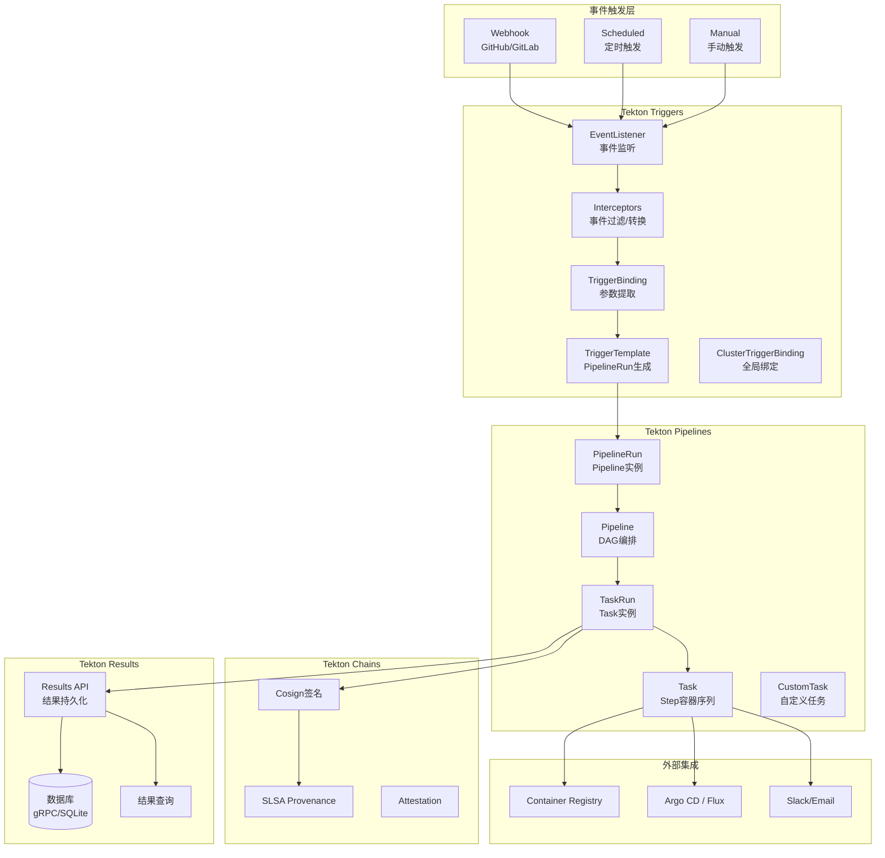

# Tekton 云原生 CI/CD 深度实践

> **适用版本**: Tekton Pipelines v0.68 / Triggers v0.30 / Chains v0.23 / Dashboard v0.45
> **最后更新**: 2026-04-24
> **难度**: 中级 → 高级

---

<!-- chunk: 📋 目录 -->## 📋 目录

- [一、概述](#一概述)
- [二、架构设计](#二架构设计)
- [三、核心配置](#三核心配置)
- [四、安全与合规](#四安全与合规)
- [五、多环境管理策略](#五多环境管理策略)
- [六、监控与回滚](#六监控与回滚)
- [七、最佳实践](#七最佳实践)
- [八、故障排查](#八故障排查)

---

<!-- chunk: 一、概述 -->## 一、概述

Tekton 是由 Continuous Delivery Foundation (CDF) 托管的云原生 CI/CD 框架，它的设计理念是将 CI/CD 流水线分解为完全声明式、[[Kubernetes|Kubernetes]] 原生的资源对象。每个构建步骤在独立的容器中执行（Step → Container），多个步骤组成一个 Task（Task → Pod），多个 Task 组成有向无环图 Pipeline（Pipeline → DAG），Pipeline 由 PipelineRun 实例化执行。这种分层设计使得 Tekton 具有极高的可组合性和可复用性。

Tekton 在云原生技术栈中的定位是"CI 层"——负责代码检出、编译构建、测试执行、镜像推送和签名。CD 层（部署和发布）通常由 [[Argo|Argo]] CD 或 [[Flux|Flux]] 等 GitOps 工具处理。Tekton + Argo CD 的组合已成为云原生 CI/CD 的标准模式：Tekton 负责将源代码转化为可部署制品（容器镜像），Argo CD 负责将制品部署到 Kubernetes 集群。

Tekton 的技术优势包括：完全 Kubernetes 原生（所有资源都是 CRD，可以通过 kubectl 管理）；不可变执行（每个 TaskRun 创建独立的 Pod，构建环境完全隔离）；声明式配置（YAML 定义，GitOps 友好）；供应链安全（Tekton Chains 支持 SLSA Level 3 证明和 Cosign 签名）；社区生态（Tekton Hub 提供 100+ 预制 Task）。

本指南深入探讨 Tekton 的核心组件、高级配置模式、Triggers 事件驱动、Chains 供应链安全、Results API 执行结果持久化，以及与 Argo CD 的 GitOps 集成最佳实践。

---

<!-- chunk: 二、架构设计 -->## 二、架构设计

#<!-- chunk: 2.1 Tekton 组件全景图 -->## 2.1 Tekton 组件全景图



#<!-- chunk: 2.2 核心概念详解 -->## 2.2 核心概念详解

```yaml
Tekton资源层次:
  Step:
    描述: 最小执行单元，对应一个容器
    生命周期: 随 TaskRun Pod 创建和销毁
    数据传递: 通过 Workspace (Volume) 和 Results (文件)

  Task:
    描述: Step 的有序序列，定义在单个 Pod 中
    特性:
      - params: 参数化输入
      - results: 输出结果 (通过文件传递)
      - workspaces: 数据共享 (Volume 挂载)
      - volumes: 存储卷定义

  TaskRun:
    描述: Task 的一次执行实例
    特性:
      - 创建一个 Pod 执行 Task
      - 记录执行状态和结果
      - 绑定实际的参数和工作区

  Pipeline:
    描述: Task 的有向无环图 (DAG)
    特性:
      - tasks: 定义 Task 引用和依赖
      - runAfter: 串行依赖
      - when: 条件执行
      - params/results: 管道级参数传递
      - finally: 最终执行的任务

  PipelineRun:
    描述: Pipeline 的一次执行实例
    特性:
      - 创建多个 TaskRun
      - 管理 Workspace 绑定
      - 超时控制
      - 状态跟踪

  CustomTask:
    描述: 自定义任务类型
    示例: 等待审批、运行 Matrix 测试
```

---

<!-- chunk: 三、核心配置 -->## 三、核心配置

#<!-- chunk: 3.1 生产级安装 -->## 3.1 生产级安装

```bash
# 安装 Tekton Pipelines
kubectl apply -f https://storage.googleapis.com/tekton-releases/pipeline/latest/release.yaml

# 安装 Tekton Triggers
kubectl apply -f https://storage.googleapis.com/tekton-releases/triggers/latest/release.yaml
kubectl apply -f https://storage.googleapis.com/tekton-releases/triggers/latest/interceptors.yaml

# 安装 Tekton Chains (供应链安全)
kubectl apply -f https://storage.googleapis.com/tekton-releases/chains/latest/release.yaml

# 安装 Tekton Dashboard (可选)
kubectl apply -f https://storage.googleapis.com/tekton-releases/dashboard/latest/release.yaml

# 安装 Tekton Results (可选 - 执行结果持久化)
kubectl apply -f https://storage.googleapis.com/tekton-releases/results/latest/release.yaml

# 验证
kubectl get pods -n tekton-pipelines
kubectl get pods -n tekton-chains
```

#<!-- chunk: 3.2 生产级默认配置 -->## 3.2 生产级默认配置

```yaml
apiVersion: v1
kind: ConfigMap
metadata:
  name: config-defaults
  namespace: tekton-pipelines
data:
  default-timeout-minutes: "60"
  default-service-account: "tekton-pipeline"
  default-managed-by-label-value: "tekton-pipelines"
  default-pod-template: |
    securityContext:
      runAsNonRoot: true
      seccompProfile:
        type: RuntimeDefault
    topologySpreadConstraints:
      - maxSkew: 1
        topologyKey: kubernetes.io/hostname
        whenUnsatisfiable: DoNotSchedule
        labelSelector:
          matchLabels:
            app.kubernetes.io/managed-by: tekton-pipelines
---
apiVersion: v1
kind: ConfigMap
metadata:
  name: feature-flags
  namespace: tekton-pipelines
data:
  enable-api-fields: "beta"
  embedded-status: "full"
  keep-pod-on-cancel: "false"
  require-git-ssh-secret-known-hosts: "true"
```

#<!-- chunk: 3.3 Pipeline 详解 (DAG 编排) -->## 3.3 Pipeline 详解 (DAG 编排)

```yaml
apiVersion: tekton.dev/v1
kind: Pipeline
metadata:
  name: full-ci-cd
  namespace: cicd
spec:
  description: "完整的 CI/CD 流水线"

  params:
    - name: git-url
      type: string
    - name: git-revision
      type: string
      default: main
    - name: image
      type: string
    - name: deploy-env
      type: string
      default: staging

  workspaces:
    - name: shared-source
      description: "源代码工作区"
    - name: cache
      description: "构建缓存"
    - name: dockerconfig
      description: "Registry 凭证"
      optional: true
    - name: gitops-config
      description: "GitOps 配置"

  results:
    - name: image-digest
      description: "镜像 Digest"
      value: $(tasks.build-image.results.IMAGE_DIGEST)

  tasks:
    # 阶段1: 代码检出
    - name: clone
      taskRef:
        name: git-clone
        kind: ClusterTask
      workspaces:
        - name: output
          workspace: shared-source
      params:
        - name: url
          value: $(params.git-url)
        - name: revision
          value: $(params.git-revision)

    # 阶段2: 并行执行 lint 和测试
    - name: lint
      runAfter: [clone]
      taskRef:
        name: golangci-lint
      workspaces:
        - name: source
          workspace: shared-source

    - name: unit-test
      runAfter: [clone]
      taskRef:
        name: go-test
      workspaces:
        - name: source
          workspace: shared-source

    # 阶段3: 构建镜像 (依赖 lint + test)
    - name: build-image
      runAfter: [lint, unit-test]
      taskRef:
        name: kaniko-build
      workspaces:
        - name: source
          workspace: shared-source
        - name: dockerconfig
          workspace: dockerconfig
      params:
        - name: IMAGE
          value: $(params.image)
        - name: EXTRA_ARGS
          value:
            - --cache=true
            - --cache-dir=/cache
            - --snapshot-mode=redo
            - --use-new-run
      results:
        - name: IMAGE_DIGEST

    # 阶段4: 安全扫描 (依赖构建)
    - name: security-scan
      runAfter: [build-image]
      taskRef:
        name: trivy-scanner
        kind: ClusterTask
      params:
        - name: IMAGE
          value: "$(params.image)@$(tasks.build-image.results.IMAGE_DIGEST)"
        - name: SEVERITY
          value: "HIGH,CRITICAL"

    # 阶段5: 条件部署
    - name: deploy
      runAfter: [security-scan]
      when:
        - input: $(params.deploy-env)
          operator: in
          values: ["staging", "production"]
      taskRef:
        name: update-gitops
      workspaces:
        - name: source
          workspace: gitops-config
      params:
        - name: image
          value: "$(params.image)@$(tasks.build-image.results.IMAGE_DIGEST)"
        - name: environment
          value: $(params.deploy-env)

  # finally: 无论成功失败都执行
  finally:
    - name: notify-success
      when:
        - input: $(tasks.status)
          operator: in
          values: ["Succeeded"]
      taskRef:
        name: slack-notify
      params:
        - name: message
          value: "✅ Pipeline succeeded for $(params.git-revision)"

    - name: notify-failure
      when:
        - input: $(tasks.status)
          operator: in
          values: ["Failed"]
      taskRef:
        name: slack-notify
      params:
        - name: message
          value: "❌ Pipeline failed for $(params.git-revision)"

    - name: cleanup
      taskRef:
        name: cleanup-workspace
      workspaces:
        - name: source
          workspace: shared-source
```

#<!-- chunk: 3.4 EventListener 与 Triggers 完整配置 -->## 3.4 EventListener 与 Triggers 完整配置

```yaml
# TriggerTemplate: 定义 PipelineRun 模板
apiVersion: triggers.tekton.dev/v1beta1
kind: TriggerTemplate
metadata:
  name: github-ci-template
  namespace: cicd
spec:
  params:
    - name: git-url
    - name: git-revision
    - name: image-tag
  resourcetemplates:
    - apiVersion: tekton.dev/v1
      kind: PipelineRun
      metadata:
        generateName: ci-cd-
        labels:
          tekton.dev/pipeline: full-ci-cd
          app: $(tt.params.image-tag)
      spec:
        pipelineRef:
          name: full-ci-cd
        params:
          - name: git-url
            value: $(tt.params.git-url)
          - name: git-revision
            value: $(tt.params.git-revision)
          - name: image
            value: "registry.example.com/app:$(tt.params.image-tag)"
          - name: deploy-env
            value: staging
        workspaces:
          - name: shared-source
            volumeClaimTemplate:
              spec:
                accessModes: ["ReadWriteOnce"]
                resources:
                  requests:
                    storage: 1Gi
          - name: cache
            persistentVolumeClaim:
              claimName: build-cache
          - name: dockerconfig
            secret:
              secretName: registry-credentials
          - name: gitops-config
            secret:
              secretName: gitops-credentials
        timeouts:
          pipeline: "1h"
---
# TriggerBinding: 从事件中提取参数
apiVersion: triggers.tekton.dev/v1beta1
kind: TriggerBinding
metadata:
  name: github-push-binding
  namespace: cicd
spec:
  params:
    - name: git-url
      value: $(body.repository.clone_url)
    - name: git-revision
      value: $(body.head_commit.id)
    - name: image-tag
      value: $(body.ref)
---
# ClusterTriggerBinding: 全局事件绑定
apiVersion: triggers.tekton.dev/v1beta1
kind: ClusterTriggerBinding
metadata:
  name: github-push-ctb
spec:
  params:
    - name: git-url
      value: $(body.repository.clone_url)
    - name: git-revision
      value: $(body.after)
---
# EventListener: 事件监听与路由
apiVersion: triggers.tekton.dev/v1beta1
kind: EventListener
metadata:
  name: github-listener
  namespace: cicd
spec:
  serviceAccountName: tekton-triggers
  triggers:
    - name: github-push-main
      interceptors:
        - ref:
            name: github
          params:
            - name: secretRef
              value:
                secretName: github-webhook-secret
                secretKey: secretToken
            - name: eventTypes
              value: ["push"]
        - ref:
            name: cel
          params:
            - name: filter
              value: "body.ref == 'refs/heads/main'"
            - name: overlays
              value:
                - key: truncated_sha
                  expression: "body.head_commit.id.substring(0, 7)"
      bindings:
        - ref: github-push-binding
      template:
        ref: github-ci-template
---
# 暴露 EventListener
apiVersion: networking.k8s.io/v1
kind: Ingress
metadata:
  name: tekton-webhook
  namespace: cicd
spec:
  rules:
  - host: tekton-webhook.example.com
    http:
      paths:
      - path: /
        pathType: Prefix
        backend:
          service:
            name: el-github-listener
            port:
              number: 8080
```

---

<!-- chunk: 四、安全与合规 -->## 四、安全与合规

#<!-- chunk: 4.1 Tekton Chains 供应链安全 -->## 4.1 Tekton Chains 供应链安全

```yaml
# Chains 配置 - SLSA Level 3
apiVersion: v1
kind: ConfigMap
metadata:
  name: chains-config
  namespace: tekton-pipelines
data:
  # 签名配置
  artifacts.taskrun.format: "tekton-provenance"
  artifacts.taskrun.storage: "oci"
  artifacts.taskrun.signer: "x509"

  # OCI 镜像签名
  artifacts.oci.format: "simplesigning"
  artifacts.oci.storage: "oci"
  artifacts.oci.signer: "x509"

  # 透明度日志
  transparency.enabled: "true"
  transparency.url: "https://rekor.sigstore.dev"

  # 构建者身份
  builder.id: "tekton-chains"
```

```bash
# 配置签名密钥
kubectl create secret generic signing-secrets \
  --namespace tekton-pipelines \
  --from-literal=cosign.key=<base64-key> \
  --from-literal=cosign.key.password=<password> \
  --from-literal=cosign.pub=<base64-pub>

# 验证签名
cosign verify registry.example.com/app:v1.2.3
```

#<!-- chunk: 4.2 Pod 安全上下文 -->## 4.2 Pod 安全上下文

```yaml
# 全局安全配置
apiVersion: v1
kind: ConfigMap
metadata:
  name: config-defaults
  namespace: tekton-pipelines
data:
  default-pod-template: |
    securityContext:
      runAsNonRoot: true
      runAsUser: 1001
      fsGroup: 1001
      seccompProfile:
        type: RuntimeDefault
    containers:
      - securityContext:
          allowPrivilegeEscalation: false
          readOnlyRootFilesystem: true
          capabilities:
            drop: ["ALL"]
```

#<!-- chunk: 4.3 RBAC 配置 -->## 4.3 RBAC 配置

```yaml
apiVersion: v1
kind: ServiceAccount
metadata:
  name: tekton-pipeline
  namespace: cicd
---
apiVersion: rbac.authorization.k8s.io/v1
kind: Role
metadata:
  name: tekton-pipeline-role
  namespace: cicd
rules:
  - apiGroups: [""]
    resources: ["configmaps", "secrets"]
    verbs: ["get", "list", "watch"]
  - apiGroups: ["tekton.dev"]
    resources: ["tasks", "pipelines", "taskruns", "pipelineruns"]
    verbs: ["get", "list", "watch", "create", "update", "patch"]
---
apiVersion: rbac.authorization.k8s.io/v1
kind: RoleBinding
metadata:
  name: tekton-pipeline-binding
  namespace: cicd
subjects:
  - kind: ServiceAccount
    name: tekton-pipeline
    namespace: cicd
roleRef:
  kind: Role
  name: tekton-pipeline-role
  apiGroup: rbac.authorization.k8s.io
```

---

<!-- chunk: 五、多环境管理策略 -->## 五、多环境管理策略

#<!-- chunk: 5.1 Workspace 类型与策略 -->## 5.1 Workspace 类型与策略

| Workspace 类型 | 用途 | 生命周期 | 适用场景 |
|:---|:---|:---|:---|
| EmptyDir | 临时共享 | 随 Pod 销毁 | Task 间数据传递 |
| PVC | 持久化缓存 | 永久 | Maven/npm 依赖缓存 |
| VolumeClaimTemplate | PipelineRun 隔离 | 随 PipelineRun 销毁 | 源代码工作区 |
| ConfigMap | 配置文件 | 永久 | Maven settings.xml |
| Secret | 敏感数据 | 永久 | Registry 凭证 |

#<!-- chunk: 5.2 多环境 Pipeline -->## 5.2 多环境 Pipeline

```yaml
apiVersion: tekton.dev/v1
kind: Pipeline
metadata:
  name: multi-env-deploy
spec:
  params:
    - name: image
      type: string
    - name: image-digest
      type: string
  tasks:
    - name: deploy-staging
      params:
        - name: image
          value: "$(params.image)@$(params.image-digest)"
        - name: environment
          value: "staging"
        - name: replicas
          value: "1"
      taskRef:
        name: kubectl-deploy

    - name: integration-test
      runAfter: [deploy-staging]
      taskRef:
        name: integration-test

    - name: deploy-production
      runAfter: [integration-test]
      when:
        - input: "$(params.deploy-production)"
          operator: in
          values: ["true"]
      params:
        - name: image
          value: "$(params.image)@$(params.image-digest)"
        - name: environment
          value: "production"
        - name: replicas
          value: "3"
      taskRef:
        name: kubectl-deploy
```

---

<!-- chunk: 六、监控与回滚 -->## 六、监控与回滚

#<!-- chunk: 6.1 Tekton Results API -->## 6.1 Tekton Results API

```bash
# Results API 持久化 PipelineRun 结果
# 即使 PipelineRun 被清理，结果仍可查询

# 查询 Results
tkn results list
tkn results records <result-name>

# 通过 gRPC API 查询
grpcurl -plaintext tekton-results-api:8080 api.v1alpha1.Results/ListResults
```

#<!-- chunk: 6.2 Prometheus 监控 -->## 6.2 Prometheus 监控

```yaml
apiVersion: monitoring.coreos.com/v1
kind: ServiceMonitor
metadata:
  name: tekton-pipelines
  namespace: tekton-pipelines
spec:
  selector:
    matchLabels:
      app.kubernetes.io/part-of: tekton-pipelines
  endpoints:
  - port: http-metrics
    interval: 30s
---
# 告警规则
- alert: TektonPipelineRunFailed
  expr: tekton_pipelinerun_status == 1
  for: 5m
  labels:
    severity: warning
  annotations:
    summary: "Tekton PipelineRun 失败"

- alert: TektonTaskRunHighFailureRate
  expr: |
    rate(tekton_taskrun_status{status="failed"}[10m]) /
    rate(tekton_taskrun_status[10m]) > 0.3
  for: 10m
  labels:
    severity: warning
  annotations:
    summary: "TaskRun 失败率超过 30%"
```

#<!-- chunk: 6.3 CLI 调试 -->## 6.3 CLI 调试

```bash
# PipelineRun 状态
tkn pipelinerun list
tkn pipelinerun describe <name>
tkn pipelinerun logs <name> -f

# TaskRun 状态
tkn taskrun list
tkn taskrun logs <name> -f

# 重试失败的 PipelineRun
tkn pipelinerun retry <name>

# 取消 PipelineRun
tkn pipelinerun cancel <name>
```

---

<!-- chunk: 七、最佳实践 -->## 七、最佳实践

#<!-- chunk: 7.1 Task 设计原则 -->## 7.1 Task 设计原则

```yaml
1. 单一职责:
   - 每个 Task 只做一件事
   - 通过 Pipeline 组合复杂流程

2. 参数化:
   - 使用 params 使 Task 可复用
   - 使用 results 传递输出

3. 可选工作区:
   - 非必需的工作区设为 optional: true
   - 在 Step 中检查工作区是否存在

4. 错误处理:
   - 使用 onError: continue 处理非关键步骤
   - 使用 finally 清理资源

5. 缓存优化:
   - 使用 PVC 缓存依赖
   - 使用 Workspace 共享构建产物
```

#<!-- chunk: 7.2 Tekton Hub 复用 -->## 7.2 Tekton Hub 复用

```bash
# 搜索可用 Task
tkn hub search build
tkn hub search scan

# 安装 Task
tkn hub install task git-clone
tkn hub install task kaniko
tkn hub install task trivy-scanner

# 查看Task详情
tkn hub get task kaniko
```

---

<!-- chunk: 八、故障排查 -->## 八、故障排查

```bash
# 查看组件状态
kubectl get pods -n tekton-pipelines
kubectl logs -n tekton-pipelines deploy/tekton-pipelines-controller

# TaskRun 排查
kubectl get taskrun -A
kubectl describe taskrun <name>
kubectl logs <taskrun-pod> -c <step-name>

# PipelineRun 排查
kubectl get pipelinerun -A
tkn pipelinerun describe <name>
tkn pipelinerun logs <name> -f

# EventListener 排查
kubectl get eventlistener -A
kubectl logs -n cicd deploy/el-github-listener
```

```yaml
常见问题:
  TaskRun OOMKilled:
    - 增加容器内存限制
    - 检查 JVM 堆内存配置

  镜像拉取失败:
    - 检查 Registry 凭证
    - 验证镜像引用
    - 检查网络策略

  Trigger 不触发:
    - 检查 EventListener Service
    - 验证 Webhook Secret
    - 查看 Interceptor 过滤条件

  Pipeline 卡住:
    - 检查 DAG 依赖
    - 验证 when 条件
    - 调整 timeouts
```

---

<!-- chunk: 九、Tekton 高级模式与实践 -->## 九、Tekton 高级模式与实践

#<!-- chunk: 9.1 自定义任务 (CustomTask) -->## 9.1 自定义任务 (CustomTask)

CustomTask 是 Tekton 的扩展机制，允许实现非标准执行模式的任务类型。例如，可以创建一个等待人工审批的 CustomTask，在 Pipeline 执行到某个阶段时暂停，等待外部信号后继续执行。另一个常见用例是 Matrix 任务——在多个配置组合下并行执行同一个 Task。

```yaml
# 等待审批 CustomTask 示例
apiVersion: tekton.dev/v1
kind: Pipeline
metadata:
  name: approval-pipeline
spec:
  tasks:
    - name: build
      taskRef:
        name: build-image

    - name: wait-for-approval
      runAfter: [build]
      taskRef:
        apiVersion: custom.tekton.dev/v1alpha1
        kind: ApprovalTask
      params:
        - name: approvers
          value: "release-managers"
        - name: message
          value: "Approve deployment to production?"

    - name: deploy
      runAfter: [wait-for-approval]
      taskRef:
        name: kubectl-deploy
```

#<!-- chunk: 9.2 Tekton Results 结果持久化 -->## 9.2 Tekton Results 结果持久化

Tekton Results 是一个可选组件，提供 PipelineRun 和 TaskRun 执行结果的持久化存储与查询能力。默认情况下，Tekton 将执行结果存储在 etcd 中（通过 TaskRun/PipelineRun CRD），但 etcd 有存储限制且不适合长期保存历史记录。Results API 通过 gRPC 接口将结果持久化到外部数据库（如 SQLite、PostgreSQL），即使 CRD 被清理，历史结果仍然可查。

```bash
# 安装 Results API
kubectl apply -f https://storage.googleapis.com/tekton-releases/results/latest/release.yaml

# 查询执行结果
tkn results list
tkn results records <result-name>

# 通过 API 查询
grpcurl -plaintext tekton-results-api:8080 \
  api.v1alpha1.Results/ListResults
```

#<!-- chunk: 9.3 Tekton Catalog 社区生态 -->## 9.3 Tekton Catalog 社区生态

Tekton Hub 是社区共享 Task 的平台，提供了 100+ 预制 Task 覆盖常见的 CI/CD 场景。使用社区 Task 可以显著减少自定义 Task 的工作量，同时获得社区维护的质量保证。

| 类别 | Task 名称 | 功能描述 |
|:---|:---|:---|
| 源码管理 | git-clone | Git 仓库检出 |
| 构建工具 | maven | Maven 构建与测试 |
| 构建工具 | gradle | Gradle 构建与测试 |
| 构建工具 | npm | Node.js 包管理 |
| 容器构建 | kaniko | 无特权 Docker 镜像构建 |
| 容器构建 | buildah | OCI 镜像构建 |
| 安全扫描 | trivy-scanner | 容器镜像漏洞扫描 |
| 安全扫描 | grype-scanner | 容器镜像漏洞扫描 |
| 部署 | argocd-task | Argo CD 应用同步 |
| 部署 | helm-upgrade-from-source | Helm 部署 |
| 通知 | slack-send | Slack 消息通知 |
| 通知 | send-to-webhook | Webhook 通知 |

```bash
# 搜索和安装 Task
tkn hub search build
tkn hub search scan
tkn hub install task git-clone --version 0.9
tkn hub install task kaniko --version 0.6
tkn hub install task trivy-scanner --version 0.2
```

---

<!-- chunk: 十、Tekton 生产环境运维 -->## 十、Tekton 生产环境运维

#<!-- chunk: 10.1 资源配额与限制 -->## 10.1 资源配额与限制

在多团队共享的 Kubernetes 集群中，Tekton 的资源配额管理至关重要。通过 LimitRange 和 ResourceQua 配置，可以防止单个 PipelineRun 消耗过多资源，确保所有团队公平地共享构建资源。

```yaml
# Tekton 命名空间资源配额
apiVersion: v1
kind: ResourceQuota
metadata:
  name: tekton-quota
  namespace: cicd
spec:
  hard:
    requests.cpu: "16"
    requests.memory: 32Gi
    limits.cpu: "32"
    limits.memory: 64Gi
    pods: "50"
    persistentvolumeclaims: "20"
---
apiVersion: v1
kind: LimitRange
metadata:
  name: tekton-limits
  namespace: cicd
spec:
  limits:
    - default:
        cpu: "2"
        memory: 4Gi
      defaultRequest:
        cpu: 250m
        memory: 256Mi
      max:
        cpu: "4"
        memory: 8Gi
      min:
        cpu: 50m
        memory: 64Mi
      type: Container
```

#<!-- chunk: 10.2 清理策略 -->## 10.2 清理策略

Tekton 的 TaskRun 和 PipelineRun 会创建大量的 CRD 对象和 Pod，如果不定期清理，会导致 etcd 存储压力和 API Server 性能下降。推荐使用 `kubectl` 的 `--field-selector` 或 Tekton 的 gc 配置自动清理已完成的资源。

```yaml
# Tekton GC 配置
apiVersion: v1
kind: ConfigMap
metadata:
  name: config-feature-flags
  namespace: tekton-pipelines
data:
  keep-pod-on-cancel: "false"
  keep-pod-when-cancelled: "false"
  embedded-status: "full"
  enable-api-fields: "beta"
```

```bash
# 清理已完成的 TaskRun (保留最近7天)
kubectl delete taskruns -n cicd \
  --field-selector=status.completionTime!=null \
  --all

# 清理已完成的 PipelineRun
kubectl delete pipelineruns -n cicd \
  --field-selector=status.completionTime!=null \
  --all
```

---

<!-- chunk: 十一、Tekton 生态系统与扩展 -->## 十一、Tekton 生态系统与扩展

#<!-- chunk: 11.1 Tekton Catalog 与 Hub -->## 11.1 Tekton Catalog 与 Hub

Tekton Catalog 是官方维护的可复用 Task 集合，涵盖了从代码检出、构建、测试到部署的完整生命周期。Tekton Hub 提供了可视化的浏览和搜索界面。在企业中使用 Catalog Task 的最佳实践是：直接引用官方 Catalog 作为基础，然后通过 Pipeline 组合和参数化来满足业务需求，避免重复造轮子。

```yaml
# 引用 Tekton Catalog Task
apiVersion: tekton.dev/v1
kind: Pipeline
metadata:
  name: full-ci
spec:
  tasks:
    - name: git-clone
      taskRef:
        resolver: hub
        params:
          - name: name
            value: git-clone
          - name: version
            value: "0.10"
    - name: buildah
      taskRef:
        resolver: hub
        params:
          - name: name
            value: buildah
          - name: version
            value: "0.7"
```

#<!-- chunk: 11.2 自定义 Resolver -->## 11.2 自定义 Resolver

除了内置的集群（Cluster Resolver）和 Hub Resolver 外，Tekton 支持自定义 Resolver 来从任意来源获取 Task 和 Pipeline 定义。例如，可以编写一个 Git Resolver 从私有 Git 仓库获取 Task 定义，或者编写一个 Bundle Resolver 从 OCI Registry 获取打包好的 Task 集合。

```yaml
# Git Resolver: 从私有仓库获取 Task
apiVersion: tekton.dev/v1
kind: Pipeline
metadata:
  name: ci-with-git-resolver
spec:
  tasks:
    - name: custom-task
      taskRef:
        resolver: git
        params:
          - name: url
            value: https://github.com/org/tekton-tasks.git
          - name: revision
            value: main
          - name: pathInRepo
            value: tasks/custom-scan.yaml
```

---

<!-- chunk: 参考链接 -->## 参考链接

- [Tekton 官方文档](https://tekton.dev/docs/)
- [Tekton Hub](https://hub.tekton.dev/)
- [Tekton Chains](https://tekton.dev/docs/chains/)
- [Tekton Results](https://tekton.dev/docs/results/)
- [Tekton CLI](https://tekton.dev/docs/cli/)

---

<!-- chunk: Obsidian 相关文档 -->## Obsidian 相关文档

- domain-08-release-change-management MOC
- [[domain-08-release-change-management/README.md|Domain 23: GitOps与CI/CD (GitOps & CI/CD)]]
- Domain-23 GitOps & CI/CD — 开源项目索引
- Argo CD企业级GitOps实践指南
- Jenkins企业级CI/CD流水线深度实践
- GitLab CI/CD 企业级流水线自动化平台
- GitHub Actions Enterprise CI/CD Platform 深度实践
- Flux v2 GitOps 持续交付深度实践
- GitOps 安全与合规深度实践
- CI/CD 流水线模式与渐进式交付深度实践
- Argo CD 企业级 GitOps 实践指南
- Flux GitOps 实践指南

## See Also

- 03-gitlab-enterprise-cicd
- 04-github-actions-enterprise
- 06-flux-gitops-continuous-delivery
- 07-gitops-security-compliance
