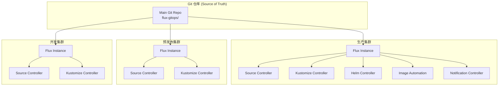
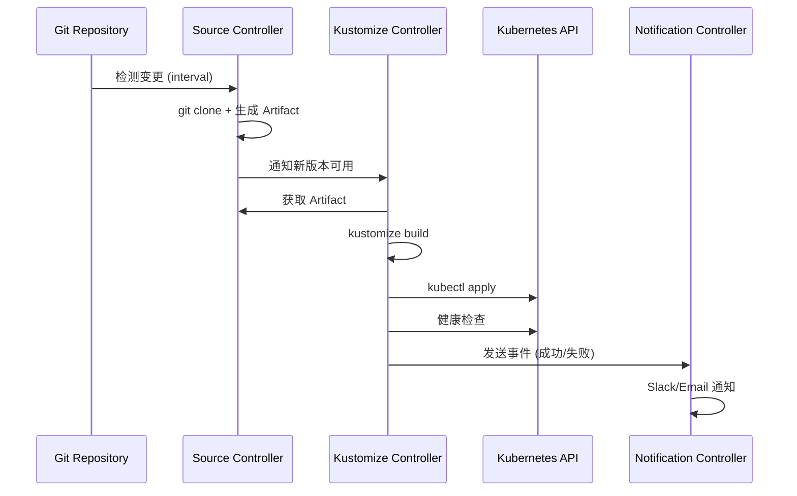

# [[Flux|Flux]] v2 GitOps 持续交付深度实践

> **适用版本**: Flux v2.5 / [[Helm|Helm]] Controller v2.x / Kustomize Controller v1.x
> **最后更新**: 2026-04-24
> **难度**: 中级 → 高级
> **阅读时间**: 约 45 分钟
> **前置知识**: [[Kubernetes|Kubernetes]] 基础、Git 基本操作、Helm/Kustomize 概念

Flux 是云原生计算基金会（CNCF）毕业项目，是 Kubernetes 原生的持续交付工具。与 Argo CD 不同，Flux 不提供 Web 界面，而是完全通过声明式 API 和 Git 工作流驱动。Flux 的设计哲学是"Git 是唯一的真实来源"，所有配置变更都通过 Git 提交触发，确保完整的审计追踪和可重复性。

---

<!-- chunk: 📋 目录 -->## 📋 目录

- [一、概述](#一概述)
- [二、架构设计](#二架构设计)
- [三、核心配置](#三核心配置)
- [四、安全与合规](#四安全与合规)
- [五、多环境管理策略](#五多环境管理策略)
- [六、监控与回滚](#六监控与回滚)
- [七、最佳实践](#七最佳实践)
- [八、故障排查](#八故障排查)

---

<!-- chunk: 一、概述 -->## 一、概述

Flux v2 是 CNCF 毕业的 GitOps 持续交付工具，基于 GitOps Toolkit 构建。Flux 的设计哲学是"Git 即 UI"——所有操作通过 Git 提交完成，无需额外的 Web UI。每个 Kubernetes 集群运行独立的 Flux 实例，通过 Git 仓库获取声明式配置并持续收敛集群状态。

Flux v2 的核心组件包括六大控制器：Source Controller（源管理）、Kustomize Controller（Kustomize 应用）、Helm Controller（Helm Release 管理）、Image Reflector Controller（镜像仓库扫描）、Image Automation Controller（镜像自动更新）和 Notification Controller（事件通知）。这些控制器协同工作，形成完整的 GitOps 交付能力。

本文档深入探讨 Flux 的高级特性：Kustomization 的健康检查与依赖管理、HelmRelease 的 OCI Chart 支持与升级策略、ImageUpdateAutomation 的自动镜像更新、多集群多租户管理、以及与 Terraform 和 Crossplane 的基础设施即代码集成。

---

<!-- chunk: 二、架构设计 -->## 二、架构设计

## 2.1 Flux 多集群架构



## 2.2 GitOps Toolkit 组件交互



---

<!-- chunk: 三、核心配置 -->## 三、核心配置

## 3.1 Bootstrap 与目录结构

```bash
# 安装 Flux CLI
curl -s https://fluxcd.io/install.sh | sudo bash

# 验证集群兼容性
flux check --pre

# Bootstrap (GitHub)
flux bootstrap github \
  --owner=$GITHUB_USER \
  --repository=flux-gitops \
  --branch=main \
  --path=clusters/production \
  --personal \
  --components-extra=image-reflector-controller,image-automation-controller
```

```
flux-gitops/
├── clusters/
│   ├── production/
│   │   ├── flux-system/          # Flux 自身配置
│   │   ├── infrastructure.yaml   # 基础设施 Kustomization
│   │   └── apps.yaml             # 应用 Kustomization
│   └── staging/
├── infrastructure/
│   ├── base/
│   │   ├── ingress-nginx/
│   │   ├── cert-manager/
│   │   ├── monitoring/
│   │   └── external-secrets/
│   └── production/
│       ├── kustomization.yaml
│       └── patches/
└── apps/
    ├── base/
    │   ├── frontend/
    │   └── backend/
    └── production/
        ├── kustomization.yaml
        └── patches/
```

## 3.2 Kustomization 高级配置

```yaml
apiVersion: kustomize.toolkit.fluxcd.io/v1
kind: Kustomization
metadata:
  name: apps
  namespace: flux-system
spec:
  interval: 5m
  retryInterval: 1m
  timeout: 5m
  path: ./apps/production
  prune: true
  wait: true
  sourceRef:
    kind: GitRepository
    name: flux-system

  # 健康检查
  healthChecks:
    - apiVersion: apps/v1
      kind: Deployment
      name: frontend
      namespace: production
    - apiVersion: apps/v1
      kind: Deployment
      name: backend
      namespace: production

  # 依赖管理
  dependsOn:
    - name: infrastructure

  # 多租户隔离
  serviceAccountName: flux-apps

  # 变量替换
  postBuild:
    substitute:
      ENVIRONMENT: production
      DOMAIN: app.example.com
      REPLICAS: "3"
    substituteFrom:
      - kind: ConfigMap
        name: cluster-settings
      - kind: Secret
        name: cluster-secrets

  # SOPS 解密
  decryption:
    provider: sops
    secretRef:
      name: sops-age-key

  # 补丁策略
  patches:
    - patch: |
        apiVersion: apps/v1
        kind: Deployment
        metadata:
          name: all-apps
          namespace: production
        spec:
          template:
            metadata:
              annotations:
                fluxcd.io/reconcile: "enabled"
      target:
        kind: Deployment
        namespace: production
```

## 3.3 HelmRelease 高级配置

```yaml
apiVersion: source.toolkit.fluxcd.io/v1
kind: HelmRepository
metadata:
  name: bitnami
  namespace: flux-system
spec:
  interval: 1h
  url: https://charts.bitnami.com/bitnami
  provider: generic
---
apiVersion: helm.toolkit.fluxcd.io/v2
kind: HelmRelease
metadata:
  name: nginx-ingress
  namespace: ingress-nginx
spec:
  interval: 30m
  chart:
    spec:
      chart: nginx-ingress-controller
      version: "11.x"
      sourceRef:
        kind: HelmRepository
        name: bitnami
        namespace: flux-system
      reconcileStrategy: ChartVersionRevision

  install:
    remediation:
      retries: 3
    createNamespace: true

  upgrade:
    remediation:
      retries: 3
      remediateLastFailure: true
    cleanupOnFail: true

  rollback:
    timeout: 5m
    cleanupOnFail: true

  test:
    enable: true
    ignoreFailures: false

  values:
    controller:
      replicaCount: 3
      resources:
        requests:
          cpu: 100m
          memory: 256Mi
        limits:
          cpu: 1000m
          memory: 1Gi
      metrics:
        enabled: true
        serviceMonitor:
          enabled: true

  valuesFrom:
    - kind: ConfigMap
      name: nginx-ingress-overrides
      optional: true
    - kind: Secret
      name: nginx-ingress-secrets
      optional: true
```

## 3.4 OCI Chart 支持

```yaml
apiVersion: source.toolkit.fluxcd.io/v1
kind: OCIRepository
metadata:
  name: podinfo
  namespace: flux-system
spec:
  interval: 5m
  url: oci://ghcr.io/stefanprodan/charts/podinfo
  ref:
    semver: "6.x"
  verify:
    provider: cosign
---
apiVersion: helm.toolkit.fluxcd.io/v2
kind: HelmRelease
metadata:
  name: podinfo
spec:
  chartRef:
    kind: OCIRepository
    name: podinfo
  values:
    replicaCount: 2
```

## 3.5 ImageUpdateAutomation 完整配置

```yaml
# 扫描镜像仓库
apiVersion: image.toolkit.fluxcd.io/v1beta2
kind: ImageRepository
metadata:
  name: frontend
  namespace: flux-system
spec:
  image: ghcr.io/org/frontend
  interval: 1m
  exclusionList:
    - "^.*-rc\\..*$"
    - "^.*-alpha\\..*$"
    - "^.*-dev\\..*$"
---
# 定义更新策略
apiVersion: image.toolkit.fluxcd.io/v1beta2
kind: ImagePolicy
metadata:
  name: frontend
  namespace: flux-system
spec:
  imageRepositoryRef:
    name: frontend
  policy:
    semver:
      range: ">=1.0.0 <2.0.0"
  filterTags:
    pattern: '^v(?P<version>.*)$'
    extract: '$version'
---
# 自动提交更新到 Git
apiVersion: image.toolkit.fluxcd.io/v1beta1
kind: ImageUpdateAutomation
metadata:
  name: frontend-auto-update
  namespace: flux-system
spec:
  interval: 1m
  sourceRef:
    kind: GitRepository
    name: flux-system
  git:
    checkout:
      ref:
        branch: main
    commit:
      author:
        name: Flux Bot
        email: flux-bot@example.com
      messageTemplate: |
        chore: update frontend image

        Images:
        {{ range .Updated.Images -}}
        - {{.}}
        {{ end }}

        Signed-off-by: Flux Bot <flux-bot@example.com>
      signingKey:
        secretRef:
          name: flux-gpg-signing-key
    push:
      branch: main
```

---

<!-- chunk: 四、安全与合规 -->## 四、安全与合规

## 4.1 SOPS 加密集成

> ⚠️ **🟡 中危变更** — 变更集群资源状态，建议先 --dry-run 或 diff 确认
> - `kubectl apply/create/replace`：创建/变更集群资源

```bash
# 生成 age 密钥
age-keygen -o age.key
kubectl create secret generic sops-age-key \
  --namespace flux-system \
  --from-file=age.agekey=age.key

# 加密 Secret
SOPS_AGE_KEY_FILE=age.key sops --encrypt \
  --age age1xxxxxxxxx \
  secret.yaml > secret.enc.yaml
```

```yaml
# Kustomization 启用解密
spec:
  decryption:
    provider: sops
    secretRef:
      name: sops-age-key
```

## 4.2 多租户 RBAC

```yaml
# 团队 A ServiceAccount
apiVersion: v1
kind: ServiceAccount
metadata:
  name: flux-team-a
  namespace: flux-system
---
apiVersion: rbac.authorization.k8s.io/v1
kind: RoleBinding
metadata:
  name: flux-team-a
  namespace: team-a
subjects:
  - kind: ServiceAccount
    name: flux-team-a
    namespace: flux-system
roleRef:
  kind: ClusterRole
  name: flux-tenant-role
  apiGroup: rbac.authorization.k8s.io
---
apiVersion: rbac.authorization.k8s.io/v1
kind: ClusterRole
metadata:
  name: flux-tenant-role
rules:
  - apiGroups: ["apps"]
    resources: ["deployments", "statefulsets"]
    verbs: ["*"]
  - apiGroups: [""]
    resources: ["services", "configmaps"]
    verbs: ["*"]
  - apiGroups: ["networking.k8s.io"]
    resources: ["ingresses"]
    verbs: ["*"]
```

---

<!-- chunk: 五、多环境管理策略 -->## 五、多环境管理策略

## 5.1 多集群 Tenant 管理

```yaml
# clusters/production/tenants/team-a.yaml
apiVersion: kustomize.toolkit.fluxcd.io/v1
kind: Kustomization
metadata:
  name: team-a-apps
  namespace: flux-system
spec:
  serviceAccountName: flux-team-a
  interval: 5m
  path: ./tenants/team-a
  prune: true
  sourceRef:
    kind: GitRepository
    name: flux-system
  healthChecks:
    - apiVersion: apps/v1
      kind: Deployment
      name: api
      namespace: team-a
```

## 5.2 Terraform Controller 集成

```yaml
apiVersion: infra.contrib.fluxcd.io/v1alpha2
kind: Terraform
metadata:
  name: aws-vpc
  namespace: flux-system
spec:
  interval: 1h
  path: ./terraform/vpc
  sourceRef:
    kind: GitRepository
    name: flux-system
  approvePlan: auto
  vars:
    - name: region
      value: us-east-1
    - name: environment
      value: production
  writeOutputsToSecret:
    name: vpc-outputs
  runnerPodTemplate:
    spec:
      envFrom:
        - secretRef:
            name: aws-credentials
```

---

<!-- chunk: 六、监控与回滚 -->## 六、监控与回滚

## 6.1 通知配置

```yaml
apiVersion: notification.toolkit.fluxcd.io/v1beta3
kind: Provider
metadata:
  name: slack
  namespace: flux-system
spec:
  type: slack
  channel: k8s-alerts
  secretRef:
    name: slack-webhook-url
---
apiVersion: notification.toolkit.fluxcd.io/v1beta3
kind: Alert
metadata:
  name: error-alerts
  namespace: flux-system
spec:
  summary: "Production Cluster Alerts"
  providerRef:
    name: slack
  eventSeverity: error
  eventSources:
    - kind: Kustomization
      name: "*"
    - kind: HelmRelease
      name: "*"
    - kind: ImageRepository
      name: "*"
  inclusionList:
    - "Kustomization.*reconciliation failed"
    - "HelmRelease.*install retries exhausted"
    - "ImageRepository.*scan failed"
---
apiVersion: notification.toolkit.fluxcd.io/v1beta3
kind: Receiver
metadata:
  name: github-receiver
  namespace: flux-system
spec:
  type: github
  events:
    - push
  resources:
    - kind: GitRepository
      name: flux-system
  secretRef:
    name: github-receiver-token
```

## 6.2 回滚操作

```bash
# Git revert 回滚 (推荐)
git revert <commit-hash>
git push origin main

# 强制重新同步
flux reconcile kustomization <name> --force

# 回滚 HelmRelease
flux reconcile helmrelease <name> --rollback

# 查看历史版本
flux get kustomizations -A
flux logs --level=info
```

---

<!-- chunk: 七、最佳实践 -->## 七、最佳实践

## 7.1 Flux vs Argo CD

| 维度 | Flux | Argo CD |
|:---|:---|:---|
| 架构 | 分布式 (每集群独立) | 集中式 (单实例多集群) |
| UI | 可选 (Weave GitOps) | 内置丰富 UI |
| 镜像更新 | 内置 Image Automation | 需 Image Updater |
| 密钥管理 | SOPS 原生支持 | External Secrets / Sealed Secrets |
| Helm | Helm Controller | 内置 Helm 支持 |
| 规模 | <100 apps/集群 | 1000+ apps/实例 |
| 学习曲线 | 低 | 中 |

## 7.2 目录结构建议

```
flux-gitops/
├── clusters/          # 集群特定配置
├── infrastructure/    # 基础设施 (共享)
├── apps/             # 应用 (共享 + overlay)
└── tenants/          # 租户 (多租户场景)
```

---

<!-- chunk: 八、故障排查 -->## 八、故障排查

```bash
# 全局检查
flux check
flux get all -A
flux logs --level=error

# Kustomization 排查
flux get kustomizations -A
flux reconcile kustomization <name> --verbose
kubectl describe kustomization <name> -n flux-system

# HelmRelease 排查
flux get helmreleases -A
flux reconcile helmrelease <name> --verbose

# 镜像更新排查
flux get images repository
flux get images policy
flux get images update

# 通知排查
flux get alerts -A
flux get providers -A
```

```yaml
常见问题:
  Kustomization 同步失败:
    - 检查 GitRepository 是否正常
    - 查看 kustomize-controller 日志
    - 验证 Kustomize 构建是否有错误

  HelmRelease 安装失败:
    - 检查 HelmRepository 连接
    - 验证 values 配置
    - 查看 helm-controller 日志

  镜像不更新:
    - 检查 ImagePolicy 的 semver range
    - 验证 Git 推送权限
    - 检查签名密钥配置
```

---

<!-- chunk: 九、Flux 多集群与 Tenant 管理深度实践 -->## 九、Flux 多集群与 Tenant 管理深度实践

## 9.1 多集群管理架构

Flux 的多集群管理采用"每集群独立实例"的架构模式。每个 Kubernetes 集群运行自己的 Flux 实例，通过同一个或不同的 Git 仓库获取配置。这种架构的优势在于：每个集群完全自治，不存在单点问题；集群间的问题不会相互影响；可以根据集群规模独立调整 Flux 组件的资源配额。

在多集群场景中，推荐使用统一的 Git 仓库管理所有集群的配置，通过目录结构隔离不同集群的配置。每个集群的 `flux-system` Kustomization 指向对应的集群目录，确保只有该集群相关的配置被应用。

```yaml
# 多集群 GitRepository 共享配置
apiVersion: source.toolkit.fluxcd.io/v1
kind: GitRepository
metadata:
  name: shared-infra
  namespace: flux-system
spec:
  interval: 5m
  url: https://github.com/org/gitops-infra
  ref:
    branch: main
---
# 集群特定配置
apiVersion: source.toolkit.fluxcd.io/v1
kind: GitRepository
metadata:
  name: cluster-config
  namespace: flux-system
spec:
  interval: 5m
  url: https://github.com/org/gitops-clusters
  ref:
    branch: main
```

## 9.2 Tenant 隔离策略

在多租户场景中，Flux 通过 ServiceAccount 和 RBAC 实现命名空间级别的隔离。每个租户（团队）拥有独立的 ServiceAccount，该 ServiceAccount 只能在指定的命名空间中创建和管理资源。Kustomize Controller 使用 `serviceAccountName` 字段指定执行 Kustomization 时使用的 ServiceAccount。

```yaml
# 租户模板
apiVersion: v1
kind: ServiceAccount
metadata:
  name: flux-tenant-${TEAM}
  namespace: flux-system
---
apiVersion: rbac.authorization.k8s.io/v1
kind: RoleBinding
metadata:
  name: flux-tenant-${TEAM}
  namespace: ${TEAM}
subjects:
  - kind: ServiceAccount
    name: flux-tenant-${TEAM}
    namespace: flux-system
roleRef:
  kind: Role
  name: flux-tenant-role
  apiGroup: rbac.authorization.k8s.io
---
apiVersion: rbac.authorization.k8s.io/v1
kind: Role
metadata:
  name: flux-tenant-role
  namespace: ${TEAM}
rules:
  - apiGroups: ["apps"]
    resources: ["deployments", "statefulsets"]
    verbs: ["*"]
  - apiGroups: [""]
    resources: ["services", "configmaps", "secrets"]
    verbs: ["*"]
  - apiGroups: ["networking.k8s.io"]
    resources: ["ingresses"]
    verbs: ["*"]
```

## 9.3 HelmRelease Values 管理策略

HelmRelease 的 values 管理是 Flux 企业级实践的关键环节。Flux 支持多种 values 来源：内联 values、ConfigMap 引用、Secret 引用以及外部文件引用。通过合理的 values 管理策略，可以实现环境差异化配置和密钥安全注入。

```yaml
# 多来源 Values 管理
apiVersion: helm.toolkit.fluxcd.io/v2
kind: HelmRelease
metadata:
  name: myapp
  namespace: production
spec:
  interval: 5m
  chart:
    spec:
      chart: myapp
      version: "1.x"
      sourceRef:
        kind: HelmRepository
        name: charts
  values:
    replicaCount: 3
    resources:
      requests:
        cpu: 100m
        memory: 256Mi
  valuesFrom:
    - kind: ConfigMap
      name: myapp-production-config
      valuesKey: values.yaml
      optional: false
    - kind: Secret
      name: myapp-production-secrets
      valuesKey: values.yaml
      optional: true
    - kind: ConfigMap
      name: cluster-settings
      valuesKey: shared-values.yaml
      optional: true
```

## 9.4 Image Automation 深度实践

Flux 的 Image Automation 是其区别于其他 GitOps 工具的核心特性。它由三个组件协同工作：ImageRepository 负责定期扫描镜像仓库中的标签，ImagePolicy 负责根据策略选择最新的镜像版本，ImageUpdateAutomation 负责将选中的镜像版本自动提交回 Git 仓库。

```yaml
# 多策略镜像更新
apiVersion: image.toolkit.fluxcd.io/v1beta2
kind: ImagePolicy
metadata:
  name: frontend-production
  namespace: flux-system
spec:
  imageRepositoryRef:
    name: frontend
  policy:
    semver:
      range: ">=1.0.0 <2.0.0-0"
---
apiVersion: image.toolkit.fluxcd.io/v1beta2
kind: ImagePolicy
metadata:
  name: frontend-staging
  namespace: flux-system
spec:
  imageRepositoryRef:
    name: frontend
  policy:
    alphabetical:
      order: desc
```

---

<!-- chunk: 十、Flux 生产环境最佳实践 -->## 十、Flux 生产环境最佳实践

## 10.1 Flux 多集群拓扑设计

在管理多个 Kubernetes 集群时，Flux 的拓扑设计直接影响运维效率。推荐的模式是"Hub-Spoke"架构：一个中心集群（Hub）运行 Flux 的 Image Automation 和监控组件，多个工作集群（Spoke）运行 Flux 的 Source、Kustomize 和 Helm Controller。中心集群通过 GitOps 管理所有工作集群的配置，工作集群独立处理自己的工作负载同步。

```yaml
# Hub 集群: 集中管理所有集群的 Kustomization
apiVersion: kustomize.toolkit.fluxcd.io/v1
kind: Kustomization
metadata:
  name: production-workloads
  namespace: flux-system
spec:
  interval: 5m
  sourceRef:
    kind: GitRepository
    name: fleet-infra
  path: ./clusters/production
  prune: true
  kubeConfig:
    secretRef:
      name: production-cluster-kubeconfig
  postBuild:
    substituteFrom:
      - kind: ConfigMap
        name: production-cluster-config
```

## 10.2 ImagePolicy 自动化更新策略

Flux 的 Image Automation Controller 可以根据配置的策略自动更新工作负载的容器镜像引用。结合 ImagePolicy，可以实现语义化版本控制（SemVer）、正则表达式匹配和字母序排序等多种更新策略。这是 Flux 生态区别于 Argo CD 的独特能力。

```yaml
# 自动更新策略配置
apiVersion: image.toolkit.fluxcd.io/v1beta2
kind: ImagePolicy
metadata:
  name: myapp-policy
  namespace: flux-system
spec:
  imageRepositoryRef:
    name: myapp-registry
  filterTags:
    pattern: "^v(?P<major>\\d+)\\.(?P<minor>\\d+)\\.(?P<patch>\\d+)-(?P<build>\\d+)$"
    extract: "$major.$minor.$patch-build$build"
  policy:
    semver:
      range: ">=1.0.0 <2.0.0"
---
# 自动写入 Git 仓库
apiVersion: image.toolkit.fluxcd.io/v1beta2
kind: ImageUpdateAutomation
metadata:
  name: myapp-auto-update
  namespace: flux-system
spec:
  interval: 5m
  sourceRef:
    kind: GitRepository
    name: myapp-manifests
  git:
    checkout:
      ref:
        branch: main
    commit:
      author:
        email: flux-bot@example.com
        name: Flux Bot
      messageTemplate: |
        自动更新镜像: {{ range .Updated.Images }}
        - {{ . }}{{ end }}
    push:
      branch: main
  update:
    strategy:
      name: setters
```

## 10.3 SOPS 密钥加密集成

Flux 原生支持 Mozilla SOPS（Secrets OPerationS）加密的密钥文件。通过 `spec.decryption` 配置，Flux 可以在同步时自动解密 SOPS 加密的 Secret 文件。支持多种加密后端：age（推荐，简单易用）、GPG（传统选择）、AWS KMS、GCP KMS 和 Azure Key Vault。

```yaml
# Flux SOPS 解密配置
apiVersion: kustomize.toolkit.fluxcd.io/v1
kind: Kustomization
metadata:
  name: secrets
  namespace: flux-system
spec:
  interval: 10m
  sourceRef:
    kind: GitRepository
    name: flux-system
  path: ./secrets
  prune: true
  decryption:
    provider: sops
    secretRef:
      name: sops-age-key
---
# SOPS 加密的 Secret (使用 age 后端)
apiVersion: v1
kind: Secret
metadata:
  name: database-credentials
  annotations:
    kustomize.config.k8s.io/needs-hash: "false"
stringData:
  username: ENC[AES256_GCM,data:xxxxx,tag:yyyyy,type:str]
  password: ENC[AES256_GCM,data:xxxxx,tag:yyyyy,type:str]
sops:
  age:
    - recipient: age1xxxxxxxxxxxxxxxxxxxxxxxxxxxxxxxxxxxxxxxxxxxxxxxxxxxxx
      enc: |
        -----BEGIN AGE ENCRYPTED FILE-----
        xxxxxxxxxxxxxxxxxxxxxxxxxxxxxxxxxxxx
        -----END AGE ENCRYPTED FILE-----
```

---

<!-- chunk: 十一、Flux 监控与可观测性 -->## 十一、Flux 监控与可观测性

## 11.1 Prometheus 指标

Flux 的每个 Controller 都暴露了 Prometheus 格式的指标，可以直接被 Prometheus 抓取。关键指标包括协调延迟、错误率和资源状态。通过配置 PrometheusRule 和 Grafana Dashboard，可以实现 Flux 的全面监控。

```yaml
# Flux Prometheus 监控配置
apiVersion: monitoring.coreos.com/v1
kind: PodMonitor
metadata:
  name: flux-controllers
  namespace: flux-system
spec:
  selector:
    matchLabels:
      app.kubernetes.io/part-of: flux
  podMetricsEndpoints:
    - port: http-prom
      interval: 15s
---
# PrometheusRule: Flux 告警规则
apiVersion: monitoring.coreos.com/v1
kind: PrometheusRule
metadata:
  name: flux-alerts
  namespace: flux-system
spec:
  groups:
    - name: flux.rules
      rules:
        - alert: FluxReconciliationFailed
          expr: gotk_reconcile_condition{status="False"} == 1
          for: 10m
          labels:
            severity: warning
          annotations:
            summary: "Flux reconciliation failed for {{ $labels.kind }}/{{ $labels.name }}"
        - alert: FluxStaleResources
          expr: time() - gotk_resource_status_last_transition_timestamp > 3600
          for: 5m
          labels:
            severity: info
          annotations:
            summary: "Resource {{ $labels.kind }}/{{ $labels.name }} has not been updated for over 1 hour"
```

## 11.2 Flux 与 Git 仓库交互优化

Flux 与 Git 仓库的交互效率直接影响同步延迟。对于大型 Git 仓库（超过 1GB），建议使用稀疏检出来减少传输量和检出时间。Flux 的 GitRepository 资源支持 `spec.include` 配置，可以将多个 Git 仓库组合使用。

```yaml
# 稀疏检出优化
apiVersion: source.toolkit.fluxcd.io/v1
kind: GitRepository
metadata:
  name: large-repo
  namespace: flux-system
spec:
  interval: 5m
  url: https://github.com/org/monorepo.git
  ref:
    branch: main
  ignore: |
    # 排除不需要的目录
    /docs/*
    /scripts/*
    /legacy/*
    /*.md
```

---

<!-- chunk: 十二、Flux 与 Argo CD 协作模式 -->## 十二、Flux 与 Argo CD 协作模式

在某些企业场景中，可能需要同时使用 Flux 和 Argo CD 来管理同一个 Kubernetes 集群。例如，基础设施团队使用 Flux 管理平台级组件（Ingress Controller、Cert Manager、Monitoring），应用团队使用 Argo CD 管理业务应用。两个工具可以安全地共存于同一集群，只要确保管理范围不重叠——使用不同的命名空间、不同的 Git 仓库和不同的 RBAC 权限。

```yaml
混合架构设计:
  Flux 管理范围:
    - 基础设施组件 (Ingress, Cert Manager, External Secrets Operator)
    - 监控和日志 (Prometheus, Grafana, Loki)
    - 平台服务 (Vault, Consul)
    - 命名空间: infrastructure, monitoring, security
    
  Argo CD 管理范围:
    - 业务应用 (API, Frontend, Worker)
    - 应用级中间件 (Redis, RabbitMQ)
    - 应用级 CronJob
    - 命名空间: team-a, team-b, team-c
    
  隔离策略:
    - 使用不同的 Git 仓库
    - 使用不同的命名空间
    - 通过 RBAC 限制各自权限
    - 监控各自独立的健康指标
    - 避免管理同一资源的同一字段
```

---

<!-- chunk: 参考链接 -->## 参考链接

- [Flux 官方文档](https://fluxcd.io/flux/)
- [Flux GitHub](https://github.com/fluxcd/flux2)
- [tf-controller](https://github.com/weaveworks/tf-controller)
- [Image Automation](https://fluxcd.io/flux/guides/image-update/)
- [Flux Monitoring Guide](https://fluxcd.io/flux/guides/monitoring/)
- [Flux Multi-cluster Guide](https://fluxcd.io/flux/guides/clusters/)
- [Weave GitOps Enterprise](https://docs.gitops.weave.works/)
- [Flux Notifications](https://fluxcd.io/flux/guides/notifications/)
- [Flux OCI Registry Support](https://fluxcd.io/flux/cheatsheets/oci-artifacts/)
- [Flux Kustomize Health Checks](https://fluxcd.io/flux/components/kustomize/)
- [Flux Source Controller](https://fluxcd.io/flux/components/source/)
- [Flux HelmRelease API](https://fluxcd.io/flux/components/helm/)
- [Flux FAQ and Troubleshooting](https://fluxcd.io/flux/faq/)
- [Flux Image Reflector Controller](https://fluxcd.io/flux/components/image/)
- [Flux Image Automation Controller](https://fluxcd.io/flux/components/image-automation/)
- [Flux Security Model](https://fluxcd.io/flux/security/)
- [Flux Best Practices Guide](https://fluxcd.io/flux/cheatsheets/)
- [Flux Governance](https://fluxcd.io/governance/)
- [Flux Contributing Guide](https://fluxcd.io/contributing/)

---

<!-- chunk: Obsidian 相关文档 -->## Obsidian 相关文档

- domain-08-release-change-management MOC
- [[domain-08-release-change-management/README.md|Domain 08: GitOps与CI/CD (GitOps & CI/CD)]]
- Domain-23 GitOps & CI/CD — 开源项目索引
- Argo CD企业级GitOps实践指南
- Jenkins企业级CI/CD流水线深度实践
- GitLab CI/CD 企业级流水线自动化平台
- GitHub Actions Enterprise CI/CD Platform 深度实践
- Tekton 云原生 CI/CD 深度实践
- GitOps 安全与合规深度实践
- CI/CD 流水线模式与渐进式交付深度实践
- Argo CD 企业级 GitOps 实践指南
- Flux GitOps 实践指南

## See Also

- 04-github-actions-enterprise
- 05-tekton-cloud-native-cicd
- 07-gitops-security-compliance
- 08-cicd-pipeline-patterns
