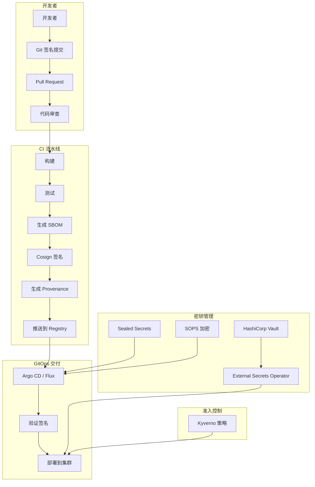

# GitOps 安全与合规深度实践

> **适用版本**: SLSA v1.0 / Cosign v2.4 / External Secrets v0.14 / Sealed Secrets v0.27 / SOPS v3.9
> **最后更新**: 2026-04-24
> **难度**: 高级
> **前置知识**: GitOps 基础概念、Kubernetes 安全模型、容器安全基础

软件供应链安全是现代软件工程的核心挑战。随着攻击面不断扩大，企业需要建立纵深防御体系来保护从代码提交到生产部署的完整链路。GitOps 的声明式特性和 Git 审计追踪为安全合规提供了天然优势，但仍需要主动的安全策略和工具链来防范供应链攻击、密钥泄露和未授权访问等风险。

---

<!-- chunk: 一、概述 -->## 一、概述

在 GitOps 与 CI/CD 实践中，安全合规是不可忽视的关键维度。随着软件供应链攻击事件的频发（如 SolarWinds、Codecov、Log4Shell），企业对软件交付过程中的安全性和可追溯性提出了更高的要求。SLSA（Supply-chain Levels for Software Artifacts）框架定义了四个递进的供应链安全等级，SBOM（Software Bill of Materials）提供了软件组件的完整清单，镜像签名确保了制品的完整性和来源可信。

#<!-- chunk: 1.1 SLSA 安全等级详解 -->## 1.1 SLSA 安全等级详解

SLSA 框架定义了从 Level 1 到 Level 4 的递进安全等级。每个等级建立在前一个等级的基础之上，逐步加强供应链的安全保证。

```yaml
SLSA_Level_1_构建文档化:
  安全目标: 构建过程有记录
  核心要求:
    - 存在 Provenance (构建证明) 文档
    - 记录构建来源、构建参数和产出物
    - Provenance 包含构建者身份信息
  威胁防范: 防止匿名或不可追溯的构建
  实施工具: Tekton Chains / GitHub Actions SLSA Generator
  企业难度: 低
  实施周期: 1-2周

SLSA_Level_2_托管构建平台:
  安全目标: 在可信平台上构建
  核心要求:
    - 构建在托管 CI 平台上执行
    - Provenance 由平台自动签名
    - 构建来源 (源码仓库) 可验证
  威胁防范: 防止伪造构建证明
  实施工具: GitHub Actions / Tekton / GitLab CI
  企业难度: 低
  实施周期: 1-2周 (通常默认满足)

SLSA_Level_3_构建平台强化:
  安全目标: 构建环境不可变，防止构建过程被篡改
  核心要求:
    - 构建环境不可变 (Hermetic Build)
    - 构建源和参数不可被构建过程篡改
    - Provenance 完整且可通过 Sigstore 验证
    - 构建产出物 (镜像) 经过签名
  威胁防范: 防止构建过程注入恶意代码
  实施工具:
    - Tekton Chains (Provenance 生成)
    - Cosign (镜像签名)
    - Syft (SBOM 生成)
    - Rekor (透明度日志)
  企业难度: 中
  实施周期: 4-8周

SLSA_Level_4_最高安全等级:
  安全目标: 可复现构建，两方审查
  核心要求:
    - 两方审查 (Two-party review) 所有变更
    - 隔离构建 (每个构建独立环境)
    - 可复现构建 (Deterministic Build)
    - 所有依赖经过验证
  威胁防范: 防止内部威胁和高级供应链攻击
  实施工具: 全链路签名 + Hermetic Build + Reproducible Build
  企业难度: 高
  实施周期: 3-6个月
```

#<!-- chunk: 1.2 SLSA Level 要求对比 -->## 1.2 SLSA Level 要求对比

| 要求 | Level 1 | Level 2 | Level 3 | Level 4 |
|:---|:---|:---|:---|:---|
| Provenance 存在 | 必需 | 必需 | 必需 | 必需 |
| Provenace 由平台签名 | — | 必需 | 必需 | 必需 |
| 构建环境不可变 | — | — | 必需 | 必需 |
| 源码可验证 | — | — | 必需 | 必需 |
| 两方审查 | — | — | — | 必需 |
| 可复现构建 | — | — | — | 必需 |
| 隔离构建 | — | — | — | 必需 |
| SBOM 附加 | 推荐 | 推荐 | 必需 | 必需 |

---

<!-- chunk: 二、架构设计 -->## 二、架构设计

#<!-- chunk: 2.1 供应链安全架构 -->## 2.1 供应链安全架构



---

<!-- chunk: 三、Cosign 镜像签名完整工作流 -->## 三、Cosign 镜像签名完整工作流

#<!-- chunk: 3.1 Cosign 密钥管理 -->## 3.1 Cosign 密钥管理

```bash
# Generate key pair (interactive, will prompt for password)
cosign generate-key-pair
# Output:
#   Private key written to cosign.key
#   Public key written to cosign.pub

# Generate key pair non-interactive
COSIGN_PASSWORD="your-strong-password" cosign generate-key-pair

# Use KMS-backed key (AWS KMS)
cosign generate-key-pair --kms awskms:///alias/cosign-key

# Use HashiCorp Vault
cosign generate-key-pair --kms hashivault://cosign-key
```

#<!-- chunk: 3.2 Cosign 签名完整流程 YAML -->## 3.2 Cosign 签名完整流程 YAML

```yaml
# GitHub Actions: Complete Cosign Signing Workflow
name: Build, Sign, and Push
on:
  push:
    branches: [main]
    tags: ['v*']

permissions:
  contents: read
  packages: write
  id-token: write

jobs:
  build-and-sign:
    runs-on: ubuntu-latest
    steps:
      - name: Checkout
        uses: actions/checkout@v4

      - name: Set up Docker Buildx
        uses: docker/setup-buildx-action@v3

      - name: Login to GHCR
        uses: docker/login-action@v3
        with:
          registry: ghcr.io
          username: ${{ github.actor }}
          password: ${{ secrets.GITHUB_TOKEN }}

      - name: Build and push
        uses: docker/build-push-action@v5
        id: build
        with:
          push: true
          tags: |
            ghcr.io/${{ github.repository }}:${{ github.sha }}
            ghcr.io/${{ github.repository }}:latest
          cache-from: type=gha
          cache-to: type=gha,mode=max

      - name: Install Cosign
        uses: sigstore/cosign-installer@v3

      - name: Install Syft
        uses: anchore/sbom-action/download-syft@v0

      - name: Generate SBOM
        run: |
          syft ghcr.io/${{ github.repository }}:${{ github.sha }} \
            -o cyclonedx-json > sbom.json

      - name: Attach SBOM to image
        run: |
          cosign attach sbom \
            --sbom sbom.json \
            --type cyclonedx \
            ghcr.io/${{ github.repository }}:${{ github.sha }}

      - name: Sign image with key
        run: |
          cosign sign --yes \
            --key env://COSIGN_PRIVATE_KEY \
            --annotations repo=${{ github.repository }} \
            --annotations sha=${{ github.sha }} \
            --annotations ref=${{ github.ref }} \
            ghcr.io/${{ github.repository }}:${{ github.sha }}
        env:
          COSIGN_PRIVATE_KEY: ${{ secrets.COSIGN_PRIVATE_KEY }}
          COSIGN_PASSWORD: ${{ secrets.COSIGN_PASSWORD }}

      - name: Keyless signing with Fulcio
        run: |
          cosign sign --yes \
            ghcr.io/${{ github.repository }}:${{ github.sha }}

      - name: Verify signature
        run: |
          cosign verify \
            --key cosign.pub \
            ghcr.io/${{ github.repository }}:${{ github.sha }}

      - name: Scan vulnerabilities
        uses: aquasecurity/trivy-action@master
        with:
          image-ref: ghcr.io/${{ github.repository }}:${{ github.sha }}
          severity: 'CRITICAL,HIGH'
          exit-code: '1'
          format: table

      - name: Attach vulnerability scan results
        run: |
          trivy image --format cosign-vuln \
            ghcr.io/${{ github.repository }}:${{ github.sha }} > vuln.json
          cosign attach attestation \
            --predicate vuln.json \
            --type vuln \
            ghcr.io/${{ github.repository }}:${{ github.sha }}
```

#<!-- chunk: 3.3 Tekton Chains SLSA Level 3 配置 -->## 3.3 Tekton Chains SLSA Level 3 配置

```yaml
apiVersion: v1
kind: ConfigMap
metadata:
  name: chains-config
  namespace: tekton-pipelines
data:
  artifacts.taskrun.format: "tekton-provenance"
  artifacts.taskrun.storage: "oci"
  artifacts.taskrun.signer: "x509"
  artifacts.oci.format: "simplesigning"
  artifacts.oci.storage: "oci"
  artifacts.oci.signer: "x509"
  transparency.enabled: "true"
  transparency.url: "https://rekor.sigstore.dev"
  builder.id: "tekton-chains"
---
apiVersion: v1
kind: Secret
metadata:
  name: signing-secrets
  namespace: tekton-pipelines
type: Opaque
data:
  cosign.key: <base64-encoded-cosign-key>
  cosign.pub: <base64-encoded-cosign-pub>
  cosign.password: <base64-encoded-password>
```

---

<!-- chunk: 四、Sealed Secrets 完整示例 -->## 四、Sealed Secrets 完整示例

#<!-- chunk: 4.1 安装与使用 -->## 4.1 安装与使用

```bash
# Install Sealed Secrets controller
helm repo add sealed-secrets https://bitnami-labs.github.io/sealed-secrets
helm install sealed-secrets sealed-secrets/sealed-secrets \
  --namespace kube-system \
  --set-string fullnameOverride=sealed-secrets-controller \
  --set command[0]=controller \
  --set command[1]=--key-renew-period=0

# Install kubeseal CLI
KUBESEAL_VERSION=0.27.0
curl -OL "https://github.com/bitnami-labs/sealed-secrets/releases/download/v${KUBESEAL_VERSION}/kubeseal-${KUBESEAL_VERSION}-linux-amd64.tar.gz"
tar -xzf kubeseal-${KUBESEAL_VERSION}-linux-amd64.tar.gz kubeseal
sudo mv kubeseal /usr/local/bin/

# Create a secret and seal it
kubectl create secret generic api-secrets \
  --dry-run=client \
  --from-literal=DATABASE_URL='postgresql://user:pass@db:5432/mydb' \
  --from-literal=API_KEY='sk-1234567890abcdef' \
  -o yaml > secret.yaml

# Seal the secret (encrypt with controller's public key)
kubeseal --controller-namespace=kube-system \
  --controller-name=sealed-secrets-controller \
  --format yaml < secret.yaml > sealed-secret.yaml

echo "sealed-secret.yaml is safe to commit to Git"
cat sealed-secret.yaml
```

#<!-- chunk: 4.2 Sealed Secret 输出示例 -->## 4.2 Sealed Secret 输出示例

```yaml
# sealed-secret.yaml - Safe to commit to Git
apiVersion: bitnami.com/v1alpha1
kind: SealedSecret
metadata:
  creationTimestamp: null
  name: api-secrets
  namespace: production
spec:
  encryptedData:
    API_KEY: AgBfj8x3kL9mN2pQ7sT0uV4wX6yZ8aBcDeFgHiJkLmNoPqRsTuVwXyZ0aBcD...
    DATABASE_URL: AgCdEfGhIjKlMnOpQrStUvWxYz0aBcDeFgHiJkLmNoPqRsTuVwXyZ0aBcD...
  template:
    metadata:
      creationTimestamp: null
      name: api-secrets
      namespace: production
    type: Opaque
```

#<!-- chunk: 4.3 Sealed Secrets 高级配置 -->## 4.3 Sealed Secrets 高级配置

```yaml
# Scope: cluster-wide (can be unsealed in any namespace)
kubeseal --scope cluster-wide < secret.yaml > sealed-secret-cluster.yaml

# Scope: namespace-wide (can be unsealed in same namespace, any secret name)
kubeseal --scope namespace-wide < secret.yaml > sealed-secret-ns.yaml

# Seal from file
kubeseal --controller-namespace=kube-system \
  --controller-name=sealed-secrets-controller \
  --cert sealed-secrets-pub.pem \
  --format yaml < secret.yaml > sealed-secret.yaml

# Backup the sealing key (CRITICAL)
kubectl get secret -n kube-system sealed-secrets-key -o yaml > sealed-secrets-key-backup.yaml
```

---

<!-- chunk: 五、External Secrets Operator 完整设置 -->## 五、External Secrets Operator 完整设置

#<!-- chunk: 5.1 安装 ESO -->## 5.1 安装 ESO

```bash
# Install External Secrets Operator
helm repo add external-secrets https://charts.external-secrets.io
helm install external-secrets \
  external-secrets/external-secrets \
  --namespace external-secrets \
  --create-namespace

# Verify installation
kubectl get pods -n external-secrets
echo "Expected output:"
echo "NAME                                                READY   STATUS    RESTARTS   AGE"
echo "external-secrets-certificate-store-xxx              1/1     Running   0          60s"
echo "external-secrets-controller-manager-xxx             1/1     Running   0          60s"
echo "external-secrets-webhook-xxx                        1/1     Running   0          60s"
```

#<!-- chunk: 5.2 Vault 后端配置 -->## 5.2 Vault 后端配置

```yaml
# Vault SecretStore Configuration
apiVersion: external-secrets.io/v1beta1
kind: ClusterSecretStore
metadata:
  name: vault-backend
spec:
  provider:
    vault:
      server: "https://vault.example.com"
      path: "secret"
      version: "v2"
      auth:
        kubernetes:
          mountPath: "kubernetes"
          role: "eso-role"
          serviceAccountRef:
            name: external-secrets-sa
            namespace: external-secrets
---
# ExternalSecret Definition
apiVersion: external-secrets.io/v1beta1
kind: ExternalSecret
metadata:
  name: api-secrets
  namespace: production
spec:
  refreshInterval: 1h
  secretStoreRef:
    kind: ClusterSecretStore
    name: vault-backend
  target:
    name: api-secrets
    creationPolicy: Owner
    template:
      type: Opaque
      data:
        DATABASE_URL: "postgresql://{{ .username }}:{{ .password }}@db:5432/{{ .database }}"
  data:
    - secretKey: username
      remoteRef:
        key: secret/data/production/api
        property: database_username
    - secretKey: password
      remoteRef:
        key: secret/data/production/api
        property: database_password
    - secretKey: database
      remoteRef:
        key: secret/data/production/api
        property: database_name
    - secretKey: API_KEY
      remoteRef:
        key: secret/data/production/api
        property: api_key
```

#<!-- chunk: 5.3 AWS Secrets Manager 后端 -->## 5.3 AWS Secrets Manager 后端

```yaml
apiVersion: external-secrets.io/v1beta1
kind: ClusterSecretStore
metadata:
  name: aws-secretsmanager
spec:
  provider:
    aws:
      service: SecretsManager
      region: us-east-1
      auth:
        jwt:
          serviceAccountRef:
            name: external-secrets-sa
            namespace: external-secrets
---
apiVersion: external-secrets.io/v1beta1
kind: ExternalSecret
metadata:
  name: db-credentials
  namespace: production
spec:
  refreshInterval: 15m
  secretStoreRef:
    kind: ClusterSecretStore
    name: aws-secretsmanager
  target:
    name: db-credentials
  dataFrom:
    - extract:
        key: production/database/credentials
```

---

<!-- chunk: 六、SBOM 生成与 Syft 完整实践 -->## 六、SBOM 生成与 Syft 完整实践

#<!-- chunk: 6.1 Syft 安装与使用 -->## 6.1 Syft 安装与使用

```bash
# Install Syft
curl -sSfL https://raw.githubusercontent.com/anchore/syft/main/install.sh | sh -s -- -b /usr/local/bin

# Generate SBOM from source code directory
syft dir:./ --output cyclonedx-json > sbom-cyclonedx.json
syft dir:./ --output spdx-json > sbom-spdx.json
syft dir:./ --output syft-json > sbom-syft.json

# Generate SBOM from container image
syft registry:ghcr.io/org/app:v1.0.0 --output cyclonedx-json > sbom.json

# Generate SBOM from running container
syft ghcr.io/org/app:v1.0.0 -o table

# Expected output:
# NAME             VERSION  TYPE
# alpine-baselayout 3.4.3  apk
# busybox           1.36.1  apk
# ca-certificates   20230506 apk
# libc-utils        0.7.2   apk
# libcrypto3        3.1.4   apk
# libssl3           3.1.4   apk
# musl              1.2.4   apk
# musl-utils        1.2.4   apk
# ssl_client        1.36.1  apk
# zlib              1.3     apk
```

#<!-- chunk: 6.2 SBOM 附加到镜像 -->## 6.2 SBOM 附加到镜像

```bash
# Attach SBOM to OCI image
cosign attach sbom --sbom sbom-cyclonedx.json ghcr.io/org/app:v1.0.0

# Verify SBOM attachment
cosign download sbom ghcr.io/org/app:v1.0.0 | syft -

# Sign the SBOM attestation
cosign attest --yes \
  --predicate sbom-cyclonedx.json \
  --type cyclonedx \
  ghcr.io/org/app:v1.0.0

# Verify SBOM attestation
cosign verify-attestation \
  --type cyclonedx \
  --key cosign.pub \
  ghcr.io/org/app:v1.0.0
```

#<!-- chunk: 6.3 SBOM CI 集成 (GitHub Actions) -->## 6.3 SBOM CI 集成 (GitHub Actions)

```yaml
- name: Generate SBOM with Syft
  uses: anchore/sbom-action@v0
  with:
    image: ghcr.io/org/app:${{ github.sha }}
    format: cyclonedx-json
    output-file: sbom.json
    upload-artifact: true
    upload-release: true

- name: Attach SBOM and sign
  run: |
    cosign attach sbom --sbom sbom.json ghcr.io/org/app:${{ github.sha }}
    cosign attest --yes \
      --predicate sbom.json \
      --type cyclonedx \
      ghcr.io/org/app:${{ github.sha }}
```

---

<!-- chunk: 七、完整供应链安全 Tekton Pipeline -->## 七、完整供应链安全 Tekton Pipeline

```yaml
apiVersion: tekton.dev/v1
kind: Pipeline
metadata:
  name: secure-supply-chain
spec:
  params:
    - name: image-url
      type: string
    - name: image-tag
      type: string
    - name: git-revision
      type: string
  workspaces:
    - name: source
  tasks:
    - name: build
      workspaces:
        - name: source
      taskSpec:
        workspaces:
          - name: source
        steps:
          - name: build-push
            image: gcr.io/kaniko-project/executor:latest
            script: |
              /kaniko/executor \
                --dockerfile=$(workspaces.source.path)/Dockerfile \
                --destination=$(params.image-url):$(params.image-tag) \
                --no-push=false \
                --snapshot-mode=redo \
                --build-arg=REVISION=$(params.git-revision)

    - name: generate-sbom
      runAfter: [build]
      taskSpec:
        steps:
          - name: syft-sbom
            image: anchore/syft:latest
            script: |
              syft $(params.image-url):$(params.image-tag) \
                -o cyclonedx-json > /tmp/sbom.json
              echo "SBOM generated successfully"
              cat /tmp/sbom.json | head -20
          - name: attach-sbom
            image: bitnami/cosign:latest
            script: |
              cosign attach sbom \
                --sbom /tmp/sbom.json \
                $(params.image-url):$(params.image-tag)

    - name: scan-vulnerabilities
      runAfter: [build]
      taskSpec:
        steps:
          - name: trivy-scan
            image: aquasec/trivy:latest
            script: |
              echo "=== Vulnerability Scan ==="
              trivy image --severity CRITICAL,HIGH \
                --exit-code 1 \
                --format table \
                $(params.image-url):$(params.image-tag)
              echo "Scan passed - no critical/high vulnerabilities"
          - name: trivy-sbom-scan
            image: aquasec/trivy:latest
            script: |
              trivy image --severity MEDIUM,HIGH,CRITICAL \
                --format json \
                $(params.image-url):$(params.image-tag) > /tmp/vuln-report.json
              cosign attach attestation \
                --predicate /tmp/vuln-report.json \
                --type vuln \
                $(params.image-url):$(params.image-tag)

    - name: sign-image
      runAfter: [generate-sbom, scan-vulnerabilities]
      taskSpec:
        steps:
          - name: cosign-sign
            image: bitnami/cosign:latest
            script: |
              echo "=== Signing Image ==="
              cosign sign --yes \
                $(params.image-url):$(params.image-tag)
              echo "Image signed successfully"

    - name: verify-signed-image
      runAfter: [sign-image]
      taskSpec:
        steps:
          - name: verify
            image: bitnami/cosign:latest
            script: |
              echo "=== Verifying Signature ==="
              cosign verify \
                $(params.image-url):$(params.image-tag)
              echo "Signature verified successfully"
              echo ""
              echo "=== Verifying SBOM Attestation ==="
              cosign verify-attestation \
                --type cyclonedx \
                $(params.image-url):$(params.image-tag)
```

---

<!-- chunk: 八、合规审计命令 -->## 八、合规审计命令

#<!-- chunk: 8.1 镜像签名审计 -->## 8.1 镜像签名审计

```bash
#!/bin/bash
# audit_image_signatures.sh - Audit all running container images
set -euo pipefail

COSIGN_PUB="${1:-cosign.pub}"
echo "=== Container Image Signature Audit ==="
echo "Public Key: $COSIGN_PUB"
echo "Timestamp: $(date)"
echo ""

VERIFIED=0
UNVERIFIED=0
FAILED=0

echo "--- Scanning all namespaces ---"
for ns in $(kubectl get ns -o jsonpath='{.items[*].metadata.name}'); do
    echo ""
    echo "Namespace: $ns"
    IMAGES=$(kubectl get pods -n "$ns" -o json 2>/dev/null | \
        jq -r '.items[].spec.containers[].image' 2>/dev/null | sort -u)
    
    for img in $IMAGES; do
        if cosign verify --key "$COSIGN_PUB" "$img" 2>/dev/null; then
            echo "  [VERIFIED]   $img"
            VERIFIED=$((VERIFIED + 1))
        else
            echo "  [UNVERIFIED] $img"
            UNVERIFIED=$((UNVERIFIED + 1))
        fi
    done
done

echo ""
echo "=== Audit Summary ==="
echo "Verified:   $VERIFIED"
echo "Unverified: $UNVERIFIED"
echo ""
if [ "$UNVERIFIED" -gt 0 ]; then
    echo "WARNING: $UNVERIFIED images lack valid signatures!"
fi
```

#<!-- chunk: 8.2 SBOM 审计 -->## 8.2 SBOM 审计

```bash
#!/bin/bash
# audit_sbom.sh - Verify SBOM for all images
set -euo pipefail

echo "=== SBOM Audit Report ==="
echo "Timestamp: $(date)"
echo ""

IMAGES=$(kubectl get pods -A -o json | \
    jq -r '.items[].spec.containers[].image' | sort -u)

for img in $IMAGES; do
    echo "Image: $img"
    if cosign download sbom "$img" 2>/dev/null | head -1 | grep -q '{'; then
        echo "  SBOM: Present"
        COMP_COUNT=$(cosign download sbom "$img" 2>/dev/null | \
            jq '.components | length' 2>/dev/null || echo "N/A")
        echo "  Components: $COMP_COUNT"
    else
        echo "  SBOM: MISSING"
    fi
    echo ""
done
```

#<!-- chunk: 8.3 Kyverno 合规策略审计 -->## 8.3 Kyverno 合规策略审计

```bash
#!/bin/bash
# audit_kyverno_compliance.sh - Check Kyverno policy compliance
set -euo pipefail

echo "=== Kyverno Policy Compliance Audit ==="
echo "Timestamp: $(date)"
echo ""

echo "[1] Image Signature Verification Policy"
kubectl get clusterpolicy verify-image-signature -o yaml 2>/dev/null | \
    grep -E "validationFailureAction|name:" || echo "Policy not found"

echo ""
echo "[2] Policy Reports"
kubectl get policyreport -A 2>/dev/null || echo "No policy reports found"

echo ""
echo "[3] Recent Policy Violations"
kubectl get policyreport -A -o json 2>/dev/null | \
    jq -r '.items[].results[] | select(.result=="fail") | "\(.resource.kind)/\(.resource.name) in \(.resource.namespace): \(.policy)"' 2>/dev/null | \
    head -20 || echo "No violations found"

echo ""
echo "[4] Cluster Policy Status"
kubectl get clusterpolicy -o wide 2>/dev/null || echo "No cluster policies found"
```

---

<!-- chunk: 九、密钥管理方案对比 -->## 九、密钥管理方案对比

#<!-- chunk: 9.1 方案对比表 -->## 9.1 方案对比表

| 维度 | Sealed Secrets | External Secrets Operator | SOPS |
|:---|:---|:---|:---|
| **加密方式** | 非对称加密（控制器公钥） | 不加密，从外部同步 | 对称/非对称加密 |
| **Git 存储** | SealedSecret CRD | ExternalSecret CRD + 远程引用 | 加密文件 (.enc.yaml) |
| **外部依赖** | 无（控制器自包含） | Vault/AWS/GCP/Azure | age/GPG/KMS |
| **动态密钥** | 不支持 | 支持（自动轮换） | 不支持 |
| **适用场景** | 小规模、简单场景 | 大规模、集中管理 | Flux 生态 |
| **GitOps 兼容** | Argo CD + Flux | Argo CD + Flux | Flux 原生支持 |
| **密钥轮换** | 手动重新 seal | 自动 refreshInterval | 手动重新加密 |
| **审计追踪** | K8s Events | K8s Events + Vault Audit | Git 历史 |
| **多集群** | 需要共享证书 | 天然支持 (ClusterSecretStore) | 需要共享密钥 |

#<!-- chunk: 9.2 SOPS + Flux 原生集成 -->## 9.2 SOPS + Flux 原生集成

```bash
# Generate age key
age-keygen -o age.key
echo "Public key: $(age-keygen -y age.key)"

# Create Flux decryption secret
kubectl create secret generic sops-age-key \
  --namespace flux-system \
  --from-file=age.agekey=age.key

# Encrypt a secret
SOPS_AGE_KEY_FILE=age.key sops --encrypt \
  --age age1xxxxxxxxxxxxxxxxxxxxxxxxxxxxxxxxxxxxxxxxxxx \
  secret.yaml > secret.enc.yaml
```

```yaml
# Flux Kustomization with SOPS decryption
apiVersion: kustomize.toolkit.fluxcd.io/v1
kind: Kustomization
metadata:
  name: production-apps
  namespace: flux-system
spec:
  interval: 5m
  path: ./apps/overlays/production
  prune: true
  sourceRef:
    kind: GitRepository
    name: gitops-repo
  decryption:
    provider: sops
    secretRef:
      name: sops-age-key
```

---

<!-- chunk: 十、准入控制与策略引擎 -->## 十、准入控制与策略引擎

#<!-- chunk: 10.1 Kyverno 镜像签名验证 -->## 10.1 Kyverno 镜像签名验证

```yaml
apiVersion: kyverno.io/v1
kind: ClusterPolicy
metadata:
  name: verify-image-signature
  annotations:
    policies.kyverno.io/title: Verify Image Signature
    policies.kyverno.io/category: Supply Chain Security
    policies.kyverno.io/severity: critical
spec:
  validationFailureAction: Enforce
  background: false
  rules:
    - name: verify-cosign-signature
      match:
        any:
          - resources:
              kinds:
                - Pod
      verifyImages:
        - imageReferences:
            - "ghcr.io/org/*"
          attestors:
            - entries:
                - keys:
                    publicKeys: |-
                      -----BEGIN PUBLIC KEY-----
                      <cosign public key content>
                      -----END PUBLIC KEY-----
          attestations:
            - type: https://cyclonedx.org/bom
              conditions:
                - all:
                    - key: "{{ components[].name }}"
                      operator: NotEquals
                      value: "log4j-core"
```

#<!-- chunk: 10.2 OPA Gatekeeper 安全策略 -->## 10.2 OPA Gatekeeper 安全策略

```yaml
# Deny privileged containers
apiVersion: templates.gatekeeper.sh/v1
kind: ConstraintTemplate
metadata:
  name: k8sdenyprivileged
spec:
  crd:
    spec:
      names:
        kind: K8sDenyPrivileged
  targets:
    - target: admission.k8s.gatekeeper.sh
      rego: |
        violation[{"msg": msg}] {
          container := input.review.object.spec.containers[_]
          container.securityContext.privileged == true
          msg := sprintf("Privileged container not allowed: %v", [container.name])
        }
---
apiVersion: constraints.gatekeeper.sh/v1beta1
kind: K8sDenyPrivileged
metadata:
  name: deny-privileged-containers
spec:
  match:
    kinds:
      - apiGroups: [""]
        kinds: ["Pod"]
    excludedNamespaces:
      - kube-system
      - gatekeeper-system
```

---

<!-- chunk: 十一、监控与审计 -->## 十一、监控与审计

#<!-- chunk: 11.1 Prometheus 告警规则 -->## 11.1 Prometheus 告警规则

```yaml
groups:
  - name: security.rules
    rules:
      - alert: ExternalSecretSyncFailed
        expr: externalsecret_status_condition{condition="Ready",status="False"} == 1
        for: 5m
        labels:
          severity: warning
        annotations:
          summary: "ExternalSecret {{ $labels.name }} sync failed"

      - alert: SealedSecretUnsealFailed
        expr: sealed_secrets_unseal_failed_total > 0
        for: 5m
        labels:
          severity: warning
        annotations:
          summary: "SealedSecret unseal failed"

      - alert: CosignVerificationFailed
        expr: increase(cosign_verify_failure_total[1h]) > 0
        for: 5m
        labels:
          severity: critical
        annotations:
          summary: "Cosign signature verification failed"

      - alert: TrivyVulnerabilityFound
        expr: trivy_vulnerabilities{severity="CRITICAL"} > 0
        for: 1h
        labels:
          severity: critical
        annotations:
          summary: "Critical vulnerability detected in image {{ $labels.image }}"
```

#<!-- chunk: 11.2 签名验证审计脚本 -->## 11.2 签名验证审计脚本

```bash
#!/bin/bash
# verify_all_signatures.sh - Verify all running images
set -euo pipefail

COSIGN_PUB="${1:-cosign.pub}"
echo "=== Image Signature Verification Audit ==="
echo "Public Key: $COSIGN_PUB"
echo ""

VERIFIED=0
UNVERIFIED=0

kubectl get pods -A -o json | \
  jq -r '.items[].spec.containers[].image' | \
  sort -u | \
  while read -r img; do
    if cosign verify --key "$COSIGN_PUB" "$img" 2>/dev/null; then
      echo "VERIFIED: $img"
    else
      echo "UNVERIFIED: $img"
    fi
  done

echo ""
echo "Verification complete"
```

---

<!-- chunk: 十二、SOC 2 合规与 GitOps -->## 十二、SOC 2 合规与 GitOps

```yaml
SOC_2_GitOps控制映射:
  CC6.1_逻辑访问控制:
    - Argo CD SSO 集成 (OIDC/SAML)
    - RBAC 最小权限
    - 多因素认证 (MFA)
    - 网络策略隔离

  CC7.1_系统监控:
    - Prometheus 监控所有组件
    - Grafana Dashboard 可视化
    - 告警规则自动通知
    - 审计日志集中收集

  CC7.2_变更管理:
    - Git 分支保护 (必须 Code Review)
    - CI/CD 自动化测试
    - 部署审批流程
    - 变更回滚能力

  CC8.1_风险评估:
    - 镜像安全扫描 (Trivy)
    - SBOM 生成与存档
    - 供应链签名验证 (Cosign)
    - 定期渗透测试
```

---

<!-- chunk: 十三、故障排查 -->## 十三、故障排查

```yaml
Cosign签名验证失败:
  排查步骤:
    - 检查公钥是否正确: cosign public-key --key cosign.key
    - 验证镜像引用 (含digest): skopeo inspect docker://<image>
    - 检查Rekor透明度日志: rekor-cli search --artifact <image>
    - 确认签名未被篡改: cosign verify --key cosign.pub <image>
  常见原因:
    - 公钥不匹配
    - 镜像被重新推送（覆盖签名）
    - 时间戳过期

ExternalSecret同步失败:
  排查步骤:
    - 检查SecretStore连接: kubectl describe clustersecretstore vault-backend
    - 验证ServiceAccount权限: kubectl auth can-i get secrets --as=system:serviceaccount:external-secrets:external-secrets-sa
    - 查看ESO Controller日志: kubectl logs -n external-secrets deploy/external-secrets
    - 检查Vault路径和字段名: vault kv get secret/production/api
  常见原因:
    - Vault token过期
    - ServiceAccount权限不足
    - 路径或字段名错误

SealedSecret解封失败:
  排查步骤:
    - 检查控制器证书: kubectl get secret -n kube-system sealed-secrets-key -o yaml
    - 验证sealed-secret.yaml格式: kubectl explain sealedsecret.spec
    - 确认控制器正在运行: kubectl get pods -n kube-system -l name=sealed-secrets-controller
  常见原因:
    - 控制器证书被重新生成（旧密文无法解密）
    - sealed-secret.yaml被编辑损坏

SOPS解密失败:
  排查步骤:
    - 检查age/GPG密钥: age-keygen -y age.key
    - 验证Flux解密配置: kubectl describe kustomization -n flux-system
    - 确认密钥Secret存在: kubectl get secret sops-age-key -n flux-system
  常见原因:
    - age密钥不匹配
    - Flux decryption配置缺失
    - 密钥Secret被删除
```

---

<!-- chunk: 参考链接 -->## 参考链接

- [SLSA 框架](https://slsa.dev/)
- [Sigstore (Cosign)](https://sigstore.dev/)
- [External Secrets Operator](https://external-secrets.io/)
- [Sealed Secrets](https://github.com/bitnami-labs/sealed-secrets)
- [SOPS](https://github.com/getsops/sops)
- [Kyverno](https://kyverno.io/)
- [Syft SBOM](https://github.com/anchore/syft)
- [Tekton Chains](https://tekton.dev/docs/chains/)
- [Trivy Scanner](https://trivy.dev/)
- [OPA Gatekeeper](https://open-policy-agent.github.io/gatekeeper/)
- [SOC 2 Compliance Guide](https://www.aicpa-cima.com/topic/audit-assurance/audit-and-assurance-greater-than-soc-2)
- [NIST SP 800-190 Container Security](https://csrc.nist.gov/publications/detail/sp/800-190/final)
- [CIS Kubernetes Benchmark](https://www.cisecurity.org/benchmark/kubernetes)
- [Kubernetes Pod Security Standards](https://kubernetes.io/docs/concepts/security/pod-security-standards/)
- [Falco Runtime Security](https://falco.org/)
- [Cert Manager Documentation](https://cert-manager.io/docs/)

---

<!-- chunk: Obsidian 相关文档 -->## Obsidian 相关文档

- [[domain-08-release-change-management/MOC.md|domain-08-release-change-management MOC]]
- [[domain-08-release-change-management/README.md|Domain 23: GitOps与CI/CD (GitOps & CI/CD)]]
- [[domain-08-release-change-management/00-open-source-projects-index.md|Domain-23 GitOps & CI/CD — 开源项目索引]]
- [[domain-08-release-change-management/01-argo-cd-enterprise-gitops.md|Argo CD企业级GitOps实践指南]]
- [[domain-08-release-change-management/02-jenkins-enterprise-cicd.md|Jenkins企业级CI/CD流水线深度实践]]
- [[domain-08-release-change-management/03-gitlab-enterprise-cicd.md|GitLab CI/CD 企业级流水线自动化平台]]
- [[domain-08-release-change-management/04-github-actions-enterprise.md|GitHub Actions Enterprise CI/CD Platform 深度实践]]
- [[domain-08-release-change-management/05-tekton-cloud-native-cicd.md|Tekton 云原生 CI/CD 深度实践]]
- [[domain-08-release-change-management/06-flux-gitops-continuous-delivery.md|Flux v2 GitOps 持续交付深度实践]]
- [[domain-08-release-change-management/08-cicd-pipeline-patterns.md|CI/CD 流水线模式与渐进式交付深度实践]]
- [[domain-08-release-change-management/99-argo-cd-gitops-guide.md|Argo CD 企业级 GitOps 实践指南]]
- [[domain-08-release-change-management/99-flux-gitops-guide.md|Flux GitOps 实践指南]]

## See Also

- [[domain-08-release-change-management/05-tekton-cloud-native-cicd.md|05-tekton-cloud-native-cicd]]
- [[domain-08-release-change-management/06-flux-gitops-continuous-delivery.md|06-flux-gitops-continuous-delivery]]
- [[domain-08-release-change-management/08-cicd-pipeline-patterns.md|08-cicd-pipeline-patterns]]
- [[domain-08-release-change-management/99-argo-cd-gitops-guide.md|99-argo-cd-gitops-guide]]
