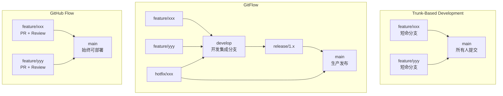
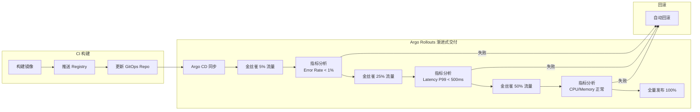

# CI/CD 流水线模式与渐进式交付深度实践

> **适用版本**: [[Argo|Argo]] Rollouts v1.8 / Argo CD v3.3 / Flagger v1.40
> **最后更新**: 2026-04-24
> **难度**: 高级

---

<!-- chunk: 📋 目录 -->## 📋 目录

- [一、概述](#一概述)
- [二、架构设计](#二架构设计)
- [三、核心配置](#三核心配置)
- [四、安全与合规](#四安全与合规)
- [五、多环境管理策略](#五多环境管理策略)
- [六、监控与回滚](#六监控与回滚)
- [七、最佳实践](#七最佳实践)
- [八、故障排查](#八故障排查)

---

<!-- chunk: 一、概述 -->## 一、概述

CI/CD 流水线模式和部署策略是软件交付过程中的核心决策。不同的分支策略（Trunk-Based、GitFlow、GitHub Flow）直接影响团队协作效率和发布节奏；不同的部署策略（滚动更新、蓝绿部署、金丝雀发布）直接影响用户感知和风险控制。选择合适的模式组合，是构建高效、安全交付流程的基础。

渐进式交付（Progressive Delivery）是 CI/CD 的高级形态，它将部署过程分解为多个渐进阶段，每个阶段都通过自动化指标分析验证服务质量，只有验证通过才推进到下一阶段。Argo Rollouts 和 Flagger 是 [[Kubernetes|Kubernetes]] 生态中两个主流的渐进式交付工具，它们替代 Kubernetes 原生的 Deployment 资源，提供更精细的发布控制能力。

本文档深入探讨四种分支策略的优缺点和适用场景、三种部署策略的技术实现、环境晋升（Promotion）的自动化流程，以及 Argo Rollouts 金丝雀/蓝绿发布的完整配置。这些实践帮助企业根据团队规模和应用特点选择最合适的 CI/CD 模式。

---

<!-- chunk: 二、架构设计 -->## 二、架构设计

## 2.1 分支策略对比



## 2.2 渐进式交付架构



## 2.3 分支策略对比表

| 维度 | Trunk-Based | GitFlow | GitHub Flow |
|:---|:---|:---|:---|
| **分支数** | 少 (main + 短命feature) | 多 (main/develop/feature/release/hotfix) | 少 (main + feature PR) |
| **发布频率** | 高 (持续部署) | 低 (按版本发布) | 高 (PR 合并即部署) |
| **团队规模** | 小中型，高成熟度 | 大型，低成熟度 | 中小型 |
| **复杂度** | 低 | 高 | 中 |
| **推荐工具** | GitHub Actions + Argo CD | Jenkins + GitLab CI | GitHub Actions + Argo CD |
| **适用场景** | SaaS、微服务 | 企业级应用、移动端 | 开源项目、Web应用 |

---

<!-- chunk: 三、核心配置 -->## 三、核心配置

## 3.1 Trunk-Based + Argo CD 模式

```yaml
# GitHub Actions: 构建 + 推送 + 更新 GitOps
name: Trunk-Based CI/CD
on:
  push:
    branches: [main]

jobs:
  build:
    runs-on: ubuntu-latest
    steps:
      - uses: actions/checkout@v4

      - name: Build and push image
        run: |
          docker build -t ghcr.io/org/app:${{ github.sha }} .
          docker push ghcr.io/org/app:${{ github.sha }}

      - name: Update GitOps repo
        uses: actions/checkout@v4
        with:
          repository: org/gitops-manifests
          token: ${{ secrets.GITOPS_PAT }}
          path: gitops
      - run: |
          cd gitops
          kustomize edit set image app=ghcr.io/org/app:${{ github.sha }}
          git config user.name "GitHub Actions"
          git config user.email "ci@example.com"
          git add .
          git commit -m "Update app to ${{ github.sha }}"
          git push origin main
```

## 3.2 Argo Rollouts 金丝雀发布

```yaml
apiVersion: argoproj.io/v1alpha1
kind: Rollout
metadata:
  name: myapp
  namespace: production
spec:
  replicas: 10
  strategy:
    canary:
      canaryService: myapp-canary
      stableService: myapp-stable
      trafficRouting:
        istio:
          virtualServices:
            - name: myapp-vsvc
              routes:
                - primary

      steps:
        - setWeight: 5
        - pause: {duration: 5m}
        - setWeight: 10
        - pause: {duration: 5m}
        - analysis:
            templates:
              - templateName: success-rate
            args:
              - name: service-name
                value: myapp-canary.production.svc.cluster.local
        - setWeight: 25
        - pause: {duration: 5m}
        - analysis:
            templates:
              - templateName: latency-check
        - setWeight: 50
        - pause: {duration: 10m}
        - analysis:
            templates:
              - templateName: error-rate-check
        - setWeight: 100
        - pause: {duration: 0}

  revisionHistoryLimit: 5
  selector:
    matchLabels:
      app: myapp
  template:
    metadata:
      labels:
        app: myapp
    spec:
      containers:
        - name: myapp
          image: ghcr.io/org/app:latest
          ports:
            - containerPort: 8080
          resources:
            requests:
              cpu: 100m
              memory: 128Mi
            limits:
              cpu: 500m
              memory: 512Mi
          readinessProbe:
            httpGet:
              path: /health
              port: 8080
            initialDelaySeconds: 10
            periodSeconds: 5
          livenessProbe:
            httpGet:
              path: /health
              port: 8080
            initialDelaySeconds: 15
            periodSeconds: 10
```

## 3.3 AnalysisTemplate 指标分析

```yaml
apiVersion: argoproj.io/v1alpha1
kind: AnalysisTemplate
metadata:
  name: success-rate
  namespace: production
spec:
  args:
    - name: service-name
  metrics:
    - name: success-rate
      interval: 30s
      count: 6
      successCondition: result[0] >= 0.99
      provider:
        prometheus:
          address: http://prometheus.monitoring.svc.cluster.local:9090
          query: |
            sum(rate(http_requests_total{service="{{args.service-name}}",status!~"5.."}[1m])) /
            sum(rate(http_requests_total{service="{{args.service-name}}"}[1m]))
---
apiVersion: argoproj.io/v1alpha1
kind: AnalysisTemplate
metadata:
  name: latency-check
  namespace: production
spec:
  metrics:
    - name: p99-latency
      interval: 30s
      count: 6
      successCondition: result[0] <= 0.5
      provider:
        prometheus:
          address: http://prometheus.monitoring.svc.cluster.local:9090
          query: |
            histogram_quantile(0.99,
              sum(rate(http_request_duration_seconds_bucket{service="myapp-canary"}[1m])) by (le)
            )
---
apiVersion: argoproj.io/v1alpha1
kind: AnalysisTemplate
metadata:
  name: error-rate-check
  namespace: production
spec:
  metrics:
    - name: error-rate
      interval: 30s
      count: 6
      successCondition: result[0] <= 0.01
      provider:
        prometheus:
          address: http://prometheus.monitoring.svc.cluster.local:9090
          query: |
            sum(rate(http_requests_total{service="myapp-canary",status=~"5.."}[1m])) /
            sum(rate(http_requests_total{service="myapp-canary"}[1m]))
```

## 3.4 蓝绿部署

```yaml
apiVersion: argoproj.io/v1alpha1
kind: Rollout
metadata:
  name: myapp-bluegreen
  namespace: production
spec:
  replicas: 5
  strategy:
    blueGreen:
      activeService: myapp-active
      previewService: myapp-preview
      autoPromotionEnabled: false
      autoPromotionSeconds: 300
      scaleDownDelaySeconds: 600
      prePromotionAnalysis:
        templates:
          - templateName: pre-promotion-check
      postPromotionAnalysis:
        templates:
          - templateName: post-promotion-check

  selector:
    matchLabels:
      app: myapp
  template:
    metadata:
      labels:
        app: myapp
    spec:
      containers:
        - name: myapp
          image: ghcr.io/org/app:latest
          ports:
            - containerPort: 8080
---
apiVersion: v1
kind: Service
metadata:
  name: myapp-active
spec:
  selector:
    app: myapp
    rollouts-pod-template-hash: stable
  ports:
    - port: 80
      targetPort: 8080
---
apiVersion: v1
kind: Service
metadata:
  name: myapp-preview
spec:
  selector:
    app: myapp
    rollouts-pod-template-hash: preview
  ports:
    - port: 80
      targetPort: 8080
```

## 3.5 环境晋升 Pipeline

```yaml
# 环境晋升流水线 (GitHub Actions)
name: Environment Promotion
on:
  workflow_dispatch:
    inputs:
      version:
        description: 'Version to promote'
        required: true
      target_environment:
        description: 'Target environment'
        type: choice
        options: [staging, production]

jobs:
  promote:
    runs-on: ubuntu-latest
    environment: ${{ github.event.inputs.target_environment }}
    steps:
      - uses: actions/checkout@v4
        with:
          repository: org/gitops-manifests
          token: ${{ secrets.GITOPS_PAT }}

      - name: Promote to ${{ github.event.inputs.target_environment }}
        run: |
          ENV=${{ github.event.inputs.target_environment }}
          VERSION=${{ github.event.inputs.version }}

          cd apps/myapp/overlays/$ENV
          kustomize edit set image app=ghcr.io/org/app:$VERSION

          git config user.name "Promotion Bot"
          git config user.email "promotion@example.com"
          git add .
          git commit -m "promote: myapp $VERSION to $ENV"
          git push origin main
```

---

<!-- chunk: 四、安全与合规 -->## 四、安全与合规

## 4.1 发布审批策略

```yaml
# 环境保护规则
environments:
  production:
    required_reviewers:
      teams: ["release-managers"]
    wait_timer: 1440
    deployment_branch_policy:
      protected_branches: true

  staging:
    required_reviewers:
      teams: ["dev-leads"]
    wait_timer: 60
```

## 4.2 回滚安全

```yaml
rollback_policy:
  automated_rollback:
    trigger: analysis_template_failure
    action: promote_stable_revision
    notification: slack_alert

  manual_rollback:
    command: "kubectl argo rollouts undo myapp -n production"
    approval: required_from_release_manager

  rollback_verification:
    - health_check_passed
    - error_rate_below_threshold
    - latency_within_sla
```

---

<!-- chunk: 五、多环境管理策略 -->## 五、多环境管理策略

## 5.1 Promotion 矩阵

```yaml
promotion_matrix:
  dev_to_staging:
    trigger: merge_to_main
    automation: fully_automated
    conditions:
      - unit_tests_passed: true
      - security_scan_clean: true

  staging_to_production:
    trigger: manual_approval + tag_release
    automation: semi_automated
    conditions:
      - integration_tests_passed: true
      - performance_benchmark_passed: true
      - monitoring_stable: 24h
      - manual_approval: required
```

## 5.2 多集群金丝雀

```yaml
# 逐集群金丝雀发布
apiVersion: argoproj.io/v1alpha1
kind: ApplicationSet
metadata:
  name: myapp-rollout
spec:
  generators:
    - clusters:
        selector:
          matchLabels:
            environment: production
  template:
    spec:
      source:
        path: apps/myapp/rollout
      syncPolicy:
        automated:
          prune: true
          selfHeal: true
```

---

<!-- chunk: 六、监控与回滚 -->## 六、监控与回滚

## 6.1 Rollout 监控

```yaml
- alert: RolloutStuck
  expr: argoproj_rollout_status{phase="Paused"} == 1
  for: 30m
  labels:
    severity: warning
  annotations:
    summary: "Rollout 处于暂停状态超过30分钟"

- alert: RolloutDegraded
  expr: argoproj_rollout_status{phase="Degraded"} == 1
  for: 5m
  labels:
    severity: critical
  annotations:
    summary: "Rollout 处于降级状态"

- alert: CanaryHighErrorRate
  expr: |
    sum(rate(http_requests_total{service=~".*-canary",status=~"5.."}[1m])) /
    sum(rate(http_requests_total{service=~".*-canary"}[1m])) > 0.05
  for: 2m
  labels:
    severity: critical
  annotations:
    summary: "金丝雀版本错误率超过 5%"
```

## 6.2 回滚操作

```bash
# Argo Rollouts 回滚
kubectl argo rollouts undo myapp -n production

# 查看回滚状态
kubectl argo rollouts get rollout myapp -n production

# 查看回滚历史
kubectl argo rollouts list rollouts -A

# 终止金丝雀发布
kubectl argo rollouts abort myapp -n production

# 重试金丝雀发布
kubectl argo rollouts retry myapp -n production
```

---

<!-- chunk: 七、最佳实践 -->## 七、最佳实践

## 7.1 部署策略选择

```
滚动更新 (RollingUpdate):
  适用: 低风险变更、无状态应用
  优点: 简单、无需额外资源
  缺点: 无法精确控制流量比例

蓝绿部署 (Blue-Green):
  适用: 需要零停机切换的场景
  优点: 即时切换、回滚快速
  缺点: 需要双倍资源

金丝雀发布 (Canary):
  适用: 高风险变更、需要验证的场景
  优点: 渐进式验证、自动回滚
  缺点: 配置复杂、需要流量管理
```

## 7.2 AnalysisTemplate 最佳实践

```yaml
1. 指标选择:
   - 成功率 (error rate < 1%)
   - 延迟 (P99 < 500ms)
   - CPU/Memory 使用率
   - 自定义业务指标

2. 采样策略:
   - interval: 30s (采样间隔)
   - count: 6 (采样次数)
   - 成功条件: 所有采样都满足

3. 失败策略:
   - 自动回滚 (推荐)
   - 暂停等待人工决策
   - 继续但告警
```

---

<!-- chunk: 八、故障排查 -->## 八、故障排查

```bash
# Rollout 状态
kubectl argo rollouts get rollout myapp -n production
kubectl describe rollout myapp -n production

# 分析运行状态
kubectl get analysisrun -A
kubectl describe analysisrun <name> -n production

# 金丝雀 Pod 日志
kubectl logs -l app=myapp,rollouts-pod-template-hash=<canary-hash> -n production

# 查看流量分配
kubectl get virtualservice myapp-vsvc -n production -o yaml
```

```yaml
常见问题:
  Rollout 卡住:
    - 检查 pause 步骤是否需要手动推进
    - 查看 AnalysisRun 状态
    - 检查 Pod 健康状态

  AnalysisRun 失败:
    - 检查 Prometheus 查询语法
    - 验证指标数据是否可用
    - 查看 AnalysisRun 日志

  金丝雀流量不生效:
    - 检查 Istio VirtualService 配置
    - 验证 Service selector 标签
    - 检查流量路由配置

  自动回滚不触发:
    - 检查 AnalysisTemplate 条件
    - 确认 rollbackWindow 配置
    - 查看 Controller 日志
```

---

<!-- chunk: 九、环境晋升自动化 -->## 九、环境晋升自动化

## 9.1 晋升流水线设计

环境晋升（Environment Promotion）是将经过验证的制品从一个环境推进到下一个更高级环境的过程。在 GitOps 模式下，晋升的本质是更新 GitOps 清单仓库中的镜像标签引用。一个设计良好的晋升流程应该包含自动化验证门禁和必要的人工审批点。

```yaml
# 多环境晋升流水线 (GitHub Actions)
name: Environment Promotion
on:
  workflow_dispatch:
    inputs:
      version:
        description: 'Version to promote (e.g. v1.2.3)'
        required: true
      source_environment:
        description: 'Source environment'
        type: choice
        options: [development, staging]
      target_environment:
        description: 'Target environment'
        type: choice
        options: [staging, production]

jobs:
  validate:
    runs-on: ubuntu-latest
    outputs:
      valid: ${{ steps.check.outputs.valid }}
    steps:
      - name: Validate promotion rules
        id: check
        run: |
          SOURCE="${{ github.event.inputs.source_environment }}"
          TARGET="${{ github.event.inputs.target_environment }}"
          if "$SOURCE" == "development" && "$TARGET" == "production"; then
            echo "Direct promotion from dev to production is not allowed"
            echo "valid=false" >> $GITHUB_OUTPUT
            exit 1
          fi
          echo "valid=true" >> $GITHUB_OUTPUT

  promote:
    needs: validate
    if: needs.validate.outputs.valid == 'true'
    runs-on: ubuntu-latest
    environment: ${{ github.event.inputs.target_environment }}
    steps:
      - uses: actions/checkout@v4
        with:
          repository: org/gitops-manifests
          token: ${{ secrets.GITOPS_PAT }}
          ref: main

      - name: Promote
        run: |
          VERSION="${{ github.event.inputs.version }}"
          TARGET="${{ github.event.inputs.target_environment }}"
          cd apps/myapp/overlays/$TARGET
          kustomize edit set image app=ghcr.io/org/app:$VERSION
          cd -
          git config user.name "Promotion Bot"
          git config user.email "promotion@example.com"
          git add .
          git commit -m "promote: myapp $VERSION to $TARGET"
          git push origin main
```

## 9.2 Trunk-Based 开发与持续部署

Trunk-Based Development（主干开发）是高绩效团队的首选分支策略。它的核心理念是所有开发者在 main 分支（主干）上频繁提交，通过短命的 feature 分支和自动化流水线确保代码质量。结合 Argo CD 的自动同步模式，可以实现从代码提交到生产部署的全自动化。

```yaml
# Trunk-Based 完整自动化流水线
name: Trunk-Based CI/CD
on:
  push:
    branches: [main]

jobs:
  ci:
    runs-on: ubuntu-latest
    steps:
      - uses: actions/checkout@v4
      - name: Build, Test, Push
        run: |
          docker build -t ghcr.io/org/app:${{ github.sha }} .
          docker push ghcr.io/org/app:${{ github.sha }}

      - name: Update GitOps
        run: |
          git clone https://x-access-token:${{ secrets.GITOPS_PAT }}@github.com/org/gitops
          cd gitops
          kustomize edit set image app=ghcr.io/org/app:${{ github.sha }}
          git commit -am "deploy: ${{ github.sha }}"
          git push
```

## 9.3 GitFlow 版本发布策略

GitFlow 适用于发布周期较长、需要同时维护多个版本的企业级应用。它通过 develop（开发集成）、release（发布准备）、hotfix（紧急修复）等长期分支管理不同阶段的代码。结合 Argo CD 的手动同步模式，可以在 release 分支准备就绪后触发生产部署。

```yaml
# GitFlow 发布流水线
name: GitFlow Release
on:
  push:
    branches: [release/*]

jobs:
  release:
    runs-on: ubuntu-latest
    steps:
      - uses: actions/checkout@v4
      - name: Build release artifact
        run: |
          docker build -t ghcr.io/org/app:${{ github.ref_name }} .
          docker push ghcr.io/org/app:${{ github.ref_name }}

      - name: Update staging GitOps
        run: |
          git clone https://x-access-token:${{ secrets.PAT }}@github.com/org/gitops
          cd gitops/apps/myapp/overlays/staging
          kustomize edit set image app=ghcr.io/org/app:${{ github.ref_name }}
          cd -
          git commit -am "release: staging ${{ github.ref_name }}"
          git push
```

---

<!-- chunk: 十、渐进式交付深度实践 -->## 十、渐进式交付深度实践

## 10.1 Argo Rollouts 金丝雀发布

Argo Rollouts 是 Kubernetes Deployment 的替代控制器，提供了原生的金丝雀发布和蓝绿部署能力。与 Deployment 的滚动更新相比，Argo Rollouts 支持基于流量百分比的精确控制、自动回滚和集成外部指标分析。

```yaml
# Argo Rollouts 金丝雀发布配置
apiVersion: argoproj.io/v1alpha1
kind: Rollout
metadata:
  name: myapp
spec:
  replicas: 10
  strategy:
    canary:
      canaryService: myapp-canary
      stableService: myapp-stable
      trafficRouting:
        istio:
          virtualServices:
            - name: myapp-vsvc
              routes:
                - primary
      steps:
        - setWeight: 5
        - pause: { duration: 5m }
        - setWeight: 10
        - pause: { duration: 5m }
        - analysis:
            templates:
              - templateName: success-rate
            args:
              - name: service-name
                value: myapp-canary.default.svc.cluster.local
        - setWeight: 30
        - pause: { duration: 10m }
        - analysis:
            templates:
              - templateName: error-rate
        - setWeight: 50
        - pause: { duration: 10m }
        - setWeight: 80
        - pause: { duration: 5m }
        - setWeight: 100
      rollbackWindow:
        revisions: 3
      abortScaleDownDelaySeconds: 30
```

## 10.2 Flagger 自动化分析

Flagger 是 [[Flux|Flux]] 生态中的渐进式交付工具，支持 Istio、[[Linkerd|Linkerd]]、App Mesh、Contour、NGINX 和 Gloo 等多种服务网格和 Ingress 控制器。Flagger 的 AnalysisTemplate 支持 Prometheus、Datadog、CloudWatch 和 Webhook 等多种指标来源，可以根据业务指标自动决定是否继续发布或回滚。

```yaml
# Flagger Canary 配置
apiVersion: flagger.app/v1beta1
kind: Canary
metadata:
  name: myapp
  namespace: default
spec:
  targetRef:
    apiVersion: apps/v1
    kind: Deployment
    name: myapp
  service:
    port: 8080
    targetPort: 8080
  analysis:
    interval: 1m
    threshold: 5
    maxWeight: 50
    stepWeight: 10
    metrics:
      - name: request-success-rate
        thresholdRange:
          min: 99
        interval: 1m
      - name: request-duration
        thresholdRange:
          max: 500
        interval: 1m
    webhooks:
      - name: load-test
        type: rollout
        url: http://flagger-loadtester.test/
        metadata:
          cmd: "hey -z 1m -q 10 -c 2 http://myapp-canary:8080/"
          type: bash
    alerts:
      - name: "Slack"
        severityLevel: "info"
        providerRef:
          name: slack
          namespace: flagger-system
```

## 10.3 发布窗口与维护策略

企业级发布管理需要考虑发布窗口、维护计划和业务影响。推荐的策略是：工作日白天发布低风险变更，工作日晚上发布中风险变更，周末发布高风险变更。紧急修复（Hotfix）可以突破发布窗口限制，但需要额外的审批流程。

```yaml
# 发布窗口策略
release_policy:
  normal:
    window: "工作日 10:00-16:00"
    approval: 自动
    rollback: 自动（基于指标）
    
  medium_risk:
    window: "工作日 22:00-02:00"
    approval: 团队负责人
    rollback: 自动
    
  high_risk:
    window: "周六 02:00-06:00"
    approval: 技术总监 + 运维负责人
    rollback: 手动触发 + 自动执行
    prerequisites:
      - 变更评审会议
      - 回滚计划文档
      - 监控告警配置
      - 值班人员就位
      
  hotfix:
    window: "任意时间"
    approval: 值班负责人
    rollback: 自动
    post_actions:
      - 根因分析（24小时内）
      - 补充回归测试
      - 更新文档

```

---

<!-- chunk: 十一、CI/CD 平台迁移策略 -->## 十一、CI/CD 平台迁移策略

## 11.1 从传统 CI/CD 迁移到 GitOps

企业从传统 CI/CD（如 Jenkins + kubectl apply）迁移到 GitOps 需要分阶段进行。推荐的迁移路径是：第一阶段将部署脚本转换为 Kubernetes 清单并存入 Git 仓库；第二阶段引入 Argo CD 或 Flux 进行自动化同步；第三阶段将 CI 和 CD 解耦，CI 只负责构建和推送镜像，CD 完全由 GitOps 工具接管。

```yaml
迁移阶段规划:
  阶段一 (1-2周):
    - 盘点现有部署脚本和流程
    - 将所有 K8s 清单迁移到 Git 仓库
    - 建立环境目录结构 (base/overlays)
    - 使用 Kustomize 管理环境差异
    
  阶段二 (2-4周):
    - 部署 Argo CD / Flux 到集群
    - 配置 Application / Kustomization
    - 验证自动同步功能
    - 建立监控和告警
    
  阶段三 (持续):
    - CI 流水线最后一步改为更新 Git 仓库
    - 移除 CI 中的直接部署步骤
    - 引入渐进式交付
    - 完善安全扫描和合规流程
```

## 11.2 多 CI 平台共存

在大型企业中，往往存在多个 CI 平台共存的局面（如 Jenkins 处理遗留项目、GitHub Actions 处理开源项目、Tekton 处理云原生项目）。GitOps 可以作为统一的部署层，屏蔽底层 CI 平台的差异。无论使用哪个 CI 平台，最终的部署都是通过更新 GitOps 清单仓库来触发。

```yaml
统一部署层设计:
  CI 层 (多样化):
    Jenkins:
      - 遗留 Java 项目
      - 复杂构建流程
    GitHub Actions:
      - 开源项目
      - 快速迭代项目
    Tekton:
      - 云原生项目
      - 供应链安全要求高的项目
      
  统一层:
    GitOps 仓库:
      - 所有镜像引用集中管理
      - 环境配置标准化
      - 审计追踪统一
      
  CD 层:
    Argo CD:
      - 多集群管理
      - 手动审批流程
    Flux:
      - 自动化部署
      - 轻量级工作负载
```

---

<!-- chunk: 参考链接 -->## 参考链接

- [Argo Rollouts](https://argoproj.github.io/argo-rollouts/)
- [Flagger](https://github.com/fluxcd/flagger)
- [Trunk-Based Development](https://trunkbaseddevelopment.com/)
- [GitFlow](https://nvie.com/posts/a-successful-git-branching-model/)
- [Argo CD + Rollouts 集成](https://argo-cd.readthedocs.io/en/stable/operator-manual/cluster-bootstrapping/)
- [DORA Metrics](https://dora.dev/)
- [SLSA Framework](https://slsa.dev/)
- [OpenGitOps Principles](https://opengitops.dev/)
- [GitHub Flow](https://docs.github.com/en/get-started/using-github/github-flow)
- [Environment Promotion Pattern](https://argo-cd.readthedocs.io/en/stable/user-guide/multiple-resources/)

---

<!-- chunk: Obsidian 相关文档 -->## Obsidian 相关文档

- domain-08-release-change-management MOC
- [[domain-08-release-change-management/README.md|Domain 08: GitOps与CI/CD (GitOps & CI/CD)]]
- Domain-23 GitOps & CI/CD — 开源项目索引
- Argo CD企业级GitOps实践指南
- Jenkins企业级CI/CD流水线深度实践
- GitLab CI/CD 企业级流水线自动化平台
- GitHub Actions Enterprise CI/CD Platform 深度实践
- Tekton 云原生 CI/CD 深度实践
- Flux v2 GitOps 持续交付深度实践
- GitOps 安全与合规深度实践
- Argo CD 企业级 GitOps 实践指南
- Flux GitOps 实践指南

## See Also

- 06-flux-gitops-continuous-delivery
- 07-gitops-security-compliance
- 99-argo-cd-gitops-guide
- 99-flux-gitops-guide

```