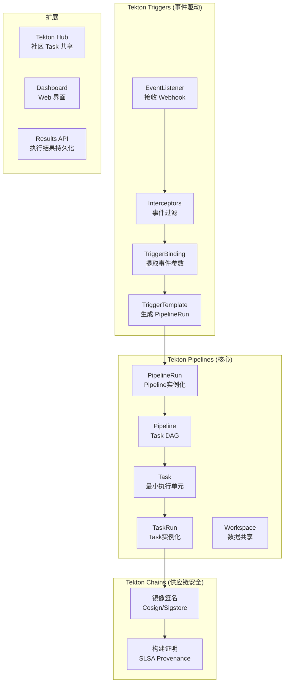

> **生产环境安全提示**
>
> 本文档包含可直接执行的运维命令。执行前请确认：当前目标集群与 Namespace 是否正确；是否具备足够的 RBAC 权限；是否已在非生产环境验证。命令风险等级标注：🔴 高风险（可能造成数据丢失或服务中断）、🟡 中风险（会修改集群状态，但通常可回滚）、🟢 低风险/只读（信息收集，无副作用）。


# Tekton 云原生 CI/CD 实践指南

> **适用版本**: Tekton Pipelines v0.68 / Tekton Triggers v0.30
> **最后更新**: 2026-04-24
> **难度**: 中级 → 高级

---

<!-- chunk: 📋 目录 -->## 📋 目录

- [一、概述](#一概述)
- [二、架构设计](#二架构设计)
- [三、核心配置](#三核心配置)
- [四、安全与合规](#四安全与合规)
- [五、多环境管理策略](#五多环境管理策略)
- [六、监控与回滚](#六监控与回滚)
- [七、最佳实践](#七最佳实践)
- [八、故障排查](#八故障排查)

---

<!-- chunk: 一、概述 -->## 一、概述

Tekton 是由 Continuous Delivery Foundation (CDF) 托管的云原生 CI/CD 框架，完全基于 [[Kubernetes|Kubernetes]] 原生资源定义。它的设计理念是将 CI/CD 流水线分解为可复用的 Task 和 Pipeline 资源，每个 Step 对应一个容器执行。这种设计使得 CI/CD 流水线完全声明式、可版本化、GitOps 友好。

Tekton 的核心优势包括：完全 Kubernetes 原生（所有资源都是 K8s CRD）；不可变执行（每个 TaskRun 创建独立的 Pod）；声明式配置（YAML 定义，GitOps 友好）；可组合可复用（Task Catalog / Tekton Hub）；供应链安全（Tekton Chains 支持 SLSA Level 3）；事件驱动（Tekton Triggers 支持 Webhook 触发）。

Tekton 在企业中的典型定位是 CI 层——负责代码构建、测试、镜像推送和签名。CD 层通常由 [[Argo|Argo]] CD 或 [[Flux|Flux]] 等 GitOps 工具处理。Tekton + Argo CD 的组合已成为云原生 CI/CD 的标准模式：Tekton 负责将代码转化为可部署制品，Argo CD 负责将制品部署到集群。

本指南覆盖 Tekton 的核心概念、安装部署、Task/Pipeline 定义、Triggers 事件触发、与 Argo CD 的 GitOps 集成，以及与 Jenkins/GitHub Actions 的选型对比。

---

<!-- chunk: 二、架构设计 -->## 二、架构设计

## 2.1 Tekton 组件架构



## 2.2 核心概念

```
Tekton 组件
├── Pipelines (核心)
│   ├── Task         ← 最小执行单元 (Pod 中的容器序列)
│   ├── TaskRun      ← Task 的实例化执行
│   ├── Pipeline     ← Task 的有向无环图 (DAG)
│   └── PipelineRun  ← Pipeline 的实例化执行
│
├── Triggers (事件驱动)
│   ├── EventListener   ← 接收 Webhook
│   ├── TriggerBinding  ← 提取事件参数
│   ├── TriggerTemplate ← 生成 PipelineRun
│   └── ClusterTriggerBinding (全局)
│
├── Catalog (任务库)
│   └── Tekton Hub (社区共享 Task)
│
└── Chains (供应链安全)
    └── 自动签名 Artifact

设计理念
├── 每个 Step = 一个容器
├── 不可变镜像 (无 shell 脚本)
├── 声明式配置 (GitOps 友好)
└── 可组合、可复用
```

---

<!-- chunk: 三、核心配置 -->## 三、核心配置

## 3.1 安装部署

> ⚠️ **🟡 中危变更** — 变更集群资源状态，建议先 --dry-run 或 diff 确认
> - `kubectl apply/create/replace`：创建/变更集群资源

``` bash
# 🟡 中风险：会修改集群/资源状态，执行前请确认目标、影响范围与授权
# 安装 Tekton Pipelines
kubectl apply -f https://storage.googleapis.com/tekton-releases/pipeline/latest/release.yaml

# 安装 Tekton Triggers
kubectl apply -f https://storage.googleapis.com/tekton-releases/triggers/latest/release.yaml

# 安装 Tekton Dashboard (可选)
kubectl apply -f https://storage.googleapis.com/tekton-releases/dashboard/latest/release.yaml

# 安装 Tekton Chains (供应链安全)
kubectl apply -f https://storage.googleapis.com/tekton-releases/chains/latest/release.yaml

# 验证
kubectl get pods -n tekton-pipelines
```
```yaml
# 生产级默认配置
apiVersion: v1
kind: ConfigMap
metadata:
  name: config-defaults
  namespace: tekton-pipelines
data:
  default-timeout-minutes: "60"
  default-service-account: "tekton-pipeline"
  default-managed-by-label-value: "tekton-pipelines"
  default-pod-template: |
    securityContext:
      runAsNonRoot: true
      seccompProfile:
        type: RuntimeDefault
```

## 3.2 Task 定义

```yaml
apiVersion: tekton.dev/v1
kind: Task
metadata:
  name: build-go-app
  namespace: cicd
spec:
  description: Build a Go application

  params:
    - name: git-url
      type: string
      description: Git repository URL
    - name: git-revision
      type: string
      default: main
    - name: image-tag
      type: string
      default: latest

  workspaces:
    - name: source
      description: Source code workspace
    - name: dockerconfig
      description: Docker config for push
      optional: true

  results:
    - name: IMAGE_DIGEST
      description: Image Digest

  steps:
    - name: clone
      image: gcr.io/tekton-releases/github.com/tektoncd/pipeline/cmd/git-init:latest
      script: |
        git clone $(params.git-url) $(workspaces.source.path)/repo
        cd $(workspaces.source.path)/repo
        git checkout $(params.git-revision)

    - name: build
      image: golang:1.23-alpine
      workingDir: $(workspaces.source.path)/repo
      script: |
        go build -o app ./cmd/main.go

    - name: test
      image: golang:1.23-alpine
      workingDir: $(workspaces.source.path)/repo
      script: |
        go test -v ./...

    - name: build-image
      image: gcr.io/kaniko-project/executor:latest
      env:
        - name: DOCKER_CONFIG
          value: $(workspaces.dockerconfig.path)
      command:
        - /kaniko/executor
      args:
        - --context=$(workspaces.source.path)/repo
        - --dockerfile=Dockerfile
        - --destination=myregistry/app:$(params.image-tag)
        - --cache=true
        - --digest-file=$(results.IMAGE_DIGEST.path)
```

## 3.3 Pipeline 定义

```yaml
apiVersion: tekton.dev/v1
kind: Pipeline
metadata:
  name: ci-cd-pipeline
  namespace: cicd
spec:
  description: Full CI/CD pipeline

  params:
    - name: git-url
      type: string
    - name: git-revision
      type: string
    - name: image-tag
      type: string
    - name: deploy-env
      type: string
      default: staging

  workspaces:
    - name: shared-source
    - name: dockerconfig
    - name: argocd-config

  results:
    - name: image-digest
      value: $(tasks.build-image.results.IMAGE_DIGEST)

  tasks:
    - name: clone
      taskRef:
        name: git-clone
        kind: ClusterTask
      workspaces:
        - name: output
          workspace: shared-source
      params:
        - name: url
          value: $(params.git-url)
        - name: revision
          value: $(params.git-revision)

    - name: lint
      runAfter: [clone]
      taskRef:
        name: golangci-lint
      workspaces:
        - name: source
          workspace: shared-source

    - name: unit-test
      runAfter: [clone]
      taskRef:
        name: go-test
      workspaces:
        - name: source
          workspace: shared-source

    - name: build-image
      runAfter: [lint, unit-test]
      taskRef:
        name: kaniko-build
      workspaces:
        - name: source
          workspace: shared-source
        - name: dockerconfig
          workspace: dockerconfig
      params:
        - name: image-tag
          value: $(params.image-tag)

    - name: security-scan
      runAfter: [build-image]
      taskRef:
        name: trivy-scan
      params:
        - name: image
          value: myregistry/app:$(params.image-tag)

    - name: deploy
      runAfter: [security-scan]
      when:
        - input: $(params.deploy-env)
          operator: in
          values: ["staging", "production"]
      taskRef:
        name: argocd-sync
      workspaces:
        - name: config
          workspace: argocd-config
      params:
        - name: app-name
          value: myapp-$(params.deploy-env)
        - name: revision
          value: $(params.image-tag)

  finally:
    - name: notify
      taskRef:
        name: slack-notify
      params:
        - name: message
          value: "Pipeline completed for $(params.git-revision)"
```

## 3.4 PipelineRun

```yaml
apiVersion: tekton.dev/v1
kind: PipelineRun
metadata:
  generateName: ci-cd-pipeline-run-
  namespace: cicd
spec:
  pipelineRef:
    name: ci-cd-pipeline
  params:
    - name: git-url
      value: https://github.com/org/myapp.git
    - name: git-revision
      value: main
    - name: image-tag
      value: v1.2.3
    - name: deploy-env
      value: staging
  workspaces:
    - name: shared-source
      volumeClaimTemplate:
        spec:
          accessModes: ["ReadWriteOnce"]
          resources:
            requests:
              storage: 1Gi
    - name: dockerconfig
      secret:
        secretName: docker-registry-config
    - name: argocd-config
      secret:
        secretName: argocd-token
  timeouts:
    pipeline: "1h"
    tasks: "30m"
```

## 3.5 Triggers 事件触发

```yaml
apiVersion: triggers.tekton.dev/v1beta1
kind: TriggerTemplate
metadata:
  name: github-trigger-template
  namespace: cicd
spec:
  params:
    - name: git-url
    - name: git-revision
    - name: image-tag
  resourcetemplates:
    - apiVersion: tekton.dev/v1
      kind: PipelineRun
      metadata:
        generateName: github-ci-cd-
      spec:
        pipelineRef:
          name: ci-cd-pipeline
        params:
          - name: git-url
            value: $(tt.params.git-url)
          - name: git-revision
            value: $(tt.params.git-revision)
          - name: image-tag
            value: $(tt.params.image-tag)
        workspaces:
          - name: shared-source
            volumeClaimTemplate:
              spec:
                accessModes: ["ReadWriteOnce"]
                resources:
                  requests:
                    storage: 1Gi
---
apiVersion: triggers.tekton.dev/v1beta1
kind: TriggerBinding
metadata:
  name: github-binding
  namespace: cicd
spec:
  params:
    - name: git-url
      value: $(body.repository.clone_url)
    - name: git-revision
      value: $(body.after)
    - name: image-tag
      value: $(body.ref)
---
apiVersion: triggers.tekton.dev/v1beta1
kind: EventListener
metadata:
  name: github-listener
  namespace: cicd
spec:
  serviceAccountName: tekton-triggers
  triggers:
    - name: github-push
      interceptors:
        - ref:
            name: github
          params:
            - name: secretRef
              value:
                secretName: github-webhook-secret
                secretKey: secretToken
        - ref:
            name: cel
          params:
            - name: filter
              value: "body.ref == 'refs/heads/main'"
      bindings:
        - ref: github-binding
      template:
        ref: github-trigger-template
```

## 3.6 与 Argo CD 集成

```yaml
# Pipeline 中的 GitOps 步骤
- name: update-gitops
  runAfter: [build-image]
  workspaces:
    - name: gitops-repo
      workspace: gitops-repo
  taskSpec:
    workspaces:
      - name: gitops-repo
    steps:
      - name: update-image
        image: alpine/git:latest
        script: |
          cd $(workspaces.gitops-repo.path)
          kustomize edit set image app=myregistry/app:$(params.image-tag)
          git config --global user.email "tekton@example.com"
          git config --global user.name "Tekton"
          git add .
          git commit -m "Update image to $(params.image-tag)"
          git push origin main
```

---

<!-- chunk: 四、安全与合规 -->## 四、安全与合规

## 4.1 Tekton Chains 供应链安全

```yaml
# Tekton Chains 配置
apiVersion: v1
kind: ConfigMap
metadata:
  name: chains-config
  namespace: tekton-pipelines
data:
  artifacts.taskrun.format: "tekton-provenance"
  artifacts.taskrun.storage: "oci"
  artifacts.taskrun.signer: "x509"
  transparency.enabled: "true"
  transparency.url: "https://rekor.sigstore.dev"
```

## 4.2 安全上下文

```yaml
# Pod 安全模板
apiVersion: v1
kind: ConfigMap
metadata:
  name: config-defaults
  namespace: tekton-pipelines
data:
  default-pod-template: |
    securityContext:
      runAsNonRoot: true
      seccompProfile:
        type: RuntimeDefault
      fsGroup: 65532
```

---

<!-- chunk: 五、多环境管理策略 -->## 五、多环境管理策略

## 5.1 Workspace 数据传递

| 类型 | 用途 | 示例 |
|:---|:---|:---|
| EmptyDir | 临时共享 | build 产物传递 |
| PVC | 持久化 | 缓存依赖 |
| ConfigMap | 配置文件 | 构建配置 |
| Secret | 敏感数据 | registry 凭证 |
| VolumeClaimTemplate | 动态 PVC | PipelineRun 隔离 |

## 5.2 多环境 Pipeline

```yaml
apiVersion: tekton.dev/v1
kind: Pipeline
metadata:
  name: multi-env-pipeline
spec:
  params:
    - name: environments
      default: "staging,production"
  tasks:
    - name: deploy-staging
      params:
        - name: environment
          value: "staging"
      taskRef:
        name: kubectl-deploy

    - name: integration-test
      runAfter: [deploy-staging]
      taskRef:
        name: integration-test

    - name: deploy-production
      runAfter: [integration-test]
      when:
        - input: "$(params.environments)"
          operator: in
          values: ["production"]
      params:
        - name: environment
          value: "production"
      taskRef:
        name: kubectl-deploy
```

---

<!-- chunk: 六、监控与回滚 -->## 六、监控与回滚

## 6.1 Tekton Results API

> ⚠️ **🟡 中危变更** — 变更集群资源状态，建议先 --dry-run 或 diff 确认
> - `kubectl apply/create/replace`：创建/变更集群资源

``` bash
# 🟡 中风险：会修改集群/资源状态，执行前请确认目标、影响范围与授权
# 安装 Tekton Results
kubectl apply -f https://storage.googleapis.com/tekton-releases/results/latest/release.yaml

# 查询 PipelineRun 结果
tkn results list
tkn results records <result-name>
```
## 6.2 关键指标

```yaml
- alert: TektonPipelineRunFailed
  expr: tekton_pipelinerun_status == 1
  for: 5m
  labels:
    severity: warning
  annotations:
    summary: "Tekton PipelineRun 失败"
```

## 6.3 回滚

```bash
# Tekton 本身不负责部署回滚
# 回滚由 GitOps 工具 (Argo CD/Flux) 处理
# Tekton 侧可以重新运行旧的 PipelineRun

# 重新运行
tkn pipelinerun retry <pipelinerun-name>

# 或通过 PipelineRun 的 generateName 创建新的运行
```

---

<!-- chunk: 七、最佳实践 -->## 七、最佳实践

## 7.1 选型对比

| 维度 | Tekton | Jenkins | GitHub Actions |
|:---|:---|:---|:---|
| **架构** | K8s Native | 独立服务 | SaaS / Self-hosted |
| **执行环境** | K8s Pod | Agent/Slave | Runner (VM/Container) |
| **可移植性** | 任何 K8s 集群 | 需迁移基础设施 | 绑定 GitHub |
| **配置方式** | YAML (GitOps) | Groovy / UI | YAML |
| **供应链安全** | Chains (SLSA L3) | 需插件 | 有限 |
| **学习曲线** | 高 | 中 | 低 |

```
选择 Tekton 如果:
  ✅ 已在 K8s 上运行
  ✅ 需要 GitOps 原生 CI/CD
  ✅ 需要供应链安全 (SLSA)
  ✅ 需要跨云可移植性
```

## 7.2 社区 Task 复用

```bash
# 从 Tekton Hub 安装
tkn hub install task git-clone
tkn hub install task kaniko
tkn hub search build
```

| 常用 Task | 用途 |
|:---|:---|
| git-clone | 代码检出 |
| kaniko | 无特权构建镜像 |
| buildah | 容器镜像构建 |
| trivy-scanner | 漏洞扫描 |
| argocd-task | Argo CD 同步 |
| slack-send | Slack 通知 |

---

<!-- chunk: 八、故障排查 -->## 八、故障排查

``` bash
# 🟢 低风险：只读/信息收集，通常无副作用
# TaskRun 状态
kubectl get taskrun -A
kubectl describe taskrun <name> -n cicd
kubectl logs <taskrun-pod> -c <step-name>

# PipelineRun 状态
kubectl get pipelinerun -A
tkn pipelinerun logs <name> -f
tkn pipelinerun describe <name>

# EventListener 排查
kubectl get eventlistener -A
kubectl logs -n cicd deploy/el-github-listener

# Tekton 组件状态
kubectl get pods -n tekton-pipelines
kubectl logs -n tekton-pipelines deploy/tekton-pipelines-controller
```
```yaml
常见问题:
  TaskRun 失败:
    - 检查 Pod 状态: kubectl describe pod <pod>
    - 查看步骤日志: kubectl logs <pod> -c <step>
    - 检查镜像拉取: 描述 Pod Events

  Pipeline 卡住:
    - 检查 runAfter 依赖
    - 验证 when 条件
    - 调整 timeouts

  Trigger 不触发:
    - 检查 EventListener Service
    - 验证 Webhook Secret
    - 查看 Interceptor 日志
```

---

<!-- chunk: 十、Tekton 企业级运维 -->## 十、Tekton 企业级运维

## 10.1 Tekton CLI 高级用法

Tekton CLI (`tkn`) 是管理和调试 Tekton 资源的命令行工具。除了基本的创建、查看和删除操作外，`tkn` 还支持交互式日志查看、PipelineRun 重试和 TaskRun 调试等高级功能。

```bash
# 交互式查看 PipelineRun 日志
tkn pipelinerun logs <name> -f -L

# 查看 PipelineRun 详细信息
tkn pipelinerun describe <name>

# 重试失败的 PipelineRun
tkn pipelinerun retry <name>

# 取消正在运行的 PipelineRun
tkn pipelinerun cancel <name>

# 查看 EventListener 状态
tkn eventlistener list
tkn eventlistener describe github-listener

# 查看触发器绑定
tkn triggerbinding list
tkn triggertemplate list
```

## 10.2 Workspace 高级配置

Workspace 是 Tekton 中 Task 和 Pipeline 间数据共享的核心机制。它支持多种 Volume 类型，可以根据数据特性选择最合适的存储方式。对于需要持久化缓存的场景（如 Maven 仓库），推荐使用 PVC；对于临时数据传递，推荐使用 VolumeClaimTemplate（每次 PipelineRun 创建独立的 PVC）。

```yaml
# Workspace 绑定策略
workspaces:
  # 源代码 - 每次 PipelineRun 独立 PVC
  - name: shared-source
    volumeClaimTemplate:
      spec:
        accessModes: ["ReadWriteOnce"]
        resources:
          requests:
            storage: 1Gi

  # Maven 缓存 - 共享 PVC (跨 PipelineRun 复用)
  - name: maven-repo
    persistentVolumeClaim:
      claimName: maven-repo-cache

  # Docker 凭证 - Secret
  - name: dockerconfig
    secret:
      secretName: registry-credentials

  # Maven 配置 - ConfigMap
  - name: settings
    configMap:
      name: maven-settings
```

## 10.3 Tekton 与 Argo CD 完整集成

Tekton + Argo CD 的集成是云原生 CI/CD 的标准模式。Tekton 负责 CI（构建、测试、推送镜像），Argo CD 负责 CD（同步部署）。集成点在于 Tekton Pipeline 的最后一步：更新 GitOps 清单仓库中的镜像标签，Argo CD 自动检测到变更并同步部署。

```
完整工作流:
1. 开发者提交代码 → GitHub Webhook
2. Tekton EventListener 接收事件
3. TriggerBinding 提取参数 (git-url, revision)
4. TriggerTemplate 生成 PipelineRun
5. Pipeline 执行: clone → build → test → image → scan
6. 最后一步: 更新 GitOps 仓库中的 kustomize image
7. Argo CD 检测到 Git 变更 (轮询/Webhook)
8. Argo CD 自动同步部署到 K8s 集群
9. PostSync Hook 执行冒烟测试
```

---

<!-- chunk: 十一、Tekton Pipeline 高级设计模式 -->## 十一、Tekton Pipeline 高级设计模式

## 11.1 Matrix Pipeline

Tekton 的 Matrix 功能允许在 Pipeline 中并行执行同一 Task 的多个变体。这非常适合多平台构建（如同时构建 Linux/amd64、Linux/arm64、Windows 镜像）、多版本测试（如同时测试 Java 17 和 Java 21）和多云部署场景。

```yaml
# Matrix Pipeline: 多版本并行测试
apiVersion: tekton.dev/v1
kind: Pipeline
metadata:
  name: matrix-test-pipeline
spec:
  params:
    - name: git-url
      type: string
    - name: git-revision
      default: main
  workspaces:
    - name: source
  tasks:
    - name: fetch-source
      taskRef:
        name: git-clone
        kind: ClusterTask
      params:
        - name: url
          value: $(params.git-url)
        - name: revision
          value: $(params.git-revision)
      workspaces:
        - name: output
          workspace: source

    - name: matrix-test
      runAfter: [fetch-source]
      taskRef:
        name: maven
      matrix:
        params:
          - name: MAVEN_IMAGE
            value:
              - eclipse-temurin:17-jdk
              - eclipse-temurin:21-jdk
              - eclipse-temurin:22-jdk
          - name: GOAL
            value:
              - "test"
              - "verify"
      workspaces:
        - name: source
          workspace: source
```

## 11.2 条件执行与错误处理

Tekton 支持通过 `when` 表达式实现条件执行，通过 `onError` 和 `retries` 实现错误处理。`when` 表达式可以根据参数值、Task Result 或运行时条件决定是否执行某个 Task。`onError: continue` 允许 Task 失败后继续执行后续步骤，适用于非关键任务的场景。

```yaml
# 条件执行与错误处理
apiVersion: tekton.dev/v1
kind: Pipeline
metadata:
  name: conditional-pipeline
spec:
  params:
    - name: deploy-to-production
      default: "false"
  tasks:
    - name: build
      taskRef:
        name: buildah
        kind: ClusterTask
      params:
        - name: IMAGE
          value: myapp:latest

    - name: security-scan
      runAfter: [build]
      taskRef:
        name: trivy-scan
      retries: 2
      params:
        - name: IMAGE
          value: myapp:latest

    - name: deploy-staging
      runAfter: [security-scan]
      taskRef:
        name: kubectl-apply
      params:
        - name: manifest
          value: overlays/staging

    - name: deploy-production
      runAfter: [deploy-staging]
      when:
        - input: $(params.deploy-to-production)
          operator: in
          values: ["true"]
      taskRef:
        name: kubectl-apply
      params:
        - name: manifest
          value: overlays/production

    - name: notify
      runAfter: [deploy-production]
      taskRef:
        name: send-notification
      onError: continue
```

## 11.3 Results 传递与跨 Task 通信

Tekton Results 是 Task 之间传递数据的核心机制。一个 Task 的输出 Result 可以被后续 Task 引用，形成数据流。Results 支持字符串类型，可以传递镜像摘要（digest）、版本号、测试结果等元数据。

```yaml
# Results 传递示例
apiVersion: tekton.dev/v1
kind: Pipeline
metadata:
  name: results-pipeline
spec:
  tasks:
    - name: build
      taskRef:
        name: buildah
      params:
        - name: IMAGE
          value: myapp:latest

    - name: sign
      runAfter: [build]
      taskRef:
        name: cosign-sign
      params:
        - name: image-digest
          value: $(tasks.build.results.IMAGE_DIGEST)

    - name: update-gitops
      runAfter: [sign]
      taskRef:
        name: git-update
      params:
        - name: image
          value: "myapp@$(tasks.build.results.IMAGE_DIGEST)"
```

---

<!-- chunk: 十二、Tekton 与 GitOps 完整工作流 -->## 十二、Tekton 与 GitOps 完整工作流

Tekton 负责 CI（构建、测试、推送镜像），Argo CD 负责 CD（同步部署）。这种"CI + GitOps CD"的模式是云原生 CI/CD 的标准架构。Tekton Pipeline 的最后一步更新 GitOps 清单仓库中的镜像标签，Argo CD 自动检测到变更并同步部署。

## 12.1 完整工作流

```bash
# 完整 CI/CD + GitOps 工作流
# 1. 开发者提交代码
git push origin feature/my-feature

# 2. GitHub Webhook 触发 Tekton EventListener
# 3. Tekton Pipeline 执行:
#    a. 克隆代码仓库
#    b. 运行单元测试和集成测试
#    c. 构建容器镜像
#    d. 执行安全扫描
#    e. 使用 Cosign 签名镜像
#    f. 推送镜像到 Registry
#    g. 更新 GitOps 清单仓库中的镜像标签

# 4. Argo CD 检测到 GitOps 仓库变更
# 5. Argo CD 自动同步部署到 K8s 集群
# 6. PostSync Hook 执行冒烟测试
```

## 12.2 Pipeline 可视化与调试

Tekton Dashboard 提供了 Web 界面可视化查看 PipelineRun 的执行状态、步骤日志和结果。`tkn` CLI 提供了命令行工具来调试 PipelineRun 和 TaskRun，支持交互式日志查看和重试操作。

```bash
# 调试命令
tkn pipelinerun list
tkn pipelinerun describe <name>
tkn pipelinerun logs <name> -f -L
tkn taskrun list
tkn taskrun logs <name> -f

# 查看失败步骤
tkn pipelinerun describe <name> | grep -A5 "Failed"

# 重试失败的 PipelineRun
tkn pipelinerun retry <name>
```

---

<!-- chunk: 十三、Tekton 最佳实践总结 -->## 十三、Tekton 最佳实践总结

## 13.1 生产环境 Checklist

```yaml
Tekton 生产环境部署检查清单:

  基础架构:
    - 使用 Operator 或 Helm Chart 部署 Tekton
    - 配置 ResourceQuota 和 LimitRange
    - 配置 PVC 清理策略 (Tekton GC)
    - 启用 Embedded Status 减少请求

  安全配置:
    - 启用 Trusted Resources (验证 Task 签名)
    - 配置 Pod Security Standards
    - 使用 Workload Identity 访问云资源
    - 限制 ServiceAccount 权限

  Pipeline 设计:
    - 使用 ClusterTask 共享通用步骤
    - 配置合理的 Timeout 和 Retries
    - 使用 Workspace 管理缓存和凭证
    - 使用 Results 传递数据
    - 使用 Matrix 并行执行多配置测试

  运维配置:
    - 配置 Tekton Dashboard 可视化
    - 集成 Tekton Chains 供应链安全
    - 配置 Triggers 自动触发
    - 定期清理已完成的 PipelineRun
```

## 13.2 常见错误与解决方案

```yaml
常见问题:
  PipelineRun 超时:
    原因: 镜像拉取慢、测试运行慢、资源不足
    解决: 增加 timeout、配置镜像预热、增加资源配额

  TaskRun OOMKilled:
    原因: 内存限制过小、内存泄漏
    解决: 增加内存限制、分析堆内存使用

  Workspace 挂载失败:
    原因: PVC 未绑定、StorageClass 不存在
    解决: 检查 PVC 状态、验证 StorageClass 配置

  Triggers 不触发:
    原因: Webhook URL 错误、EventListener 未就绪
    解决: 检查 EventListener Service、验证 Webhook 配置
```

---

<!-- chunk: 参考链接 -->## 参考链接

- [Tekton 官方文档](https://tekton.dev/docs/)
- [Tekton Hub](https://hub.tekton.dev/)
- [Tekton GitHub](https://github.com/tektoncd/pipeline)
- [Tekton Triggers](https://tekton.dev/docs/triggers/)
- [Tekton Chains](https://tekton.dev/docs/chains/)
- [CLI 工具 tkn](https://tekton.dev/docs/cli/)
- [Tekton Dashboard](https://tekton.dev/docs/dashboard/)
- [Tekton Results](https://tekton.dev/docs/results/)
- [Tekton Catalog](https://github.com/tektoncd/catalog)
- [Tekton Operator](https://github.com/tektoncd/operator)
- [Tekton Triggers Interceptors](https://tekton.dev/docs/triggers/interceptors/)
- [Tekton PipelineRuns API](https://tekton.dev/docs/pipeline/pipelineruns/)
- [Tekton Workspaces Guide](https://tekton.dev/docs/pipeline/workspaces/)
- [Tekton Matrix Guide](https://tekton.dev/docs/pipeline/matrix-runs/)
- [Tekton Custom Tasks](https://tekton.dev/docs/pipeline/custom-tasks/)

---

<!-- chunk: Obsidian 相关文档 -->## Obsidian 相关文档

- domain-08-release-change-management MOC
- [[domain-08-release-change-management/README.md|Domain 08: GitOps与CI/CD (GitOps & CI/CD)]]
- Domain-23 GitOps & CI/CD — 开源项目索引
- Argo CD企业级GitOps实践指南
- Jenkins企业级CI/CD流水线深度实践
- GitLab CI/CD 企业级流水线自动化平台
- GitHub Actions Enterprise CI/CD Platform 深度实践
- Tekton 云原生 CI/CD 深度实践
- Flux v2 GitOps 持续交付深度实践
- GitOps 安全与合规深度实践
- CI/CD 流水线模式与渐进式交付深度实践
- Argo CD 企业级 GitOps 实践指南

## See Also

- 99-argo-cd-gitops-guide
- 99-flux-gitops-guide
- 99-tekton-java-cicd-guide
- 01-argo-cd-enterprise-gitops

## Related

- [[domain-19-landscape-references/topic-index/gitops-cicd-index.md|GitOps / CI-CD 全局索引]]


<!-- risk-assessed -->
