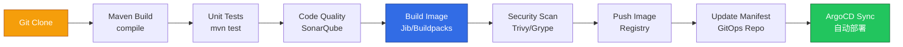

# Tekton Java CI/CD 流水线实践指南

> **适用版本**: Tekton Pipelines v0.68+ / Maven 3.9+ / Gradle 8.x
> **最后更新**: 2026-04-30
> **难度**: 中级

---

<!-- chunk: 📋 目录 -->## 📋 目录

- [一、概述](#一概述)
- [二、架构设计](#二架构设计)
- [三、核心配置](#三核心配置)
- [四、安全与合规](#四安全与合规)
- [五、多环境管理策略](#五多环境管理策略)
- [六、监控与回滚](#六监控与回滚)
- [七、最佳实践](#七最佳实践)
- [八、故障排查](#八故障排查)

---

<!-- chunk: 一、概述 -->## 一、概述

本指南是 Tekton CI/CD 实践的 Java 语言专项指南，提供从 Maven/Gradle 构建到容器镜像推送的完整 CI/CD 流水线方案。Java 是企业级应用开发的主流语言，Spring Boot 和 Quarkus 等框架在微服务架构中被广泛采用。在云原生场景中，Java 应用的 CI/CD 流水线需要处理编译构建、依赖管理、单元测试、代码质量、安全扫描、容器镜像构建和多环境部署等环节。

Tekton 在 Java CI/CD 中的优势在于完全容器化的构建环境——每个构建步骤在独立的容器中执行，避免了构建环境的"雪崩效应"。通过 Workspace PVC 缓存 Maven 本地仓库（`~/.m2/repository`），可以显著加速依赖下载。Jib 和 [[Buildpacks|Buildpacks]] 提供了无需 Dockerfile 的 Java 容器镜像构建能力，且无需 Docker 守护进程（Dockerless），非常适合 Tekton 的非特权执行环境。

本指南覆盖 Maven/Gradle Task 定义、Jib/Buildpacks 镜像构建、安全扫描集成、GitOps 集成、缓存策略和完整 Pipeline 模板，帮助 Java 团队在 [[Kubernetes|Kubernetes]] 上构建高效、安全的 CI/CD 流水线。

---

<!-- chunk: 二、架构设计 -->## 二、架构设计

#<!-- chunk: 2.1 Java CI/CD 流水线架构 -->## 2.1 Java CI/CD 流水线架构



#<!-- chunk: 2.2 Workspace 与缓存架构 -->## 2.2 Workspace 与缓存架构

```mermaid
graph TB
    subgraph "PipelineRun Workspaces"
        SRC[shared-workspace<br/>源代码 (VCT)]
        M2[maven-repo<br/>Maven 缓存 (PVC)]
        DOCKER[dockerconfig<br/>Registry 凭证 (Secret)]
        SETTINGS[settings<br/>Maven settings (ConfigMap)]
    end

    subgraph "Task 执行"
        CLONE[git-clone] --> BUILD[maven build]
        BUILD --> TEST[maven test]
        TEST --> IMAGE[jib-maven]
    end

    SRC --> CLONE
    SRC --> BUILD
    M2 --> BUILD
    M2 --> TEST
    M2 --> IMAGE
    DOCKER --> IMAGE
    SETTINGS --> BUILD
```

---

<!-- chunk: 三、核心配置 -->## 三、核心配置

#<!-- chunk: 3.1 Maven Task 定义 -->## 3.1 Maven Task 定义

```yaml
apiVersion: tekton.dev/v1
kind: Task
metadata:
  name: maven
  labels:
    app.kubernetes.io/version: "1.0"
  annotations:
    tekton.dev/pipelines.minVersion: "0.60"
    tekton.dev/displayName: "Maven Build"
spec:
  description: "Maven 构建任务"
  params:
    - name: GOALS
      description: "Maven 目标"
      default: "package"
      type: string
    - name: MAVEN_OPTS
      description: "JVM 参数"
      default: "-XX:+UseContainerSupport -XX:MaxRAMPercentage=75.0"
      type: string
    - name: CONTEXT_DIR
      description: "构建上下文目录"
      default: "."
      type: string
  workspaces:
    - name: source
      description: "源代码工作区"
    - name: maven-repo
      description: "Maven 本地仓库缓存"
    - name: settings
      description: "Maven settings.xml (可选)"
      optional: true
  results:
    - name: IMAGE_DIGEST
      description: "镜像 Digest"
    - name: JAR_PATH
      description: "JAR 文件路径"
  steps:
    - name: mvn-goals
      image: eclipse-temurin:21-jdk
      workingDir: $(workspaces.source.path)/$(params.CONTEXT_DIR)
      args:
        - $(params.GOALS)
      env:
        - name: MAVEN_OPTS
          value: $(params.MAVEN_OPTS)
      script: |
        #!/bin/sh
        SETTINGS_ARG=""
        if [ -f "$(workspaces.settings.path)/settings.xml" ]; then
          SETTINGS_ARG="-s $(workspaces.settings.path)/settings.xml"
        fi

        ./mvnw $SETTINGS_ARG \
          -Dmaven.repo.local=$(workspaces.maven-repo.path)/.m2/repository \
          -B \
          $(params.GOALS)

        JAR_FILE=$(find target -name "*.jar" ! -name "*-sources*" ! -name "*-javadoc*" | head -1)
        if [ -n "$JAR_FILE" ]; then
          echo -n "$JAR_FILE" > $(results.JAR_PATH.path)
        fi
```

#<!-- chunk: 3.2 Jib Maven Task (无 Dockerfile 镜像构建) -->## 3.2 Jib Maven Task (无 Dockerfile 镜像构建)

```yaml
apiVersion: tekton.dev/v1
kind: Task
metadata:
  name: jib-maven
spec:
  description: "使用 Jib 构建并推送 Java 容器镜像"
  params:
    - name: IMAGE
      description: "目标镜像地址"
      type: string
    - name: CONTEXT_DIR
      default: "."
  workspaces:
    - name: source
    - name: maven-repo
    - name: dockerconfig
      description: "Docker config.json (registry 认证)"
      optional: true
  results:
    - name: IMAGE_DIGEST
      description: "镜像 Digest"
  steps:
    - name: build-and-push
      image: eclipse-temurin:21-jdk
      workingDir: $(workspaces.source.path)/$(params.CONTEXT_DIR)
      script: |
        #!/bin/sh
        DOCKER_CONFIG=""
        if [ -d "$(workspaces.dockerconfig.path)" ]; then
          DOCKER_CONFIG="-Djib.dockerConfig=$(workspaces.dockerconfig.path)"
        fi

        ./mvnw \
          -Dmaven.repo.local=$(workspaces.maven-repo.path)/.m2/repository \
          -B \
          compile \
          com.google.cloud.tools:jib-maven-plugin:3.4.4:build \
          -Dimage=$(params.IMAGE) \
          $DOCKER_CONFIG \
          -Djib.to.auth.username=$(cat /tekton/registry-auth/username) \
          -Djib.to.auth.password=$(cat /tekton/registry-auth/password) \
          -Djib.serialize=true \
          -Djib.outputPaths.digest=$(results.IMAGE_DIGEST.path)
      volumeMounts:
        - name: registry-auth
          mountPath: /tekton/registry-auth
          readOnly: true
  volumes:
    - name: registry-auth
      secret:
        secretName: registry-credentials
        items:
          - key: username
            path: username
          - key: password
            path: password
```

#<!-- chunk: 3.3 Buildpacks Task -->## 3.3 Buildpacks Task

```yaml
apiVersion: tekton.dev/v1
kind: Task
metadata:
  name: buildpacks-java
spec:
  description: "使用 Paketo Buildpacks 构建 Java 镜像"
  params:
    - name: IMAGE
      type: string
    - name: BUILDER_IMAGE
      default: "paketobuildpacks/builder-jammy-base:latest"
    - name: SOURCE_SUBPATH
      default: "."
  workspaces:
    - name: source
    - name: dockerconfig
      optional: true
  results:
    - name: IMAGE_DIGEST
  steps:
  - name: build
    image: buildpacksio/pack:latest
    args:
      - build
      - $(params.IMAGE)
      - --builder
      - $(params.BUILDER_IMAGE)
      - --path
      - $(workspaces.source.path)/$(params.SOURCE_SUBPATH)
      - --env
      - BP_JVM_VERSION=21
      - --env
      - BP_SPRING_CLOUD_BINDINGS_ENABLED=true
      - --digest-file
      - $(results.IMAGE_DIGEST.path)
```

#<!-- chunk: 3.4 完整 Spring Boot Pipeline -->## 3.4 完整 Spring Boot Pipeline

```yaml
apiVersion: tekton.dev/v1
kind: Pipeline
metadata:
  name: spring-boot-ci
spec:
  description: "Spring Boot 完整 CI/CD 流水线"
  params:
    - name: git-url
      type: string
    - name: git-revision
      default: "main"
    - name: image
      type: string
    - name: context-dir
      default: "."
  workspaces:
    - name: shared-workspace
    - name: maven-repo
    - name: dockerconfig
    - name: settings
      optional: true
  results:
    - name: image-digest
      value: $(tasks.build-image.results.IMAGE_DIGEST)
  tasks:
    - name: fetch-repository
      taskRef:
        name: git-clone
        kind: ClusterTask
      params:
        - name: url
          value: $(params.git-url)
        - name: revision
          value: $(params.git-revision)
      workspaces:
        - name: output
          workspace: shared-workspace

    - name: maven-build
      runAfter: [fetch-repository]
      taskRef:
        name: maven
      params:
        - name: GOALS
          value: "clean compile -DskipTests"
        - name: CONTEXT_DIR
          value: $(params.context-dir)
      workspaces:
        - name: source
          workspace: shared-workspace
        - name: maven-repo
          workspace: maven-repo
        - name: settings
          workspace: settings

    - name: maven-test
      runAfter: [maven-build]
      taskRef:
        name: maven
      params:
        - name: GOALS
          value: "verify -DskipITs"
        - name: CONTEXT_DIR
          value: $(params.context-dir)
      workspaces:
        - name: source
          workspace: shared-workspace
        - name: maven-repo
          workspace: maven-repo

    - name: build-image
      runAfter: [maven-test]
      taskRef:
        name: jib-maven
      params:
        - name: IMAGE
          value: $(params.image)
        - name: CONTEXT_DIR
          value: $(params.context-dir)
      workspaces:
        - name: source
          workspace: shared-workspace
        - name: maven-repo
          workspace: maven-repo
        - name: dockerconfig
          workspace: dockerconfig

    - name: security-scan
      runAfter: [build-image]
      taskRef:
        name: trivy-scanner
        kind: ClusterTask
      params:
        - name: IMAGE
          value: "$(params.image)@$(tasks.build-image.results.IMAGE_DIGEST)"
        - name: SEVERITY
          value: "HIGH,CRITICAL"
```

#<!-- chunk: 3.5 生产 PipelineRun -->## 3.5 生产 PipelineRun

```yaml
apiVersion: tekton.dev/v1
kind: PipelineRun
metadata:
  name: spring-boot-ci-run-001
  annotations:
    tekton.dev/git-url: "https://github.com/org/spring-app"
spec:
  pipelineRef:
    name: spring-boot-ci
  params:
    - name: git-url
      value: "https://github.com/org/spring-app"
    - name: git-revision
      value: "main"
    - name: image
      value: "registry.example.com/spring-app:$(context.pipelineRun.uid)"
    - name: context-dir
      value: "."
  workspaces:
    - name: shared-workspace
      volumeClaimTemplate:
        spec:
          accessModes:
            - ReadWriteOnce
          resources:
            requests:
              storage: 1Gi
    - name: maven-repo
      persistentVolumeClaim:
        claimName: maven-repo-cache
    - name: dockerconfig
      secret:
        secretName: registry-credentials
    - name: settings
      configMap:
        name: maven-settings
  podTemplate:
    securityContext:
      runAsNonRoot: true
      runAsUser: 1001
      fsGroup: 1001
```

---

<!-- chunk: 四、安全与合规 -->## 四、安全与合规

#<!-- chunk: 4.1 安全扫描 Task -->## 4.1 安全扫描 Task

```yaml
apiVersion: tekton.dev/v1
kind: Task
metadata:
  name: java-security-scan
spec:
  params:
    - name: IMAGE
      type: string
    - name: CONTEXT_DIR
      default: "."
  workspaces:
    - name: source
  steps:
    - name: trivy-image-scan
      image: aquasec/trivy:latest
      script: |
        #!/bin/sh
        trivy image --severity HIGH,CRITICAL \
          --exit-code 1 \
          --format table \
          $(params.IMAGE)
    - name: trivy-fs-scan
      image: aquasec/trivy:latest
      workingDir: $(workspaces.source.path)/$(params.CONTEXT_DIR)
      script: |
        #!/bin/sh
        trivy fs --severity HIGH,CRITICAL \
          --scanners vuln,secret \
          --exit-code 1 \
          .
```

#<!-- chunk: 4.2 Maven settings.xml -->## 4.2 Maven settings.xml

```yaml
apiVersion: v1
kind: ConfigMap
metadata:
  name: maven-settings
data:
  settings.xml: |
    <?xml version="1.0" encoding="UTF-8"?>
    <settings>
      <mirrors>
        <mirror>
          <id>aliyun-maven</id>
          <mirrorOf>central</mirrorOf>
          <url>https://maven.aliyun.com/repository/public</url>
        </mirror>
      </mirrors>
      <profiles>
        <profile>
          <id>tekton</id>
          <properties>
            <maven.compiler.source>21</maven.compiler.source>
            <maven.compiler.target>21</maven.compiler.target>
          </properties>
        </profile>
      </profiles>
      <activeProfiles>
        <activeProfile>tekton</activeProfile>
      </activeProfiles>
    </settings>
```

---

<!-- chunk: 五、多环境管理策略 -->## 五、多环境管理策略

#<!-- chunk: 5.1 Maven 缓存 PVC -->## 5.1 Maven 缓存 PVC

```yaml
apiVersion: v1
kind: PersistentVolumeClaim
metadata:
  name: maven-repo-cache
spec:
  accessModes:
    - ReadWriteMany
  resources:
    requests:
      storage: 10Gi
  storageClassName: standard
```

#<!-- chunk: 5.2 GitOps 集成 (更新 Kustomize 镜像) -->## 5.2 GitOps 集成 (更新 Kustomize 镜像)

```yaml
apiVersion: tekton.dev/v1
kind: Task
metadata:
  name: update-kustomize-image
spec:
  params:
    - name: git-url
      type: string
    - name: image
      type: string
    - name: image-digest
      type: string
    - name: kustomize-dir
      default: "overlays/production"
  workspaces:
    - name: source
  steps:
    - name: update-and-push
      image: alpine/git:latest
      workingDir: $(workspaces.source.path)
      script: |
        #!/bin/sh
        git clone --branch main --depth 1 $(params.git-url) .
        cd $(params.kustomize-dir)
        kustomize edit set image app=$(params.image)@$(params.image-digest)
        git config user.name "tekton-bot"
        git config user.email "tekton-bot@example.com"
        git add .
        git commit -m "chore: update image to $(params.image)@$(params.image-digest)"
        git push origin main
```

---

<!-- chunk: 六、监控与回滚 -->## 六、监控与回滚

#<!-- chunk: 6.1 关键指标 -->## 6.1 关键指标

```yaml
- alert: JavaPipelineBuildFailed
  expr: tekton_taskrun_status == 1
  for: 5m
  labels:
    severity: warning
  annotations:
    summary: "Java 构建流水线失败"
```

#<!-- chunk: 6.2 回滚 -->## 6.2 回滚

```bash
# Tekton 不负责部署回滚
# 回滚通过 GitOps 工具处理
# 重新运行 PipelineRun
tkn pipelinerun retry <pipelinerun-name>
```

---

<!-- chunk: 七、最佳实践 -->## 七、最佳实践

```yaml
1. 缓存策略:
   - 使用 PVC 缓存 Maven 仓库 (~/.m2/repository)
   - 使用 PVC 缓存 Gradle 缓存 (~/.gradle)
   - 配置 settings.xml 镜像加速依赖下载

2. 镜像构建:
   - Jib: 无需 Dockerfile，无需 Docker 守护进程
   - Buildpacks: 自动检测 Java 版本和框架
   - Kaniko: 需要 Dockerfile 但无需特权

3. 安全:
   - 每次构建扫描镜像漏洞 (Trivy)
   - 扫描源代码依赖漏洞
   - 使用 Tekton Chains 签名镜像

4. 性能:
   - 并行化测试阶段
   - 增量构建 (Maven -amd)
   - 合理设置 JVM 参数 (UseContainerSupport)
```

---

<!-- chunk: 八、故障排查 -->## 八、故障排查

```yaml
Maven 依赖下载失败:
  - 检查 Maven settings.xml 配置
  - 验证私有仓库凭证
  - 检查网络连通性
  - 清理并重建缓存 PVC

Jib 构建失败:
  - 检查 jib-maven-plugin 版本
  - 验证 Registry 凭证
  - 检查 Docker Config 路径
  - 查看 Jib 构建日志 (./mvnw jib:build -X)

内存不足:
  - 增加容器内存限制 (2-4Gi)
  - 配置 JVM 参数 (-XX:MaxRAMPercentage=75.0)
  - 使用 UseContainerSupport

PipelineRun 超时:
  - 检查依赖下载速度
  - 调整 timeouts 配置
  - 优化 Maven 构建参数
```

---

<!-- chunk: 九、Gradle Task 定义与多语言支持 -->## 九、Gradle Task 定义与多语言支持

#<!-- chunk: 9.1 Gradle 构建Task -->## 9.1 Gradle 构建Task

对于使用 Gradle 作为构建工具的 Java 项目（如 Android 应用、Kotlin 服务），Tekton 同样提供了良好的支持。Gradle Task 与 Maven Task 的主要区别在于缓存路径和构建命令。

```yaml
apiVersion: tekton.dev/v1
kind: Task
metadata:
  name: gradle
spec:
  description: "Gradle 构建任务"
  params:
    - name: TASKS
      description: "Gradle 任务"
      default: "build"
      type: string
    - name: GRADLE_OPTS
      default: "-XX:+UseContainerSupport -XX:MaxRAMPercentage=75.0"
      type: string
    - name: CONTEXT_DIR
      default: "."
      type: string
  workspaces:
    - name: source
    - name: gradle-cache
      description: "Gradle 缓存目录"
  steps:
    - name: gradle-build
      image: eclipse-temurin:21-jdk
      workingDir: $(workspaces.source.path)/$(params.CONTEXT_DIR)
      script: |
        #!/bin/sh
        export GRADLE_USER_HOME=$(workspaces.gradle-cache.path)/.gradle
        ./gradlew --no-daemon \
          --gradle-user-home $GRADLE_USER_HOME \
          $(params.TASKS)
      env:
        - name: GRADLE_OPTS
          value: $(params.GRADLE_OPTS)
```

#<!-- chunk: 9.2 Spring Boot + Gradle Pipeline -->## 9.2 Spring Boot + Gradle Pipeline

```yaml
apiVersion: tekton.dev/v1
kind: Pipeline
metadata:
  name: spring-boot-gradle-ci
spec:
  description: "Spring Boot Gradle CI Pipeline"
  params:
    - name: git-url
      type: string
    - name: git-revision
      default: "main"
    - name: image
      type: string
  workspaces:
    - name: shared-workspace
    - name: gradle-cache
    - name: dockerconfig
  tasks:
    - name: clone
      taskRef:
        name: git-clone
        kind: ClusterTask
      params:
        - name: url
          value: $(params.git-url)
        - name: revision
          value: $(params.git-revision)
      workspaces:
        - name: output
          workspace: shared-workspace

    - name: build-and-test
      runAfter: [clone]
      taskRef:
        name: gradle
      params:
        - name: TASKS
          value: "clean build"
      workspaces:
        - name: source
          workspace: shared-workspace
        - name: gradle-cache
          workspace: gradle-cache

    - name: build-image
      runAfter: [build-and-test]
      taskRef:
        name: jib-gradle
      params:
        - name: IMAGE
          value: $(params.image)
      workspaces:
        - name: source
          workspace: shared-workspace
        - name: gradle-cache
          workspace: gradle-cache
        - name: dockerconfig
          workspace: dockerconfig
```

#<!-- chunk: 9.3 Jib Gradle Task -->## 9.3 Jib Gradle Task

```yaml
apiVersion: tekton.dev/v1
kind: Task
metadata:
  name: jib-gradle
spec:
  description: "使用 Jib Gradle 插件构建 Java 容器镜像"
  params:
    - name: IMAGE
      type: string
    - name: CONTEXT_DIR
      default: "."
  workspaces:
    - name: source
    - name: gradle-cache
    - name: dockerconfig
      optional: true
  results:
    - name: IMAGE_DIGEST
  steps:
    - name: build-and-push
      image: eclipse-temurin:21-jdk
      workingDir: $(workspaces.source.path)/$(params.CONTEXT_DIR)
      script: |
        #!/bin/sh
        export GRADLE_USER_HOME=$(workspaces.gradle-cache.path)/.gradle
        ./gradlew --no-daemon \
          jib \
          --image=$(params.IMAGE) \
          -Djib.outputPaths.digest=$(results.IMAGE_DIGEST.path)
```

---

<!-- chunk: 十、Micronaut 与 Quarkus 构建支持 -->## 十、Micronaut 与 Quarkus 构建支持

#<!-- chunk: 10.1 Quarkus Fast Jar 模式 -->## 10.1 Quarkus Fast Jar 模式

Quarkus 是红帽推出的云原生 Java 框架，其 Fast Jar 模式可以显著减少启动时间和内存占用。Tekton Pipeline 可以直接调用 Quarkus 的 Gradle/Maven 插件构建 Fast Jar，然后通过 Dockerfile 或 S2I 构建容器镜像。对于追求极致启动速度的场景，可以使用 Quarkus 的 Native Image 模式（基于 GraalVM），将启动时间降低到毫秒级。

```yaml
# Quarkus Native Image 构建 Task
apiVersion: tekton.dev/v1
kind: Task
metadata:
  name: quarkus-native
spec:
  description: "构建 Quarkus Native Image"
  params:
    - name: CONTEXT_DIR
      default: "."
    - name: IMAGE
      type: string
  workspaces:
    - name: source
    - name: maven-cache
  steps:
    - name: native-build
      image: quay.io/quarkus/ubi-quarkus-native-image:22.3-java17
      workingDir: $(workspaces.source.path)/$(params.CONTEXT_DIR)
      script: |
        #!/bin/sh
        ./mvnw package -Pnative \
          -Dmaven.repo.local=$(workspaces.maven-cache.path)/.m2
    - name: build-and-push
      image: quay.io/buildah/stable:latest
      workingDir: $(workspaces.source.path)/$(params.CONTEXT_DIR)
      script: |
        #!/bin/sh
        buildah bud -f src/main/docker/Dockerfile.native -t $(params.IMAGE) .
        buildah push $(params.IMAGE) docker://$(params.IMAGE)
      securityContext:
        capabilities:
          add: ["SYS_CHROOT"]
```

#<!-- chunk: 10.2 Micronaut GraalVM 支持 -->## 10.2 Micronaut GraalVM 支持

Micronaut 是另一个支持编译时依赖注入的云原生 Java 框架。与 Spring Boot 的运行时反射不同，Micronaut 在编译时完成依赖注入，天然适合 GraalVM Native Image。Tekton 可以通过 Micronaut 的 Gradle/Maven 插件生成 Native Image。

```yaml
# Micronaut Pipeline
apiVersion: tekton.dev/v1
kind: Pipeline
metadata:
  name: micronaut-ci
spec:
  params:
    - name: git-url
      type: string
    - name: image
      type: string
  workspaces:
    - name: source
    - name: cache
  tasks:
    - name: clone
      taskRef:
        name: git-clone
        kind: ClusterTask
      params:
        - name: url
          value: $(params.git-url)
      workspaces:
        - name: output
          workspace: source

    - name: test
      runAfter: [clone]
      taskRef:
        name: gradle
      params:
        - name: TASKS
          value: "test"
      workspaces:
        - name: source
          workspace: source
        - name: gradle-cache
          workspace: cache

    - name: native-image
      runAfter: [test]
      taskRef:
        name: quarkus-native
      params:
        - name: IMAGE
          value: $(params.image)
      workspaces:
        - name: source
          workspace: source
        - name: maven-cache
          workspace: cache
```

---

<!-- chunk: 十一、Java 项目测试策略 -->## 十一、Java 项目测试策略

#<!-- chunk: 11.1 分层测试架构 -->## 11.1 分层测试架构

Java 项目的测试策略遵循测试金字塔原则：单元测试数量最多、执行最快；集成测试数量适中、执行较慢；端到端测试数量最少、执行最慢。在 Tekton Pipeline 中，应该将不同层次的测试组织为不同的 Task，通过 Pipeline 的 `runAfter` 和 `when` 表达式控制执行顺序和条件。

```yaml
# Java 分层测试 Pipeline
apiVersion: tekton.dev/v1
kind: Pipeline
metadata:
  name: java-test-pyramid
spec:
  params:
    - name: git-url
      type: string
    - name: git-revision
      default: main
  workspaces:
    - name: source
    - name: maven-cache
    - name: test-results
  tasks:
    - name: clone
      taskRef:
        name: git-clone
        kind: ClusterTask
      params:
        - name: url
          value: $(params.git-url)
      workspaces:
        - name: output
          workspace: source

    - name: unit-tests
      runAfter: [clone]
      taskRef:
        name: maven
      params:
        - name: GOALS
          value: "test -Dmaven.test.failure.ignore=false"
        - name: MAVEN_MIRROR_URL
          value: "https://repo.example.com/maven2"
      workspaces:
        - name: source
          workspace: source
        - name: maven-settings
          workspace: maven-cache

    - name: integration-tests
      runAfter: [unit-tests]
      taskRef:
        name: maven
      params:
        - name: GOALS
          value: "verify -DskipUnitTests -Pintegration-test"
      workspaces:
        - name: source
          workspace: source
        - name: maven-settings
          workspace: maven-cache

    - name: publish-results
      runAfter: [integration-tests]
      when:
        - input: "$(tasks.integration-tests.status)"
          operator: in
          values: ["Succeeded", "Failed"]
      taskRef:
        name: publish-test-report
      workspaces:
        - name: source
          workspace: source
```

#<!-- chunk: 11.2 测试报告与质量门禁 -->## 11.2 测试报告与质量门禁

在 CI 流水线中集成测试报告和质量门禁可以及早发现代码质量问题。SonarQube 是 Java 生态中最流行的代码质量平台，可以与 Maven/Gradle 深度集成。Tekton Pipeline 可以在测试阶段后添加 SonarQube 扫描步骤，并根据质量门禁结果决定是否继续后续的构建和部署。

```yaml
# SonarQube 扫描 Task
apiVersion: tekton.dev/v1
kind: Task
metadata:
  name: sonarqube-scanner
spec:
  description: "SonarQube 代码质量和安全扫描"
  params:
    - name: SONAR_HOST_URL
      type: string
    - name: SONAR_PROJECT_KEY
      type: string
    - name: SONAR_QUALITY_GATE
      default: "true"
  workspaces:
    - name: source
  steps:
    - name: sonar-scan
      image: sonarsource/sonar-scanner-cli:latest
      workingDir: $(workspaces.source.path)
      script: |
        #!/bin/sh
        sonar-scanner \
          -Dsonar.host.url=$(params.SONAR_HOST_URL) \
          -Dsonar.projectKey=$(params.SONAR_PROJECT_KEY) \
          -Dsonar.qualitygate.wait=$(params.SONAR_QUALITY_GATE) \
          -Dsonar.qualitygate.timeout=300
      env:
        - name: SONAR_TOKEN
          valueFrom:
            secretKeyRef:
              name: sonar-token
              key: token
```

---

<!-- chunk: 十二、Java 容器镜像优化 -->## 十二、Java 容器镜像优化

#<!-- chunk: 12.1 Docker 多阶段构建 -->## 12.1 Docker 多阶段构建

Java 应用的容器镜像优化是提高构建效率和减小镜像体积的关键技术。多阶段构建将编译和运行分离：第一阶段使用完整的 JDK 镜像编译代码，第二阶段仅使用精简的 JRE 镜像运行应用。这样可以显著减小最终镜像体积，从使用 JDK 的五百兆字节以上降低到使用 JRE-Alpine 的一百五十兆字节左右。更小的镜像意味着更快的推送和拉取速度、更低的存储成本和更小的攻击面。

```dockerfile
# 多阶段构建: Spring Boot 应用
FROM eclipse-temurin:21-jdk AS builder
WORKDIR /app
COPY gradle/ gradle/
COPY gradlew build.gradle settings.gradle ./
RUN ./gradlew dependencies --no-daemon
COPY src/ src/
RUN ./gradlew bootJar --no-daemon -x test

FROM eclipse-temurin:21-jre-alpine
RUN addgroup -S app && adduser -S app -G app
WORKDIR /app
COPY --from=builder /app/build/libs/*.jar app.jar
USER app
EXPOSE 8080
ENTRYPOINT ["java", "-XX:+UseContainerSupport", "-jar", "app.jar"]
```

#<!-- chunk: 12.2 Jib 无 Dockerfile 构建 -->## 12.2 Jib 无 Dockerfile 构建

Google Jib 是一个 Java 容器镜像构建工具，无需编写 Dockerfile 即可构建优化的容器镜像。Jib 直接将 Java 应用分层打包为容器镜像，支持 Docker 和 OCI 格式。Jib 的分层策略（依赖层、资源层、类文件层）最大化利用了容器镜像的缓存机制，只推送变更的层，大幅提升构建速度。Jib 可以与 Maven 和 Gradle 深度集成，也支持 Tekton Pipeline 调用。

```yaml
# Jib Gradle 配置
jib {
  from {
    image = 'eclipse-temurin:21-jre-alpine'
  }
  to {
    image = "ghcr.io/org/myapp:${project.version}"
    credHelper = 'osxkeychain'
  }
  container {
    mainClass = 'com.example.Application'
    ports = ['8080']
    jvmFlags = ['-XX:+UseContainerSupport', '-XX:MaxRAMPercentage=75.0']
    creationTime = 'USE_CURRENT_TIMESTAMP'
    user = '1000:1000'
  }
  containerizingMode = 'exploded'
  extraDirectories {
    paths = file('src/main/jib')
  }
}
```

---

<!-- chunk: 十三、Java 项目 Tekton 最佳实践总结 -->## 十三、Java 项目 Tekton 最佳实践总结

#<!-- chunk: 13.1 构建优化策略 -->## 13.1 构建优化策略

Java 项目的构建优化是提高 CI/CD 效率的关键。主要的优化手段包括：Maven/Gradle 依赖缓存（通过 Workspace PVC 跨 PipelineRun 复用）、增量编译（只编译变更的模块）、并行构建（多模块项目使用并行构建）和构建缓存（Gradle Build Cache 或 Maven Build Cache Extension）。对于多模块项目，推荐使用增量构建策略，只构建变更的模块及其依赖模块。

```yaml
Java 构建优化清单:
  依赖管理:
    - 使用内部 Maven/Gradle 镜像仓库 (Nexus/Artifactory)
    - 配置依赖缓存 PVC (避免每次下载)
    - 使用 BOM 统一管理依赖版本
    - 定期清理过期依赖缓存

  编译优化:
    - 增量编译 (只编译变更模块)
    - 并行构建 (-T 4 for Maven, --parallel for Gradle)
    - 编译缓存 (Gradle Build Cache)
    - 排除不需要的模块 (-pl !legacy-module)

  镜像构建:
    - 多阶段构建 (JDK 编译 + JRE 运行)
    - Jib 无 Dockerfile 构建 (分层优化)
    - 基础镜像使用 Alpine/Distroless (减小体积)
    - 固定基础镜像版本 (避免不可预期变更)

  测试优化:
    - 测试分类 (Unit / Integration / E2E)
    - 测试并行执行
    - 测试结果缓存
    - 跳过非关键测试 (PR 场景)
```

#<!-- chunk: 13.2 常见构建问题 -->## 13.2 常见构建问题

```yaml
常见问题:
  Maven 依赖下载失败:
    原因: 网络问题、内部仓库不可用、依赖不存在
    解决: 配置镜像仓库、检查仓库状态、使用离线模式

  OOM (内存溢出):
    原因: JVM 堆内存不足、Metaspace 溢出
    解决: 增加 -Xmx 参数、配置 -XX:MaxMetaspaceSize

  构建时间过长:
    原因: 依赖下载慢、全量编译、测试执行慢
    解决: 启用依赖缓存、增量编译、并行测试
```

---

<!-- chunk: 🔗 相关文档 -->## 🔗 相关文档

- [Tekton CI/CD 指南](./99-tekton-cicd-guide.md) — Tekton 基础概念
- [ArgoCD GitOps 指南](./99-argo-cd-gitops-guide.md) — GitOps 工作流

---

<!-- chunk: Obsidian 相关文档 -->## Obsidian 相关文档

- domain-08-release-change-management MOC
- [[domain-08-release-change-management/README|Domain 23: GitOps与CI/CD (GitOps & CI/CD)]]
- Domain-23 GitOps & CI/CD — 开源项目索引
- Argo CD企业级GitOps实践指南
- Jenkins企业级CI/CD流水线深度实践
- GitLab CI/CD 企业级流水线自动化平台
- GitHub Actions Enterprise CI/CD Platform 深度实践
- Tekton 云原生 CI/CD 深度实践
- Flux v2 GitOps 持续交付深度实践
- GitOps 安全与合规深度实践
- CI/CD 流水线模式与渐进式交付深度实践
- Argo CD 企业级 GitOps 实践指南

## See Also

- 99-flux-gitops-guide
- 99-tekton-cicd-guide
- 01-argo-cd-enterprise-gitops
- 02-jenkins-enterprise-cicd

## Related

- [[domain-19-landscape-references/topic-index/gitops-cicd-index|GitOps / CI-CD 全局索引]]
