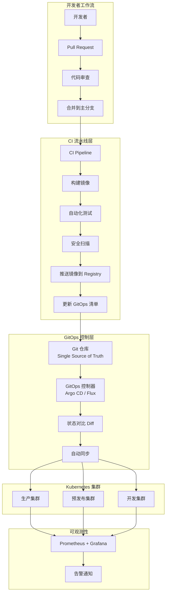
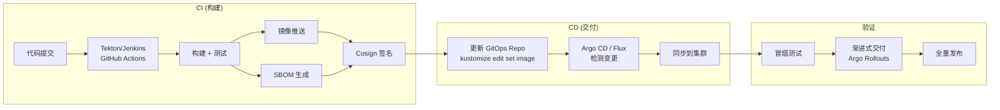

# Domain-23 GitOps & CI/CD — 开源项目索引

> **最后更新**: 2026-04-24
> **适用版本**: Argo CD v3.3 / Flux v2.5 / Tekton v0.68
> **文档定位**: GitOps 与 CI/CD 领域开源生态全景图，涵盖核心项目、版本动态、选型策略与社区趋势

---

<!-- chunk: 📋 目录 -->## 📋 目录

- [一、概述](#一概述)
- [二、核心项目总览](#二核心项目总览)
- [三、Argo 生态详解 (CNCF Graduated)](#三argo-生态详解-cncf-graduated)
- [四、Flux 生态详解 (CNCF Graduated)](#四flux-生态详解-cncf-graduated)
- [五、CI/CD 流水线项目](#五cicd-流水线项目)
- [六、密钥管理与安全工具](#六密钥管理与安全工具)
- [七、渐进式交付与发布编排](#七渐进式交付与发布编排)
- [八、依赖更新与制品管理](#八依赖更新与制品管理)
- [九、版本与发布动态](#九版本与发布动态)
- [十、GitOps 选型指南](#十gitops-选型指南)
- [十一、架构设计](#十一架构设计)
- [十二、安全与合规考量](#十二安全与合规考量)
- [十三、多环境管理策略](#十三多环境管理策略)
- [十四、监控与回滚](#十四监控与回滚)
- [十五、最佳实践](#十五最佳实践)
- [十六、故障排查](#十六故障排查)
- [参考链接](#参考链接)

---

<!-- chunk: 一、概述 -->## 一、概述

GitOps 与 CI/CD 领域是云原生技术栈中最为活跃的领域之一。随着 Kubernetes 成为事实上的基础设施标准，围绕声明式配置管理、自动化交付流水线和安全合规的工具链已经形成了完整的生态体系。本文档作为 Domain-23 的开篇索引，旨在为架构师、DevOps 工程师和技术决策者提供一份全面的开源项目参考手册。

GitOps 的核心理念是将 Git 仓库作为系统状态的唯一事实来源（Single Source of Truth），通过声明式描述定义目标状态，由自动化控制器持续对比并收敛实际状态到目标状态。这一理念由 Weaveworks 于 2017 年提出，随后被 CNCF 的 OpenGitOps 工作组标准化。截至 2026 年，GitOps 已经从概念验证阶段进入到大规模生产部署阶段，Argo CD 和 Flux 两个 CNCF 毕业项目成为行业主流选择。

CI/CD 领域则经历了从传统服务器模式到云原生模式的演进。Jenkins 作为老牌 CI/CD 平台仍然在大量企业中使用，但 Tekton、GitHub Actions、GitLab CI 等新生力量正在加速蚕食市场份额。企业级 CI/CD 的关注点已经从简单的构建自动化转向了安全合规（SLSA、SBOM）、供应链安全（签名验证、制品溯源）和跨平台编排（多云、混合云）等高级话题。

本索引覆盖了 GitOps 控制器、CI/CD 平台、渐进式交付工具、密钥管理方案、依赖更新工具等多个子领域，总计超过 20 个核心项目。每个项目都提供了功能定位、CNCF/CDN 状态、最新版本、开源协议等关键信息，并附带版本发布路线图和选型建议。

---

<!-- chunk: 二、核心项目总览 -->## 二、核心项目总览

| 项目 | 作用 | CNCF 状态 | 最新版本 | Stars | License |
|:---|:---|:---|:---|:---|:---|
| **Argo CD** | 声明式 GitOps CD | Graduated | v3.3.8 | 18k+ | Apache-2.0 |
| **Argo Workflows** | 容器化工作流引擎 | Graduated | v3.6.0 | 15k+ | Apache-2.0 |
| **Argo Rollouts** | 渐进式交付 | Graduated | v1.8.0 | 2.5k+ | Apache-2.0 |
| **Argo Events** | 事件驱动自动化 | Graduated | v1.9.0 | 2k+ | Apache-2.0 |
| **Flux** | GitOps 持续交付 | Graduated | v2.5.0 | 6k+ | Apache-2.0 |
| **Flagger** | 渐进式发布控制器 | Flux 生态 | v1.40.0 | 4.5k+ | Apache-2.0 |
| **Tekton** | 云原生 CI/CD 框架 | CDF | v0.68.0 | 8k+ | Apache-2.0 |
| **Jenkins** | CI/CD 服务器 | CDF | v2.492.3 | 23k+ | MIT |
| **GitLab CI** | 集成 CI/CD | GitLab | v17.10.0 | - | EE/CE |
| **GitHub Actions** | 托管 CI/CD | GitHub | - | - | 商业 |
| **KubeSphere DevOps** | 集成 DevOps 平台 | 非 CNCF | v4.1.0 | 15k+ | Apache-2.0 |
| **Carvel kapp-controller** | K8s 应用交付 | VMware | v0.55.0 | 1k+ | Apache-2.0 |
| **Spinnaker** | 多云持续交付平台 | Netflix/Armory | v1.37.0 | 9k+ | Apache-2.0 |
| **Concourse CI** | 声明式 CI/CD 管道 | VMware | v7.12.0 | 7k+ | Apache-2.0 |
| **Woodpecker CI** | 轻量级 CI/CD (Drone fork) | 社区 | v3.0.0 | 4k+ | Apache-2.0 |
| **Argo CD Image Updater** | Argo CD 镜像自动更新 | Argo | v0.15.0 | 1k+ | Apache-2.0 |
| **Renovate** | 自动化依赖更新 | Mend | v39.0.0 | 18k+ | AGPL-3.0 |
| **SOPS** | YAML/JSON 加密 (GitOps 密钥) | Mozilla | v3.9.0 | 17k+ | MPL-2.0 |
| **Reloader** | ConfigMap/Secret 变更自动重启 | Stakater | v1.3.0 | 7k+ | Apache-2.0 |
| **Sealed Secrets** | 加密 Secret 管理 | Bitnami | v0.27.0 | 7.5k+ | Apache-2.0 |
| **External Secrets Operator** | 外部密钥管理集成 | ESO 社区 | v0.14.0 | 4.5k+ | Apache-2.0 |
| **Kyverno** | 策略引擎 (CI/CD 准入控制) | CNCF | v1.13.0 | 5.5k+ | Apache-2.0 |
| **OPA Gatekeeper** | 策略引擎 | CNCF | v3.17.0 | 4k+ | Apache-2.0 |
| **Cosign** | 容器镜像签名 | Sigstore | v2.4.0 | 4.5k+ | Apache-2.0 |
| **Tekton Chains** | 供应链安全 (签名/证明) | CDF | v0.23.0 | 600+ | Apache-2.0 |

---

<!-- chunk: 三、Argo 生态详解 (CNCF Graduated) -->## 三、Argo 生态详解 (CNCF Graduated)

Argo 生态是一套完整的云原生工作流与交付工具链，由 Akuity（Argo 项目创建者 Alexander Matyushentsev 创立）和开源社区共同维护。Argo 项目于 2020 年进入 CNCF 孵化，2022 年毕业。Red Hat 于 2023 年收购 Akuity 后，Argo 生态获得了更强的商业支持。Argo 生态包含四个核心子项目：Argo CD（声明式 GitOps 持续交付）、Argo Workflows（容器化工作流引擎）、Argo Rollouts（渐进式交付）和 Argo Events（事件驱动自动化），它们可以独立使用，也可以组合成完整的 CI/CD + GitOps 解决方案。

#<!-- chunk: 3.1 Argo CD -->## 3.1 Argo CD

```yaml
核心特性:
  - 声明式 GitOps 持续交付
  - 自动同步与自愈
  - 多集群多租户管理
  - 支持 Helm/Kustomize/Jsonnet
  - RBAC 与 SSO 集成 (Dex/OIDC)
  - 可视化应用拓扑与差异对比
  - 回滚与历史版本管理
  - ApplicationSet 多环境生成器
  - Resource Hook (PreSync/Sync/PostSync)
  - 通知集成 (Argo Notifications)
```

**版本发布路线**

| 版本 | 发布日期 | 支持状态 | 最新补丁 |
|:---|:---|:---|:---|
| v3.3 | 2026.02 | ✅ 活跃支持 | v3.3.8 (2026.04) |
| v3.2 | 2025.11 | ✅ 活跃支持 | v3.2.10 (2026.04) |
| v3.1 | 2025.08 | ✅ 活跃支持 | v3.1.15 (2026.04) |
| v3.0 | 2025.05 | ❌ 已终止 | v3.0.23 (2026.01) |
| v2.14 | 2025.02 | ❌ 已终止 | v2.14.21 (2025.11) |

**v3.0 重大变更**
- 默认 `resource.exclusions` 配置 (排除高变动资源如 Endpoints、Lease、CiliumIdentity)
- 移除废弃的 `argocd_app_sync_status` 等指标 (迁移至 `argocd_app_info` labels)
- 引入 Server-Side Apply 作为推荐同步方式
- ApplicationSet 生成器增强 (支持 Matrix + Pull Request Generator)
- 低风险的 major 版本升级

**Helm 安装**
```bash
helm repo add argo https://argoproj.github.io/argo-helm
helm install argocd argo/argo-cd --version 7.8.0 \
  --namespace argocd --create-namespace
```

**GitHub**: https://github.com/argoproj/argo-cd
**文档**: https://argo-cd.readthedocs.io/

#<!-- chunk: 3.2 Argo Workflows -->## 3.2 Argo Workflows

Argo Workflows 是 Kubernetes 原生的工作流引擎，支持 DAG（有向无环图）和步骤式工作流定义。它在 CI/CD 场景中常用于编排复杂的构建、测试和部署流程。

```yaml
核心特性:
  - DAG 与步骤工作流
  - 资源模板与入口点 (Entrypoint)
  - 事件触发与定时任务 (CronWorkflow)
  - 制品管理 (Artifacts) - S3/GCS/OSS
  - 工作流归档与可视化
  - 嵌套工作流与模板引用
  - 暂停/恢复/重试机制
  - Pod 补丁与资源限制
```

**GitHub**: https://github.com/argoproj/argo-workflows

#<!-- chunk: 3.3 Argo Rollouts -->## 3.3 Argo Rollouts

Argo Rollouts 是渐进式交付控制器，替代 Kubernetes 原生的 Deployment 资源，提供更精细的发布控制能力。

```yaml
核心特性:
  - 蓝绿部署 (Blue-Green)
  - 金丝雀发布 (Canary) — 支持自动/手动推进
  - 实验流量 (Experiment)
  - 分析运行 (Analysis) — 集成 Prometheus/Datadog/CloudWatch
  - 与 Ingress Controller / Service Mesh 集成
  - 支持 Nginx/ALB/SMI/Istio/Linkerd 流量管理
  - 内置 Dashboard 和 Kubectl 插件
```

**GitHub**: https://github.com/argoproj/argo-rollouts

#<!-- chunk: 3.4 Argo Events -->## 3.4 Argo Events

Argo Events 是事件驱动架构的胶水层，可以将外部事件源（如 GitHub Webhook、S3 通知、日历定时器）转化为 Kubernetes 资源操作（如触发 Argo Workflow、创建 K8s 资源、调用 Lambda 函数）。

```yaml
核心特性:
  - 支持 20+ 事件源 (Webhook, S3, SNS, GitHub, Calendar, NATS, Kafka 等)
  - 传感器触发 Argo Workflows / K8s 资源 / Lambda
  - 事件过滤与条件表达式
  - 事件去重与重试
  - 可与 Argo Workflows 深度集成
```

**GitHub**: https://github.com/argoproj/argo-events

---

<!-- chunk: 四、Flux 生态详解 (CNCF Graduated) -->## 四、Flux 生态详解 (CNCF Graduated)

> ⚠️ **社区动态**: Weaveworks (Flux 主要赞助公司) 于 2024 年初倒闭，但 Flux 项目已被 CNCF 社区接管，继续维护。主要维护者来自 Akuity、ControlPlane、Microsoft 等公司。

Flux v2 是基于 GitOps Toolkit 构建的一组专用控制器集合。与 Argo CD 的集中式架构不同，Flux 采用分布式设计理念——每个集群运行自己的 Flux 实例，Git 仓库就是唯一的控制平面。这种设计使得 Flux 更轻量、更适合中小规模场景，同时也更适合"每集群自治"的多集群策略。

#<!-- chunk: 4.1 Flux v2 -->## 4.1 Flux v2

```yaml
核心特性:
  - 基于 GitOps Toolkit 构建
  - 源管理 (Git/OCI/Helm/Bucket)
  - Kustomize 与 Helm 原生支持
  - 镜像自动更新 (Image Automation)
  - 多租户与 RBAC
  - 与 Terraform 集成 (tf-controller)
  - SOPS 原生解密支持
  - Notification Controller 事件通知
```

**核心组件**

| 组件 | 作用 | API 版本 |
|:---|:---|:---|
| source-controller | 管理 Git/Helm/OCI 源 | source.toolkit.fluxcd.io/v1 |
| kustomize-controller | 应用 Kustomize 覆盖 | kustomize.toolkit.fluxcd.io/v1 |
| helm-controller | 管理 Helm releases | helm.toolkit.fluxcd.io/v2 |
| image-reflector-controller | 扫描镜像仓库 | image.toolkit.fluxcd.io/v1beta2 |
| image-automation-controller | 自动更新 Git 中的镜像标签 | image.toolkit.fluxcd.io/v1beta1 |
| notification-controller | 事件通知与告警 | notification.toolkit.fluxcd.io/v1beta3 |

**GitHub**: https://github.com/fluxcd/flux2
**文档**: https://fluxcd.io/

#<!-- chunk: 4.2 Flagger -->## 4.2 Flagger

Flagger 是与 Flux 紧密集成的渐进式交付工具，功能定位与 Argo Rollouts 类似，但设计上更贴近 Flux 生态。

```yaml
核心特性:
  - 金丝雀、A/B 测试、蓝绿发布
  - 与 Istio/Linkerd/Cilium/NGINX Ingress 集成
  - 自动化指标分析驱动的回滚/推进
  - 支持 Prometheus/Datadog/CloudWatch 指标
  - Webhook 集成 (负载测试、混沌工程)
  - Slack/Teams/Discord 通知
```

**GitHub**: https://github.com/fluxcd/flagger

---

<!-- chunk: 五、CI/CD 流水线项目 -->## 五、CI/CD 流水线项目

#<!-- chunk: 5.1 Tekton -->## 5.1 Tekton

Tekton 是由 CDF（Continuous Delivery Foundation）托管的开源 CI/CD 框架，完全基于 Kubernetes 原生资源定义。它的设计理念是将 CI/CD 流水线分解为可复用的 Task 和 Pipeline 资源，每个 Step 对应一个容器执行。

```yaml
核心概念:
  - Task: 最小可执行单元 (Pod 中的容器序列)
  - TaskRun: Task 的一次执行
  - Pipeline: 多个 Task 的有序组合 (DAG)
  - PipelineRun: Pipeline 的一次执行
  - Workspace: Task/Pipeline 间的数据共享
  - Params: 参数化配置
  - Results: 任务结果传递
```

```yaml
扩展组件:
  - Tekton Triggers: Webhook 事件触发
  - Tekton Chains: 供应链安全 (签名/证明)
  - Tekton Results: 执行结果持久化与查询
  - Tekton Hub: 社区 Task 共享平台
  - Tekton Dashboard: Web 管理界面 (可选)
```

**优势**: 完全 K8s 原生、可组合、声明式、GitOps 友好
**劣势**: 配置较复杂、生态工具链不如 Jenkins 成熟、调试体验待改善

**GitHub**: https://github.com/tektoncd/pipeline

#<!-- chunk: 5.2 Jenkins on K8s -->## 5.2 Jenkins on K8s

Jenkins 是最成熟的 CI/CD 服务器，拥有超过 1800 个插件和庞大的社区。在 Kubernetes 环境中，Jenkins 通过 Kubernetes Plugin 动态创建 Pod 作为 Agent，实现弹性构建能力。

```yaml
核心特性:
  - Jenkins Kubernetes Plugin 动态创建 Agent Pod
  - Configuration as Code (JCasC) 声明式配置
  - Shared Libraries 流水线复用
  - 海量插件生态 (1800+)
  - 多分支流水线与组织扫描
  - Blue Ocean 可视化
```

**推荐**: Jenkins X (云原生 Jenkins) 已停止活跃开发，建议评估 **Tekton** 或 **Argo Workflows** 替代。

#<!-- chunk: 5.3 GitLab CI / GitHub Actions -->## 5.3 GitLab CI / GitHub Actions

| 维度 | GitLab CI | GitHub Actions |
|:---|:---|:---|
| 运行器 | 自托管 Runner / Shared Runner | 自托管 Runner / GitHub-hosted |
| K8s 集成 | 原生 K8s Executor | 社区 Action |
| 容器注册表 | 集成 GitLab Registry | GitHub Packages / GHCR |
| 安全扫描 | 集成 SAST/DAST/依赖扫描 | 依赖 GitHub Advanced Security |
| 自托管 | GitLab CE/EE | GitHub Enterprise Server |
| 配置方式 | `.gitlab-ci.yml` | `.github/workflows/*.yml` |
| 复用机制 | `include` / `extends` / `!reference` | Reusable Workflows / Composite Actions |
| 环境保护 | Environment + 手动审批 | Environment Protection Rules |
| 缓存 | 原生 cache 指令 | `actions/cache` |
| 矩阵构建 | `parallel: matrix` | `strategy.matrix` |

---

<!-- chunk: 六、密钥管理与安全工具 -->## 六、密钥管理与安全工具

在 GitOps 工作流中，密钥管理是最关键的安全环节之一。将 Kubernetes Secret 直接提交到 Git 仓库是严重的安全隐患，因此需要专用的密钥管理工具来解决这个问题。以下是主流的三种方案：

#<!-- chunk: 6.1 Sealed Secrets -->## 6.1 Sealed Secrets

Sealed Secrets 由 Bitnami 开发，采用非对称加密方案。用户在客户端使用 `kubeseal` CLI 工具将 Secret 加密为 SealedSecret 资源，加密后的资源可以安全地提交到 Git 仓库。集群内的 Sealed Secrets 控制器负责解密并还原为 Kubernetes Secret。

```yaml
优点:
  - 客户端加密，操作简单
  - 无需外部依赖 (如 Vault)
  - 原生 Kubernetes 体验
缺点:
  - 密钥轮换需要重新加密
  - 不支持动态密钥 (如数据库临时凭证)
```

**GitHub**: https://github.com/bitnami-labs/sealed-secrets

#<!-- chunk: 6.2 External Secrets Operator (ESO) -->## 6.2 External Secrets Operator (ESO)

External Secrets Operator 将外部密钥管理系统（如 HashiCorp Vault、AWS Secrets Manager、GCP Secret Manager、Azure Key Vault）中的密钥同步到 Kubernetes Secret。

```yaml
优点:
  - 集中化密钥管理
  - 支持动态密钥
  - 多后端支持 (Vault/AWS/GCP/Azure/1Password)
  - 自动轮换
缺点:
  - 需要外部密钥管理系统
  - 架构复杂度较高
```

**GitHub**: https://github.com/external-secrets/external-secrets

#<!-- chunk: 6.3 SOPS (Mozilla) -->## 6.3 SOPS (Mozilla)

SOPS 是一个通用的文件加密工具，支持 YAML、JSON、ENV、INI 等格式的加密。它可以与 AWS KMS、GCP KMS、Azure Key Vault、age 等加密后端配合使用。在 Flux 中，SOPS 得到了原生支持——source-controller 可以直接解密 SOPS 加密的文件。

```yaml
优点:
  - 加密值仍保留 YAML/JSON 结构 (可 diff)
  - 多密钥管理后端支持
  - Flux 原生集成
  - 支持 .sops.y*ml 文件命名约定
缺点:
  - 客户端需要安装 sops CLI
  - 密钥管理后端权限配置
```

**GitHub**: https://github.com/getsops/sops

---

<!-- chunk: 七、渐进式交付与发布编排 -->## 七、渐进式交付与发布编排

#<!-- chunk: 7.1 Argo Rollouts vs Flagger -->## 7.1 Argo Rollouts vs Flagger

| 维度 | Argo Rollouts | Flagger |
|:---|:---|:---|
| GitOps 集成 | Argo CD 深度集成 | Flux 深度集成 |
| 自定义资源 | Rollout (替代 Deployment) | Canary (自动管理 Deployment) |
| 流量管理 | ALB/Nginx/SMI/Istio/Linkerd | Istio/Linkerd/Cilium/Nginx/AppMesh |
| 分析引擎 | AnalysisTemplate + Prometheus | 内置 Prometheus + Webhook |
| 回滚策略 | 自动/手动/暂停 | 自动 (基于指标) |
| UI | Kubectl 插件 + Dashboard | Prometheus Metrics |
| 成熟度 | 企业级 (被 Red Hat 支持) | 生产就绪 |

#<!-- chunk: 7.2 Spinnaker -->## 7.2 Spinnaker

Spinnaker 是由 Netflix 开发、Armory 商业支持的多云持续交付平台。它支持 AWS、GCP、Azure、Kubernetes 等多种部署目标，提供完善的流水线编排能力。

```yaml
核心特性:
  - 多云部署 (AWS/GCP/Azure/K8s/Cloud Foundry)
  - 流水线编排 (Pipeline/Stage/Judgment)
  - 金丝雀分析 (Kayenta)
  - 漂移管理 (Baking/Rosco)
  - 审批流程与合规
缺点:
  - 架构复杂，运维成本高
  - 社区活跃度下降
  - 建议新项目评估 Argo CD + Rollouts
```

---

<!-- chunk: 八、依赖更新与制品管理 -->## 八、依赖更新与制品管理

#<!-- chunk: 8.1 Renovate -->## 8.1 Renovate

Renovate 是由 Mend 维护的自动化依赖更新工具，支持几乎所有包管理器（npm、Maven、Gradle、Go modules、Docker、Helm、Terraform 等）。它会自动检测过时的依赖，创建 Pull Request 并附带变更日志和发布说明。

```yaml
核心特性:
  - 支持 50+ 包管理器
  - 自动化 PR 创建与更新
  - 分组更新策略 (如将所有 dev 依赖合并到一个 PR)
  - 语义化版本策略配置
  - 自动合并 (Auto-merge) 低风险更新
  - 依赖替换与迁移建议
  - 与 GitLab/GitHub/Bitbucket/Gitea 集成
```

**GitHub**: https://github.com/renovatebot/renovate

#<!-- chunk: 8.2 Argo CD Image Updater -->## 8.2 Argo CD Image Updater

Argo CD Image Updater 是专门为 Argo CD 设计的镜像自动更新工具，它监控镜像仓库中的新标签，并自动更新 Argo CD Application 中的镜像版本。

```yaml
核心特性:
  - 与 Argo CD 深度集成
  - 支持语义化版本策略
  - 支持多个镜像仓库
  - Git 回写模式 (将更新提交回 Git)
  - 多应用批量更新
```

**GitHub**: https://github.com/argoproj-labs/argocd-image-updater

#<!-- chunk: 8.3 Reloader -->## 8.3 Reloader

Reloader 监控 ConfigMap 和 Secret 的变更，自动触发关联的 Deployment、DaemonSet、StatefulSet 滚动重启。在 GitOps 场景中，这解决了"更新了 ConfigMap 但 Pod 未重启"的问题。

```yaml
核心特性:
  - 零配置自动检测
  - 支持 ConfigMap 和 Secret
  - 支持注解过滤 (指定哪些资源触发重启)
  - 支持 Deployment/DaemonSet/StatefulSet
  - 轻量级，无外部依赖
```

**GitHub**: https://github.com/stakater/Reloader

---

<!-- chunk: 九、版本与发布动态 -->## 九、版本与发布动态

#<!-- chunk: 9.1 Argo CD 支持周期 -->## 9.1 Argo CD 支持周期

- 每 3 个月一个 minor 版本
- 支持周期: 当前版本 + 前两个版本 (共 3 个活跃版本)
- 建议始终使用最新补丁版本
- 安全修复会回移到所有支持的 minor 版本
- 升级路径: N-1 → N 即可，不需要逐版本升级

#<!-- chunk: 9.2 Helm 4 前瞻 -->## 9.2 Helm 4 前瞻

- 开发于 2024.11 KubeCon 正式启动
- 预计 2025.11 KubeCon NA 发布
- 将解决 Helm 3 的架构债务
- 引入 OCI 原生支持增强
- 改进的 Schema 验证机制

#<!-- chunk: 9.3 Flux 社区接管 -->## 9.3 Flux 社区接管

- Weaveworks 倒闭后，Flux 由 CNCF 社区维护
- 主要维护者来自 Akuity、ControlPlane、Microsoft 等公司
- v2.5 为最新稳定版，路线图正常推进
- 社区治理模型已建立 (Steering Committee + Maintainer Team)
- CNCF 提供基础设施支持

#<!-- chunk: 9.4 Tekton 演进 -->## 9.4 Tekton 演进

- v0.65+ 引入 Step Revisions 和 Pipeline Results 增强
- Tekton Results API 进入 Beta 阶段，提供流水线执行结果的持久化存储与查询
- Tekton Chains 已支持 SLSA Level 3 证明生成
- Tekton Triggers v0.30+ 支持 ClusterTriggerBinding 全局事件绑定

---

<!-- chunk: 十、GitOps 选型指南 -->## 十、GitOps 选型指南

#<!-- chunk: 10.1 决策树 -->## 10.1 决策树

```
┌─────────────────────────────────────────────────────────────┐
│                    GitOps 工具选型决策树                       │
└─────────────────────────────────────────────────────────────┘

1. 需要 UI 可视化与管理?
   └─ Yes ──► Argo CD (业界最强 UI)
   └─ No  ──► Flux (纯声明式，Git 即 UI)

2. 需要复杂工作流编排?
   └─ Yes ──► Argo Workflows
   └─ No  ──► 纯 CD 工具足够

3. 渐进式交付 (金丝雀/A/B)?
   └─ Yes ──► Argo Rollouts / Flagger
   └─ No  ──► 基础 RollingUpdate

4. 团队规模 > 50 人，多租户?
   └─ Yes ──► Argo CD (RBAC/SSO/项目隔离成熟)
   └─ No  ──► Flux 更简单轻量

5. 已使用 GitLab / GitHub?
   └─ GitLab ──► GitLab CI + Agent (或集成 Argo CD)
   └─ GitHub ──► GitHub Actions + Argo CD/Flux

6. 需要事件驱动自动化?
   └─ Yes ──► Argo Events
   └─ No  ──► 基础 Git Webhook 触发

7. 传统 CI 迁移上 K8s?
   └─ 渐进迁移 ──► Jenkins + K8s Plugin
   └─ 全新构建 ──► Tekton / Argo Workflows

8. 供应链安全合规要求?
   └─ Yes ──► Tekton + Chains (SLSA) + Cosign
   └─ No  ──► 标准 CI/CD 即可
```

#<!-- chunk: 10.2 选型对比矩阵 -->## 10.2 选型对比矩阵

| 维度 | Argo CD | Flux | Tekton | Jenkins |
|:---|:---|:---|:---|:---|
| **定位** | GitOps CD | GitOps CD | CI/CD 框架 | CI/CD 服务器 |
| **学习曲线** | 中 | 低 | 高 | 中 |
| **UI** | 丰富 | 可选 (Weave) | 可选 (Dashboard) | Blue Ocean |
| **多集群** | 单实例管理多集群 | 每集群独立实例 | 不涉及 | 不涉及 |
| **K8s 原生** | ✅ | ✅ | ✅ | ❌ (需 Plugin) |
| **GitOps 原生** | ✅ | ✅ | ❌ (CI 而非 CD) | ❌ |
| **安全扫描** | 需外部集成 | 需外部集成 | Chains 内置 | 插件生态 |
| **企业支持** | Red Hat/Akuity | 社区/ControlPlane | CDF/Red Hat | CloudBees |

---

<!-- chunk: 十一、架构设计 -->## 十一、架构设计

#<!-- chunk: 11.1 GitOps 通用架构 -->## 11.1 GitOps 通用架构



#<!-- chunk: 11.2 CI/CD 与 GitOps 协作架构 -->## 11.2 CI/CD 与 GitOps 协作架构



---

<!-- chunk: 十二、安全与合规考量 -->## 十二、安全与合规考量

在 GitOps 与 CI/CD 实践中，安全合规是不可忽视的关键维度。以下是企业在实施过程中需要重点关注的领域：

#<!-- chunk: 12.1 供应链安全 (SLSA 框架) -->## 12.1 供应链安全 (SLSA 框架)

SLSA (Supply-chain Levels for Software Artifacts) 是一个供应链安全框架，定义了四个递进的安全等级。在 CI/CD 流水线中实现 SLSA Level 3 需要：

- **构建来源证明 (Provenance)**: Tekton Chains 和 SLSA GitHub Generator 可以自动生成构建证明
- **镜像签名**: 使用 Cosign/Sigstore 对容器镜像进行签名，Argo CD 可通过 ConfigMap 配置验证策略
- **不可变构建**: 确保构建过程不可篡改，推荐使用 Tekton 的 hermetic 构建模式
- **SBOM 生成**: 使用 Syft/Trivy 生成软件物料清单，存储在镜像附加层或 OCI Registry 中

#<!-- chunk: 12.2 GitOps 安全最佳实践 -->## 12.2 GitOps 安全最佳实践

```yaml
安全清单:
  - 最小权限原则: AppProject 限制源仓库、目标集群、资源类型
  - 密钥管理: 禁止在 Git 中存储明文密钥
  - RBAC 配置: 细粒度的角色定义与组绑定
  - 审计日志: 启用 Argo CD Audit日志，定期审查
  - 网络策略: 限制 Argo CD 组件间的网络通信
  - TLS 加密: 所有组件间通信使用 TLS
  - Secret 管理轮换: 定期轮换 ServiceAccount Token
  - Git 签名提交: 要求所有 GitOps 提交使用 GPG/SOSH 签名
  - 准入控制: 使用 Kyverno/OPA Gatekeeper 验证部署合规性
```

---

<!-- chunk: 十三、多环境管理策略 -->## 十三、多环境管理策略

GitOps 多环境管理是企业的核心需求。以下是三种主流策略：

#<!-- chunk: 13.1 环境分支策略 -->## 13.1 环境分支策略

```
main (生产)
  ├── staging (预发布，自动同步)
  │   └── develop (开发，自动同步)
  └── release/* (发布分支)
```

- 每个环境对应一个 Git 分支
- 通过 PR 进行环境间晋升 (Promotion)
- Argo CD Application 的 `targetRevision` 指向对应分支

#<!-- chunk: 13.2 环境目录策略 (推荐) -->## 13.2 环境目录策略 (推荐)

```
apps/
  ├── base/          # 基础 Kustomize 配置
  ├── overlays/
  │   ├── development/   # 开发环境覆盖
  │   ├── staging/       # 预发布环境覆盖
  │   └── production/    # 生产环境覆盖
```

- 所有环境共享同一个 Git 分支 (main)
- 通过 Kustomize Overlay 实现环境差异化
- Argo CD ApplicationSet 自动发现并部署

#<!-- chunk: 13.3 ApplicationSet 多集群策略 -->## 13.3 ApplicationSet 多集群策略

```yaml
apiVersion: argoproj.io/v1alpha1
kind: ApplicationSet
metadata:
  name: multi-env-app
spec:
  generators:
    - clusters:
        selector:
          matchLabels:
            environment: production
  template:
    spec:
      source:
        path: 'apps/{{metadata.labels.environment}}'
```

---

<!-- chunk: 十四、监控与回滚 -->## 十四、监控与回滚

#<!-- chunk: 14.1 GitOps 监控指标 -->## 14.1 GitOps 监控指标

| 工具 | 关键指标 | PromQL 示例 |
|:---|:---|:---|
| Argo CD | 同步状态 | `argocd_app_info{sync_status="OutOfSync"}` |
| Argo CD | 健康状态 | `argocd_app_info{health_status="Degraded"}` |
| Argo CD | 协调延迟 | `argocd_app_reconcile_duration_seconds` |
| Flux | 同步就绪 | `gotk_reconcile_condition{status="False",type="Ready"}` |
| Flux | 同步耗时 | `gotk_reconcile_duration_seconds_bucket` |
| Tekton | 流水线运行 | `tekton_pipelinerun_status` |

#<!-- chunk: 14.2 回滚策略 -->## 14.2 回滚策略

```yaml
Argo CD 回滚:
  方式一: argocd app rollback <app> <revision>
  方式二: git revert + 自动同步
  方式三: 在 UI 中选择历史版本并回滚

Flux 回滚:
  方式一: git revert (自动检测并同步)
  方式二: 将 Kustomization 指向旧 revision
  方式三: kubectl rollout undo (手动)

通用原则:
  - Git 历史是唯一的回滚来源
  - 避免直接操作集群 (kubectl edit)
  - 回滚后需要进行根因分析
```

---

<!-- chunk: 十五、最佳实践 -->## 十五、最佳实践

#<!-- chunk: 15.1 GitOps 通用最佳实践 -->## 15.1 GitOps 通用最佳实践

```yaml
1. 仓库设计:
   - 基础设施仓库与应用仓库分离
   - 清晰的目录结构约定
   - Kustomize Overlay 实现环境差异化

2. 配置管理:
   - 声明式配置优先
   - 避免在 CI 中直接部署 (通过 Git 触发)
   - 参数化和模板化
   - 配置版本控制与标签

3. 安全要求:
   - 强制代码审查 (Branch Protection)
   - 自动安全扫描 (Trivy/Snyk)
   - 最小权限原则
   - 审计日志完整

4. 监控体系:
   - GitOps 控制器状态监控
   - 应用健康状态监控
   - 同步延迟监控
   - 多层级告警 (Warning/Critical)
```

#<!-- chunk: 15.2 CI/CD 流水线最佳实践 -->## 15.2 CI/CD 流水线最佳实践

```yaml
1. 流水线设计:
   - 安全扫描前置 (Shift Left)
   - 并行化独立阶段
   - 缓存依赖 (Maven/npm/Gradle)
   - 不可变构建产物

2. 制品管理:
   - 语义化版本标签
   - 镜像签名与验证
   - SBOM 生成与存储
   - 制品保留策略

3. 环境晋升:
   - 自动化 dev → staging 晋升
   - staging → production 需人工审批
   - 回滚流程自动化
   - 环境一致性保证
```

---

<!-- chunk: 十六、故障排查 -->## 十六、故障排查

#<!-- chunk: 16.1 Argo CD 常见问题 -->## 16.1 Argo CD 常见问题

```yaml
同步失败:
  排查步骤:
    - argocd app get <app> --refresh
    - 检查 Application status.conditions
    - 查看同步日志 argocd app logs <app>
  常见原因:
    - RBAC 权限不足
    - Git 仓库连接问题
    - Helm values 渲染错误
    - 资源冲突 (已存在但未管理)
  解决方案:
    - 检查目标集群权限
    - 验证网络连通性
    - 使用 argocd app diff 查看差异
    - 添加 ignoreDifferences 规则

性能问题:
  排查步骤:
    - 检查 controller metrics
    - 查看 Redis 内存使用
    - 检查 repo-server CPU/内存
  常见原因:
    - 应用数量过多 (>1000)
    - Git 仓库过大
    - 频繁的全量刷新
  解决方案:
    - 增加 status-processors 和 operation-processors
    - 配置 resource.exclusions
    - 使用 Server-Side Apply
    - 增加资源限制
```

#<!-- chunk: 16.2 Flux 常见问题 -->## 16.2 Flux 常见问题

```yaml
同步失败:
  排查步骤:
    - flux get kustomizations -A
    - flux logs --level=error
    - kubectl describe kustomization <name> -n flux-system
  常见原因:
    - Git 凭证过期
    - Kustomize 构建错误
    - 资源配额不足
  解决方案:
    - flux reconcile kustomization <name> --force
    - 检查 Secret 中的凭证
    - 查看 build 日志

镜像不更新:
  排查步骤:
    - flux get image repository
    - flux get image policy
    - flux get image update
  常见原因:
    - ImagePolicy 策略不匹配
    - Git 推送权限不足
    - 签名密钥问题
  解决方案:
    - 检查 semver range 配置
    - 验证 SSH/HTTPS 凭证
    - 检查 GPG 签名密钥
```

#<!-- chunk: 16.3 Tekton 常见问题 -->## 16.3 Tekton 常见问题

```yaml
TaskRun 失败:
  排查步骤:
    - kubectl get taskrun <name> -o yaml
    - kubectl logs <taskrun-pod> -c <step-name>
    - tkn taskrun logs <name>
  常见原因:
    - 镜像拉取失败
    - Workspace 挂载错误
    - 参数类型不匹配
  解决方案:
    - 检查镜像引用
    - 验证 Workspace 绑定
    - 检查 Params 定义

Pipeline 卡住:
  排查步骤:
    - kubectl get pipelinerun <name> -o yaml
    - 检查 PipelineRun status.conditions
  常见原因:
    - runAfter 依赖循环
    - when 条件不满足
    - 超时配置过短
  解决方案:
    - 检查 DAG 依赖关系
    - 验证 when 表达式
    - 调整 timeouts 配置
```

---

<!-- chunk: 参考链接 -->## 参考链接

- [Argo CD 官方文档](https://argo-cd.readthedocs.io/)
- [Flux 官方文档](https://fluxcd.io/)
- [Tekton 官方文档](https://tekton.dev/docs/)
- [CNCF CI/CD 白皮书](https://github.com/cncf/tag-app-delivery/blob/main/ci-cd-whitepaper.md)
- [OpenGitOPS 标准](https://opengitops.dev/)
- [SLSA 框架](https://slsa.dev/)
- [Helm 4 路线图](https://github.com/helm/community/blob/main/hips/hip-0016.md)
- [GitOps Working Group](https://github.com/cncf/tag-app-delivery/tree/main/gitops-wg)
- [Tekton Hub](https://hub.tekton.dev/)
- [Sigstore (Cosign)](https://sigstore.dev/)

---

<!-- chunk: Obsidian 相关文档 -->## Obsidian 相关文档

- domain-08-release-change-management MOC
- [[domain-08-release-change-management/README|Domain 23: GitOps与CI/CD (GitOps & CI/CD)]]
- Argo CD企业级GitOps实践指南
- Jenkins企业级CI/CD流水线深度实践
- GitLab CI/CD 企业级流水线自动化平台
- GitHub Actions Enterprise CI/CD Platform 深度实践
- Tekton 云原生 CI/CD 深度实践
- Flux v2 GitOps 持续交付深度实践
- GitOps 安全与合规深度实践
- CI/CD 流水线模式与渐进式交付深度实践
- Argo CD 企业级 GitOps 实践指南
- Flux GitOps 实践指南
