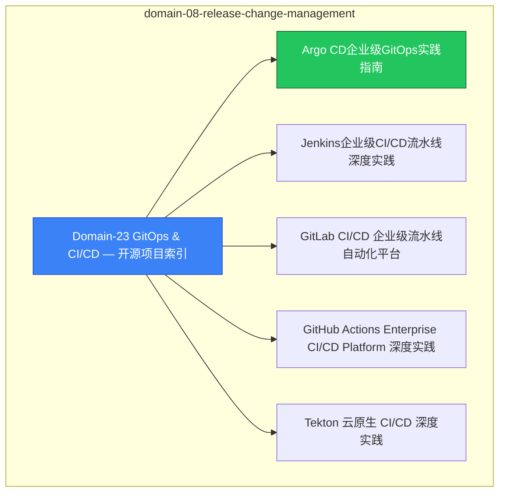

# domain-08-release-change-management [[MOC]]

> **MOC 版本**: 1.0
> **知识域**: domain-08-release-change-management
> **文档数量**: 13 篇
> **最后更新**: 2026-05-21
> **用途**: 本知识域的导航入口，汇总所有相关文档、关联领域、和场景入口

---

## 领域概述

GitOps 与 CI/CD — ArgoCD、Flux、Jenkins、GitHub Actions

### 知识域定位

| 维度 | 说明 |
|---|---|
| **知识域** | domain-08-release-change-management |
| **文档数量** | 13 篇 |
| **难度分布** | 入门 0 / 进阶 0 / 高级 0 / 专家 0 |

---

## 文档清单

| # | 文档 | 难度 | 标签 | 估计阅读时间 |
|---|---|---|---|---|
| 1 | [[domain-08-release-change-management/00-open-source-projects-index.md|Domain-23 GitOps & CI/CD — 开源项目索引]] |  | gitops, cicd, devops |  |
| 2 | [[domain-08-release-change-management/01-argo-cd-enterprise-gitops.md|Argo CD企业级GitOps实践指南]] |  | gitops, cicd, devops |  |
| 3 | [[domain-08-release-change-management/02-jenkins-enterprise-cicd.md|Jenkins企业级CI/CD流水线深度实践]] |  | gitops, cicd, devops |  |
| 4 | [[domain-08-release-change-management/03-gitlab-enterprise-cicd.md|GitLab CI/CD 企业级流水线自动化平台]] |  | gitops, cicd, devops |  |
| 5 | [[domain-08-release-change-management/04-github-actions-enterprise.md|GitHub Actions Enterprise CI/CD Platform 深度实践]] |  | gitops, cicd, devops |  |
| 6 | [[domain-08-release-change-management/05-tekton-cloud-native-cicd.md|Tekton 云原生 CI/CD 深度实践]] |  | gitops, cicd, devops |  |
| 7 | [[domain-08-release-change-management/06-flux-gitops-continuous-delivery.md|Flux v2 GitOps 持续交付深度实践]] |  | gitops, cicd, devops |  |
| 8 | [[domain-08-release-change-management/07-gitops-security-compliance.md|GitOps 安全与合规深度实践]] |  | gitops, cicd, devops |  |
| 9 | [[domain-08-release-change-management/08-cicd-pipeline-patterns.md|CI/CD 流水线模式与渐进式交付深度实践]] |  | gitops, cicd, devops |  |
| 10 | [[domain-08-release-change-management/99-argo-cd-gitops-guide.md|Argo CD 企业级 GitOps 实践指南]] |  | gitops, cicd, devops |  |
| 11 | [[domain-08-release-change-management/99-flux-gitops-guide.md|Flux GitOps 实践指南]] |  | gitops, cicd, devops |  |
| 12 | [[domain-08-release-change-management/99-tekton-cicd-guide.md|Tekton 云原生 CI/CD 实践指南]] |  | gitops, cicd, devops |  |
| 13 | [[domain-08-release-change-management/99-tekton-java-cicd-guide.md|Tekton Java CI/CD 流水线实践指南]] |  | gitops, cicd, devops |  |

---

## 知识图谱

---

## 关联入口

| 入口 | 说明 |
|---|---|
| [[../domain-10-troubleshooting-diagnostics/topic-fta/MOC.md|FTA 故障树]] | domain-08-release-change-management 相关故障树分析 |
| [[../domain-10-troubleshooting-diagnostics/topic-skills/MOC.md|Skills 技能]] | domain-08-release-change-management 相关操作技能 |
| [[../domain-19-landscape-references/topic-index/README.md|深度研究入口]] | 语料库索引与向量检索 |

---

## 统计信息

| 指标 | 数值 |
|---|---|
| 文档总数 | 13 |
| 覆盖 K8s 版本 | v1.25 - v1.32 |

---

*本文档由 scripts/generate-mocs.py 自动生成，最后更新 2026-05-21。*

## Related

- [[README]]
- [[README]]
- [[MOC]]
