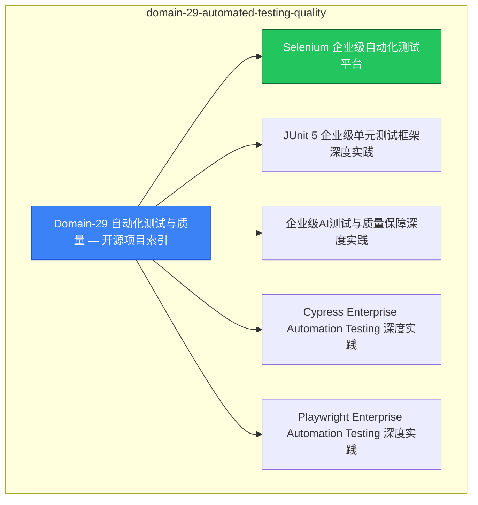

# domain-29-automated-testing-quality MOC

> **MOC 版本**: 1.0
> **知识域**: domain-29-automated-testing-quality
> **文档数量**: 6 篇
> **最后更新**: 2026-05-21
> **用途**: 本知识域的导航入口，汇总所有相关文档、关联领域、和场景入口

---

## 领域概述

自动化测试与质量 — 单元测试、集成测试、e2e 测试

### 知识域定位

| 维度 | 说明 |
|---|---|
| **知识域** | domain-29-automated-testing-quality |
| **文档数量** | 6 篇 |
| **难度分布** | 入门 0 / 进阶 0 / 高级 0 / 专家 0 |

---

## 文档清单

| # | 文档 | 难度 | 标签 | 估计阅读时间 |
|---|---|---|---|---|
| 1 | Domain-29 自动化测试与质量 — 开源项目索引 |  | quality, testing |  |
| 2 | Selenium 企业级自动化测试平台 |  | quality, testing |  |
| 3 | JUnit 5 企业级单元测试框架深度实践 |  | quality, testing |  |
| 4 | 企业级AI测试与质量保障深度实践 |  | quality, testing |  |
| 5 | Cypress Enterprise Automation Testing 深度实践 |  | quality, testing |  |
| 6 | Playwright Enterprise Automation Testing 深度实践 |  | quality, testing |  |

---

## 知识图谱

---

## 关联入口

| 入口 | 说明 |
|---|---|
| FTA 故障树 | domain-29-automated-testing-quality 相关故障树分析 |
| Skills 技能 | domain-29-automated-testing-quality 相关操作技能 |
| 深度研究入口 | 语料库索引与向量检索 |

---

## 统计信息

| 指标 | 数值 |
|---|---|
| 文档总数 | 6 |
| 覆盖 K8s 版本 | v1.25 - v1.32 |

---

*本文档由 scripts/generate-mocs.py 自动生成，最后更新 2026-05-21。*
