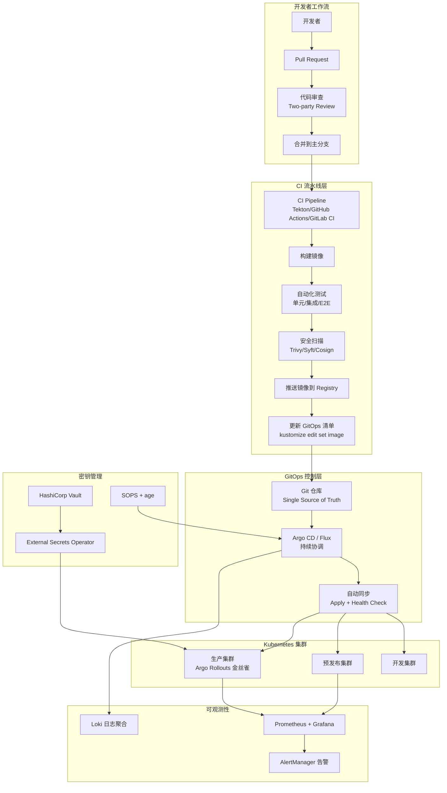

# Domain 23: GitOps与CI/CD (GitOps & CI/CD)

> **领域定位**: 企业级持续交付平台架构与实践 | **文档数量**: 14篇 | **更新时间**: 2026-04-24

---

## 一、概述

本领域专注于 GitOps 理念和 CI/CD 实践的深度融合，涵盖从基础设施即代码到应用自动化的完整交付体系。GitOps 将 Git 仓库作为系统状态的唯一事实来源（Single Source of Truth），通过声明式描述定义目标状态，由自动化控制器持续对比并收敛实际状态到目标状态。这一理念由 Weaveworks 于 2017 年提出，已被 CNCF OpenGitOps 工作组标准化为四大原则：声明式、版本化且不可变、自动拉取、持续协调。

CI/CD 领域经历了从传统服务器模式到云原生模式的演进。Jenkins 仍然在企业中广泛使用，但 Tekton、GitHub Actions、GitLab CI 等新生力量正在加速蚕食市场份额。企业级 CI/CD 的关注点已从简单构建自动化转向安全合规（SLSA、SBOM）、供应链安全（签名验证、制品溯源）和跨平台编排。DORA（DevOps Research and Assessment）研究持续证明，高效的 CI/CD 和 GitOps 实践直接关联到更高的软件交付效能和更好的业务成果。

本领域为企业构建标准化、可重复的现代化软件交付流程提供专业指导，覆盖 GitOps 控制器（Argo CD、Flux）、CI/CD 平台（Jenkins、GitLab CI、GitHub Actions、Tekton）、渐进式交付（Argo Rollouts）、密钥管理和供应链安全等核心主题。

### GitOps 核心原则

```yaml
OpenGitOps四大原则:
  原则一_声明式:
    描述: 将系统的期望状态用声明式语言描述
    实现: Kubernetes YAML、[[helm]] values、Kustomize overlays
    好处: 可审查、可比较、可回滚
  
  原则二_版本化且不可变:
    描述: 期望状态存储在支持版本控制的系统中
    实现: Git仓库（GitHub、GitLab、Bitbucket）
    好处: 完整审计追踪、轻松回滚、变更可追溯
  
  原则三_自动拉取:
    描述: 状态变更通过自动化方式从版本控制系统拉取
    实现: Argo CD Sync、Flux Reconciliation
    好处: 减少人为错误、确保一致性
  
  原则四_持续协调:
    描述: 软件代理持续对比实际状态和期望状态
    实现: Argo CD Controller、Flux Kustomization Controller
    好处: 自动漂移检测、自愈能力
```

---

## 二、GitOps 成熟度模型

企业采用 GitOps 是一个渐进过程，从初始实验到全面自动化需要经历多个阶段。以下成熟度模型帮助企业评估当前状态并规划演进路径。

### 成熟度等级定义

| 等级 | 名称 | 描述 | 关键特征 | 典型工具 |
|:---|:---|:---|:---|:---|
| **Level 0** | 手动部署 | 手动 kubectl apply / SSH | 无版本控制，无自动化，高风险 | kubectl, SSH |
| **Level 1** | 脚本化 | Shell 脚本自动化部署 | 部分自动化，无状态管理 | Bash, Ansible |
| **Level 2** | 基础 GitOps | Git 触发自动同步 | 声明式配置，Git 审计追踪 | Argo CD / Flux 基础配置 |
| **Level 3** | 完整 CI/CD | CI 构建到 GitOps 全链路 | 镜像签名、自动测试、环境晋升 | Tekton/GHA + Argo CD |
| **Level 4** | 安全合规 | SLSA Level 3+ 供应链安全 | SBOM、签名验证、准入控制 | Cosign + Kyverno + SLSA |
| **Level 5** | 全面自动化 | 全自动渐进式交付 | 金丝雀发布、自动回滚、DORA 优化 | Argo Rollouts + Flagger |

### 成熟度评估检查项

```yaml
Level_0_到_Level_1:
  - 部署脚本使用Git管理
  - 环境配置集中存储
  - 部署过程有日志记录
  - 基本回滚流程存在

Level_1_到_Level_2:
  - 所有K8s清单存入Git仓库
  - Git提交自动触发同步
  - 使用Helm或Kustomize管理配置
  - 多环境配置分离管理

Level_2_到_Level_3:
  - CI流水线自动构建镜像
  - 镜像自动推送到Registry
  - GitOps清单自动更新
  - 自动化测试覆盖核心功能

Level_3_到_Level_4:
  - 所有镜像经过安全扫描
  - 镜像签名和验证
  - SBOM生成和存档
  - 密钥使用外部管理 (Vault/ESO)

Level_4_到_Level_5:
  - 金丝雀/蓝绿自动发布
  - 基于指标的自动回滚
  - DORA指标可视化
  - 多集群统一管理
```

---

## 三、架构设计

### 3.1 CI/CD + GitOps 整体架构



### 3.2 技术栈概览

```yaml
核心技术组件:
  GitOps工具:
    - Argo CD v2.13: 声明式GitOps工具 (CNCF Graduated)
    - Flux CD v2.5: 轻量级GitOps工具 (CNCF Graduated)
    - Tekton: Kubernetes原生CI/CD (CDF)

  CI/CD平台:
    - Jenkins: 传统CI/CD平台，插件生态丰富
    - GitHub Actions: GitHub原生CI/CD
    - GitLab CI: 集成化DevOps平台

  渐进式交付:
    - Argo Rollouts: 金丝雀/蓝绿发布
    - Flagger: Flux 生态渐进式交付

  安全合规:
    - SLSA v1.0: 供应链安全框架
    - Cosign v2.4: 镜像签名与验证
    - External Secrets v0.14: 外部密钥同步
    - Sealed Secrets v0.27: 加密Secret
    - SOPS v3.9: 文件加密 (Flux原生支持)
    - Kyverno: 策略引擎，准入控制
```

---

## 四、工具选型对比矩阵

### 4.1 GitOps 工具深度对比

| 维度 | Argo CD | Flux | 特点说明 |
|:---|:---|:---|:---|
| **架构** | 单体 + 控制器 | 一组专用控制器 | Argo CD 部署较重，Flux 轻量 |
| **Web UI** | 丰富的可视化界面 | 无（依赖Grafana） | Argo CD 直观，Flux 需额外配置 |
| **多集群管理** | ApplicationSet 成熟 | remoteCluster | 两者均支持，Argo CD 更成熟 |
| **学习曲线** | 中等 | 低 | Flux 更简单 |
| **资源占用** | 较高 (2-4GB RAM) | 轻量 (200-500MB) | Flux 适合资源受限环境 |
| **密钥管理** | Sealed Secrets/ESO | SOPS 原生支持 | Flux 内建 SOPS 解密 |
| **渐进式交付** | Argo Rollouts 深度集成 | Flagger 集成 | 两者各有优势 |
| **通知** | 内建 Notifications | notification-controller | 两者均支持多渠道 |
| **多来源** | 支持 (multiple sources) | 支持 (OCI/Helm/Git) | 均灵活 |
| **RBAC** | SSO + Projects + RBAC | K8s RBAC | Argo CD 更精细 |
| **镜像更新** | Image Updater (插件) | ImageAutomation (内建) | Flux 原生支持 |
| **CNCF状态** | Graduated (2024) | Graduated (2022) | 均为 CNCF 毕业项目 |
| **适用场景** | 需可视化、手动审批 | 完全自动化、资源受限 | — |

### 4.2 CI 工具深度对比

| 维度 | Tekton | GitHub Actions | GitLab CI | Jenkins |
|:---|:---|:---|:---|:---|
| **架构** | K8s原生 Pod | SaaS (Actions Runner) | 自托管/SaaS | 自托管 Controller + Agent |
| **可移植性** | 高（K8s标准） | 低（GitHub锁定） | 中 | 中 |
| **供应链安全** | Chains + SLSA | OIDC + SLSA | 内置扫描 | 插件 |
| **学习曲线** | 高 (YAML量大) | 低 (简单语法) | 中 | 中 (Groovy) |
| **缓存** | Workspace/Workspace | Actions Cache | Cache artifacts | 插件 |
| **并行执行** | PipelineRun 并行 | Matrix Strategy | needs 依赖 | Parallel Stages |
| **触发方式** | Triggers / EventListeners | push/pr/schedule | push/mr/schedule | Webhook/Polling |
| **复用性** | Task/Pipeline 引用 | Reusable Workflows | include:local/project | Shared Libraries |
| **成本** | K8s资源成本 | 免费额度+超出付费 | Runner 成本 | 服务器成本 |
| **适用场景** | 云原生企业 | GitHub用户 | GitLab用户 | 传统企业 |

### 4.3 渐进式交付工具对比

| 维度 | Argo Rollouts | Flagger |
|:---|:---|:---|
| **发布策略** | 金丝雀/蓝绿/Canary | 金丝雀/蓝绿/A/B Testing |
| **指标集成** | Prometheus/CloudWatch/Datadog | Prometheus/CloudWatch/Datadog |
| **服务网格** | Istio/SMI/Nginx/ALB | Istio/Linkerd/SMI/Contour |
| **回滚** | 自动 (基于指标) | 自动 (基于指标) |
| **分析** | AnalysisTemplate (灵活) | MetricTemplate |
| **GitOps 集成** | Argo CD 原生 | Flux 原生 |
| **学习曲线** | 中等 | 低 |
| **UI** | Argo CD UI 集成 | 无 (Grafana Dashboard) |

---

## 五、多环境晋升流程

### 5.1 环境晋升流程图

```mermaid
graph LR
    subgraph "开发阶段"
        DEV_PUSH[开发者 push] --> CI_DEV[CI 流水线]
        CI_DEV --> IMG_DEV[构建镜像 :dev-sha]
        IMG_DEV --> GIT_DEV[更新 GitOps 清单]
        GIT_DEV --> ARGO_DEV[Argo CD 同步]
        ARGO_DEV --> K8S_DEV[开发集群部署]
    end

    subgraph "测试阶段"
        K8S_DEV --> VERIFY_DEV[自动验证<br/>单元+集成测试]
        VERIFY_DEV --> MERGE_MAIN[合并到 main]
        MERGE_MAIN --> CI_STG[CI 流水线]
        CI_STG --> IMG_STG[构建镜像 :rc-sha]
        IMG_STG --> SCAN_STG[安全扫描+SBOM]
        SCAN_STG --> GIT_STG[更新 staging 清单]
        GIT_STG --> ARGO_STG[Argo CD 同步]
        ARGO_STG --> K8S_STG[Staging 部署]
    end

    subgraph "发布阶段"
        K8S_STG --> E2E[E2E 测试通过]
        E2E --> TAG[打 Tag v1.x.x]
        TAG --> CI_PROD[CI 构建 Release 镜像]
        CI_PROD --> SIGN[Cosign 签名]
        SIGN --> GIT_PROD[更新 production 清单]
        GIT_PROD --> APPROVAL[人工审批]
        APPROVAL --> ARGO_PROD[Argo Rollouts 金丝雀]
        ARGO_PROD --> K8S_PROD[生产金丝雀发布]
        K8S_PROD --> METRICS{指标分析}
        METRICS -->|通过| FULL[全量发布]
        METRICS -->|失败| ROLLBACK[自动回滚]
    end
```



### 5.2 环境策略配置

```yaml
环境策略:
  development:
    trigger: 每次push到feature分支
    deployment: 自动化 (Argo CD auto-sync)
    approval: 无需审批
    resources: 最小 (1 replica, 低CPU/Memory)
    database: 内存数据库或SQLite
    verification: 单元测试 + 基础集成测试
    retention: PR关闭自动清理

  staging:
    trigger: 合并到main分支
    deployment: 自动化 (Argo CD auto-sync)
    approval: 无需审批
    resources: 与生产相同
    database: 生产数据镜像 (脱敏)
    verification: 完整集成测试 + E2E测试 + 安全扫描
    retention: 最近3个版本

  production:
    trigger: 标签发布 (v*.*.*) 或手动触发
    deployment: 手动审批 + 自动执行
    approval: 生产环境审批人 (2人确认)
    resources: 完整生产配置
    deployment_strategy: 金丝雀 (Argo Rollouts)
    monitoring: 全量监控 + 告警 + 错误预算
    rollback: 自动 (基于指标分析)
    canary_steps:
      - setWeight: 5
        pause: { duration: 5m }
      - setWeight: 20
        pause: { duration: 10m }
      - setWeight: 50
        pause: { duration: 15m }
      - setWeight: 100
```

---

## 六、文档目录

### 索引与概览

- **[00-开源项目索引](./00-open-source-projects-index.md)** — GitOps & CI/CD 领域开源生态全景图

### 核心交付系统 (01-04)

| 文档 | 主题 | 核心内容 | 难度 |
|:---|:---|:---|:---|
| [01-Argo CD企业级GitOps](./01-argo-cd-enterprise-gitops.md) | Argo CD 深度实践 | ApplicationSet、多集群、SSO、RBAC、Notifications | 中级→高级 |
| [02-Jenkins企业级CI/CD](./02-jenkins-enterprise-cicd.md) | Jenkins 流水线实践 | Shared Libraries、Multibranch、Agent K8s | 中级→高级 |
| [03-GitLab企业级CI/CD](./03-gitlab-enterprise-cicd.md) | GitLab DevOps 平台 | Auto DevOps、Review Apps、安全扫描 | 中级→高级 |
| [04-GitHub Actions企业级自动化](./04-github-actions-enterprise.md) | GitHub Actions 工作流 | Reusable Workflows、Matrix、OIDC | 中级→高级 |

### 进阶专题 (05-08)

| 文档 | 主题 | 核心内容 | 难度 |
|:---|:---|:---|:---|
| [05-Tekton云原生CI/CD](./05-tekton-cloud-native-cicd.md) | Tekton 深度实践 | Pipeline、Task、Trigger、Chains | 高级 |
| [06-Flux GitOps持续交付](./06-flux-gitops-continuous-delivery.md) | Flux v2 深度实践 | Kustomization、HelmRelease、多集群、ImageAutomation | 高级 |
| [07-GitOps安全合规](./07-gitops-security-compliance.md) | 安全与合规深度实践 | SLSA、SBOM、Cosign、密钥管理、准入控制 | 高级→专家 |
| [08-CI/CD流水线模式](./08-cicd-pipeline-patterns.md) | 流水线设计模式 | Trunk-based、环境晋升、金丝雀、多集群发布 | 高级 |

### 实践指南 (99-xx)

| 文档 | 主题 | 定位 |
|:---|:---|:---|
| [99-Argo CD GitOps指南](./99-argo-cd-gitops-guide.md) | Argo CD 操作手册 | 快速上手指南 |
| [99-Flux GitOps指南](./99-flux-gitops-guide.md) | Flux 操作手册 | 快速上手指南 |
| [99-Tekton CI/CD指南](./99-tekton-cicd-guide.md) | Tekton 基础概念 | 入门教程 |
| [99-Tekton Java CI/CD指南](./99-tekton-java-cicd-guide.md) | Java CI/CD 流水线 | 实战指南 |

---

## 七、核心配置

### 7.1 标准 GitOps 仓库结构

```
gitops-repo/
├── apps/
│   ├── base/                    # 基础配置 (所有环境共享)
│   │   ├── api/
│   │   │   ├── kustomization.yaml
│   │   │   ├── deployment.yaml
│   │   │   └── service.yaml
│   │   └── frontend/
│   │       ├── kustomization.yaml
│   │       ├── deployment.yaml
│   │       └── service.yaml
│   └── overlays/
│       ├── development/          # 开发环境覆盖
│       │   ├── kustomization.yaml
│       │   └── patches/
│       │       └── replicas.yaml
│       ├── staging/              # 预发布环境覆盖
│       │   └── kustomization.yaml
│       └── production/           # 生产环境覆盖
│           ├── kustomization.yaml
│           └── patches/
│               ├── replicas.yaml
│               └── resources.yaml
├── infrastructure/
│   ├── base/
│   │   ├── ingress-nginx/
│   │   ├── cert-manager/
│   │   ├── monitoring/
│   │   └── external-secrets/
│   └── overlays/
│       ├── production/
│       └── staging/
└── clusters/
    ├── production/
    │   └── apps.yaml             # ApplicationSet 定义
    └── staging/
        └── apps.yaml
```

### 7.2 Argo CD ApplicationSet 多环境配置

```yaml
# ApplicationSet Multi-Environment Generator
apiVersion: argoproj.io/v1alpha1
kind: ApplicationSet
metadata:
  name: microservices
  namespace: argocd
spec:
  generators:
    - matrix:
        generators:
          - git:
              repoURL: https://github.com/org/gitops-repo
              revision: main
              directories:
                - path: apps/base/*
          - list:
              elements:
                - env: development
                  namespace: dev
                  server: https://kubernetes.default.svc
                - env: staging
                  namespace: staging
                  server: https://kubernetes.default.svc
                - env: production
                  namespace: production
                  server: https://prod-cluster.example.com
  template:
    metadata:
      name: '{{path.basename}}-{{env}}'
      labels:
        app: '{{path.basename}}'
        env: '{{env}}'
    spec:
      project: microservices
      source:
        repoURL: https://github.com/org/gitops-repo
        targetRevision: main
        path: 'apps/overlays/{{env}}/{{path.basename}}'
      destination:
        server: '{{server}}'
        namespace: '{{namespace}}'
      syncPolicy:
        automated:
          prune: true
          selfHeal: true
          allowEmpty: false
        syncOptions:
          - CreateNamespace=true
          - PrunePropagationPolicy=foreground
        retry:
          limit: 3
          backoff:
            duration: 5s
            factor: 2
            maxDuration: 3m
```

### 7.3 Flux Kustomization 多环境配置

```yaml
# Flux Kustomization - Production Environment
apiVersion: kustomize.toolkit.fluxcd.io/v1
kind: Kustomization
metadata:
  name: microservices-production
  namespace: flux-system
spec:
  interval: 5m
  path: ./apps/overlays/production
  prune: true
  sourceRef:
    kind: GitRepository
    name: gitops-repo
  decryption:
    provider: sops
    secretRef:
      name: sops-age-key
  healthChecks:
    - apiVersion: apps/v1
      kind: Deployment
      name: api
      namespace: production
    - apiVersion: apps/v1
      kind: Deployment
      name: frontend
      namespace: production
  postBuildSubstitute:
    ENV: production
    REPLICAS: "3"
```

---

## 八、企业采用清单

### 8.1 GitOps 采用检查清单

```yaml
组织准备度:
  □ 团队理解 GitOps 四大原则
  □ 有明确的 Git 分支策略 (trunk-based / GitFlow)
  □ 代码审查流程已建立 (mandatory 2-party review)
  □ 有 CI/CD 基础设施 (Jenkins/GHA/GitLab CI)
  □ 有 Kubernetes 集群管理经验

技术准备度:
  □ Kubernetes 集群就绪 (1.27+)
  □ 容器镜像仓库可用 (Harbor/ECR/GCR)
  □ Helm 或 Kustomize 配置管理已选定
  □ 密钥管理方案已确定 (Vault/ESO/SOPS)
  □ 监控系统就绪 (Prometheus + Grafana)

GitOps工具安装:
  □ Argo CD 或 Flux 已安装配置
  □ GitOps 仓库结构已设计
  □ ApplicationSet/Kustomization 模板已创建
  □ SSO/RBAC 已集成
  □ 通知渠道已配置 (Slack/Teams/Email)

CI流水线配置:
  □ CI 流水线构建镜像并推送
  □ 自动化测试覆盖核心功能
  □ 安全扫描集成 (Trivy/Snyk)
  □ 镜像签名已配置 (Cosign)
  □ GitOps 清单自动更新

安全与合规:
  □ SLSA Level 目标已确定
  □ SBOM 生成流程已建立
  □ 准入策略已配置 (Kyverno/OPA)
  □ 密钥轮换策略已制定
  □ 审计日志集中收集

渐进式交付:
  □ 发布策略已定义 (金丝雀/蓝绿)
  □ 回滚指标已配置
  □ Argo Rollouts/Flagger 已安装
  □ 发布流程文档已编写
```

### 8.2 GitOps 仓库管理策略

| 策略 | 适用团队 | 优点 | 缺点 |
|:---|:---|:---|:---|
| 单一仓库 (Monorepo) | 小型团队 (<20人) | 简单、变更原子性 | 仓库体积增长快 |
| 多仓库 (Multi-repo) | 中大型团队 | 职责清晰、权限隔离 | 跨仓库协调成本 |
| 混合仓库 | 大型企业 | 基础设施集中、应用自治 | 管理复杂 |

---

## 九、ROI 计算

### 9.1 GitOps 投资回报分析

```yaml
成本分析:
  初始投资:
    GitOps工具学习成本: 2-4周/人
    基础设施搭建: 1-2周
    CI/CD流水线建设: 2-4周
    团队培训: 1周
    总初始投入: ~8周 (2名工程师)

  运营成本:
    Argo CD/Flux基础设施: ~$200/月 (3节点集群)
    容器镜像仓库: ~$100/月
    监控告警: ~$50/月
    总月度运营: ~$350/月

收益分析:
  部署频率提升:
    改进前: 1次/周 (手动)
    改进后: 10次/天 (自动)
    提升倍数: 70x

  变更前置时间:
    改进前: 2天 (手动审批+部署)
    改进后: 30分钟 (自动CI+GitOps)
    缩短比例: 99%

  平均恢复时间 (MTTR):
    改进前: 4小时 (手动排查+回滚)
    改进后: 15分钟 (Git revert+自动回滚)
    缩短比例: 94%

  变更失败率:
    改进前: 15% (配置漂移+人为错误)
    改进后: 3% (声明式+自动化测试)
    降低比例: 80%

  运维人力节省:
    改进前: 2名运维全职处理部署
    改进后: 0.5名运维兼职监控
    节省: 1.5 FTE

  ROI计算:
    年化节省 (人力): 1.5 FTE × $120K = $180K
    年化运营成本: $350 × 12 = $4.2K
    初始投资: ~$40K (8周 × 2人)
    第一年ROI: ($180K - $4.2K - $40K) / $40K = 339%
    后续年度ROI: ($180K - $4.2K) / $4.2K = 4186%
```

---

## 十、安全与合规

### 10.1 供应链安全框架

```yaml
安全清单:
  供应链安全:
    - SLSA Level 3 构建 (Tekton Chains + Cosign)
    - 镜像签名与验证 (Cosign/Sigstore)
    - SBOM 生成与附加 (Syft/Trivy)
    - GitOps 部署时验证签名 (Kyverno)

  密钥管理:
    - 禁止在 Git 中存储明文密钥
    - 小规模: Sealed Secrets (简单)
    - 中规模: SOPS + age/GPG (Flux 原生)
    - 大规模: External Secrets + Vault (集中管理)
    - 定期轮换密钥

  访问控制:
    - RBAC 最小权限原则
    - SSO 统一认证 (Dex/OIDC)
    - 分支保护规则 (Code Review 必需)
    - 审计日志完整
    - 网络策略限制组件间通信

  准入控制:
    - Kyverno 验证镜像签名
    - 阻止未签名镜像部署
    - 强制资源限制和安全上下文
```

### 10.2 SLSA 合规实施

| SLSA Level | 要求 | 实施工具 | 企业成熟度 |
|:---|:---|:---|:---|
| Level 1 | 构建过程文档化 | Tekton Chains / GitHub Actions | 入门 |
| Level 2 | 托管构建平台 | GitHub Actions / Tekton | 标准 |
| Level 3 | 构建平台强化 | Tekton Chains + Cosign + SBOM | 成熟 |
| Level 4 | 两方审查 + 可复现 | 全链路签名 + Hermetic Build | 专家 |

---

## 十一、监控与回滚

### 11.1 监控覆盖

```yaml
Argo CD 关键指标:
  - argocd_app_info{sync_status="OutOfSync"} # 同步状态
  - argocd_app_info{health_status="Degraded"} # 健康状态
  - argocd_app_reconcile_duration_seconds # 协调延迟

Flux 关键指标:
  - gotk_reconcile_condition{status="False"} # 同步失败
  - gotk_reconcile_duration_seconds # 同步耗时

DORA指标:
  部署频率: 目标按需 (多次/天)
  变更前置时间: 目标 < 1小时
  平均恢复时间: 目标 < 30分钟
  变更失败率: 目标 < 5%
```

### 11.2 回滚策略

```bash
# Argo CD Rollback
argocd app rollback <app> <revision>

# Flux Rollback (Git revert)
git revert <commit-hash> && git push origin main

# Argo Rollouts Undo
kubectl argo rollouts undo <rollout>

# Key Principles:
# 1. Git history is the single source of truth for rollback
# 2. Avoid direct kubectl operations on production
# 3. Conduct root cause analysis after rollback
# 4. Document rollback reason and blast radius
```

### 11.3 监控告警配置

```yaml
# Prometheus Alert Rules for GitOps
groups:
  - name: gitops.rules
    rules:
      - alert: ArgoCDAppOutOfSync
        expr: argocd_app_info{sync_status="OutOfSync"} == 1
        for: 15m
        labels:
          severity: warning
        annotations:
          summary: "Argo CD application {{ $labels.name }} out of sync"

      - alert: ArgoCDAppDegraded
        expr: argocd_app_info{health_status="Degraded"} == 1
        for: 5m
        labels:
          severity: critical
        annotations:
          summary: "Argo CD application {{ $labels.name }} degraded"

      - alert: FluxReconciliationFailed
        expr: gotk_reconcile_condition{status="False",type="Ready"} == 1
        for: 5m
        labels:
          severity: critical
        annotations:
          summary: "Flux Kustomization {{ $labels.name }} sync failed"

      - alert: CIPipelineFailed
        expr: increase(tekton_pipelinerun_failed_count[1h]) > 3
        for: 5m
        labels:
          severity: warning
        annotations:
          summary: "CI pipeline failure rate too high"
```

---

## 十二、最佳实践

### 12.1 学习路径

```yaml
入门阶段 (1-2周):
  1. Read 00-open-source-projects-index for ecosystem overview
  2. Read 99-Argo CD GitOps Guide for core concepts
  3. Read 99-Tekton CI/CD Guide for CI pipeline basics
  4. Hands-on: Deploy a simple Argo CD Application

进阶阶段 (2-4周):
  1. Read 01-Argo CD Enterprise GitOps for HA deployment
  2. Read 05-Tekton Cloud Native CI/CD for Pipeline design
  3. Read 07-GitOps Security Compliance for security hardening
  4. Hands-on: Build a complete CI/CD + GitOps pipeline

专家阶段 (持续):
  1. Read 08-CI/CD Pipeline Patterns for progressive delivery
  2. Read 06-Flux GitOps Continuous Delivery for multi-cluster
  3. Build enterprise GitOps platform
  4. Establish team GitOps culture and processes
```

### 12.2 故障排查

```yaml
通用排查步骤:
  1. Check controller status (Pod running, no restarts)
  2. View controller logs for error messages
  3. Verify Git repository connectivity and credentials
  4. Validate RBAC permissions
  5. Check network policies and DNS resolution
  6. Review Kubernetes Events
  7. Verify manifest generation (Helm template / Kustomize build)

Argo CD Specific:
  - argocd app get <app> --refresh
  - argocd app diff <app>
  - kubectl logs -n argocd deploy/argocd-application-controller

Flux Specific:
  - flux check
  - flux get all -A
  - flux logs --level=error

Tekton Specific:
  - tkn pipelinerun describe <name>
  - tkn taskrun logs <name> -f
  - kubectl describe taskrun <name>
```

---

## 十三、DORA 指标与持续改进

### 13.1 DORA 四个关键指标

| 指标 | 精英团队目标 | GitOps影响 | 测量方法 |
|:---|:---|:---|:---|
| 部署频率 | 按需（多次/天） | 自动同步消除手动瓶颈 | 统计Argo CD Sync事件 |
| 变更前置时间 | < 1小时 | CI自动化 + GitOps即时同步 | Git commit → 部署完成 |
| 平均恢复时间 | < 1小时 | Git revert即时回滚 | 故障发生 → 服务恢复 |
| 变更失败率 | < 5% | 自动化测试 + 渐进式交付 | 部署失败次数/总部署次数 |

---

## 十四、快速上手指南

### 14.1 一键部署 Argo CD + Tekton

```bash
#!/bin/bash
set -euo pipefail

echo "=== Installing Tekton + Argo CD ==="

# 1. Install Tekton
echo "[1/4] Installing Tekton Pipelines..."
kubectl apply --filename \
  https://storage.googleapis.com/tekton-releases/pipeline/latest/release.yaml
kubectl apply --filename \
  https://storage.googleapis.com/tekton-releases/triggers/latest/release.yaml
kubectl apply --filename \
  https://storage.googleapis.com/tekton-releases/triggers/latest/interceptors.yaml

# 2. Install Argo CD
echo "[2/4] Installing Argo CD..."
kubectl create namespace argocd 2>/dev/null || true
kubectl apply -n argocd -f \
  https://raw.githubusercontent.com/argoproj/argo-cd/stable/manifests/install.yaml

# 3. Wait for components
echo "[3/4] Waiting for components to be ready..."
kubectl wait --for=condition=Ready pods --all -n tekton-pipelines --timeout=300s
kubectl wait --for=condition=Ready pods --all -n argocd --timeout=300s

# 4. Get Argo CD password
echo "[4/4] Retrieving Argo CD initial password..."
ARGO_PASS=$(argocd admin initial-password -n argocd 2>/dev/null || \
  kubectl -n argocd get secret argocd-initial-admin-secret \
    -o jsonpath="{.data.password}" | base64 -d)

echo ""
echo "=== Installation Complete ==="
echo "Argo CD UI: https://localhost:8080"
echo "Username: admin"
echo "Password: $ARGO_PASS"
echo ""
echo "Port-forward command:"
echo "  kubectl port-forward svc/argocd-server -n argocd 8080:443"
```

---

## 十五、社区与生态

### 15.1 CNCF 项目状态

```yaml
CNCF项目状态:
  毕业项目 (Graduated):
    - Argo CD (2024年毕业)
    - Flux (2022年毕业)
    - Prometheus (2018年毕业)
    - Helm (2020年毕业)
    
  孵化项目 (Incubating):
    - Tekton (2021年进入孵化)
    - Kyverno (2023年进入孵化)
    - Sigstore/Cosign (2022年进入孵化)
    
  沙箱项目 (Sandbox):
    - OpenTelemetry
    - Kustomize (通过 sig-cli)
```

---

*本文档是 Domain 23 GitOps & CI/CD 的导航中心，所有文档持续更新。*

## Related

- [[helm]]
- [[README]]
- [[README]]
- [[README]]

- [[domain-07-platform-engineering/MOC.md|相关知识域: domain-07-platform-engineering]]
- [[domain-08-release-change-management/MOC.md|相关知识域: domain-24-infrastructure-as-code]]
- [[domain-17-system-foundation/topic-cheat-sheet/git.md|速查卡: git]]