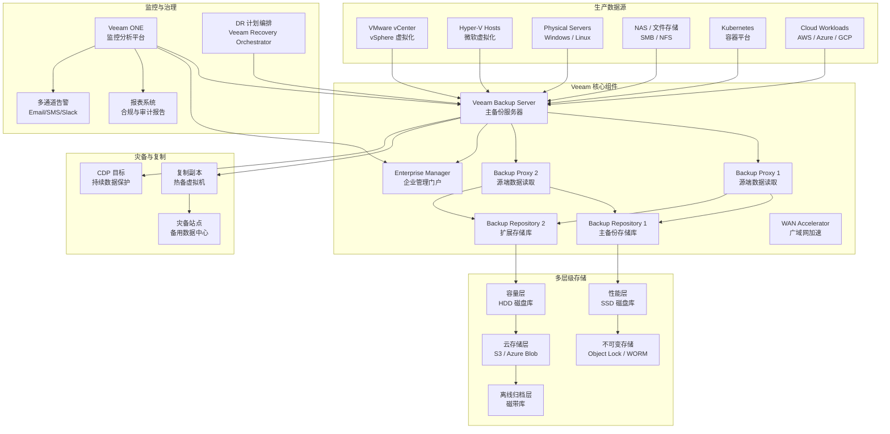

title: Veeam Backup & Replication 企业级备份恢复解决方案
description: '# Veeam Backup & Replication 企业级备份恢复解决方案'
category: disaster-recovery
tags:
- k8s
- disaster-recovery
- backup
- ha
- [[Prometheus|prometheus]]
- job
- gateway
- rbac
- operator
- webhook
last_updated: 2026-05
difficulty: advanced
reading_level: advanced
audience:
- SRE
- 运维工程师
- 架构师
estimated_read_time: 5min
intent_queries:
- Veeam Backup & Replication 企业级备份恢复解决方案 是什么
- 如何 Veeam Backup & Replication 企业级备份恢复解决方案
- [[Kubernetes|Kubernetes]] 30 disaster recovery business continuity 最佳实践
trigger_keywords:
- Veeam
- Backup
- Replication
- 企业级备份恢复解决方案
- disaster
- recovery
- business
- continuity
authors:
- name: KUDIG Team
  role: contributor
k8s_versions:
- '1.28'
- '1.29'
- '1.30'
- '1.31'
- '1.32'
---

# Veeam Backup & Replication 企业级备份恢复解决方案

> **作者**: 企业级备份架构师 | **版本**: v2.0 | **更新时间**: 2026-05-18
> **适用场景**: Veeam 企业级备份恢复 | **复杂度**: ⭐⭐⭐⭐⭐

---

<!-- chunk: 概述 -->## 概述

Veeam Backup & Replication 是业界最广泛部署的备份与灾难恢复解决方案，专为虚拟化、物理和云原生环境设计。凭借其独特的基于快照的增量备份（Forward/Reverse Incremental）、即时恢复（Instant VM Recovery）、构建器合成全量（Synthetic Full）以及 CDP（Continuous Data Protection）等核心能力，Veeam 在企业灾备领域占据重要地位。本文档从企业级备份专家角度，系统阐述 Veeam 的架构设计、备份策略、恢复流程、容灾演练和运维管理最佳实践。

#<!-- chunk: RPO 与 RTO 定义 -->## RPO 与 RTO 定义

- **RPO（Recovery Point Objective）**：可容忍的数据丢失量上限。Veeam 通过差异化的备份频率和复制策略实现不同级别的 RPO：常规备份可实现小时级 RPO，CDP 可实现秒级 RPO，存储复制可实现零数据丢失。
- **RTO（Recovery Time Objective）**：从灾难发生到服务恢复的最大允许时间。Veeam 的即时恢复（Instant VM Recovery）可将 RTO 缩短至分钟级，而传统的文件级恢复则可能需要数小时。

```yaml
veeam_rpo_rto_capabilities:
  standard_backup:
    rpo: "1-24 小时"
    rto: "10-60 分钟（即时恢复）"
    
  continuous_data_protection:
    rpo: "秒级"
    rto: "1-5 分钟"
    
  replication:
    rpo: "15 分钟 - 数小时"
    rto: "5-15 分钟（故障切换）"
    
  tape_backup:
    rpo: "24 小时+"
    rto: "小时-天级（磁带检索时间）"
```

---

<!-- chunk: 架构设计 -->## 架构设计

#<!-- chunk: 企业级 Veeam 备份架构 -->## 企业级 Veeam 备份架构



#<!-- chunk: 核心组件配置 -->## 核心组件配置

```yaml
# Veeam 企业级部署配置
veeam_enterprise:
  backup_server:
    hostname: "VEEAM-BACKUP-01"
    ip: "192.168.1.100"
    os: "Windows Server 2022"
    cpu: 8
    memory_gb: 32
    system_disk_gb: 200
    roles:
      - "Backup Server"
      - "Configuration Database"
      - "VBR Console"
      
  enterprise_manager:
    hostname: "VEEAM-EM-01"
    ip: "192.168.1.101"
    mode: "Enterprise Plus"
    tenants: 10
    rest_api: true
    
  backup_proxies:
    - name: "PROXY-VMWARE-01"
      type: "VMware"
      mode: "Virtual Appliance"  # Virtual Appliance / Physical / Network
      transport: "HotAdd"
      max_concurrent_tasks: 20
      auto_detect: true
      
    - name: "PROXY-VMWARE-02"
      type: "VMware"
      mode: "Virtual Appliance"
      transport: "HotAdd"
      max_concurrent_tasks: 20
      
    - name: "PROXY-PHYSICAL-01"
      type: "Physical"
      os: "Linux"
      max_concurrent_tasks: 10
      
  backup_repositories:
    - name: "PERF-REPO-SSD"
      type: "Scale-Out Backup Repository"
      extent_type: "Windows Server"
      path: "E:\Backup\SSD"
      performance_tier: true
      deduplication: true
      compression: "DedupeFriendly"
      encryption: "AES-256"
      immutability:
        enabled: true
        period_days: 14
        mode: "Compliance"
      
    - name: "CAPACITY-REPO-HDD"
      type: "Scale-Out Backup Repository"
      extent_type: "Linux Server"
      path: "/backup/capacity"
      capacity_tier: true
      deduplication: true
      
    - name: "CLOUD-TIER-S3"
      type: "Object Storage"
      provider: "Amazon S3"
      bucket: "company-veeam-archive"
      region: "us-west-2"
      storage_class: "S3 Glacier Deep Archive"
      retention_years: 7
      
    - name: "TAPE-LIBRARY"
      type: "Tape"
      library: "IBM TS4500"
      media_pool: "Monthly-Full-Pool"
      encryption: "Hardware"
      retention_weeks: 52

  wan_accelerators:
    - name: "WAN-ACC-SOURCE"
      ip: "192.168.1.120"
      cache_size_gb: 500
      
    - name: "WAN-ACC-TARGET"
      ip: "192.168.2.120"
      cache_size_gb: 500
```

---

<!-- chunk: 核心配置 -->## 核心配置

#<!-- chunk: 备份作业配置 -->## 备份作业配置

```powershell
# Veeam PowerShell 备份作业配置
Add-PSSnapin VeeamPSSnapin

# 创建生产环境虚拟机备份作业
$jobName = "Production-VM-Backup-Daily"
$backupRepository = Get-VBRBackupRepository -Name "PERF-REPO-SSD"
$vms = Get-VBRViEntity -Name "Production-*"

$jobOptions = New-VBRJobOptions
$jobOptions.GenerationPolicy.RetentionPolicyType = "Simple"
$jobOptions.GenerationPolicy.SimpleRetention.RestorePoints = 14
$jobOptions.Storage.InterruptQuickBackupOnError = $true
$jobOptions.Storage.EnableFullBackup = $true
$jobOptions.Storage.FullBackupDays = "Friday"
$jobOptions.Storage.TransformFullToSyntethic = $true
$jobOptions.Storage.CompressionLevel = "DedupeFriendly"
$jobOptions.Storage.EnableDeduplication = $true
$jobOptions.Storage.EncryptionEnabled = $true

# 启用应用感知处理（数据库一致性）
$jobOptions.VssProvider = "VSSHardwareProvider"
$jobOptions.GuestFSIndexingType = "Enabled"

Add-VBRViBackupJob -Name $jobName `
    -Entity $vms `
    -BackupRepository $backupRepository `
    -Options $jobOptions

# 配置备份窗口
$scheduleOptions = New-VBRJobScheduleOptions
$scheduleOptions.OptionsDaily.Enabled = $true
$scheduleOptions.OptionsDaily.Kind = "SelectedDays"
$scheduleOptions.OptionsDaily.Time = "22:00"
$scheduleOptions.OptionsDaily.Days = "Monday","Tuesday","Wednesday","Thursday","Friday","Saturday","Sunday"

# 备份窗口限制（避免影响业务）
$scheduleOptions.OptionsBackupWindow.IsBackupWindowEnabled = $true
$scheduleOptions.OptionsBackupWindow.BackupWindow = @(
    @(1,1,1,1,1,1,1,1,0,0,0,0,0,0,0,0,0,0,0,0,0,0,1,1),  # Sunday
    @(1,1,1,1,1,1,1,0,0,0,0,0,0,0,0,0,0,0,0,0,0,1,1,1),  # Monday
    @(1,1,1,1,1,1,1,0,0,0,0,0,0,0,0,0,0,0,0,0,0,1,1,1),
    @(1,1,1,1,1,1,1,0,0,0,0,0,0,0,0,0,0,0,0,0,0,1,1,1),
    @(1,1,1,1,1,1,1,0,0,0,0,0,0,0,0,0,0,0,0,0,0,1,1,1),
    @(1,1,1,1,1,1,1,0,0,0,0,0,0,0,0,0,0,0,0,0,0,1,1,1),
    @(1,1,1,1,1,1,1,1,0,0,0,0,0,0,0,0,0,0,0,0,0,1,1,1)   # Saturday
)

Set-VBRJobSchedule -Job $jobName -Options $scheduleOptions
Enable-VBRJobSchedule -Job $jobName
```

#<!-- chunk: 复制作业配置 -->## 复制作业配置

```powershell
# 灾备复制作业
$replicaJobName = "Production-To-DR-Replication"
$sourceVms = Get-VBRViEntity -Name "Critical-*"
$targetHost = Get-VBRServer -Name "DR-ESXi-01"
$targetDatastore = Get-VBRViDatastore -Name "DR-Datastore-01"
$targetResourcePool = Get-VBRViResourcePool -Name "DR-Resources"

$replicaOptions = New-VBRJobOptions
$replicaOptions.FailoverToOriginalVmAfterFailback = $true
$replicaOptions.HighPriorityForAppAwareProcessing = $true
$replicaOptions.ReplicaTargetDiskType = "SameAsSource"

Add-VBRViReplicaJob -Name $replicaJobName `
    -Entity $sourceVms `
    -Server $targetHost `
    -Datastore $targetDatastore `
    -ResourcePool $targetResourcePool `
    -Options $replicaOptions

# CDP 策略配置（秒级 RPO）
$cdpPolicyName = "Critical-CDP-Protection"
$cdpPolicy = Add-VBRCDPPolicy -Name $cdpPolicyName `
    -Entity (Get-VBRViEntity -Name "Database-*") `
    -Repository (Get-VBRBackupRepository -Name "CDP-REPO") `
    -RPO 60  # 60秒 RPO
```

#<!-- chunk: 存储优化与安全 -->## 存储优化与安全

```yaml
# Veeam 存储优化配置
storage_optimization:
  compression:
    level: "DedupeFriendly"    # Optimal / High / Extreme / DedupeFriendly
    block_size: "LocalStorage"  # LocalStorage / WAN / 4MB / 1MB / 512KB / 256KB
    
  deduplication:
    global_deduplication: true
    source_side_deduplication: true
    
  encryption:
    enabled: true
    algorithm: "AES-256"
    key_management: "Built-in"  # Built-in / KMIP
    
  immutability:
    enabled: true
    period_days: 14
    mode: "Compliance"          # Compliance / Governance
    
  scale_out_repository:
    policy: "DataLocality"      # DataLocality / Performance
    performance_tier:
      extent: "PERF-REPO-SSD"
      placement_policy: "DataLocality"
    capacity_tier:
      extent: "CAPACITY-REPO-HDD"
      move_policy: "DaysAfterCreation"
      move_after_days: 14
    archive_tier:
      extent: "CLOUD-TIER-S3"
      move_policy: "DaysAfterCreation"
      move_after_days: 30
```

---

<!-- chunk: 备份策略 -->## 备份策略

#<!-- chunk: 3-2-1-1-0 原则 -->## 3-2-1-1-0 原则

现代备份策略应遵循 **3-2-1-1-0** 原则：

- **3** 份数据副本（生产 + 本地备份 + 异地备份）
- **2** 种不同存储介质（磁盘 + 磁带/云）
- **1** 份异地副本（灾备数据中心或云存储）
- **1** 份不可变副本（Object Lock / 空气隔离）
- **0** 错误（自动验证所有备份可恢复）

```yaml
# 3-2-1-1-0 策略实施
backup_strategy:
  copies:
    - name: "本地磁盘备份"
      type: "SOBR Performance Tier"
      storage: "SSD 阵列"
      schedule: "每日增量 + 周日全量"
      retention: "14 天"
      encryption: "AES-256"
      
    - name: "异地复制备份"
      type: "SOBR Capacity Tier"
      storage: "HDD 阵列（灾备站点）"
      schedule: "备份完成后自动复制"
      retention: "30 天"
      wan_acceleration: true
      
    - name: "不可变云归档"
      type: "Object Storage + Object Lock"
      storage: "AWS S3 Glacier Deep Archive"
      schedule: "每月归档"
      retention: "7 年"
      immutability: "Compliance"
      air_gap: true
      
  verification:
    automatic_backup_verification: true
    sure_backup_interval: "每周"
    restore_test_interval: "每月"
    data_integrity_check: "每日"
```

#<!-- chunk: 分层备份频率 -->## 分层备份频率

```yaml
# 基于业务关键性的备份频率
backup_frequencies:
  tier_1_critical:
    systems: ["ERP-Database", "CRM-Database", "Payment-Gateway"]
    backup_type: "CDP + 每日全量"
    cdp_rpo: "60 秒"
    replication_rpo: "15 分钟"
    retention:
      cdp: "7 天"
      daily_full: "30 天"
      weekly_full: "12 周"
      monthly_full: "12 月"
    application_aware: true
    
  tier_2_important:
    systems: ["Web-Servers", "API-Servers", "Middleware"]
    backup_type: "每日增量 + 周日全量"
    retention:
      daily_incremental: "14 天"
      weekly_full: "8 周"
      monthly_full: "6 月"
    application_aware: false
    
  tier_3_standard:
    systems: ["Dev-Servers", "File-Servers", "Print-Servers"]
    backup_type: "每周全量"
    retention:
      weekly_full: "4 周"
      monthly_full: "3 月"
```

---

<!-- chunk: 恢复流程 -->## 恢复流程

#<!-- chunk: 即时虚拟机恢复 -->## 即时虚拟机恢复

```powershell
# Veeam Instant VM Recovery - 最快恢复路径
function Start-InstantRecovery {
    param(
        [string]$VmName,
        [string]$RestorePoint = "Latest",
        [string]$TargetHost,
        [string]$TargetDatastore
    )
    
    Write-Host "启动即时恢复: $VmName"
    
    # 查找最新恢复点
    $vm = Find-VBRViEntity -Name $VmName
    $restorePoints = Get-VBRRestorePoint -BackupObject $vm | 
        Sort-Object CreationTime -Descending
    
    if ($RestorePoint -eq "Latest") {
        $rp = $restorePoints | Select-Object -First 1
    } else {
        $rp = $restorePoints | Where-Object { 
            $_.CreationTime -gt (Get-Date).AddHours(-$RestorePoint) 
        } | Select-Object -First 1
    }
    
    # 执行即时恢复
    $recovery = Start-VBRInstantRecovery `
        -RestorePoint $rp `
        -Server (Get-VBRServer -Name $TargetHost) `
        -Datastore (Get-VBRViDatastore -Name $TargetDatastore) `
        -VMName "$($VmName)_InstantRecovery" `
        -PowerUp $true `
        -Reason "Disaster Recovery - $(Get-Date -Format 'yyyy-MM-dd HH:mm')"
    
    Write-Host "即时恢复已启动，虚拟机运行中"
    Write-Host "注意: 虚拟机正在从备份存储直接运行，需要尽快执行 vMotion 迁移到生产存储"
    
    return $recovery
}

# 使用示例
Start-InstantRecovery -VmName "ERP-Database-01" `
    -TargetHost "ESXi-DR-01" `
    -TargetDatastore "DR-Datastore-01"
```

#<!-- chunk: 完整灾难恢复流程 -->## 完整灾难恢复流程

```yaml
# Veeam 灾难恢复操作手册
disaster_recovery_procedure:
  phase_1_assessment:
    step: "灾难评估"
    duration: "15 分钟"
    actions:
      - "确认灾难范围和影响"
      - "通知 DR 团队和管理层"
      - "确认备份存储库可用"
      - "验证复制副本状态"
      
  phase_2_triage:
    step: "优先级排序"
    duration: "15 分钟"
    actions:
      - "按 RTO 优先级列出待恢复系统"
      - "确认每个系统的最新可用恢复点"
      - "分配恢复任务给团队成员"
      
  phase_3_recovery:
    step: "执行恢复"
    duration: "1-4 小时"
    parallel_actions:
      - action: "即时恢复关键数据库"
        systems: ["ERP-Database", "CRM-Database"]
        method: "Instant VM Recovery"
        expected_rto: "10 分钟"
        
      - action: "故障切换复制副本"
        systems: ["Web-Frontend", "API-Servers"]
        method: "Replica Failover"
        expected_rto: "5 分钟"
        
      - action: "CDP 回退恢复"
        systems: ["Payment-Gateway"]
        method: "CDP Failback"
        expected_rto: "5 分钟"
        
  phase_4_validation:
    step: "恢复验证"
    duration: "30 分钟"
    actions:
      - "验证虚拟机启动状态"
      - "执行应用层健康检查"
      - "验证数据库连接和数据完整性"
      - "确认网络可达性"
      
  phase_5_cutover:
    step: "流量切换"
    duration: "15 分钟"
    actions:
      - "更新 DNS 记录指向灾备站点"
      - "更新负载均衡器后端池"
      - "监控用户访问流量"
      
  phase_6_stabilization:
    step: "稳定运行"
    duration: "持续"
    actions:
      - "监控系统性能和稳定性"
      - "记录恢复过程和问题"
      - "准备回切计划"
```

---

<!-- chunk: 容灾演练方案 -->## 容灾演练方案

```yaml
# Veeam 容灾演练年度计划
dr_drill_program:
  monthly_surebackup:
    type: "SureBackup 自动验证"
    scope: "所有关键备份作业"
    automation: "完全自动化"
    steps:
      - "自动启动验证虚拟机"
      - "执行应用心跳检测"
      - "运行数据库查询验证"
      - "生成验证报告"
      - "自动清理验证环境"
    success_criteria:
      - "所有虚拟机成功启动"
      - "应用健康检查通过"
      - "数据完整性验证通过"
      
  quarterly_partial_failover:
    type: "部分故障切换演练"
    scope: "选择 2-3 个非核心系统"
    participants: ["备份团队", "应用团队"]
    steps:
      - "选择演练系统和恢复点"
      - "在隔离网络中执行即时恢复"
      - "执行功能测试"
      - "记录 RTO 实际测量值"
      - "清理演练环境"
      
  semi_annual_replica_test:
    type: "复制副本故障切换测试"
    scope: "所有复制副本"
    participants: ["备份团队", "网络团队", "应用团队"]
    steps:
      - "执行 Test Failover（不影响生产）"
      - "验证灾备站点虚拟机功能"
      - "测试网络连通性"
      - "执行数据一致性校验"
      - "执行 Undo Failover 清理"
      
  annual_full_drill:
    type: "年度全量灾备演练"
    scope: "全部核心业务系统"
    participants: ["全体IT团队", "业务部门", "管理层"]
    duration: "2 天"
    steps:
      - "Day 1: 生产站点模拟问题"
      - "Day 1: 执行完整故障切换到灾备站点"
      - "Day 1: 灾备站点承载生产流量（4小时）"
      - "Day 2: 执行问题回切"
      - "Day 2: 验证数据完整性"
      - "Day 2: 演练总结与改进计划"
```

---

<!-- chunk: 监控告警 -->## 监控告警

#<!-- chunk: Veeam ONE 监控配置 -->## Veeam ONE 监控配置

```yaml
# Veeam ONE 监控配置
veeam_one:
  monitoring:
    backup_jobs:
      - metric: "backup_success_rate"
        threshold: ">= 95%"
        alert_severity: "critical"
        
      - metric: "backup_duration"
        baseline: "历史平均 + 50%"
        alert_severity: "warning"
        
    repositories:
      - metric: "free_space_percentage"
        warning: "< 20%"
        critical: "< 10%"
        
      - metric: "write_throughput"
        threshold: "< 50 MB/s"
        
    replication:
      - metric: "replica_rpo_compliance"
        threshold: ">= 99%"
        
      - metric: "replication_lag"
        warning: "> 60 分钟"
        critical: "> RPO 目标"
        
  alerting:
    channels:
      - type: "email"
        smtp: "smtp.company.com"
        recipients: ["backup-team@company.com", "noc@company.com"]
        
      - type: "webhook"
        url: "https://monitoring.company.com/webhook/veeam"
        
      - type: "syslog"
        server: "syslog.company.com"
        port: 514
```

#<!-- chunk: Prometheus 告警规则 -->## Prometheus 告警规则

```yaml
apiVersion: v1
kind: ConfigMap
metadata:
  name: veeam-alerts
  namespace: monitoring
data:
  veeam-alerts.yml: |
    groups:
      - name: veeam.backup
        rules:
          - alert: VeeamBackupJobFailed
            expr: veeam_backup_job_status{status="failed"} == 1
            for: 5m
            labels:
              severity: critical
            annotations:
              summary: "Veeam 备份作业 {{ $labels.job_name }} 失败"
              
          - alert: VeeamRepositorySpaceLow
            expr: veeam_repository_free_space_percent < 15
            for: 10m
            labels:
              severity: warning
            annotations:
              summary: "备份存储库 {{ $labels.repository }} 剩余空间 < 15%"
              
          - alert: VeeamReplicationLagHigh
            expr: veeam_replication_lag_minutes > 120
            for: 5m
            labels:
              severity: critical
            annotations:
              summary: "复制作业 {{ $labels.job_name }} 延迟超过 120 分钟"
              
          - alert: VeeamNoBackupIn24Hours
            expr: time() - veeam_last_successful_backup_timestamp > 86400
            for: 1h
            labels:
              severity: warning
            annotations:
              summary: "虚拟机 {{ $labels.vm_name }} 超过 24 小时未备份"
```

---

<!-- chunk: 最佳实践 -->## 最佳实践

#<!-- chunk: 备份策略最佳实践 -->## 备份策略最佳实践

1. **实施 Scale-Out Backup Repository（SOBR）**：将性能层、容量层和归档层分层管理，自动移动备份数据
2. **启用不可变存储**：使用 S3 Object Lock 或 WORM 存储防止勒索软件加密备份
3. **配置备份加密**：所有备份数据启用 AES-256 加密，密钥定期轮换
4. **启用 SureBackup**：每次备份后自动验证可恢复性，而非等到需要恢复时才发现问题
5. **使用 WAN Accelerator**：跨站点复制时启用广域网加速，减少 10 倍以上带宽消耗

#<!-- chunk: 安全最佳实践 -->## 安全最佳实践

- 使用 Active Directory 集成认证，基于角色分配权限（Backup Admin / Operator / Viewer）
- 启用 MFA 多因素认证访问 Veeam Enterprise Manager
- 所有备份流量启用 TLS 1.2+ 加密
- 审计日志保留 90 天以上，接入 SIEM 平台
- 实施最小权限原则：备份服务账户仅赋予必要的 vCenter 权限

#<!-- chunk: 性能最佳实践 -->## 性能最佳实践

- Backup Proxy 部署为 Virtual Appliance 模式，使用 HotAdd 传输
- 每个 Proxy 不超过 20 个并发任务
- 使用多个 Backup Repository 分布 I/O 负载
- 启用 Jumbo Frame（MTU 9000）优化备份网络
- 备份窗口避开业务高峰期

---

<!-- chunk: 故障排查 -->## 故障排查

#<!-- chunk: 常见问题诊断 -->## 常见问题诊断

```powershell
# Veeam 故障排查工具集
function Invoke-VeeamDiagnostics {
    Write-Host "=== Veeam 系统诊断 ===" -ForegroundColor Cyan
    
    # 1. 服务状态检查
    Write-Host "`n[1] 服务状态检查"
    $services = @("VeeamBackupSvc", "VeeamDeploySvc", "VeeamCatalogSvc")
    foreach ($svc in $services) {
        $status = Get-Service -Name $svc -ErrorAction SilentlyContinue
        if ($status.Status -eq "Running") {
            Write-Host "  $svc : Running" -ForegroundColor Green
        } else {
            Write-Host "  $svc : NOT RUNNING" -ForegroundColor Red
        }
    }
    
    # 2. 最近失败作业
    Write-Host "`n[2] 最近失败作业（24小时）"
    $failedJobs = Get-VBRJobSession | 
        Where-Object { $_.Result -eq "Failed" -and $_.EndTime -gt (Get-Date).AddHours(-24) }
    foreach ($job in $failedJobs) {
        Write-Host "  $($job.Name) : $($job.EndTime) - $($job.Result)" -ForegroundColor Red
    }
    
    # 3. 存储库空间检查
    Write-Host "`n[3] 存储库空间"
    $repos = Get-VBRBackupRepository
    foreach ($repo in $repos) {
        $freePercent = [math]::Round(($repo.Info.CachedFreeSpace / $repo.Info.CachedTotalSpace) * 100, 2)
        $color = if ($freePercent -lt 10) { "Red" } elseif ($freePercent -lt 20) { "Yellow" } else { "Green" }
        Write-Host "  $($repo.Name) : $freePercent% free" -ForegroundColor $color
    }
    
    # 4. 许可证状态
    Write-Host "`n[4] 许可证状态"
    $license = Get-VBRInstalledLicense
    Write-Host "  版本: $($license.Edition)"
    Write-Host "  过期: $($license.ExpirationDate)"
    Write-Host "  已用实例: $($license.UsedInstances) / $($license.TotalInstances)"
}
```

#<!-- chunk: 故障排查手册 -->## 故障排查手册

| 问题现象 | 可能原因 | 排查步骤 | 解决方案 |
|:---|:---|:---|:---|
| 备份作业超时 | 存储性能瓶颈 | 检查存储 IOPS 和延迟 | 减少并发任务数，优化备份窗口 |
| 即时恢复后性能差 | 备份存储 I/O 不足 | 监控备份存储读取速度 | 快速 vMotion 到生产存储 |
| 复制延迟过高 | 网络带宽不足 | 检查站点间带宽利用率 | 启用 WAN 加速，限制带宽 |
| 备份验证失败 | VSS 提供程序异常 | 检查应用 VSS Writer 状态 | 重启 VSS 服务或重新注册 |
| 存储库空间不足 | 保留策略过长 | 审查备份数据增长趋势 | 调整保留策略或扩展存储 |
| CDP 策略中断 | 目标存储不可达 | 检查 CDP 存储连接 | 恢复存储连接后重启策略 |

---

**文档版本**: v2.0  
**最后更新**: 2026-05-18  
**适用版本**: Veeam Backup & Replication 12+

---

<!-- chunk: Veeam CDP 连续数据保护 -->## Veeam CDP 连续数据保护

#<!-- chunk: CDP 策略配置 -->## CDP 策略配置

Veeam 的 Continuous Data Protection（CDP）功能基于 VMware vSphere 的 I/O Filter 框架，可以在虚拟机磁盘级别实现持续的数据复制。CDP 的 RPO 可以达到秒级——当源虚拟机发生问题时，CDP 副本的数据丢失量不超过配置的 RPO 目标。

CDP 的核心优势在于它不依赖定时快照，而是通过 VMware VAIO（vSphere APIs for I/O Filtering）实时捕获虚拟机的每个写操作，将数据变更异步传输到目标站点。这意味着即使源站点完全崩溃，CDP 副本的数据也只丢失最后几秒的数据。

```powershell
# Veeam CDP 策略配置
$cdpPolicy = @{
    Name = "Critical-VMs-CDP"
    RPO = 60  # 60秒 RPO 目标
    Source = "vcenter-primary.company.com"
    Target = "vcenter-dr.company.com"
    
    # 包含的虚拟机
    VMs = @(
        "ERP-Database-Primary"
        "CRM-Database-Primary"
        "Payment-Gateway"
    )
    
    # 目标数据存储
    TargetDatastore = "DR-Datastore-CDP"
    
    # 故障切换网络映射
    NetworkMapping = @{
        "Production Network" = "DR-Production-Network"
        "Database Network" = "DR-Database-Network"
    }
    
    # 保留策略
    RetentionPolicy = @{
        ShortTerm = @{
            Points = 10
            Interval = "每小时"
        }
        LongTerm = @{
            Points = 24
            Interval = "每日"
        }
    }
}

# 创建 CDP 策略
Add-VBRCDPPolicy -Name $cdpPolicy.Name `
    -RPO $cdpPolicy.RPO `
    -Entity (Get-VBRViEntity -Name $cdpPolicy.VMs) `
    -TargetDatastore (Get-VBRViDatastore -Name $cdpPolicy.TargetDatastore)
```

#<!-- chunk: CDP 故障切换 -->## CDP 故障切换

```powershell
# CDP 故障切换脚本
function Start-CDPFailover {
    param(
        [string]$PolicyName,
        [string]$VMName,
        [datetime]$RestorePoint = (Get-Date)
    )
    
    Write-Host "启动 CDP 故障切换: $VMName" -ForegroundColor Yellow
    
    # 获取 CDP 恢复点
    $cdpRestorePoint = Get-VBRCDPRestorePoint -Name $VMName | 
        Where-Object { $_.CreationTime -le $RestorePoint } | 
        Sort-Object CreationTime -Descending | 
        Select-Object -First 1
        
    if (-not $cdpRestorePoint) {
        Write-Error "未找到可用的 CDP 恢复点"
        return
    }
    
    Write-Host "使用恢复点: $($cdpRestorePoint.CreationTime)" -ForegroundColor Cyan
    Write-Host "数据丢失窗口: $((Get-Date) - $cdpRestorePoint.CreationTime)" -ForegroundColor Cyan
    
    # 执行故障切换
    Start-VBRCDPFailover -RestorePoint $cdpRestorePoint -PowerOn $true
    
    Write-Host "CDP 故障切换完成" -ForegroundColor Green
}
```

---

<!-- chunk: Veeam 勒索软件防护 -->## Veeam 勒索软件防护

#<!-- chunk: 防勒索软件多层策略 -->## 防勒索软件多层策略

勒索软件已成为企业数据安全的头号威胁。Veeam 提供了完整的多层勒索软件防护方案：不可变备份（Immutability）确保备份数据无法被加密或删除；Veeam ONE 的异常检测可以在勒索软件加密数据的早期阶段发现异常；即时恢复（Instant Recovery）可以从干净的恢复点快速恢复受影响的系统。

```yaml
# Veeam 勒索软件防护策略
ransomware_protection:
  layer_1_immutable_backups:
    technology: "S3 Object Lock / Hardened Repository"
    configuration:
      lock_mode: "Compliance"
      lock_period_days: 30
      override: "不允许"
      
    hardened_repository:
      type: "Linux Hardened Repository"
      os: " hardened Linux"
      features:
        - "无 SSH 访问"
        - "只允许 Veeam 数据写入"
        - "文件系统级不可变"
        
  layer_2_anomaly_detection:
    tool: "Veeam ONE"
    detection_rules:
      - "备份数据大小异常增长（可能是加密后变化大）"
      - "异常文件修改速率"
      - "备份作业完成时间突然延长"
      - "文件类型分布异常变化"
      
  layer_3_rapid_recovery:
    strategy: "从最近的干净恢复点即时恢复"
    estimated_rto: "10-30 分钟"
    steps:
      - "识别受影响系统"
      - "使用 SureBackup 验证恢复点干净"
      - "执行 Instant Recovery"
      - "运行恶意软件扫描"
      - "确认安全后快速切换"
      
  layer_4_air_gap:
    strategy: "离线/空气隔离备份副本"
    technology: "磁带库 / 离线硬盘"
    schedule: "每月离线归档"
```

---

#<!-- chunk: 关键监控指标 -->## 关键监控指标

Veeam 企业级监控需要关注以下核心指标，每个指标都直接关联到灾备方案的有效性：

备份成功率是首要指标。如果备份作业持续失败而未被及时发现，当灾难发生时可能发现没有可用的恢复点。建议设定成功率为 95% 的最低阈值，低于此值应立即告警。

存储库剩余空间是另一个关键指标。备份数据的增长速度往往超出预期，特别是在勒索软件攻击场景下，异常的数据增长可能迅速耗尽存储空间。建议设置 20% 剩余空间为告警阈值，10% 为紧急阈值。

恢复点目标达标率衡量的是实际备份频率是否满足 RPO 要求。如果 RPO 目标为 4 小时但最近一次成功备份是 8 小时前，那么 RPO 已经违规。建议设置自动化的 RPO 达标率监控，任何违规立即告警。

```yaml
# Veeam 关键指标阈值
veeam_kpi_thresholds:
  backup_success_rate:
    target: ">= 99%"
    warning: "95%"
    critical: "90%"
    
  repository_free_space:
    warning: "< 20%"
    critical: "< 10%"
    
  rpo_compliance:
    target: ">= 99.9%"
    warning: "< 99%"
    critical: "< 95%"
    
  backup_duration:
    target: "< 8 小时（每日全量）"
    warning: "> 10 小时"
    critical: "> 12 小时（超出备份窗口）"
    
  replication_lag:
    target: "< RPO 目标"
    warning: "> RPO 目标 × 1.5"
    critical: "> RPO 目标 × 3"
    
  restore_success_rate:
    target: "100%"
    any_failure: "critical"
```

---

<!-- chunk: Veeam 自动化运维 -->## Veeam 自动化运维

#<!-- chunk: 日常运维自动化脚本 -->## 日常运维自动化脚本

```powershell
# Veeam 日常运维自动化
Import-Module Veeam.Backup.PowerShell

# 自动清理过期备份
function Invoke-VeeamCleanup {
    Write-Host "开始清理过期备份数据..."
    
    $repositories = Get-VBRBackupRepository
    foreach ($repo in $repositories) {
        $freePercent = ($repo.Info.CachedFreeSpace / $repo.Info.CachedTotalSpace) * 100
        Write-Host "$($repo.Name): $([math]::Round($freePercent, 2))% 可用"
        
        if ($freePercent -lt 15) {
            Write-Warning "$($repo.Name) 空间不足，启动清理..."
            $backups = Get-VBRBackup -Repository $repo | 
                Sort-Object CreationTime | 
                Select-Object -First 5
                
            foreach ($backup in $backups) {
                $restorePoints = Get-VBRRestorePoint -Backup $backup | 
                    Where-Object { $_.CreationTime -lt (Get-Date).AddDays(-30) }
                    
                if ($restorePoints.Count -gt 0) {
                    Write-Host "  清理 $($backup.Name) 的 $($restorePoints.Count) 个过期恢复点"
                    $restorePoints | Remove-VBRRestorePoint -Confirm:$false
                }
            }
        }
    }
}

# 生成日报
function New-VeeamDailyReport {
    $date = Get-Date -Format "yyyy-MM-dd"
    $report = @{
        Date = $date
        Jobs = @()
        Repositories = @()
        Alerts = @()
    }
    
    # 作业统计
    $jobs = Get-VBRJob
    foreach ($job in $jobs) {
        $lastSession = $job | Get-VBRJobSession | Select-Object -First 1
        $report.Jobs += @{
            Name = $job.Name
            Type = $job.JobType
            LastResult = $lastSession.Result
            LastRun = $lastSession.CreationTime
            Duration = $lastSession.EndTime - $lastSession.CreationTime
        }
    }
    
    # 存储库统计
    $repos = Get-VBRBackupRepository
    foreach ($repo in $repos) {
        $report.Repositories += @{
            Name = $repo.Name
            TotalGB = [math]::Round($repo.Info.CachedTotalSpace / 1GB, 2)
            FreeGB = [math]::Round($repo.Info.CachedFreeSpace / 1GB, 2)
            FreePercent = [math]::Round(($repo.Info.CachedFreeSpace / $repo.Info.CachedTotalSpace) * 100, 2)
        }
    }
    
    $report | ConvertTo-Json -Depth 3 | 
        Out-File "C:\\Reports\\Veeam_Daily_$date.json"
    
    return $report
}
```

---

<!-- chunk: Veeam 与存储集成 -->## Veeam 与存储集成

#<!-- chunk: 存储快照集成 -->## 存储快照集成

Veeam 支持与主流存储阵列（Dell EMC PowerMax、NetApp ONTAP、HPE Primera、Pure Storage 等）直接集成，利用存储阵列的原生快照功能实现更快的备份和更低的性能影响。

```yaml
# Veeam 存储快照集成配置
storage_integration:
  dell_emc_powermax:
    type: "storage_snapshot"
    integration: "Veeam Storage Integration API"
    configuration:
      array_ip: "192.168.20.10"
      username: "${STORAGE_USER}"
      password: "${STORAGE_PASSWORD}"
      
    snapshot_schedule:
      - name: "Hourly App Snapshot"
        frequency: "每小时"
        retention: 24
        
      - name: "15-Minute Critical DB"
        frequency: "每 15 分钟"
        retention: 96
        
    backup_from_snapshot:
      description: "从存储快照创建 Veeam 备份，零影响生产"
      performance: "直接从存储读取，不经过 ESXi 主机"
      
  netapp_ontap:
    type: "storage_snapshot"
    integration: "NetApp SnapMirror + Veeam"
    configuration:
      svm: "prod-svm"
      volume: "prod_data"
      
    snapmirror:
      source: "netapp-primary"
      destination: "netapp-dr"
      schedule: "每 15 分钟"
      retention: "7 天"
```

---

<!-- chunk: Veeam 性能优化 -->## Veeam 性能优化

#<!-- chunk: 大规模环境性能调优 -->## 大规模环境性能调优

在大规模企业环境中（保护数千台虚拟机），Veeam 的性能优化至关重要。以下是从备份代理、存储库、网络和并发四个维度的优化建议。

```yaml
# Veeam 性能优化指南
performance_optimization:
  backup_proxy:
    recommendation:
      - "每 200 台虚拟机部署一个 Backup Proxy"
      - "使用 Virtual Appliance 模式（HotAdd）"
      - "每个 Proxy 最大并发任务数: 20"
      - "Proxy 部署在 SSD 存储上"
      - "启用自动发现新 Proxy"
      
  backup_repository:
    recommendation:
      - "使用 SOBR（Scale-Out Backup Repository）分层管理"
      - "性能层使用 SSD，容量层使用 HDD"
      - "启用全局去重（Global Deduplication）"
      - "块大小选择：局域网 1MB，广域网 256KB"
      - "并发写入流数: 16-32"
      
  network:
    recommendation:
      - "备份网络与管理网络物理隔离"
      - "启用 Jumbo Frame（MTU 9000）"
      - "跨站点复制启用 WAN Accelerator"
      - "带宽节流: 业务高峰 200Mbps，非高峰不限"
      
  concurrency:
    recommendation:
      - "同时运行的最大作业数: CPU 核心数 / 2"
      - "每个作业的最大并发任务数: 源 Proxy 线程数"
      - "合并任务（Merge）调度在非高峰期"
      - "健康检查（Health Check）每周执行一次"
```

---

**文档版本**: v2.0  
**最后更新**: 2026-05-18  
**适用版本**: Veeam Backup & Replication 12+

---

<!-- chunk: Obsidian 相关文档 -->## Obsidian 相关文档

- domain-30-disaster-recovery-business-continuity KUDIG Database — Global MOC
- [[domain-09-reliability-engineering/README.md|Domain 30: 企业级灾备与业务连续性 (Enterprise Disaster Recovery & Busin...]]
- Domain-30 灾备与业务连续性 — 开源项目索引
- VMware vSphere 企业级灾备与业务连续性
- 企业级容灾架构与混沌工程深度实践
- Commvault 企业级灾备与业务连续性深度实践
- Rubrik 企业级灾备与业务连续性深度实践
- Kubernetes 备份与恢复深度实践
- 混沌工程平台实践：LitmusChaos 与 Chaos Mesh
- 应用级灾备架构：多区域部署与故障转移
- Velero 企业级备份恢复实践指南

## See Also

- 99-velero-backup-recovery-guide
- 01-vmware-vsphere-enterprise-dr
- 03-enterprise-disaster-recovery-chaos-engineering
- 05-commvault-enterprise-disaster-recovery

## Related

- [[domain-19-landscape-references/topic-index/backup-dr-index|Backup & DR 备份与灾备知识图谱索引]]
