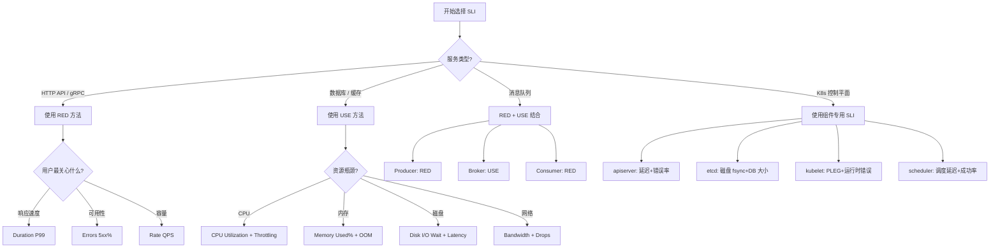

# SLI 定义与选择方法论

> **核心原则**: SLI 不是技术指标，而是用户体验的量化代理。好的 SLI 应该让用户说"这就是我关心的"。

## 什么是 SLI

**SLI ([[Service|Service]] Level Indicator)** — 服务级别指标，是经过审慎选择的量化指标，用于衡量服务某个方面的可靠性水平。

### SLI 的核心特征

| 特征 | 说明 | 反例 |
|------|------|------|
| **用户视角** | 反映用户真实体验 | CPU 使用率 ❌ |
| **可量化** | 能用数字精确表达 | "系统很稳定" ❌ |
| **可聚合** | 支持时间窗口内的汇总 | 单次请求延迟 ✅ |
| **可比较** | 能跨版本/跨集群对比 | 错误数 vs 错误率 |

## 四大黄金信号 (Four Golden Signals)

Google SRE 提出的四个核心维度，适用于绝大多数服务：

### 1. 延迟 (Latency)

**定义**: 服务响应请求所需的时间。

**关键区分**:
```
⚠️ 必须区分成功请求的延迟 vs 失败请求的延迟

错误示例: 平均延迟 200ms
  → 包含大量 5xx 快速失败（< 10ms），拉低平均值，掩盖真实问题

正确做法:
  - 成功请求 P99 延迟: 180ms
  - 失败请求 P99 延迟: 5ms
```

**[[Kubernetes|Kubernetes]] 场景下的延迟 SLI**:

| 服务类型 | 延迟测量点 | 建议 SLI |
|---------|-----------|---------|
| HTTP API | [[Ingress|Ingress]] → Pod | P99 响应时间 < 500ms |
| [[gRPC|gRPC]] 服务 | Service → Pod | P99 响应时间 < 200ms |
| 数据库查询 | App → DB | P99 查询时间 < 100ms |
| 消息消费 | Queue → Consumer | P99 消费延迟 < 5s |

### 2. 流量 (Traffic)

**定义**: 系统承受的请求量或负载。

**流量测量维度**:
```
HTTP 服务: 每秒请求数 (QPS/RPS)
gRPC 服务: 每秒 RPC 调用数
消息队列: 每秒消息处理数
批处理: 每小时处理记录数
```

**流量 SLI 的应用场景**:
- 容量规划基准
- 故障影响范围评估（"峰值流量时的故障影响 X 用户"）
- 弹性伸缩触发条件

### 3. 错误 (Errors)

**定义**: 请求失败的比率。

**错误分类**:
```
明确错误 (Explicit):
  - HTTP 5xx
  - gRPC status != OK
  - 超时（超过阈值视为错误）

隐式错误 (Implicit):
  - 返回 200 但内容错误
  - 返回 200 但处理时间超过用户容忍度
  - 部分成功（如批量接口部分失败）
```

**错误率计算**:
```
错误率 = 错误请求数 / 总请求数

⚠️ 注意: 总请求数 = 成功请求数 + 明确错误请求数 + 隐式错误请求数
```

### 4. 饱和度 (Saturation)

**定义**: 服务容量的使用程度，接近 100% 时性能通常下降。

**饱和度与利用率的区别**:
```
利用率 (Utilization): 资源被占用的比例
  → CPU 利用率 80%

饱和度 (Saturation): 因资源不足而等待的比例
  → 请求在队列中等待 CPU 的比例
```

**Kubernetes 场景下的饱和度 SLI**:

| 资源 | 利用率指标 | 饱和度指标 |
|------|-----------|-----------|
| CPU | CPU 使用率 | CPU 节流次数 (CPU throttling) |
| 内存 | 内存使用率 | OOM Kill 次数 |
| 磁盘 | 磁盘使用率 | I/O 等待时间 |
| 网络 | 带宽使用率 | 连接队列溢出 |

## RED 方法 vs USE 方法

### RED 方法（面向请求的服务）

适用于: HTTP API、gRPC、消息队列消费者

```
R - Rate (请求率)
E - Errors (错误率)
D - Duration (持续时间/延迟)
```

**RED 检查清单**:
- [ ] 能测量每秒请求数
- [ ] 能分类成功/失败请求
- [ ] 能测量延迟分布（非平均值）

### USE 方法（面向资源的服务）

适用于: 数据库、缓存、消息队列、节点

```
U - Utilization (利用率)
S - Saturation (饱和度)
E - Errors (错误数)
```

**USE 检查清单**:
- [ ] 能测量资源利用率（0-100%）
- [ ] 能检测资源饱和度（排队、等待）
- [ ] 能检测资源错误（OOM、I/O error）

### 方法选择决策树

```
服务类型?
├── 处理请求/事件 → RED 方法
│   ├── HTTP API → Rate, Errors(5xx%), Duration(p99)
│   ├── gRPC → Rate, Errors(grpc_code != OK), Duration(p99)
│   └── 消息消费者 → Rate, Errors(处理失败), Duration(消费延迟)
│
└── 提供资源/存储 → USE 方法
    ├── 数据库节点 → CPU%(U), 连接队列(S), 查询错误(E)
    ├── 缓存节点 → 内存%(U), 驱逐率(S), 连接错误(E)
    └── 存储节点 → 磁盘%(U), I/O wait(S), 磁盘错误(E)
```

## Kubernetes 核心组件 SLI 清单

Kubernetes 控制平面和数据平面的每个核心组件都有明确的 SLI 定义。以下清单基于 Google GKE、生产社区实践和 Kubernetes SIG Scalability 的推荐。

### API Server SLI

API Server 是整个集群的入口，其可靠性直接影响所有操作。

| SLI | 描述 | 推荐阈值 | [[Prometheus|Prometheus]] 指标 |
|-----|------|---------|----------------|
| **读请求延迟** | 非流式读请求 P99 延迟 | < 1s | `apiserver_request_duration_seconds_bucket{verb!="WATCH"}` |
| **写请求延迟** | 写请求（PUT/POST/PATCH/DELETE）P99 延迟 | < 5s | `apiserver_request_duration_seconds_bucket{verb=~"POST|PUT|PATCH|DELETE"}` |
| **请求错误率** | 5xx 错误占总请求比例 | < 1% | `apiserver_request_total{code=~"5.."}` |
| **WATCH 请求延迟** | WATCH 请求建立连接的 P99 延迟 | < 10s | `apiserver_request_duration_seconds_bucket{verb="WATCH"}` |
| **请求速率** | 每秒处理的请求数 | 按容量规划 | `rate(apiserver_request_total[5m])` |
| **认证失败率** | 认证失败的请求比例 | < 0.1% | `apiserver_request_total{code="401"}` |
| **准入控制延迟** | 准入 Webhook 的 P99 延迟 | < 2s | `apiserver_admission_webhook_admission_duration_seconds` |

**API Server 读请求延迟 PromQL**:
```promql
# 非流式读请求 P99 延迟
histogram_quantile(0.99,
  sum(rate(apiserver_request_duration_seconds_bucket{verb!="WATCH"}[5m])) by (le)
)

# 按资源类型细分的读延迟
histogram_quantile(0.99,
  sum(rate(apiserver_request_duration_seconds_bucket{verb="GET",resource="pods"}[5m])) by (le)
)
```

**API Server 写请求错误率 PromQL**:
```promql
# 写请求错误率
sum(rate(apiserver_request_total{verb=~"POST|PUT|PATCH|DELETE",code=~"5.."}[5m]))
/
sum(rate(apiserver_request_total{verb=~"POST|PUT|PATCH|DELETE"}[5m]))

# 按资源类型的错误率
sum(rate(apiserver_request_total{resource="pods",code=~"5.."}[5m]))
/
sum(rate(apiserver_request_total{resource="pods"}[5m]))
```

### etcd SLI

etcd 是 Kubernetes 的数据存储，其性能直接决定集群的响应能力。

| SLI | 描述 | 推荐阈值 | Prometheus 指标 |
|-----|------|---------|----------------|
| **磁盘 WAL fsync 延迟** | WAL 文件同步到磁盘的 P99 延迟 | < 10ms | `etcd_disk_wal_fsync_duration_seconds_bucket` |
| **后端提交延迟** | 后端数据库提交的 P99 延迟 | < 100ms | `etcd_disk_backend_commit_duration_seconds_bucket` |
| **gRPC 请求延迟** | 所有 gRPC 请求的 P99 延迟 | < 200ms | `etcd_grpc_unary_requests_duration_seconds_bucket` |
| **选举超时** | Leader 选举完成时间 | < 5s | `etcd_server_leader_changes_seen_total` |
| **DB 大小** | 数据库总大小 | < 8GB (默认配额) | `etcd_mvcc_db_total_size_in_bytes` |
| **MVCC 事件历史** | 压缩前的 revision 数量 | < 100,000 | `etcd_mvcc_current_revision` - `etcd_mvcc_compact_revision` |
| **Peer 间 RTT** | etcd 成员间网络往返延迟 | < 50ms | `etcd_network_peer_round_trip_time_seconds` |
| **活跃 watch 数** | 当前连接的 watch 数量 | 按集群规模 | `etcd_debugging_mvcc_watch_stream_total` |

**etcd 磁盘延迟 PromQL**:
```promql
# WAL fsync P99 延迟
histogram_quantile(0.99,
  sum(rate(etcd_disk_wal_fsync_duration_seconds_bucket[5m])) by (le)
)

# 后端提交 P99 延迟
histogram_quantile(0.99,
  sum(rate(etcd_disk_backend_commit_duration_seconds_bucket[5m])) by (le)
)

# 同时监控 P90 作为早期预警
histogram_quantile(0.90,
  sum(rate(etcd_disk_wal_fsync_duration_seconds_bucket[5m])) by (le)
)
```

**etcd Leader 变更监控**:
```promql
# Leader 变更频率（过去1小时内不应有频繁变更）
increase(etcd_server_leader_changes_seen_total[1h])

# 如果 > 0 则触发告警，说明集群不稳定
```

**etcd 数据库大小趋势**:
```promql
# 当前数据库大小
etcd_mvcc_db_total_size_in_bytes

# 每小时增长率（用于容量规划）
(
  etcd_mvcc_db_total_size_in_bytes
  - etcd_mvcc_db_total_size_in_bytes offset 1h
) / 1024 / 1024
```

### kubelet SLI

kubelet 是每个节点上的代理，负责 Pod 生命周期管理。

| SLI | 描述 | 推荐阈值 | Prometheus 指标 |
|-----|------|---------|----------------|
| **PLEG 重列延迟** | Pod Lifecycle Event Generator 重列 P99 延迟 | < 5s | `kubelet_pleg_relist_duration_seconds_bucket` |
| **PLEG 重列间隔** | 两次重列之间的时间间隔 | < 60s | `kubelet_pleg_relist_interval_seconds_bucket` |
| **节点状态更新延迟** | 节点 Ready 状态上报延迟 | < 10s | `kubelet_node_status_update_latency_seconds` |
| **操作错误率** | Pod 操作（创建/删除/拉取镜像）失败率 | < 1% | `kubelet_pod_worker_duration_seconds_count` |
| **镜像拉取延迟** | 容器镜像拉取 P99 延迟 | < 120s | `kubelet_image_pull_duration_seconds_bucket` |
| **卷操作延迟** | 卷挂载/卸载 P99 延迟 | < 30s | `storage_operation_duration_seconds_bucket` |
| **CNI 操作延迟** | 网络设置/清理 P99 延迟 | < 10s | `kubelet_cni_operation_duration_seconds_bucket` |
| **运行时操作错误** | 容器运行时操作失败率 | < 0.1% | `kubelet_runtime_operations_errors_total` |

**kubelet PLEG 延迟 PromQL**:
```promql
# PLEG relist P99 延迟
histogram_quantile(0.99,
  sum(rate(kubelet_pleg_relist_duration_seconds_bucket[5m])) by (le)
)

# PLEG relist 间隔 P99
histogram_quantile(0.99,
  sum(rate(kubelet_pleg_relist_interval_seconds_bucket[5m])) by (le)
)
```

**kubelet 运行时错误率**:
```promql
# 运行时操作错误率
sum(rate(kubelet_runtime_operations_errors_total[5m]))
/
sum(rate(kubelet_runtime_operations_total[5m]))

# 按操作类型细分
sum(rate(kubelet_runtime_operations_errors_total[5m])) by (operation_type)
/
sum(rate(kubelet_runtime_operations_total[5m])) by (operation_type)
```

### Scheduler SLI

调度器负责将 Pod 分配到合适的节点。

| SLI | 描述 | 推荐阈值 | Prometheus 指标 |
|-----|------|---------|----------------|
| **端到端调度延迟** | Pod 创建到调度的 P99 延迟 | < 10s | `scheduler_e2e_scheduling_duration_seconds_bucket` |
| **绑定延迟** | 调度决策到绑定完成的 P99 延迟 | < 2s | `scheduler_binding_duration_seconds_bucket` |
| **调度尝试成功率** | 成功调度 / 总调度尝试 | > 99.9% | `scheduler_schedule_attempts_total{result="scheduled"}` |
| **预选失败率** | 预选阶段失败的 Pod 比例 | < 1% | `scheduler_pending_pods` |
| **调度队列等待** | Pod 在调度队列中的 P99 等待时间 | < 30s | `scheduler_queue_incoming_pods_total` |
| **抢占操作延迟** | Pod 抢占的 P99 延迟 | < 30s | `scheduler_pod_preemption_victims` |
| **框架扩展点延迟** | 调度框架插件的 P99 延迟 | < 1s | `framework_extension_point_duration_seconds_bucket` |

**Scheduler 端到端延迟 PromQL**:
```promql
# 端到端调度 P99 延迟
histogram_quantile(0.99,
  sum(rate(scheduler_e2e_scheduling_duration_seconds_bucket[5m])) by (le)
)

# 按调度优先级细分的延迟
histogram_quantile(0.99,
  sum(rate(scheduler_e2e_scheduling_duration_seconds_bucket{priority="high"}[5m])) by (le)
)
```

**Scheduler 调度成功率**:
```promql
# 调度尝试成功率
sum(rate(scheduler_schedule_attempts_total{result="scheduled"}[5m]))
/
sum(rate(scheduler_schedule_attempts_total[5m]))

# 调度失败原因分布
sum(rate(scheduler_schedule_attempts_total{result="unschedulable"}[5m])) by (reason)
```

**Scheduler 待调度 Pod 数量**:
```promql
# 当前待调度 Pod 数
scheduler_pending_pods

# 按队列类型分布
scheduler_pending_pods by (queue)
```

### Controller Manager SLI

控制器管理器运行多个控制循环，确保集群状态与期望一致。

| SLI | 描述 | 推荐阈值 | Prometheus 指标 |
|-----|------|---------|----------------|
| **Deployment 协调延迟** | Deployment 变更到 ReplicaSet 更新的 P99 延迟 | < 30s | `workqueue_queue_duration_seconds_bucket{name="deployment"}` |
| **工作队列深度** | 各控制器工作队列的当前深度 | < 100 | `workqueue_depth` |
| **工作队列处理延迟** | 任务在队列中等待的 P99 时间 | < 60s | `workqueue_queue_duration_seconds_bucket` |
| **处理错误率** | 控制器处理循环的错误率 | < 0.1% | `workqueue_retries_total` |
| **Node 生命周期控制器延迟** | 节点 NotReady 到 Pod 驱逐的延迟 | 按 Pod 容忍度 | `node_collector_evictions_number` |

**Controller Manager 工作队列 PromQL**:
```promql
# 各控制器工作队列深度
workqueue_depth by (name)

# 工作队列处理 P99 延迟
histogram_quantile(0.99,
  sum(rate(workqueue_queue_duration_seconds_bucket[5m])) by (le, name)
)

# 处理重试率（反映错误频率）
sum(rate(workqueue_retries_total[5m])) by (name)
/
sum(rate(workqueue_adds_total[5m])) by (name)
```

### Ingress / Load Balancer SLI

Ingress 控制器是外部流量进入集群的入口。

| SLI | 描述 | 推荐阈值 | Prometheus 指标 |
|-----|------|---------|----------------|
| **请求延迟** | 从 Ingress 到后端响应的 P99 延迟 | < 500ms | `nginx_ingress_controller_request_duration_seconds_bucket` |
| **请求错误率** | 5xx 错误占所有请求比例 | < 0.5% | `nginx_ingress_controller_requests{status=~"5.."}` |
| **上行/下行吞吐量** | 每秒处理的字节数 | 按容量规划 | `nginx_ingress_controller_bytes_sent_sum` |
| **连接数** | 当前活跃连接数 | < 后端容量 | `nginx_ingress_controller_nginx_process_connections` |
| **TLS 握手延迟** | TLS 握手 P99 延迟 | < 100ms | `nginx_ingress_controller_ssl_expire_time_seconds` |
| **Upstream 健康度** | 健康后端 / 总后端比例 | > 95% | `nginx_ingress_controller_nginx_upstream_server_up` |
| **配置重载延迟** | Ingress 配置变更到生效的延迟 | < 10s | `nginx_ingress_controller_success` |

**Ingress 延迟和错误率 PromQL**:
```promql
# Ingress P99 延迟（按 host 聚合）
histogram_quantile(0.99,
  sum(rate(nginx_ingress_controller_request_duration_seconds_bucket[5m])) by (le, host)
)

# 错误率
sum(rate(nginx_ingress_controller_requests{status=~"5.."}[5m]))
/
sum(rate(nginx_ingress_controller_requests[5m]))

# Upstream 响应时间 P99
histogram_quantile(0.99,
  sum(rate(nginx_ingress_controller_upstream_response_duration_seconds_bucket[5m])) by (le)
)
```

**Ingress Upstream 健康度**:
```promql
# 健康后端比例
sum(nginx_ingress_controller_nginx_upstream_server_up == 1)
/
count(nginx_ingress_controller_nginx_upstream_server_up)

# 按 Ingress 资源分组的错误率
sum(rate(nginx_ingress_controller_requests{status=~"5.."}[5m])) by (ingress)
/
sum(rate(nginx_ingress_controller_requests[5m])) by (ingress)
```

> **注意**: 如果使用其他 Ingress 控制器（Traefik、HAProxy、Contour、Istio Gateway），指标名称会有所不同，但 SLI 定义保持一致。

### CoreDNS SLI

CoreDNS 是集群 DNS 服务，影响服务发现和内部通信。

| SLI | 描述 | 推荐阈值 | Prometheus 指标 |
|-----|------|---------|----------------|
| **DNS 查询延迟** | DNS 查询响应 P99 延迟 | < 5ms | `coredns_dns_request_duration_seconds_bucket` |
| **DNS 查询错误率** | SERVFAIL/NXDOMAIN 等错误比例 | < 0.1% | `coredns_dns_responses_total{rcode=~"SERVFAIL|REFUSED"}` |
| **缓存命中率** | 从缓存直接响应的比例 | > 90% | `coredns_cache_hits_total` / `coredns_cache_misses_total` |
| **上游 DNS 延迟** | 转发到上游 DNS 的 P99 延迟 | < 50ms | `coredns_forward_request_duration_seconds_bucket` |
| **插件处理延迟** | 各插件处理的 P99 延迟 | < 1ms | `coredns_plugin_execution_duration_seconds_bucket` |
| **并发查询数** | 当前正在处理的查询数 | < QPS × P99 延迟 | `coredns_dns_requests_total` (rate) |

**CoreDNS 延迟和错误率 PromQL**:
```promql
# DNS 查询 P99 延迟
histogram_quantile(0.99,
  sum(rate(coredns_dns_request_duration_seconds_bucket[5m])) by (le)
)

# DNS 错误率（不含 NXDOMAIN，那是正常行为）
sum(rate(coredns_dns_responses_total{rcode=~"SERVFAIL|REFUSED"}[5m]))
/
sum(rate(coredns_dns_responses_total[5m]))

# 缓存命中率
sum(rate(coredns_cache_hits_total[5m]))
/
(
  sum(rate(coredns_cache_hits_total[5m]))
  + sum(rate(coredns_cache_misses_total[5m]))
)
```

### CNI / 网络插件 SLI

| SLI | 描述 | 推荐阈值 | Prometheus 指标 |
|-----|------|---------|----------------|
| **Pod 网络配置延迟** | CNI ADD 操作 P99 延迟 | < 5s | `cni_add_ops_latency_seconds_bucket` |
| **Pod 网络清理延迟** | CNI DEL 操作 P99 延迟 | < 3s | `cni_del_ops_latency_seconds_bucket` |
| **IPAM 分配延迟** | IP 地址分配 P99 延迟 | < 1s | `ipam_allocation_duration_seconds_bucket` |
| **网络策略生效延迟** | 策略变更到生效的延迟 | < 5s | 视 CNI 实现而定 |
| **节点间连通性** | 节点间网络丢包率 | < 0.1% | `node_network_receive_drop_total` |

## Kubernetes 场景 SLI 映射表

### 工作负载级别 SLI

| 对象 | 黄金信号 | 建议 SLI | 数据来源 |
|------|---------|---------|---------|
| **Deployment** | 延迟 | P99 响应时间 | Ingress Controller Metrics |
| | 错误率 | 5xx 比率 | Ingress/Service Metrics |
| | 流量 | QPS | Ingress/Service Metrics |
| | 饱和度 | Pod CPU Throttling | kubelet metrics |
| **StatefulSet** | 延迟 | P99 查询时间 | 应用 Exporter |
| | 错误率 | 连接失败率 | 应用 Exporter |
| | 流量 | 每秒事务数 | 应用 Exporter |
| | 饱和度 | 连接池使用率 | 应用 Exporter |
| **DaemonSet** | 延迟 | 节点同步延迟 | 应用 Exporter |
| | 错误率 | 同步失败率 | 应用 Exporter |
| | 饱和度 | 节点 CPU 使用率 | kube-state-metrics |

### 基础设施级别 SLI

| 组件 | SLI | 阈值建议 | 数据来源 |
|------|-----|---------|---------|
| **API Server** | 请求延迟 | P99 < 1s | apiserver_request_duration_seconds |
| | 错误率 | < 1% | apiserver_request_total |
| | 饱和度 | etcd 请求队列深度 | etcd_request_duration_seconds |
| **etcd** | 磁盘同步延迟 | P99 < 10ms | etcd_disk_wal_fsync_duration_seconds |
| | 提交延迟 | P99 < 100ms | etcd_disk_backend_commit_duration_seconds |
| | 饱和度 | DB 大小增长率 | etcd_mvcc_db_total_size_in_bytes |
| **kubelet** | PLEG 延迟 | < 1s | kubelet_pleg_relist_duration_seconds |
| | 节点状态 | NotReady 比率 | kube_node_status_condition |
| **Scheduler** | 调度延迟 | P99 < 10s | scheduler_e2e_scheduling_duration_seconds |
| | 调度失败率 | < 0.1% | scheduler_schedule_attempts_total |

## SLI 选择决策树

### 场景化选择流程



### 按业务场景选择 SLI

| 业务场景 | 关键用户旅程 | 推荐 SLI 组合 | 说明 |
|---------|------------|-------------|------|
| **电商平台** | 浏览商品 → 下单 → 支付 | 成功率 + P99 延迟 + 支付回调成功率 | 支付链路需最高可靠性 |
| **SaaS 平台** | 登录 → 仪表盘 → 数据导出 | 登录成功率 + API P99 + 导出完成率 | 多租户场景需关注邻居效应 |
| **游戏服务** | 匹配 → 对战 → 结算 | 匹配延迟 + 对战可用性 + 结算一致性 | 实时性要求高 |
| **金融交易** | 行情推送 → 下单 → 成交回报 | 推送延迟 + 下单成功率 + 回报到达率 | 每个环节都需 99.99%+ |
| **IoT 平台** | 设备连接 → 消息上报 → 指令下发 | 连接成功率 + 消息到达率 + 端到端延迟 | 设备量大，需关注连接饱和 |
| **批处理平台** | 任务提交 → 执行 → 结果输出 | 任务成功率 + 执行时长 + 队列深度 | 关注吞吐和延迟尾部 |

### SLI 数量控制原则

```
Google SRE 经验: 每个服务定义 2-5 个 SLI，过多会导致注意力分散。

优先级排序:
1. 直接影响收入的 SLI（必选）
2. 用户体验最敏感的 SLI（必选）
3. 容量规划的 SLI（推荐）
4. 安全相关的 SLI（按需）
5. 其他辅助指标（监控但不设 SLO）
```

## SLI 选择实践流程

### Step 1: 识别用户旅程

```
示例: 电商订单服务

用户旅程:
1. 浏览商品列表 → 商品服务
2. 查询商品详情 → 商品服务
3. 加入购物车 → 购物车服务
4. 提交订单 → 订单服务
5. 支付 → 支付服务
6. 查看订单状态 → 订单服务
```

### Step 2: 识别关键路径

```
关键路径: 直接影响收入或用户体验的路径

高优先级:
  - 提交订单 → 支付（直接影响收入）
  - 订单状态查询（用户焦虑点）

中优先级:
  - 商品详情（可容忍短暂延迟）

低优先级:
  - 商品列表推荐（非实时性要求）
```

### Step 3: 为关键路径选择 SLI

```
订单提交服务:
  SLI-1: 订单创建成功率 > 99.9%
    → 成功: HTTP 200 且订单写入数据库
    → 失败: HTTP 5xx 或 超时或数据库写入失败

  SLI-2: 订单创建 P99 延迟 < 500ms
    → 测量点: 用户点击"提交"到收到响应

  SLI-3: 支付回调处理成功率 > 99.99%
    → 成功: 支付状态正确更新
    → 失败: 回调丢失或状态不一致
```

### Step 4: 定义 SLI 计算方式

```yaml
# SLI 定义模板
sli_name: order_creation_success_rate
service: order-service
measurement:
  good_events: |
    sum(increase(order_created_total{status="success"}[1m]))
  total_events: |
    sum(increase(order_created_total[1m]))
  formula: good_events / total_events
window: 28d  # SLO 评估窗口
```

## 常见反模式

### 反模式 1: 使用平均值

```
❌ 平均响应时间 100ms
  → 掩盖了长尾延迟，用户实际体验可能是 50ms 或 2s

✅ P99 响应时间 < 200ms
  → 99% 的请求都在 200ms 内完成
```

### 反模式 2: 使用系统指标替代用户体验

```
❌ CPU 使用率 < 80%
  → 用户不关心 CPU，关心的是响应速度

✅ P99 响应时间 < 200ms
  → 直接反映用户体验
```

**绝对不要选的指标清单**:

| 指标类型 | 反例 | 为什么不行 | 替代方案 |
|---------|------|----------|---------|
| **CPU 使用率** | `100 - avg(irate(node_cpu_seconds_total{mode="idle"}[5m])) * 100` | 不直接关联用户体验 | Pod P99 延迟 |
| **内存使用率** | `node_memory_MemAvailable_bytes / node_memory_MemTotal_bytes` | 系统级，无法反映服务健康 | OOM 次数 + 应用 GC 延迟 |
| **磁盘使用率** | `node_filesystem_avail_bytes / node_filesystem_size_bytes` | 与服务质量无直接因果 | 请求错误率 + 响应延迟 |
| **Pod 重启次数** | `kube_pod_container_status_restarts_total` | 可能是正常滚动更新 | 可用性 SLI + 就绪探针失败率 |
| **节点 NotReady 数** | `kube_node_status_condition{condition="Ready",status="false"}` | 可能只是维护中 | 服务级错误率 + 延迟 |
| **日志错误数** | `count_over_time({level="error"}[1m])` | 日志级别定义不一致 | 请求级错误率 |
| **网络带宽** | `rate(node_network_receive_bytes_total[5m])` | 吞吐高不代表问题 | 请求延迟 + 超时率 |

### 反模式 3: 监控所有端点

```
❌ 监控 /healthz、/metrics、/debug 的延迟
  → 这些端点的性能不代表用户感知

✅ 只监控业务端点（如 /api/v1/orders、/api/v1/pay）
  → 反映真实用户体验
```

### 反模式 4: 忽略依赖服务

```
❌ 订单服务 99.9% 可用
  → 但如果数据库不可用，订单服务实际上无法工作

✅ 订单服务 99.9% 可用
  + 数据库查询成功率 99.95%
  → 关注完整调用链
```

### 反模式 5: 使用计数而非比率

```
❌ 错误请求数 < 1000/天
  → 流量增长时 1000 次可能正常，流量下降时 1000 次可能严重

✅ 错误率 < 0.1%
  → 与流量无关，始终反映服务质量
```

### 反模式 6: 窗口过短导致噪声

```
❌ 基于 1 分钟窗口的 SLO
  → 短暂的流量突发或 GC 暂停会触发误告警

✅ 使用 30 天或 28 天窗口评估 SLO
  → 平滑短期波动，反映长期趋势
  → 告警使用短窗口（1h/6h），但 SLO 评估用长窗口
```

## SLI 指标收集完整性检查清单

在将 SLI 投入生产前，验证以下事项：

```yaml
SLI 就绪检查清单:
  指标可用性:
    - [ ] Prometheus 已抓取该指标
    - [ ] 指标在所有目标集群都存在
    - [ ] 指标标签一致性（staging 和 prod 标签相同）
    - [ ] 指标保留期 >= SLO 评估窗口

  指标质量:
    - [ ] 已验证 good_events / total_events 计算正确
    - [ ] 历史数据 >= 30 天可用于基线分析
    - [ ] 指标与真实用户行为有相关性验证
    - [ ] 已知异常场景下指标能正确反映问题

  可运维性:
    - [ ] PromQL 查询性能可接受（< 1s）
    - [ ] Recording Rule 已配置（复杂查询）
    - [ ] Dashboard 面板已创建
    - [ ] 告警规则已配置
    - [ ] 文档已更新（SLO 定义、计算公式、负责人）
```

### SLI 验证实战示例

```
场景: 新上线的订单服务需要定义 SLI

Step 1: 验证用户视角
  用户操作: 点击"提交订单"
  用户期望: 订单成功创建，响应迅速
  → SLI 候选: 订单创建成功率、订单创建延迟

Step 2: 验证指标可量化
  订单创建成功率:
    good = sum(rate(order_created_total{status="success"}[5m]))
    total = sum(rate(order_created_total[5m]))
    ratio = good / total
    → 可量化 ✅

Step 3: 验证可聚合
  5m 成功率: 0.9991
  1h 成功率: 0.9993
  1d 成功率: 0.9990
  30d 成功率: 0.9989
  → 各窗口均可聚合 ✅

Step 4: 验证可比较
  v2.3 成功率: 99.89%
  v2.4 成功率: 99.93%
  → 可跨版本比较 ✅

Step 5: 排除反模式
  ❌ 不用 "订单服务 CPU 使用率"
  ❌ 不用 "平均响应时间"
  ❌ 不用 "订单服务 Pod 重启次数"
  ✅ 用 "P99 订单创建延迟"
  ✅ 用 "订单创建成功率"

结论: 两个 SLI 均通过验证
```

## SLI 阈值参考速查表

| 组件 | SLI | 宽松阈值 | 标准阈值 | 严格阈值 | 说明 |
|------|-----|---------|---------|---------|------|
| **API Server** | 读 P99 延迟 | < 2s | < 1s | < 500ms | 非流式请求 |
| | 写 P99 延迟 | < 10s | < 5s | < 2s | 含准入控制 |
| | 错误率 | < 5% | < 1% | < 0.1% | 5xx 比例 |
| **etcd** | WAL fsync P99 | < 25ms | < 10ms | < 5ms | SSD 必须 |
| | 后端提交 P99 | < 200ms | < 100ms | < 50ms | 视数据量 |
| | Leader 变更 | < 3/天 | < 1/天 | 0 | 理想无变更 |
| **kubelet** | PLEG P99 | < 10s | < 5s | < 3s | 容器较多时 |
| | 镜像拉取 P99 | < 300s | < 120s | < 60s | 大镜像需关注 |
| | 运行时错误率 | < 1% | < 0.1% | < 0.01% | 含启动失败 |
| **Scheduler** | 调度 P99 | < 30s | < 10s | < 5s | 大规模集群 |
| | 调度失败率 | < 1% | < 0.1% | < 0.01% | 不可调度比例 |
| **Ingress** | 请求 P99 | < 1s | < 500ms | < 200ms | 到后端 Pod |
| | 错误率 | < 1% | < 0.5% | < 0.1% | 含 upstream |
| | Upstream 健康 | > 90% | > 95% | > 99% | 健康后端比例 |
| **CoreDNS** | 查询 P99 | < 10ms | < 5ms | < 2ms | 缓存命中时 |
| | 错误率 | < 1% | < 0.1% | < 0.01% | SERVFAIL 等 |
| | 缓存命中率 | > 80% | > 90% | > 95% | 影响延迟 |

> **注意**: 严格阈值适用于金融、支付等场景；标准阈值适用于一般生产环境；宽松阈值适用于开发/测试环境或过渡期。

## 高级 PromQL 查询参考

### 按命名空间聚合的 SLI 查询

```promql
# 各命名空间的 API Server 请求错误率
sum(rate(apiserver_request_total{code=~"5.."}[5m])) by (namespace)
/
sum(rate(apiserver_request_total[5m])) by (namespace)

# 各命名空间的 P99 读延迟
histogram_quantile(0.99,
  sum(rate(apiserver_request_duration_seconds_bucket{verb!="WATCH"}[5m])) by (le, namespace)
) by (namespace)

# 按优先级分组的调度延迟
histogram_quantile(0.99,
  sum(rate(scheduler_e2e_scheduling_duration_seconds_bucket[5m])) by (le, priority)
) by (priority)
```

### 多维度 SLI 对比面板

```promql
# 跨集群 etcd WAL fsync 延迟对比
histogram_quantile(0.99,
  sum(rate(etcd_disk_wal_fsync_duration_seconds_bucket[5m])) by (le, cluster)
) by (cluster)

# 各节点 kubelet 运行时错误率
sum(rate(kubelet_runtime_operations_errors_total[5m])) by (node)
/
sum(rate(kubelet_runtime_operations_total[5m])) by (node)

# Ingress 按 Host 分组的错误率
sum(rate(nginx_ingress_controller_requests{status=~"5.."}[5m])) by (host)
/
sum(rate(nginx_ingress_controller_requests[5m])) by (host)
```

## SLI 实施阶段检查清单

### 设计阶段

- [ ] 已完成用户旅程梳理
- [ ] 已识别关键路径和关键用户旅程
- [ ] 已确定每个服务的 SLI 数量 (2-5 个)
- [ ] 已选择 RED/USE/自定义方法
- [ ] 已定义 good_events 和 total_events 的精确计算方式
- [ ] 已评估现有指标是否可用

### 开发阶段

- [ ] 指标已埋点并验证正确性
- [ ] PromQL 查询已编写并测试
- [ ] Recording Rule 已配置 (复杂查询)
- [ ] Dashboard 已创建
- [ ] 告警阈值已设定

### 上线阶段

- [ ] 灰度环境验证指标正常
- [ ] 与业务方确认 SLI 符合用户感知
- [ ] SLO 目标值已设定 (基于历史数据或业务要求)
- [ ] 错误预算机制已建立
- [ ] 文档已更新

## 相关

- [[domain-09-reliability-engineering/04-slo-sli/02-slo-implementation-guide]] — SLO 设定与实施指南
- [[domain-09-reliability-engineering/04-slo-sli/03-error-budget-management]] — 错误预算管理
- [[domain-06-observability/06-slo-sli/18-slo-sli-system]] — SLO/SLI 体系概述
- [[domain-06-observability/02-metrics/02-monitoring-metrics-system]] — 指标监控系统
