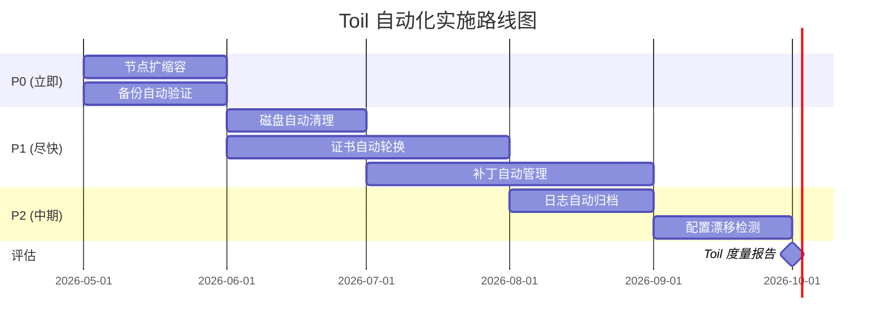

# Toil 削减与自动化

> **核心原则**: SRE 的目标不是消除所有运维工作，而是将工程师从重复性、无差异化的手工劳动中解放出来，让他们专注于高价值的工程工作。Toil 比例应控制在 50% 以下。

## 什么是 Toil

**Toil** = 重复性、可自动化的手工运维工作，与工程创新工作相对。

```
Toil 特征:
- 手工执行
- 重复发生
- 可自动化
- 无持久价值
- 随规模线性增长

示例:
✅ Toil: 手动重启问题 Pod、手工清理磁盘、手动扩容
❌ 非 Toil: 设计新架构、优化算法、编写自动化工具
```

### Toil 的五大特征 (Google SRE 定义)

| 特征 | 说明 | 判断标准 |
|------|------|---------|
| **重复性** | 同样或类似任务反复执行 | 过去 30 天内执行过 2 次以上 |
| **手工操作** | 需要人工干预，无法自动触发 | 必须登录系统执行命令或点击界面 |
| **可自动化** | 有明确的判断条件和执行步骤 | 可以写成 if-then 规则 |
| **无持久价值** | 完成后不会留下长期改进 | 下次同样问题仍需同样操作 |
| **线性增长** | 工作量随服务/用户/集群规模增长 | 节点翻倍 → 工作量翻倍 |

### Toil 与非 Toil 的对比

| 活动 | 类型 | 原因 |
|------|------|------|
| 手动修复磁盘满的节点 | Toil | 重复、可自动清理 |
| 响应告警并执行 Runbook | Toil | 可自动化为自愈系统 |
| 手动为新服务配置监控 | Toil | 可模板化/自动化 |
| 排查未知根因的问题 | 非 Toil | 需要创造性分析 |
| 设计新的灾备架构 | 非 Toil | 战略性工程工作 |
| 编写自动化工具 | 非 Toil | 消除未来的 Toil |
| 容量规划分析 | 非 Toil | 需要判断力，非纯重复 |
| 面试和团队建设 | 非 Toil | 人员发展 |

## Toil 识别方法论

### 时间追踪法

```
实施步骤:
1. 每位工程师连续记录 2 周的工作内容 (15 分钟粒度)
2. 标记每项任务为 Toil 或非 Toil
3. 按类别汇总时间占比

记录模板:
  时间: 09:00-09:30
  活动: 处理磁盘满告警，清理 /var/log
  类型: Toil
  频率: 每周 2-3 次
  是否可自动化: 是
```

### 工单分析法

```
分析过去 30-90 天的运维工单/工单:

分类统计:
  - 重启服务: 45 张 → Toil
  - 清理磁盘: 32 张 → Toil
  - 扩容节点: 18 张 → Toil
  - 证书续期: 12 张 → Toil
  - 安全漏洞修复: 8 张 → 部分 Toil
  - 问题根因分析: 5 张 → 非 Toil

Toil 占比 = (Toil 工单数 / 总工单数) × 100%
```

### 系统扫描法

```bash
# 扫描过去 30 天的告警，识别高频重复问题
kubectl logs -n monitoring alertmanager-xxx | \
  grep " firing" | \
  awk '{print $NF}' | \
  sort | uniq -c | sort -rn | head -20

# 扫描 SSH 登录记录，识别频繁手动介入的节点
last | grep "$(date +%b)" | awk '{print $1, $3}' | sort | uniq -c | sort -rn

# 扫描 CronJob 手动执行记录
kubectl get events --all-namespaces | grep "manual" | wc -l
```

### Toil 热力图

```
按任务类型 × 频率矩阵识别 Toil:

                低频(月)  中频(周)  高频(日)
重启服务            ░        ▓        █
清理磁盘            ░        ▓        █
扩容节点            ░        ░        ▓
证书续期            █        ░        ░
配置变更            ░        ▓        ░
数据备份            ░        ░        █
日志归档            ░        ░        ▓
补丁更新            ░        █        ░

█ = 高优先级自动化  ▓ = 中优先级  ░ = 低优先级/观察
```

## Toil 度量指标和计算公式

### 核心度量指标

```
Toil 比例 = Toil 时间 / 总工作时间 × 100%

目标: Toil 比例 < 50%
  - Google SRE 推荐: 每位工程师 Toil < 50%
  - 理想状态: Toil < 25%，让工程师有时间做项目工作

Toil 自动化率 = 已自动化的 Toil / 总 Toil × 100%

目标: 持续提高自动化率
  - 年初: 30%
  - 年末目标: 70%
```

### 详细计算公式

```
1. 个人 Toil 比例
   Toil% = Σ(每项 Toil 任务耗时) / 每周总工时 × 100%

2. 团队 Toil 比例
   TeamToil% = Σ(所有成员 Toil 时间) / Σ(所有成员总工时) × 100%

3. Toil 频率指数
   TFI = Σ(任务频率 × 平均耗时 × 影响范围)
   高 TFI = 高优先级自动化

4. Toil 成本
   ToilCost = Toil 工时 × 工程师时薪 × 12 个月
   示例: 10 人 × 20% Toil × ¥500/时 × 2080 小时 = ¥2,080,000/年

5. 自动化 ROI
   ROI = (ToilCost_自动化的 - 开发自动化成本) / 开发自动化成本
   ROI > 3 的自动化应优先实施
```

### Toil 度量仪表盘

```promql
# 以下为概念性指标，实际需通过工单/时间追踪系统收集

# 1. 每周 Toil 工单数量 (需从 Jira/ServiceNow 导出)
# 2. 平均工单处理时间
# 3. 重复工单比例
# 4. 自动化覆盖的告警比例

# 可通过监控系统度量的近似 Toil 指标:

# 手动重启次数 (通过 Pod restart 事件推断)
sum(increase(kube_pod_container_status_restarts_total[7d]))

# 节点 NotReady 后手动恢复次数
# (需配合事件日志或自定义 exporter)

# 手动扩容触发次数 (与 HPA 触发对比)
# (需记录非 HPA 触发的扩容操作)
```

### Toil 度量报告模板

```yaml
# 月度 Toil 报告
report_period: 2026-05

summary:
  total_engineers: 12
  total_hours: 4992  # 12 人 × 4 周 × 104 小时
  toil_hours: 1872
  toil_percentage: 37.5%
  target: < 50%
  status: 🟡 警告

top_toil_sources:
  - category: 磁盘清理
    hours: 320
    percentage: 17.1%
    automation_status: 已规划
    
  - category: Pod 重启
    hours: 280
    percentage: 15.0%
    automation_status: 部分自动化
    
  - category: 证书续期
    hours: 240
    percentage: 12.8%
    automation_status: 未开始
    
  - category: 节点扩容
    hours: 200
    percentage: 10.7%
    automation_status: 已自动化 (CA)

automation_progress:
  - area: 节点扩缩容
    before: 15%
    after: 85%
    effort_hours: 80
    savings_hours_per_month: 45
    
  - area: 备份管理
    before: 10%
    after: 95%
    effort_hours: 60
    savings_hours_per_month: 38
```

## 自动化优先级矩阵

### 影响 × 频率矩阵

```
          低频率          中频率          高频率
        ┌─────────┬─────────┬─────────┐
  高影响 │   P2    │   P1    │   P0    │
        │ 中期规划 │ 尽快实施 │ 立即实施 │
        ├─────────┼─────────┼─────────┤
  中影响 │   P3    │   P2    │   P1    │
        │  backlog │ 中期规划 │ 尽快实施 │
        ├─────────┼─────────┼─────────┤
  低影响 │   P4    │   P3    │   P2    │
        │  观察   │  backlog │ 中期规划 │
        └─────────┴─────────┴─────────┘
```

### 优先级评估表

| 任务 | 频率 | 影响 | 耗时/次 | 优先级 | 预期 ROI |
|------|------|------|---------|--------|---------|
| 节点自动扩缩容 | 每日 | 高 | 30 min | P0 | 10× |
| 磁盘自动清理 | 每周 | 中 | 15 min | P1 | 8× |
| 证书自动轮换 | 每季 | 高 | 2 小时 | P1 | 6× |
| 日志自动归档 | 每日 | 低 | 10 min | P2 | 5× |
| 补丁自动管理 | 每月 | 高 | 4 小时 | P1 | 7× |
| 备份自动验证 | 每日 | 高 | 20 min | P0 | 9× |
| Pod 自动重启 | 每日 | 中 | 5 min | P1 | 4× |
| 配置漂移检测 | 每周 | 中 | 30 min | P2 | 5× |

### 自动化实施路线图



## K8s 运维场景自动化方案

### 场景 1: 节点自动扩缩容

**问题描述**: 集群资源不足时需要手动添加节点，资源闲置时又不及时释放。

**Toil 特征**:
- 频率: 每周 2-3 次 (高峰期)
- 耗时: 30-60 分钟/次
- 线性增长: 集群越多，操作越频繁

**自动化方案: Cluster Autoscaler**

```yaml
# cluster-autoscaler-deployment.yaml
apiVersion: apps/v1
kind: Deployment
metadata:
  name: cluster-autoscaler
  namespace: kube-system
spec:
  replicas: 1
  selector:
    matchLabels:
      app: cluster-autoscaler
  template:
    metadata:
      labels:
        app: cluster-autoscaler
    spec:
      containers:
        - name: cluster-autoscaler
          image: registry.k8s.io/autoscaling/cluster-autoscaler:v1.29.0
          command:
            - ./cluster-autoscaler
            - --cloud-provider=aws
            - --node-group-auto-discovery=asg:tag=k8s.io/cluster-autoscaler/enabled,k8s.io/cluster-autoscaler/<cluster-name>
            - --balance-similar-node-groups=true
            - --skip-nodes-with-system-pods=false
            - --skip-nodes-with-local-storage=false
            - --scale-down-delay-after-add=10m
            - --scale-down-unneeded-time=10m
            - --scale-down-utilization-threshold=0.5
          resources:
            requests:
              cpu: 100m
              memory: 300Mi
            limits:
              cpu: 1000m
              memory: 1000Mi
```

**扩缩容策略配置**:

```yaml
# 工作负载级扩缩容配置
apiVersion: autoscaling/v2
kind: HorizontalPodAutoscaler
metadata:
  name: order-service-hpa
spec:
  scaleTargetRef:
    apiVersion: apps/v1
    kind: Deployment
    name: order-service
  minReplicas: 3
  maxReplicas: 50
  metrics:
    - type: Resource
      resource:
        name: cpu
        target:
          type: Utilization
          averageUtilization: 70
    - type: Resource
      resource:
        name: memory
        target:
          type: Utilization
          averageUtilization: 80
  behavior:
    scaleUp:
      stabilizationWindowSeconds: 60
      policies:
        - type: Percent
          value: 100
          periodSeconds: 60
    scaleDown:
      stabilizationWindowSeconds: 300
      policies:
        - type: Percent
          value: 10
          periodSeconds: 60
```

**工具推荐**:

| 工具 | 场景 | 特点 |
|------|------|------|
| **Cluster Autoscaler** | 标准 K8s 集群 | 社区标准，云厂商支持 |
| **Karpenter** | AWS EKS | 更快速的节点供给，灵活实例类型 |
| **Cluster API** | 多集群/混合云 | 跨云统一管理 |
| **[[Virtual Kubelet|Virtual Kubelet]]et|Kubelet]]** | 突发流量 | 无缝扩展到 Serverless |

**自动化效果度量**:
```promql
# 手动扩容次数 (识别未通过 CA 的扩容)
# 标记为非 CA 触发的节点添加事件

# CA 扩容成功率
ca_node_group_nodes{state="ready"} / ca_node_group_min_nodes

# 资源利用率优化效果
avg(node_cpu_utilization) before CA vs after CA
```

### 场景 2: 证书自动轮换

**问题描述**: [[Kubernetes|Kubernetes]] 集群涉及大量证书 (API Server、[[etcd|etcd]]、Ingress TLS、Service Account)，手动跟踪和续期容易遗漏，导致服务中断。

**Toil 特征**:
- 频率: 每 3-12 个月 (不同证书不同)
- 耗时: 2-4 小时/次
- 风险: 遗漏导致服务中断

**自动化方案: cert-manager**

```yaml
# cert-manager 安装
# kubectl apply -f https://github.com/cert-manager/cert-manager/releases/download/v1.14.0/cert-manager.yaml

# ClusterIssuer (Let's Encrypt)
apiVersion: cert-manager.io/v1
kind: ClusterIssuer
metadata:
  name: letsencrypt-prod
spec:
  acme:
    server: https://acme-v02.api.letsencrypt.org/directory
    email: sre@company.com
    privateKeySecretRef:
      name: letsencrypt-prod
    solvers:
      - http01:
          ingress:
            class: nginx
      - dns01:
          route53:
            region: us-east-1
            hostedZoneID: Z123456789
---
# 证书资源
apiVersion: cert-manager.io/v1
kind: Certificate
metadata:
  name: api-tls
  namespace: default
spec:
  secretName: api-tls-secret
  issuerRef:
    name: letsencrypt-prod
    kind: ClusterIssuer
  dnsNames:
    - api.company.com
    - api.internal.company.com
  renewBefore: 720h  # 30 天前开始续期
  duration: 2160h    # 90 天有效期
```

**K8s 内部证书轮换**:

```bash
#!/bin/bash
# k8s-certs-auto-renew.sh
# kubeadm 集群证书自动轮换

EXPIRY_THRESHOLD_DAYS=30

# 检查证书过期时间
check_certs() {
    kubeadm certs check-expiration | awk '/CERTIFICATE/ {getline; print}' | while read line; do
        CERT_NAME=$(echo $line | awk '{print $1}')
        EXPIRES=$(echo $line | awk '{print $2}')
        DAYS_LEFT=$(echo $line | awk '{print $3}')
        
        if [ "$DAYS_LEFT" -lt "$EXPIRY_THRESHOLD_DAYS" ]; then
            echo "⚠️ $CERT_NAME 将在 $DAYS_LEFT 天后过期"
            return 1
        fi
    done
}

# 自动续期 (仅控制平面证书)
renew_certs() {
    echo "🔄 开始证书续期..."
    kubeadm certs renew all
    
    # 重启控制平面组件
    echo "🔄 重启控制平面..."
    crictl pods --namespace kube-system | grep -E 'kube-apiserver|kube-controller-manager|kube-scheduler|etcd' | awk '{print $1}' | xargs -I {} crictl stopp {} && crictl rmp {}
    
    # 更新 kubeconfig
    cp /etc/kubernetes/admin.conf ~/.kube/config
    
    echo "✅ 证书续期完成"
}

# 主逻辑
if ! check_certs; then
    renew_certs
fi
```

**证书监控告警**:

```yaml
# PrometheusRule
groups:
  - name: certificate-alerts
    rules:
      - alert: CertificateExpiringSoon
        expr: |
          (certmanager_certificate_expiration_timestamp_seconds - time()) / 86400 < 30
        for: 1h
        labels:
          severity: warning
        annotations:
          summary: "证书即将过期"
          description: "证书 {{ $labels.name }} 将在 {{ $value | humanizeDuration }} 后过期"

      - alert: CertificateExpired
        expr: |
          certmanager_certificate_expiration_timestamp_seconds - time() < 0
        for: 1m
        labels:
          severity: critical
        annotations:
          summary: "证书已过期"

      - alert: CertificateRenewalFailed
        expr: |
          certmanager_certificate_ready_status{condition="False"} == 1
        for: 5m
        labels:
          severity: critical
        annotations:
          summary: "证书续期失败"
```

**工具推荐**:

| 工具 | 证书类型 | 特点 |
|------|---------|------|
| **cert-manager** | Ingress TLS、内部证书 | K8s 原生，ACME 支持 |
| **kubeadm** | K8s 控制平面证书 | 内置 renew 命令 |
| **Vault** | 内部服务证书 | 动态证书，自动轮换 |
| **AWS ACM** | AWS 负载均衡证书 | 全自动，无需管理 |
| **Google CAS** | GCP 证书 | 与 GKE 深度集成 |

### 场景 3: 自动备份

**问题描述**: etcd 数据、PVC、应用配置需要定期备份，手动备份容易遗漏、不一致或无法验证恢复。

**Toil 特征**:
- 频率: 每日/每周
- 耗时: 30-60 分钟/次
- 风险: 备份失败未被发现，恢复时不可用

**自动化方案: Velero + etcd 自动备份**

```yaml
# Velero 安装
# velero install \
#   --provider aws \
#   --bucket k8s-backups \
#   --backup-location-config region=us-east-1 \
#   --snapshot-location-config region=us-east-1 \
#   --secret-file ./credentials

# 定时备份 Schedule
apiVersion: velero.io/v1
kind: Schedule
metadata:
  name: daily-cluster-backup
  namespace: velero
spec:
  schedule: "0 2 * * *"  # 每天凌晨 2 点
  template:
    includedNamespaces:
      - "*"
    excludedNamespaces:
      - kube-system
      - velero
      - monitoring
    includedResources:
      - "*"
    excludedResources:
      - events
      - pods  # 通常不备份 Pod，由 Deployment 重建
    labelSelector:
      matchExpressions:
        - key: backup.velero.io/exclude
          operator: DoesNotExist
    snapshotVolumes: true
    ttl: 720h0m0s  # 保留 30 天
    storageLocation: default
---
# 关键命名空间高频率备份
apiVersion: velero.io/v1
kind: Schedule
metadata:
  name: hourly-critical-backup
  namespace: velero
spec:
  schedule: "0 * * * *"
  template:
    includedNamespaces:
      - production
      - payment
    snapshotVolumes: true
    ttl: 168h0m0s  # 保留 7 天
```

**etcd 自动备份脚本**:

```bash
#!/bin/bash
# etcd-autobackup.sh

ETCD_ENDPOINTS="https://127.0.0.1:2379"
ETCD_CERT="/etc/kubernetes/pki/etcd/server.crt"
ETCD_KEY="/etc/kubernetes/pki/etcd/server.key"
ETCD_CA="/etc/kubernetes/pki/etcd/ca.crt"
BACKUP_DIR="/backup/etcd"
S3_BUCKET="s3://company-k8s-backups/etcd"
RETENTION_DAYS=30

DATE=$(date +%Y%m%d-%H%M%S)
BACKUP_FILE="$BACKUP_DIR/etcd-snapshot-$DATE.db"

# 创建备份
echo "📦 创建 etcd 快照..."
ETCDCTL_API=3 etcdctl snapshot save $BACKUP_FILE \
  --endpoints=$ETCD_ENDPOINTS \
  --cert=$ETCD_CERT \
  --key=$ETCD_KEY \
  --cacert=$ETCD_CA

if [ $? -ne 0 ]; then
    echo "❌ 备份失败"
    exit 1
fi

# 验证备份
echo "✅ 验证备份完整性..."
ETCDCTL_API=3 etcdctl snapshot status $BACKUP_FILE

# 上传至 S3
echo "☁️ 上传至 S3..."
aws s3 cp $BACKUP_FILE $S3_BUCKET/

# 清理本地旧备份
find $BACKUP_DIR -name "etcd-snapshot-*.db" -mtime +$RETENTION_DAYS -delete

# 清理 S3 旧备份
aws s3 ls $S3_BUCKET/ | awk '{print $4}' | sort | head -n -$RETENTION_DAYS | \
  xargs -I {} aws s3 rm $S3_BUCKET/{}

echo "✅ 备份完成: $BACKUP_FILE"
```

**备份验证自动化 (备份恢复测试)**:

```yaml
# CronJob: 每周执行一次恢复验证
apiVersion: batch/v1
kind: CronJob
metadata:
  name: backup-restore-test
  namespace: velero
spec:
  schedule: "0 3 * * 0"  # 每周日凌晨 3 点
  jobTemplate:
    spec:
      template:
        spec:
          containers:
            - name: restore-test
              image: velero/velero:v1.13.0
              command:
                - /bin/sh
                - -c
                - |
                  echo "🧪 开始备份恢复测试..."
                  
                  # 1. 获取最新备份
                  LATEST_BACKUP=$(velero backup get | grep completed | head -1 | awk '{print $1}')
                  echo "最新备份: $LATEST_BACKUP"
                  
                  # 2. 创建恢复到测试命名空间
                  velero restore create test-restore-$LATEST_BACKUP \
                    --from-backup $LATEST_BACKUP \
                    --namespace-mappings production:test-restore \
                    --wait
                  
                  # 3. 验证关键资源
                  kubectl get all -n test-restore
                  
                  # 4. 运行 smoke test
                  kubectl run smoke-test -n test-restore --image=curlimages/curl \
                    --rm --restart=Never -- curl -s http://app:8080/health
                  
                  # 5. 清理测试资源
                  velero restore delete test-restore-$LATEST_BACKUP --confirm
                  kubectl delete namespace test-restore --ignore-not-found
                  
                  echo "✅ 恢复测试完成"
          restartPolicy: OnFailure
```

**备份监控告警**:

```promql
# 备份失败告警
velero_backup_failure_total > 0

# 备份超过 24 小时未完成
time() - velero_backup_last_successful_timestamp > 86400

# 备份大小异常下降 (可能遗漏数据)
velero_backup_tarball_size_bytes / velero_backup_tarball_size_bytes offset 1d < 0.5
```

**工具推荐**:

| 工具 | 备份范围 | 特点 |
|------|---------|------|
| **Velero** | 集群资源 + PVC | 社区标准，支持跨集群恢复 |
| **etcd snapshot** | etcd 数据 | K8s 原生，恢复控制平面 |
| **Stash** | 应用数据 | 支持多种后端，定时策略丰富 |
| **Longhorn** | 存储卷 | 内置备份，增量快照 |
| **AWS EBS Snapshot** | EBS 卷 | 云原生，与 AWS 集成 |

### 场景 4: 日志自动清理

**问题描述**: 容器日志、系统日志、审计日志持续增长，磁盘满导致 Pod 驱逐和服务中断。手工清理耗时且容易误删。

**Toil 特征**:
- 频率: 每周 2-3 次
- 耗时: 15-30 分钟/次
- 线性增长: 节点越多，日志量越大

**自动化方案: 日志轮转 + 清理策略**

```yaml
# logrotate 配置 (节点级)
# /etc/logrotate.d/container-logs
/var/log/containers/*.log {
    daily
    rotate 7
    compress
    delaycompress
    missingok
    notifempty
    create 0644 root root
    sharedscripts
    postrotate
        /bin/kill -HUP $(cat /var/run/rsyslogd.pid 2> /dev/null) 2> /dev/null || true
    endscript
}

/var/log/pods/*/*/*.log {
    size 100M
    rotate 5
    compress
    missingok
    notifempty
}
```

**容器运行时日志限制**:

```yaml
# containerd 配置
# /etc/containerd/config.toml
[plugins."io.containerd.grpc.v1.cri"]
  [plugins."io.containerd.grpc.v1.cri".containerd]
    [plugins."io.containerd.grpc.v1.cri".containerd.default_runtime]
      [plugins."io.containerd.grpc.v1.cri".containerd.default_runtime.options]
        # 日志配置
        SystemdCgroup = true

# 或使用 kubelet 参数
# /var/lib/kubelet/config.yaml
containerLogMaxSize: 50Mi
containerLogMaxFiles: 5
```

**kubelet 配置**:

```yaml
# kubelet 日志清理配置
apiVersion: kubelet.config.k8s.io/v1beta1
kind: KubeletConfiguration
containerLogMaxSize: 50Mi       # 单个容器日志文件最大 50MB
containerLogMaxFiles: 5          # 保留 5 个轮转文件
```

**Fluent Bit 日志归档与清理**:

```yaml
# fluent-bit-config.yaml
apiVersion: v1
kind: ConfigMap
metadata:
  name: fluent-bit-config
data:
  fluent-bit.conf: |
    [INPUT]
        Name              tail
        Tag               kube.*
        Path              /var/log/containers/*.log
        Parser            docker
        Refresh_Interval  5
        Mem_Buf_Limit     50MB
        Skip_Long_Lines   On
        DB                /fluent-bit/tail.db

    [FILTER]
        Name              kubernetes
        Match             kube.*
        Kube_URL          https://kubernetes.default.svc:443
        Merge_Log         On

    [FILTER]
        Name              grep
        Match             kube.*
        Exclude           kubernetes.namespace_name kube-system
        Exclude           kubernetes.namespace_name monitoring
        # 只保留应用日志，排除系统日志

    [OUTPUT]
        Name              s3
        Match             kube.*
        bucket            company-k8s-logs
        region            us-east-1
        total_file_size   100M
        s3_key_format     /$TAG[2]/$TAG[0]/%Y/%m/%d/%H/%M/$UUID.gz
        store_dir         /fluent-bit/s3-buffer
        compression       gzip
        upload_timeout    10m

    # 本地日志 TTL 清理
    [OUTPUT]
        Name              null
        Match             kube.*
        # 发送到 S3 后本地不保留
```

**磁盘空间监控与自动清理 CronJob**:

```yaml
apiVersion: batch/v1
kind: CronJob
metadata:
  name: disk-cleanup
  namespace: kube-system
spec:
  schedule: "0 */6 * * *"  # 每 6 小时
  jobTemplate:
    spec:
      template:
        spec:
          hostNetwork: true
          hostPID: true
          containers:
            - name: cleanup
              image: alpine:3.19
              command:
                - /bin/sh
                - -c
                - |
                  echo "🧹 开始磁盘清理..."
                  
                  # 清理已退出的容器
                  echo "清理已退出容器..."
                  crictl ps -a | grep Exited | awk '{print $1}' | xargs -r crictl rm
                  
                  # 清理未使用的镜像
                  echo "清理未使用镜像..."
                  crictl images | grep '<none>' | awk '{print $3}' | xargs -r crictl rmi
                  
                  # 清理超过 7 天的日志
                  echo "清理旧日志..."
                  find /var/log -name "*.log.*" -mtime +7 -delete
                  find /var/log/pods -name "*.log" -mtime +3 -delete
                  
                  # 清理临时文件
                  find /tmp -type f -mtime +1 -delete
                  
                  echo "✅ 磁盘清理完成"
                  df -h /
              securityContext:
                privileged: true
              volumeMounts:
                - name: varlog
                  mountPath: /var/log
                - name: tmp
                  mountPath: /tmp
                - name: crictl
                  mountPath: /usr/local/bin/crictl
          volumes:
            - name: varlog
              hostPath:
                path: /var/log
            - name: tmp
              hostPath:
                path: /tmp
            - name: crictl
              hostPath:
                path: /usr/local/bin/crictl
          restartPolicy: OnFailure
```

**磁盘告警规则**:

```yaml
groups:
  - name: disk-cleanup
    rules:
      - alert: NodeDiskPressure
        expr: |
          (
            node_filesystem_avail_bytes{mountpoint="/"}
            /
            node_filesystem_size_bytes{mountpoint="/"}
          ) < 0.15
        for: 5m
        labels:
          severity: warning
        annotations:
          summary: "节点磁盘空间不足"
          
      - alert: NodeDiskPressureCritical
        expr: |
          (
            node_filesystem_avail_bytes{mountpoint="/"}
            /
            node_filesystem_size_bytes{mountpoint="/"}
          ) < 0.10
        for: 2m
        labels:
          severity: critical
        annotations:
          summary: "节点磁盘即将耗尽"
          runbook_url: "https://wiki/runbooks/disk-cleanup"
```

**工具推荐**:

| 工具 | 功能 | 特点 |
|------|------|------|
| **logrotate** | 本地日志轮转 | 系统标配，无依赖 |
| **Fluent Bit** | 日志采集归档 | 轻量高效，多输出 |
| **Loki** | 日志存储 | 标签索引，与 Grafana 集成 |
| **kubelet** | 容器日志限制 | 原生支持，配置简单 |
| **CronJob** | 定时清理 | K8s 原生，灵活调度 |

### 场景 5: 补丁自动管理

**问题描述**: 操作系统、容器镜像、K8s 组件需要持续打补丁以修复安全漏洞。手动跟踪 CVE、测试补丁、滚动更新耗时且容易遗漏。

**Toil 特征**:
- 频率: 每月 1-4 次 (取决于漏洞公告)
- 耗时: 4-8 小时/轮
- 风险: 遗漏高危 CVE，手动更新引发问题

**自动化方案: Kured + 镜像重建 + 滚动更新**

```yaml
# Kured (KUbernetes REboot Daemon) - 节点自动重启
apiVersion: apps/v1
kind: DaemonSet
metadata:
  name: kured
  namespace: kube-system
spec:
  selector:
    matchLabels:
      name: kured
  template:
    metadata:
      labels:
        name: kured
    spec:
      containers:
        - name: kured
          image: ghcr.io/kubereboot/kured:1.15.0
          imagePullPolicy: IfNotPresent
          securityContext:
            privileged: true
          env:
            - name: KURED_LOCK_TTL
              value: "30m"
            - name: KURED_REBOOT_SENTINEL
              value: "/var/run/reboot-required"
            - name: KURED_START_TIME
              value: "02:00"
            - name: KURED_END_TIME
              value: "06:00"
            - name: KURED_TIME_ZONE
              value: "Asia/Shanghai"
            - name: KURED_DRAIN_GRACE_PERIOD
              value: "60"
            - name: KURED_PERIOD
              value: "1h"
          volumeMounts:
            - name: sentinel
              mountPath: /var/run
              readOnly: true
      volumes:
        - name: sentinel
          hostPath:
            path: /var/run
```

**镜像自动重建流水线**:

```yaml
# .github/workflows/image-rebuild.yaml
name: Security Patch Rebuild
on:
  schedule:
    - cron: '0 1 * * 1'  # 每周一凌晨
  workflow_dispatch:

jobs:
  scan-and-rebuild:
    runs-on: ubuntu-latest
    steps:
      - uses: actions/checkout@v4

      - name: Scan Base Images
        id: scan
        uses: aquasecurity/trivy-action@master
        with:
          image-ref: 'company/base-image:latest'
          format: 'json'
          output: 'scan-results.json'

      - name: Check Critical CVEs
        run: |
          CRITICAL_COUNT=$(jq '.Results[].Vulnerabilities[] | select(.Severity=="CRITICAL") | .VulnerabilityID' scan-results.json | wc -l)
          echo "critical_count=$CRITICAL_COUNT" >> $GITHUB_OUTPUT
          
          if [ "$CRITICAL_COUNT" -gt 0 ]; then
            echo "🚨 发现 $CRITICAL_COUNT 个 CRITICAL CVE"
            echo "rebuild_needed=true" >> $GITHUB_OUTPUT
          else
            echo "✅ 无 CRITICAL CVE"
            echo "rebuild_needed=false" >> $GITHUB_OUTPUT
          fi

      - name: Rebuild Base Image
        if: steps.scan.outputs.rebuild_needed == 'true'
        run: |
          docker build -t company/base-image:${{ github.run_number }} .
          docker push company/base-image:${{ github.run_number }}

      - name: Trigger App Rebuilds
        if: steps.scan.outputs.rebuild_needed == 'true'
        run: |
          # 触发依赖此基础镜像的所有应用重建
          for repo in app1 app2 app3; do
            curl -X POST \
              -H "Authorization: token ${{ secrets.GH_TOKEN }}" \
              -H "Accept: application/vnd.github.v3+json" \
              https://api.github.com/repos/company/$repo/actions/workflows/build.yaml/dispatches \
              -d '{"ref":"main","inputs":{"base_image_tag":"${{ github.run_number }}"}}'
          done

  rolling-update:
    needs: scan-and-rebuild
    runs-on: ubuntu-latest
    steps:
      - name: Update Image Tags
        run: |
          # 使用 GitOps 更新镜像标签
          git clone https://github.com/company/gitops-repo.git
          cd gitops-repo
          
          # 更新所有使用该基础镜像的应用
          find . -name "*.yaml" -exec sed -i 's/base-image:old/base-image:${{ github.run_number }}/g' {} \;
          
          git add .
          git commit -m "security: rebuild images for CVE fixes"
          git push

      - name: Verify Rollout
        run: |
          kubectl rollout status deployment/app1 -n production --timeout=600s
          kubectl rollout status deployment/app2 -n production --timeout=600s
```

**节点镜像自动更新 (Managed Node Groups / Cluster API)**:

```yaml
# EKS Managed Node Group 自动更新
apiVersion: eksctl.io/v1alpha5
kind: ClusterConfig
metadata:
  name: production
  region: us-east-1

managedNodeGroups:
  - name: workers
    instanceType: m6i.xlarge
    desiredCapacity: 3
    minSize: 2
    maxSize: 10
    
    # 自动更新配置
    updateConfig:
      maxUnavailable: 1  # 滚动更新时最多 1 个节点不可用
    
    # 使用最新 AMI
    amiFamily: AmazonLinux2
    
    # 标签触发更新
    labels:
      node-update-policy: automatic
```

**漏洞跟踪与优先级**:

```yaml
# 漏洞管理策略
vulnerability_management:
  scanning:
    frequency: daily
    tools:
      - Trivy (镜像扫描)
      - Snyk (依赖扫描)
      - kube-bench (K8s CIS 基线)
      
  severity_response:
    CRITICAL:
      sla: 24 小时
      action: 立即重建镜像 + 紧急发布
      approval: VP 审批
      
    HIGH:
      sla: 7 天
      action: 纳入下周发布计划
      approval: TL 审批
      
    MEDIUM:
      sla: 30 天
      action: 纳入常规补丁周期
      approval: 常规审批
      
    LOW:
      sla: 90 天
      action: 观察，必要时修复
      approval: 无需审批
```

**补丁管理监控**:

```promql
# 存在漏洞的镜像数量
sum(trivy_image_vulnerabilities{severity="CRITICAL"}) by (image)

# 节点内核版本分布 (识别未更新节点)
count by (kernel_version) (node_uname_info)

# 镜像年龄 (超过 30 天的镜像)
time() - container_image_build_timestamp > 30 * 86400
```

**工具推荐**:

| 工具 | 功能 | 特点 |
|------|------|------|
| **Kured** | 节点安全重启 | 自动 drain + reboot |
| **Trivy** | 镜像漏洞扫描 | 快速，数据库自动更新 |
| **Snyk** | 依赖 + 镜像扫描 | IDE 集成，PR 检查 |
| **Renovate** | 依赖自动更新 | 自动生成 PR |
| **kube-bench** | K8s 安全基线 | CIS 合规检查 |
| **Falco** | 运行时安全 | 检测异常行为 |
| **AWS SSM** | 托管节点补丁 | 与 EC2 深度集成 |

## 自动化成熟度模型

```
Level 1 - 手工 (Manual)
  特征: 所有操作手工执行
  Toil 比例: > 70%
  指标: 工单驱动，无自动化工具

Level 2 - 脚本化 (Scripted)
  特征: 有脚本辅助，但仍需人工触发
  Toil 比例: 50-70%
  指标: Runbook + 脚本，人工执行

Level 3 - 自动化 (Automated)
  特征: 定时任务自动执行常规操作
  Toil 比例: 25-50%
  指标: CronJob + CI/CD，异常需人工处理

Level 4 - 自治 (Autonomous)
  特征: 系统自愈，人工仅处理未知问题
  Toil 比例: < 25%
  指标: 自动检测 + 自动修复 + 自动验证

Level 5 - 自优化 (Self-Optimizing)
  特征: 系统持续自我改进
  Toil 比例: < 10%
  指标: ML 驱动的预测 + 主动优化
```

## 相关

- domain-07-platform-engineering/02-platform-ops/01-platform-capabilities-map
