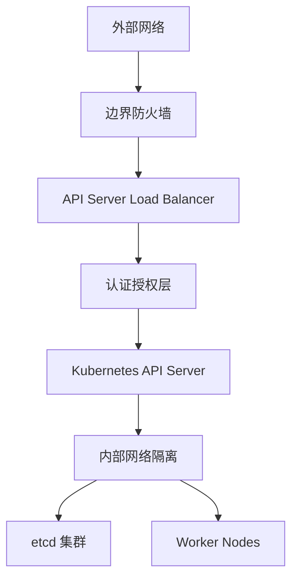

# Kubernetes 集群部署架构模式指南

## 概述

本文档详细阐述 Kubernetes 集群的各种部署架构模式，涵盖从小规模开发环境到大规模生产环境的完整部署方案，提供架构设计原则、部署策略和技术选型指导。

---

## 一、部署架构设计原则

### 1.1 核心设计原则

#### 高可用性原则 (High Availability)
```yaml
# 控制平面高可用架构
control_plane:
  etcd:
    nodes: 3-5  # 奇数个节点确保选举
    storage: ssd_local
    backup: automated
  
  apiserver:
    replicas: 3+
    load_balancer: external_lb
    health_check: tcp_6443
  
  controller_manager:
    replicas: 2+
    leader_election: enabled
    
  scheduler:
    replicas: 2+
    leader_election: enabled
```

#### 可扩展性原则 (Scalability)
- **水平扩展**: 通过增加节点实现线性扩展
- **垂直扩展**: 单节点资源配置提升
- **组件解耦**: 微服务化架构便于独立扩展

#### 安全性原则 (Security)


### 1.2 部署模式分类维度

| 分类维度 | 模式类型 | 适用场景 | 复杂度 |
|---------|---------|---------|--------|
| 规模大小 | 小型(1-10节点) | 开发测试 | 低 |
| | 中型(10-100节点) | 生产环境 | 中 |
| | 大型(100+节点) | 企业级 | 高 |
| 部署方式 | 托管服务 | 快速上线 | 低 |
| | 自建集群 | 完全控制 | 高 |
| 网络架构 | 扁平网络 | 简单场景 | 低 |
| | 多租户网络 | 复杂环境 | 高 |

---

## 二、典型部署架构模式

### 2.1 开发测试环境模式

#### 单节点 All-in-One 模式
```bash
# Minikube 部署方案
minikube start \
  --driver=docker \
  --cpus=4 \
  --memory=8192 \
  --disk-size=50g \
  --addons=dashboard,ingress,metrics-server

# Kind (Kubernetes in Docker) 方案
kind create cluster --name dev-cluster --config=kind-config.yaml
```

```yaml
# kind-config.yaml
kind: Cluster
apiVersion: kind.x-k8s.io/v1alpha4
nodes:
- role: control-plane
  kubeadmConfigPatches:
  - |
    kind: InitConfiguration
    nodeRegistration:
      kubeletExtraArgs:
        node-labels: "ingress-ready=true"
  extraPortMappings:
  - containerPort: 80
    hostPort: 80
    protocol: TCP
  - containerPort: 443
    hostPort: 443
    protocol: TCP
```

#### 多节点开发集群
```yaml
# kubeadm 开发集群配置
apiVersion: kubeadm.k8s.io/v1beta3
kind: ClusterConfiguration
kubernetesVersion: v1.28.0
controlPlaneEndpoint: "dev-k8s.example.com:6443"
networking:
  podSubnet: "10.244.0.0/16"
  serviceSubnet: "10.96.0.0/12"
apiServer:
  certSANs:
  - "dev-k8s.example.com"
  - "localhost"
  - "127.0.0.1"
controllerManager:
  extraArgs:
    bind-address: "0.0.0.0"
scheduler:
  extraArgs:
    bind-address: "0.0.0.0"
```

### 2.2 生产环境标准模式

#### 高可用控制平面架构
```yaml
# HA 控制平面配置
etcd:
  hosts:
    - etcd-1.prod.internal:2379
    - etcd-2.prod.internal:2379
    - etcd-3.prod.internal:2379
  backup:
    schedule: "0 2 * * *"  # 每天凌晨2点备份
    retention: "7d"        # 保留7天

control_plane:
  masters:
    - master-1.prod.internal
    - master-2.prod.internal
    - master-3.prod.internal
  load_balancer:
    vip: "10.0.0.100"
    ports:
      - 6443  # kube-apiserver
      - 2379  # etcd client
```

#### 网络架构设计
```bash
# CNI 网络插件选型矩阵
┌─────────────┬──────────┬──────────┬──────────┬──────────┐
│ 场景需求    │ Calico   │ Cilium   │ Flannel  │ Weave    │
├─────────────┼──────────┼──────────┼──────────┼──────────┤
│ 网络策略    │ ✅ 强    │ ✅ 最强  │ ❌ 不支持│ ✅ 支持  │
│ 性能        │ ⭐⭐⭐⭐   │ ⭐⭐⭐⭐⭐  │ ⭐⭐⭐⭐⭐  │ ⭐⭐⭐     │
│ eBPF 支持   │ ✅       │ ✅ 完善  │ ❌       │ ❌       │
│ 可观察性    │ ⭐⭐⭐     │ ⭐⭐⭐⭐⭐  │ ⭐⭐       │ ⭐⭐⭐     │
│ 多云支持    │ ⭐⭐⭐⭐   │ ⭐⭐⭐⭐⭐  │ ⭐⭐⭐⭐⭐  │ ⭐⭐⭐⭐   │
└─────────────┴──────────┴──────────┴──────────┴──────────┘
```

### 2.3 企业级多区域部署模式

#### 多区域高可用架构
```yaml
# 多区域集群配置
regions:
  primary:
    name: us-east-1
    zones: [us-east-1a, us-east-1b, us-east-1c]
    control_plane: 3
    worker_nodes: 10
    
  secondary:
    name: us-west-2
    zones: [us-west-2a, us-west-2b, us-west-2c]
    control_plane: 3
    worker_nodes: 8
    
  disaster_recovery:
    name: eu-central-1
    zones: [eu-central-1a, eu-central-1b]
    control_plane: 0  # 热备模式
    worker_nodes: 5

inter_region_connectivity:
  vpn: ipsec_tunnel
  latency_requirement: "<50ms"
  bandwidth: "1Gbps+"
```

#### 跨区域服务发现
```yaml
# Multi-Cluster Service 配置
apiVersion: multicluster.x-k8s.io/v1alpha1
kind: ServiceExport
metadata:
  name: my-service
  namespace: production
spec: {}

apiVersion: multicluster.x-k8s.io/v1alpha1
kind: ServiceImport
metadata:
  name: my-service-global
  namespace: production
spec:
  type: ClusterSetIP
  ports:
  - name: http
    protocol: TCP
    port: 80
```

### 2.4 边缘计算部署模式

#### KubeEdge 架构
```yaml
# 边缘节点配置
cloud:
  kubernetes_master: "cloud-k8s.example.com"
  edge_controller: 
    replicas: 2
    node_selector:
      node-role.kubernetes.io/control-plane: ""

edge:
  nodes:
    - name: edge-site-1
      location: beijing
      connectivity: intermittent
      storage: local_ssd
      
    - name: edge-site-2
      location: shanghai
      connectivity: stable
      storage: nfs_shared

edge_sync:
  mode: "message_queue"  # MQTT/Kafka
  sync_frequency: "30s"
  offline_buffer: "1000msgs"
```

#### 资源约束优化
```yaml
# 边缘节点资源配置
apiVersion: v1
kind: Node
metadata:
  labels:
    node-role.kubernetes.io/edge: ""
    kubernetes.io/arch: arm64
spec:
  taints:
  - key: node-role.kubernetes.io/edge
    effect: NoSchedule
  capacity:
    cpu: "4"
    memory: "8Gi"
    pods: "30"
```

---

## 三、基础设施集成模式

### 3.1 云原生部署方案

#### AWS EKS 部署架构
```yaml
# Terraform EKS 模块配置
module "eks" {
  source  = "terraform-aws-modules/eks/aws"
  version = "~> 19.0"
  
  cluster_name    = "production-cluster"
  cluster_version = "1.28"
  
  vpc_id          = module.vpc.vpc_id
  subnet_ids      = module.vpc.private_subnets
  
  eks_managed_node_groups = {
    general = {
      desired_size = 3
      min_size     = 2
      max_size     = 10
      instance_types = ["m5.large", "m5.xlarge"]
    }
    
    spot = {
      desired_size   = 2
      capacity_type  = "SPOT"
      instance_types = ["m5.large"]
    }
  }
}
```

#### Google GKE 配置
```bash
# GKE Autopilot 集群创建
gcloud container clusters create-auto production-cluster \
  --region=us-central1 \
  --release-channel=regular \
  --enable-ip-alias \
  --enable-private-nodes \
  --master-ipv4-cidr=172.16.0.0/28 \
  --network=default \
  --subnetwork=default
```

### 3.2 混合云部署模式

#### 多云统一管理架构
```yaml
# Rancher 多云管理平台
rancher:
  server:
    replicas: 3
    persistence:
      size: "50Gi"
      
  managed_clusters:
    - name: aws-production
      provider: "amazon"
      credentials_secret: "aws-credentials"
      
    - name: azure-staging
      provider: "azure"
      credentials_secret: "azure-credentials"
      
    - name: on-premise-dev
      provider: "custom"
      import_yaml: "rancher-agent-import.yaml"

cluster_federation:
  name: "global-federation"
  members:
    - cluster_name: aws-production
      weight: 60
    - cluster_name: azure-staging
      weight: 30
    - cluster_name: on-premise-dev
      weight: 10
```

### 3.3 裸金属部署方案

#### MetalLB 负载均衡器
```yaml
# MetalLB 配置
apiVersion: metallb.io/v1beta1
kind: IPAddressPool
metadata:
  name: production-pool
  namespace: metallb-system
spec:
  addresses:
  - 192.168.1.100-192.168.1.150
  autoAssign: true

---
apiVersion: metallb.io/v1beta1
kind: L2Advertisement
metadata:
  name: production-advertisement
  namespace: metallb-system
spec:
  ipAddressPools:
  - production-pool
```

#### 存储集成方案
```yaml
# Rook Ceph 集群配置
apiVersion: ceph.rook.io/v1
kind: CephCluster
metadata:
  name: rook-ceph
  namespace: rook-ceph
spec:
  dataDirHostPath: /var/lib/rook
  mon:
    count: 3
    allowMultiplePerNode: false
  storage:
    useAllNodes: true
    useAllDevices: false
    deviceFilter: "^sd[b-d]"
    config:
      osdsPerDevice: "1"
```

---

## 四、安全加固部署模式

### 4.1 零信任网络架构

#### Istio Service Mesh 集成
```yaml
# Istio 安装配置
apiVersion: install.istio.io/v1alpha1
kind: IstioOperator
spec:
  profile: demo
  components:
    ingressGateways:
    - name: istio-ingressgateway
      enabled: true
      k8s:
        service:
          ports:
          - port: 80
            targetPort: 8080
            name: http2
          - port: 443
            targetPort: 8443
            name: https

  values:
    global:
      mtls:
        enabled: true
    gateways:
      istio-ingressgateway:
        autoscaleEnabled: true
        autoscaleMin: 2
```

#### 网络策略实施
```yaml
# 默认拒绝网络策略
apiVersion: networking.k8s.io/v1
kind: NetworkPolicy
metadata:
  name: default-deny-all
  namespace: production
spec:
  podSelector: {}
  policyTypes:
  - Ingress
  - Egress

---
# 允许 DNS 查询策略
apiVersion: networking.k8s.io/v1
kind: NetworkPolicy
metadata:
  name: allow-dns-access
  namespace: production
spec:
  podSelector:
    matchLabels: {}
  policyTypes:
  - Egress
  egress:
  - to:
    - namespaceSelector:
        matchLabels:
          name: kube-system
    ports:
    - protocol: UDP
      port: 53
```

### 4.2 身份认证与授权

#### OIDC 集成配置
```yaml
# API Server OIDC 配置
apiVersion: kubeadm.k8s.io/v1beta3
kind: ClusterConfiguration
apiServer:
  extraArgs:
    oidc-issuer-url: "https://dex.example.com"
    oidc-client-id: "kubernetes"
    oidc-username-claim: "email"
    oidc-groups-claim: "groups"
    oidc-ca-file: "/etc/kubernetes/pki/oidc-ca.crt"
```

#### RBAC 策略模板
```yaml
# 命名空间管理员角色
apiVersion: rbac.authorization.k8s.io/v1
kind: Role
metadata:
  namespace: production
  name: namespace-admin
rules:
- apiGroups: ["*"]
  resources: ["*"]
  verbs: ["*"]

---
apiVersion: rbac.authorization.k8s.io/v1
kind: RoleBinding
metadata:
  name: production-admins
  namespace: production
subjects:
- kind: Group
  name: "production-admins"
  apiGroup: rbac.authorization.k8s.io
roleRef:
  kind: Role
  name: namespace-admin
  apiGroup: rbac.authorization.k8s.io
```

---

## 五、监控与运维部署模式

### 5.1 可观测性栈部署

#### Prometheus Operator 配置
```yaml
# Prometheus 实例配置
apiVersion: monitoring.coreos.com/v1
kind: Prometheus
metadata:
  name: k8s-prometheus
  namespace: monitoring
spec:
  serviceAccountName: prometheus-k8s
  serviceMonitorSelector:
    matchLabels:
      team: frontend
  ruleSelector:
    matchLabels:
      role: alert-rules
  resources:
    requests:
      memory: 400Mi
  enableAdminAPI: false
```

#### Loki 日志收集架构
```yaml
# Loki 分布式部署
loki:
  auth_enabled: false
  server:
    http_listen_port: 3100
  ingester:
    lifecycler:
      address: 127.0.0.1
      ring:
        kvstore:
          store: inmemory
        replication_factor: 1
  schema_config:
    configs:
    - from: 2020-05-15
      store: boltdb
      object_store: filesystem
      schema: v11
      index:
        prefix: index_
        period: 168h
```

### 5.2 自动化运维模式

#### GitOps 部署流水线
```yaml
# ArgoCD 应用定义
apiVersion: argoproj.io/v1alpha1
kind: Application
metadata:
  name: production-app
  namespace: argocd
spec:
  project: production
  source:
    repoURL: https://github.com/company/manifests.git
    targetRevision: HEAD
    path: production/app
  destination:
    server: https://kubernetes.default.svc
    namespace: production
  syncPolicy:
    automated:
      prune: true
      selfHeal: true
    syncOptions:
    - CreateNamespace=true
```

#### Chaos Engineering 集成
```yaml
# Chaos Mesh 实验配置
apiVersion: chaos-mesh.org/v1alpha1
kind: PodChaos
metadata:
  name: pod-kill-example
  namespace: chaos-testing
spec:
  action: pod-kill
  mode: one
  selector:
    namespaces:
      - production
    labelSelectors:
      app: web-server
  scheduler:
    cron: "@every 10m"
```

---

## 六、成本优化部署策略

### 6.1 资源配额管理

#### 命名空间资源配额
```yaml
# 资源配额定义
apiVersion: v1
kind: ResourceQuota
metadata:
  name: compute-resources
  namespace: production
spec:
  hard:
    requests.cpu: "10"
    requests.memory: 20Gi
    limits.cpu: "20"
    limits.memory: 40Gi
    persistentvolumeclaims: "10"
    services.loadbalancers: "2"
```

#### LimitRange 配置
```yaml
# 默认资源限制
apiVersion: v1
kind: LimitRange
metadata:
  name: mem-limit-range
  namespace: production
spec:
  limits:
  - default:
      memory: 512Mi
    defaultRequest:
      memory: 256Mi
    type: Container
```

### 6.2 Spot 实例利用策略

#### 混合实例组配置
```yaml
# AWS Spot 实例组
nodeGroups:
- name: spot-worker-group
  instanceType: "m5.large"
  desiredCapacity: 5
  minSize: 3
  maxSize: 10
  spotInstance: true
  spotMaxPrice: "0.05"
  labels:
    lifecycle: spot
  taints:
  - key: spot
    value: "true"
    effect: NoSchedule
```

#### 工作负载容忍配置
```yaml
# Spot 实例容忍的应用部署
apiVersion: apps/v1
kind: Deployment
metadata:
  name: batch-processing
spec:
  template:
    spec:
      tolerations:
      - key: spot
        operator: Equal
        value: "true"
        effect: NoSchedule
      nodeSelector:
        lifecycle: spot
```

---