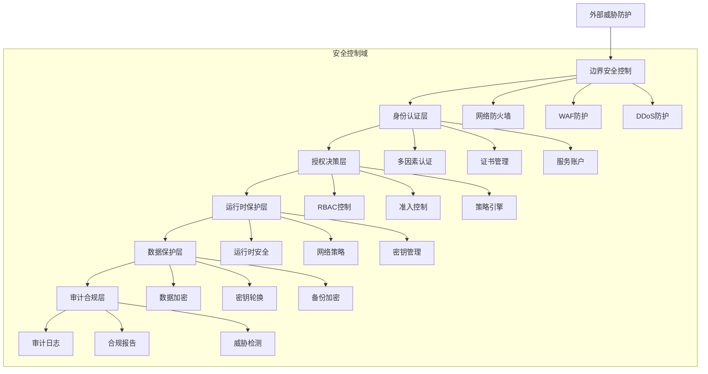
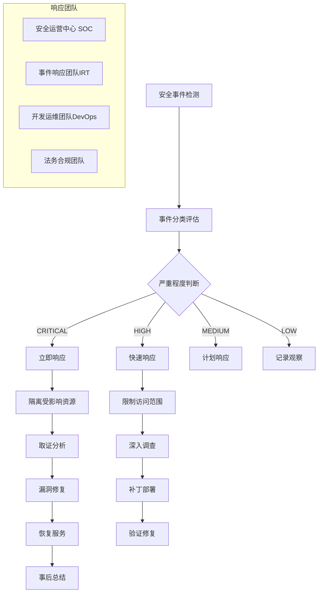

# Kubernetes 安全架构深度分析

## 概述

本文档深入分析 Kubernetes 安全架构的各个层面，涵盖身份认证、授权、网络安全、镜像安全等核心安全机制，提供企业级安全防护的最佳实践和实施指南。

---

## 一、安全架构总体设计

### 1.1 零信任安全模型

#### 安全架构分层视图


### 1.2 安全责任共担模型

#### 云服务商 vs 用户责任分工
```yaml
security_responsibility_model:
  cloud_provider:
    physical_security: ✅ 完全负责
    infrastructure: ✅ 完全负责
    hypervisor_security: ✅ 完全负责
    network_infrastructure: ✅ 完全负责
    etcd_encryption: ✅ 部分负责
    
  cluster_operator:
    kubernetes_configuration: ❌ 完全负责
    rbac_policies: ❌ 完全负责
    network_policies: ❌ 完全负责
    image_security: ❌ 完全负责
    application_security: ❌ 完全负责
    audit_compliance: ❌ 完全负责
```

---

## 二、身份认证与访问控制

### 2.1 多层次认证体系

#### 认证机制架构
```yaml
authentication_layers:
  external_access:
    mfa_required: true
    protocols:
      - openid_connect
      - saml
      - ldap
      
  cluster_internal:
    service_accounts: 
      token_ttl: "1h"
      automount_service_account_token: false
      
    certificates:
      client_cert_auth: true
      ca_rotation: "90d"
      
    bootstrap_tokens:
      expiration: "24h"
      usage: "node_join_only"
```

#### OpenID Connect 集成配置
```yaml
# API Server OIDC 配置
apiVersion: kubeadm.k8s.io/v1beta3
kind: ClusterConfiguration
apiServer:
  extraArgs:
    # OIDC 基础配置
    oidc-issuer-url: "https://dex.company.com"
    oidc-client-id: "kubernetes-cluster"
    oidc-username-claim: "email"
    oidc-groups-claim: "groups"
    oidc-ca-file: "/etc/kubernetes/pki/oidc-ca.crt"
    
    # 安全增强配置
    oidc-username-prefix: "oidc:"
    oidc-groups-prefix: "oidc:"
    oidc-required-claim: "aud:kubernetes-cluster"
    
    # 令牌验证配置
    oidc-signing-algs: "RS256,RS384,RS512"
    oidc-username-claim: "preferred_username"
```

### 2.2 细粒度授权控制

#### RBAC 策略设计
```yaml
# 分层 RBAC 策略架构
rbac_hierarchy:
  cluster_level:
    roles:
      - cluster-admin  # 集群管理员
      - cluster-reader # 集群只读
      - infra-admin    # 基础设施管理员
      
  namespace_level:
    roles:
      - namespace-admin  # 命名空间管理员
      - developer        # 开发者
      - viewer           # 查看者
      
  custom_roles:
    ci_cd_operator:
      apiGroups: [""]
      resources: ["pods", "services", "deployments"]
      verbs: ["get", "list", "watch", "create", "update", "patch"]
      
    security_auditor:
      apiGroups: [""]
      resources: ["events", "pods", "nodes"]
      verbs: ["get", "list", "watch"]
```

#### 动态权限管理
```yaml
# 基于属性的访问控制 (ABAC)
apiVersion: rbac.authorization.k8s.io/v1
kind: ClusterRole
metadata:
  name: dynamic-access-role
rules:
- apiGroups: [""]
  resources: ["pods"]
  verbs: ["get", "list"]
  resourceNames:
  - "{{.RequestObject.metadata.name}}"
  
---
# 时间窗口访问控制
apiVersion: policy/v1
kind: PodDisruptionBudget
metadata:
  name: time-based-access
spec:
  minAvailable: 1
  selector:
    matchLabels:
      security/time-window: "business-hours"
```

### 2.3 服务账户安全管理

#### 服务账户最佳实践
```yaml
# 安全的服务账户配置
apiVersion: v1
kind: ServiceAccount
metadata:
  name: secure-app-sa
  namespace: production
automountServiceAccountToken: false  # 禁用自动挂载

---
# 服务账户令牌投影
apiVersion: v1
kind: Pod
metadata:
  name: secure-pod
spec:
  serviceAccountName: secure-app-sa
  automountServiceAccountToken: false
  containers:
  - name: app
    image: secure-app:latest
    volumeMounts:
    - name: kube-api-access
      mountPath: /var/run/secrets/kubernetes.io/serviceaccount
      readOnly: true
  volumes:
  - name: kube-api-access
    projected:
      sources:
      - serviceAccountToken:
          expirationSeconds: 3600
          path: token
      - configMap:
          name: kube-root-ca.crt
          items:
          - key: ca.crt
            path: ca.crt
      - downwardAPI:
          items:
          - path: namespace
            fieldRef:
              fieldPath: metadata.namespace
```

---

## 三、网络安全防护体系

### 3.1 网络分段与隔离

#### 多层网络策略架构
```yaml
# 网络策略分层设计
network_isolation_layers:
  cluster_egress:
    policies:
      - allow_dns_queries
      - restrict_external_access
      - monitor_egress_traffic
      
  namespace_isolation:
    default_deny: true
    explicit_allow: 
      - intra_namespace_communication
      - required_service_dependencies
      
  pod_level_security:
    app_tiers:
      - frontend_pods
      - backend_pods
      - database_pods
    inter_tier_policies:
      - frontend_to_backend_only
      - backend_to_database_only
      - no_lateral_movement
```

#### 网络策略实施示例
```yaml
# 默认拒绝策略
apiVersion: networking.k8s.io/v1
kind: NetworkPolicy
metadata:
  name: default-deny-all
  namespace: production
spec:
  podSelector: {}
  policyTypes:
  - Ingress
  - Egress

---
# DNS 访问策略
apiVersion: networking.k8s.io/v1
kind: NetworkPolicy
metadata:
  name: allow-dns-access
  namespace: production
spec:
  podSelector: {}
  policyTypes:
  - Egress
  egress:
  - to:
    - namespaceSelector:
        matchLabels:
          name: kube-system
    ports:
    - protocol: UDP
      port: 53
    - protocol: TCP
      port: 53

---
# 应用间通信策略
apiVersion: networking.k8s.io/v1
kind: NetworkPolicy
metadata:
  name: backend-frontend-policy
  namespace: production
spec:
  podSelector:
    matchLabels:
      app: backend
  policyTypes:
  - Ingress
  ingress:
  - from:
    - podSelector:
        matchLabels:
          app: frontend
    ports:
    - protocol: TCP
      port: 8080
```

### 3.2 Service Mesh 安全增强

#### Istio 安全配置
```yaml
# Istio 安全策略
apiVersion: security.istio.io/v1beta1
kind: PeerAuthentication
metadata:
  name: default
  namespace: istio-system
spec:
  mtls:
    mode: STRICT  # 强制双向 TLS

---
# 授权策略
apiVersion: security.istio.io/v1beta1
kind: AuthorizationPolicy
metadata:
  name: frontend-backend-authz
  namespace: production
spec:
  selector:
    matchLabels:
      app: backend
  rules:
  - from:
    - source:
        principals: ["cluster.local/ns/production/sa/frontend"]
    to:
    - operation:
        methods: ["GET", "POST"]
        paths: ["/api/*"]
    when:
    - key: request.headers[x-forwarded-for]
      values: ["10.0.0.0/8"]
```

#### 证书管理自动化
```yaml
# Cert-Manager 配置
apiVersion: cert-manager.io/v1
kind: Certificate
metadata:
  name: production-cert
  namespace: production
spec:
  secretName: production-tls
  duration: 2160h  # 90天
  renewBefore: 360h  # 15天提前续签
  subject:
    organizations:
    - company-name
  commonName: "*.production.company.com"
  dnsNames:
  - "*.production.company.com"
  - "production.company.com"
  issuerRef:
    name: production-issuer
    kind: ClusterIssuer
```

### 3.3 网络入侵检测

#### Falco 规则配置
```yaml
# Falco 安全规则
- rule: Detect crypto miners
  desc: Detection of crypto mining activity
  condition: >
    spawned_process and proc.name in (xmrig, cgminer, ethminer) or
    (proc.name = "sh" and proc.args contains "stratum")
  output: >
    Crypto miner detected (user=%user.name command=%proc.cmdline pid=%proc.pid)
  priority: CRITICAL
  tags: [process, mitre_execution]

- rule: Detect port scanning
  desc: Detection of port scanning activity
  condition: >
    evt.type = connect and fd.sport > 1024 and fd.lport < 1024 and
    not proc.name in (sshd, kubelet, kube-proxy)
  output: >
    Port scan detected (connection=%fd.name user=%user.name process=%proc.name)
  priority: WARNING
  tags: [network, mitre_discovery]
```

---

## 四、镜像与运行时安全

### 4.1 容器镜像安全管控

#### 镜像扫描与验证
```yaml
# 镜像安全策略
image_security_policy:
  admission_control:
    required_signatures: true
    vulnerability_scanning: required
    base_image_verification: required
    
  registry_security:
    private_registry: true
    image_signature_validation: true
    vulnerability_scan_on_push: true
    
  runtime_enforcement:
    allowed_registries:
      - registry.company.com
      - registry.aliyuncs.com
    blocked_images:
      - latest_tag_not_allowed
      - unsigned_images_rejected
```

#### Trivy 镜像扫描配置
```yaml
# Trivy Operator 配置
apiVersion: aquasecurity.github.io/v1alpha1
kind: ClusterConfigAuditReport
metadata:
  name: cluster-config-audit
spec:
  scanInterval: "24h"
  reportFormat: "Table"
  severity: "HIGH,CRITICAL"
  
---
# 镜像扫描策略
apiVersion: image.toolkit.fluxcd.io/v1beta2
kind: ImageRepository
metadata:
  name: secure-app
  namespace: production
spec:
  image: registry.company.com/secure-app
  interval: 5m0s
  accessFrom:
    namespaceSelectors:
    - matchLabels:
        kubernetes.io/metadata.name: production
```

### 4.2 运行时安全防护

#### Pod 安全策略演进
```yaml
# Pod Security Admission 配置
apiVersion: apiserver.config.k8s.io/v1
kind: AdmissionConfiguration
plugins:
- name: PodSecurity
  configuration:
    defaults:
      enforce: "restricted"
      enforce-version: "latest"
      audit: "restricted"
      audit-version: "latest"
      warn: "restricted"
      warn-version: "latest"
    exemptions:
      usernames: []
      runtimeClasses: []
      namespaces: ["kube-system", "monitoring"]
```

#### 安全上下文配置
```yaml
# 安全强化的 Pod 配置
apiVersion: v1
kind: Pod
metadata:
  name: secure-pod
spec:
  securityContext:
    runAsNonRoot: true
    runAsUser: 1000
    runAsGroup: 3000
    fsGroup: 2000
    seccompProfile:
      type: RuntimeDefault
      
  containers:
  - name: app
    image: secure-app:latest
    securityContext:
      allowPrivilegeEscalation: false
      readOnlyRootFilesystem: true
      capabilities:
        drop:
        - ALL
        add:
        - NET_BIND_SERVICE
    volumeMounts:
    - name: tmp-volume
      mountPath: /tmp
    - name: logs-volume
      mountPath: /var/log
      
  volumes:
  - name: tmp-volume
    emptyDir: {}
  - name: logs-volume
    emptyDir: {}
```

### 4.3 密钥与敏感信息保护

#### Sealed Secrets 配置
```yaml
# 加密 Secret 管理
apiVersion: bitnami.com/v1alpha1
kind: SealedSecret
metadata:
  name: database-credentials
  namespace: production
spec:
  encryptedData:
    username: AgBy3i4OJSWK+PiTySYZZA9rO43cGDEq.....
    password: BGoqILkjN0CxFJqwhuk8NcbS1JXA.....
  template:
    metadata:
      name: database-credentials
      namespace: production
    type: Opaque
```

#### External Secrets Operator 集成
```yaml
# 外部密钥集成
apiVersion: external-secrets.io/v1beta1
kind: ExternalSecret
metadata:
  name: aws-credentials
  namespace: production
spec:
  refreshInterval: "1h"
  secretStoreRef:
    name: aws-secret-store
    kind: ClusterSecretStore
  target:
    name: aws-credentials
    creationPolicy: Owner
  data:
  - secretKey: access-key-id
    remoteRef:
      key: production/aws/credentials
      property: access_key_id
  - secretKey: secret-access-key
    remoteRef:
      key: production/aws/credentials
      property: secret_access_key
```

---

## 五、安全监控与威胁检测

### 5.1 安全日志聚合

#### 审计日志配置
```yaml
# API Server 审计策略
apiVersion: audit.k8s.io/v1
kind: Policy
rules:
# 忽略高频读操作
- level: None
  verbs: ["get", "list", "watch"]
  resources:
  - group: ""
    resources: ["pods", "services", "endpoints", "nodes"]

# 记录认证相关事件
- level: Metadata
  resources:
  - group: "authentication.k8s.io"
  - group: "authorization.k8s.io"

# 记录变更操作
- level: RequestResponse
  verbs: ["create", "update", "patch", "delete"]
  resources:
  - group: ""
    resources: ["pods", "services", "persistentvolumes", "namespaces"]
  - group: "apps"
    resources: ["deployments", "statefulsets", "daemonsets"]
  - group: "rbac.authorization.k8s.io"
    resources: ["roles", "rolebindings", "clusterroles", "clusterrolebindings"]

# 捕获安全敏感操作
- level: RequestResponse
  resources:
  - group: ""
    resources: ["secrets", "configmaps"]
  - group: "policy"
    resources: ["podsecuritypolicies"]
```

### 5.2 异常行为检测

#### 基于机器学习的安全分析
```python
# 异常检测算法示例
import numpy as np
from sklearn.ensemble import IsolationForest

class KubernetesAnomalyDetector:
    def __init__(self):
        self.model = IsolationForest(
            contamination=0.1,
            random_state=42
        )
        self.baseline_data = None
    
    def train_baseline(self, metrics_data):
        """训练基线模型"""
        self.baseline_data = metrics_data
        self.model.fit(metrics_data)
    
    def detect_anomalies(self, current_metrics):
        """检测异常行为"""
        anomalies = []
        predictions = self.model.predict(current_metrics)
        
        for i, prediction in enumerate(predictions):
            if prediction == -1:  # 异常
                anomaly_score = self.model.decision_function([current_metrics[i]])[0]
                anomalies.append({
                    'index': i,
                    'score': anomaly_score,
                    'metrics': current_metrics[i]
                })
        
        return anomalies

# 监控的关键指标
MONITORED_METRICS = [
    'pod_creation_rate',
    'container_restart_count',
    'network_bytes_transmitted',
    'cpu_usage_anomaly',
    'memory_usage_spike',
    'failed_authentication_attempts'
]
```

### 5.3 威胁情报集成

#### 威胁检测规则集
```yaml
# 威胁检测规则
threat_detection_rules:
  privilege_escalation:
    - rule: Unexpected privilege escalation
      condition: >
        container.security_context.privileged = true AND
        NOT container.image.trusted = true
      severity: HIGH
      
  credential_theft:
    - rule: Suspicious credential access
      condition: >
        process.name = "cat" AND
        file.path contains "/var/run/secrets"
      severity: CRITICAL
      
  lateral_movement:
    - rule: Unauthorized namespace access
      condition: >
        user.namespace != request.namespace AND
        NOT user.role = "cluster-admin"
      severity: HIGH
      
  data_exfiltration:
    - rule: Large data transfer outbound
      condition: >
        network.bytes_out > 100MB AND
        time.window = "1h"
      severity: MEDIUM
```

---

## 六、合规性与审计

### 6.1 合规框架映射

#### CIS Kubernetes Benchmark 映射
```yaml
cis_controls_mapping:
  control_1:  # Master Node Configuration Files
    kubernetes_components:
      - kube-apiserver.yaml
      - kube-controller-manager.yaml
      - kube-scheduler.yaml
      - etcd.yaml
    security_checks:
      - file_permissions: "644 or more restrictive"
      - file_ownership: "root:root"
      - encryption_at_rest: enabled
      
  control_2:  # API Server
    security_features:
      - anonymous_auth: disabled
      - basic_auth: disabled
      - token_auth: enabled
      - audit_log: configured
      - admission_controllers: enabled
      
  control_3:  # Controller Manager
    security_settings:
      - service_account_lookup: true
      - use_service_account_credentials: true
      - root_ca_file: configured
      - rotate_kubelet_server_certificate: true
```

### 6.2 自动化合规检查

#### 合规扫描脚本
```bash
#!/bin/bash
# k8s-security-audit.sh

echo "=== Kubernetes 安全合规检查报告 ==="
echo "检查时间: $(date)"
echo "集群版本: $(kubectl version --short | grep Server | cut -d: -f2)"

# 检查项 1: 匿名访问禁用
echo -e "\n--- 检查项 1: 匿名访问控制 ---"
if kubectl get pod -n kube-system -l component=kube-apiserver -o jsonpath='{.items[*].spec.containers[*].command}' | grep -q "anonymous-auth=false"; then
    echo "✅ 匿名访问已禁用"
else
    echo "❌ 匿名访问未禁用"
fi

# 检查项 2: RBAC 启用状态
echo -e "\n--- 检查项 2: RBAC 状态 ---"
if kubectl api-versions | grep -q "rbac.authorization.k8s.io"; then
    echo "✅ RBAC 已启用"
else
    echo "❌ RBAC 未启用"
fi

# 检查项 3: 网络策略默认拒绝
echo -e "\n--- 检查项 3: 网络策略 ---"
default_deny_count=$(kubectl get networkpolicies --all-namespaces -o jsonpath='{.items[*].spec.policyTypes}' | grep -c "Ingress\|Egress" || echo "0")
if [ "$default_deny_count" -gt 0 ]; then
    echo "✅ 检测到默认拒绝策略"
else
    echo "⚠️  未配置默认拒绝策略"
fi

# 检查项 4: 容器安全上下文
echo -e "\n--- 检查项 4: 容器安全配置 ---"
insecure_pods=$(kubectl get pods --all-namespaces -o jsonpath='{range .items[*]}{.metadata.namespace}/{.metadata.name}{"\n"}{end}' | \
    xargs -I {} kubectl get pod {} -o jsonpath='{.spec.containers[*].securityContext.runAsNonRoot}' | \
    grep -c "false\|<no value>" || echo "0")

if [ "$insecure_pods" -eq 0 ]; then
    echo "✅ 所有容器以非 root 运行"
else
    echo "❌ 发现 $insecure_pods 个容器以 root 运行"
fi

# 生成合规评分
total_checks=4
passed_checks=$(grep -c "✅" <<< "$(tail -n +10)") 
compliance_score=$(( passed_checks * 100 / total_checks ))

echo -e "\n=== 合规评分: ${compliance_score}% (${passed_checks}/${total_checks}) ==="
```

### 6.3 安全事件响应

#### 事件响应流程


#### 应急响应清单
```yaml
incident_response_playbook:
  immediate_actions:
    - isolate_affected_workloads: true
    - preserve_evidence: true
    - notify_stakeholders: true
    - activate_backup_systems: true
    
  investigation_steps:
    - timeline_analysis: "重建攻击时间线"
    - log_correlation: "关联多源日志"
    - forensic_imaging: "获取系统快照"
    - threat_intelligence: "匹配已知威胁"
    
  remediation_plan:
    - patch_vulnerabilities: "应用安全补丁"
    - rotate_credentials: "轮换受损凭证"
    - update_policies: "强化安全策略"
    - enhance_monitoring: "加强检测能力"
```

---

## 七、安全最佳实践总结

### 7.1 安全配置基线

#### 生产环境安全清单
- [ ] 启用并配置 RBAC
- [ ] 禁用匿名访问和基本认证
- [ ] 配置网络策略，默认拒绝
- [ ] 启用审计日志记录
- [ ] 实施 Pod 安全标准
- [ ] 配置准入控制器
- [ ] 启用 TLS 加密通信
- [ ] 定期轮换证书和密钥
- [ ] 实施镜像签名验证
- [ ] 部署运行时安全监控
- [ ] 建立安全事件响应流程
- [ ] 定期进行安全评估和渗透测试

### 7.2 持续安全改进

#### 安全成熟度模型
```yaml
security_maturity_levels:
  level_1_initial:
    characteristics:
      - reactive_security_approach
      - manual_processes
      - basic_access_controls
    goals:
      - establish_security_baselines
      - implement_basic_monitoring
      - create_incident_response_plan
      
  level_2_managed:
    characteristics:
      - proactive_threat_monitoring
      - automated_security_controls
      - regular_security_assessments
    goals:
      - achieve_compliance_certifications
      - implement_zero_trust_architecture
      - develop_security_automation
      
  level_3_optimized:
    characteristics:
      - predictive_threat_intelligence
      - ai_powered_security_analytics
      - continuous_security_optimization
    goals:
      - autonomous_security_operations
      - real_time_threat_neutralization
      - security_as_code_implementation
```

---