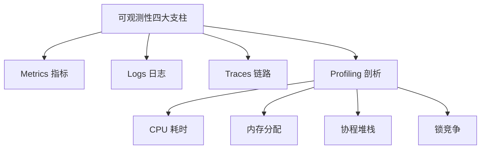
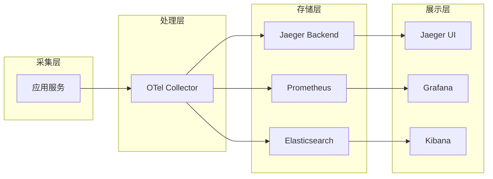
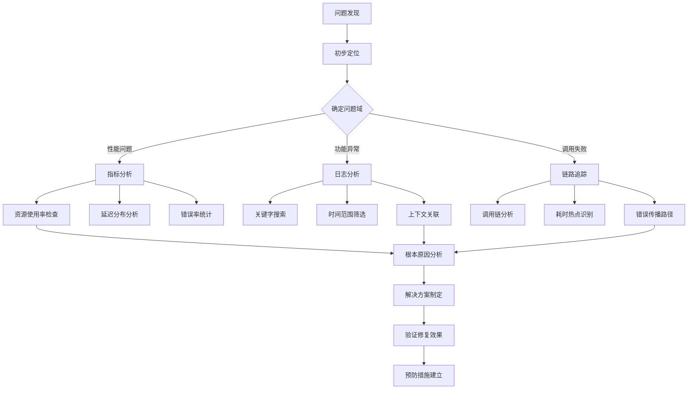

# 15 - Kubernetes 可观测性架构体系

## 概述

本文档全面阐述 Kubernetes 可观测性架构的设计理念、技术组件和实施策略，涵盖指标监控、日志收集、链路追踪和告警管理等核心领域，为企业构建完整的可观测性平台提供指导。

---

## 一、可观测性架构设计原则

### 1.1 四大支柱理论 (加持 Continuous Profiling)
现代 Kubernetes 可观测性已从“三大支柱”演进为“四大支柱”，引入了 **持续剖析 (Continuous Profiling)**。

#### 可观测性核心要素


#### 数据特征对比分析
```yaml
observability_data_characteristics:
  metrics:
    data_structure: time_series
    sampling_rate: high_frequency
    storage_efficiency: high
    query_complexity: low
    use_cases:
      - system_monitoring
      - capacity_planning
      - performance_benchmarking
      
  logs:
    data_structure: text_unstructured
    sampling_rate: event_driven
    storage_efficiency: medium
    query_complexity: high
    use_cases:
      - troubleshooting
      - security_auditing
      - compliance_reporting
      
  traces:
    data_structure: distributed_spans
    sampling_rate: selective_sampling
    storage_efficiency: low
    query_complexity: medium
    use_cases:
      - performance_analysis
      - dependency_mapping
      - error_diagnosis
```

### 1.2 架构设计原则

#### 统一数据平面
```yaml
unified_observability_plane:
  data_ingestion:
    standardized_formats: 
      - opentelemetry_protocol
      - prometheus_exposition
      - fluent_bit_forward
      
  data_processing:
    stream_processing: true
    batch_processing: true
    real_time_analytics: true
    
  data_storage:
    hot_storage: in_memory_timeseries
    warm_storage: columnar_database
    cold_storage: object_storage
    
  data_access:
    unified_query_interface: true
    multi_tenancy_support: true
    rbac_integration: true
```

---

## 二、指标监控体系架构

### 2.1 Prometheus 生态系统

#### 监控架构拓扑
```yaml
prometheus_monitoring_stack:
  data_collection:
    node_exporter:
      metrics: system_resources
      scrape_interval: 15s
      
    kube_state_metrics:
      metrics: kubernetes_objects
      scrape_interval: 30s
      
    cadvisor:
      metrics: container_resources
      scrape_interval: 15s
      
  data_storage:
    prometheus_server:
      retention: 15d
      storage_tsdb_retention: 15d
      wal_compression: true
      
  data_query:
    prometheus_ui: native_interface
    grafana: visualization_layer
    alertmanager: alert_routing
    
  federation:
    thanos_sidecar: long_term_storage
    thanos_querier: global_query
    thanos_store: object_storage_integration
```

#### Prometheus Operator 配置
```yaml
# Prometheus 实例配置
apiVersion: monitoring.coreos.com/v1
kind: Prometheus
metadata:
  name: observability-prometheus
  namespace: monitoring
spec:
  serviceAccountName: prometheus-k8s
  serviceMonitorSelector:
    matchLabels:
      team: sre
  ruleSelector:
    matchLabels:
      role: alert-rules
  resources:
    requests:
      memory: 2Gi
    limits:
      memory: 8Gi
  storage:
    volumeClaimTemplate:
      spec:
        storageClassName: fast-ssd
        resources:
          requests:
            storage: 100Gi
  retention: 30d
  walCompression: true
  enableAdminAPI: false
```

### 2.2 指标采集策略

#### ServiceMonitor 配置
```yaml
# 应用指标采集配置
apiVersion: monitoring.coreos.com/v1
kind: ServiceMonitor
metadata:
  name: application-metrics
  namespace: monitoring
  labels:
    team: application-team
spec:
  selector:
    matchLabels:
      app: web-application
  endpoints:
  - port: metrics
    path: /metrics
    interval: 30s
    scrapeTimeout: 10s
    relabelings:
    - sourceLabels: [__meta_kubernetes_pod_name]
      targetLabel: instance
    - sourceLabels: [__meta_kubernetes_namespace]
      targetLabel: namespace
    metricRelabelings:
    - sourceLabels: [__name__]
      regex: 'go_.*'
      action: drop
```

#### 自定义指标导出器
```yaml
# Redis Exporter 配置
apiVersion: apps/v1
kind: Deployment
metadata:
  name: redis-exporter
  namespace: monitoring
spec:
  replicas: 1
  selector:
    matchLabels:
      app: redis-exporter
  template:
    metadata:
      labels:
        app: redis-exporter
    spec:
      containers:
      - name: redis-exporter
        image: oliver006/redis_exporter:latest
        ports:
        - containerPort: 9121
        env:
        - name: REDIS_ADDR
          value: "redis://redis-master:6379"
        - name: REDIS_EXPORTER_WEB_LISTEN_ADDRESS
          value: ":9121"
---
apiVersion: v1
kind: Service
metadata:
  name: redis-exporter
  namespace: monitoring
  labels:
    app: redis-exporter
spec:
  ports:
  - port: 9121
    targetPort: 9121
  selector:
    app: redis-exporter
```

### 2.3 告警管理系统

#### Alertmanager 配置
```yaml
# Alertmanager 集群配置
apiVersion: monitoring.coreos.com/v1
kind: Alertmanager
metadata:
  name: observability-alertmanager
  namespace: monitoring
spec:
  replicas: 3
  retention: 120h
  externalUrl: "https://alertmanager.company.com"
  routePrefix: "/"
  securityContext:
    runAsNonRoot: true
    runAsUser: 65534
    runAsGroup: 65534
    fsGroup: 65534

---
# 告警路由规则
global:
  resolve_timeout: 5m
  smtp_from: 'alertmanager@company.com'
  smtp_smarthost: 'smtp.company.com:587'
  smtp_auth_username: 'alertmanager'
  smtp_auth_password: 'password'

route:
  group_by: ['alertname', 'job']
  group_wait: 30s
  group_interval: 5m
  repeat_interval: 3h
  receiver: 'default-receiver'
  routes:
  - match:
      severity: critical
    receiver: 'pagerduty'
    group_wait: 10s
  - match:
      severity: warning
    receiver: 'slack-warning'
  - match:
      team: sre
    receiver: 'sre-team'

receivers:
- name: 'default-receiver'
  email_configs:
  - to: 'team@company.com'
    send_resolved: true

- name: 'pagerduty'
  pagerduty_configs:
  - service_key: '<pagerduty_service_key>'
    send_resolved: true

- name: 'slack-warning'
  slack_configs:
  - api_url: '<slack_webhook_url>'
    channel: '#alerts-warning'
    send_resolved: true
    title: '{{ template "slack.warning.title" . }}'
    text: '{{ template "slack.warning.text" . }}'
```

---

## 三、日志收集与分析体系

### 3.1 统一日志架构

#### EFK 技术栈配置
```yaml
# Fluent Bit DaemonSet 配置
apiVersion: apps/v1
kind: DaemonSet
metadata:
  name: fluent-bit
  namespace: logging
  labels:
    k8s-app: fluent-bit-logging
spec:
  selector:
    matchLabels:
      k8s-app: fluent-bit-logging
  template:
    metadata:
      labels:
        k8s-app: fluent-bit-logging
    spec:
      serviceAccountName: fluent-bit
      containers:
      - name: fluent-bit
        image: fluent/fluent-bit:2.1
        ports:
        - containerPort: 2020
        env:
        - name: FLUENT_ELASTICSEARCH_HOST
          value: "elasticsearch.logging.svc"
        - name: FLUENT_ELASTICSEARCH_PORT
          value: "9200"
        volumeMounts:
        - name: varlog
          mountPath: /var/log
        - name: varlibdockercontainers
          mountPath: /var/lib/docker/containers
          readOnly: true
        - name: fluent-bit-config
          mountPath: /fluent-bit/etc/
      volumes:
      - name: varlog
        hostPath:
          path: /var/log
      - name: varlibdockercontainers
        hostPath:
          path: /var/lib/docker/containers
      - name: fluent-bit-config
        configMap:
          name: fluent-bit-config
```

#### Elasticsearch 集群配置
```yaml
# Elasticsearch StatefulSet
apiVersion: apps/v1
kind: StatefulSet
metadata:
  name: elasticsearch
  namespace: logging
spec:
  serviceName: elasticsearch
  replicas: 3
  selector:
    matchLabels:
      app: elasticsearch
  template:
    metadata:
      labels:
        app: elasticsearch
    spec:
      initContainers:
      - name: fix-permissions
        image: busybox
        command: ["sh", "-c", "chown -R 1000:1000 /usr/share/elasticsearch/data"]
        volumeMounts:
        - name: elasticsearch-data
          mountPath: /usr/share/elasticsearch/data
      containers:
      - name: elasticsearch
        image: docker.elastic.co/elasticsearch/elasticsearch:8.11.0
        env:
        - name: discovery.type
          value: "zen"
        - name: discovery.zen.minimum_master_nodes
          value: "2"
        - name: ES_JAVA_OPTS
          value: "-Xms2g -Xmx2g"
        ports:
        - containerPort: 9200
          name: http
        - containerPort: 9300
          name: transport
        volumeMounts:
        - name: elasticsearch-data
          mountPath: /usr/share/elasticsearch/data
  volumeClaimTemplates:
  - metadata:
      name: elasticsearch-data
    spec:
      accessModes: ["ReadWriteOnce"]
      storageClassName: fast-ssd
      resources:
        requests:
          storage: 100Gi
```

### 3.2 结构化日志处理

#### Logstash 配置管道
```ruby
# logstash.conf
input {
  beats {
    port => 5044
    ssl => true
    ssl_certificate => "/etc/pki/tls/certs/logstash.crt"
    ssl_key => "/etc/pki/tls/private/logstash.key"
  }
}

filter {
  # Kubernetes 元数据丰富
  if [kubernetes] {
    mutate {
      add_field => {
        "namespace" => "%{[kubernetes][namespace]}"
        "pod_name" => "%{[kubernetes][pod][name]}"
        "container_name" => "%{[kubernetes][container][name]}"
      }
    }
  }
  
  # JSON 解析应用日志
  json {
    source => "message"
    target => "parsed_message"
    skip_on_invalid_json => true
  }
  
  # 时间戳标准化
  date {
    match => [ "[parsed_message][timestamp]", "ISO8601" ]
    target => "@timestamp"
  }
  
  # 日志级别过滤
  if [parsed_message][level] {
    mutate {
      add_tag => [ "%{[parsed_message][level]}" ]
    }
  }
}

output {
  elasticsearch {
    hosts => ["elasticsearch.logging:9200"]
    index => "kubernetes-%{+YYYY.MM.dd}"
    document_type => "_doc"
  }
  
  # 告警输出
  if "ERROR" in [tags] {
    pagerduty {
      service_key => "${PAGERDUTY_SERVICE_KEY}"
      incident_key => "%{host}-%{[kubernetes][pod][name]}-%{+YYYY-MM-dd}"
      description => "Error in %{[kubernetes][pod][name]}"
      details => {
        "host" => "%{host}"
        "pod" => "%{[kubernetes][pod][name]}"
        "message" => "%{message}"
      }
    }
  }
}
```

### 3.3 日志查询优化

#### Elasticsearch 索引模板
```json
{
  "index_patterns": ["kubernetes-*"],
  "settings": {
    "number_of_shards": 3,
    "number_of_replicas": 1,
    "refresh_interval": "30s",
    "translog.durability": "async",
    "translog.sync_interval": "5s"
  },
  "mappings": {
    "properties": {
      "@timestamp": {
        "type": "date"
      },
      "level": {
        "type": "keyword"
      },
      "namespace": {
        "type": "keyword"
      },
      "pod_name": {
        "type": "keyword"
      },
      "container_name": {
        "type": "keyword"
      },
      "message": {
        "type": "text",
        "analyzer": "standard"
      },
      "parsed_message": {
        "type": "object",
        "enabled": false
      }
    }
  }
}
```

---

## 四、分布式链路追踪

### 4.1 OpenTelemetry 架构

#### 追踪数据流架构


#### OpenTelemetry Collector 配置
```yaml
# OTel Collector 配置
receivers:
  otlp:
    protocols:
      grpc:
        endpoint: 0.0.0.0:4317
      http:
        endpoint: 0.0.0.0:4318
        
  jaeger:
    protocols:
      thrift_http:
        endpoint: 0.0.0.0:14268
      grpc:
        endpoint: 0.0.0.0:14250

processors:
  batch:
    timeout: 5s
    send_batch_size: 8192
    
  memory_limiter:
    limit_mib: 400
    spike_limit_mib: 100
    
  attributes:
    actions:
      - key: environment
        value: production
        action: insert

exporters:
  jaeger:
    endpoint: jaeger-collector:14250
    tls:
      insecure: true
      
  prometheus:
    endpoint: "0.0.0.0:8889"
    namespace: otel
    
  elasticsearch:
    endpoints: ["https://elasticsearch:9200"]
    logs_index: traces-span
    traces_index: traces-span

service:
  pipelines:
    traces:
      receivers: [otlp, jaeger]
      processors: [memory_limiter, batch, attributes]
      exporters: [jaeger]
      
    metrics:
      receivers: [otlp]
      processors: [memory_limiter, batch]
      exporters: [prometheus]
      
    logs:
      receivers: [otlp]
      processors: [memory_limiter, batch]
      exporters: [elasticsearch]
```

### 4.2 应用追踪埋点

#### Go 应用追踪示例
```go
package main

import (
    "context"
    "net/http"
    "time"
    
    "go.opentelemetry.io/otel"
    "go.opentelemetry.io/otel/exporters/jaeger"
    "go.opentelemetry.io/otel/sdk/resource"
    sdktrace "go.opentelemetry.io/otel/sdk/trace"
    semconv "go.opentelemetry.io/otel/semconv/v1.12.0"
    "go.opentelemetry.io/otel/trace"
)

func initTracer() (*sdktrace.TracerProvider, error) {
    exp, err := jaeger.New(jaeger.WithCollectorEndpoint(
        jaeger.WithEndpoint("http://jaeger-collector:14268/api/traces"),
    ))
    if err != nil {
        return nil, err
    }
    
    tp := sdktrace.NewTracerProvider(
        sdktrace.WithBatcher(exp),
        sdktrace.WithResource(resource.NewWithAttributes(
            semconv.SchemaURL,
            semconv.ServiceNameKey.String("user-service"),
            semconv.DeploymentEnvironmentKey.String("production"),
        )),
    )
    
    otel.SetTracerProvider(tp)
    return tp, nil
}

func main() {
    tp, err := initTracer()
    if err != nil {
        panic(err)
    }
    defer func() { _ = tp.Shutdown(context.Background()) }()
    
    http.HandleFunc("/api/users", userHandler)
    http.ListenAndServe(":8080", nil)
}

func userHandler(w http.ResponseWriter, r *http.Request) {
    tracer := otel.Tracer("user-service")
    ctx, span := tracer.Start(r.Context(), "getUserHandler")
    defer span.End()
    
    // 添加属性
    span.SetAttributes(
        semconv.HTTPMethodKey.String(r.Method),
        semconv.HTTPURLKey.String(r.URL.String()),
    )
    
    // 模拟业务逻辑
    userInfo, err := getUserInfo(ctx, r.URL.Query().Get("id"))
    if err != nil {
        span.RecordError(err)
        span.SetStatus(codes.Error, err.Error())
        http.Error(w, err.Error(), http.StatusInternalServerError)
        return
    }
    
    // 添加事件
    span.AddEvent("user.info.retrieved", trace.WithAttributes(
        attribute.String("user.id", userInfo.ID),
        attribute.Int("user.age", userInfo.Age),
    ))
    
    w.WriteHeader(http.StatusOK)
    w.Write([]byte(userInfo.String()))
}

func getUserInfo(ctx context.Context, userID string) (*UserInfo, error) {
    _, span := otel.Tracer("user-service").Start(ctx, "getUserInfo")
    defer span.End()
    
    // 模拟数据库查询
    time.Sleep(50 * time.Millisecond)
    
    if userID == "" {
        return nil, errors.New("user id required")
    }
    
    return &UserInfo{
        ID:   userID,
        Name: "John Doe",
        Age:  30,
    }, nil
}
```

### 4.3 追踪数据分析

#### 追踪查询 DSL
```json
{
  "query": {
    "bool": {
      "must": [
        {
          "term": {
            "serviceName": "user-service"
          }
        },
        {
          "range": {
            "startTimeMillis": {
              "gte": "now-1h",
              "lt": "now"
            }
          }
        }
      ],
      "should": [
        {
          "term": {
            "status.code": "ERROR"
          }
        }
      ]
    }
  },
  "aggs": {
    "latency_stats": {
      "extended_stats": {
        "field": "durationMs"
      }
    },
    "error_rate": {
      "terms": {
        "field": "status.code"
      }
    },
    "top_operations": {
      "terms": {
        "field": "operationName",
        "size": 10
      }
    }
  },
  "size": 0
}
```

---

## 五、可观测性平台集成

### 5.1 Grafana 统一视图

#### 仪表板配置
```json
{
  "dashboard": {
    "id": null,
    "title": "Kubernetes Cluster Overview",
    "timezone": "browser",
    "schemaVersion": 36,
    "version": 1,
    "panels": [
      {
        "type": "graph",
        "title": "Cluster CPU Usage",
        "datasource": "Prometheus",
        "targets": [
          {
            "expr": "sum(rate(container_cpu_usage_seconds_total[5m])) by (namespace)",
            "legendFormat": "{{namespace}}",
            "refId": "A"
          }
        ]
      },
      {
        "type": "stat",
        "title": "Node Status",
        "datasource": "Prometheus",
        "targets": [
          {
            "expr": "sum(kube_node_status_condition{condition=\"Ready\",status=\"true\"})",
            "refId": "A"
          }
        ]
      }
    ]
  }
}
```

### 5.2 自动化告警规则

#### Prometheus 告警规则集
```yaml
# 核心告警规则
groups:
- name: kubernetes.system.alerts
  rules:
  - alert: HighCPUUsage
    expr: sum(rate(container_cpu_usage_seconds_total[5m])) by (namespace) > 0.8
    for: 5m
    labels:
      severity: warning
    annotations:
      summary: "High CPU usage detected in namespace {{ $labels.namespace }}"
      description: "CPU usage is above 80% for more than 5 minutes"

  - alert: PodCrashLooping
    expr: rate(kube_pod_container_status_restarts_total[5m]) > 0.1
    for: 10m
    labels:
      severity: critical
    annotations:
      summary: "Pod {{ $labels.pod }} is crash looping"
      description: "Container restart rate is abnormally high"

  - alert: PersistentVolumeFull
    expr: kubelet_volume_stats_available_bytes / kubelet_volume_stats_capacity_bytes < 0.1
    for: 5m
    labels:
      severity: critical
    annotations:
      summary: "PersistentVolume {{ $labels.persistentvolumeclaim }} is almost full"
      description: "Less than 10% space remaining"

- name: application.performance.alerts
  rules:
  - alert: HighRequestLatency
    expr: histogram_quantile(0.99, rate(http_request_duration_seconds_bucket[5m])) > 2
    for: 10m
    labels:
      severity: warning
    annotations:
      summary: "High request latency detected"
      description: "99th percentile request latency exceeded 2 seconds"

  - alert: HighErrorRate
    expr: sum(rate(http_requests_total{status=~"5.."}[5m])) / sum(rate(http_requests_total[5m])) > 0.05
    for: 5m
    labels:
      severity: critical
    annotations:
      summary: "High error rate in {{ $labels.handler }}"
      description: "Error rate exceeded 5% threshold"
```

### 5.3 SLO/SLI 管理

#### 服务质量指标定义
```yaml
# SLO 配置示例
slos:
  api_availability:
    objective: 99.9
    sli:
      good_events: sum(rate(http_requests_total{status!~"5.."}[30d]))
      total_events: sum(rate(http_requests_total[30d]))
    alerting:
      burn_rate_threshold: 14.4
      lookback_window: 1h
      alert_on_burn: true

  api_latency:
    objective: 95  # 95th percentile
    sli:
      latency_target: 1000  # ms
      good_events: sum(rate(http_request_duration_seconds_bucket{le="1.0"}[30d]))
      total_events: sum(rate(http_request_duration_seconds_count[30d]))
    alerting:
      burn_rate_threshold: 6
      lookback_window: 6h
      alert_on_burn: true

# 错误预算告警
error_budget_alerts:
  fast_burn:
    threshold: 14.4
    window: 1h
    action: immediate_page
    
  slow_burn:
    threshold: 1.2
    window: 24h
    action: ticket_create
```

---

## 六、可观测性最佳实践

### 6.1 数据治理策略

#### 数据生命周期管理
```yaml
data_retention_policy:
  metrics:
    high_precision: 7d    # 高精度指标
    medium_precision: 30d # 中等精度指标
    low_precision: 90d    # 低精度指标
    
  logs:
    raw_logs: 7d         # 原始日志
    parsed_logs: 30d     # 解析后日志
    archived_logs: 365d  # 归档日志
    
  traces:
    full_traces: 2d      # 完整链路
    sampled_traces: 7d   # 采样链路
    aggregated_data: 90d # 聚合数据

data_sampling_strategy:
  adaptive_sampling:
    target_traces_per_second: 1000
    adjust_frequency: 30s
    min_sampling_rate: 0.1
    max_sampling_rate: 1.0
    
  priority_based:
    critical_services: 1.0    # 100% 采样
    important_services: 0.5   # 50% 采样
    standard_services: 0.1    # 10% 采样
```

### 6.2 性能优化指南

#### 查询性能优化
```sql
-- 优化的 PromQL 查询示例
-- 避免高基数查询
rate(http_requests_total{job="api-server"}[5m])

-- 使用记录规则预计算
record: job:http_requests:rate5m
expr: sum(rate(http_requests_total[5m])) by (job)

-- 适当的聚合层级
sum by(namespace, pod) (
  rate(container_cpu_usage_seconds_total[5m])
)

-- 时间范围优化
increase(http_requests_total[1h])  # 而不是 [24h]
```

### 6.3 故障排除方法论

#### 系统性故障诊断流程


#### 常见问题排查清单
```bash
#!/bin/bash
# observability-debug-checklist.sh

echo "=== 可观测性系统健康检查 ==="

# 1. 检查监控组件状态
echo "1. 监控组件状态检查"
kubectl get pods -n monitoring -o wide

# 2. 检查指标采集状态
echo "2. 指标采集状态"
kubectl get servicemonitors -n monitoring
kubectl get prometheusrules -n monitoring

# 3. 检查日志收集状态
echo "3. 日志收集状态"
kubectl get daemonsets -n logging
kubectl logs -n logging daemonset/fluent-bit --tail=10

# 4. 检查追踪系统状态
echo "4. 追踪系统状态"
kubectl get deployments -n tracing
curl -s http://jaeger-query:16686/api/services | jq '.'

# 5. 验证告警配置
echo "5. 告警配置验证"
kubectl get alertmanagers -n monitoring
kubectl get prometheusrules -A | wc -l

# 6. 性能基准测试
echo "6. 系统性能基准"
kubectl exec -it prometheus-0 -n monitoring -- promtool check metrics
```

---

## 七、未来发展路线图

### 7.1 技术演进方向

#### 下一代可观测性技术
```yaml
future_technologies:
  aiops_integration:
    anomaly_detection: machine_learning_based
    predictive_analytics: time_series_forecasting
    automated_root_cause: causal_analysis
    
  streaming_analytics:
    real_time_processing: apache_flink_integration
    edge_computing: fog_analytics
    serverless_functions: event_driven_processing
    
  unified_standards:
    open_telemetry_maturity: full_specification_adoption
    vendor_neutral_interfaces: standardized_apis
    cross_platform_compatibility: multi_cloud_support
```

### 7.2 成熟度评估模型

#### 可观测性成熟度等级
```yaml
observability_maturity:
  level_1_reactive:
    characteristics:
      - manual_monitoring_setup
      - alert_storm_problem
      - post_incident_analysis
    metrics:
      mean_time_to_detect: ">60分钟"
      mean_time_to_resolve: ">4小时"
      
  level_2_proactive:
    characteristics:
      - automated_monitoring
      - structured_alerting
      - regular_slos_review
    metrics:
      mean_time_to_detect: "<15分钟"
      mean_time_to_resolve: "<2小时"
      
  level_3_predictive:
    characteristics:
      - ml_based_anomaly_detection
      - automated_incident_response
      - capacity_planning
    metrics:
      mean_time_to_detect: "<5分钟"
      mean_time_to_resolve: "<30分钟"
      
  level_4_autonomous:
    characteristics:
      - self_healing_systems
      - predictive_maintenance
      - business_impact_optimization
    metrics:
      mean_time_to_detect: "<1分钟"
      mean_time_to_resolve: "<5分钟"
```

---