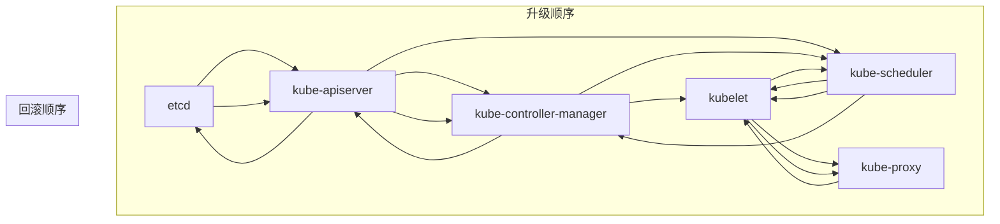

# Kubernetes 升级和迁移策略

## 概述

本文档详细阐述 Kubernetes 集群的升级策略、迁移方案和版本管理最佳实践，涵盖从版本规划到回滚恢复的完整生命周期管理，确保集群升级过程的安全性和可靠性。

---

## 一、版本管理策略

### 1.1 版本支持生命周期

#### Kubernetes 版本支持策略
```yaml
version_support_policy:
  current_version: "v1.28.x"
  supported_versions:
    - "v1.28.x"  # 当前稳定版
    - "v1.27.x"  # 上一稳定版
    - "v1.26.x"  # 再上一稳定版
  
  upgrade_windows:
    minor_version_upgrade: "每季度一次"
    patch_version_upgrade: "每月一次"
    emergency_patches: "随时发布"
  
  deprecation_timeline:
    alpha_features: "不稳定，随时可能移除"
    beta_features: "至少支持3个版本"
    stable_features: "长期支持，移除前提前通知"
```

#### 版本兼容性矩阵
```bash
# Kubernetes 版本兼容性检查脚本
#!/bin/bash

CURRENT_VERSION="v1.28.0"
TARGET_VERSION="v1.29.0"

# API 版本兼容性检查
check_api_compatibility() {
    echo "检查 API 版本兼容性..."
    
    # 检查已弃用的 API
    deprecated_apis=$(kubectl api-resources --verbs=list -o name | \
        xargs -I {} kubectl get {} --all-namespaces --ignore-not-found 2>/dev/null | \
        grep -E "(v1beta1|v1beta2)" | wc -l)
    
    if [ "$deprecated_apis" -gt 0 ]; then
        echo "⚠️  发现 $deprecated_apis 个使用已弃用 API 的资源"
        return 1
    fi
    
    echo "✅ API 兼容性检查通过"
    return 0
}

# 自定义资源兼容性检查
check_crds_compatibility() {
    echo "检查自定义资源定义兼容性..."
    
    crds=$(kubectl get crds -o jsonpath='{.items[*].metadata.name}')
    for crd in $crds; do
        version_supported=$(kubectl explain $crd --recursive | \
            grep -c "$TARGET_VERSION" || echo "0")
        if [ "$version_supported" -eq 0 ]; then
            echo "❌ CRD $crd 可能不兼容目标版本"
        fi
    done
}
```

### 1.2 升级路径规划

#### 版本跳跃限制
```yaml
upgrade_path_constraints:
  major_version_jumps: forbidden  # 禁止跨大版本升级
  minor_version_jumps: 
    maximum: 2                     # 最多跳过2个小版本
    recommended: 1                 # 推荐逐版本升级
  
  patch_version_jumps: unlimited   # 补丁版本可直接升级

safe_upgrade_paths:
  v1.26.x → v1.27.x → v1.28.x: ✅ 推荐路径
  v1.26.x → v1.28.x: ⚠️  需谨慎评估
  v1.25.x → v1.28.x: ❌ 不推荐，风险较高
```

---

## 二、升级前准备

### 2.1 环境评估与备份

#### 升级前健康检查清单
```yaml
pre_upgrade_checklist:
  cluster_health:
    - control_plane_status: healthy
    - node_status: all_ready
    - pod_status: no_crashlooping
    - storage_status: healthy_pvcs
    
  resource_capacity:
    - cpu_reservation: "<80%"
    - memory_reservation: "<80%"
    - disk_space: ">20% free"
    - etcd_space: ">10% free"
    
  backup_requirements:
    - etcd_snapshot: complete
    - cluster_state: exported
    - application_data: backed_up
    - configuration_files: archived
```

#### 自动化健康检查脚本
```bash
#!/bin/bash
# pre-upgrade-health-check.sh

CLUSTER_NAME="production-cluster"
BACKUP_DIR="/backup/${CLUSTER_NAME}/$(date +%Y%m%d_%H%M%S)"

# 创建备份目录
mkdir -p $BACKUP_DIR

echo "=== Kubernetes 升级前健康检查 ==="

# 1. 集群状态检查
echo "1. 检查集群控制平面状态"
control_plane_healthy=true
for component in kube-apiserver kube-controller-manager kube-scheduler; do
    ready_pods=$(kubectl get pods -n kube-system -l component=$component \
        -o jsonpath='{.items[*].status.conditions[?(@.type=="Ready")].status}' | \
        tr ' ' '\n' | grep -c True)
    total_pods=$(kubectl get pods -n kube-system -l component=$component --no-headers | wc -l)
    
    if [ "$ready_pods" -ne "$total_pods" ]; then
        echo "❌ $component 不健康: $ready_pods/$total_pods 准备就绪"
        control_plane_healthy=false
    else
        echo "✅ $component 健康: $ready_pods/$total_pods 准备就绪"
    fi
done

# 2. 节点状态检查
echo "2. 检查节点状态"
not_ready_nodes=$(kubectl get nodes --no-headers | awk '$2 != "Ready" {print $1}')
if [ -n "$not_ready_nodes" ]; then
    echo "❌ 以下节点未就绪:"
    echo "$not_ready_nodes"
    exit 1
else
    echo "✅ 所有节点状态正常"
fi

# 3. 资源使用率检查
echo "3. 检查资源使用率"
high_usage_resources=$(kubectl top nodes | awk 'NR>1 {if($2+0 > 80 || $4+0 > 80) print $1}')
if [ -n "$high_usage_resources" ]; then
    echo "⚠️  以下节点资源使用率超过80%:"
    echo "$high_usage_resources"
else
    echo "✅ 资源使用率正常"
fi

# 4. 执行 etcd 备份
echo "4. 执行 etcd 备份"
ETCD_POD=$(kubectl get pod -n kube-system -l component=etcd -o jsonpath='{.items[0].metadata.name}')
kubectl exec -n kube-system $ETCD_POD -- \
    etcdctl snapshot save /tmp/etcd-snapshot.db \
    --endpoints=https://127.0.0.1:2379 \
    --cacert=/etc/kubernetes/pki/etcd/ca.crt \
    --cert=/etc/kubernetes/pki/etcd/server.crt \
    --key=/etc/kubernetes/pki/etcd/server.key

kubectl cp kube-system/$ETCD_POD:/tmp/etcd-snapshot.db $BACKUP_DIR/etcd-snapshot.db

# 5. 备份关键配置
echo "5. 备份关键配置"
kubectl get -A all -o yaml > $BACKUP_DIR/all-resources.yaml
kubectl get -A secrets -o yaml > $BACKUP_DIR/all-secrets.yaml
kubectl get -A configmaps -o yaml > $BACKUP_DIR/all-configmaps.yaml

echo "✅ 升级前检查完成，备份保存在: $BACKUP_DIR"
```

### 2.2 应用兼容性验证

#### 应用版本兼容性测试
```yaml
application_compatibility_testing:
  test_environment:
    infrastructure: separate_test_cluster
    configuration: mirror_production
    data: anonymized_subset
    
  compatibility_tests:
    - api_version_compatibility: check_deprecated_apis
    - resource_quota_validation: verify_limits_requests
    - network_policy_testing: validate_connectivity
    - storage_compatibility: test_pv_pvc_behavior
    - security_context_testing: verify_permissions
    
  rollback_preparation:
    - backup_restore_procedures: documented_and_tested
    - data_migration_scripts: validated
    - configuration_rollbacks: automated
```

#### 兼容性测试脚本
```python
#!/usr/bin/env python3
# compatibility_tester.py

import subprocess
import json
import sys
from typing import List, Dict

class CompatibilityTester:
    def __init__(self, target_version: str):
        self.target_version = target_version
        self.results = {}
    
    def check_deprecated_apis(self) -> Dict:
        """检查已弃用的 API 使用情况"""
        print("🔍 检查已弃用的 API...")
        
        # 获取当前使用的 API 版本
        cmd = ["kubectl", "api-resources", "--verbs=list", "-o=name"]
        result = subprocess.run(cmd, capture_output=True, text=True)
        resources = result.stdout.strip().split('\n')
        
        deprecated_apis = []
        for resource in resources:
            try:
                # 检查资源是否使用已弃用版本
                explain_cmd = ["kubectl", "explain", resource]
                explain_result = subprocess.run(explain_cmd, capture_output=True, text=True)
                
                if any(deprecated in explain_result.stdout.lower() 
                       for deprecated in ['deprecated', 'v1beta']):
                    deprecated_apis.append(resource)
            except Exception as e:
                print(f"警告: 检查 {resource} 时出错: {e}")
        
        return {
            "deprecated_apis": deprecated_apis,
            "count": len(deprecated_apis),
            "status": "WARNING" if deprecated_apis else "PASS"
        }
    
    def check_resource_quotas(self) -> Dict:
        """检查资源配额配置"""
        print("📊 检查资源配额...")
        
        cmd = ["kubectl", "get", "resourcequotas", "--all-namespaces", "-o=json"]
        result = subprocess.run(cmd, capture_output=True, text=True)
        
        quotas = json.loads(result.stdout)
        issues = []
        
        for item in quotas.get("items", []):
            namespace = item["metadata"]["namespace"]
            spec = item["spec"]
            
            # 检查是否有合理的限制
            if "hard" not in spec:
                issues.append(f"{namespace}: 缺少资源限制")
        
        return {
            "quota_issues": issues,
            "count": len(issues),
            "status": "FAIL" if issues else "PASS"
        }
    
    def run_all_tests(self) -> Dict:
        """运行所有兼容性测试"""
        self.results = {
            "deprecated_apis": self.check_deprecated_apis(),
            "resource_quotas": self.check_resource_quotas(),
            "overall_status": "PASS"
        }
        
        # 确定整体状态
        if (self.results["deprecated_apis"]["status"] == "WARNING" or 
            self.results["resource_quotas"]["status"] == "FAIL"):
            self.results["overall_status"] = "WARNING"
        
        return self.results

def main():
    if len(sys.argv) != 2:
        print("用法: python3 compatibility_tester.py <target_version>")
        sys.exit(1)
    
    target_version = sys.argv[1]
    tester = CompatibilityTester(target_version)
    results = tester.run_all_tests()
    
    print("\n=== 兼容性测试结果 ===")
    print(json.dumps(results, indent=2, ensure_ascii=False))
    
    if results["overall_status"] == "FAIL":
        sys.exit(1)

if __name__ == "__main__":
    main()
```

---

## 三、升级实施策略

### 3.1 渐进式升级方法

#### 蓝绿部署升级
```yaml
blue_green_upgrade:
  blue_environment:
    version: v1.28.0
    traffic_weight: 100%
    status: active
    
  green_environment:
    version: v1.29.0
    traffic_weight: 0%
    status: preparing
    
  upgrade_phases:
    phase_1_preparation:
      - deploy_green_control_plane: v1.29.0
      - validate_green_cluster: health_checks
      - migrate_critical_workloads: testing_only
      
    phase_2_traffic_shift:
      - shift_10_percent_traffic: monitoring
      - shift_50_percent_traffic: validation
      - shift_100_percent_traffic: completion
      
    phase_3_cleanup:
      - decommission_blue: after_stable_period
      - promote_green: to_primary
```

#### 滚动升级配置
```yaml
# kubeadm 滚动升级配置
apiVersion: kubeadm.k8s.io/v1beta3
kind: UpgradeConfiguration
upgrade:
  # 控制平面升级策略
  controlPlane:
    strategy: RollingUpdate
    maxUnavailable: 1
    maxSurge: 0
    
  # 节点升级策略
  nodes:
    strategy: RollingUpdate
    maxUnavailable: 10%
    drainTimeout: 5m0s
    deleteLocalData: false
    force: false
    
  # 组件升级顺序
  componentOrder:
    - kube-apiserver
    - kube-controller-manager
    - kube-scheduler
    - kubelet
    - kube-proxy
```

### 3.2 分阶段升级流程

#### 控制平面升级
```bash
#!/bin/bash
# control-plane-upgrade.sh

set -euo pipefail

NEW_VERSION="v1.29.0"
CONTROL_PLANE_NODES=("master-1" "master-2" "master-3")

echo "🚀 开始控制平面升级到 $NEW_VERSION"

# 1. 升级第一个控制平面节点
echo "🔧 升级第一个控制平面节点: ${CONTROL_PLANE_NODES[0]}"
ssh ${CONTROL_PLANE_NODES[0]} "
    # 备份当前配置
    sudo cp -r /etc/kubernetes /etc/kubernetes.backup.$(date +%Y%m%d_%H%M%S)
    
    # 升级 kubeadm
    sudo apt-mark unhold kubeadm
    sudo apt-get update && sudo apt-get install -y kubeadm=$NEW_VERSION-00
    sudo apt-mark hold kubeadm
    
    # 计划升级
    sudo kubeadm upgrade plan
    
    # 执行升级
    sudo kubeadm upgrade apply $NEW_VERSION --yes
"

# 2. 验证第一个节点
echo "✅ 验证第一个节点升级状态"
kubectl get nodes ${CONTROL_PLANE_NODES[0]} -o jsonpath='{.status.nodeInfo.kubeletVersion}'

# 3. 升级其余控制平面节点
for node in "${CONTROL_PLANE_NODES[@]:1}"; do
    echo "🔧 升级控制平面节点: $node"
    ssh $node "
        sudo apt-mark unhold kubeadm
        sudo apt-get update && sudo apt-get install -y kubeadm=$NEW_VERSION-00
        sudo apt-mark hold kubeadm
        
        sudo kubeadm upgrade node
    "
done

# 4. 升级控制平面组件
echo "🔧 升级控制平面组件"
for node in "${CONTROL_PLANE_NODES[@]}"; do
    ssh $node "
        sudo apt-mark unhold kubelet kubectl
        sudo apt-get update && sudo apt-get install -y kubelet=$NEW_VERSION-00 kubectl=$NEW_VERSION-00
        sudo apt-mark hold kubelet kubectl
        
        sudo systemctl daemon-reload
        sudo systemctl restart kubelet
    "
done

echo "🎉 控制平面升级完成"
```

#### Worker 节点滚动升级
```bash
#!/bin/bash
# worker-nodes-upgrade.sh

set -euo pipefail

NEW_VERSION="v1.29.0"
DRAIN_TIMEOUT="300s"
DELETE_LOCAL_DATA="false"

echo "🚀 开始 Worker 节点升级到 $NEW_VERSION"

# 获取所有 worker 节点
WORKER_NODES=$(kubectl get nodes -l node-role.kubernetes.io/control-plane!=true -o jsonpath='{.items[*].metadata.name}')

# 节点逐个升级
for node in $WORKER_NODES; do
    echo "🔧 处理节点: $node"
    
    # 1. 标记节点不可调度
    echo "⏸️  标记节点 $node 为不可调度"
    kubectl cordon $node
    
    # 2. 驱逐节点上的 Pod
    echo "🔄 驱逐节点 $node 上的 Pod"
    kubectl drain $node \
        --ignore-daemonsets \
        --delete-emptydir-data=$DELETE_LOCAL_DATA \
        --timeout=$DRAIN_TIMEOUT \
        --force
    
    # 3. SSH 到节点执行升级
    echo "⚡ 在节点 $node 上执行升级"
    ssh $node "
        # 备份配置
        sudo cp -r /etc/kubernetes /etc/kubernetes.backup.$(date +%Y%m%d_%H%M%S)
        
        # 升级组件
        sudo apt-mark unhold kubelet kubectl
        sudo apt-get update && sudo apt-get install -y kubelet=$NEW_VERSION-00 kubectl=$NEW_VERSION-00
        sudo apt-mark hold kubelet kubectl
        
        # 重启服务
        sudo systemctl daemon-reload
        sudo systemctl restart kubelet
    "
    
    # 4. 验证节点状态
    echo "✅ 验证节点 $node 状态"
    sleep 30  # 等待节点重新加入集群
    kubectl uncordon $node
    
    # 5. 验证节点版本
    node_version=$(kubectl get node $node -o jsonpath='{.status.nodeInfo.kubeletVersion}')
    echo "📋 节点 $node 版本: $node_version"
    
    echo "✅ 节点 $node 升级完成"
    echo "---"
done

echo "🎉 所有 Worker 节点升级完成"
```

### 3.3 组件升级顺序

#### 核心组件依赖关系


#### 组件升级详细步骤
```yaml
component_upgrade_sequence:
  1_etcd:
    prerequisites:
      - backup_existing_etcd: complete
      - version_compatibility: verified
    procedure:
      - upgrade_single_member: first_node
      - verify_cluster_health: after_each_member
      - upgrade_remaining_members: sequentially
      
  2_api_server:
    prerequisites:
      - etcd_upgrade_complete: true
      - certificate_validity: confirmed
    procedure:
      - update_api_server_manifest: one_instance
      - verify_api_connectivity: health_check
      - upgrade_remaining_instances: rolling_update
      
  3_controller_manager:
    prerequisites:
      - api_server_stable: 5_minutes
      - leader_election: verified
    procedure:
      - scale_down_controller_manager: to_zero
      - update_deployment: new_version
      - scale_up_controller_manager: to_original
      
  4_scheduler:
    prerequisites:
      - controller_manager_stable: 5_minutes
    procedure:
      - similar_to_controller_manager: rolling_update
      
  5_kubelet:
    prerequisites:
      - control_plane_stable: 10_minutes
    procedure:
      - node_by_node_upgrade: with_drain
      - verify_node_readiness: before_next
      - monitor_workload_health: continuously
      
  6_kube_proxy:
    prerequisites:
      - kubelet_upgrade_complete: true
    procedure:
      - daemonset_rolling_update: automatic
      - verify_network_connectivity: service_testing
```

---

## 四、迁移策略与方案

### 4.1 跨云平台迁移

#### 多云迁移架构
```yaml
multi_cloud_migration:
  source_environment:
    cloud_provider: aws
    region: us-east-1
    cluster_version: v1.28.0
    
  target_environment:
    cloud_provider: gcp
    region: us-central1
    cluster_version: v1.29.0
    
  migration_phases:
    phase_1_preparation:
      - infrastructure_provisioning: terraform_scripts
      - network_connectivity: vpn_tunnel_establishment
      - security_alignment: rbac_synchronization
      
    phase_2_data_migration:
      - etcd_data_migration: snapshot_transfer
      - persistent_volumes: csi_migration
      - container_images: registry_replication
      
    phase_3_workload_migration:
      - application_deployment: helm_charts
      - service_discovery: dns_synchronization
      - traffic_cutover: load_balancer_switch
```

#### 数据迁移脚本
```bash
#!/bin/bash
# cross-cloud-migration.sh

SOURCE_CLUSTER="aws-cluster"
TARGET_CLUSTER="gcp-cluster"
MIGRATION_NAMESPACE="migration-system"

echo "🚚 开始跨云平台迁移"

# 1. 创建迁移命名空间
kubectl create namespace $MIGRATION_NAMESPACE --context=$TARGET_CLUSTER

# 2. 迁移命名空间和资源
echo "📦 迁移命名空间和资源"
NAMESPACES=$(kubectl get namespaces --context=$SOURCE_CLUSTER -o jsonpath='{.items[*].metadata.name}' | \
    grep -v -E "(kube-|default)")

for ns in $NAMESPACES; do
    echo "迁移命名空间: $ns"
    
    # 导出命名空间配置
    kubectl get namespace $ns --context=$SOURCE_CLUSTER -o yaml | \
        grep -v "uid\|resourceVersion\|creationTimestamp" | \
        kubectl apply --context=$TARGET_CLUSTER -f -
    
    # 迁移该命名空间中的资源
    kubectl get all,configmaps,secrets,ingresses,pv,pvc \
        -n $ns --context=$SOURCE_CLUSTER -o yaml | \
        sed '/uid:/d; /resourceVersion:/d; /creationTimestamp:/d' | \
        kubectl apply --context=$TARGET_CLUSTER -n $ns -f -
done

# 3. 迁移持久卷数据
echo "💾 迁移持久卷数据"
PVCS=$(kubectl get pvc --all-namespaces --context=$SOURCE_CLUSTER -o jsonpath='{range .items[*]}{.metadata.namespace}/{.metadata.name} ')

for pvc_info in $PVCS; do
    namespace=$(echo $pvc_info | cut -d'/' -f1)
    pvc_name=$(echo $pvc_info | cut -d'/' -f2)
    
    echo "处理 PVC: $namespace/$pvc_name"
    
    # 创建数据复制 Job
    cat << EOF | kubectl apply --context=$TARGET_CLUSTER -f -
apiVersion: batch/v1
kind: Job
metadata:
  name: migrate-$pvc_name
  namespace: $MIGRATION_NAMESPACE
spec:
  template:
    spec:
      containers:
      - name: data-migrator
        image: alpine:latest
        command:
        - sh
        - -c
        - |
          apk add --no-cache rsync
          # 这里添加实际的数据同步逻辑
          echo "模拟数据迁移: $namespace/$pvc_name"
      restartPolicy: Never
EOF
done

# 4. 验证迁移结果
echo "✅ 验证迁移结果"
kubectl get all --all-namespaces --context=$TARGET_CLUSTER

echo "🎉 跨云平台迁移完成"
```

### 4.2 存储系统迁移

#### CSI 迁移策略
```yaml
csi_migration_strategy:
  in_tree_to_csi:
    supported_drivers:
      - aws_ebs: migration_available_since_v1.17
      - gce_pd: migration_available_since_v1.17
      - azure_disk: migration_available_since_v1.19
      - cinder: migration_available_since_v1.18
      
    migration_phases:
      phase_1_enable_feature_gates:
        - CSIMigration: true
        - CSIMigrationAWS: true
        - AttachDetachReconciler: true
        
      phase_2_install_csi_driver:
        - deploy_csi_controller: ha_deployment
        - deploy_csi_node: daemonset
        - verify_driver_registration: node_testing
        
      phase_3_migrate_volumes:
        - in_tree_pv_migration: automatic_conversion
        - volume_attachment_migration: seamless_transition
        - cleanup_in_tree_components: after_stable_period
```

#### 存储迁移验证脚本
```python
#!/usr/bin/env python3
# storage_migration_validator.py

import subprocess
import json
import time
from typing import Dict, List

class StorageMigrationValidator:
    def __init__(self):
        self.source_context = "source-cluster"
        self.target_context = "target-cluster"
    
    def get_persistent_volumes(self, context: str) -> List[Dict]:
        """获取指定集群的 PV 信息"""
        cmd = ["kubectl", "get", "pv", "-o", "json", "--context", context]
        result = subprocess.run(cmd, capture_output=True, text=True)
        data = json.loads(result.stdout)
        return data.get("items", [])
    
    def validate_pv_consistency(self) -> Dict:
        """验证 PV 数据一致性"""
        print("🔍 验证 PV 一致性...")
        
        source_pvs = {pv["metadata"]["name"]: pv for pv in self.get_persistent_volumes(self.source_context)}
        target_pvs = {pv["metadata"]["name"]: pv for pv in self.get_persistent_volumes(self.target_context)}
        
        results = {
            "source_count": len(source_pvs),
            "target_count": len(target_pvs),
            "missing_pvs": [],
            "status_mismatches": [],
            "capacity_mismatches": []
        }
        
        # 检查缺失的 PV
        for pv_name in source_pvs:
            if pv_name not in target_pvs:
                results["missing_pvs"].append(pv_name)
        
        # 检查状态和容量
        for pv_name, source_pv in source_pvs.items():
            if pv_name in target_pvs:
                target_pv = target_pvs[pv_name]
                
                # 状态检查
                source_phase = source_pv["status"].get("phase", "")
                target_phase = target_pv["status"].get("phase", "")
                if source_phase != target_phase:
                    results["status_mismatches"].append({
                        "pv": pv_name,
                        "source": source_phase,
                        "target": target_phase
                    })
                
                # 容量检查
                source_capacity = source_pv["spec"]["capacity"]["storage"]
                target_capacity = target_pv["spec"]["capacity"]["storage"]
                if source_capacity != target_capacity:
                    results["capacity_mismatches"].append({
                        "pv": pv_name,
                        "source": source_capacity,
                        "target": target_capacity
                    })
        
        return results
    
    def validate_pvc_binding(self) -> Dict:
        """验证 PVC 绑定状态"""
        print("🔍 验证 PVC 绑定状态...")
        
        cmd = ["kubectl", "get", "pvc", "--all-namespaces", "-o", "json", "--context", self.target_context]
        result = subprocess.run(cmd, capture_output=True, text=True)
        data = json.loads(result.stdout)
        
        unbound_pvcs = []
        for pvc in data.get("items", []):
            if pvc["status"].get("phase") != "Bound":
                unbound_pvcs.append({
                    "namespace": pvc["metadata"]["namespace"],
                    "name": pvc["metadata"]["name"],
                    "phase": pvc["status"].get("phase", "Unknown")
                })
        
        return {
            "total_pvcs": len(data.get("items", [])),
            "unbound_pvcs": unbound_pvcs,
            "unbound_count": len(unbound_pvcs)
        }
    
    def run_validation(self) -> Dict:
        """运行完整的存储迁移验证"""
        print("🚀 开始存储迁移验证...")
        
        results = {
            "pv_consistency": self.validate_pv_consistency(),
            "pvc_binding": self.validate_pvc_binding(),
            "overall_status": "PASS"
        }
        
        # 确定整体状态
        if (results["pv_consistency"]["missing_pvs"] or 
            results["pv_consistency"]["status_mismatches"] or
            results["pvc_binding"]["unbound_count"] > 0):
            results["overall_status"] = "FAIL"
        
        return results

def main():
    validator = StorageMigrationValidator()
    results = validator.run_validation()
    
    print("\n=== 存储迁移验证结果 ===")
    print(json.dumps(results, indent=2, ensure_ascii=False))
    
    if results["overall_status"] == "FAIL":
        exit(1)

if __name__ == "__main__":
    main()
```

---

## 五、回滚与恢复策略

### 5.1 快速回滚机制

#### 回滚触发条件
```yaml
rollback_triggers:
  critical_failures:
    - control_plane_unavailable: ">5分钟"
    - node_failure_rate: ">10%"
    - api_server_errors: ">5% of requests"
    - etcd_cluster_unhealthy: any_member_down
    
  performance_degradation:
    - api_latency_increase: ">100%"
    - pod_startup_time: ">200% increase"
    - resource_consumption: ">50% increase"
    
  application_impact:
    - application_unavailable: ">5% of services"
    - user_facing_errors: significant_increase
    - sla_violations: detected
```

#### 自动化回滚脚本
```bash
#!/bin/bash
# automated-rollback.sh

set -euo pipefail

ORIGINAL_VERSION="v1.28.0"
ROLLBACK_REASON="$1"

echo "🚨 执行自动化回滚 - 原因: $ROLLBACK_REASON"
echo "🕒 回滚开始时间: $(date)"

# 1. 停止新的升级操作
echo "⏹️  停止正在进行的升级操作"
kubectl annotate nodes --all kubeadm.alpha.kubernetes.io/cri-socket-

# 2. 回滚控制平面
echo "🔧 回滚控制平面到 $ORIGINAL_VERSION"

CONTROL_PLANE_NODES=("master-1" "master-2" "master-3")
for node in "${CONTROL_PLANE_NODES[@]}"; do
    echo "🔄 回滚控制平面节点: $node"
    ssh $node "
        # 恢复备份配置
        sudo rm -rf /etc/kubernetes
        sudo cp -r /etc/kubernetes.backup.* /etc/kubernetes
        
        # 降级组件版本
        sudo apt-mark unhold kubeadm kubelet kubectl
        sudo apt-get install -y \
            kubeadm=$ORIGINAL_VERSION-00 \
            kubelet=$ORIGINAL_VERSION-00 \
            kubectl=$ORIGINAL_VERSION-00
        sudo apt-mark hold kubeadm kubelet kubectl
        
        # 重启服务
        sudo systemctl daemon-reload
        sudo systemctl restart kubelet
    "
done

# 3. 验证控制平面状态
echo "✅ 验证控制平面恢复状态"
sleep 60  # 等待服务稳定
kubectl get nodes -l node-role.kubernetes.io/control-plane

# 4. 回滚 Worker 节点
echo "🔧 回滚 Worker 节点"

WORKER_NODES=$(kubectl get nodes -l node-role.kubernetes.io/control-plane!=true -o jsonpath='{.items[*].metadata.name}')
for node in $WORKER_NODES; do
    echo "🔄 回滚 Worker 节点: $node"
    
    # 标记节点不可调度
    kubectl cordon $node
    
    # 驱逐 Pod
    kubectl drain $node --ignore-daemonsets --delete-emptydir-data --force
    
    # 执行回滚
    ssh $node "
        sudo rm -rf /etc/kubernetes
        sudo cp -r /etc/kubernetes.backup.* /etc/kubernetes
        
        sudo apt-mark unhold kubelet kubectl
        sudo apt-get install -y kubelet=$ORIGINAL_VERSION-00 kubectl=$ORIGINAL_VERSION-00
        sudo apt-mark hold kubelet kubectl
        
        sudo systemctl daemon-reload
        sudo systemctl restart kubelet
    "
    
    # 恢复节点调度
    sleep 30
    kubectl uncordon $node
done

# 5. 恢复 etcd 数据（如需要）
echo "💾 恢复 etcd 数据"
ETCD_POD=$(kubectl get pod -n kube-system -l component=etcd -o jsonpath='{.items[0].metadata.name}')
kubectl cp /backup/etcd-snapshot.db kube-system/$ETCD_POD:/tmp/etcd-snapshot.db

kubectl exec -n kube-system $ETCD_POD -- \
    etcdctl snapshot restore /tmp/etcd-snapshot.db \
    --data-dir=/var/lib/etcd-restored \
    --initial-cluster-token=etcd-cluster-1

# 6. 验证集群状态
echo "✅ 验证集群完全恢复"
kubectl get nodes
kubectl get pods --all-namespaces

echo "🎉 回滚完成 - 结束时间: $(date)"
echo "📝 回滚原因: $ROLLBACK_REASON"
```

### 5.2 灾难恢复预案

#### 完全重建流程
```yaml
disaster_recovery_plan:
  scenario_detection:
    complete_cluster_failure: 
      detection_time: "<15分钟"
      notification: immediate_alerting
      
  recovery_phases:
    phase_1_assessment:
      - damage_assessment: inventory_lost_resources
      - root_cause_analysis: incident_investigation
      - recovery_planning: strategy_development
      
    phase_2_infrastructure_rebuild:
      - iaas_provisioning: terraform_deployment
      - network_setup: connectivity_restoration
      - security_baseline: hardening_implementation
      
    phase_3_cluster_restoration:
      - kubernetes_deployment: kubeadm_init
      - control_plane_setup: ha_configuration
      - worker_node_join: scaling_restoration
      
    phase_4_data_recovery:
      - etcd_restoration: snapshot_recovery
      - persistent_volumes: backup_restoration
      - application_data: database_restores
      
    phase_5_service_validation:
      - functionality_testing: end_to_end_validation
      - performance_benchmarking: baseline_comparison
      - user_acceptance_testing: business_validation
```

#### 灾难恢复执行脚本
```bash
#!/bin/bash
# disaster-recovery.sh

set -euo pipefail

BACKUP_LOCATION="/backup/disaster-recovery"
CLUSTER_CONFIG="$BACKUP_LOCATION/cluster-config.tar.gz"
ETCD_SNAPSHOT="$BACKUP_LOCATION/etcd-snapshot.db"
APPLICATION_BACKUPS="$BACKUP_LOCATION/application-backups"

echo "🌪️  启动灾难恢复流程"
echo "🕐 开始时间: $(date)"

# 1. 基础设施重建
echo "🏗️  重建基础设施"
cd $BACKUP_LOCATION/terraform
terraform init
terraform apply -auto-approve

# 2. Kubernetes 集群初始化
echo "🐳 初始化 Kubernetes 集群"
MASTER_IP=$(terraform output -raw master_public_ip)

ssh ubuntu@$MASTER_IP "
    sudo kubeadm init \
        --pod-network-cidr=10.244.0.0/16 \
        --upload-certs \
        --control-plane-endpoint=$(terraform output -raw lb_dns_name):6443
"

# 3. 恢复 etcd 数据
echo "💾 恢复 etcd 数据"
scp $ETCD_SNAPSHOT ubuntu@$MASTER_IP:/tmp/
ssh ubuntu@$MASTER_IP "
    sudo mkdir -p /var/lib/etcd-restored
    sudo etcdctl snapshot restore /tmp/etcd-snapshot.db \
        --data-dir=/var/lib/etcd-restored \
        --initial-cluster=default=https://127.0.0.1:2380 \
        --initial-advertise-peer-urls=https://127.0.0.1:2380
"

# 4. 恢复集群配置
echo "⚙️  恢复集群配置"
scp $CLUSTER_CONFIG ubuntu@$MASTER_IP:/tmp/
ssh ubuntu@$MASTER_IP "
    sudo tar -xzf /tmp/cluster-config.tar.gz -C /
    sudo systemctl restart kubelet
"

# 5. 加入 Worker 节点
echo "👨‍💻 加入 Worker 节点"
JOIN_COMMAND=$(ssh ubuntu@$MASTER_IP "sudo kubeadm token create --print-join-command")

WORKER_IPS=$(terraform output -raw worker_private_ips | tr ',' ' ')
for worker_ip in $WORKER_IPS; do
    ssh ubuntu@$worker_ip "$JOIN_COMMAND"
done

# 6. 恢复应用程序
echo "应用查看应用程序"
kubectl apply -f $APPLICATION_BACKUPS/namespaces.yaml
kubectl apply -f $APPLICATION_BACKUPS/resources.yaml

echo "✅ 灾难恢复完成"
echo "🕐 结束时间: $(date)"
echo "📊 恢复统计:"
echo "  - 恢复的命名空间: $(kubectl get namespaces --no-headers | wc -l)"
echo "  - 恢复的 Pod: $(kubectl get pods --all-namespaces --no-headers | wc -l)"
```

---

## 六、升级后验证与监控

### 6.1 功能验证清单

#### 升级后验证脚本
```bash
#!/bin/bash
# post-upgrade-validation.sh

NEW_VERSION="v1.29.0"
VALIDATION_TIMEOUT=300

echo "✅ 开始升级后验证 ($NEW_VERSION)"

# 1. 集群组件验证
echo "🔧 验证集群组件版本"
components=("kube-apiserver" "kube-controller-manager" "kube-scheduler" "kubelet" "kube-proxy")

for component in "${components[@]}"; do
    version_match=$(kubectl get pods -n kube-system -l component=$component \
        -o jsonpath='{.items[*].spec.containers[*].image}' | \
        grep -c "$NEW_VERSION" || echo "0")
    
    total_instances=$(kubectl get pods -n kube-system -l component=$component --no-headers | wc -l)
    
    if [ "$version_match" -eq "$total_instances" ] && [ "$total_instances" -gt 0 ]; then
        echo "✅ $component: $version_match/$total_instances 实例已升级"
    else
        echo "❌ $component: $version_match/$total_instances 实例已升级"
        exit 1
    fi
done

# 2. 核心功能测试
echo "🧪 执行核心功能测试"

# API 服务器连通性测试
echo "  🔌 测试 API 服务器连通性"
for i in {1..10}; do
    if kubectl get nodes >/dev/null 2>&1; then
        echo "  ✅ API 服务器响应正常"
        break
    else
        echo "  ⏳ 等待 API 服务器就绪... ($i/10)"
        sleep 10
    fi
done

# DNS 解析测试
echo "  🌐 测试 DNS 解析"
kubectl run dns-test --image=busybox:1.28 --rm -it --restart=Never \
    -- sh -c "nslookup kubernetes.default >/dev/null && echo 'DNS 解析正常'"

# 网络连通性测试
echo "  📡 测试网络连通性"
kubectl run network-test --image=nginx:alpine --port=80 --expose
sleep 10

kubectl run curl-test --image=curlimages/curl --rm -it --restart=Never \
    -- curl -s --connect-timeout 5 http://network-test:80 >/dev/null && \
    echo "  ✅ 服务间网络连通性正常"

# 3. 性能基准测试
echo "📊 执行性能基准测试"
echo "  ⏱️  API 服务器延迟测试"
API_LATENCY=$(kubectl get --raw /metrics | \
    grep apiserver_request_duration_seconds_sum | \
    head -1 | awk '{print $2}' | cut -d'=' -f2)

echo "  📈 API 延迟: ${API_LATENCY}s"

# 4. 应用兼容性验证
echo "📱 验证应用兼容性"
kubectl get pods --all-namespaces -o jsonpath='{.items[*].status.phase}' | \
    tr ' ' '\n' | sort | uniq -c

echo "🎉 升级验证完成"
```

### 6.2 持续监控配置

#### 升级后监控告警
```yaml
post_upgrade_monitoring:
  enhanced_alerting:
    - name: version_consistency
      expr: count by (component) (kube_pod_info{version!="v1.29.0"}) > 0
      severity: critical
      description: "检测到未升级的组件实例"
      
    - name: upgrade_performance_regression
      expr: rate(apiserver_request_duration_seconds_sum[5m]) > 2 * 
            rate(apiserver_request_duration_seconds_sum[5m] offset 1d)
      severity: warning
      description: "API 服务器性能显著下降"
      
    - name: node_stability
      expr: count(kube_node_status_condition{condition="Ready",status!="true"}) > 0
      severity: critical
      description: "节点状态异常"
      
  health_dashboard:
    cluster_version_status:
      panels:
        - component_versions: gauge_charts
        - upgrade_progress: progress_bars
        - health_indicators: status_lights
        
    performance_metrics:
      panels:
        - api_server_latency: time_series
        - node_resource_usage: stacked_areas
        - pod_startup_times: histograms
```

---

## 七、版本管理最佳实践

### 7.1 自动化升级流水线

#### CI/CD 集成升级流程
```yaml
# GitHub Actions 升级流水线
name: Kubernetes Upgrade Pipeline

on:
  schedule:
    - cron: '0 2 * * 0'  # 每周日凌晨2点
  workflow_dispatch:
    inputs:
      target_version:
        description: '目标 Kubernetes 版本'
        required: true

jobs:
  pre_upgrade_check:
    runs-on: ubuntu-latest
    steps:
    - name: Checkout code
      uses: actions/checkout@v3
      
    - name: Setup kubectl
      uses: azure/setup-kubectl@v3
      
    - name: Run compatibility checks
      run: |
        python3 scripts/compatibility_tester.py ${{ github.event.inputs.target_version }}
        
    - name: Health assessment
      run: |
        bash scripts/pre-upgrade-health-check.sh

  approve_upgrade:
    needs: pre_upgrade_check
    runs-on: ubuntu-latest
    steps:
    - name: Manual approval
      uses: trstringer/manual-approval@v1
      with:
        secret: ${{ secrets.UPGRADE_APPROVAL_TOKEN }}
        approvers: kubernetes-admins

  execute_upgrade:
    needs: approve_upgrade
    runs-on: ubuntu-latest
    steps:
    - name: Execute control plane upgrade
      run: |
        bash scripts/control-plane-upgrade.sh
      
    - name: Execute worker nodes upgrade
      run: |
        bash scripts/worker-nodes-upgrade.sh

  post_upgrade_validation:
    needs: execute_upgrade
    runs-on: ubuntu-latest
    steps:
    - name: Run validation tests
      run: |
        bash scripts/post-upgrade-validation.sh
        
    - name: Performance benchmarking
      run: |
        bash scripts/performance-benchmark.sh
        
    - name: Send notification
      uses: slackapi/slack-github-action@v1.23.0
      with:
        payload: |
          {
            "text": "Kubernetes 升级完成",
            "blocks": [
              {
                "type": "section",
                "text": {
                  "type": "mrkdwn",
                  "text": "✅ Kubernetes 集群已成功升级到版本 ${{ github.event.inputs.target_version }}"
                }
              }
            ]
          }
```

### 7.2 版本治理策略

#### 版本管理政策
```yaml
version_governance:
  version_standardization:
    standard_versions:
      development: "最新稳定版本 - 1"
      staging: "最新稳定版本"
      production: "最新稳定版本 - 1"
      
    update_frequency:
      patch_updates: "实时应用"
      minor_updates: "每季度评估"
      major_updates: "年度规划"
      
  risk_management:
    canary_deployments: "5% 流量先行"
    rollback_windows: "升级后 24 小时内可回滚"
    business_hour_restrictions: "避免在业务高峰期升级"
    
  compliance_requirements:
    security_patches: "必须在 30 天内应用"
    audit_trail: "完整记录所有变更"
    stakeholder_notification: "重大升级提前 7 天通知"
```

---