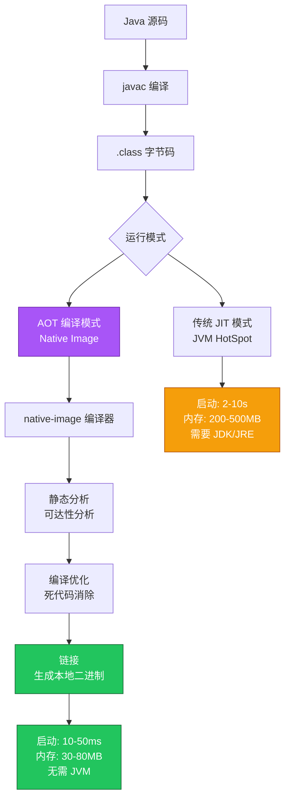
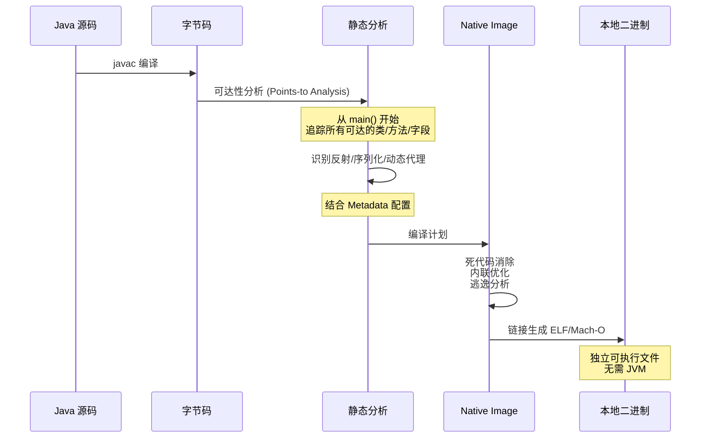

# GraalVM Native Image 云原生实践指南

> **适用版本**: GraalVM for JDK 21 / Spring Boot 3.4+ / Native Build Tools 0.10+  
> **最后更新**: 2026-04-30  
> **难度**: 高级

---

## 📋 目录

- [一、GraalVM Native Image 技术全景](#一graalvm-native-image-技术全景)
- [二、架构原理](#二架构原理)
- [三、Spring Boot 3 原生编译](#三spring-boot-3-原生编译)
- [四、Quarkus 原生编译](#四quarkus-原生编译)
- [五、Micronaut 原生编译](#五micronaut-原生编译)
- [六、Reachability Metadata 配置](#六reachability-metadata-配置)
- [七、容器化构建与多架构](#七容器化构建与多架构)
- [八、Kubernetes 部署实践](#八kubernetes-部署实践)
- [九、性能对比与调优](#九性能对比与调优)
- [十、常见问题与排查](#十常见问题与排查)

---

## 一、GraalVM Native Image 技术全景



### 1.1 Native Image 核心优势

| 特性 | JIT 模式 (传统 JVM) | AOT 模式 (Native Image) |
|------|---------------------|------------------------|
| **启动时间** | 2-10 秒 | 10-50 毫秒 |
| **首请求延迟** | 高 (JIT 预热) | 低 (已编译) |
| **内存占用** | 200-500 MB | 30-80 MB |
| **镜像大小** | 200-450 MB (含 JVM) | 50-80 MB |
| **峰值吞吐量** | 高 (JIT 优化后) | 中 (无运行时优化) |
| **预热时间** | 数分钟到数小时 | 无需预热 |
| **需要 JVM** | 是 | 否 |
| **动态特性** | 完全支持 | 部分受限 |
| **调试/Profiling** | 完整工具链 | 有限支持 |

### 1.2 适用场景分析

```
✅ 强烈推荐:
├── Serverless / FaaS (冷启动敏感)
├── 微服务快速扩缩容
├── CLI 工具 (快速响应)
├── 内存受限环境 (边缘计算)
├── 批处理任务 (K8s Job/CronJob)
└── 多副本低成本运行

⚠️ 需要评估:
├── 长时间运行的高吞吐服务 (JIT 峰值更高)
├── 大量使用反射/动态代理的应用
├── 需要运行时代码生成的场景
└── 复杂的 classloading 机制

❌ 不推荐:
├── 需要字节码增强的 APM 工具
├── 运行时编译/脚本引擎 (JSP, Groovy)
└── 频繁使用 MethodHandle 的应用
```

---

## 二、架构原理

### 2.1 AOT 编译流程



### 2.2 Closed World 假设

Native Image 采用 **Closed World Assumption** (封闭世界假设):

- 编译时确定所有可达代码
- 运行时不能加载新类
- 反射/动态代理需要提前声明
- 适用于 JSON 序列化的类需要注册

---

## 三、Spring Boot 3 原生编译

### 3.1 前置条件

```bash
# 安装 GraalVM (使用 SDKMAN)
sdk install java 21.0.3-graal
sdk use java 21.0.3-graal

# 安装 native-image
gu install native-image

# 验证
java -version
native-image --version

# macOS 需要额外安装
xcode-select --install

# Linux 需要构建工具
# Ubuntu/Debian
sudo apt-get install build-essential libz-dev zlib1g-dev

# Fedora/RHEL
sudo dnf install gcc glibc-devel zlib-devel
```

### 3.2 Maven 配置

```xml
<build>
    <plugins>
        <plugin>
            <groupId>org.graalvm.buildtools</groupId>
            <artifactId>native-maven-plugin</artifactId>
            <version>0.10.2</version>
            <extensions>true</extensions>
            <configuration>
                <imageName>my-spring-app</imageName>
                <buildArgs>
                    <buildArg>--initialize-at-build-time=org.slf4j</buildArg>
                    <buildArg>-H:+ReportExceptionStackTraces</buildArg>
                    <buildArg>--enable-url-protocols=http,https</buildArg>
                    <buildArg>-H:MaxDirectMemorySize=64m</buildArg>
                </buildArgs>
            </configuration>
        </plugin>
        <plugin>
            <groupId>org.springframework.boot</groupId>
            <artifactId>spring-boot-maven-plugin</artifactId>
            <configuration>
                <image>
                    <name>registry.example.com/my-spring-app:latest</name>
                    <builder>paketobuildpacks/builder-jammy-tiny</builder>
                    <env>
                        <BP_NATIVE_IMAGE>true</BP_NATIVE_IMAGE>
                        <BP_NATIVE_IMAGE_BUILD_ARGUMENTS>
                            --initialize-at-build-time=org.slf4j
                        </BP_NATIVE_IMAGE_BUILD_ARGUMENTS>
                    </env>
                </image>
            </configuration>
        </plugin>
    </plugins>
</build>
```

### 3.3 构建命令

```bash
# 本地编译原生二进制
./mvnw -Pnative native:compile

# 直接运行
./target/my-spring-app

# 使用 Buildpacks 构建原生容器镜像
./mvnw spring-boot:build-image -Pnative

# 运行原生容器
docker run --rm -p 8080:8080 registry.example.com/my-spring-app:latest
```

### 3.4 Gradle Kotlin DSL 配置

```kotlin
plugins {
    id("org.graalvm.buildtools.native") version "0.10.2"
}

graalvmNative {
    binaries {
        named("main") {
            imageName.set("my-spring-app")
            buildArgs.addAll(
                listOf(
                    "--initialize-at-build-time=org.slf4j",
                    "-H:+ReportExceptionStackTraces",
                    "--enable-url-protocols=http,https"
                )
            )
        }
    }
}

// 构建
// ./gradlew nativeCompile
// ./build/native/nativeCompile/my-spring-app
```

### 3.5 Spring Boot 3 Native 提示注解

```java
@ImportRuntimeHints(MyAppRuntimeHints.class)
@SpringBootApplication
public class Application {
    public static void main(String[] args) {
        SpringApplication.run(Application.class, args);
    }
}

class MyAppRuntimeHints implements RuntimeHintsRegistrar {
    @Override
    public void registerHints(RuntimeHints hints, ClassLoader classLoader) {
        // 注册反射访问
        hints.reflection()
            .registerType(MyDto.class, MemberCategory.INVOKE_PUBLIC_METHODS);

        // 注册序列化
        hints.serialization()
            .registerType(MyDto.class);

        // 注册资源
        hints.resources()
            .registerPattern("my-config/*.xml");

        // 注册 Java 序列化代理
        hints.jni()
            .registerType(MyNativeClass.class);
    }
}
```

---

## 四、Quarkus 原生编译

### 4.1 Maven 配置

```xml
<dependency>
    <groupId>io.quarkus</groupId>
    <artifactId>quarkus-maven-plugin</artifactId>
    <version>3.12.0</version>
</dependency>

<build>
    <plugins>
        <plugin>
            <groupId>io.quarkus</groupId>
            <artifactId>quarkus-maven-plugin</artifactId>
            <extensions>true</extensions>
            <executions>
                <execution>
                    <goals>
                        <goal>build</goal>
                        <goal>generate-code</goal>
                        <goal>generate-code-tests</goal>
                    </goals>
                </execution>
            </executions>
        </plugin>
    </plugins>
</build>
```

### 4.2 构建与容器化

```bash
# JVM 模式构建
./mvnw package -Dquarkus.package.type=fast-jar

# 原生二进制构建
./mvnw package -Dnative

# 原生容器镜像构建 (使用 Docker 多阶段)
./mvnw package -Dnative \
    -Dquarkus.native.container-build=true \
    -Dquarkus.container-image.build=true \
    -Dquarkus.container-image.push=true \
    -Dquarkus.container-image.registry=registry.example.com \
    -Dquarkus.container-image.name=my-quarkus-app \
    -Dquarkus.container-image.tag=v1.0.0
```

### 4.3 Quarkus Dockerfile

```dockerfile
# ========== Stage 1: 构建 ==========
FROM quay.io/quarkus/ubi9-quarkus-mandrel-builder-image:jdk-21 AS builder
USER quarkus
WORKDIR /build
COPY --chown=quarkus:quarkus . .
RUN ./mvnw package -Dnative -DskipTests

# ========== Stage 2: 运行 ==========
FROM registry.access.redhat.com/ubi9/ubi-minimal:9.4
WORKDIR /work/
COPY --from=builder /build/target/*-runner /work/application
RUN chmod 775 /work
EXPOSE 8080
USER 1001
CMD ["./application", "-Dquarkus.http.host=0.0.0.0"]
```

---

## 五、Micronaut 原生编译

### 5.1 构建配置

```bash
# 使用 Micronaut Launch 创建项目
mn create-app com.example.myapp --features graalvm,netty-server

# 原生编译
./mvnw package -Dpackaging=native-image

# Gradle
./gradlew nativeCompile
```

### 5.2 Micronaut Dockerfile

```dockerfile
FROM ghcr.io/graalvm/native-image-community:21 AS builder
WORKDIR /build
COPY . .
RUN ./mvnw package -Dpackaging=native-image -DskipTests

FROM gcr.io/distroless/cc-debian12:nonroot
COPY --from=builder /build/target/myapp /app/myapp
EXPOSE 8080
USER nonroot:nonroot
ENTRYPOINT ["/app/myapp"]
```

---

## 六、Reachability Metadata 配置

### 6.1 反射注册

```json
// src/main/resources/META-INF/native-image/reflect-config.json
[
  {
    "name": "com.example.myapp.dto.UserDto",
    "allDeclaredConstructors": true,
    "allDeclaredMethods": true,
    "allDeclaredFields": true,
    "queryAllDeclaredMethods": true
  },
  {
    "name": "com.example.myapp.controller.UserController",
    "allDeclaredConstructors": true,
    "allDeclaredMethods": true
  }
]
```

### 6.2 资源包含

```json
// src/main/resources/META-INF/native-image/resource-config.json
{
  "resources": {
    "includes": [
      {"pattern": "application\\.yml$"},
      {"pattern": "application-production\\.yml$"},
      {"pattern": "db/migration/.*\\.sql$"},
      {"pattern": "templates/.*\\.html$"},
      {"pattern": "static/.*"}
    ]
  },
  "bundles": [
    {"name": "messages"},
    {"name": "ValidationMessages"}
  ]
}
```

### 6.3 序列化注册

```json
// src/main/resources/META-INF/native-image/serialization-config.json
{
  "types": [
    {"name": "com.example.myapp.dto.UserDto"},
    {"name": "com.example.myapp.dto.OrderDto"}
  ],
  "lambdaCapturingTypes": []
}
```

### 6.4 JNI 注册

```json
// src/main/resources/META-INF/native-image/jni-config.json
[
  {
    "name": "com.example.myapp.service.NativeService",
    "allDeclaredConstructors": true,
    "allDeclaredMethods": true,
    "allPublicMethods": true
  }
]
```

### 6.5 自动追踪生成配置

```bash
# 使用 Tracing Agent 自动生成配置
java -agentlib:native-image-agent=config-output-dir=src/main/resources/META-INF/native-image \
    -jar target/my-spring-app.jar

# 运行完整测试场景 (确保覆盖所有反射路径)
# 访问所有 API 端点
curl http://localhost:8080/api/users
curl http://localhost:8080/api/orders
# 触发所有序列化路径

# 合并多次运行的结果
java -agentlib:native-image-agent=config-merge-dir=src/main/resources/META-INF/native-image \
    -jar target/my-spring-app.jar
```

---

## 七、容器化构建与多架构

### 7.1 Native Image 容器构建

```dockerfile
# ========== Stage 1: 编译原生二进制 ==========
FROM ghcr.io/graalvm/native-image-community:21 AS builder

WORKDIR /build
COPY pom.xml .
COPY .mvn/ .mvn/
COPY mvnw .
RUN ./mvnw dependency:go-offline -B

COPY src ./src
RUN ./mvnw -Pnative -DskipTests package \
    && cp target/my-spring-app /app-binary

# ========== Stage 2: 最小运行镜像 ==========
FROM gcr.io/distroless/cc-debian12:nonroot

COPY --from=builder /app-binary /app/my-spring-app

EXPOSE 8080

USER nonroot:nonroot

ENTRYPOINT ["/app/my-spring-app"]
```

### 7.2 多架构构建

```bash
# AMD64 + ARM64 多架构
docker buildx build --push \
    --platform linux/amd64,linux/arm64 \
    -t registry.example.com/my-spring-app:native-v1.0.0 \
    .
```

---

## 八、Kubernetes 部署实践

### 8.1 原生应用 Deployment

```yaml
apiVersion: apps/v1
kind: Deployment
metadata:
  name: my-spring-app-native
  labels:
    app: my-spring-app
    version: native
spec:
  replicas: 3
  selector:
    matchLabels:
      app: my-spring-app
  template:
    metadata:
      labels:
        app: my-spring-app
        version: native
    spec:
      containers:
        - name: app
          image: registry.example.com/my-spring-app:native-v1.0.0
          ports:
            - containerPort: 8080
          env:
            - name: SPRING_PROFILES_ACTIVE
              value: "production"
          resources:
            requests:
              memory: "64Mi"
              cpu: "50m"
            limits:
              memory: "128Mi"
              cpu: "500m"
          startupProbe:
            httpGet:
              path: /actuator/health/readiness
              port: 8080
            initialDelaySeconds: 0
            periodSeconds: 1
            failureThreshold: 10
          livenessProbe:
            httpGet:
              path: /actuator/health/liveness
              port: 8080
            periodSeconds: 10
          readinessProbe:
            httpGet:
              path: /actuator/health/readiness
              port: 8080
            periodSeconds: 5
          securityContext:
            runAsNonRoot: true
            runAsUser: 65532
            readOnlyRootFilesystem: true
            allowPrivilegeEscalation: false
            capabilities:
              drop:
                - ALL
          volumeMounts:
            - name: tmp
              mountPath: /tmp
      volumes:
        - name: tmp
          emptyDir: {}
```

### 8.2 原生 vs JVM 资源对比

```yaml
# JVM 版本 Deployment (对比参考)
resources:
  requests:
    memory: "512Mi"
    cpu: "200m"
  limits:
    memory: "1Gi"
    cpu: "1000m"

# Native Image 版本 Deployment
resources:
  requests:
    memory: "64Mi"
    cpu: "50m"
  limits:
    memory: "128Mi"
    cpu: "500m"
```

### 8.3 Knative Serverless 部署

```yaml
apiVersion: serving.knative.dev/v1
kind: Service
metadata:
  name: my-spring-app-native
spec:
  template:
    metadata:
      annotations:
        autoscaling.knative.dev/min-scale: "0"
        autoscaling.knative.dev/max-scale: "10"
        autoscaling.knative.dev/target: "10"
    spec:
      containerConcurrency: 100
      timeoutSeconds: 300
      containers:
        - image: registry.example.com/my-spring-app:native-v1.0.0
          resources:
            limits:
              memory: "128Mi"
              cpu: "500m"
          ports:
            - containerPort: 8080
```

---

## 九、性能对比与调优

### 9.1 性能基准测试数据

| 指标 | JVM 模式 | Native Image | 提升幅度 |
|------|---------|-------------|---------|
| 启动时间 | 3.2s | 0.035s | **91x** |
| 首请求延迟 | 450ms | 12ms | **37x** |
| 内存占用 (空闲) | 280MB | 45MB | **6.2x** |
| 内存占用 (负载) | 420MB | 85MB | **4.9x** |
| 镜像大小 | 340MB | 72MB | **4.7x** |
| RSS (稳态) | 380MB | 68MB | **5.6x** |
| 峰值吞吐量 (RPS) | 28,500 | 22,400 | -21% |
| P99 延迟 (稳态) | 45ms | 52ms | +16% |

### 9.2 Native Image 调优参数

```bash
# 内存调优
-H:MaxHeapSize=128m              # 最大堆内存
-H:MaxNewSize=32m                # 新生代大小
-H:MaxDirectMemorySize=64m       # 直接内存

# 初始化调优
--initialize-at-build-time=...   # 编译时初始化类
--initialize-at-run-time=...     # 运行时初始化类

# GC 选择
-H:GC=G1                         # G1 GC (默认)
-H:GC=Serial                     # Serial GC (更小内存)

# 调试
-H:+ReportExceptionStackTraces   # 报告异常堆栈
-H:+PrintHeapHistograms          # 打印堆直方图
-H:Log=registerResource:...      # 资源注册日志

# 网络
--enable-url-protocols=http,https
--enable-https                   # 启用 HTTPS
```

### 9.3 PGO (Profile-Guided Optimization)

```bash
# Step 1: 构建插桩二进制
native-image -pgo-instrument -jar myapp.jar

# Step 2: 运行典型负载收集 Profile
./myapp <典型负载>

# Step 3: 使用 PGO 数据重新编译
native-image -pgo=default.iprof -jar myapp.jar

# 吞吐量可提升 10-20%
```

---

## 十、常见问题与排查

### 10.1 常见错误与解决方案

| 错误 | 原因 | 解决方案 |
|------|------|---------|
| `ClassNotFoundException` | 类在静态分析中不可达 | 添加 `reflect-config.json` |
| `NoSuchMethodException` | 反射调用未注册的方法 | 使用 `@RegisterReflectionForBinding` |
| `Resource not found` | 资源文件未包含 | 添加到 `resource-config.json` |
| `InstantiationException` | 序列化类未注册 | 添加到 `serialization-config.json` |
| `Image heap exhausted` | 编译时内存不足 | 增加构建机器内存或 `-H:MaxHeapSize=` |
| `UnsupportedFeatureError` | 使用了不支持的动态特性 | 重构代码或寻找替代方案 |
| 构建时间过长 | 大量类/依赖 | 减少依赖、使用编译缓存 |

### 10.2 调试技巧

```bash
# 查看编译时初始化报告
native-image -H:+PrintClassInitialization -jar myapp.jar

# 查看包含的方法/类
native-image -H:+PrintAnalysisCallTree -jar myapp.jar

# 查看镜像大小分解
native-image -H:+PrintImageElementTree -jar myapp.jar

# 运行时诊断
./myapp -XX:+PrintGCSummary
./myapp -XX:+HeapDumpOnOutOfMemory
./myapp -XX:HeapDumpPath=/tmp/heapdump

# 在 K8s 中诊断
kubectl exec -it deployment/my-spring-app-native -- /app/my-spring-app -XX:+PrintGCSummary
```

---

## 📊 框架选型对比

| 特性 | Spring Boot Native | Quarkus Native | Micronaut Native |
|------|-------------------|----------------|-----------------|
| **启动时间** | ~35ms | ~12ms | ~18ms |
| **内存占用** | ~45MB | ~25MB | ~30MB |
| **生态成熟度** | 极高 | 高 | 高 |
| **学习曲线** | 低 (Spring 生态) | 中 | 中 |
| **编译时间** | 较长 (~5min) | 中等 (~3min) | 中等 (~3min) |
| **反射支持** | 通过 Hints 机制 | 编译时解决 | 编译时解决 |
| **K8s 集成** | 优秀 | 优秀 (内置 K8s Client) | 优秀 |
| **社区活跃度** | 极高 | 高 | 高 |

---

## 🔗 相关文档

- [Java 容器化最佳实践](../domain-13-docker/12-java-containerization-guide.md) — Dockerfile 模式与镜像优化
- [Spring Boot on K8s](../domain-4-workloads/99-spring-boot-kubernetes-guide.md) — Spring Boot K8s 部署
- [Quarkus/Micronaut 指南](./99-quarkus-micronaut-cloud-native-java-guide.md) — 云原生 Java 框架对比
- [JVM GC 容器调优](../domain-12-troubleshooting/99-jvm-gc-container-tuning-guide.md) — GC 调优 (JVM 模式)
- [Java 可观测性](../domain-8-observability/99-java-observability-kubernetes-guide.md) — Native Image 可观测性
