<!-- condition: velero backup get | grep -E 'Failed|PartiallyFailed' 显示备份失败 -->

# 备份/恢复异常 FTA 树

## 适用范围与说明
- **目标**：覆盖 Kubernetes 集群备份失败、恢复失败、数据不一致与 RPO/RTO 未达标的关键成因与路径。
- **范围**：etcd 快照、Velero/自定义备份工具、存储后端（S3/OSS/NFS）、加密与校验、恢复流程与顺序、依赖组件。
- **符号**：
  - **OR 门**：任一子事件成立即可触发父事件
  - **AND 门**：所有子事件同时成立才触发父事件

---

## Mermaid FTA 树

```mermaid
flowchart TD
  TE["顶事件: 备份/恢复异常<br/>数据丢失 / 恢复失败 / RPO 未达标"]
  OR0{{OR}}
  TE --> OR0

  %% ======== 一级分类 ========
  OR0 --> CAT_SNAP["A. etcd 快照异常"]
  OR0 --> CAT_APP["B. 应用级备份异常"]
  OR0 --> CAT_STORE["C. 存储后端异常"]
  OR0 --> CAT_CRYPTO["D. 加密/校验异常"]
  OR0 --> CAT_RESTORE["E. 恢复流程异常"]
  OR0 --> CAT_DEP["F. 依赖/调度异常"]

  %% ======== A. etcd 快照 ========
  A_OR{{OR}}
  CAT_SNAP --> A_OR
  A_OR --> A1["A1. 快照创建失败<br/>磁盘空间不足 / etcd 过载"]
  A_OR --> A2["A2. 快照超时<br/>数据量过大"]
  A_OR --> A3["A3. 快照不完整<br/>进程中断"]
  A_OR --> A4_AND["A4. 快照数据过期<br/>(AND 门)"]

  A4_AND_GATE{{"AND"}}
  A4_AND --> A4_AND_GATE
  A4_AND_GATE --> A4C1["CronJob 调度异常导致长时间未备份"]
  A4_AND_GATE --> A4C2["监控未检测到备份缺失"]

  %% ======== B. 应用级备份 ========
  B_OR{{OR}}
  CAT_APP --> B_OR
  B_OR --> B1["B1. Velero Backup 失败<br/>Plugin 错误"]
  B_OR --> B2["B2. 资源选择器遗漏<br/>关键资源未纳入备份"]
  B_OR --> B3["B3. Volume 快照失败<br/>CSI Snapshot 错误"]
  B_OR --> B4["B4. Hook 执行失败<br/>pre/post backup hook 报错"]
  B_OR --> B5_AND["B5. 备份数据不一致<br/>(AND 门)"]

  B5_AND_GATE{{"AND"}}
  B5_AND --> B5_AND_GATE
  B5_AND_GATE --> B5C1["有状态应用未 quiesce（数据库/缓存）"]
  B5_AND_GATE --> B5C2["备份期间有写入操作"]

  %% ======== C. 存储后端 ========
  C_OR{{OR}}
  CAT_STORE --> C_OR
  C_OR --> C1["C1. 存储不可达<br/>网络/Endpoint 异常"]
  C_OR --> C2["C2. 凭据失效<br/>AccessKey/Secret 过期"]
  C_OR --> C3["C3. 存储空间不足<br/>Bucket/Volume 已满"]
  C_OR --> C4["C4. 存储限流<br/>API 请求过多"]

  %% ======== D. 加密/校验 ========
  D_OR{{OR}}
  CAT_CRYPTO --> D_OR
  D_OR --> D1["D1. 加密密钥不可用<br/>KMS/Secret 缺失"]
  D_OR --> D2["D2. 数据完整性校验失败<br/>checksum 不匹配"]
  D_OR --> D3["D3. 密钥轮换后旧备份不可解密"]
  D_OR --> D4_AND["D4. 加密恢复死锁<br/>(AND 门)"]

  D4_AND_GATE{{"AND"}}
  D4_AND --> D4_AND_GATE
  D4_AND_GATE --> D4C1["备份加密密钥存储在集群内"]
  D4_AND_GATE --> D4C2["集群不可用需要从备份恢复"]

  %% ======== E. 恢复流程 ========
  E_OR{{OR}}
  CAT_RESTORE --> E_OR
  E_OR --> E1["E1. 恢复顺序错误<br/>CRD/Namespace 未先恢复"]
  E_OR --> E2["E2. 资源冲突<br/>已存在同名资源"]
  E_OR --> E3["E3. API 版本不兼容<br/>备份中 API 版本已移除"]
  E_OR --> E4["E4. PV/PVC 绑定失败<br/>后端存储不匹配"]
  E_OR --> E5["E5. etcd 恢复失败<br/>集群状态不一致"]
  E_OR --> E6_AND["E6. 跨版本恢复失败<br/>(AND 门)"]

  E6_AND_GATE{{"AND"}}
  E6_AND --> E6_AND_GATE
  E6_AND_GATE --> E6C1["备份来自旧版本集群"]
  E6_AND_GATE --> E6C2["目标集群已移除备份中使用的 API 版本"]

  %% ======== F. 依赖/调度 ========
  F_OR{{OR}}
  CAT_DEP --> F_OR
  F_OR --> F1["F1. 备份 CronJob 调度异常<br/>未按计划执行"]
  F_OR --> F2["F2. 备份 Pod 资源不足<br/>OOM / CPU 限制"]
  F_OR --> F3["F3. RBAC 权限不足<br/>无法读取集群资源"]
  F_OR --> F4["F4. 网络策略阻断<br/>备份 Pod 无法访问存储"]
```



---

## 生产级观测与证据

| 类别 | 关键信号 |
|------|---------|
| **事件** | Velero `Backup`/`Restore` 资源状态（Completed/PartiallyFailed/Failed）；etcd snapshot 定时任务状态；VolumeSnapshot 事件 |
| **关键指标** | `velero_backup_success_total` / `velero_backup_failure_total`、`velero_backup_duration_seconds`、`velero_restore_success_total`、`etcd_debugging_snap_save_total_duration_seconds`、`etcd_server_snapshot_apply_in_progress_total`、备份存储使用率 |
| **关键日志** | Velero Pod 日志（backup/restore errors）、etcdctl snapshot 日志、备份 Hook 输出、CSI Snapshotter 日志 |
| **配置核对** | BackupStorageLocation 配置、VolumeSnapshotLocation、Schedule 对象、加密密钥引用、RBAC（ClusterRole for velero）、etcd snapshot CronJob |

---

## JSON 工作流（含与/或门控件）

```json
{
  "flow_steps": [
    { "name": "开始", "action": "start", "step": "start_backup_fta", "next_step": "event_backup_abnormal" },
    { "name": "顶事件: 备份/恢复异常", "action": "event", "step": "event_backup_abnormal", "description": "数据丢失 / 恢复失败 / RPO 未达标", "next_step": "gate_root_or" },
    { "name": "根因 OR 门", "action": "gate_or", "step": "gate_root_or", "control": "or_gate", "gate_type": "OR", "next_steps": ["cat_snap", "cat_app", "cat_store", "cat_crypto", "cat_restore", "cat_dep"] },

    { "name": "A. etcd 快照异常", "action": "category", "step": "cat_snap", "next_step": "gate_snap_or" },
    { "name": "etcd 快照 OR 门", "action": "gate_or", "step": "gate_snap_or", "control": "or_gate", "gate_type": "OR", "next_steps": ["event_snap_fail", "event_snap_timeout", "event_snap_incomplete", "event_snap_stale"] },

    {
      "name": "A1. 快照创建失败", "action": "bottom_event", "step": "event_snap_fail",
      "description": "etcdctl snapshot save 失败，磁盘空间不足或 etcd 过载",
      "next_step": "end",
      "metadata": {
        "severity": "critical",
        "probability": "low",
        "mttr_minutes": 15,
        "detection": {
          "events": ["etcd snapshot CronJob Failed"],
          "metrics": ["etcd_debugging_snap_save_total_duration_seconds", "etcd_disk_backend_commit_duration_seconds"],
          "logs": ["snapshot failed: disk space full", "etcdserver: too many requests"]
        },
        "remediation": {
          "manual_steps": ["检查 etcd 节点磁盘空间: df -h", "清理旧快照文件", "确认 etcd 集群健康: etcdctl endpoint health", "检查 etcd 数据库大小: etcdctl endpoint status"],
          "auto_actions": ["配置磁盘空间告警阈值", "设置旧快照自动清理策略"]
        },
        "version_notes": ""
      }
    },
    {
      "name": "A2. 快照超时", "action": "bottom_event", "step": "event_snap_timeout",
      "description": "etcd 数据量过大（>8GB），快照耗时超过 CronJob 超时限制",
      "next_step": "end",
      "metadata": {
        "severity": "high",
        "probability": "low",
        "mttr_minutes": 20,
        "detection": {
          "events": ["Job deadline exceeded"],
          "metrics": ["etcd_debugging_snap_save_total_duration_seconds > 300"],
          "logs": ["context deadline exceeded during snapshot"]
        },
        "remediation": {
          "manual_steps": ["增大 CronJob activeDeadlineSeconds", "检查 etcd 数据库大小并执行 compaction", "优化 etcd 磁盘 IO（使用 SSD）", "考虑 etcd defrag 减小数据文件"],
          "auto_actions": ["定期执行 etcdctl compact + defrag"]
        },
        "version_notes": ""
      }
    },
    {
      "name": "A3. 快照不完整", "action": "bottom_event", "step": "event_snap_incomplete",
      "description": "快照过程中被中断（OOM/信号），产生损坏的快照文件",
      "next_step": "end",
      "metadata": {
        "severity": "critical",
        "probability": "rare",
        "mttr_minutes": 15,
        "detection": {
          "events": ["CrashLoopBackOff (snapshot pod)"],
          "metrics": [],
          "logs": ["snapshot file is corrupted", "unexpected EOF"]
        },
        "remediation": {
          "manual_steps": ["验证快照: etcdctl snapshot status <file>", "删除损坏的快照", "增大备份 Pod 内存限制", "使用原子写入（先写临时文件再 rename）"],
          "auto_actions": ["备份完成后自动校验 checksum"]
        },
        "version_notes": ""
      }
    },
    {
      "name": "A4. 快照数据过期 (AND)", "action": "gate_and", "step": "event_snap_stale",
      "control": "and_gate", "gate_type": "AND",
      "conditions": ["CronJob 调度异常导致长时间未备份", "监控未检测到备份缺失"],
      "combined_severity": "critical",
      "description": "备份定时任务失败且无告警，RPO 大幅超标但运维团队不知情",
      "next_steps": ["event_cronjob_not_scheduled", "event_no_backup_alert"],
      "metadata": {
        "severity": "critical",
        "probability": "low",
        "mttr_minutes": 30,
        "detection": {
          "events": ["最近一次成功备份时间远超 RPO"],
          "metrics": ["time() - velero_backup_last_successful_timestamp > RPO_threshold"],
          "logs": []
        },
        "remediation": {
          "manual_steps": ["检查 CronJob 状态和最近执行记录", "验证 Schedule 对象配置", "立即执行一次手动备份", "配置备份缺失告警规则"],
          "auto_actions": ["设置 Prometheus alert: 备份间隔超过 RPO 阈值"]
        },
        "version_notes": ""
      }
    },
    { "name": "CronJob 调度异常", "action": "and_condition", "step": "event_cronjob_not_scheduled", "next_step": "end" },
    { "name": "监控未检测到备份缺失", "action": "and_condition", "step": "event_no_backup_alert", "next_step": "end" },

    { "name": "B. 应用级备份异常", "action": "category", "step": "cat_app", "next_step": "gate_app_or" },
    { "name": "应用备份 OR 门", "action": "gate_or", "step": "gate_app_or", "control": "or_gate", "gate_type": "OR", "next_steps": ["event_velero_fail", "event_selector_miss", "event_vol_snap_fail", "event_hook_fail", "event_data_inconsistent"] },

    {
      "name": "B1. Velero Backup 失败", "action": "bottom_event", "step": "event_velero_fail",
      "description": "Velero 备份任务报错，Plugin 初始化失败或 API 调用异常",
      "next_step": "end",
      "metadata": {
        "severity": "critical",
        "probability": "medium",
        "mttr_minutes": 20,
        "detection": {
          "events": ["Backup status: Failed"],
          "metrics": ["velero_backup_failure_total", "velero_backup_partial_failure_total"],
          "logs": ["error running backup", "plugin error", "rpc error"]
        },
        "remediation": {
          "manual_steps": ["velero backup describe <name> --details", "velero backup logs <name>", "检查 Velero Pod 日志", "确认 Plugin 版本与 Velero 版本兼容", "检查 BackupStorageLocation 可用性"],
          "auto_actions": []
        },
        "version_notes": "Velero 1.12+ 支持 CSI snapshot data movement"
      }
    },
    {
      "name": "B2. 资源选择器遗漏", "action": "bottom_event", "step": "event_selector_miss",
      "description": "Backup 的 includedNamespaces/includedResources 配置不全，关键资源未备份",
      "next_step": "end",
      "metadata": {
        "severity": "high",
        "probability": "medium",
        "mttr_minutes": 15,
        "detection": {
          "events": ["Backup ItemsBackedUp 数量异常少"],
          "metrics": [],
          "logs": ["skipping resource: not included"]
        },
        "remediation": {
          "manual_steps": ["审查 Backup spec 的 include/exclude 配置", "使用 --include-cluster-resources=true 确保集群级资源纳入", "检查是否遗漏 CRD 和对应 CR", "定期执行恢复演练验证备份完整性"],
          "auto_actions": []
        },
        "version_notes": ""
      }
    },
    {
      "name": "B3. Volume 快照失败", "action": "bottom_event", "step": "event_vol_snap_fail",
      "description": "CSI VolumeSnapshot 创建失败，快照类不支持或后端存储异常",
      "next_step": "end",
      "metadata": {
        "severity": "critical",
        "probability": "medium",
        "mttr_minutes": 25,
        "detection": {
          "events": ["VolumeSnapshot Failed", "FailedToCreateSnapshot"],
          "metrics": ["velero_backup_items_errors"],
          "logs": ["failed to create snapshot", "CSI driver does not support snapshots"]
        },
        "remediation": {
          "manual_steps": ["确认 VolumeSnapshotClass 存在且配置正确", "检查 CSI Driver 是否支持快照功能", "确认存储后端配额未耗尽", "检查 snapshot-controller Pod 日志"],
          "auto_actions": []
        },
        "version_notes": "1.20+ VolumeSnapshot v1 GA"
      }
    },
    {
      "name": "B4. Hook 执行失败", "action": "bottom_event", "step": "event_hook_fail",
      "description": "pre/post backup hook（如数据库 flush/freeze）执行失败或超时",
      "next_step": "end",
      "metadata": {
        "severity": "high",
        "probability": "low",
        "mttr_minutes": 15,
        "detection": {
          "events": ["Backup PartiallyFailed (hook errors)"],
          "metrics": ["velero_backup_partial_failure_total"],
          "logs": ["hook execution error", "command timed out"]
        },
        "remediation": {
          "manual_steps": ["检查 hook 命令在容器内是否可执行", "增大 hook timeout", "确认目标容器名正确", "测试 hook 命令: kubectl exec <pod> -c <container> -- <command>"],
          "auto_actions": []
        },
        "version_notes": ""
      }
    },
    {
      "name": "B5. 备份数据不一致 (AND)", "action": "gate_and", "step": "event_data_inconsistent",
      "control": "and_gate", "gate_type": "AND",
      "conditions": ["有状态应用未 quiesce（数据库/缓存未 flush）", "备份期间有写入操作"],
      "combined_severity": "critical",
      "description": "备份数据处于中间状态，恢复后应用数据不一致或损坏",
      "next_steps": ["event_app_not_quiesced", "event_write_during_backup"],
      "metadata": {
        "severity": "critical",
        "probability": "medium",
        "mttr_minutes": 60,
        "detection": {
          "events": ["恢复后应用报数据一致性错误"],
          "metrics": [],
          "logs": ["data corruption detected after restore", "inconsistent state"]
        },
        "remediation": {
          "manual_steps": ["为有状态应用配置 pre-backup hook 执行 flush/freeze", "使用应用感知型备份（如 pg_dump 而非文件快照）", "在低峰期执行备份", "使用存储层一致性快照（如 CSI snapshot with fsfreeze）"],
          "auto_actions": ["配置 Velero backup hook: pre=fsfreeze, post=fsthaw"]
        },
        "version_notes": ""
      }
    },
    { "name": "有状态应用未 quiesce", "action": "and_condition", "step": "event_app_not_quiesced", "next_step": "end" },
    { "name": "备份期间有写入操作", "action": "and_condition", "step": "event_write_during_backup", "next_step": "end" },

    { "name": "C. 存储后端异常", "action": "category", "step": "cat_store", "next_step": "gate_store_or" },
    { "name": "存储 OR 门", "action": "gate_or", "step": "gate_store_or", "control": "or_gate", "gate_type": "OR", "next_steps": ["event_store_unreachable", "event_cred_expired", "event_store_full", "event_store_throttle"] },

    {
      "name": "C1. 存储不可达", "action": "bottom_event", "step": "event_store_unreachable",
      "description": "S3/OSS/NFS 端点不可达，网络或 DNS 解析异常",
      "next_step": "end",
      "metadata": {
        "severity": "critical",
        "probability": "low",
        "mttr_minutes": 15,
        "detection": {
          "events": ["BackupStorageLocation Unavailable"],
          "metrics": ["velero_backup_failure_total"],
          "logs": ["dial tcp: lookup <endpoint>: no such host", "connection refused", "i/o timeout"]
        },
        "remediation": {
          "manual_steps": ["检查存储端点 DNS 解析", "确认网络策略/防火墙允许出站", "检查存储服务状态", "velero backup-location get 验证状态"],
          "auto_actions": []
        },
        "version_notes": ""
      }
    },
    {
      "name": "C2. 凭据失效", "action": "bottom_event", "step": "event_cred_expired",
      "description": "存储访问密钥过期或 Secret 被删除/修改",
      "next_step": "end",
      "metadata": {
        "severity": "critical",
        "probability": "medium",
        "mttr_minutes": 10,
        "detection": {
          "events": ["BackupStorageLocation Unavailable"],
          "metrics": [],
          "logs": ["InvalidAccessKeyId", "SignatureDoesNotMatch", "AccessDenied"]
        },
        "remediation": {
          "manual_steps": ["检查 cloud-credentials Secret 内容", "轮换存储访问密钥", "确认 IAM 角色/策略未变更", "使用 IRSA/Workload Identity 替代静态密钥"],
          "auto_actions": ["配置密钥自动轮换"]
        },
        "version_notes": ""
      }
    },
    {
      "name": "C3. 存储空间不足", "action": "bottom_event", "step": "event_store_full",
      "description": "Bucket 或 NFS Volume 已满，无法写入新备份",
      "next_step": "end",
      "metadata": {
        "severity": "high",
        "probability": "medium",
        "mttr_minutes": 15,
        "detection": {
          "events": ["Backup Failed: no space left"],
          "metrics": ["存储使用率 > 90%"],
          "logs": ["no space left on device", "bucket quota exceeded"]
        },
        "remediation": {
          "manual_steps": ["清理过期备份: velero backup delete --older-than 30d", "增大存储配额", "配置 TTL 自动清理: spec.ttl in Backup", "检查备份大小增长趋势"],
          "auto_actions": ["配置 Velero GC 策略自动清理过期备份"]
        },
        "version_notes": ""
      }
    },
    {
      "name": "C4. 存储限流", "action": "bottom_event", "step": "event_store_throttle",
      "description": "对象存储 API 请求限流，大量小文件上传被拒绝",
      "next_step": "end",
      "metadata": {
        "severity": "medium",
        "probability": "low",
        "mttr_minutes": 20,
        "detection": {
          "events": [],
          "metrics": [],
          "logs": ["SlowDown", "Rate exceeded", "503 Service Unavailable"]
        },
        "remediation": {
          "manual_steps": ["增大存储端 API 限流配额", "配置 Velero 上传并发度", "使用 restic/kopia 时调整并行度", "将备份分散到多个 Bucket"],
          "auto_actions": []
        },
        "version_notes": ""
      }
    },

    { "name": "D. 加密/校验异常", "action": "category", "step": "cat_crypto", "next_step": "gate_crypto_or" },
    { "name": "加密 OR 门", "action": "gate_or", "step": "gate_crypto_or", "control": "or_gate", "gate_type": "OR", "next_steps": ["event_key_unavailable", "event_checksum_fail", "event_key_rotation", "event_crypto_deadlock"] },

    {
      "name": "D1. 加密密钥不可用", "action": "bottom_event", "step": "event_key_unavailable",
      "description": "etcd 加密密钥或备份加密密钥（KMS/Secret）丢失或不可访问",
      "next_step": "end",
      "metadata": {
        "severity": "critical",
        "probability": "low",
        "mttr_minutes": 30,
        "detection": {
          "events": ["decrypt failed"],
          "metrics": [],
          "logs": ["failed to decrypt", "KMS key not found", "secret not found"]
        },
        "remediation": {
          "manual_steps": ["确认加密密钥 Secret 存在", "检查 KMS 服务可用性", "从密钥托管服务恢复密钥", "确保密钥备份存储在集群外部"],
          "auto_actions": []
        },
        "version_notes": "1.24+ 默认 etcd 加密 secret 类型数据"
      }
    },
    {
      "name": "D2. 数据完整性校验失败", "action": "bottom_event", "step": "event_checksum_fail",
      "description": "备份文件 checksum 不匹配，传输或存储过程中数据损坏",
      "next_step": "end",
      "metadata": {
        "severity": "critical",
        "probability": "rare",
        "mttr_minutes": 20,
        "detection": {
          "events": ["Restore Failed: checksum mismatch"],
          "metrics": [],
          "logs": ["checksum mismatch", "data integrity check failed", "snapshot file corrupted"]
        },
        "remediation": {
          "manual_steps": ["重新从源端下载备份文件", "启用存储端 server-side 完整性校验", "使用最近的其他备份", "排查存储介质是否有硬件故障"],
          "auto_actions": ["备份完成后自动验证 checksum"]
        },
        "version_notes": ""
      }
    },
    {
      "name": "D3. 密钥轮换后旧备份不可解密", "action": "bottom_event", "step": "event_key_rotation",
      "description": "加密密钥轮换后，使用旧密钥加密的备份无法解密",
      "next_step": "end",
      "metadata": {
        "severity": "high",
        "probability": "low",
        "mttr_minutes": 30,
        "detection": {
          "events": ["Restore Failed: decrypt error"],
          "metrics": [],
          "logs": ["failed to decrypt with current key", "key version mismatch"]
        },
        "remediation": {
          "manual_steps": ["保留旧版密钥直到对应备份过 TTL", "在密钥轮换前重新加密所有有效备份", "密钥管理系统保留历史版本", "文档化密钥版本与备份的对应关系"],
          "auto_actions": []
        },
        "version_notes": ""
      }
    },
    {
      "name": "D4. 加密恢复死锁 (AND)", "action": "gate_and", "step": "event_crypto_deadlock",
      "control": "and_gate", "gate_type": "AND",
      "conditions": ["备份加密密钥存储在集群内（如 K8s Secret）", "集群不可用需要从备份恢复"],
      "combined_severity": "critical",
      "description": "恢复集群需要解密备份，但解密密钥在需要恢复的集群中，形成死锁",
      "next_steps": ["event_key_in_cluster", "event_cluster_down"],
      "metadata": {
        "severity": "critical",
        "probability": "rare",
        "mttr_minutes": 120,
        "detection": {
          "events": ["灾难恢复时发现无法解密备份"],
          "metrics": [],
          "logs": []
        },
        "remediation": {
          "manual_steps": ["将加密密钥副本存储在集群外部（如 Vault/HSM/保险箱）", "定期验证外部密钥副本可用性", "在 DR 演练中验证从外部密钥恢复的流程", "文档化紧急恢复流程"],
          "auto_actions": []
        },
        "version_notes": ""
      }
    },
    { "name": "加密密钥存储在集群内", "action": "and_condition", "step": "event_key_in_cluster", "next_step": "end" },
    { "name": "集群不可用需恢复", "action": "and_condition", "step": "event_cluster_down", "next_step": "end" },

    { "name": "E. 恢复流程异常", "action": "category", "step": "cat_restore", "next_step": "gate_restore_or" },
    { "name": "恢复 OR 门", "action": "gate_or", "step": "gate_restore_or", "control": "or_gate", "gate_type": "OR", "next_steps": ["event_restore_order", "event_resource_conflict", "event_api_compat", "event_pv_bind_fail", "event_etcd_restore_fail", "event_cross_version"] },

    {
      "name": "E1. 恢复顺序错误", "action": "bottom_event", "step": "event_restore_order",
      "description": "CRD 未先于 CR 恢复，或 Namespace 未先于其内资源恢复，导致依赖缺失",
      "next_step": "end",
      "metadata": {
        "severity": "high",
        "probability": "medium",
        "mttr_minutes": 20,
        "detection": {
          "events": ["Restore PartiallyFailed"],
          "metrics": ["velero_restore_partial_failure_total"],
          "logs": ["no matches for kind", "namespace not found"]
        },
        "remediation": {
          "manual_steps": ["确保 Velero 恢复优先级正确（默认处理 Namespace → CRD → CR）", "检查 restorePriorities 配置", "分阶段恢复: 先基础设施，再应用", "手动创建缺失的 Namespace/CRD 后重试"],
          "auto_actions": []
        },
        "version_notes": ""
      }
    },
    {
      "name": "E2. 资源冲突", "action": "bottom_event", "step": "event_resource_conflict",
      "description": "目标集群已存在同名资源，恢复操作冲突",
      "next_step": "end",
      "metadata": {
        "severity": "medium",
        "probability": "common",
        "mttr_minutes": 15,
        "detection": {
          "events": ["Restore warnings: resource already exists"],
          "metrics": [],
          "logs": ["resource already exists", "restore conflict"]
        },
        "remediation": {
          "manual_steps": ["使用 --existing-resource-policy=update 覆盖已有资源", "恢复到空 Namespace", "使用 --namespace-mappings 重映射到新 Namespace", "手动清理冲突资源后重试"],
          "auto_actions": []
        },
        "version_notes": "Velero 1.10+ 支持 existing-resource-policy"
      }
    },
    {
      "name": "E3. API 版本不兼容", "action": "bottom_event", "step": "event_api_compat",
      "description": "备份中包含目标集群已移除的 API 版本（如 extensions/v1beta1）",
      "next_step": "end",
      "metadata": {
        "severity": "high",
        "probability": "medium",
        "mttr_minutes": 30,
        "detection": {
          "events": ["Restore Failed: no matches for kind"],
          "metrics": [],
          "logs": ["the server could not find the requested resource", "no matches for kind"]
        },
        "remediation": {
          "manual_steps": ["使用 Velero API 版本转换插件", "手动提取备份内容并修改 API 版本", "在源集群升级 API 版本后重新备份", "使用 velero restore describe 查看具体哪些资源失败"],
          "auto_actions": []
        },

> ⚠️ **弃用警告**: `PodSecurityPolicy` 已在 Kubernetes v1.25 中正式移除。
> 请使用 [Pod Security Admission (PSA)](https://kubernetes.io/docs/concepts/security/pod-security-admission/) 替代。

        "version_notes": "1.22 移除 extensions/v1beta1 Ingress; 1.25 移除 PodSecurityPolicy"
      }
    },
    {
      "name": "E4. PV/PVC 绑定失败", "action": "bottom_event", "step": "event_pv_bind_fail",
      "description": "恢复的 PVC 无法绑定 PV，存储后端不匹配或 PV 不存在",
      "next_step": "end",
      "metadata": {
        "severity": "critical",
        "probability": "medium",
        "mttr_minutes": 30,
        "detection": {
          "events": ["PVC Pending", "FailedBinding"],
          "metrics": ["kube_persistentvolumeclaim_status_phase{phase='Pending'}"],
          "logs": ["no persistent volumes available for this claim"]
        },
        "remediation": {
          "manual_steps": ["确认 StorageClass 在目标集群存在", "使用 --restore-volumes=true 配合 VolumeSnapshotLocation", "检查 PV reclaimPolicy", "手动创建 PV 并绑定"],
          "auto_actions": []
        },
        "version_notes": ""
      }
    },
    {
      "name": "E5. etcd 恢复失败", "action": "bottom_event", "step": "event_etcd_restore_fail",
      "description": "etcd snapshot restore 失败，集群状态不一致",
      "next_step": "end",
      "metadata": {
        "severity": "critical",
        "probability": "low",
        "mttr_minutes": 60,
        "detection": {
          "events": ["etcd 无法启动"],
          "metrics": ["etcd_server_is_leader == 0 (所有节点)"],
          "logs": ["member already bootstrapped", "database file corrupted", "member ID mismatch"]
        },
        "remediation": {
          "manual_steps": ["停止所有 etcd 成员", "清理所有成员数据目录", "使用 etcdctl snapshot restore 在每个节点恢复", "确保 initial-cluster-token 与原集群一致", "按顺序启动 etcd 成员"],
          "auto_actions": []
        },
        "version_notes": ""
      }
    },
    {
      "name": "E6. 跨版本恢复失败 (AND)", "action": "gate_and", "step": "event_cross_version",
      "control": "and_gate", "gate_type": "AND",
      "conditions": ["备份来自旧版本集群", "目标集群已移除备份中使用的 API 版本"],
      "combined_severity": "critical",
      "description": "跨大版本恢复时，备份中的旧版 API 对象在新集群中无对应 Kind",
      "next_steps": ["event_backup_old_cluster", "event_target_removed_api"],
      "metadata": {
        "severity": "critical",
        "probability": "low",
        "mttr_minutes": 60,
        "detection": {
          "events": ["Restore PartiallyFailed/Failed"],
          "metrics": [],
          "logs": ["no matches for kind in version"]
        },
        "remediation": {
          "manual_steps": ["在旧集群先升级 API 版本再备份", "使用 Velero 配合 API 转换插件", "手动从备份提取资源并修改 apiVersion/kind", "分阶段迁移: 先迁移到中间版本集群"],
          "auto_actions": []
        },
        "version_notes": "关注 1.22/1.25/1.27 等重大 API 移除版本"
      }
    },
    { "name": "备份来自旧版本集群", "action": "and_condition", "step": "event_backup_old_cluster", "next_step": "end" },
    { "name": "目标集群已移除旧 API 版本", "action": "and_condition", "step": "event_target_removed_api", "next_step": "end" },

    { "name": "F. 依赖/调度异常", "action": "category", "step": "cat_dep", "next_step": "gate_dep_or" },
    { "name": "依赖 OR 门", "action": "gate_or", "step": "gate_dep_or", "control": "or_gate", "gate_type": "OR", "next_steps": ["event_cronjob_fail", "event_backup_pod_oom", "event_backup_rbac", "event_backup_netpol"] },

    {
      "name": "F1. 备份 CronJob 调度异常", "action": "bottom_event", "step": "event_cronjob_fail",
      "description": "CronJob 未按计划执行，startingDeadlineSeconds 过期或 concurrencyPolicy 冲突",
      "next_step": "end",
      "metadata": {
        "severity": "high",
        "probability": "medium",
        "mttr_minutes": 10,
        "detection": {
          "events": ["CronJob missed start time"],
          "metrics": ["kube_cronjob_next_schedule_time - time() < 0"],
          "logs": ["Cannot determine if job needs to be started"]
        },
        "remediation": {
          "manual_steps": ["检查 CronJob spec: schedule / startingDeadlineSeconds / concurrencyPolicy", "确认 kube-controller-manager 运行正常", "手动触发: kubectl create job --from=cronjob/<name>", "增大 startingDeadlineSeconds"],
          "auto_actions": []
        },
        "version_notes": "1.21+ CronJob 使用 batch/v1 (之前 batch/v1beta1)"
      }
    },
    {
      "name": "F2. 备份 Pod 资源不足", "action": "bottom_event", "step": "event_backup_pod_oom",
      "description": "备份 Pod（Velero / restic / kopia）OOM 或 CPU 被限流导致超时",
      "next_step": "end",
      "metadata": {
        "severity": "high",
        "probability": "medium",
        "mttr_minutes": 15,
        "detection": {
          "events": ["OOMKilled (velero/node-agent pod)"],
          "metrics": ["container_memory_working_set_bytes{container='velero'}"],
          "logs": ["signal: killed", "context deadline exceeded"]
        },
        "remediation": {
          "manual_steps": ["增大 Velero/node-agent Pod 资源限制", "减少单次备份数据量（分 Namespace 备份）", "优化 restic/kopia 内存使用参数"],
          "auto_actions": []
        },
        "version_notes": ""
      }
    },
    {
      "name": "F3. RBAC 权限不足", "action": "bottom_event", "step": "event_backup_rbac",
      "description": "Velero SA 缺少读取集群资源的权限",
      "next_step": "end",
      "metadata": {
        "severity": "high",
        "probability": "low",
        "mttr_minutes": 10,
        "detection": {
          "events": ["Backup PartiallyFailed"],
          "metrics": [],
          "logs": ["forbidden: cannot list resource", "User velero cannot get"]
        },
        "remediation": {
          "manual_steps": ["检查 Velero ClusterRole 权限", "确认新增 CRD 是否需要额外 RBAC", "kubectl auth can-i --as=system:serviceaccount:velero:velero --list"],
          "auto_actions": []
        },
        "version_notes": ""
      }
    },
    {
      "name": "F4. 网络策略阻断", "action": "bottom_event", "step": "event_backup_netpol",
      "description": "NetworkPolicy 阻断 Velero Pod 到存储后端或 API Server 的网络",
      "next_step": "end",
      "metadata": {
        "severity": "high",
        "probability": "low",
        "mttr_minutes": 15,
        "detection": {
          "events": ["Backup Failed: connection timeout"],
          "metrics": [],
          "logs": ["dial tcp: i/o timeout", "connection refused"]
        },
        "remediation": {
          "manual_steps": ["检查 Velero Namespace 的 NetworkPolicy", "添加 egress 规则允许访问存储端点", "确认 API Server 端口未被阻断"],
          "auto_actions": []
        },
        "version_notes": ""
      }
    },

    { "name": "结束", "action": "end", "step": "end" }
  ]
}
```

---

## 版本适配（1.19–1.30）

| 版本范围 | 关键变化 |
|---------|---------|
| **1.19–1.20** | VolumeSnapshot `v1beta1`；CronJob 使用 `batch/v1beta1` |
| **1.21** | CronJob GA (`batch/v1`)；VolumeSnapshot v1 GA |
| **1.22** | 移除 `extensions/v1beta1` Ingress、`admissionregistration.k8s.io/v1beta1`，跨版本恢复需关注 |
| **1.24** | ServiceAccount Token 不再自动创建 Secret；dockershim 移除（备份工具容器镜像需验证） |
| **1.25** | PodSecurityPolicy 移除，备份中包含 PSP 对象在新集群恢复会失败 |
| **1.26–1.28** | etcd 3.5.x 稳定性改进；CSI snapshot data movement 支持 |
| **1.29–1.30** | Velero 新版本支持更细粒度的资源过滤和 API 转换 |
| **共性** | 遵循 `fta-methodology-and-agentic-practices.md` 中的"版本适配基线"；**必须将加密密钥存储在集群外部** |

---

## FTA 评审检查表

> 完成 FTA 文档后，必须通过以下检查项。

### 结构完整性
- [ ] 顶事件定义清晰，与 SLO 关联
- [ ] 所有中间事件都有子事件
- [ ] 所有底事件都是叶子节点
- [ ] 没有悬挂的孤立事件

### 逻辑正确性
- [ ] 逻辑门类型选择正确（OR vs AND）
- [ ] 同一门下的子事件满足 MECE 原则
- [ ] 层数在 3-5 层之间

### 可观测性
- [ ] 每个底事件至少有 1 个指标监控
- [ ] 每个底事件至少有 1 种诊断命令
- [ ] 每个底事件有明确的判定条件

### 可维护性
- [ ] 编号遵循规范（TE-/IE-/BE- 前缀）
- [ ] 修复动作有风险分级（🟢/🟡/🔴）
- [ ] 修复操作包含回滚方案

### Agent 友好性
- [ ] 每个底事件有结构化的修复动作
- [ ] 修复动作标注了自动化程度（L1/L2/L3）

---

## 快速决策树

> 基于 FTA 故障树自动生成的快速决策路径，3 步内定位问题。

```mermaid
graph TD
    A["故障: 备份/恢复异常<br/>数据丢失 / 恢复失败 / RPO 未达标"]"]
    B{"检查组件状态"}
    C["修复: backup-restore 配置/重启"]
    D{"检查日志和事件"}
    E["修复: backup-restore 深度诊断"]
    F{"检查资源配置"}
    G["修复: backup-restore 专项处理"]
    I["验证修复"]
    J["记录根因，关闭"]
    H["升级到专家"]

    A --> B
    B -->|"是"| C
    B -->|"否"| D
    D -->|"是"| E
    D -->|"否"| F
    F -->|"是"| G
    F -->|"否"| H
    C --> I
    E --> I
    G --> I
    I -->|"已修复"| J
    I -->|"未修复"| H

    style A fill:#ef4444,stroke:#b91c1c,color:#fff
    style J fill:#22c55e,stroke:#166534,color:#fff
    style H fill:#f59e0b,stroke:#b45309,color:#fff
    style B fill:#3b82f6,stroke:#1d4ed8,color:#fff
    style D fill:#3b82f6,stroke:#1d4ed8,color:#fff
    style F fill:#3b82f6,stroke:#1d4ed8,color:#fff
```

### 升级路径

| 条件 | 升级到 | 提供信息 |
|---|---|---|
| 决策树未定位 | SRE 专家 | 检查输出 + 日志 |
| 涉及数据风险 | DBA + 架构师 | 数据状态 |
| 生产服务中断 | On-call 负责人 | 影响范围 + 回滚方案 |

## Related

- [[entities/kubernetes.md|kubernetes]]
- [[hot.md|hot]]
- [[domain-17-system-foundation/topic-cheat-sheet/docker.md|docker]]
- [[domain-17-system-foundation/topic-dictionary/storage/volumes.md|volumes]]
- [[domain-17-system-foundation/topic-dictionary/workloads/pods.md|pods]]
- [[skills/Symptom Vector Matching Engine|Symptom Vector Matching Engine]] — Cross-reference
- [[skills/skills-run-README|Skills Demo — 本地运行工单诊断技能]] — Cross-reference
- [[domain-19-landscape-references/topic-index/backup-dr-index|Backup & DR 备份与灾备知识图谱索引]]
- [[domain-19-landscape-references/topic-index/pvc-index|PVC 知识图谱索引]]
- [[domain-19-landscape-references/topic-index/gitops-cicd-index|GitOps / CI-CD 全局索引]]

## See Also

- [[domain-10-troubleshooting-diagnostics/topic-fta/list/webhook-admission-fta.md|webhook-admission-fta]]
- [[domain-10-troubleshooting-diagnostics/topic-fta/list/apiserver-fta.md|apiserver-fta]]
- [[domain-10-troubleshooting-diagnostics/topic-fta/list/calico-fta.md|calico-fta]]
- [[domain-10-troubleshooting-diagnostics/topic-fta/list/certificate-fta.md|certificate-fta]]
