# GitOps([[ArgoCD|ArgoCD]]) 异常故障树分析

<!-- condition: argocd app list 2>/dev/null | grep -E 'OutOfSync|Error|Degraded' 显示 ArgoCD 应用异常 -->

# GitOps（ArgoCD）异常 FTA 树

## 适用范围与说明
- **目标**：覆盖 ArgoCD 同步失败、应用状态漂移、清单渲染异常、集群连接故障、RBAC/准入拒绝与回滚失败的关键成因与路径。
- **范围**：Git 仓库访问、Helm/Kustomize/Jsonnet 清单渲染、Application/ApplicationSet 同步、目标集群连接、RBAC 与准入控制、Diff/Drift 检测、回滚与版本管理。
- **符号**：
  - **OR 门**：任一子事件成立即可触发父事件
  - **AND 门**：所有子事件同时成立才触发父事件

---

## Mermaid FTA 树

```mermaid
flowchart TD
  TE["顶事件: GitOps 同步异常<br/>Sync 失败 / 漂移 / 回滚失败"]
  OR0{{OR}}
  TE --> OR0

  %% ======== 一级分类 ========
  OR0 --> CAT_REPO["A. Git 仓库访问异常"]
  OR0 --> CAT_RENDER["B. 清单渲染异常"]
  OR0 --> CAT_SYNC["C. Sync 同步异常"]
  OR0 --> CAT_CLUSTER["D. 目标集群连接异常"]
  OR0 --> CAT_RBAC["E. RBAC/准入异常"]
  OR0 --> CAT_DRIFT["F. 漂移/回滚异常"]

  %% ======== A. Git 仓库 ========
  A_OR{{OR}}
  CAT_REPO --> A_OR
  A_OR --> A1["A1. Git 凭证过期/错误<br/>SSH key/Token 失效"]
  A_OR --> A2["A2. Git 仓库不可达<br/>网络/DNS/防火墙"]
  A_OR --> A3["A3. 分支/路径不存在<br/>targetRevision/path 错误"]
  A_OR --> A4["A4. 仓库过大/克隆超时<br/>历史过多"]

  %% ======== B. 清单渲染 ========
  B_OR{{OR}}
  CAT_RENDER --> B_OR
  B_OR --> B1["B1. Helm 渲染失败<br/>values/template 错误"]
  B_OR --> B2["B2. Kustomize 构建失败<br/>patch/overlay 错误"]
  B_OR --> B3["B3. API 版本不兼容<br/>清单中 API 版本已废弃"]
  B_OR --> B4_AND["B4. Helm 依赖不可用<br/>(AND 门)"]

  B4_AND_GATE{{"AND"}}
  B4_AND --> B4_AND_GATE
  B4_AND_GATE --> B4C1["Chart 依赖外部 Helm Repo"]
  B4_AND_GATE --> B4C2["外部 Helm Repo 不可达"]

  %% ======== C. Sync 同步 ========
  C_OR{{OR}}
  CAT_SYNC --> C_OR
  C_OR --> C1["C1. Sync 超时<br/>资源创建/更新耗时过长"]
  C_OR --> C2["C2. Hook 失败<br/>PreSync/PostSync Job 报错"]
  C_OR --> C3["C3. 资源冲突<br/>已被其他控制器管理"]
  C_OR --> C4["C4. SyncWave 顺序错误<br/>依赖关系未满足"]
  C_OR --> C5_AND["C5. 自动同步风暴<br/>(AND 门)"]

  C5_AND_GATE{{"AND"}}
  C5_AND --> C5_AND_GATE
  C5_AND_GATE --> C5C1["Sync 持续失败触发重试"]
  C5_AND_GATE --> C5C2["自动同步 + 自动修剪已启用"]

  %% ======== D. 集群连接 ========
  D_OR{{OR}}
  CAT_CLUSTER --> D_OR
  D_OR --> D1["D1. 目标集群 API Server 不可达"]
  D_OR --> D2["D2. 集群证书/Token 过期"]
  D_OR --> D3["D3. 集群注册信息过时<br/>Endpoint 变更"]

  %% ======== E. RBAC/准入 ========
  E_OR{{OR}}
  CAT_RBAC --> E_OR
  E_OR --> E1["E1. ArgoCD SA 权限不足<br/>目标集群 RBAC"]
  E_OR --> E2["E2. Webhook 准入拒绝<br/>策略不满足"]
  E_OR --> E3["E3. AppProject 限制<br/>资源/集群/仓库不在白名单"]
  E_OR --> E4["E4. Namespace 不存在<br/>目标 NS 未创建"]

  %% ======== F. 漂移/回滚 ========
  F_OR{{OR}}
  CAT_DRIFT --> F_OR
  F_OR --> F1["F1. 资源被手动修改<br/>kubectl edit/patch"]
  F_OR --> F2["F2. Diff 误报<br/>正常差异被标记为 OutOfSync"]
  F_OR --> F3["F3. 回滚版本不存在<br/>历史记录已清理"]
  F_OR --> F4_AND["F4. 漂移无法自愈<br/>(AND 门)"]

  F4_AND_GATE{{"AND"}}
  F4_AND --> F4_AND_GATE
  F4_AND_GATE --> F4C1["资源被外部持续修改"]
  F4_AND_GATE --> F4C2["ArgoCD 自动同步已禁用"]
```

---

## 生产级观测与证据

| 类别 | 关键信号 |
|------|---------|
| **事件** | ArgoCD Application status（Synced/OutOfSync/Degraded/Unknown）、Sync 操作事件、Hook Job 状态 |
| **关键指标** | `argocd_app_info{sync_status="OutOfSync"}`、`argocd_app_sync_total{phase="Error"}`、`argocd_app_reconcile_count`、`argocd_git_request_total

## 相关链接

- [[skills/FTA Methodology and Core Principles.md|FTA 方法论]]
- [[skills/FTA Diagnostic Execution Engine.md|[[FTA 诊断执行引擎|FTA 诊断执行引擎]]]]

## Related

- [[job-cronjob-fta]] — Job/CronJob 异常故障树分析
- [[skills/skill-README.md|skill-README]] — topic-skills — 工单智能体 Kubernetes 诊断 Skill 库
- [[etcd-fta]] — etcd 异常故障树分析
- [[helm]] — Helm
- [[entities/argocd.md|argocd]] — ArgoCD

- [[domain-10-troubleshooting-diagnostics/topic-fta/list/gitops-argocd-fta.md|GitOps(ArgoCD) 异常故障树分析]]
- [[skills/Agent Orchestration Patterns|Agent Orchestration Patterns for FTA]] — Cross-reference
- [[skills/skill-MOC|topic-skills MOC]] — Cross-reference
