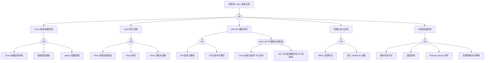
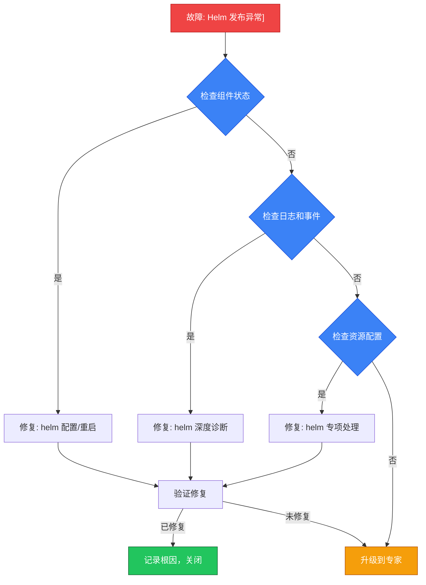

<!-- condition: helm list -A 2>/dev/null | grep -E 'failed|pending-install' 显示失败的 Release -->

# Helm 发布异常 FTA 树

## 适用范围与说明
- **目标**：覆盖 Helm 发布失败、回滚失败与资源不一致的关键成因与路径。
- **范围**：Chart 仓库与渲染、Hook、K8s API 兼容、权限与审计、状态管理。
- **符号**：
  - **OR 门**：任一子事件成立即可触发父事件
  - **AND 门**：所有子事件同时成立才触发父事件

---

## Mermaid FTA 树



---

## 生产级观测与证据
- **事件**：
  - helm install/upgrade 失败
  - Release 状态 FAILED / PENDING_INSTALL / PENDING_UPGRADE
  - Hook 超时/失败
- **关键指标**：
  - Helm 发布失败率
  - 回滚失败率
  - Release 版本数量（过多的历史版本）
- **关键日志**：
  - Helm CLI 输出
  - Helm Controller/Flux 日志
  - apiserver 审计日志
  - Hook Job 日志
- **配置核对**：
  - Chart 版本和依赖项
  - Values 文件完整性
  - Hook 注解配置
  - API 版本兼容性
  - Release 历史版本管理 (--history-max)

---

## JSON 工作流（含与/或门控件）

```json
{
  "flow_steps": [
    { "name": "开始", "action": "start", "step": "start_helm_fta", "next_step": "event_helm_abnormal" },
    { "name": "顶事件: Helm 发布异常", "action": "event", "step": "event_helm_abnormal", "description": "Helm 发布失败/回滚失败/状态异常", "next_step": "gate_root_or" },
    { "name": "根因 OR 门", "action": "gate_or", "step": "gate_root_or", "control": "or_gate", "gate_type": "OR", "next_steps": ["cat_chart", "cat_hook", "cat_api", "cat_rbac", "cat_state"] },

    { "name": "类别: Chart 渲染/依赖异常", "action": "category", "step": "cat_chart", "next_step": "gate_chart_or" },
    { "name": "Chart OR 门", "action": "gate_or", "step": "gate_chart_or", "control": "or_gate", "gate_type": "OR", "next_steps": ["evt_chart_dep", "evt_chart_render", "evt_chart_values"] },
    {
      "name": "底事件: Chart 依赖拉取失败", "action": "bottom_event", "step": "evt_chart_dep",
      "description": "Chart 仓库不可达或依赖 Chart 版本不存在",
      "metadata": { "severity": "high", "probability": "medium", "mttr_minutes": 15,
        "detection": { "events": [], "metrics": [], "logs": ["failed to fetch", "chart not found", "repository not reachable"] },
        "remediation": { "manual_steps": ["helm repo update 刷新仓库索引", "检查仓库 URL 和认证: helm repo list", "验证网络连通性到仓库", "检查 Chart.yaml dependencies 版本约束"], "auto_actions": [] } },
      "next_step": "gate_root_or"
    },
    {
      "name": "底事件: 模板渲染错误", "action": "bottom_event", "step": "evt_chart_render",
      "description": "Go template 语法错误或缺少必需 Values",
      "metadata": { "severity": "high", "probability": "common", "mttr_minutes": 15,
        "detection": { "events": [], "metrics": [], "logs": ["template rendering error", "nil pointer evaluating", "function not defined"] },
        "remediation": { "manual_steps": ["helm template 本地渲染调试", "检查模板语法和缩进", "确认必需 Values 已提供", "检查 .Capabilities 和 lookup 函数使用"], "auto_actions": [] } },
      "next_step": "gate_root_or"
    },
    {
      "name": "底事件: Values 配置错误", "action": "bottom_event", "step": "evt_chart_values",
      "description": "Values 文件格式错误或值类型不匹配",
      "metadata": { "severity": "medium", "probability": "common", "mttr_minutes": 10,
        "detection": { "events": [], "metrics": [], "logs": ["error converting YAML to JSON", "invalid value", "type mismatch"] },
        "remediation": { "manual_steps": ["验证 values.yaml 语法: yamllint", "helm lint 检查 Chart 完整性", "检查值类型匹配模板期望"], "auto_actions": [] } },
      "next_step": "gate_root_or"
    },

    { "name": "类别: Hook 执行异常", "action": "category", "step": "cat_hook", "next_step": "gate_hook_or" },
    { "name": "Hook OR 门", "action": "gate_or", "step": "gate_hook_or", "control": "or_gate", "gate_type": "OR", "next_steps": ["evt_hook_create", "evt_hook_timeout", "evt_hook_cleanup"] },
    {
      "name": "底事件: Hook 资源创建失败", "action": "bottom_event", "step": "evt_hook_create",
      "description": "pre-install/post-install Hook Job 创建失败",
      "metadata": { "severity": "high", "probability": "medium", "mttr_minutes": 20,
        "detection": { "events": ["FailedCreate"], "metrics": [], "logs": ["hook failed", "error creating resource"] },
        "remediation": { "manual_steps": ["检查 Hook 资源模板", "验证 Hook 依赖的 RBAC 权限", "检查命名空间是否存在", "查看 kubectl describe job 详情"], "auto_actions": [] } },
      "next_step": "gate_root_or"
    },
    {
      "name": "底事件: Hook 超时", "action": "bottom_event", "step": "evt_hook_timeout",
      "description": "Hook Job 执行超过 --timeout 设定时间",
      "metadata": { "severity": "medium", "probability": "medium", "mttr_minutes": 20,
        "detection": { "events": [], "metrics": [], "logs": ["timed out waiting for the condition", "hook deadline exceeded"] },
        "remediation": { "manual_steps": ["增加 --timeout 值", "检查 Hook Job 日志: kubectl logs job/<hook-job>", "优化 Hook 脚本执行效率", "检查 Hook 依赖的外部服务"], "auto_actions": [] } },
      "next_step": "gate_root_or"
    },
    {
      "name": "底事件: Hook 资源未清理", "action": "bottom_event", "step": "evt_hook_cleanup",
      "description": "上次失败的 Hook 资源未清理阻塞新发布",
      "metadata": { "severity": "medium", "probability": "medium", "mttr_minutes": 10,
        "detection": { "events": [], "metrics": [], "logs": ["already exists", "resource already exists"] },
        "remediation": { "manual_steps": ["使用 helm.sh/hook-delete-policy 注解", "手动清理残留 Hook 资源", "配置 before-hook-creation 删除策略"], "auto_actions": [] } },
      "next_step": "gate_root_or"
    },

    { "name": "类别: K8s API 兼容异常", "action": "category", "step": "cat_api", "next_step": "gate_api_or" },
    { "name": "API OR 门", "action": "gate_or", "step": "gate_api_or", "control": "or_gate", "gate_type": "OR", "next_steps": ["evt_api_removed", "evt_crd_incompat", "gate_and_api"] },
    {
      "name": "底事件: API 版本已移除", "action": "bottom_event", "step": "evt_api_removed",
      "description": "Chart 模板使用了在当前 K8s 版本中已移除的 API",
      "metadata": { "severity": "critical", "probability": "common", "mttr_minutes": 30,
        "detection": { "events": [], "metrics": [], "logs": ["no matches for kind", "the server could not find the requested resource"] },
        "remediation": { "manual_steps": ["使用 helm-mapkubeapis 插件修复 Release 元数据", "更新 Chart 模板到新 API 版本", "使用 .Capabilities.APIVersions 做条件判断", "升级 Chart 到兼容版本"], "auto_actions": [] },

> ⚠️ **弃用警告**: `PodSecurityPolicy` 已在 Kubernetes v1.25 中正式移除。
> 请使用 [Pod Security Admission (PSA)](https://kubernetes.io/docs/concepts/security/pod-security-admission/) 替代。

        "version_notes": { "1.22": "移除 Ingress extensions/v1beta1, CRD v1beta1", "1.25": "移除 PodSecurityPolicy", "1.29": "移除 FlowSchema v1beta2" } },
      "next_step": "gate_root_or"
    },
    {
      "name": "底事件: CRD 版本不兼容", "action": "bottom_event", "step": "evt_crd_incompat",
      "description": "Chart 依赖的 CRD 版本与集群不兼容",
      "metadata": { "severity": "high", "probability": "medium", "mttr_minutes": 30,
        "detection": { "events": [], "metrics": [], "logs": ["CRD version mismatch", "no matching CRD"] },
        "remediation": { "manual_steps": ["先安装/升级 CRD 再部署 Chart", "检查 Chart 要求的 CRD 版本", "使用 crds/ 目录管理 CRD 安装"], "auto_actions": [] } },
      "next_step": "gate_root_or"
    },
    {
      "name": "AND 门: API 不兼容升级失败", "action": "gate_and", "step": "gate_and_api", "control": "and_gate", "gate_type": "AND",
      "description": "Chart 使用废弃 API + K8s 已升级到移除该 API 版本 = 发布失败",
      "conditions": ["Chart 模板使用已废弃 API", "K8s 已升级到移除该 API 的版本"],
      "combined_severity": "critical",
      "next_steps": ["evt_and_api_chart", "evt_and_api_k8s"], "next_step": "gate_root_or"
    },
    { "name": "AND 条件1: Chart 用旧 API", "action": "and_condition", "step": "evt_and_api_chart", "description": "Chart 模板硬编码了废弃 API 版本（如 extensions/v1beta1）", "parent_gate": "gate_and_api" },
    { "name": "AND 条件2: K8s 已移除", "action": "and_condition", "step": "evt_and_api_k8s", "description": "集群 K8s 版本已移除该 API（如 1.22 移除 Ingress v1beta1）", "parent_gate": "gate_and_api" },

    { "name": "类别: 权限与准入异常", "action": "category", "step": "cat_rbac", "next_step": "gate_rbac_or" },
    { "name": "RBAC OR 门", "action": "gate_or", "step": "gate_rbac_or", "control": "or_gate", "gate_type": "OR", "next_steps": ["evt_rbac_denied", "evt_webhook_reject"] },
    {
      "name": "底事件: RBAC 权限不足", "action": "bottom_event", "step": "evt_rbac_denied",
      "description": "Helm 使用的 ServiceAccount/kubeconfig 权限不足",
      "metadata": { "severity": "high", "probability": "medium", "mttr_minutes": 15,
        "detection": { "events": [], "metrics": [], "logs": ["forbidden", "User cannot", "is forbidden"] },
        "remediation": { "manual_steps": ["检查 Helm 使用的 kubeconfig/SA 权限", "kubectl auth can-i 验证具体权限", "授予必要的 ClusterRole/Role", "检查命名空间范围权限"], "auto_actions": [] } },
      "next_step": "gate_root_or"
    },
    {
      "name": "底事件: 准入 Webhook 拒绝", "action": "bottom_event", "step": "evt_webhook_reject",
      "description": "准入控制 Webhook 拒绝 Helm 创建/修改的资源",
      "metadata": { "severity": "medium", "probability": "medium", "mttr_minutes": 20,
        "detection": { "events": ["FailedCreate"], "metrics": [], "logs": ["admission webhook denied", "violates policy"] },
        "remediation": { "manual_steps": ["检查 Webhook 拒绝原因", "调整资源 spec 满足策略", "临时豁免特定 Release 命名空间", "更新 OPA/Kyverno 策略"], "auto_actions": [] } },
      "next_step": "gate_root_or"
    },

    { "name": "类别: 状态/回滚异常", "action": "category", "step": "cat_state", "next_step": "gate_state_or" },
    { "name": "状态 OR 门", "action": "gate_or", "step": "gate_state_or", "control": "or_gate", "gate_type": "OR", "next_steps": ["evt_state_stuck", "evt_rollback_fail", "evt_secret_corrupt", "evt_drift"] },
    {
      "name": "底事件: 发布状态卡住", "action": "bottom_event", "step": "evt_state_stuck",
      "description": "Release 处于 pending-install/pending-upgrade 无法继续",
      "metadata": { "severity": "high", "probability": "medium", "mttr_minutes": 15,
        "detection": { "events": [], "metrics": [], "logs": ["another operation in progress", "pending-install"] },
        "remediation": { "manual_steps": ["检查 Release 状态: helm status <release>", "使用 helm rollback 回到上一版本", "必要时手动修改 Release Secret 状态", "使用 --force 标志强制升级"], "auto_actions": [] } },
      "next_step": "gate_root_or"
    },
    {
      "name": "底事件: 回滚失败", "action": "bottom_event", "step": "evt_rollback_fail",
      "description": "helm rollback 操作失败",
      "metadata": { "severity": "high", "probability": "low", "mttr_minutes": 30,
        "detection": { "events": [], "metrics": [], "logs": ["rollback failed", "error rolling back"] },
        "remediation": { "manual_steps": ["检查目标版本是否存在: helm history <release>", "确认回滚资源无冲突", "手动恢复资源到目标状态", "使用 helm uninstall + helm install 重建"], "auto_actions": [] } },
      "next_step": "gate_root_or"
    },
    {
      "name": "底事件: Release Secret 损坏", "action": "bottom_event", "step": "evt_secret_corrupt",
      "description": "存储 Release 元数据的 Secret/ConfigMap 损坏",
      "metadata": { "severity": "high", "probability": "rare", "mttr_minutes": 30,
        "detection": { "events": [], "metrics": [], "logs": ["corrupted release", "error decoding release"] },
        "remediation": { "manual_steps": ["检查 Release Secret: kubectl get secret -l owner=helm", "备份并修复损坏的 Secret", "必要时 helm uninstall --no-hooks 重装", "配置 --history-max 限制历史版本"], "auto_actions": [] } },
      "next_step": "gate_root_or"
    },
    {
      "name": "底事件: 资源漂移/手动修改", "action": "bottom_event", "step": "evt_drift",
      "description": "集群中资源被手动修改导致与 Helm Release 状态不一致",
      "metadata": { "severity": "medium", "probability": "common", "mttr_minutes": 15,
        "detection": { "events": [], "metrics": [], "logs": ["resource modified outside of Helm"] },
        "remediation": { "manual_steps": ["helm diff 对比实际与期望状态", "helm upgrade --force 强制覆盖", "制定 GitOps 流程避免手动修改", "使用 helm.sh/resource-policy: keep 标注需保护资源"], "auto_actions": [] } },
      "next_step": "gate_root_or"
    },

    { "name": "结束", "action": "end", "step": "end_helm_fta" }
  ]
}
```

---

## 版本适配说明 (K8s 1.19-1.30)

| 版本范围 | 关键变更 | Helm 影响 |
|---------|---------|---------|
| 1.19-1.21 | 旧版 API 存在但即将移除 | Chart 应开始迁移 API 版本 |
| 1.22 | 移除 Ingress/CRD/Webhook v1beta1 | 大量 Chart 需要更新模板 |
| 1.24 | 移除 dockershim, SA Token 变化 | Hook 中使用 Docker 命令需更新 |
| 1.25 | 移除 PSP | Chart 中安全策略需迁移到 PSA |
| 1.26-1.30 | 持续 API 清理 | 保持 Chart 模板与 K8s API 同步更新 |
| Helm 3.x | Release Secret 存储, CRD 管理 | 建议使用 Helm 3.12+ |

---

## 快速决策树

> 基于 FTA 故障树自动生成的快速决策路径，3 步内定位问题。



### 升级路径

| 条件 | 升级到 | 提供信息 |
|---|---|---|
| 决策树未定位 | SRE 专家 | 检查输出 + 日志 |
| 涉及数据风险 | DBA + 架构师 | 数据状态 |
| 生产服务中断 | On-call 负责人 | 影响范围 + 回滚方案 |

## Related

- [[domain-17-system-foundation/topic-cheat-sheet/k8s.md|k8s]]
- [[entities/flux.md|flux]]
- [[man/INSTALL.md|INSTALL]]
- [[domain-17-system-foundation/topic-cheat-sheet/helm.md|helm]]
- [[domain-17-system-foundation/topic-cheat-sheet/docker.md|docker]]
- [[skills/ts-command-output|命令输出根因解析]] — Cross-reference
- [[domain-19-landscape-references/topic-index/helm-index|Helm 全局索引]]

## See Also

- [[domain-10-troubleshooting-diagnostics/topic-fta/list/gitops-argocd-fta.md|gitops-argocd-fta]]
- [[domain-10-troubleshooting-diagnostics/topic-fta/list/gpu-fta.md|gpu-fta]]
- [[domain-10-troubleshooting-diagnostics/topic-fta/list/higress-fta.md|higress-fta]]
- [[domain-10-troubleshooting-diagnostics/topic-fta/list/hpa-fta.md|hpa-fta]]
