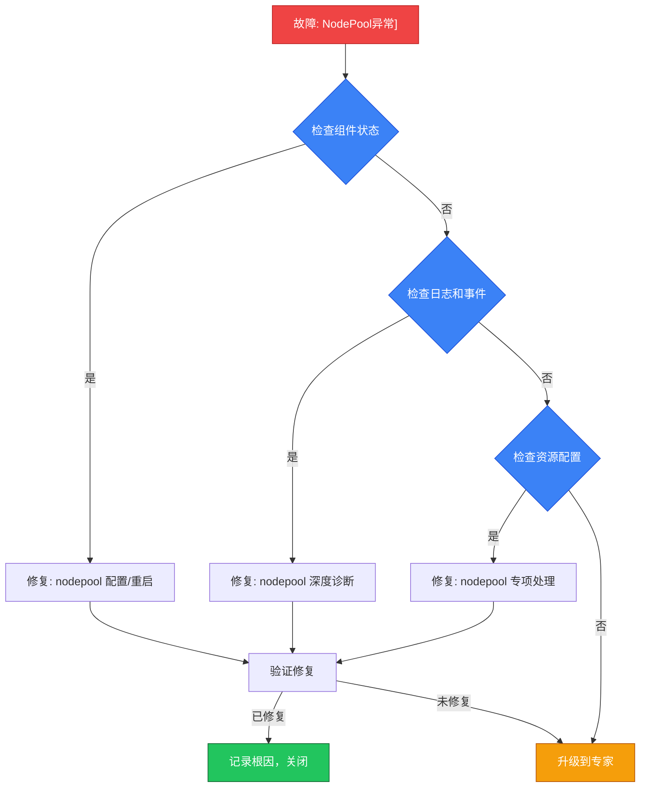

<!-- condition: kubectl get events -A | grep -E 'NodePool|ScaleUpError|NodeGroup' 显示节点池异常 -->

# NodePool 异常 FTA 树

## 适用范围与说明
- **目标**：覆盖节点池扩缩容、生命周期与可用性异常的关键成因与路径。
- **范围**：容量管理、自动扩缩容、调度与标签、节点初始化、镜像与运行时、网络与安全策略、控制面依赖。
- **符号**：
  - **OR 门**：任一子事件成立即可触发父事件
  - **AND 门**：所有子事件同时成立才触发父事件

---

## Mermaid FTA 树

```mermaid
flowchart TD
  TE[顶事件: NodePool异常]
  OR0{{OR}}
  TE --> OR0

  OR0 --> CAP[容量与扩缩容异常]
  OR0 --> INIT[节点初始化异常]
  OR0 --> SCH[调度与标签异常]
  OR0 --> IMG[镜像与运行时异常]
  OR0 --> NET[网络与安全异常]
  OR0 --> COST[配额与成本策略异常]
  OR0 --> CP[控制面/云平台依赖异常]

  CAP_OR{{OR}}
  CAP --> CAP_OR
  CAP_OR --> CAP1[扩容失败/超时]
  CAP_OR --> CAP2[缩容误判/过度缩容]
  CAP_OR --> CAP3[容量不足/上限限制]
  CAP_OR --> CAP4[竞价实例回收]

  INIT_OR{{OR}}
  INIT --> INIT_OR
  INIT_OR --> INIT1[节点加入集群失败]
  INIT_OR --> INIT2[引导脚本/云初始化失败]
  INIT_OR --> INIT3[节点池版本/镜像不一致]

  SCH_OR{{OR}}
  SCH --> SCH_OR
  SCH_OR --> SCH1[标签/污点策略错误]
  SCH_OR --> SCH2[拓扑约束冲突]
  SCH_OR --> SCH3[亲和/反亲和策略不合理]

  IMG_OR{{OR}}
  IMG --> IMG_OR
  IMG_OR --> IMG1[运行时/CRI 异常]
  IMG_OR --> IMG2[基础镜像损坏/不可用]
  IMG_OR --> IMG3[镜像仓库限流]

  NET_OR{{OR}}
  NET --> NET_OR
  NET_OR --> NET1[CNI/ENI 配额不足]
  NET_OR --> NET2[安全组/ACL 阻断]
  NET_OR --> NET3[IP 地址池耗尽]

  COST_OR{{OR}}
  COST --> COST_OR
  COST_OR --> COST1[云资源配额不足]
  COST_OR --> COST2[实例规格不可用]

  %% AND 门: 配额不足 + 无备选规格
  AND_COST{{"AND: 扩容完全失败"}}
  COST --> AND_COST
  AND_COST --> AND_COST1[目标规格配额不足]
  AND_COST --> AND_COST2[未配置备选实例规格]

  CP_OR{{OR}}
  CP --> CP_OR
  CP_OR --> CP1[API Server/控制面异常]
  CP_OR --> CP2[云平台 API 失败]

  %% AND 门: IP 耗尽 + ENI 配额满
  AND_NET{{"AND: 网络资源耗尽"}}
  NET --> AND_NET
  AND_NET --> AND_NET1[VPC/子网 IP 地址耗尽]
  AND_NET --> AND_NET2[ENI 配额达到上限]
```



---

## 生产级观测与证据
- **事件**：
  - 扩容失败/超时事件 (ScaleUpFailed)
  - 节点池 Degraded/Updating 状态
  - 节点加入失败 (RegisterNodeFailed)
  - IP/ENI 配额不足告警
- **关键指标**：
  - 节点池期望节点数 vs 实际节点数
  - 扩容耗时 / 扩容失败率
  - VPC IP 使用率 / ENI 使用率
  - cluster-autoscaler 扩缩容决策指标
- **关键日志**：
  - cluster-autoscaler 日志
  - 云平台伸缩组日志
  - kubelet 启动日志
  - cloud-init / user-data 脚本日志
- **配置核对**：
  - 节点池规格/镜像版本
  - 标签/污点配置
  - 伸缩上下限
  - 引导脚本 (user-data)
  - 安全组/子网配置

---

## JSON 工作流（含与/或门控件）

```json
{
  "flow_steps": [
    { "name": "开始", "action": "start", "step": "start_nodepool_fta", "next_step": "event_nodepool_abnormal" },
    { "name": "顶事件: NodePool异常", "action": "event", "step": "event_nodepool_abnormal", "description": "扩缩容异常/节点池不可用/节点加入失败", "next_step": "gate_root_or" },
    { "name": "根因 OR 门", "action": "gate_or", "step": "gate_root_or", "control": "or_gate", "gate_type": "OR", "next_steps": ["cat_capacity", "cat_init", "cat_schedule", "cat_image", "cat_network", "cat_cost", "cat_cp"] },

    { "name": "类别: 容量与扩缩容异常", "action": "category", "step": "cat_capacity", "next_step": "gate_capacity_or" },
    { "name": "容量 OR 门", "action": "gate_or", "step": "gate_capacity_or", "control": "or_gate", "gate_type": "OR", "next_steps": ["evt_scale_fail", "evt_scale_down_bad", "evt_capacity_limit", "evt_spot_reclaim"] },
    {
      "name": "底事件: 扩容失败/超时", "action": "bottom_event", "step": "evt_scale_fail",
      "description": "节点池扩容请求失败或超时未完成",
      "metadata": { "severity": "critical", "probability": "medium", "mttr_minutes": 30,
        "detection": { "events": ["ScaleUpFailed"], "metrics": ["cluster_autoscaler_scaled_up_nodes_total"], "logs": ["failed to increase node group size", "scale up failed"] },
        "remediation": { "manual_steps": ["检查 cluster-autoscaler 日志", "检查云平台配额和实例可用性", "验证节点池配置有效", "手动扩容测试"], "auto_actions": [] } },
      "next_step": "gate_root_or"
    },
    {
      "name": "底事件: 缩容误判/过度缩容", "action": "bottom_event", "step": "evt_scale_down_bad",
      "description": "Cluster Autoscaler 错误判断节点可缩容导致资源不足",
      "metadata": { "severity": "high", "probability": "medium", "mttr_minutes": 20,
        "detection": { "events": ["ScaleDown"], "metrics": ["cluster_autoscaler_scaled_down_nodes_total"], "logs": ["scale down", "node is underutilized"] },
        "remediation": { "manual_steps": ["调整 scale-down-utilization-threshold", "检查 Pod PDB 配置", "配置 cluster-autoscaler.kubernetes.io/safe-to-evict 注解", "设置 scale-down-delay-after-add"], "auto_actions": [] } },
      "next_step": "gate_root_or"
    },
    {
      "name": "底事件: 容量不足/上限限制", "action": "bottom_event", "step": "evt_capacity_limit",
      "description": "节点池达到最大节点数限制或资源不足",
      "metadata": { "severity": "high", "probability": "medium", "mttr_minutes": 15,
        "detection": { "events": ["ScaleUpFailed"], "metrics": ["cluster_autoscaler_node_groups_count"], "logs": ["max node group size reached"] },
        "remediation": { "manual_steps": ["增加节点池 maxSize", "添加新节点池分散负载", "优化 Pod 资源请求"], "auto_actions": [] } },
      "next_step": "gate_root_or"
    },
    {
      "name": "底事件: 竞价实例回收", "action": "bottom_event", "step": "evt_spot_reclaim",
      "description": "竞价/抢占式实例被云平台回收",
      "metadata": { "severity": "high", "probability": "medium", "mttr_minutes": 15,
        "detection": { "events": ["NodeNotReady"], "metrics": [], "logs": ["spot instance termination", "preemptible instance reclaimed"] },
        "remediation": { "manual_steps": ["配置竞价实例中断处理 handler", "使用多可用区分散风险", "混合按量+竞价实例", "配置 PDB 保护关键服务"], "auto_actions": ["自动 drain + 重建节点"] } },
      "next_step": "gate_root_or"
    },

    { "name": "类别: 节点初始化异常", "action": "category", "step": "cat_init", "next_step": "gate_init_or" },
    { "name": "初始化 OR 门", "action": "gate_or", "step": "gate_init_or", "control": "or_gate", "gate_type": "OR", "next_steps": ["evt_join_fail", "evt_cloud_init_fail", "evt_version_mismatch"] },
    {
      "name": "底事件: 节点加入集群失败", "action": "bottom_event", "step": "evt_join_fail",
      "description": "新节点无法加入集群（kubeadm join 或托管集群注册失败）",
      "metadata": { "severity": "critical", "probability": "medium", "mttr_minutes": 30,
        "detection": { "events": ["RegisterNodeFailed"], "metrics": [], "logs": ["failed to join cluster", "bootstrap token expired"] },
        "remediation": { "manual_steps": ["检查 bootstrap token 有效性", "验证 API Server endpoint 可达", "检查节点证书", "查看 kubelet 启动日志"], "auto_actions": [] } },
      "next_step": "gate_root_or"
    },
    {
      "name": "底事件: 引导脚本/云初始化失败", "action": "bottom_event", "step": "evt_cloud_init_fail",
      "description": "cloud-init/user-data 脚本执行失败",
      "metadata": { "severity": "high", "probability": "medium", "mttr_minutes": 30,
        "detection": { "events": [], "metrics": [], "logs": ["cloud-init error", "user-data script failed"] },
        "remediation": { "manual_steps": ["SSH 到节点检查 /var/log/cloud-init.log", "验证 user-data 脚本语法", "检查脚本依赖（网络/DNS/软件包）"], "auto_actions": [] } },
      "next_step": "gate_root_or"
    },
    {
      "name": "底事件: 节点池版本/镜像不一致", "action": "bottom_event", "step": "evt_version_mismatch",
      "description": "节点池使用的 OS 镜像或 [[domain-17-system-foundation/topic-cheat-sheet/k8s.md|k8s]] 版本与控制面不匹配",
      "metadata": { "severity": "high", "probability": "low", "mttr_minutes": 30,
        "detection": { "events": ["NodeNotReady"], "metrics": ["kubernetes_build_info"], "logs": ["version mismatch"] },
        "remediation": { "manual_steps": ["检查节点池镜像版本", "确认 kubelet 版本在支持范围内", "更新节点池镜像版本"], "auto_actions": [] } },
      "next_step": "gate_root_or"
    },

    { "name": "类别: 调度与标签异常", "action": "category", "step": "cat_schedule", "next_step": "gate_schedule_or" },
    { "name": "调度 OR 门", "action": "gate_or", "step": "gate_schedule_or", "control": "or_gate", "gate_type": "OR", "next_steps": ["evt_taint_bad", "evt_topology_conflict", "evt_affinity_bad"] },
    {
      "name": "底事件: 标签/污点策略错误", "action": "bottom_event", "step": "evt_taint_bad",
      "description": "节点池标签或污点配置错误导致 Pod 无法调度到目标节点",
      "metadata": { "severity": "medium", "probability": "common", "mttr_minutes": 15,
        "detection": { "events": ["FailedScheduling"], "metrics": [], "logs": ["had taint", "didn't match"] },
        "remediation": { "manual_steps": ["检查节点池标签和污点配置", "确认 Pod tolerations 匹配", "更新节点池配置"], "auto_actions": [] } },
      "next_step": "gate_root_or"
    },
    {
      "name": "底事件: 拓扑约束冲突", "action": "bottom_event", "step": "evt_topology_conflict",
      "description": "topologySpreadConstraints 与节点池拓扑不匹配",
      "metadata": { "severity": "medium", "probability": "medium", "mttr_minutes": 15,
        "detection": { "events": ["FailedScheduling"], "metrics": [], "logs": ["topology spread constraint"] },
        "remediation": { "manual_steps": ["检查节点拓扑标签", "调整 topologySpreadConstraints", "确保多可用区节点池存在"], "auto_actions": [] } },
      "next_step": "gate_root_or"
    },
    {
      "name": "底事件: 亲和/反亲和策略不合理", "action": "bottom_event", "step": "evt_affinity_bad",
      "description": "Pod 亲和性规则与节点池配置不匹配",
      "metadata": { "severity": "medium", "probability": "medium", "mttr_minutes": 15,
        "detection": { "events": ["FailedScheduling"], "metrics": [], "logs": ["didn't match pod affinity"] },
        "remediation": { "manual_steps": ["检查 affinity/anti-affinity 规则", "确认节点池标签匹配亲和性", "使用 preferred 替代 required"], "auto_actions": [] } },
      "next_step": "gate_root_or"
    },

    { "name": "类别: 镜像与运行时异常", "action": "category", "step": "cat_image", "next_step": "gate_image_or" },
    { "name": "镜像 OR 门", "action": "gate_or", "step": "gate_image_or", "control": "or_gate", "gate_type": "OR", "next_steps": ["evt_runtime_fail", "evt_base_image_bad", "evt_registry_limit"] },
    {
      "name": "底事件: 运行时/CRI 异常", "action": "bottom_event", "step": "evt_runtime_fail",
      "description": "节点池节点上容器运行时配置错误或版本不兼容",
      "metadata": { "severity": "critical", "probability": "low", "mttr_minutes": 30,
        "detection": { "events": ["NodeNotReady"], "metrics": [], "logs": ["containerd error", "CRI not ready"] },
        "remediation": { "manual_steps": ["检查节点池镜像中运行时版本", "验证 CRI socket 配置", "更新节点池镜像"], "auto_actions": [] },
        "version_notes": { "1.24+": "必须使用 containerd/CRI-O" } },
      "next_step": "gate_root_or"
    },
    {
      "name": "底事件: 基础镜像损坏/不可用", "action": "bottom_event", "step": "evt_base_image_bad",
      "description": "节点池使用的 OS 基础镜像损坏或被删除",
      "metadata": { "severity": "critical", "probability": "rare", "mttr_minutes": 30,
        "detection": { "events": ["ScaleUpFailed"], "metrics": [], "logs": ["image not found", "launch failed"] },
        "remediation": { "manual_steps": ["验证节点池镜像 ID 有效", "更新为最新稳定镜像", "检查镜像区域可用性"], "auto_actions": [] } },
      "next_step": "gate_root_or"
    },
    {
      "name": "底事件: 镜像仓库限流", "action": "bottom_event", "step": "evt_registry_limit",
      "description": "大规模扩容时镜像仓库限流导致系统 Pod 无法启动",
      "metadata": { "severity": "medium", "probability": "medium", "mttr_minutes": 20,
        "detection": { "events": ["ErrImagePull"], "metrics": [], "logs": ["toomanyrequests", "rate limit"] },
        "remediation": { "manual_steps": ["配置镜像缓存/代理", "使用私有镜像仓库", "预热节点池镜像"], "auto_actions": [] } },
      "next_step": "gate_root_or"
    },

    { "name": "类别: 网络与安全异常", "action": "category", "step": "cat_network", "next_step": "gate_network_or" },
    { "name": "网络 OR 门", "action": "gate_or", "step": "gate_network_or", "control": "or_gate", "gate_type": "OR", "next_steps": ["evt_eni_quota", "evt_sg_block", "evt_ip_exhaust", "gate_and_net"] },
    {
      "name": "底事件: CNI/ENI 配额不足", "action": "bottom_event", "step": "evt_eni_quota",
      "description": "ENI 配额用尽导致 Pod 无法分配网络",
      "metadata": { "severity": "high", "probability": "medium", "mttr_minutes": 30,
        "detection": { "events": ["FailedCreatePodSandBox"], "metrics": [], "logs": ["ENI quota exceeded", "no available ENI"] },
        "remediation": { "manual_steps": ["检查 ENI 配额使用情况", "提交配额增加申请", "选择支持更多 ENI 的实例规格"], "auto_actions": [] } },
      "next_step": "gate_root_or"
    },
    {
      "name": "底事件: 安全组/ACL 阻断", "action": "bottom_event", "step": "evt_sg_block",
      "description": "安全组规则阻断节点与控制面或 Pod 间通信",
      "metadata": { "severity": "high", "probability": "low", "mttr_minutes": 20,
        "detection": { "events": ["NodeNotReady"], "metrics": [], "logs": ["connection refused", "connection timed out"] },
        "remediation": { "manual_steps": ["检查安全组入站/出站规则", "确保允许 kubelet (10250), apiserver (6443) 端口", "检查 ACL 规则"], "auto_actions": [] } },
      "next_step": "gate_root_or"
    },
    {
      "name": "底事件: IP 地址池耗尽", "action": "bottom_event", "step": "evt_ip_exhaust",
      "description": "VPC 子网 IP 地址耗尽无法分配给新节点或 Pod",
      "metadata": { "severity": "critical", "probability": "medium", "mttr_minutes": 30,
        "detection": { "events": ["ScaleUpFailed", "FailedCreatePodSandBox"], "metrics": [], "logs": ["no available IP", "subnet exhausted"] },
        "remediation": { "manual_steps": ["检查子网 IP 使用率", "扩展子网 CIDR", "添加新子网", "清理未使用的 ENI/IP"], "auto_actions": [] } },
      "next_step": "gate_root_or"
    },
    {
      "name": "AND 门: 网络资源耗尽", "action": "gate_and", "step": "gate_and_net", "control": "and_gate", "gate_type": "AND",
      "description": "VPC IP 耗尽 + ENI 配额满 = 节点和 Pod 均无法创建",
      "conditions": ["VPC/子网 IP 地址耗尽", "ENI 配额达到上限"],
      "combined_severity": "critical",
      "next_steps": ["evt_and_net_ip", "evt_and_net_eni"], "next_step": "gate_root_or"
    },
    { "name": "AND 条件1: IP 耗尽", "action": "and_condition", "step": "evt_and_net_ip", "description": "子网可用 IP 为零", "parent_gate": "gate_and_net" },
    { "name": "AND 条件2: ENI 配额满", "action": "and_condition", "step": "evt_and_net_eni", "description": "账号或实例 ENI 配额达到上限", "parent_gate": "gate_and_net" },

    { "name": "类别: 配额与成本策略异常", "action": "category", "step": "cat_cost", "next_step": "gate_cost_or" },
    { "name": "成本 OR 门", "action": "gate_or", "step": "gate_cost_or", "control": "or_gate", "gate_type": "OR", "next_steps": ["evt_cloud_quota", "evt_instance_unavailable", "gate_and_cost"] },
    {
      "name": "底事件: 云资源配额不足", "action": "bottom_event", "step": "evt_cloud_quota",
      "description": "云平台 ECS/VM 配额不足无法创建新实例",
      "metadata": { "severity": "critical", "probability": "medium", "mttr_minutes": 30,
        "detection": { "events": ["ScaleUpFailed"], "metrics": [], "logs": ["quota exceeded", "OperationDenied.NoStock"] },
        "remediation": { "manual_steps": ["提交云平台配额增加申请", "清理未使用的实例", "使用不同可用区/区域"], "auto_actions": [] } },
      "next_step": "gate_root_or"
    },
    {
      "name": "底事件: 实例规格不可用", "action": "bottom_event", "step": "evt_instance_unavailable",
      "description": "目标实例规格在指定可用区无库存",
      "metadata": { "severity": "high", "probability": "medium", "mttr_minutes": 20,
        "detection": { "events": ["ScaleUpFailed"], "metrics": [], "logs": ["OperationDenied.NoStock", "instance type not available"] },
        "remediation": { "manual_steps": ["配置多种备选实例规格", "使用多可用区节点池", "选择其他同等规格实例"], "auto_actions": [] } },
      "next_step": "gate_root_or"
    },
    {
      "name": "AND 门: 扩容完全失败", "action": "gate_and", "step": "gate_and_cost", "control": "and_gate", "gate_type": "AND",
      "description": "目标规格配额不足 + 未配置备选规格 = 扩容彻底失败",
      "conditions": ["目标规格配额不足", "未配置备选实例规格"],
      "combined_severity": "critical",
      "next_steps": ["evt_and_cost_quota", "evt_and_cost_nofallback"], "next_step": "gate_root_or"
    },
    { "name": "AND 条件1: 配额不足", "action": "and_condition", "step": "evt_and_cost_quota", "description": "首选实例规格配额已满或无库存", "parent_gate": "gate_and_cost" },
    { "name": "AND 条件2: 无备选规格", "action": "and_condition", "step": "evt_and_cost_nofallback", "description": "节点池未配置 fallback 实例规格列表", "parent_gate": "gate_and_cost" },

    { "name": "类别: 控制面/云平台依赖异常", "action": "category", "step": "cat_cp", "next_step": "gate_cp_or" },
    { "name": "控制面 OR 门", "action": "gate_or", "step": "gate_cp_or", "control": "or_gate", "gate_type": "OR", "next_steps": ["evt_cp_fail", "evt_cloud_api_fail"] },
    {
      "name": "底事件: API Server/控制面异常", "action": "bottom_event", "step": "evt_cp_fail",
      "description": "K8s 控制面异常影响节点池管理操作",
      "metadata": { "severity": "critical", "probability": "rare", "mttr_minutes": 30,
        "detection": { "events": [], "metrics": ["up{job='kubernetes-apiservers'}"], "logs": ["connection refused"] },
        "remediation": { "manual_steps": ["检查控制面组件状态", "验证 etcd 健康", "检查 API Server 负载"], "auto_actions": [] } },
      "next_step": "gate_root_or"
    },
    {
      "name": "底事件: 云平台 API 失败", "action": "bottom_event", "step": "evt_cloud_api_fail",
      "description": "云平台 API 不可用或响应异常",
      "metadata": { "severity": "high", "probability": "low", "mttr_minutes": 30,
        "detection": { "events": ["ScaleUpFailed"], "metrics": [], "logs": ["cloud API error", "ServiceUnavailable"] },
        "remediation": { "manual_steps": ["检查云平台服务状态页面", "验证 API 凭证有效性", "检查网络到云平台 API 的连通性"], "auto_actions": [] } },
      "next_step": "gate_root_or"
    },

    { "name": "结束", "action": "end", "step": "end_nodepool_fta" }
  ]
}
```

---

## 版本适配说明 (K8s 1.19-1.30)

| 版本范围 | 关键变更 | 节点池影响 |
|---------|---------|---------|
| 1.19-1.23 | dockershim 存在, CNI/ENI 能力差异 | 节点池镜像需覆盖 dockerd 兼容路径 |
| 1.24 | 移除 dockershim | 节点池镜像、初始化脚本需更新为 containerd |
| 1.25-1.27 | kubelet flag 清理 | user-data 脚本中 kubelet 参数需验证 |
| 1.28+ | kubelet 版本偏差 N-3 | 节点池混合版本容忍度提升 |
| 1.29-1.30 | 持续 API 清理 | 关注 cloud-controller-manager 变化 |

---

## 快速决策树

> 基于 FTA 故障树自动生成的快速决策路径，3 步内定位问题。



### 升级路径

| 条件 | 升级到 | 提供信息 |
|---|---|---|
| 决策树未定位 | SRE 专家 | 检查输出 + 日志 |
| 涉及数据风险 | DBA + 架构师 | 数据状态 |
| 生产服务中断 | On-call 负责人 | 影响范围 + 回滚方案 |

## Related

- [[entities/cni.md|cni]]
- [[entities/containerd.md|containerd]]
- [[domain-17-system-foundation/topic-cheat-sheet/docker.md|docker]]
- [[domain-17-system-foundation/topic-dictionary/fundamentals/cloud-controller-manager.md|cloud-controller-manager]]

## See Also

- [[domain-10-troubleshooting-diagnostics/topic-fta/list/nginx-ingress-fta.md|nginx-ingress-fta]]
- [[domain-10-troubleshooting-diagnostics/topic-fta/list/node-fta.md|node-fta]]
- [[domain-10-troubleshooting-diagnostics/topic-fta/list/openkruise-fta.md|openkruise-fta]]
- [[domain-10-troubleshooting-diagnostics/topic-fta/list/pdb-fta.md|pdb-fta]]
