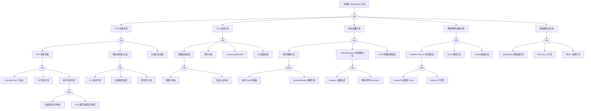

---
title: "StatefulSet 异常故障树分析"
category: skills
summary: "<!-- condition: kubectl get [[Pods|pods]] -n <ns> -l app=<name> -o jsonpath='{range .items[?(@.status.phase!=\'Running\')]} {.metadata.name}{\'\n\'}{end}' 显示 StatefulSet Pod 非 Running --..."
tags: ["k8s", "fta", "troubleshooting"]
sources: ["domain-10-troubleshooting-diagnostics/topic-fta/list/statefulset-fta.md"]
created: 2026-05-21
updated: 2026-05-21
lifecycle: reviewed
lifecycle_changed: "2026-05-21"
tier: supporting
base_confidence: 0.7
---

# StatefulSet 异常故障树分析

<!-- condition: kubectl get pods -n <ns> -l app=<name> -o jsonpath='{range .items[?(@.status.phase!=\"Running\")]} {.metadata.name}{\"\n\"}{end}' 显示 StatefulSet Pod 非 Running -->

# StatefulSet 异常 FTA 树

## 适用范围与说明
- **目标**：覆盖 StatefulSet Pod 启动失败、序号错乱与持久化异常的关键成因与路径。
- **范围**：有序部署、PVC 绑定、存储与网络、镜像与探针、控制器状态。
- **符号**：
  - **OR 门**：任一子事件成立即可触发父事件
  - **AND 门**：所有子事件同时成立才触发父事件

---

## Mermaid FTA 树



---

## 生产级观测与证据
- **事件**：`FailedCreate`、`FailedMount`、`FailedScheduling`、`Unhealthy`、`ProvisioningFailed`。
- **关键指标**：`kube_statefulset_status_replicas`、`kube_statefulset_status_replicas_ready`、`kube_statefulset_status_replicas_current`、`kube_persistentvolumeclaim_status_phase`。
- **关键日志**：`kube-controller-manager`、`kubelet`、CSI 日志、etcd 日志（如果是 etcd StatefulSet）。
- **配置核对**：`volumeClaimTemplates`、滚动策略、Headless Service、资源请求、podManagementPolicy。

---

## JSON 工作流（含与/或门控件）

```json
{
  "flow_steps": [
    { "name": "开始", "action": "start", "step": "start_sts_fta", "next_step": "event_sts_abnormal" },
    { "name": "顶事件: StatefulSet 异常", "action": "event", "step": "event_sts_abnormal", "description": "Pod 未就绪/有序部署卡住/PVC 异常", "next_step": "gate_root_or" },
    { "name": "根因 OR 门", "action": "gate_or", "step": "gate_root_or", "control": "or_gate", "gate_type": "OR", "next_steps": ["cat_pvc", "cat_pod", "cat_order", "cat_net",

## 相关链接

- [[skills/FTA Methodology and Core Principles.md|FTA 方法论]]
- [[skills/FTA Diagnostic Execution Engine.md|FTA 诊断执行引擎]]
- [[ts-workloads|工作负载故障排查]]

## Related

- [[statefulset]] — StatefulSet
- [[kubelet]] — kubelet
- [[etcd]] — etcd
