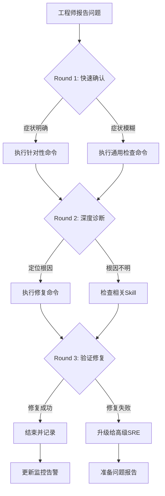

# Control Plane Failure

## 概述

API [[entities/etcd.md|etcd]]/Scheduler 问题的诊断与修复 Skill。

## 快速诊断

```bash
./scripts/diagnose-quick.sh <namespace>
```

## 修复动作

| # | 修复动作 | 风险 |
|---|---------|------|
| R1 | 检查资源配置和状态 | 低 |
| R2 | 重启相关组件 | 中 |

## 验证修复

```bash
./scripts/verify-control-plane.sh <namespace>
```


## 远程顾问信息收集

> 作为远程顾问，我**无法直接连接你的集群**。请帮我收集以下信息，我会根据你提供的内容给出准确的诊断建议。

### 第一步：快速确认（30 秒内回答）

1. **影响范围**：这个问题影响多少个节点 / Pod / 命名空间？
2. **紧急程度**：业务是否已中断？是否有用户投诉？
3. **发生时间**：问题是突然发生还是逐渐恶化？最近是否有变更？

### 第二步：关键信息（请提供你能获取的）

4. **kubectl 版本**：`kubectl version --short` 的输出
5. **K8s 集群版本**：`kubectl get nodes -o wide` 中的 VERSION 列
6. **节点状态**：控制平面节点是否正常？工作节点是否正常？

### 第三步：诊断信息（按需补充）

> 如果以下命令你无法执行，请直接告诉我「无法执行」，我会提供替代方案。

7. **相关组件日志**：`kubectl logs -n <namespace> <pod>` 的最后 30 行
8. **节点资源**：`kubectl top nodes` 或 `kubectl describe node <node>` 的 Capacity/Allocated resources
9. **近期变更**：最近 24 小时是否有部署、扩缩容、配置变更？

### 如果信息不足

如果你目前只能提供部分信息，**请从第一步开始**。我会根据已有信息先给出初步判断，并告诉你还需要收集什么。

> **替代沟通方式**：如果你不方便执行命令，也可以直接描述你看到的页面/告警内容，我会帮你解读。


## 命令替代方案

> 如果你无法执行以下命令，请参考对应的替代方案。

### 通用替代方案

| 原命令 | 无法执行的原因 | 替代方案 A | 替代方案 B |
|:---|:---|:---|:---|
| `kubectl get pods` | 无 kubectl 权限 | 通过集群管理控制台查看 Pod 列表 | 请有权限的同事执行并截图 |
| `kubectl logs <pod>` | 无日志权限 | 查看应用自身的日志文件（/var/log/） | 使用日志聚合系统（如 ELK/Loki）查询 |
| `kubectl describe node <node>` | 无节点查看权限 | 查看监控系统的节点仪表盘 | 使用 `kubectl get node -o yaml`（如权限允许） |
| `ssh <node>` | 无法 SSH 到节点 | 使用 `kubectl debug node/<node> -it --image=busybox` | 通过跳板机访问：`ssh -J bastion <node>` |
| `systemctl status kubelet` | 无法进入节点 | 查看节点上的 kubelet 日志：`kubectl logs -n kube-system <kubelet-pod>` | 查看容器运行时日志 |
| `docker/crictl` | 无容器运行时权限 | 使用 `kubectl exec` 进入容器检查 | 查看容器运行时的事件 |

### 如果以上都无法执行

如果你因为安全策略、网络隔离或权限限制无法执行任何诊断命令：

1. **请收集你能访问的任何信息**：
   - 监控系统的截图
   - 告警通知的内容
   - 应用自身的错误页面/日志
   - 最近是否有变更（部署、扩缩容、配置更新）

2. **如果信息严重不足**：
   - 我会根据你描述的症状给出最可能的根因和修复建议
   - 但请注意：**信息不足时建议的置信度会降低**
   - 如果问题影响严重，建议立即升级给有权限的高级 SRE

3. **紧急情况下**：
   - 如果业务已中断且你无法执行任何操作
   - 请立即联系有集群管理员权限的同事
   - 同时可以准备以下信息以便快速交接：
     - 问题发生时间
     - 影响范围
     - 已尝试的操作
     - 当前的任何异常观察

## 异常反馈处理

以下场景工程师可能给出异常反馈，需准备应对：

- **apiserver间歇性500** → 检查etcd写入延迟和apiserver请求限流

- **etcd healthy但apiserver无法连接** → 检查etcd证书和apiserver启动参数

- **scheduler Pod正常但Pod不调度** → 检查调度器的leader选举状态

- **控制平面组件反复重启** → 检查节点OOM情况和资源预留


## 相关Skill交叉引用

本Skill诊断过程中可能涉及的其他Skill：

- [[domain-10-troubleshooting-diagnostics/topic-skills/06-certificate-expiry.md|06 certificate expiry]]

- [[scripts/video-scripts/node-notready.md|node notready]]

- [[skills/best-practices/scenarios/security-incident.md|security incident]]


当本Skill的诊断步骤无法定位根因时，建议按上述顺序排查相关Skill。


## 远程顾问特别提示

> 作为部署在客户环境之外的远程顾问，以下场景需要特别注意：

### 信息收集优先级
1. **集群版本和发行版** — 不同发行版（EKS/GKE/ACK/OpenShift）的诊断路径差异很大
2. **网络拓扑** — 是否需要VPN/堡垒机？是否有专门的运维跳板机？
3. **变更时间线** — 近24小时内的所有变更（部署、配置更新、节点操作）
4. **监控数据** — 能否提供Prometheus/Grafana截图或导出数据？

### 受限场景处理
| 限制 | 应对策略 |
|:---|:---|
| 工程师无kubectl权限 | 指导使用Dashboard或提供只读kubeconfig |
| 无法SSH节点 | 依赖kubectl debug/node-shell或云平台控制台 |
| 无法访问日志 | 要求导出关键日志片段或使用日志系统查询 |
| 网络隔离无法下载工具 | 使用容器镜像内置工具或busybox |
| 安全策略禁止执行命令 | 转为配置审查和文档指导 |

### 沟通模板
- **开场**："我是远程SRE顾问，无法直接连接您的集群。请按步骤执行命令并反馈结果。"
- **确认**："请执行上述命令，将输出贴回给我。如有任何异常请立即说明。"
- **升级**："当前情况需要升级处理。请同时联系贵司高级SRE，我会准备详细报告。"
- **结束**："问题已定位，请按上述步骤修复。修复后请验证并反馈结果。如有反复随时联系。"

## 预防性措施

### 控制平面高可用
1. **多Master节点**：生产环境至少3个Master节点
2. **etcd备份**：每小时自动备份etcd数据到异地
3. **证书管理**：使用自动续期机制，避免证书过期
4. **资源预留**：Master节点预留50%资源给控制平面组件

### 健康检查
```yaml
- alert: APIServerDown
  expr: up{job="kubernetes-apiservers"} == 0
  for: 2m
  labels:
    severity: critical

- alert: EtcdNoLeader
  expr: etcd_server_has_leader == 0
  for: 1m
  labels:
    severity: critical
```

## 典型生产案例

### 案例：etcd磁盘耗尽导致集群不可用
**场景**：所有kubectl命令超时，apiserver日志显示etcd连接失败。
**诊断**：
1. SSH到master节点：`df -h /var/lib/etcd`
2. 检查etcd日志：`journalctl -u etcd -n 100`
3. etcdctl检查：`etcdctl endpoint health`
**修复**：
1. 清理etcd快照和旧日志
2. 执行etcdctl defrag
3. 扩展磁盘或迁移到更大磁盘
4. 配置etcd自动压缩和defrag

### 案例：apiserver证书过期
**场景**：kubectl返回"x509: certificate has expired"错误。
**诊断**：`openssl x509 -in /etc/kubernetes/pki/apiserver.crt -noout -dates`
**修复**：
1. `kubeadm certs renew all`
2. 重启apiserver静态Pod（移动manifest文件）
3. 更新所有kubeconfig中的证书

## 诊断决策流程



## 工具速查表

| 工具 | 用途 | 典型命令 |
|:---|:---|:---|
| kubectl | Kubernetes CLI | `kubectl get/describe/logs/exec` |
| jq | JSON处理 | `kubectl get ... -o json | jq ...` |
| openssl | 证书检查 | `openssl x509 -in <cert> -noout -dates` |
| tcpdump | 网络抓包 | `tcpdump -i any port <port> -n` |
| strace | 系统调用追踪 | `strace -p <pid> -f` |
| iostat/vmstat | IO/内存监控 | `iostat -x 1` |
| journalctl | 系统日志 | `journalctl -u <service> -f` |
| crictl | 容器运行时 | `crictl ps/logs/inspect` |

## 典型生产案例（扩展）

### 案例 3：apiserver OOM 导致集群间歇性 500
**场景**：电商大促期间，kubectl 命令间歇性超时，Grafana 显示 apiserver Pod 频繁重启，内存使用率达到 95% 以上。

**诊断过程**：
1. 检查 apiserver Pod 状态：`kubectl get pod -n kube-system -l component=kube-apiserver`
2. 查看 apiserver 资源限制：`kubectl describe pod -n kube-system <apiserver-pod> | grep -A5 Limits`
3. 检查 apiserver 日志中的 OOMKilled：`kubectl logs -n kube-system <apiserver-pod> --previous`
4. 分析请求量激增：`kubectl get --raw /metrics | grep apiserver_request_total | grep -v 'code=2'`
5. 检查是否有异常客户端：`kubectl get --raw /metrics | grep apiserver_longrunning_requests`

**根因**：
- 大量 LIST all-namespaces 请求且无分页
- 多个 CI/CD Pipeline 同时执行，并发请求超过 `--max-requests-inflight` 阈值
- apiserver 内存限制设置过低（2Gi）

**修复步骤**：
1. 紧急扩容 apiserver 内存限制到 8Gi：`kubectl edit deployment kube-apiserver -n kube-system`
2. 调整 `--max-requests-inflight=800 --max-mutating-requests-inflight=400`
3. 在异常客户端添加限速：`kubectl edit cm client-rate-limiter -n kube-system`
4. 联系 CI/CD 团队优化 Pipeline，避免全量 LIST
5. 开启 apiserver 请求审计，追踪异常请求来源

**事后复盘**：
- 将 apiserver 内存告警阈值从 80% 下调到 60%
- 所有 CI/CD 工具统一使用 `--chunk-size=500` 分页查询
- 制定大促期间控制平面资源预留预案

---

## etcd 高级运维

### etcd 快照管理

```bash
# 创建快照（在线，无需停服）
ETCDCTL_API=3 etcdctl snapshot save /backup/etcd-$(date +%Y%m%d-%H%M%S).db \
  --endpoints=https://127.0.0.1:2379 \
  --cacert=/etc/kubernetes/pki/etcd/ca.crt \
  --cert=/etc/kubernetes/pki/etcd/server.crt \
  --key=/etc/kubernetes/pki/etcd/server.key

# 验证快照完整性
ETCDCTL_API=3 etcdctl snapshot status /backup/etcd-<timestamp>.db

# 查看快照详情（Revision、Total Key、Hash）
ETCDCTL_API=3 etcdctl snapshot status /backup/etcd-<timestamp>.db -w json | jq .
```

**快照策略**：
| 类型 | 频率 | 保留 | 存储位置 |
|:---|:---|:---|:---|
| 增量快照 | 每 6 小时 | 7 天 | 本地 SSD + NFS |
| 全量快照 | 每日凌晨 02:00 | 30 天 | 异地对象存储（S3/OSS） |
| 关键变更前 | 手动触发 | 永久 | 版本控制仓库 |

### etcd 数据恢复

> ⚠️ **🔴 灾难性操作** — 含不可逆命令，执行前必须满足变更窗口+双人复核+事前备份+回滚方案
> - `etcdctl snapshot restore`：用快照覆盖 etcd 数据目录，集群状态强制回退
> - `rm -rf (系统/数据路径)`：删除系统或数据文件，可能摧毁节点或丢失全部数据
> - `systemctl stop/restart`：停止/重启系统服务，影响节点上所有容器

```bash
# 1. 停止所有 etcd 成员（确保数据一致性）
systemctl stop etcd

# 2. 备份当前数据目录（即使已损坏）
cp -r /var/lib/etcd /var/lib/etcd.bak.$(date +%s)

# 3. 恢复快照到新目录
ETCDCTL_API=3 etcdctl snapshot restore /backup/etcd-<timestamp>.db \
  --data-dir=/var/lib/etcd-new \
  --name=master-1 \
  --initial-cluster=master-1=https://10.0.0.1:2380,master-2=https://10.0.0.2:2380,master-3=https://10.0.0.3:2380 \
  --initial-cluster-token=etcd-cluster-1 \
  --initial-advertise-peer-urls=https://10.0.0.1:2380

# 4. 替换数据目录并重启
rm -rf /var/lib/etcd  # ⚠️ 删除系统/数据文件
mv /var/lib/etcd-new /var/lib/etcd
systemctl start etcd

# 5. 验证恢复
ETCDCTL_API=3 etcdctl endpoint health
```

### etcd 成员管理

> ⚠️ **🔴 灾难性操作** — 含不可逆命令，执行前必须满足变更窗口+双人复核+事前备份+回滚方案
> - `etcdctl member remove`：移除 etcd 成员，误删多数派会致集群不可用/丢数据

```bash
# 查看成员列表
ETCDCTL_API=3 etcdctl member list -w table

# 移除问题成员（quorum 未丢失时）
ETCDCTL_API=3 etcdctl member remove <member-id>  # ⚠️ 移除 etcd 成员，可能丢数据

# 添加新成员
ETCDCTL_API=3 etcdctl member add <new-member-name> --peer-urls=https://<ip>:2380
# 然后在新节点使用 kubeadm 或手动启动 etcd

# 迁移 leader 到指定节点（维护前）
ETCDCTL_API=3 etcdctl move-leader <target-member-id>

# 检查 leader 分布（避免单节点压力过大）
ETCDCTL_API=3 etcdctl endpoint status --cluster -w table
```

**成员变更注意事项**：
- 永远不要同时添加或移除多个成员，这会改变 quorum 计算
- 成员变更前必须确保快照已备份
- 新加入的成员初始会触发全量同步，注意网络带宽
- 如果 quorum 已丢失（如 3 节点集群 2 节点问题），必须使用快照恢复

---

## API Server 性能调优

### 关键参数调优

| 参数 | 默认值 | 建议值 | 说明 |
|:---|:---|:---|:---|
| `--max-requests-inflight` | 400 | 800-1200 | 非变更请求并发上限 |
| `--max-mutating-requests-inflight` | 200 | 400-600 | 变更请求并发上限 |
| `--request-timeout` | 60s | 60s | 请求超时（ LIST 大 namespace 时可能需要调大）|
| `--watch-cache-sizes` | 根据资源 | 'pods#10000,configmaps#5000' | 热点资源 watch cache 大小 |
| `--target-ram-mb` | 自动 | 根据节点内存 | apiserver 目标内存使用 |
| `--etcd-compaction-interval` | 5m | 5m | etcd 压缩间隔 |
| `--goaway-chance` | 0 | 0.001 | 长连接优雅断开概率 |

### 性能监控指标

```bash
# 请求延迟分位数
kubectl get --raw /metrics | grep 'apiserver_request_duration_seconds_bucket{verb="LIST"'

# 当前 inflight 请求数
kubectl get --raw /metrics | grep 'apiserver_current_inflight_requests'

# etcd 请求延迟（apiserver → etcd）
kubectl get --raw /metrics | grep 'etcd_request_duration_seconds'

# 丢弃的请求数（过载保护触发）
kubectl get --raw /metrics | grep 'apiserver_dropped_requests_total'

# watch 缓存命中率
kubectl get --raw /metrics | grep 'apiserver_cache_list_hit_total'
```

### 常见性能瓶颈

1. **etcd 磁盘延迟过高**
   - 症状：apiserver 请求延迟抖动，etcd `wal_fsync_duration_seconds` > 10ms
   - 解决：使用 SSD/NVMe，将 etcd 数据目录独立挂载

2. **watch 连接过多**
   - 症状：apiserver 内存持续增长，CPU 高
   - 解决：减少不必要的 informer，增加 `--watch-cache-sizes`

3. **大型 LIST 请求**
   - 症状：apiserver 内存尖峰，etcd 读压力大
   - 解决：客户端使用分页（`--chunk-size`），限制 `limitranges`

---

## 控制平面升级 SOP

### 升级前检查清单

```bash
# 1. 确认当前版本
kubectl version
kubeadm version

# 2. 检查集群健康状态
kubectl get nodes
kubectl get pods -n kube-system
etcdctl endpoint health

# 3. 备份 etcd
ETCDCTL_API=3 etcdctl snapshot save /backup/pre-upgrade-$(date +%Y%m%d).db

# 4. 检查 kubeadm 升级计划
kubeadm upgrade plan

# 5. 确认 CNI 插件兼容性
kubectl get pods -n kube-system -l k8s-app=calico-node  # 或其他 CNI

```

### 升级步骤（滚动升级）

**Master 节点逐个升级**：
1. 排空节点：`kubectl drain <master-node> --ignore-daemonsets`
2. 升级 kubeadm：`apt-get install -y kubeadm=<target-version>`
3. 执行控制平面升级：`kubeadm upgrade apply <target-version>`
4. 升级 kubelet：`apt-get install -y kubelet=<target-version>`
5. 重启 kubelet：`systemctl restart kubelet`
6. 恢复节点：`kubectl uncordon <master-node>`
7. 验证：`kubectl get nodes`，等待 Ready
8. 继续下一个 Master 节点

**Worker 节点升级**：
1. 排空节点：`kubectl drain <worker-node> --ignore-daemonsets`
2. 升级 kubeadm：`apt-get install -y kubeadm=<target-version>`
3. 升级节点配置：`kubeadm upgrade node`
4. 升级 kubelet：`apt-get install -y kubelet=<target-version>`
5. 重启 kubelet：`systemctl restart kubelet`
6. 恢复节点：`kubectl uncordon <worker-node>`

### 升级回滚方案

如果升级后出现严重问题：
1. 如有 etcd 备份，可以从快照恢复
2. 如果 kubeadm 升级失败，可以使用 `kubeadm upgrade rollback`（部分版本支持）
3. 紧急情况下，恢复静态 Pod manifest 到旧版本
4. 联系厂商支持或社区，准备详细的日志和错误信息

---

## 预防性措施（扩展）

### 自动化运维
```bash
# etcd 自动压缩和碎片整理（cron 任务）
0 2 * * * ETCDCTL_API=3 etcdctl compact $(ETCDCTL_API=3 etcdctl endpoint status --write-out="json" | jq -r '.[0].Status.header.revision' | awk '{print $1 - 10000}') && ETCDCTL_API=3 etcdctl defrag

# 证书到期自动告警（PrometheusRule）
- alert: KubernetesCertificateExpiry
  expr: apiserver_client_certificate_expiration_seconds_count / apiserver_client_certificate_expiration_seconds_sum < 86400 * 7
  for: 1h
  labels:
    severity: warning
  annotations:
    summary: "Kubernetes certificate expires in less than 7 days"
```

### 容量规划
| 集群规模 | etcd 节点 | Master CPU | Master 内存 | 磁盘 IOPS |
|:---|:---|:---|:---|:---|
| < 50 节点 | 3 | 2 core | 4 GB | 3000+ |
| 50-200 节点 | 3 | 4 core | 8 GB | 5000+ |
| 200-500 节点 | 5 | 8 core | 16 GB | 10000+ |
| > 500 节点 | 5-7 | 16 core | 32 GB | 20000+ SSD |

### 变更管理
1. **变更窗口**：所有控制平面变更必须在维护窗口执行
2. **变更评审**：涉及 etcd、apiserver 的变更需二级 SRE 审批
3. **灰度验证**：先在测试集群验证，再在生产集群执行
4. **回滚预案**：每次变更必须附带明确的回滚步骤
5. **监控值守**：变更期间安排专人监控控制平面指标

## 远程顾问执行清单

- [ ] 确认工程师身份和环境访问权限
- [ ] 收集集群版本、发行版、网络拓扑
- [ ] 确认问题影响范围和紧急程度
- [ ] 指导执行 Round 1 命令并收集输出
- [ ] 分析输出，选择 Round 2 分支
- [ ] 指导执行 Round 2 命令并收集输出
- [ ] 定位根因，提供修复方案
- [ ] 指导执行修复命令并验证
- [ ] 确认修复成功，更新相关文档
- [ ] 评估是否需要升级或事后复盘


## 相关概念

- [[concepts/kubernetes-architecture-overview.md|Kubernetes 架构概览]] — Kubernetes 控制平面与工作节点架构设计

```

## Related

- [[visibility-public|#visibility/public Hub]] — tag hub
