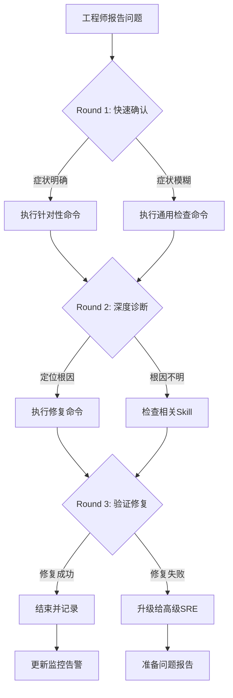

# K8s Monitoring & Alerting Failure 诊断与修复

[[Prometheus|Prometheus]]、Grafana 和 Alertmanager 是 [[Kubernetes|Kubernetes]] 可观测性栈的核心。当监控异常时，可能导致问题发现延迟、告警漏报，使 SRE 团队处于"盲飞"状态。

本 [[SKILL|Skill]] 覆盖 Prometheus 采集失败、Grafana 数据源异常、Alertmanager 不发送通知、规则配置错误等全部常见根因的诊断和修复。

## 何时使用此 Skill

| 症状 | 检测方法 | 置信度 |
|------|---------|--------|
| Prometheus target 显示 DOWN | Prometheus UI / `kubectl get servicemonitor` | 0.95 |
| Grafana 面板无数据 | Grafana UI | 0.90 |
| Alertmanager 不发送通知 | 测试告警 | 0.85 |
| Prometheus Pod OOMKilled | `kubectl get pods -n monitoring` | 0.90 |
| Rule evaluation errors | Prometheus logs | 0.85 |

**排除条件**: 节点资源压力 → SKILL-NODE-001; 网络不通 → SKILL-NET-001

## 快速分级（2 分钟内完成）

```
影响范围
├── 生产监控完全不可用 ──────────→ P0（15min 内修复）
├── 部分指标缺失或告警漏报 ──────→ P1（30min 内修复）
├── Grafana 面板异常 ────────────→ P2（2h 内修复）
└── 非关键告警规则问题 ──────────→ P3（4h 内处理）
```

**立即升级条件**:
- 所有生产监控和告警同时中断
- Prometheus 数据持久化损坏
- 安全事件导致监控数据被篡改

## 执行流程

```
工单/告警触发
    │
    ▼
┌──────────────┐    脚本: scripts/diagnose-quick.sh
│ Phase 1      │    内容: kubectl + promql 快速检查（只读）
│ 快速检查      │    Step: D1.1-D1.5
└──────┬───────┘
       │ 确认根因
       ▼
┌──────────────┐    参考: reference/remediation-playbook.md
│ 修复操作      │    风险: LOW → MEDIUM → HIGH
│ REM-001~006  │
└──────┬───────┘
       │
       ▼
┌──────────────┐    脚本: scripts/verify-monitoring.sh
│ 验证确认      │    检查: Prometheus/Grafana/Alertmanager
└──────────────┘
```

## 可用脚本

| 脚本 | 用途 | 参数 | 风险 |
|------|------|------|------|
| `scripts/diagnose-quick.sh` | 监控告警快速诊断 | `MONITORING_NAMESPACE` | 只读 |
| `scripts/verify-monitoring.sh` | 修复后验证 | `MONITORING_NAMESPACE` | 只读 |

## 根因概览 (6 种)

| RC ID | 根因 | 概率 | 首选修复 | 风险 |
|-------|------|------|---------|------|
| RC-001 | Prometheus 存储满或 OOM | 高 | REM-001 扩容/清理 | MEDIUM |
| RC-002 | ServiceMonitor/PodMonitor 选择器错误 | 高 | REM-002 修正选择器 | LOW |
| RC-003 | Grafana 数据源配置错误 | 中 | REM-003 修正数据源 | LOW |
| RC-004 | Alertmanager 路由/接收器配置错误 | 中 | REM-004 修正配置 | LOW |
| RC-005 | 告警规则语法错误 | 中 | REM-005 修正规则 | LOW |
| RC-006 | 网络策略阻止抓取 | 低 | REM-006 调整策略 | MEDIUM |

## 关联资源

| 资源 | 路径 |
|------|------|
| 修复操作手册 | [reference/remediation-playbook.md](./reference/remediation-playbook.md) |
| 单文件完整版 | [../15-monitoring-alerting-failure.md](../15-monitoring-alerting-failure.md) |

## Related

- Observability 知识图谱索引


## 远程顾问信息收集

> 作为远程顾问，我**无法直接连接你的集群**。请帮我收集以下信息，我会根据你提供的内容给出准确的诊断建议。

### 第一步：快速确认（30 秒内回答）

1. **影响范围**：这个问题影响多少个节点 / Pod / 命名空间？
2. **紧急程度**：业务是否已中断？是否有用户投诉？
3. **发生时间**：问题是突然发生还是逐渐恶化？最近是否有变更？

### 第二步：关键信息（请提供你能获取的）

4. **kubectl 版本**：`kubectl version --short` 的输出
5. **K8s 集群版本**：`kubectl get nodes -o wide` 中的 VERSION 列
6. **节点状态**：控制平面节点是否正常？工作节点是否正常？

### 第三步：诊断信息（按需补充）

> 如果以下命令你无法执行，请直接告诉我「无法执行」，我会提供替代方案。

7. **相关组件日志**：`kubectl logs -n <namespace> <pod>` 的最后 30 行
8. **节点资源**：`kubectl top nodes` 或 `kubectl describe node <node>` 的 Capacity/Allocated resources
9. **近期变更**：最近 24 小时是否有部署、扩缩容、配置变更？

### 如果信息不足

如果你目前只能提供部分信息，**请从第一步开始**。我会根据已有信息先给出初步判断，并告诉你还需要收集什么。

> **替代沟通方式**：如果你不方便执行命令，也可以直接描述你看到的页面/告警内容，我会帮你解读。


## 命令替代方案

> 如果你无法执行以下命令，请参考对应的替代方案。

### 通用替代方案

| 原命令 | 无法执行的原因 | 替代方案 A | 替代方案 B |
|:---|:---|:---|:---|
| `kubectl get pods` | 无 kubectl 权限 | 通过集群管理控制台查看 Pod 列表 | 请有权限的同事执行并截图 |
| `kubectl logs <pod>` | 无日志权限 | 查看应用自身的日志文件（/var/log/） | 使用日志聚合系统（如 ELK/Loki）查询 |
| `kubectl describe node <node>` | 无节点查看权限 | 查看监控系统的节点仪表盘 | 使用 `kubectl get node -o yaml`（如权限允许） |
| `ssh <node>` | 无法 SSH 到节点 | 使用 `kubectl debug node/<node> -it --image=busybox` | 通过跳板机访问：`ssh -J bastion <node>` |
| `systemctl status kubelet` | 无法进入节点 | 查看节点上的 kubelet 日志：`kubectl logs -n kube-system <kubelet-pod>` | 查看容器运行时日志 |
| `docker/crictl` | 无容器运行时权限 | 使用 `kubectl exec` 进入容器检查 | 查看容器运行时的事件 |

### 如果以上都无法执行

如果你因为安全策略、网络隔离或权限限制无法执行任何诊断命令：

1. **请收集你能访问的任何信息**：
   - 监控系统的截图
   - 告警通知的内容
   - 应用自身的错误页面/日志
   - 最近是否有变更（部署、扩缩容、配置更新）

2. **如果信息严重不足**：
   - 我会根据你描述的症状给出最可能的根因和修复建议
   - 但请注意：**信息不足时建议的置信度会降低**
   - 如果问题影响严重，建议立即升级给有权限的高级 SRE

3. **紧急情况下**：
   - 如果业务已中断且你无法执行任何操作
   - 请立即联系有集群管理员权限的同事
   - 同时可以准备以下信息以便快速交接：
     - 问题发生时间
     - 影响范围
     - 已尝试的操作
     - 当前的任何异常观察

## 异常反馈处理

以下场景工程师可能给出异常反馈，需准备应对：

- **Prometheus targets显示DOWN** → 检查ServiceMonitor和Pod标签

- **告警触发但不发送通知** → 检查Alertmanager路由和接收器配置

- **指标数据缺失** → 检查exporter和ServiceDiscovery配置

- **Prometheus OOM** → 增加内存限制或调整scrape interval


## 相关Skill交叉引用

本Skill诊断过程中可能涉及的其他Skill：

- k8s-performance

- [[skills/ts-control-plane.md|ts control plane]]


当本Skill的诊断步骤无法定位根因时，建议按上述顺序排查相关Skill。

## 预防性措施

### 监控体系设计
1. **多层监控**：基础设施层 + 平台层 + 应用层 + 业务层
2. **黄金信号**：延迟、流量、错误率、饱和度四个维度
3. **告警分级**：P0（立即响应）/ P1（30分钟内）/ P2（工作时间内）
4. **告警降噪**：避免重复告警，合并相关告警

### SLO定义
```yaml
# 示例SLO
- name: api-availability
  target: 99.9%
  window: 30d
  burnRateAlerts:
    - factor: 14.4  # 2% budget in 1 hour
    - factor: 6      # 5% budget in 6 hours
    - factor: 2      # 10% budget in 3 days
```

## 诊断决策流程



## 工具速查表

| 工具 | 用途 | 典型命令 |
|:---|:---|:---|
| kubectl | Kubernetes CLI | `kubectl get/describe/logs/exec` |
| jq | JSON处理 | `kubectl get ... -o json | jq ...` |
| openssl | 证书检查 | `openssl x509 -in <cert> -noout -dates` |
| tcpdump | 网络抓包 | `tcpdump -i any port <port> -n` |
| strace | 系统调用追踪 | `strace -p <pid> -f` |
| iostat/vmstat | IO/内存监控 | `iostat -x 1` |
| journalctl | 系统日志 | `journalctl -u <service> -f` |
| crictl | 容器运行时 | `crictl ps/logs/inspect` |

## 远程顾问执行清单

- [ ] 确认工程师身份和环境访问权限
- [ ] 收集集群版本、发行版、网络拓扑
- [ ] 确认问题影响范围和紧急程度
- [ ] 指导执行Round 1命令并收集输出
- [ ] 分析输出，选择Round 2分支
- [ ] 指导执行Round 2命令并收集输出
- [ ] 定位根因，提供修复方案
- [ ] 指导执行修复命令并验证
- [ ] 确认修复成功，更新相关文档
- [ ] 评估是否需要升级或事后复盘

## 典型生产案例

### 案例：Prometheus数据丢失导致问题无法定位
**场景**：生产问题发生后，发现Prometheus近6小时数据缺失。
**诊断**：
1. kubectl get pods -n monitoring -l app=prometheus
2. kubectl logs prometheus-k8s-0 -n monitoring --tail=100
3. df -h /prometheus (在prometheus容器内)
**修复**：
1. 清理旧数据或扩展PVC: kubectl patch pvc prometheus-k8s-db-prometheus-k8s-0 -p '{"spec":{"resources":{"requests":{"storage":"100Gi"}}}}'
2. 降低retention时间或增加Thanos Sidecar远程存储
3. 配置数据缺失告警
**教训**：监控系统的存储容量需提前规划，避免自身成为单点问题。


## 相关概念

- [[concepts/observability-stack-evolution.md|可观测性技术栈演进]] — 指标、日志、追踪三大支柱的演进与整合

```