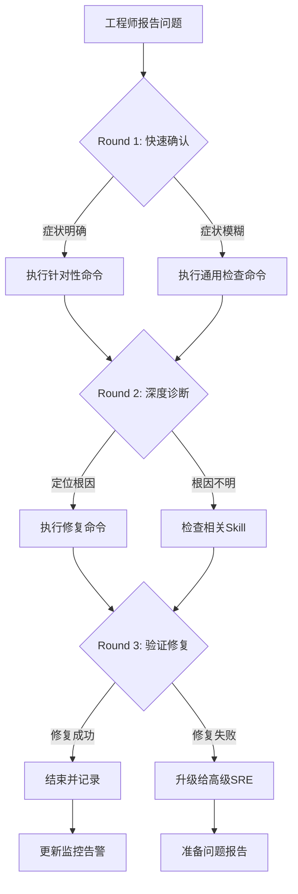

# Pod CrashLoopBackOff / OOMKilled 诊断与修复

## 概述

Pod CrashLoopBackOff 和 OOMKilled 是 [[Kubernetes|Kubernetes]] 工作负载中最常见的问题类型。本 Skill 覆盖从症状识别到修复验证的完整闭环。

**典型触发场景**：
1. 应用代码异常导致容器反复退出（退出码 1）
2. 内存限制过低触发 OOMKilled（退出码 137）
3. 健康检查配置不当导致误判
4. 启动依赖未就绪（如数据库连接失败）

## 症状识别

| # | 症状描述 | 检测方法 | 置信度 | 排除条件 |
|---|---------|---------|--------|---------|
| S1 | Pod 状态 CrashLoopBackOff | `kubectl get [[Pods|pods]]` | 0.95 | Job 完成后正常退出 |
| S2 | Pod 状态 OOMKilled | `kubectl describe pod` | 0.95 | 节点内存充足但 limit 过低 |
| S3 | Restart Count 持续增长 | `kubectl get pods` | 0.90 | 手动滚动更新期间 |
| S4 | 应用日志含 ERROR/FATAL | `kubectl logs --previous` | 0.85 | 日志级别配置错误 |

## 快速诊断

```bash
# 15 秒快速诊断
./scripts/diagnose-quick.sh <namespace> <pod-name>
```

## 深度诊断

```bash
# 2-5 分钟深度诊断
./scripts/diagnose-deep.sh <namespace> <pod-name>
```

## 修复动作

### 低风险修复（L2 自动）

| # | 修复动作 | 适用场景 | 风险 |
|---|---------|---------|------|
| R1 | 增加内存 limit | OOMKilled，节点内存充足 | 低 |
| R2 | 调整健康检查阈值 | 启动慢导致探针失败 | 低 |
| R3 | 更新 ConfigMap | 配置错误导致启动失败 | 低 |

### 中风险修复（需确认）

| # | 修复动作 | 适用场景 | 风险 |
|---|---------|---------|------|
| R4 | 回滚 Deployment | 新版本引入 Bug | 中（回滚影响） |
| R5 | 强制删除 Pod | Pod 卡在 Terminating | 中（数据丢失风险） |

### 高风险修复（人工执行）

| # | 修复动作 | 适用场景 | 风险 |
|---|---------|---------|------|
| R6 | 修改节点内核参数 | 系统级限制导致崩溃 | 高 |

## 危险操作

- **动作**: `kubectl delete pod <pod> --force --grace-period=0`
  - **风险**: 强制删除可能导致数据不一致或 [[StatefulSet|StatefulSet]] 状态异常
  - **确认要求**: 是
- **动作**: 修改 StatefulSet 的 volumeClaimTemplates
  - **风险**: 可能导致 PVC 丢失或数据不可访问
  - **确认要求**: 是

## 验证修复

```bash
# 修复后验证
./scripts/verify-pod.sh <namespace> <pod-name>
```

验证检查项：
1. Pod 状态为 Running
2. 容器 Ready=true
3. Restart Count 未增加
4. 无 OOMKilled 记录
5. 日志无 ERROR/FATAL

## 升级条件

- 修复后 5 分钟内 Pod 仍 CrashLoopBackOff → 升级至 SKILL-WORK-001
- 涉及数据库/消息队列有状态服务 → 升级至 SKILL-STORE-001
- 集群级多 Pod 同时问题 → 升级至 SKILL-NODE-001


## 远程顾问信息收集

> 作为远程顾问，我**无法直接连接你的集群**。请帮我收集以下信息，我会根据你提供的内容给出准确的诊断建议。

### 第一步：快速确认（30 秒内回答）

1. **影响范围**：这个问题影响多少个节点 / Pod / 命名空间？
2. **紧急程度**：业务是否已中断？是否有用户投诉？
3. **发生时间**：问题是突然发生还是逐渐恶化？最近是否有变更？

### 第二步：关键信息（请提供你能获取的）

4. **kubectl 版本**：`kubectl version --short` 的输出
5. **K8s 集群版本**：`kubectl get nodes -o wide` 中的 VERSION 列
6. **节点状态**：控制平面节点是否正常？工作节点是否正常？

### 第三步：诊断信息（按需补充）

> 如果以下命令你无法执行，请直接告诉我「无法执行」，我会提供替代方案。

7. **相关组件日志**：`kubectl logs -n <namespace> <pod>` 的最后 30 行
8. **节点资源**：`kubectl top nodes` 或 `kubectl describe node <node>` 的 Capacity/Allocated resources
9. **近期变更**：最近 24 小时是否有部署、扩缩容、配置变更？

### 如果信息不足

如果你目前只能提供部分信息，**请从第一步开始**。我会根据已有信息先给出初步判断，并告诉你还需要收集什么。

> **替代沟通方式**：如果你不方便执行命令，也可以直接描述你看到的页面/告警内容，我会帮你解读。


## 命令替代方案

> 如果你无法执行以下命令，请参考对应的替代方案。

### 通用替代方案

| 原命令 | 无法执行的原因 | 替代方案 A | 替代方案 B |
|:---|:---|:---|:---|
| `kubectl get pods` | 无 kubectl 权限 | 通过集群管理控制台查看 Pod 列表 | 请有权限的同事执行并截图 |
| `kubectl logs <pod>` | 无日志权限 | 查看应用自身的日志文件（/var/log/） | 使用日志聚合系统（如 ELK/Loki）查询 |
| `kubectl describe node <node>` | 无节点查看权限 | 查看监控系统的节点仪表盘 | 使用 `kubectl get node -o yaml`（如权限允许） |
| `ssh <node>` | 无法 SSH 到节点 | 使用 `kubectl debug node/<node> -it --image=busybox` | 通过跳板机访问：`ssh -J bastion <node>` |
| `systemctl status kubelet` | 无法进入节点 | 查看节点上的 kubelet 日志：`kubectl logs -n kube-system <kubelet-pod>` | 查看容器运行时日志 |
| `docker/crictl` | 无容器运行时权限 | 使用 `kubectl exec` 进入容器检查 | 查看容器运行时的事件 |

### 如果以上都无法执行

如果你因为安全策略、网络隔离或权限限制无法执行任何诊断命令：

1. **请收集你能访问的任何信息**：
   - 监控系统的截图
   - 告警通知的内容
   - 应用自身的错误页面/日志
   - 最近是否有变更（部署、扩缩容、配置更新）

2. **如果信息严重不足**：
   - 我会根据你描述的症状给出最可能的根因和修复建议
   - 但请注意：**信息不足时建议的置信度会降低**
   - 如果问题影响严重，建议立即升级给有权限的高级 SRE

3. **紧急情况下**：
   - 如果业务已中断且你无法执行任何操作
   - 请立即联系有集群管理员权限的同事
   - 同时可以准备以下信息以便快速交接：
     - 问题发生时间
     - 影响范围
     - 已尝试的操作
     - 当前的任何异常观察

## 异常反馈处理

以下场景工程师可能给出异常反馈，需准备应对：

- **kubectl logs无输出** → 使用kubectl logs --previous或kubectl describe查看Last State

- **CrashLoopBackOff但应用日志正常** → 检查存活探针配置是否过严

- **容器启动后立即退出** → 检查entrypoint/command配置

- **反复OOMKilled但limit已调高** → 检查是否有内存泄漏或并发突增


## 相关Skill交叉引用

本Skill诊断过程中可能涉及的其他Skill：

- k8s-image-pull

- k8s-config-secret

- k8s-performance


当本Skill的诊断步骤无法定位根因时，建议按上述顺序排查相关Skill。


## 远程顾问特别提示

> 作为部署在客户环境之外的远程顾问，以下场景需要特别注意：

### 信息收集优先级
1. **集群版本和发行版** — 不同发行版（EKS/GKE/ACK/OpenShift）的诊断路径差异很大
2. **网络拓扑** — 是否需要VPN/堡垒机？是否有专门的运维跳板机？
3. **变更时间线** — 近24小时内的所有变更（部署、配置更新、节点操作）
4. **监控数据** — 能否提供Prometheus/Grafana截图或导出数据？

### 受限场景处理
| 限制 | 应对策略 |
|:---|:---|
| 工程师无kubectl权限 | 指导使用Dashboard或提供只读kubeconfig |
| 无法SSH节点 | 依赖kubectl debug/node-shell或云平台控制台 |
| 无法访问日志 | 要求导出关键日志片段或使用日志系统查询 |
| 网络隔离无法下载工具 | 使用容器镜像内置工具或busybox |
| 安全策略禁止执行命令 | 转为配置审查和文档指导 |

### 沟通模板
- **开场**："我是远程SRE顾问，无法直接连接您的集群。请按步骤执行命令并反馈结果。"
- **确认**："请执行上述命令，将输出贴回给我。如有任何异常请立即说明。"
- **升级**："当前情况需要升级处理。请同时联系贵司高级SRE，我会准备详细报告。"
- **结束**："问题已定位，请按上述步骤修复。修复后请验证并反馈结果。如有反复随时联系。"

## 预防性措施

### 应用健壮性设计
1. **优雅启动**：确保readinessProbe配置合理，避免过早接收流量
2. **优雅关闭**：配置preStop钩子和terminationGracePeriod
3. **资源预留**：requests设置为正常峰值的70%，limits设置为峰值的150%
4. **依赖检查**：启动时检查外部依赖可用性，不可用时快速失败

### CI/CD防护
1. **准入检查**：Pipeline中增加资源限制校验
2. **灰度发布**：金丝雀发布比例建议5%→25%→50%→100%
3. **自动回滚**：健康检查失败自动触发rollback
4. **镜像安全**：构建时扫描CVE，高危漏洞阻断发布

## 诊断决策流程



## 工具速查表

| 工具 | 用途 | 典型命令 |
|:---|:---|:---|
| kubectl | Kubernetes CLI | `kubectl get/describe/logs/exec` |
| jq | JSON处理 | `kubectl get ... -o json \| jq ...` |
| openssl | 证书检查 | `openssl x509 -in <cert> -noout -dates` |
| tcpdump | 网络抓包 | `tcpdump -i any port <port> -n` |
| strace | 系统调用追踪 | `strace -p <pid> -f` |
| iostat/vmstat | IO/内存监控 | `iostat -x 1` |
| journalctl | 系统日志 | `journalctl -u <service> -f` |
| crictl | 容器运行时 | `crictl ps/logs/inspect` |

## 远程顾问执行清单

- [ ] 确认工程师身份和环境访问权限
- [ ] 收集集群版本、发行版、网络拓扑
- [ ] 确认问题影响范围和紧急程度
- [ ] 指导执行Round 1命令并收集输出
- [ ] 分析输出，选择Round 2分支
- [ ] 指导执行Round 2命令并收集输出
- [ ] 定位根因，提供修复方案
- [ ] 指导执行修复命令并验证
- [ ] 确认修复成功，更新相关文档
- [ ] 评估是否需要升级或事后复盘


## 相关概念

- [[concepts/pod-lifecycle|Pod 生命周期]] — Pod 创建、运行、终止的完整生命周期
